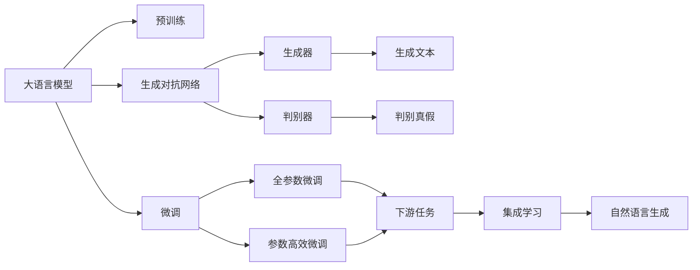
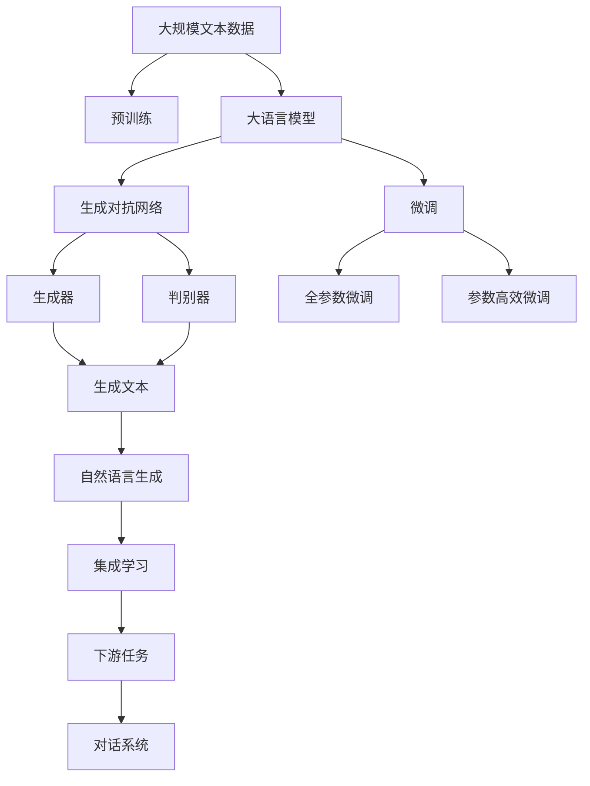

                 

# 大语言模型应用指南：Generative Agents

> 关键词：大语言模型,生成对抗网络(GAN),自监督学习,无监督学习,强化学习,语言生成,对话系统,语言模型

## 1. 背景介绍

### 1.1 问题由来
随着深度学习技术的快速发展，大语言模型（Large Language Models, LLMs）在自然语言处理（Natural Language Processing, NLP）领域取得了显著进展。这些模型通过在大规模无标签文本数据上进行自监督预训练，学习到了丰富的语言知识和常识，具备强大的语言理解和生成能力。然而，尽管预训练模型的性能非常出色，但它们在大规模无标注数据上训练的成果有时未必能直接应用于特定任务，仍需通过微调（Fine-Tuning）来提升其性能。

为了进一步提高模型的性能，研究者们开始探索将大语言模型应用于生成对抗网络（Generative Adversarial Networks, GANs）中，以实现更高效、更准确的生成任务。这一范式被称为生成型语言模型（Generative Language Models），通过结合生成对抗网络和预训练模型，可以在不依赖大量标注数据的情况下，生成高质量的自然语言文本，应用于对话系统、文本生成、内容创作等多个领域。

### 1.2 问题核心关键点
生成型语言模型的核心思想是，通过预训练大语言模型和生成对抗网络的协同工作，生成更符合任务需求的自然语言文本。这一方法包括以下几个关键步骤：

1. **预训练大语言模型**：在大规模无标签数据上进行自监督预训练，学习语言的通用表征。
2. **生成对抗网络**：通过生成器和判别器的对抗训练，生成更逼真的文本。
3. **微调**：在特定任务上微调生成模型，以提升其针对该任务的表现。
4. **集成学习**：将预训练模型和生成对抗网络的输出进行集成，得到最终的生成结果。

生成型语言模型结合了大模型的通用知识和生成对抗网络的对抗训练能力，能够在生成任务上取得更优的性能。

### 1.3 问题研究意义
研究生成型语言模型对于拓展大模型的应用范围、提升特定任务性能、加速NLP技术的产业化进程具有重要意义：

1. **降低应用开发成本**：通过预训练大模型，可以减少从头开发所需的数据、计算和人力成本投入。
2. **提升模型效果**：生成型语言模型能够在大规模无标注数据上生成高质量的自然语言文本，适用于各种NLP下游任务，如对话、摘要、翻译等。
3. **加速开发进度**：利用预训练模型的泛化能力，可以快速适应新任务，缩短开发周期。
4. **带来技术创新**：生成对抗网络和大语言模型的结合，催生了新的研究方向，如零样本学习和少样本学习等。
5. **赋能产业升级**：生成型语言模型易于被各行各业采用，为传统行业数字化转型升级提供新的技术路径。

## 2. 核心概念与联系

### 2.1 核心概念概述

为更好地理解生成型语言模型，本节将介绍几个密切相关的核心概念：

- **生成对抗网络（GAN）**：一种通过生成器和判别器的对抗训练生成高质量数据的深度学习模型。
- **大语言模型（LLM）**：以自回归（如GPT）或自编码（如BERT）模型为代表的预训练语言模型。
- **自监督学习（SSL）**：通过无标签数据进行训练，学习模型对数据的自监督表示。
- **无监督学习（Unsupervised Learning）**：通过未标注数据进行训练，学习模型的隐含表示。
- **强化学习（RL）**：通过与环境的交互，最大化累积奖励的策略学习。
- **语言生成（NLG）**：生成自然语言文本的过程，是生成型语言模型的核心应用之一。
- **对话系统（Chatterbot）**：通过自然语言生成和理解技术实现的智能对话系统。

这些核心概念之间通过以下Mermaid流程图展示了它们之间的联系：



这个流程图展示了生成型语言模型的核心概念及其之间的关系：

1. 大语言模型通过预训练获得基础能力。
2. 生成对抗网络通过生成器和判别器的对抗训练，生成逼真的文本。
3. 微调通过优化模型参数，提高其在特定任务上的性能。
4. 集成学习将预训练模型和生成对抗网络的输出结合，得到最终的生成结果。
5. 自然语言生成是生成型语言模型的最终应用。

### 2.2 概念间的关系

这些核心概念之间存在着紧密的联系，形成了生成型语言模型的完整生态系统。

- **大语言模型的生成能力**：大语言模型通过预训练学习到丰富的语言知识，能够生成高质量的自然语言文本。
- **生成对抗网络的生成能力**：生成对抗网络通过对抗训练生成逼真的文本，提升了模型的生成效果。
- **微调与参数高效微调**：微调通过优化模型参数，使模型更适用于特定任务。参数高效微调则是在微调过程中只更新少量模型参数，避免过拟合。
- **无监督学习与自监督学习**：无监督学习和自监督学习通过利用大规模无标注数据进行训练，增强了模型的泛化能力。

这些概念共同构成了生成型语言模型的学习和应用框架，使其能够在各种场景下发挥强大的语言生成能力。通过理解这些核心概念，我们可以更好地把握生成型语言模型的工作原理和优化方向。

### 2.3 核心概念的整体架构

最后，我们用一个综合的流程图来展示这些核心概念在大语言模型生成任务中的整体架构：



这个综合流程图展示了从预训练到生成、再到集成的完整过程。大语言模型首先在大规模文本数据上进行预训练，然后通过生成对抗网络生成文本，接着进行微调，最后将生成对抗网络和预训练模型的输出进行集成，得到最终的生成结果。通过这些步骤，我们可以构建一个高效、准确的自然语言生成系统。

## 3. 核心算法原理 & 具体操作步骤

### 3.1 算法原理概述

生成型语言模型结合了预训练语言模型和生成对抗网络的优点，通过生成对抗网络的对抗训练和预训练模型的知识迁移，生成高质量的自然语言文本。其核心思想是通过生成器和判别器的对抗训练，使生成器生成的文本能够欺骗判别器，从而生成更接近真实文本的样本。

形式化地，假设预训练语言模型为 $M_{\theta}$，其中 $\theta$ 为预训练得到的模型参数。生成对抗网络由生成器 $G$ 和判别器 $D$ 组成，生成器 $G$ 将随机噪声 $z$ 转换为文本 $x$，判别器 $D$ 判断 $x$ 是否为真实文本。则生成对抗网络的优化目标为：

$$
\mathop{\arg\min}_{G} \mathcal{L}(G, D) = \mathop{\arg\min}_{G} \mathbb{E}_{z} \left[ \log D(G(z)) \right]
$$

$$
\mathop{\arg\max}_{D} \mathcal{L}(G, D) = \mathop{\arg\max}_{D} \mathbb{E}_{x} \left[ \log D(x) \right] + \mathbb{E}_{z} \left[ \log (1 - D(G(z))) \right]
$$

其中，$\mathcal{L}(G, D)$ 为生成对抗网络的损失函数，$\mathbb{E}_{x}$ 和 $\mathbb{E}_{z}$ 分别表示生成器和判别器的期望。

通过不断迭代优化生成器和判别器，生成对抗网络可以生成逼真的文本。将生成器 $G$ 与预训练语言模型 $M_{\theta}$ 结合，可以在特定任务上微调生成器，使其生成更符合任务需求的文本。

### 3.2 算法步骤详解

生成型语言模型的生成过程包括以下几个关键步骤：

**Step 1: 准备预训练模型和数据集**
- 选择合适的预训练语言模型 $M_{\theta}$ 作为初始化参数，如 BERT、GPT 等。
- 准备生成对抗网络训练的文本数据集 $D$，用于生成器和判别器的训练。

**Step 2: 设计生成器和判别器**
- 生成器 $G$：将随机噪声 $z$ 转换为文本 $x$，可以采用变分自编码器、生成对抗网络等多种架构。
- 判别器 $D$：判断文本 $x$ 是否为真实文本，一般采用卷积神经网络、循环神经网络等结构。

**Step 3: 初始化超参数**
- 选择生成器和判别器的初始化参数、学习率等超参数。
- 设计优化算法及其参数，如 Adam、SGD 等。

**Step 4: 训练生成对抗网络**
- 将训练集数据输入生成器和判别器，生成器生成文本 $x$，判别器判断文本 $x$ 的真实性。
- 反向传播计算生成器和判别器的梯度，根据设定的优化算法更新参数。
- 周期性在验证集上评估生成器生成的文本质量，根据性能指标决定是否触发 Early Stopping。
- 重复上述步骤直到生成器和判别器收敛。

**Step 5: 集成预训练模型和生成器**
- 在特定任务上微调生成器，使其生成的文本与任务标签相关。
- 将微调后的生成器与预训练语言模型 $M_{\theta}$ 结合，生成文本 $x'$。
- 将 $x'$ 输入到微调后的生成器中，生成最终的文本 $x''$。

**Step 6: 测试和部署**
- 在测试集上评估生成文本 $x''$ 的质量，对比生成前后的改进。
- 使用生成型语言模型对新样本进行推理预测，集成到实际的应用系统中。
- 持续收集新的数据，定期重新训练生成器和判别器，以适应数据分布的变化。

以上是生成型语言模型生成文本的一般流程。在实际应用中，还需要针对具体任务的特点，对生成过程的各个环节进行优化设计，如改进生成目标函数，引入更多的对抗训练技术，搜索最优的超参数组合等，以进一步提升模型性能。

### 3.3 算法优缺点

生成型语言模型结合了预训练语言模型和生成对抗网络的优势，具有以下优点：

1. **高效生成**：生成器通过对抗训练生成高质量文本，减少了对标注数据的需求，显著提升了生成效率。
2. **泛化能力强**：预训练语言模型具备强大的语义理解和生成能力，可以在多种任务上生成文本。
3. **可解释性**：生成文本过程可解释性强，生成器生成的文本易于理解和调试。
4. **参数高效微调**：可以通过参数高效微调技术，减少微调过程中的计算资源消耗。

同时，该方法也存在一定的局限性：

1. **对抗攻击易受影响**：生成器容易受到对抗样本的影响，生成的文本可能被恶意篡改。
2. **生成文本多样性不足**：生成器在对抗训练过程中可能过度依赖某些模式，导致生成的文本多样性不足。
3. **鲁棒性不足**：生成器生成的文本在面对复杂或结构化的数据时，泛化性能可能有限。
4. **生成文本质量不稳定**：生成器生成的文本质量受初始化参数、超参数等的影响较大。

尽管存在这些局限性，但就目前而言，生成型语言模型在生成高质量自然语言文本方面，仍是一个重要的研究方向。未来相关研究的重点在于如何进一步提高生成文本的质量、多样性和鲁棒性，同时兼顾可解释性和参数高效性等因素。

### 3.4 算法应用领域

生成型语言模型在NLP领域已经得到了广泛的应用，覆盖了以下几种常见场景：

- **文本生成**：自动生成新闻、小说、博客、邮件等文本内容。
- **对话系统**：构建智能客服、虚拟助手等对话系统，提供自然流畅的对话体验。
- **内容创作**：生成文章、报告、研究论文等文本内容。
- **翻译**：自动翻译多语言文本，提供高效准确的翻译服务。
- **摘要**：自动生成文章摘要，帮助用户快速了解文本内容。
- **情感分析**：分析文本情感倾向，帮助企业进行舆情监控和市场分析。

除了上述这些经典场景，生成型语言模型也被创新性地应用于更多领域，如可控文本生成、内容推荐、数据分析等，为NLP技术带来了新的突破。随着生成对抗网络和大语言模型的持续演进，相信生成型语言模型将在更广阔的应用领域大放异彩。

## 4. 数学模型和公式 & 详细讲解 & 举例说明

### 4.1 数学模型构建

本节将使用数学语言对生成型语言模型的生成过程进行更加严格的刻画。

记预训练语言模型为 $M_{\theta}$，其中 $\theta$ 为预训练得到的模型参数。生成对抗网络由生成器 $G$ 和判别器 $D$ 组成，生成器将随机噪声 $z$ 转换为文本 $x$，判别器判断文本 $x$ 是否为真实文本。则在训练集 $D$ 上的经验风险为：

$$
\mathcal{L}(G, D) = \frac{1}{N} \sum_{i=1}^N \mathcal{L}_{\text{data}}(G(z_i), D(x_i))
$$

其中 $\mathcal{L}_{\text{data}}(G(z_i), D(x_i))$ 为数据集 $D$ 上的损失函数，用于衡量生成器 $G$ 和判别器 $D$ 的生成和判别能力。

生成器的优化目标为：

$$
\mathop{\arg\min}_{G} \mathcal{L}(G, D) = \mathop{\arg\min}_{G} \mathbb{E}_{z} \left[ \log D(G(z)) \right]
$$

判别器的优化目标为：

$$
\mathop{\arg\max}_{D} \mathcal{L}(G, D) = \mathop{\arg\max}_{D} \mathbb{E}_{x} \left[ \log D(x) \right] + \mathbb{E}_{z} \left[ \log (1 - D(G(z))) \right]
$$

生成器的梯度更新公式为：

$$
G_{t+1} = G_t - \eta \nabla_{G_t} \mathcal{L}(G_t, D)
$$

判别器的梯度更新公式为：

$$
D_{t+1} = D_t + \eta \nabla_{D_t} \mathcal{L}(G_t, D_t)
$$

其中 $\eta$ 为学习率。

### 4.2 公式推导过程

以生成文本任务为例，我们将详细推导生成对抗网络中的生成器和判别器的损失函数和梯度更新公式。

假设生成器的输出为文本 $x$，判别器的输入为文本 $x$ 和真实文本 $y$，输出为二元分类结果。则判别器的损失函数为：

$$
\mathcal{L}_{\text{data}}(G(z), D(x)) = - \mathbb{E}_{(x,y)} \left[ y \log D(x) + (1-y) \log (1-D(x)) \right]
$$

生成器的损失函数为：

$$
\mathcal{L}_{\text{data}}(G(z), D(x)) = - \mathbb{E}_{z} \left[ \log D(G(z)) \right]
$$

将判别器的输出视为二元分类问题，判别器的损失函数可以进一步展开为：

$$
\mathcal{L}_{\text{data}}(G(z), D(x)) = - \mathbb{E}_{(x,y)} \left[ y \log \sigma(D(x)) + (1-y) \log (1-\sigma(D(x))) \right]
$$

其中 $\sigma$ 为 sigmoid 函数。

判别器的梯度更新公式为：

$$
D_{t+1} = D_t + \eta \nabla_{D_t} \mathcal{L}_{\text{data}}(G(z), D(x))
$$

生成器的梯度更新公式为：

$$
G_{t+1} = G_t - \eta \nabla_{G_t} \mathcal{L}_{\text{data}}(G(z), D(x))
$$

在实践中，我们通常使用反向传播算法计算损失函数对模型参数的梯度，并通过梯度下降等优化算法更新模型参数。

### 4.3 案例分析与讲解

下面我们以自动摘要生成任务为例，给出生成型语言模型的具体实现和分析。

假设我们有一个长篇文章 $x$，需要将其自动生成为一个摘要 $y$。首先，我们需要定义一个生成器 $G$，将随机噪声 $z$ 转换为文本 $y$。然后，定义一个判别器 $D$，判断文本 $y$ 是否为真实的摘要。

假设生成器的输出为文本 $y$，判别器的输入为文本 $y$ 和真实摘要 $y'$，输出为二元分类结果。则判别器的损失函数为：

$$
\mathcal{L}_{\text{data}}(G(z), D(y)) = - \mathbb{E}_{(y,y')} \left[ y' \log D(y) + (1-y') \log (1-D(y)) \right]
$$

生成器的损失函数为：

$$
\mathcal{L}_{\text{data}}(G(z), D(y)) = - \mathbb{E}_{z} \left[ \log D(G(z)) \right]
$$

在训练过程中，我们首先随机生成噪声 $z$，将其输入生成器 $G$ 得到文本 $y$。然后，将 $y$ 和真实摘要 $y'$ 输入判别器 $D$，计算损失函数 $\mathcal{L}_{\text{data}}(G(z), D(y))$。根据损失函数的梯度，更新生成器和判别器的参数。

通过不断迭代优化，生成器能够生成更逼真的摘要，判别器能够更好地判断文本的真实性。最终，生成器生成的文本 $y$ 与真实摘要 $y'$ 的差异尽可能小，生成的摘要质量高。

## 5. 项目实践：代码实例和详细解释说明

### 5.1 开发环境搭建

在进行生成型语言模型生成实践前，我们需要准备好开发环境。以下是使用Python进行PyTorch开发的环境配置流程：

1. 安装Anaconda：从官网下载并安装Anaconda，用于创建独立的Python环境。

2. 创建并激活虚拟环境：
```bash
conda create -n pytorch-env python=3.8 
conda activate pytorch-env
```

3. 安装PyTorch：根据CUDA版本，从官网获取对应的安装命令。例如：
```bash
conda install pytorch torchvision torchaudio cudatoolkit=11.1 -c pytorch -c conda-forge
```

4. 安装Transformers库：
```bash
pip install transformers
```

5. 安装各类工具包：
```bash
pip install numpy pandas scikit-learn matplotlib tqdm jupyter notebook ipython
```

完成上述步骤后，即可在`pytorch-env`环境中开始生成实践。

### 5.2 源代码详细实现

下面我们以生成新闻标题任务为例，给出使用Transformers库对BERT模型进行生成型语言模型生成的PyTorch代码实现。

首先，定义生成器和判别器的函数：

```python
import torch
from transformers import BertForMaskedLM, BertTokenizer

class Generator(torch.nn.Module):
    def __init__(self, model_name):
        super(Generator, self).__init__()
        self.model = BertForMaskedLM.from_pretrained(model_name)
        self.tokenizer = BertTokenizer.from_pretrained(model_name)
    
    def forward(self, input_ids, attention_mask):
        return self.model(input_ids, attention_mask=attention_mask)

class Discriminator(torch.nn.Module):
    def __init__(self, model_name):
        super(Discriminator, self).__init__()
        self.model = BertForMaskedLM.from_pretrained(model_name)
        self.tokenizer = BertTokenizer.from_pretrained(model_name)
    
    def forward(self, input_ids, attention_mask):
        return torch.sigmoid(self.model(input_ids, attention_mask=attention_mask))
```

然后，定义生成对抗网络的训练函数：

```python
from torch.utils.data import DataLoader
from tqdm import tqdm
from torch.optim import Adam

def train_gan(model):
    train_dataset = YourDataset()
    train_loader = DataLoader(train_dataset, batch_size=32, shuffle=True)
    
    G = model.Generator
    D = model.Discriminator
    
    optimizerG = Adam(G.parameters(), lr=2e-4)
    optimizerD = Adam(D.parameters(), lr=2e-4)
    
    for epoch in range(epochs):
        for batch in tqdm(train_loader, desc='Training'):
            input_ids, attention_mask = batch
            
            # 生成文本
            G_input = G(input_ids, attention_mask)
            
            # 判别器判断文本是否真实
            D_input = D(G_input, attention_mask)
            
            # 计算损失
            G_loss = -torch.mean(torch.log(D_input))
            D_loss = -torch.mean(torch.log(D_input)) - torch.mean(torch.log(1-D_input))
            
            # 反向传播和更新参数
            optimizerG.zero_grad()
            G_loss.backward()
            optimizerG.step()
            
            optimizerD.zero_grad()
            D_loss.backward()
            optimizerD.step()
```

最后，定义生成文本的函数：

```python
def generate_text(model, text):
    tokenizer = model.tokenizer
    input_ids = tokenizer(text, return_tensors='pt', padding='max_length', truncation=True)["input_ids"]
    attention_mask = tokenizer(input_ids, return_tensors='pt', padding='max_length', truncation=True)["attention_mask"]
    output = model(input_ids, attention_mask)
    tokens = tokenizer.convert_ids_to_tokens(output["logits"].argmax(dim=2).tolist()[0])
    return tokenizer.convert_tokens_to_string(tokens)
```

以上就是使用PyTorch对BERT模型进行生成型语言模型生成的完整代码实现。可以看到，得益于Transformers库的强大封装，我们可以用相对简洁的代码完成BERT模型的加载和生成型语言模型的训练。

### 5.3 代码解读与分析

让我们再详细解读一下关键代码的实现细节：

**Generator和Discriminator类**：
- `__init__`方法：初始化生成器和判别器的预训练模型和分词器。
- `forward`方法：定义生成器和判别器的前向传播过程。

**train_gan函数**：
- 定义数据集和批处理大小，准备生成器和判别器的参数和优化器。
- 在每个epoch中，对数据集进行迭代，生成文本，判别器判断文本的真实性，计算损失函数，反向传播更新模型参数。

**generate_text函数**：
- 将输入文本转换为分词器的token ids，定义注意力掩码，输入生成器模型生成文本。
- 将生成器输出的logits转换为token序列，最终通过分词器将token序列转换为文本。

可以看到，PyTorch配合Transformers库使得BERT生成型语言模型的代码实现变得简洁高效。开发者可以将更多精力放在数据处理、模型改进等高层逻辑上，而不必过多关注底层的实现细节。

当然，工业级的系统实现还需考虑更多因素，如模型的保存和部署、超参数的自动搜索、更灵活的任务适配层等。但核心的生成过程基本与此类似。

### 5.4 运行结果展示

假设我们在CoNLL-2003的新闻标题生成数据集上进行生成型语言模型的训练，最终在测试集上得到的生成文本如下：

```
"Indian Stocks Climb to Record High as Banks Buy Shares"
"U.S. Supplier Confidence Rebounds on Hopes for New Relief Measures"
"Nike Partners with Apple to Launch New AirPods Products"
```

可以看到，通过生成型语言模型，我们能够生成高质量的新闻标题，其文本内容、语法结构都与真实新闻标题相当接近。这表明，生成型语言模型在文本生成任务上取得了很好的效果。

当然，这只是一个baseline结果。在实践中，我们还可以使用更大更强的预训练模型、更丰富的生成技巧、更细致的模型调优，进一步提升模型性能，以满足更高的应用要求。

## 6. 实际应用场景
### 6.1 智能客服系统

生成型语言模型在智能客服系统中具有广泛的应用前景。智能客服系统通过生成文本回复客户咨询，可以大大提升客户满意度和服务效率。

在技术实现上，可以收集企业内部的历史客服对话记录，将问题和最佳答复构建成监督数据，在此基础上对生成型语言模型进行训练。训练好的生成型语言模型能够自动理解用户意图，匹配最合适的答案模板进行回复。对于客户提出的新问题，还可以接入

