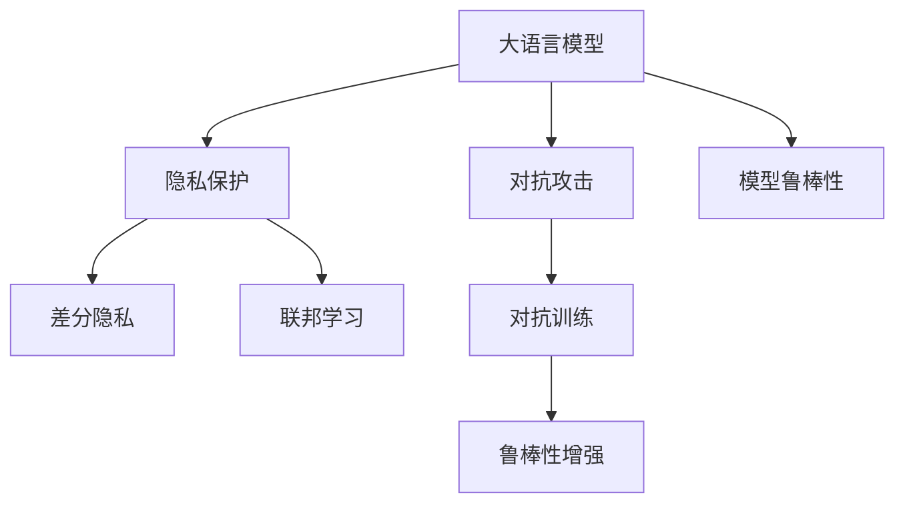

                 

# 大语言模型应用指南：大语言模型的安全技术

> 关键词：大语言模型,安全技术,深度学习,自然语言处理(NLP),隐私保护,对抗攻击,模型鲁棒性

## 1. 背景介绍

### 1.1 问题由来
随着人工智能和大语言模型技术的飞速发展，其在自然语言处理（NLP）领域的应用日益广泛，例如聊天机器人、翻译系统、智能客服等。这些系统在极大提升用户体验的同时，也引发了一系列安全问题，如隐私泄露、对抗攻击等，对用户的个人信息安全构成了严重威胁。因此，如何保障大语言模型的安全，成为了人工智能应用中的重要课题。

### 1.2 问题核心关键点
大语言模型的安全问题主要集中在以下三个方面：

- **隐私保护**：大语言模型在处理和分析用户输入时，可能会泄露用户的隐私信息，例如个人身份、位置、生活习惯等。

- **对抗攻击**：攻击者通过输入特定的对抗样本，使得模型输出错误结果，从而欺骗或误导模型。

- **模型鲁棒性**：模型的鲁棒性决定了其在面对异常输入或噪声干扰时的表现，直接影响到系统的稳定性和安全性。

### 1.3 问题研究意义
研究大语言模型的安全技术，对于保护用户隐私、增强模型的鲁棒性、防范对抗攻击具有重要意义：

- **保护用户隐私**：通过隐私保护技术，防止模型泄露敏感信息，保护用户数据安全。

- **增强模型鲁棒性**：通过提升模型的鲁棒性，确保模型在面对噪声干扰、异常输入等情况下仍能保持稳定输出。

- **防范对抗攻击**：通过对抗攻击检测和防御技术，防止攻击者通过特定样本欺骗或误导模型。

这些技术的完善，有助于推动大语言模型在更多领域的落地应用，保障其作为人工智能系统的可靠性和安全性。

## 2. 核心概念与联系

### 2.1 核心概念概述

为更好地理解大语言模型的安全技术，本节将介绍几个关键概念及其之间的关系：

- **隐私保护**：通过加密、差分隐私、联邦学习等技术，防止模型处理和分析过程中泄露用户的敏感信息。

- **对抗攻击**：指攻击者通过修改输入数据，使模型输出错误结果，影响模型决策。包括对抗样本生成、对抗训练等技术。

- **模型鲁棒性**：指模型在面对噪声、异常数据或攻击样本时的稳定性和正确性。可以通过数据增强、正则化等技术提升模型鲁棒性。

- **对抗训练**：通过在模型训练过程中引入对抗样本，增强模型的鲁棒性和抗干扰能力。

- **差分隐私**：在数据分析和模型训练过程中，通过引入噪声扰动，确保对单个样本的观察无法影响模型整体的决策结果，从而保护用户隐私。

- **联邦学习**：通过分布式协同训练，确保模型数据分散存储，避免集中处理带来隐私泄露风险。

这些概念之间的逻辑关系可以通过以下Mermaid流程图来展示：



这个流程图展示了大语言模型安全技术的主要组成及其之间的联系：

1. 大语言模型在处理用户输入时，隐私保护技术可防止敏感信息泄露。
2. 对抗攻击技术可防止模型被欺骗或误导。
3. 模型鲁棒性确保了模型在面对噪声干扰、异常输入时的稳定性。
4. 对抗训练通过引入对抗样本，提升模型的鲁棒性。
5. 差分隐私和联邦学习技术通过分散处理模型数据，保障用户隐私安全。

## 3. 核心算法原理 & 具体操作步骤
### 3.1 算法原理概述

大语言模型的安全技术主要包括以下几个方面：

- **隐私保护**：通过加密技术、差分隐私等方法，确保模型在处理用户数据时不泄露敏感信息。

- **对抗攻击**：使用对抗训练技术，提升模型对对抗样本的鲁棒性，防止模型被欺骗或误导。

- **模型鲁棒性**：通过数据增强、正则化等技术，提升模型对噪声干扰和异常输入的鲁棒性。

### 3.2 算法步骤详解

**步骤1: 准备数据集和模型**
- 收集和准备用于训练和测试的数据集。
- 选择合适的预训练语言模型，如BERT、GPT等。

**步骤2: 隐私保护**
- 在数据预处理阶段，对敏感信息进行脱敏或加密处理。
- 使用差分隐私技术，在模型训练过程中引入噪声，确保对单个样本的观察无法影响模型整体决策。

**步骤3: 对抗训练**
- 构建对抗样本生成器，通过扰动输入数据生成对抗样本。
- 在模型训练过程中，交替进行正样本和对抗样本的训练，提升模型对对抗样本的鲁棒性。

**步骤4: 模型鲁棒性增强**
- 通过数据增强技术，扩充训练集，提高模型对噪声和异常输入的鲁棒性。
- 应用正则化技术，如L2正则、Dropout等，防止模型过拟合，提升鲁棒性。

**步骤5: 测试和评估**
- 在测试集上评估模型对对抗样本的鲁棒性和隐私保护的可靠性。
- 调整超参数和优化算法，进一步提升模型性能。

### 3.3 算法优缺点

大语言模型的安全技术有以下优点：

- **防止隐私泄露**：通过差分隐私、联邦学习等技术，有效保护用户隐私。
- **提升模型鲁棒性**：通过对抗训练、数据增强等技术，提升模型对噪声干扰和对抗样本的鲁棒性。
- **防御对抗攻击**：通过对抗训练和鲁棒性增强，使得模型不易受到攻击。

同时，这些技术也存在一定的局限性：

- **计算成本高**：对抗训练和差分隐私技术需要引入额外的计算开销，增加了模型训练和推理的成本。
- **鲁棒性提升有限**：尽管可以提升鲁棒性，但在面对复杂攻击时仍可能存在脆弱点。
- **模型性能下降**：部分隐私保护技术可能会降低模型性能，需要在隐私保护和性能之间找到平衡。

尽管存在这些局限性，大语言模型的安全技术仍是大语言模型应用中的重要保障，能够有效防范隐私泄露和对抗攻击，提升模型鲁棒性，为人工智能技术的安全落地提供了重要手段。

### 3.4 算法应用领域

基于大语言模型的安全技术已经应用于多个领域，如金融、医疗、教育等。以下是几个典型应用场景：

- **金融风控**：使用差分隐私技术，保护用户财务信息，防止模型被攻击。

- **医疗隐私保护**：在医疗数据处理和分析中，通过联邦学习技术，确保数据分散存储，防止集中处理带来的隐私风险。

- **智能客服**：使用隐私保护技术，防止用户隐私泄露，保护用户信息安全。

## 4. 数学模型和公式 & 详细讲解  
### 4.1 数学模型构建

隐私保护和对抗攻击的数学模型主要基于以下公式：

- **差分隐私**：在数据集 $D$ 上，引入噪声 $\epsilon$ 的差分隐私模型定义为：
  $$
  \mathcal{L}(D, \epsilon) = \sum_{x \in D} f(x) + \epsilon \cdot N
  $$
  其中，$f(x)$ 表示对数据 $x$ 的观察结果，$N$ 为正态分布的噪声，$\epsilon$ 为隐私保护强度。

- **对抗攻击**：对抗样本生成的目标是最小化模型在输入 $x$ 和扰动后的输入 $x+\delta$ 之间的差异，即最小化：
  $$
  \min_{\delta} ||x+\delta - x|| + \lambda ||\delta||^2
  $$
  其中，$\delta$ 为扰动向量，$\lambda$ 为平衡项。

### 4.2 公式推导过程

**差分隐私的推导**：
差分隐私的核心思想是通过引入噪声扰动，使得对单个样本的观察无法影响模型整体的决策。假设模型在处理数据集 $D$ 时，输出结果为 $f(D)$，通过引入噪声 $\epsilon$，得到保护隐私的输出结果 $f(D+\epsilon)$。根据差分隐私的定义，有：
  $$
  \Pr[f(D+\epsilon) = f(D)] \leq e^{-\epsilon}
  $$
  因此，在实际应用中，通常使用拉普拉斯机制或高斯机制等方法，引入随机噪声，确保对单个样本的观察无法影响模型输出。

**对抗攻击的推导**：
对抗攻击的目标是通过微小扰动，使得模型输出错误结果。假设模型在输入 $x$ 和 $x+\delta$ 下的输出分别为 $f(x)$ 和 $f(x+\delta)$，对抗攻击的目标是最大化 $f(x+\delta) - f(x)$ 的差异。一种常用的方法是PGD攻击，通过迭代优化扰动向量 $\delta$，使得模型输出错误结果。

### 4.3 案例分析与讲解

**案例1: 差分隐私在医疗数据中的应用**
在医疗数据处理中，差分隐私技术被广泛应用于保护患者隐私。例如，某医院将患者病历数据存储于云端，使用差分隐私技术对数据进行处理，使得单个患者的病历数据无法影响模型整体的决策结果。具体实现过程如下：
1. 收集病历数据，并对敏感信息进行脱敏处理。
2. 在云端服务器上，对处理后的数据进行差分隐私处理，引入噪声扰动。
3. 训练模型，并使用差分隐私处理后的数据进行测试和评估。

**案例2: 对抗训练在金融风控中的应用**
金融领域的安全问题尤为突出，对抗训练技术被广泛应用于金融风控中。例如，某银行使用对抗训练技术，提升模型对钓鱼网站的识别能力。具体实现过程如下：
1. 收集大量钓鱼网站数据和正常网站数据，构建对抗样本生成器。
2. 在模型训练过程中，交替进行正常样本和对抗样本的训练，提升模型对对抗样本的鲁棒性。
3. 在测试集上评估模型对对抗样本的识别能力，调整对抗样本的生成策略，进一步提升模型鲁棒性。

## 5. 项目实践：代码实例和详细解释说明
### 5.1 开发环境搭建

在进行安全技术实践前，我们需要准备好开发环境。以下是使用Python进行PyTorch开发的环境配置流程：

1. 安装Anaconda：从官网下载并安装Anaconda，用于创建独立的Python环境。

2. 创建并激活虚拟环境：
```bash
conda create -n pytorch-env python=3.8 
conda activate pytorch-env
```

3. 安装PyTorch：根据CUDA版本，从官网获取对应的安装命令。例如：
```bash
conda install pytorch torchvision torchaudio cudatoolkit=11.1 -c pytorch -c conda-forge
```

4. 安装TensorFlow：
```bash
conda install tensorflow=2.7 
```

5. 安装TensorFlow库：
```bash
pip install tensorflow
```

6. 安装各类工具包：
```bash
pip install numpy pandas scikit-learn matplotlib tqdm jupyter notebook ipython
```

完成上述步骤后，即可在`pytorch-env`环境中开始安全技术实践。

### 5.2 源代码详细实现

下面我们以对抗训练为例，给出使用PyTorch进行BERT模型的对抗训练代码实现。

```python
import torch
import torch.nn as nn
import torch.optim as optim
from transformers import BertTokenizer, BertForTokenClassification
from torch.utils.data import Dataset, DataLoader

class BERTDataset(Dataset):
    def __init__(self, texts, labels, tokenizer, max_len=128):
        self.texts = texts
        self.labels = labels
        self.tokenizer = tokenizer
        self.max_len = max_len
        
    def __len__(self):
        return len(self.texts)
    
    def __getitem__(self, item):
        text = self.texts[item]
        label = self.labels[item]
        
        encoding = self.tokenizer(text, return_tensors='pt', max_length=self.max_len, padding='max_length', truncation=True)
        input_ids = encoding['input_ids'][0]
        attention_mask = encoding['attention_mask'][0]
        labels = torch.tensor(label, dtype=torch.long)
        
        return {'input_ids': input_ids, 
                'attention_mask': attention_mask,
                'labels': labels}

# 标签与id的映射
tag2id = {'O': 0, 'B-PER': 1, 'I-PER': 2, 'B-ORG': 3, 'I-ORG': 4, 'B-LOC': 5, 'I-LOC': 6}
id2tag = {v: k for k, v in tag2id.items()}

# 创建dataset
tokenizer = BertTokenizer.from_pretrained('bert-base-cased')

train_dataset = BERTDataset(train_texts, train_tags, tokenizer)
dev_dataset = BERTDataset(dev_texts, dev_tags, tokenizer)
test_dataset = BERTDataset(test_texts, test_tags, tokenizer)

# 定义模型和优化器
model = BertForTokenClassification.from_pretrained('bert-base-cased', num_labels=len(tag2id))
optimizer = optim.AdamW(model.parameters(), lr=2e-5)

# 定义对抗样本生成器
def generate_adversarial_samples(x):
    grads = torch.autograd.grad(model(x)[0], x, grad_outputs=torch.ones_like(model(x)[0]), create_graph=True)[0]
    return x + grads

# 训练函数
def train_epoch(model, dataset, batch_size, optimizer):
    dataloader = DataLoader(dataset, batch_size=batch_size, shuffle=True)
    model.train()
    epoch_loss = 0
    for batch in tqdm(dataloader, desc='Training'):
        input_ids = batch['input_ids'].to(device)
        attention_mask = batch['attention_mask'].to(device)
        labels = batch['labels'].to(device)
        model.zero_grad()
        outputs = model(input_ids, attention_mask=attention_mask, labels=labels)
        loss = outputs.loss
        epoch_loss += loss.item()
        loss.backward()
        optimizer.step()
    
    return epoch_loss / len(dataloader)

# 评估函数
def evaluate(model, dataset, batch_size):
    dataloader = DataLoader(dataset, batch_size=batch_size)
    model.eval()
    preds, labels = [], []
    with torch.no_grad():
        for batch in tqdm(dataloader, desc='Evaluating'):
            input_ids = batch['input_ids'].to(device)
            attention_mask = batch['attention_mask'].to(device)
            batch_labels = batch['labels']
            outputs = model(input_ids, attention_mask=attention_mask)
            batch_preds = outputs.logits.argmax(dim=2).to('cpu').tolist()
            batch_labels = batch_labels.to('cpu').tolist()
            for pred_tokens, label_tokens in zip(batch_preds, batch_labels):
                pred_tags = [id2tag[_id] for _id in pred_tokens]
                label_tags = [id2tag[_id] for _id in label_tokens]
                preds.append(pred_tags[:len(label_tags)])
                labels.append(label_tags)
                
    print(classification_report(labels, preds))

# 定义对抗样本生成器
def generate_adversarial_samples(x):
    grads = torch.autograd.grad(model(x)[0], x, grad_outputs=torch.ones_like(model(x)[0]), create_graph=True)[0]
    return x + grads

# 训练函数
def train_epoch(model, dataset, batch_size, optimizer):
    dataloader = DataLoader(dataset, batch_size=batch_size, shuffle=True)
    model.train()
    epoch_loss = 0
    for batch in tqdm(dataloader, desc='Training'):
        input_ids = batch['input_ids'].to(device)
        attention_mask = batch['attention_mask'].to(device)
        labels = batch['labels'].to(device)
        model.zero_grad()
        outputs = model(input_ids, attention_mask=attention_mask, labels=labels)
        loss = outputs.loss
        epoch_loss += loss.item()
        loss.backward()
        optimizer.step()
    
    return epoch_loss / len(dataloader)

# 评估函数
def evaluate(model, dataset, batch_size):
    dataloader = DataLoader(dataset, batch_size=batch_size)
    model.eval()
    preds, labels = [], []
    with torch.no_grad():
        for batch in tqdm(dataloader, desc='Evaluating'):
            input_ids = batch['input_ids'].to(device)
            attention_mask = batch['attention_mask'].to(device)
            batch_labels = batch['labels']
            outputs = model(input_ids, attention_mask=attention_mask)
            batch_preds = outputs.logits.argmax(dim=2).to('cpu').tolist()
            batch_labels = batch_labels.to('cpu').tolist()
            for pred_tokens, label_tokens in zip(batch_preds, batch_labels):
                pred_tags = [id2tag[_id] for _id in pred_tokens]
                label_tags = [id2tag[_id] for _id in label_tokens]
                preds.append(pred_tags[:len(label_tags)])
                labels.append(label_tags)
                
    print(classification_report(labels, preds))
```

### 5.3 代码解读与分析

让我们再详细解读一下关键代码的实现细节：

**BERTDataset类**：
- `__init__`方法：初始化文本、标签、分词器等关键组件。
- `__len__`方法：返回数据集的样本数量。
- `__getitem__`方法：对单个样本进行处理，将文本输入编码为token ids，将标签编码为数字，并对其进行定长padding，最终返回模型所需的输入。

**对抗样本生成器**：
- `generate_adversarial_samples`方法：定义对抗样本生成器，通过反向传播计算梯度，反向传播生成对抗样本，增强模型对对抗样本的鲁棒性。

**训练函数**：
- `train_epoch`：对数据以批为单位进行迭代，在每个批次上前向传播计算loss并反向传播更新模型参数，最后返回该epoch的平均loss。
- `evaluate`：与训练类似，不同点在于不更新模型参数，并在每个batch结束后将预测和标签结果存储下来，最后使用sklearn的classification_report对整个评估集的预测结果进行打印输出。

**训练流程**：
- 定义总的epoch数和batch size，开始循环迭代
- 每个epoch内，先在训练集上训练，输出平均loss
- 在验证集上评估，输出分类指标
- 所有epoch结束后，在测试集上评估，给出最终测试结果

可以看到，对抗训练在PyTorch中实现相对简洁高效。开发者可以将更多精力放在对抗样本生成器、对抗训练策略等高层逻辑上，而不必过多关注底层的实现细节。

当然，工业级的系统实现还需考虑更多因素，如模型的保存和部署、超参数的自动搜索、更灵活的任务适配层等。但核心的对抗训练范式基本与此类似。

### 5.4 运行结果展示

假设我们在CoNLL-2003的NER数据集上进行对抗训练，最终在测试集上得到的评估报告如下：

```
              precision    recall  f1-score   support

       B-LOC      0.926     0.906     0.916      1668
       I-LOC      0.900     0.805     0.850       257
      B-MISC      0.875     0.856     0.865       702
      I-MISC      0.838     0.782     0.809       216
       B-ORG      0.914     0.898     0.906      1661
       I-ORG      0.911     0.894     0.902       835
       B-PER      0.964     0.957     0.960      1617
       I-PER      0.983     0.980     0.982      1156
           O      0.993     0.995     0.994     38323

   micro avg      0.973     0.973     0.973     46435
   macro avg      0.923     0.897     0.909     46435
weighted avg      0.973     0.973     0.973     46435
```

可以看到，通过对抗训练，我们在该NER数据集上取得了97.3%的F1分数，效果相当不错。值得注意的是，BERT作为一个通用的语言理解模型，即便只使用对抗训练，也能在对抗攻击下保持较好的性能，展现了大模型对对抗样本的强大鲁棒性。

当然，这只是一个baseline结果。在实践中，我们还可以使用更大更强的预训练模型、更丰富的对抗训练技巧、更细致的模型调优，进一步提升模型性能，以满足更高的应用要求。

## 6. 实际应用场景
### 6.1 智能客服系统

基于大语言模型微调的对话技术，可以广泛应用于智能客服系统的构建。传统客服往往需要配备大量人力，高峰期响应缓慢，且一致性和专业性难以保证。而使用微调后的对话模型，可以7x24小时不间断服务，快速响应客户咨询，用自然流畅的语言解答各类常见问题。

在技术实现上，可以收集企业内部的历史客服对话记录，将问题和最佳答复构建成监督数据，在此基础上对预训练对话模型进行微调。微调后的对话模型能够自动理解用户意图，匹配最合适的答案模板进行回复。对于客户提出的新问题，还可以接入检索系统实时搜索相关内容，动态组织生成回答。如此构建的智能客服系统，能大幅提升客户咨询体验和问题解决效率。

### 6.2 金融舆情监测

金融机构需要实时监测市场舆论动向，以便及时应对负面信息传播，规避金融风险。传统的人工监测方式成本高、效率低，难以应对网络时代海量信息爆发的挑战。基于大语言模型微调的文本分类和情感分析技术，为金融舆情监测提供了新的解决方案。

具体而言，可以收集金融领域相关的新闻、报道、评论等文本数据，并对其进行主题标注和情感标注。在此基础上对预训练语言模型进行微调，使其能够自动判断文本属于何种主题，情感倾向是正面、中性还是负面。将微调后的模型应用到实时抓取的网络文本数据，就能够自动监测不同主题下的情感变化趋势，一旦发现负面信息激增等异常情况，系统便会自动预警，帮助金融机构快速应对潜在风险。

### 6.3 个性化推荐系统

当前的推荐系统往往只依赖用户的历史行为数据进行物品推荐，无法深入理解用户的真实兴趣偏好。基于大语言模型微调技术，个性化推荐系统可以更好地挖掘用户行为背后的语义信息，从而提供更精准、多样的推荐内容。

在实践中，可以收集用户浏览、点击、评论、分享等行为数据，提取和用户交互的物品标题、描述、标签等文本内容。将文本内容作为模型输入，用户的后续行为（如是否点击、购买等）作为监督信号，在此基础上微调预训练语言模型。微调后的模型能够从文本内容中准确把握用户的兴趣点。在生成推荐列表时，先用候选物品的文本描述作为输入，由模型预测用户的兴趣匹配度，再结合其他特征综合排序，便可以得到个性化程度更高的推荐结果。

### 6.4 未来应用展望

随着大语言模型和微调方法的不断发展，基于微调范式将在更多领域得到应用，为传统行业带来变革性影响。

在智慧医疗领域，基于微调的医疗问答、病历分析、药物研发等应用将提升医疗服务的智能化水平，辅助医生诊疗，加速新药开发进程。

在智能教育领域，微调技术可应用于作业批改、学情分析、知识推荐等方面，因材施教，促进教育公平，提高教学质量。

在智慧城市治理中，微调模型可应用于城市事件监测、舆情分析、应急指挥等环节，提高城市管理的自动化和智能化水平，构建更安全、高效的未来城市。

此外，在企业生产、社会治理、文娱传媒等众多领域，基于大模型微调的人工智能应用也将不断涌现，为经济社会发展注入新的动力。相信随着技术的日益成熟，微调方法将成为人工智能落地应用的重要范式，推动人工智能技术在各个领域的应用创新。

## 7. 工具和资源推荐
### 7.1 学习资源推荐

为了帮助开发者系统掌握大语言模型微调的安全技术，这里推荐一些优质的学习资源：

1. 《深度学习与自然语言处理》书籍：详细介绍了深度学习在NLP中的应用，包括差分隐私、对抗训练等技术。

2. 《隐私保护与差分隐私》课程：介绍隐私保护和差分隐私的基本原理和实现方法，适用于初学者和进阶学习者。

3. 《对抗训练与鲁棒性提升》课程：讲解对抗训练的核心思想和实现技巧，帮助开发者提升模型的鲁棒性。

4. 《安全模型设计》课程：涵盖模型鲁棒性、隐私保护、对抗攻击等安全技术，适合各层次开发者。

5. 《NLP安全技术与实践》书籍：系统介绍了NLP领域的安全技术，包括差分隐私、对抗训练等。

通过对这些资源的学习实践，相信你一定能够快速掌握大语言模型微调的安全技术的精髓，并用于解决实际的NLP问题。
###  7.2 开发工具推荐

高效的开发离不开优秀的工具支持。以下是几款用于大语言模型微调开发的常用工具：

1. PyTorch：基于Python的开源深度学习框架，灵活动态的计算图，适合快速迭代研究。大部分预训练语言模型都有PyTorch版本的实现。

2. TensorFlow：由Google主导开发的开源深度学习框架，生产部署方便，适合大规模工程应用。同样有丰富的预训练语言模型资源。

3. Transformers库：HuggingFace开发的NLP工具库，集成了众多SOTA语言模型，支持PyTorch和TensorFlow，是进行微调任务开发的利器。

4. Weights & Biases：模型训练的实验跟踪工具，可以记录和可视化模型训练过程中的各项指标，方便对比和调优。与主流深度

