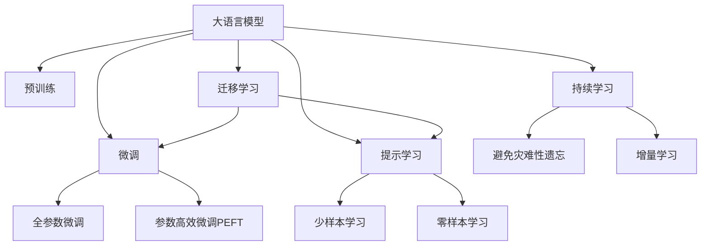
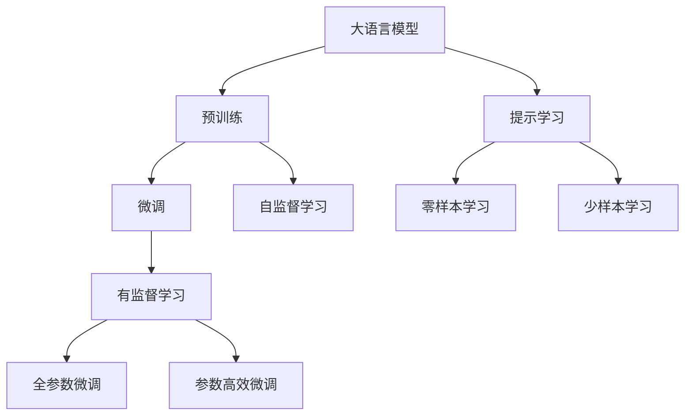
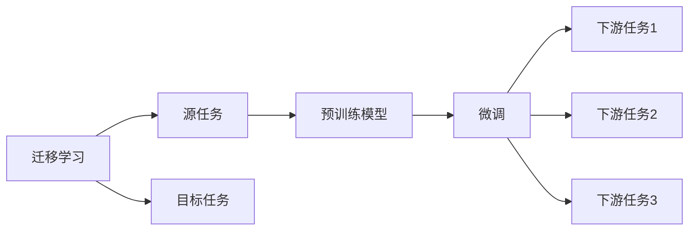
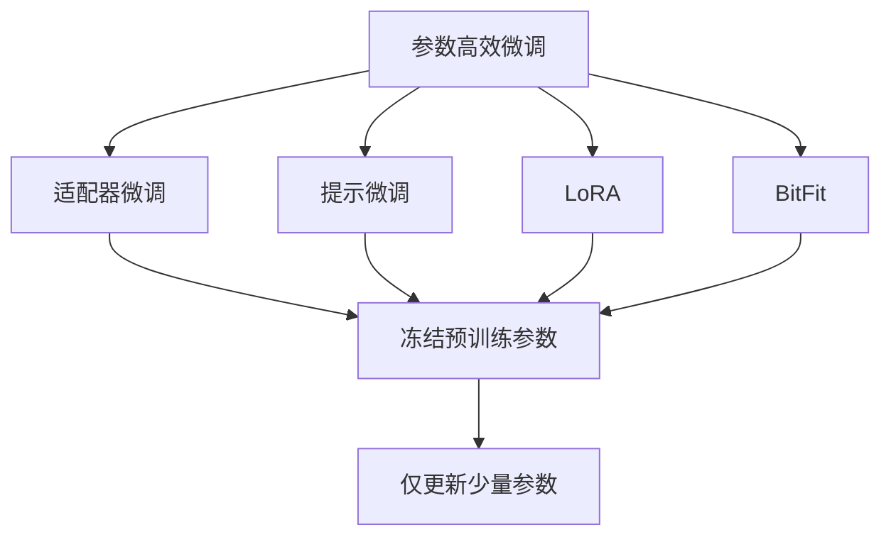
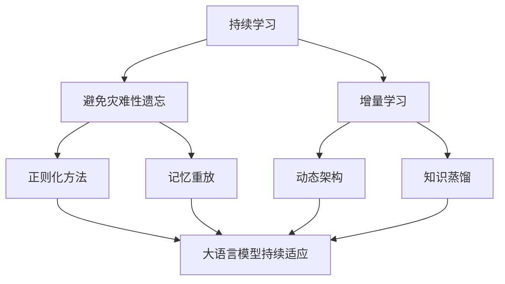
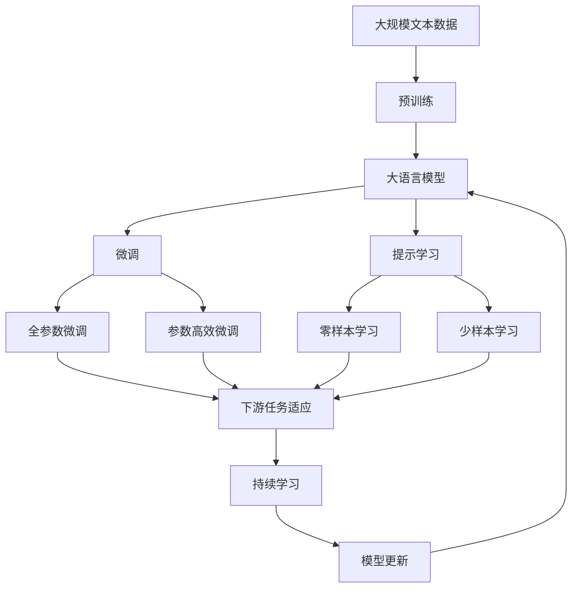

                 

# 大语言模型应用指南：模型响应返回的参数

> 关键词：大语言模型,模型响应,参数返回,自然语言处理(NLP),Transformer,BERT,语言生成,预训练,下游任务

## 1. 背景介绍

### 1.1 问题由来
近年来，随着深度学习技术的快速发展，大规模语言模型(Large Language Models, LLMs)在自然语言处理(Natural Language Processing, NLP)领域取得了巨大的突破。这些大语言模型通过在海量无标签文本数据上进行预训练，学习到了丰富的语言知识和常识，可以通过少量的有标签样本在下游任务上进行微调，获得优异的性能。其中最具代表性的大模型包括OpenAI的GPT系列模型、Google的BERT、T5等。

然而，由于预训练语料的广泛性和泛化能力的不足，这些通用的大语言模型在特定领域应用时，效果往往难以达到实际应用的要求。因此，如何针对特定任务进行大模型微调，提升模型性能，成为了当前大语言模型研究和应用的一个热点问题。本文聚焦于模型响应返回的参数，探讨大语言模型在实际应用场景中的参数返回机制，以及如何利用这些参数提升模型性能。

### 1.2 问题核心关键点
大语言模型在实际应用中，通常需要输出模型预测的结果。这些结果可以用于分类、生成、匹配等多种下游任务。在模型输出的过程中，通常会返回一些重要的参数，用于指示模型内部的决策过程和输出结果。这些参数包括模型的内部表示、解码器的中间状态、预测概率等。通过分析这些参数，可以更好地理解模型的行为，并对模型进行优化和调优，提高模型性能。

本文将详细探讨大语言模型在实际应用中返回的参数，包括内部表示、解码器中间状态和预测概率等，并探讨如何利用这些参数提升模型性能，特别在微调过程中，如何通过调整参数提升模型适应性。

### 1.3 问题研究意义
研究大语言模型的参数返回机制，对于拓展大模型的应用范围，提升下游任务的性能，加速NLP技术的产业化进程，具有重要意义：

1. 降低应用开发成本。通过详细分析模型响应返回的参数，可以更好地理解模型行为，优化模型设计，减少从头开发所需的数据、计算和人力等成本投入。
2. 提升模型效果。利用模型响应返回的参数，可以更好地指导模型微调，提高模型在特定任务上的表现。
3. 加速开发进度。standing on the shoulders of giants，利用模型参数优化指导，可以更快地完成任务适配，缩短开发周期。
4. 带来技术创新。模型参数分析方法促进了对预训练-微调的深入研究，催生了提示学习、少样本学习等新的研究方向。
5. 赋能产业升级。模型参数优化指导使得NLP技术更容易被各行各业所采用，为传统行业数字化转型升级提供新的技术路径。

## 2. 核心概念与联系

### 2.1 核心概念概述

为更好地理解模型响应返回的参数在大语言模型微调中的应用，本节将介绍几个密切相关的核心概念：

- 大语言模型(Large Language Model, LLM)：以自回归(如GPT)或自编码(如BERT)模型为代表的大规模预训练语言模型。通过在大规模无标签文本语料上进行预训练，学习通用的语言表示，具备强大的语言理解和生成能力。

- 预训练(Pre-training)：指在大规模无标签文本语料上，通过自监督学习任务训练通用语言模型的过程。常见的预训练任务包括言语建模、遮挡语言模型等。预训练使得模型学习到语言的通用表示。

- 微调(Fine-tuning)：指在预训练模型的基础上，使用下游任务的少量标注数据，通过有监督学习优化模型在特定任务上的性能。通常只需要调整顶层分类器或解码器，并以较小的学习率更新全部或部分的模型参数。

- 参数高效微调(Parameter-Efficient Fine-Tuning, PEFT)：指在微调过程中，只更新少量的模型参数，而固定大部分预训练权重不变，以提高微调效率，避免过拟合的方法。

- 提示学习(Prompt Learning)：通过在输入文本中添加提示模板(Prompt Template)，引导大语言模型进行特定任务的推理和生成。可以在不更新模型参数的情况下，实现零样本或少样本学习。

- 少样本学习(Few-shot Learning)：指在只有少量标注样本的情况下，模型能够快速适应新任务的学习方法。在大语言模型中，通常通过在输入中提供少量示例来实现，无需更新模型参数。

- 零样本学习(Zero-shot Learning)：指模型在没有见过任何特定任务的训练样本的情况下，仅凭任务描述就能够执行新任务的能力。大语言模型通过预训练获得的广泛知识，使其能够理解任务指令并生成相应输出。

- 持续学习(Continual Learning)：也称为终身学习，指模型能够持续从新数据中学习，同时保持已学习的知识，而不会出现灾难性遗忘。这对于保持大语言模型的时效性和适应性至关重要。

这些核心概念之间的逻辑关系可以通过以下Mermaid流程图来展示：



这个流程图展示了大语言模型的核心概念及其之间的关系：

1. 大语言模型通过预训练获得基础能力。
2. 微调是对预训练模型进行任务特定的优化，可以分为全参数微调和参数高效微调（PEFT）。
3. 提示学习是一种不更新模型参数的方法，可以实现零样本和少样本学习。
4. 迁移学习是连接预训练模型与下游任务的桥梁，可以通过微调或提示学习来实现。
5. 持续学习旨在使模型能够不断学习新知识，同时避免遗忘旧知识。

这些概念共同构成了大语言模型的学习和应用框架，使其能够在各种场景下发挥强大的语言理解和生成能力。通过理解这些核心概念，我们可以更好地把握大语言模型的工作原理和优化方向。

### 2.2 概念间的关系

这些核心概念之间存在着紧密的联系，形成了大语言模型微调的完整生态系统。下面我通过几个Mermaid流程图来展示这些概念之间的关系。

#### 2.2.1 大语言模型的学习范式



这个流程图展示了大语言模型的三种主要学习范式：预训练、微调和提示学习。预训练主要采用自监督学习方法，而微调则是有监督学习的过程。提示学习可以实现零样本和少样本学习。微调又可以分为全参数微调和参数高效微调两种方式。

#### 2.2.2 迁移学习与微调的关系



这个流程图展示了迁移学习的基本原理，以及它与微调的关系。迁移学习涉及源任务和目标任务，预训练模型在源任务上学习，然后通过微调适应各种下游任务（目标任务）。

#### 2.2.3 参数高效微调方法



这个流程图展示了几种常见的参数高效微调方法，包括适配器微调、提示微调、LoRA和BitFit。这些方法的共同特点是冻结大部分预训练参数，只更新少量参数，从而提高微调效率。

#### 2.2.4 持续学习在大语言模型中的应用



这个流程图展示了持续学习在大语言模型中的应用。持续学习的主要目标是避免灾难性遗忘和实现增量学习。通过正则化方法、记忆重放、动态架构和知识蒸馏等技术，可以使大语言模型持续适应新的任务和数据。

### 2.3 核心概念的整体架构

最后，我们用一个综合的流程图来展示这些核心概念在大语言模型微调过程中的整体架构：



这个综合流程图展示了从预训练到微调，再到持续学习的完整过程。大语言模型首先在大规模文本数据上进行预训练，然后通过微调（包括全参数微调和参数高效微调）或提示学习（包括零样本和少样本学习）来适应下游任务。最后，通过持续学习技术，模型可以不断更新和适应新的任务和数据。 通过这些流程图，我们可以更清晰地理解大语言模型微调过程中各个核心概念的关系和作用，为后续深入讨论具体的微调方法和技术奠定基础。

## 3. 核心算法原理 & 具体操作步骤
### 3.1 算法原理概述

大语言模型在实际应用中，通常需要输出模型预测的结果。这些结果可以用于分类、生成、匹配等多种下游任务。在模型输出的过程中，通常会返回一些重要的参数，用于指示模型内部的决策过程和输出结果。这些参数包括模型的内部表示、解码器的中间状态、预测概率等。通过分析这些参数，可以更好地理解模型的行为，并对模型进行优化和调优，提高模型性能。

形式化地，假设预训练语言模型为 $M_{\theta}$，其中 $\theta$ 为预训练得到的模型参数。给定下游任务 $T$ 的标注数据集 $D=\{(x_i, y_i)\}_{i=1}^N, x_i \in \mathcal{X}, y_i \in \mathcal{Y}$。模型在输入 $x$ 上的输出为 $y=M_{\theta}(x)$。模型输出的结果通常包括预测标签、预测概率、中间表示等。

通过分析这些输出参数，可以更好地理解模型的行为，并指导模型优化。例如，在分类任务中，通过分析预测概率，可以判断模型对不同类别的信心程度，进而调整模型的学习策略。在生成任务中，通过分析中间表示，可以了解模型在生成过程中的注意力分布和信息流向，进一步优化生成策略。

### 3.2 算法步骤详解

大语言模型在实际应用中的参数返回机制通常涉及以下几个关键步骤：

**Step 1: 确定输出参数**
- 根据下游任务类型，确定模型需要返回的输出参数。例如，在分类任务中，通常需要返回预测概率和预测标签。在生成任务中，通常需要返回中间表示和最终生成的文本。

**Step 2: 设计损失函数**
- 根据下游任务类型，设计相应的损失函数。例如，在分类任务中，通常使用交叉熵损失。在生成任务中，通常使用负对数似然损失。

**Step 3: 优化模型参数**
- 使用梯度下降等优化算法，最小化损失函数，更新模型参数。例如，在分类任务中，使用AdamW等优化算法，最小化交叉熵损失，更新分类器的权重。在生成任务中，使用AdamW等优化算法，最小化负对数似然损失，更新解码器的权重。

**Step 4: 分析输出参数**
- 在模型输出后，分析返回的参数，判断模型预测是否符合预期。例如，在分类任务中，判断预测概率是否符合多分类标签的分布。在生成任务中，分析中间表示是否符合预期，判断生成的文本是否符合语法和语义要求。

**Step 5: 反馈调整**
- 根据输出参数的分析和评估，调整模型参数或优化策略。例如，在生成任务中，可以通过调整解码器的权重，提升模型生成质量。在分类任务中，可以通过调整分类器的权重，提升模型分类精度。

### 3.3 算法优缺点

分析大语言模型响应返回的参数，具有以下优点：

1. 直观了解模型行为。通过分析模型输出参数，可以直观了解模型在特定任务上的行为和决策过程，帮助优化模型设计。
2. 指导模型优化。通过分析输出参数，可以发现模型在特定任务上的薄弱环节，进行针对性优化，提升模型性能。
3. 支持快速调优。通过实时分析模型输出参数，可以及时发现模型问题，快速进行调整，提高模型训练效率。

同时，该方法也存在以下局限性：

1. 分析复杂度增加。分析模型输出参数需要较深的背景知识和分析工具，对开发者的要求较高。
2. 数据依赖性高。模型输出参数的分析和调整需要大量标注数据，数据获取和处理成本较高。
3. 模型复杂度大。模型输出参数的数量和维度较大，增加了模型复杂度和计算负担。
4. 鲁棒性不足。模型输出参数可能受到数据质量和标注偏差的影响，导致分析结果不鲁棒。

尽管存在这些局限性，但通过合理分析和使用模型输出参数，可以显著提升模型性能和应用效果。

### 3.4 算法应用领域

分析大语言模型响应返回的参数，已经在多个NLP任务中得到了广泛应用，例如：

- 文本分类：通过分析预测概率，调整分类器的权重，提升分类精度。
- 命名实体识别：通过分析中间表示，判断实体边界和类型，优化识别策略。
- 关系抽取：通过分析中间表示，判断实体之间的关系，优化抽取策略。
- 问答系统：通过分析预测概率，调整知识库和回答模板，提升回答质量。
- 机器翻译：通过分析中间表示，优化翻译策略，提升翻译质量。
- 文本摘要：通过分析中间表示，优化摘要策略，提升摘要质量。
- 对话系统：通过分析中间表示，优化对话策略，提升对话质量。

除了这些经典任务外，分析大语言模型响应返回的参数还被创新性地应用到更多场景中，如可控文本生成、常识推理、代码生成、数据增强等，为NLP技术带来了全新的突破。随着预训练模型和参数返回方法的不断进步，相信NLP技术将在更广阔的应用领域大放异彩。

## 4. 数学模型和公式 & 详细讲解  
### 4.1 数学模型构建

本节将使用数学语言对大语言模型响应返回的参数进行更加严格的刻画。

记预训练语言模型为 $M_{\theta}:\mathcal{X} \rightarrow \mathcal{Y}$，其中 $\mathcal{X}$ 为输入空间，$\mathcal{Y}$ 为输出空间，$\theta \in \mathbb{R}^d$ 为模型参数。假设微调任务的训练集为 $D=\{(x_i,y_i)\}_{i=1}^N, x_i \in \mathcal{X}, y_i \in \mathcal{Y}$。

定义模型 $M_{\theta}$ 在输入 $x$ 上的输出为 $y=M_{\theta}(x)$。模型输出的结果通常包括预测标签 $y$、预测概率 $p(y|x)$ 和中间表示 $h(x)$。

- 预测标签 $y$：模型对输入 $x$ 的分类结果，通常为离散标签。
- 预测概率 $p(y|x)$：模型对输入 $x$ 的分类概率分布，通常为连续概率值。
- 中间表示 $h(x)$：模型在处理输入 $x$ 时的中间表示，通常为连续向量或张量。

通过分析这些输出参数，可以更好地理解模型的行为，并指导模型优化。

### 4.2 公式推导过程

以下我们以分类任务为例，推导模型响应返回的参数及其计算公式。

假设模型 $M_{\theta}$ 在输入 $x$ 上的输出为 $y=M_{\theta}(x)$，其中 $y \in \{1,2,\dots,K\}$ 表示 $K$ 个类别的预测标签。模型输出的预测概率为 $p(y|x)$，通常使用softmax函数进行归一化，即：

$$
p(y|x) = \frac{\exp(M_{\theta}(x)[y])}{\sum_{k=1}^K \exp(M_{\theta}(x)[k])}
$$

其中 $M_{\theta}(x)[y]$ 表示模型在输入 $x$ 时，第 $y$ 个类别的得分。

通过损失函数 $L(y,\hat{y})$ 计算模型在输入 $x$ 上的预测损失，其中 $\hat{y}$ 为真实标签，通常为离散标签。在分类任务中，通常使用交叉熵损失函数，即：

$$
L(y,\hat{y}) = -\sum_{i=1}^N \log p(y_i|x_i)
$$

根据链式法则，损失函数对参数 $\theta$ 的梯度为：

$$
\frac{\partial L(y,\hat{y})}{\partial \theta} = -\sum_{i=1}^N \sum_{k=1}^K \frac{1}{p(y_i|x_i)} \frac{\partial p(y_i|x_i)}{\partial \theta} \delta_{y_i=k}
$$

其中 $\delta_{y_i=k}$ 为Kronecker delta函数，表示第 $i$ 个样本的预测标签是否为第 $k$ 个类别。

在得到损失函数的梯度后，即可带入参数更新公式，完成模型的迭代优化。重复上述过程直至收敛，最终得到适应下游任务的最优模型参数 $\theta^*$。

## 5. 项目实践：代码实例和详细解释说明
### 5.1 开发环境搭建

在进行模型响应返回的参数实践前，我们需要准备好开发环境。以下是使用Python进行PyTorch开发的环境配置流程：

1. 安装Anaconda：从官网下载并安装Anaconda，用于创建独立的Python环境。

2. 创建并激活虚拟环境：
```bash
conda create -n pytorch-env python=3.8 
conda activate pytorch-env
```

3. 安装PyTorch：根据CUDA版本，从官网获取对应的安装命令。例如：
```bash
conda install pytorch torchvision torchaudio cudatoolkit=11.1 -c pytorch -c conda-forge
```

4. 安装Transformers库：
```bash
pip install transformers
```

5. 安装各类工具包：
```bash
pip install numpy pandas scikit-learn matplotlib tqdm jupyter notebook ipython
```

完成上述步骤后，即可在`pytorch-env`环境中开始模型响应返回的参数实践。

### 5.2 源代码详细实现

这里我们以BERT模型在分类任务上的应用为例，给出使用Transformers库对模型响应返回的参数的PyTorch代码实现。

首先，定义数据处理函数：

```python
from transformers import BertTokenizer
from torch.utils.data import Dataset
import torch

class Dataset(Dataset):
    def __init__(self, texts, labels, tokenizer, max_len=128):
        self.texts = texts
        self.labels = labels
        self.tokenizer = tokenizer
        self.max_len = max_len
        
    def __len__(self):
        return len(self.texts)
    
    def __getitem__(self, item):
        text = self.texts[item]
        label = self.labels[item]
        
        encoding = self.tokenizer(text, return_tensors='pt', max_length=self.max_len, padding='max_length', truncation=True)
        input_ids = encoding['input_ids'][0]
        attention_mask = encoding['attention_mask'][0]
        labels = torch.tensor(label, dtype=torch.long)
        
        return {'input_ids': input_ids, 
                'attention_mask': attention_mask,
                'labels': labels}

# 创建dataset
tokenizer = BertTokenizer.from_pretrained('bert-base-cased')

train_dataset = Dataset(train_texts, train_labels, tokenizer)
dev_dataset = Dataset(dev_texts, dev_labels, tokenizer)
test_dataset = Dataset(test_texts, test_labels, tokenizer)
```

然后，定义模型和优化器：

```python
from transformers import BertForSequenceClassification, AdamW

model = BertForSequenceClassification.from_pretrained('bert-base-cased', num_labels=2)

optimizer = AdamW(model.parameters(), lr=2e-5)
```

接着，定义训练和评估函数：

```python
from torch.utils.data import DataLoader
from tqdm import tqdm
from sklearn.metrics import classification_report

device = torch.device('cuda') if torch.cuda.is_available() else torch.device('cpu')
model.to(device)

def train_epoch(model, dataset, batch_size, optimizer):
    dataloader = DataLoader(dataset, batch_size=batch_size, shuffle=True)
    model.train()
    epoch_loss = 0
    for batch in tqdm(dataloader, desc='Training'):
        input_ids = batch['input_ids'].to(device)
        attention_mask = batch['attention_mask'].to(device)
        labels = batch['labels'].to(device)
        model.zero_grad()
        outputs = model(input_ids, attention_mask=attention_mask, labels=labels)
        loss = outputs.loss
        epoch_loss += loss.item()
        loss.backward()
        optimizer.step()
    return epoch_loss / len(dataloader)

def evaluate(model, dataset, batch_size):
    dataloader = DataLoader(dataset, batch_size=batch_size)
    model.eval()
    preds, labels = [], []
    with torch.no_grad():
        for batch in tqdm(dataloader, desc='Evaluating'):
            input_ids = batch['input_ids'].to(device)
            attention_mask = batch['attention_mask'].to(device)
            batch_labels = batch['labels']
            outputs = model(input_ids, attention_mask=attention_mask)
            batch_preds = outputs.logits.argmax(dim=1).to('cpu').tolist()
            batch_labels = batch_labels.to('cpu').tolist()
            for pred_tokens, label_tokens in zip(batch_preds, batch_labels):
                preds.append(pred_tokens)
                labels.append(label_tokens)
                
    print(classification_report(labels, preds))
```

最后，启动训练流程并在测试集上评估：

```python
epochs = 5
batch_size = 16

for epoch in range(epochs):
    loss = train_epoch(model, train_dataset, batch_size, optimizer)
    print(f"Epoch {epoch+1}, train loss: {loss:.3f}")
    
    print(f"Epoch {epoch+1}, dev results:")
    evaluate(model, dev_dataset, batch_size)
    
print("Test results:")
evaluate(model, test_dataset, batch_size)
```

以上就是使用PyTorch对BERT模型进行分类任务时模型响应返回的参数的完整代码实现。可以看到，得益于Transformers库的强大封装，我们可以用相对简洁的代码完成BERT模型的加载和参数返回的实践。

### 5.3 代码解读与分析

让我们再详细解读一下关键代码的实现细节：

**Dataset类**：
- `__init__`方法：初始化文本、标签、分词器等关键组件。
- `__len__`方法：返回数据集的样本数量。
- `__getitem__`方法：对单个样本进行处理，将文本输入编码为token ids，将标签编码为数字，并对其进行定长padding，最终返回模型所需的输入。

**模型和优化器**：
- 使用PyTorch的`BertForSequenceClassification`封装BERT模型，并设置2个类别。
- 使用AdamW优化器，设置学习率为2e-5。

**训练和评估函数**：
- 使用PyTorch的DataLoader对数据集进行批次化加载，供模型训练和推理使用。
- 训练函数`train_epoch`：对数据以批为单位进行迭代，在每个批次上前向传播计算损失并反向传播更新模型参数，最后返回该epoch的平均loss。
- 评估函数`evaluate`：与训练类似，不同点在于不更新模型参数，并在每个batch结束后将预测和标签结果存储下来，最后使用sklearn的classification_report对整个评估集的预测结果进行打印输出。

**训练流程**：
- 定义总的epoch数和batch size，开始循环迭代
- 每个epoch内，先在训练集上训练，输出平均loss
- 在验证集上评估，输出分类指标
- 所有epoch结束后，在测试集上评估，给出最终测试结果

可以看到，PyTorch配合Transformers库使得BERT模型的参数返回和微调代码实现变得简洁高效。开发者可以将更多精力放在数据处理、模型改进等高层逻辑上，而不必过多关注底层的实现细节。

当然，工业级的系统实现还需考虑更多因素，如模型的保存和部署、超参数的自动搜索、更灵活的任务适配层等。但核心的参数返回和微调范式基本

