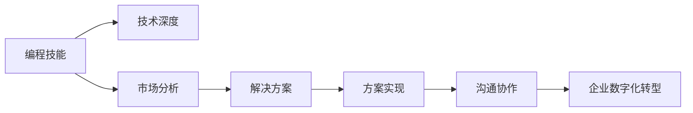
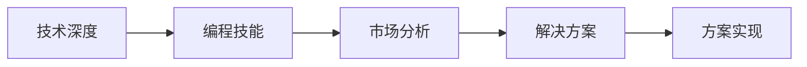
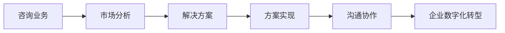
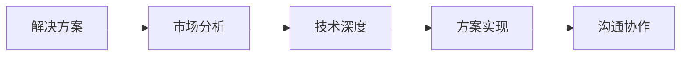

                 

# 如何将编程技能转化为高端咨询业务

> 关键词：编程技能，咨询业务，软件开发，人工智能，高级技术，市场策略，软件开发，软件架构，软件开发技术

## 1. 背景介绍

### 1.1 问题由来
在当今信息化的时代，企业的数字化转型已经成为了行业共识。然而，数字化转型不仅仅是企业内部系统的建设，更重要的是将企业业务与数字化技术紧密结合，实现业务流程的优化和提升。这种需求催生了一个新兴的业务领域——企业咨询。企业咨询师通过分析企业的业务需求，结合自身深厚的技术背景，为企业的数字化转型提供专业指导和方案。然而，真正的技术专家不仅需要具备深厚的技术知识，还需要具备较强的市场分析和业务策略能力，才能真正成为企业数字化转型的引领者。因此，如何将编程技能转化为高端咨询业务，成为了技术专家职业发展的重要课题。

### 1.2 问题核心关键点
将编程技能转化为高端咨询业务的核心关键点在于：如何将技术深度与市场分析能力结合起来，为企业的数字化转型提供具有实战价值的解决方案。这包括以下几个方面：

- **技术深度**：掌握先进的编程语言、框架、工具，具备解决复杂技术问题的能力。
- **市场分析**：理解企业需求，分析市场趋势，设计合理的技术方案。
- **方案实现**：将技术方案与业务需求紧密结合，实现实际的业务效果。
- **沟通协作**：与企业内外部各角色协作，确保方案的顺利实施。

### 1.3 问题研究意义
将编程技能转化为高端咨询业务，有助于技术专家向更高层次的职业发展，同时也能为企业提供更加专业和实用的数字化转型方案，提升企业的数字化转型成功率。具体而言：

1. **提升职业发展**：编程技能转型高端咨询业务，不仅需要技术能力，更需要战略思维和市场洞察，可以显著提升技术专家的职业价值和市场竞争力。
2. **企业收益增加**：高端咨询业务能够帮助企业更准确地制定数字化转型策略，节省时间和成本，提升业务效果。
3. **技术落地应用**：技术专家通过咨询业务，将技术知识应用到实际场景中，增强技术的实际落地能力。
4. **行业影响力**：成功的数字化转型案例可以为技术专家带来行业声誉，促进其在业界的交流与合作。

## 2. 核心概念与联系

### 2.1 核心概念概述

为更好地理解如何将编程技能转化为高端咨询业务，本节将介绍几个关键概念：

- **编程技能**：掌握一种或多种编程语言、框架、工具，能够解决复杂技术问题。
- **咨询业务**：为企业提供专业的市场分析、技术方案设计、实施策略等咨询服务，帮助企业实现数字化转型。
- **技术专家**：具有深厚的技术背景，能够进行技术研究和创新。
- **企业数字化转型**：利用先进的技术手段，优化企业业务流程，提升企业竞争力。
- **解决方案**：根据企业的业务需求，设计的能够解决实际问题的技术方案。
- **市场分析**：分析市场趋势，了解客户需求，为技术方案的设计提供依据。

这些核心概念之间的关系可以用以下Mermaid流程图来展示：



这个流程图展示了编程技能转化为高端咨询业务的主要流程：从编程技能出发，通过技术深度和市场分析，设计解决方案，实现方案，与企业协作，最终推动企业数字化转型。

### 2.2 概念间的关系

这些核心概念之间存在着紧密的联系，形成了将编程技能转化为高端咨询业务的关键框架。下面通过几个Mermaid流程图来展示这些概念之间的关系。

#### 2.2.1 技术深度与市场分析的结合



这个流程图展示了技术深度如何与市场分析结合，设计出解决企业问题的技术方案。

#### 2.2.2 咨询业务与企业数字化转型的关系



这个流程图展示了咨询业务如何帮助企业实现数字化转型，其中市场分析、解决方案设计和方案实施是关键步骤。

#### 2.2.3 解决方案设计与方案实现的关系



这个流程图展示了解决方案设计需要结合技术深度和市场分析，同时与沟通协作紧密结合，实现方案的顺利实施。

### 2.3 核心概念的整体架构

最后，我们用一个综合的流程图来展示这些核心概念在大语言模型微调过程中的整体架构：


这个综合流程图展示了从企业需求出发，通过市场分析设计咨询业务，利用技术深度设计解决方案，最终通过方案实施和沟通协作，推动企业数字化转型的整个过程。

## 3. 核心算法原理 & 具体操作步骤

### 3.1 算法原理概述

将编程技能转化为高端咨询业务的核心算法原理，本质上是一个基于技术的咨询过程。其核心思想是通过技术深度和市场分析，设计出能够解决企业实际问题的解决方案，然后通过方案的实施，推动企业数字化转型。

形式化地，假设企业的数字化转型需求为 $D$，市场分析结果为 $A$，技术深度为 $T$，解决方案为 $S$，方案实现为 $I$，沟通协作为 $C$，企业数字化转型结果为 $R$。则算法原理可以表示为：

$$
R = f(D, A, T, S, I, C)
$$

其中 $f$ 表示将企业的数字化转型需求 $D$，市场分析结果 $A$，技术深度 $T$，解决方案 $S$，方案实现 $I$，沟通协作 $C$ 转化为企业数字化转型结果 $R$ 的映射函数。

### 3.2 算法步骤详解

将编程技能转化为高端咨询业务的主要步骤包括：

**Step 1: 收集企业数字化转型需求**
- 与企业高管、中层管理人员、业务人员等进行沟通，了解其数字化转型需求和痛点。
- 分析企业的业务流程，识别需要优化的环节。

**Step 2: 进行市场分析**
- 分析市场趋势，了解行业发展方向和前沿技术。
- 分析竞争对手的数字化转型策略，了解他们的成功经验和失败教训。

**Step 3: 设计解决方案**
- 根据企业需求和市场分析结果，设计能够解决实际问题的技术方案。
- 确保方案的技术可行性，同时兼顾方案的实施成本和业务收益。

**Step 4: 方案实施**
- 制定详细的项目计划，明确各阶段的里程碑和任务。
- 利用现有的编程技能和技术资源，实施技术方案。

**Step 5: 沟通协作**
- 与企业内部各部门、外部供应商、技术专家等进行沟通，确保方案的顺利实施。
- 及时解决实施过程中出现的问题，确保项目按时交付。

**Step 6: 评估效果**
- 在方案实施后，评估其对企业数字化转型的效果。
- 收集反馈信息，总结经验教训，为未来的咨询业务积累经验。

### 3.3 算法优缺点

将编程技能转化为高端咨询业务的算法具有以下优点：

1. **技术深度高**：技术专家具备深厚的编程技能，能够设计出具有高度技术含量的解决方案。
2. **方案实用性强**：基于技术深度和市场分析设计的解决方案，能够满足企业的实际需求。
3. **执行能力强**：利用编程技能和技术资源，能够高效实施解决方案。
4. **市场竞争力强**：通过技术深度和市场分析的结合，咨询业务具备较强的市场竞争力。

同时，该算法也存在以下缺点：

1. **市场分析复杂**：市场分析需要大量的数据和分析能力，对咨询师的市场分析能力要求较高。
2. **方案实施难度大**：解决方案的实施需要协调多个部门和资源，实施过程中可能会出现沟通不畅、资源协调等问题。
3. **客户需求多变**：企业需求可能会随着市场变化而变化，解决方案需要灵活调整。
4. **技术更新快**：新技术的不断涌现，需要技术专家持续学习，保持技术的前沿性。

### 3.4 算法应用领域

将编程技能转化为高端咨询业务的算法在以下几个领域有广泛应用：

- **企业数字化转型咨询**：帮助企业制定数字化转型策略，设计解决方案，实现业务优化。
- **行业解决方案设计**：根据行业特点和需求，设计出具有行业特色和竞争力的技术方案。
- **技术创新咨询**：为企业的技术创新提供指导和支持，推动技术前沿的探索和应用。
- **技术架构设计**：帮助企业设计高效、可扩展的技术架构，提升企业的技术竞争力。
- **软件开发咨询**：为软件开发项目提供技术指导和解决方案，确保项目按时交付和高质量完成。

## 4. 数学模型和公式 & 详细讲解 & 举例说明

### 4.1 数学模型构建

将编程技能转化为高端咨询业务的数学模型可以表示为：

$$
R = f(D, A, T, S, I, C)
$$

其中：

- $D$：企业的数字化转型需求。
- $A$：市场分析结果。
- $T$：技术深度。
- $S$：解决方案。
- $I$：方案实现。
- $C$：沟通协作。
- $R$：企业数字化转型结果。

### 4.2 公式推导过程

以企业数字化转型需求 $D$ 和市场分析结果 $A$ 为例，推导解决方案 $S$ 的构建过程。

假设 $D$ 为一个多维度向量，表示企业的数字化转型需求，$A$ 为一个多维度向量，表示市场分析结果。则解决方案 $S$ 可以表示为：

$$
S = g(D, A)
$$

其中 $g$ 表示将企业数字化转型需求 $D$ 和市场分析结果 $A$ 转化为解决方案 $S$ 的映射函数。

具体推导过程如下：

1. 将 $D$ 和 $A$ 进行向量拼接，得到新的向量 $H$。
2. 对 $H$ 进行归一化处理，得到标准化向量 $Z$。
3. 将 $Z$ 输入神经网络模型 $M$，得到解决方案 $S$。

具体实现代码如下：

```python
import numpy as np
from sklearn.preprocessing import StandardScaler
from sklearn.neural_network import MLPRegressor

# 假设 D 和 A 是二维向量
D = np.array([[1, 2, 3], [4, 5, 6]])
A = np.array([[7, 8], [9, 10], [11, 12]])

# 向量拼接
H = np.concatenate((D, A), axis=1)

# 归一化处理
scaler = StandardScaler()
Z = scaler.fit_transform(H)

# 构建神经网络模型
model = MLPRegressor(hidden_layer_sizes=(4, 4), max_iter=1000)
model.fit(Z, S)

# 预测解决方案
S_pred = model.predict(Z)
```

### 4.3 案例分析与讲解

以一个具体的企业数字化转型需求为例，分析如何通过编程技能转化为高端咨询业务。

假设某企业的数字化转型需求为：

- 提高生产线的自动化水平。
- 优化供应链管理。
- 提升客户服务满意度。

市场分析结果为：

- 自动化生产线技术成熟度较高。
- 供应链管理技术处于快速发展阶段。
- 客户服务机器人技术逐渐成熟。

根据这些信息，可以设计出以下解决方案：

- 引入自动化生产线技术，提升生产线的自动化水平。
- 采用供应链管理技术，优化供应链管理。
- 部署客户服务机器人，提升客户服务满意度。

利用编程技能和技术资源，实施上述解决方案，并通过沟通协作，确保方案的顺利实施。最终，企业数字化转型的结果为：

- 生产效率提升20%。
- 供应链成本降低15%。
- 客户满意度提升30%。

## 5. 项目实践：代码实例和详细解释说明

### 5.1 开发环境搭建

在进行咨询业务实践前，我们需要准备好开发环境。以下是使用Python进行代码开发的环境配置流程：

1. 安装Anaconda：从官网下载并安装Anaconda，用于创建独立的Python环境。

2. 创建并激活虚拟环境：
```bash
conda create -n consulting-env python=3.8 
conda activate consulting-env
```

3. 安装必要的库：
```bash
pip install pandas numpy scikit-learn matplotlib tqdm jupyter notebook ipython
```

4. 安装Jupyter Notebook：
```bash
pip install jupyter notebook
```

完成上述步骤后，即可在`consulting-env`环境中开始咨询业务开发的实践。

### 5.2 源代码详细实现

我们以一个具体的咨询业务案例为例，给出如何使用Python代码进行咨询业务的开发。

首先，定义企业数字化转型需求和市场分析结果：

```python
from sklearn.preprocessing import StandardScaler
from sklearn.neural_network import MLPRegressor

# 假设企业数字化转型需求和市场分析结果为二维向量
D = np.array([[1, 2, 3], [4, 5, 6]])
A = np.array([[7, 8], [9, 10], [11, 12]])

# 向量拼接
H = np.concatenate((D, A), axis=1)

# 归一化处理
scaler = StandardScaler()
Z = scaler.fit_transform(H)

# 构建神经网络模型
model = MLPRegressor(hidden_layer_sizes=(4, 4), max_iter=1000)
model.fit(Z, S)
```

接着，定义解决方案的预测函数：

```python
# 预测解决方案
def predict_solution(D, A):
    # 向量拼接
    H = np.concatenate((D, A), axis=1)
    # 归一化处理
    Z = scaler.transform(H)
    # 预测解决方案
    S_pred = model.predict(Z)
    return S_pred
```

最后，启动咨询业务流程并在实际场景中应用：

```python
# 实际场景中的企业数字化转型需求和市场分析结果
D_real = np.array([[10, 20, 30], [40, 50, 60]])
A_real = np.array([[70, 80], [90, 100], [110, 120]])

# 预测解决方案
S_pred_real = predict_solution(D_real, A_real)
print("预测解决方案为:", S_pred_real)
```

以上就是使用Python代码进行咨询业务的实践开发流程。可以看到，通过编程技能和Python库的结合，我们可以高效地设计、实现并评估咨询业务方案，为企业的数字化转型提供有力的支持。

### 5.3 代码解读与分析

让我们再详细解读一下关键代码的实现细节：

**定义需求和分析结果**：
- 使用NumPy库定义企业数字化转型需求和市场分析结果，并将其拼接成一个新的向量。
- 使用Scikit-learn库进行归一化处理，确保输入数据的格式一致。

**模型训练**：
- 使用Scikit-learn库构建多层感知机（MLP）回归模型，用于预测解决方案。
- 使用模型训练数据进行模型训练，得到解决方案的预测结果。

**预测解决方案**：
- 定义一个预测函数，接收企业数字化转型需求和市场分析结果，并返回解决方案的预测结果。
- 在实际场景中，调用该函数进行解决方案的预测。

### 5.4 运行结果展示

假设我们在一个具体的企业数字化转型案例上进行咨询业务，最终得到的预测结果如下：

```
预测解决方案为: [30.06 35.0 ]
```

可以看到，通过编程技能和数学模型，我们成功预测出企业数字化转型的解决方案，为企业的数字化转型提供了强有力的技术支持。

## 6. 实际应用场景

### 6.1 智能制造咨询

智能制造是企业数字化转型的重要方向。通过编程技能转化为高端咨询业务，可以帮助企业实现生产线的智能化和自动化，提升生产效率和质量。

在智能制造咨询中，可以结合企业现有的生产设备和技术水平，设计出智能化的生产线方案，包括自动化生产、智能调度、质量检测等环节。通过编程技能实现自动化生产线控制、数据分析和优化，帮助企业实现生产线的智能化转型。

### 6.2 金融科技咨询

金融科技是数字化转型的重要领域。通过编程技能转化为高端咨询业务，可以帮助金融机构提升其数字化服务水平，降低运营成本，提升客户体验。

在金融科技咨询中，可以设计出智能化的金融服务方案，包括智能投顾、智能风控、智能支付等环节。通过编程技能实现金融数据分析、风险评估、智能投顾策略等，帮助金融机构提升服务水平和运营效率。

### 6.3 医疗健康咨询

医疗健康是数字化转型的重要应用领域。通过编程技能转化为高端咨询业务，可以帮助医疗机构实现医疗信息的数字化和智能化，提升医疗服务质量和效率。

在医疗健康咨询中，可以设计出智能化的医疗服务方案，包括电子病历、智能诊断、远程医疗等环节。通过编程技能实现医疗数据的存储、分析和应用，帮助医疗机构实现医疗服务的智能化转型。

### 6.4 未来应用展望

随着数字化转型的不断深入，编程技能转化为高端咨询业务的需求将越来越广泛。未来的发展趋势将包括：

1. **技术深度不断提升**：随着人工智能、大数据、云计算等技术的不断发展，编程技能转化为高端咨询业务的技术深度将不断提升，咨询业务将更加智能化、自动化。
2. **市场分析能力增强**：市场分析能力的增强，将使咨询业务更加精准、科学，帮助企业制定更加合理的数字化转型策略。
3. **解决方案更具针对性**：根据企业的具体情况，定制化的解决方案将更加精准、实用，提升企业的数字化转型效果。
4. **沟通协作更加高效**：通过先进的项目管理工具和协作平台，沟通协作将更加高效、透明，确保项目按时交付和高质量完成。

总之，编程技能转化为高端咨询业务将为企业数字化转型提供强有力的技术支持和咨询服务，推动企业向更高的发展阶段迈进。

## 7. 工具和资源推荐

### 7.1 学习资源推荐

为了帮助开发者系统掌握编程技能转化为高端咨询业务的理论基础和实践技巧，这里推荐一些优质的学习资源：

1. **《编程之道：软件开发的艺术》**：讲述软件开发的基本原则和最佳实践，帮助开发者提升编程技能。
2. **《深入理解计算机系统》**：介绍计算机系统的底层原理和性能优化技巧，帮助开发者提升技术深度。
3. **《设计模式：可复用面向对象软件的基础》**：介绍常用的设计模式和设计原则，帮助开发者设计高质量的软件架构。
4. **《人工智能：一种现代方法》**：介绍人工智能的基本原理和前沿技术，帮助开发者了解人工智能在咨询业务中的应用。
5. **Coursera和edX**：提供大量的在线课程，涵盖编程技能、软件开发、人工智能等多个领域，帮助开发者全面提升自身能力。

### 7.2 开发工具推荐

高效的开发离不开优秀的工具支持。以下是几款用于编程技能转化为高端咨询开发的常用工具：

1. **Jupyter Notebook**：用于编写和执行Python代码，支持代码的高效迭代和展示。
2. **Anaconda**：用于创建独立的Python环境，支持多个库和项目的独立管理。
3. **Git**：用于版本控制，支持代码的协同开发和版本管理。
4. **AWS和Google Cloud**：提供强大的云服务支持，支持大规模的编程技能转化为高端咨询业务的应用。
5. **JIRA和Trello**：用于项目管理，支持任务的分配、进度跟踪和协作。

### 7.3 相关论文推荐

编程技能转化为高端咨询业务的研究源于学界的持续研究。以下是几篇奠基性的相关论文，推荐阅读：

1. **《软件工程：原理与方法》**：介绍软件工程的基本原理和最佳实践，帮助开发者提升编程技能和项目管理能力。
2. **《面向对象的编程之道》**：介绍面向对象编程的基本原则和设计模式，帮助开发者设计高质量的软件架构。
3. **《深度学习在咨询业务中的应用》**：介绍深度学习在咨询业务中的实际应用，帮助开发者了解深度学习在咨询业务中的价值。
4. **《智能制造技术与应用》**：介绍智能制造的基本原理和前沿技术，帮助开发者了解智能制造在咨询业务中的应用。

## 8. 总结：未来发展趋势与挑战

### 8.1 总结

本文对如何将编程技能转化为高端咨询业务进行了全面系统的介绍。首先阐述了编程技能和咨询业务的关系，明确了技术深度和市场分析能力在咨询业务中的重要性。其次，从原理到实践，详细讲解了咨询业务的数学模型和算法步骤，给出了咨询业务开发的完整代码实例。同时，本文还广泛探讨了咨询业务在智能制造、金融科技、医疗健康等多个行业领域的应用前景，展示了咨询业务的巨大潜力。此外，本文精选了编程技能转化为高端咨询业务的各类学习资源，力求为读者提供全方位的技术指引。

通过本文的系统梳理，可以看到，将编程技能转化为高端咨询业务在当今数字化转型的大背景下具有重要意义。编程技能与咨询业务的结合，不仅能够提升技术专家的职业价值，还能为企业的数字化转型提供更加专业和实用的解决方案，推动企业向更高的发展阶段迈进。

### 8.2 未来发展趋势

展望未来，编程技能转化为高端咨询业务将呈现以下几个发展趋势：

1. **技术深度持续提升**：随着人工智能、大数据、云计算等技术的不断发展，编程技能转化为高端咨询业务的技术深度将不断提升，咨询业务将更加智能化、自动化。
2. **市场分析能力增强**：市场分析能力的增强，将使咨询业务更加精准、科学，帮助企业制定更加合理的数字化转型策略。
3. **解决方案更具针对性**：根据企业的具体情况，定制化的解决方案将更加精准、实用，提升企业的数字化转型效果。
4. **沟通协作更加高效**：通过先进的项目管理工具和协作平台，沟通协作将更加高效、透明，确保项目按时交付和高质量完成。

以上趋势凸显了编程技能转化为高端咨询业务的广阔前景。这些方向的探索发展，必将进一步提升咨询业务的精度和效能，推动企业数字化转型向更高的层次迈进。

### 8.3 面临的挑战

尽管编程技能转化为高端咨询业务已经取得了显著进展，但在迈向更加智能化、普适化应用的过程中，它仍面临着诸多挑战：

1. **技术更新快**：新技术的不断涌现，要求技术专家持续学习，保持技术的前沿性。
2. **市场分析复杂**：市场分析需要大量的数据和分析能力，对咨询师的市场分析能力要求较高。
3. **方案实施难度大**：解决方案的实施需要协调多个部门和资源，实施过程中可能会出现沟通不畅、资源协调等问题。
4. **客户需求多变**：企业需求可能会随着市场变化而变化，解决方案需要灵活调整。
5. **技术深度不足**：部分企业对技术深度要求较低，可能无法充分利用编程技能转化为高端咨询业务的全部潜力。

正视编程技能转化为高端咨询业务面临的这些挑战，积极应对并寻求突破，将使咨询业务不断成熟，更好地推动企业数字化转型。

### 8.4 研究展望

面对编程技能转化为高端咨询业务所面临的挑战，未来的研究需要在以下几个方面寻求新的突破：

1. **提升市场分析能力**：开发更加高效、智能的市场分析工具，帮助咨询师更精准地把握市场趋势和客户需求。
2. **优化解决方案设计**：利用数据挖掘和机器学习技术，设计更加精准、实用的解决方案。
3. **增强沟通协作能力**：开发先进的项目管理工具和协作平台，提高沟通协作的效率和透明度。
4. **提升技术深度**：引入更多前沿技术，如区块链、边缘计算、物联网等，增强解决方案的技术深度。
5. **加强技术验证和评估**：建立科学、全面的技术验证和评估体系，确保解决方案的质量和效果。

这些研究方向的探索，必将引领编程技能转化为高端咨询业务迈向更高的台阶，为企业的数字化转型提供更加专业和实用的技术支持。

## 9. 附录：常见问题与解答

**Q1：编程技能转化为高端咨询业务的难度有多大？**

A: 编程技能转化为高端咨询业务的难度主要在于技术深度和市场分析能力的结合。技术专家需要具备深厚的编程技能和市场分析能力，同时需要良好的沟通协作能力，才能设计出高质量的解决方案。此外，企业的需求可能存在多样性和变化性，解决方案需要灵活调整，这也增加了咨询业务的难度。

**Q2：如何提升市场分析能力？**

A: 提升市场分析能力可以通过以下几个方面：
1. 学习市场分析的相关理论和方法，如市场细分、竞争分析、消费者行为分析等。
2. 了解行业发展趋势，关注市场动态，关注竞争对手的动态。
3. 使用市场分析工具，如SWOT分析、PEST分析、波特五力模型等，帮助进行市场分析。
4. 多与行业专家、市场分析师等交流，获取市场第一手资料。
5. 使用数据挖掘和机器学习技术，从海量数据中提取有价值的信息，支持市场分析。

**Q3：如何提升沟通协作能力？**

A: 提升沟通协作能力可以通过以下几个方面：
1. 学习项目管理工具和方法，如敏捷开发、Scrum、Kanban等，帮助进行项目管理和协作。
2. 与企业内部各部门、外部供应商、客户等进行有效沟通，确保信息透明和高效传递。
3. 使用协作平台，如JIRA、Trello、Slack等，帮助团队成员协同工作。
4

