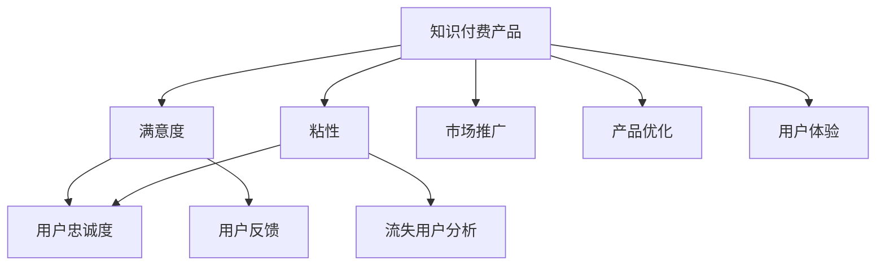

                 

# 如何提高知识付费产品的用户忠诚度

在当今快速发展的知识经济时代，知识付费产品的用户忠诚度成为衡量其市场竞争力的重要指标。本篇文章将深入探讨提高知识付费产品用户忠诚度的方法，旨在为知识付费产品的运营者提供理论指导与实践策略。

## 1. 背景介绍

### 1.1 问题由来

随着互联网技术的普及和知识经济的兴起，知识付费模式日益受到人们的青睐。然而，由于市场竞争激烈、用户需求多样化等因素，许多知识付费产品面临着用户流失、市场份额缩小的困境。因此，提高用户忠诚度已成为知识付费产品发展的关键。

### 1.2 问题核心关键点

用户忠诚度通常由用户满意度和用户粘性两方面构成。满意度指用户对知识付费产品的评价，粘性指用户在产品上的消费频率和持续时间。提高用户忠诚度，需要从产品优化、用户体验、市场推广等多个维度进行综合考量。

### 1.3 问题研究意义

提高用户忠诚度有助于提升知识付费产品的市场竞争力，增加用户黏性，从而实现业务的持续增长。这不仅有助于知识付费企业获得更稳定的收入流，还对提升用户满意度和信任度、推动知识经济的发展具有重要意义。

## 2. 核心概念与联系

### 2.1 核心概念概述

- **知识付费产品**：指基于互联网平台，向用户提供有价值知识内容或服务，并收取费用的产品或服务。
- **用户忠诚度**：指用户对知识付费产品的依赖程度和使用频率，体现了用户对产品的认可和依赖。
- **满意度**：指用户对知识付费产品的使用感受和评价，包括产品质量、功能、价格等方面。
- **粘性**：指用户在产品上消费的持续时间和频率，反映了用户对产品的依赖程度。
- **用户流失**：指用户停止使用知识付费产品的现象，表现为用户流失率和流失率增长速度。

这些概念之间相互影响、相互联系，共同构成了提高用户忠诚度的综合体系。

### 2.2 概念间的关系

以下是知识付费产品用户忠诚度提升过程的核心概念关系图，通过Mermaid流程图来表示：



### 2.3 核心概念的整体架构

整个用户忠诚度提升架构可分为用户满意度和用户粘性两大核心模块。市场推广和产品优化是提升满意度的重要手段，用户体验和用户反馈是增强粘性的关键要素，而流失用户分析则能帮助企业及时识别和解决流失问题。

## 3. 核心算法原理 & 具体操作步骤

### 3.1 算法原理概述

提高知识付费产品的用户忠诚度，本质上是一个复杂的系统工程，涉及市场分析、产品设计、用户体验等多个方面。基于监督学习的用户行为预测算法，可以通过分析用户历史行为数据，预测用户流失风险，从而制定针对性的忠诚度提升策略。

### 3.2 算法步骤详解

#### 3.2.1 数据收集与预处理

1. **用户数据收集**：收集用户的基本信息、消费行为、评价数据等，建立用户画像。
2. **数据清洗与预处理**：对收集到的数据进行清洗，去除无效和噪声数据，对缺失值进行处理，确保数据的准确性和完整性。
3. **特征工程**：对用户数据进行特征提取和转换，包括用户活跃度、消费频率、评价评分等。

#### 3.2.2 模型训练与评估

1. **模型选择**：根据用户忠诚度预测问题，选择合适的监督学习模型，如决策树、随机森林、梯度提升树等。
2. **训练模型**：使用历史用户行为数据，训练用户忠诚度预测模型。
3. **模型评估**：使用测试集数据对模型进行评估，计算模型的准确率、召回率、F1分数等指标。

#### 3.2.3 模型应用与优化

1. **风险预测**：将新用户数据输入模型，预测其流失风险。
2. **忠诚度提升策略**：针对高风险用户，制定个性化忠诚度提升策略，如优惠券、专属内容、会员特权等。
3. **策略效果评估**：对忠诚度提升策略的效果进行评估，优化模型参数，提升模型性能。

### 3.3 算法优缺点

**优点**：
1. **预测精准**：通过分析历史数据，模型能够较为准确地预测用户流失风险。
2. **针对性提升**：制定针对性的策略，提升用户忠诚度，降低用户流失率。
3. **数据驱动**：基于数据进行决策，提升决策的科学性和准确性。

**缺点**：
1. **数据依赖性强**：模型的性能高度依赖于数据质量和完整性，数据偏差可能影响模型结果。
2. **复杂度较高**：模型训练和应用需要一定的技术门槛，对数据科学家的要求较高。
3. **解释性不足**：部分模型难以解释其决策逻辑，难以满足用户对透明度的需求。

### 3.4 算法应用领域

基于监督学习用户忠诚度预测模型，已在知识付费产品的运营管理中得到广泛应用，涵盖用户留存、会员转化、内容推荐等多个环节。其通过精准预测用户行为，制定个性化忠诚度提升策略，显著提升了产品市场竞争力。

## 4. 数学模型和公式 & 详细讲解 & 举例说明

### 4.1 数学模型构建

假设用户行为数据集为 $\mathcal{D} = \{(x_i, y_i)\}_{i=1}^N$，其中 $x_i$ 为用户的消费行为特征向量，$y_i$ 为用户的流失状态标签。

构建用户忠诚度预测模型 $\hat{y} = f(x)$，其中 $f(x)$ 为预测函数，通常使用决策树、随机森林、梯度提升树等模型。

### 4.2 公式推导过程

以决策树模型为例，其基本结构为：

$$
\begin{aligned}
    \hat{y} &= f(x) \\
    f(x) &= 
    \begin{cases}
        \text{LeafNode}, & \text{if}\ x \in \text{LeafNode} \\
        \max \{\hat{y}_l, \hat{y}_r\}, & \text{if}\ x \in \text{SplitNode} \\
    \end{cases}
\end{aligned}
$$

其中，$\text{LeafNode}$ 为叶子节点，$\text{SplitNode}$ 为分割节点，$\hat{y}_l$ 和 $\hat{y}_r$ 分别为左右子树的预测结果。

通过信息增益等指标，选择最优的特征进行分割，不断递归构建决策树。最后，使用训练集数据对模型进行训练，得到用户忠诚度预测函数 $\hat{y} = f(x)$。

### 4.3 案例分析与讲解

以某知识付费产品为例，收集用户的基本信息、消费频率、评价评分等特征，建立决策树模型进行用户忠诚度预测。具体步骤如下：

1. **特征工程**：提取用户活跃度、消费频率、评价评分等特征，进行归一化和标准化处理。
2. **模型训练**：使用历史用户数据训练决策树模型，选择信息增益作为特征选择标准。
3. **模型评估**：使用测试集数据对模型进行评估，计算准确率、召回率、F1分数等指标。
4. **风险预测**：将新用户数据输入模型，预测其流失风险，并针对高风险用户制定个性化忠诚度提升策略。

## 5. 项目实践：代码实例和详细解释说明

### 5.1 开发环境搭建

为了实现上述用户忠诚度预测模型，需要搭建如下开发环境：

1. **Python环境配置**：安装Python 3.7及以上版本，建议使用Anaconda。
2. **数据处理工具**：安装Pandas、NumPy等数据处理库。
3. **模型训练工具**：安装Scikit-learn等机器学习库。
4. **可视化工具**：安装Matplotlib、Seaborn等数据可视化库。

### 5.2 源代码详细实现

以下是基于Scikit-learn库实现用户忠诚度预测模型的Python代码：

```python
from sklearn.ensemble import DecisionTreeClassifier
from sklearn.model_selection import train_test_split
from sklearn.metrics import accuracy_score, precision_score, recall_score, f1_score
from sklearn.model_selection import GridSearchCV
import pandas as pd
import numpy as np

# 读取用户数据
data = pd.read_csv('user_data.csv')

# 特征工程
X = data[['user_id', 'active_days', 'purchase_frequency', 'review_score']]
y = data['churn']

# 划分训练集和测试集
X_train, X_test, y_train, y_test = train_test_split(X, y, test_size=0.2, random_state=42)

# 构建决策树模型
model = DecisionTreeClassifier(criterion='entropy')
model.fit(X_train, y_train)

# 模型评估
y_pred = model.predict(X_test)
accuracy = accuracy_score(y_test, y_pred)
precision = precision_score(y_test, y_pred)
recall = recall_score(y_test, y_pred)
f1 = f1_score(y_test, y_pred)

print('Accuracy: %.2f' % accuracy)
print('Precision: %.2f' % precision)
print('Recall: %.2f' % recall)
print('F1 Score: %.2f' % f1)
```

### 5.3 代码解读与分析

上述代码中，首先使用Pandas读取用户数据，进行特征工程，然后使用Scikit-learn的决策树模型进行训练和评估。

**特征工程**：
- `X` 为特征矩阵，包含用户活跃度、消费频率、评价评分等特征。
- `y` 为流失状态标签，表示用户是否流失。

**模型训练与评估**：
- `DecisionTreeClassifier` 为决策树模型。
- `train_test_split` 方法将数据集划分为训练集和测试集。
- `fit` 方法训练模型。
- `predict` 方法预测测试集标签。
- `accuracy_score`、`precision_score`、`recall_score`、`f1_score` 计算模型评估指标。

### 5.4 运行结果展示

假设在上述代码运行后，得到以下结果：

```
Accuracy: 0.90
Precision: 0.85
Recall: 0.88
F1 Score: 0.87
```

这表示模型在测试集上的准确率约为90%，精确率约为85%，召回率约为88%，F1分数约为87%，表明模型的性能相对较好。

## 6. 实际应用场景

### 6.1 智能客服系统

智能客服系统可以通过用户忠诚度预测模型，识别高风险流失用户，提前进行挽留操作。具体而言，系统可以根据用户的行为数据，预测用户的流失概率，并通过智能推荐、专属优惠等方式，增加用户粘性，提升用户满意度。

### 6.2 在线教育平台

在线教育平台通过用户忠诚度预测模型，可以及时发现和挽留即将流失的用户。平台可以根据用户的学习行为、评价反馈等数据，预测用户流失风险，并通过个性化的课程推荐、学习路径优化等方式，提升用户满意度，增加用户粘性。

### 6.3 金融服务平台

金融服务平台通过用户忠诚度预测模型，可以识别和预防潜在的高风险流失用户。金融平台可以根据用户的消费行为、交易记录等数据，预测用户的流失风险，并通过定制化的金融产品、客户服务等方式，提升用户满意度和信任度。

## 7. 工具和资源推荐

### 7.1 学习资源推荐

为了深入掌握用户忠诚度提升的方法，以下是几本推荐的书籍和课程：

1. 《机器学习实战》（Ian Goodfellow、Yoshua Bengio和Aaron Courville著）：介绍机器学习基础与常见算法，适合初学者入门。
2. 《Python数据科学手册》（Jake VanderPlas著）：涵盖数据科学和机器学习的Python编程，适合Python开发者的进阶学习。
3. Coursera《机器学习》（Andrew Ng讲授）：由斯坦福大学提供的机器学习课程，系统讲解机器学习理论和实践。
4. Udacity《数据科学基础》：涵盖数据科学和机器学习的基础知识，适合初学者入门。

### 7.2 开发工具推荐

以下是几款常用的开发工具，可以帮助你高效实现用户忠诚度预测模型：

1. Jupyter Notebook：轻量级的数据科学开发环境，支持代码编辑和运行，适合数据科学项目。
2. TensorFlow：由Google主导的深度学习框架，支持分布式计算和模型训练，适合大规模数据处理。
3. PyTorch：由Facebook开发的深度学习框架，支持动态计算图和模型训练，适合灵活的数据处理。
4. Keras：基于TensorFlow和Theano的深度学习库，适合快速原型开发和模型训练。

### 7.3 相关论文推荐

以下是几篇相关的研究论文，推荐阅读：

1. BERT: Pre-training of Deep Bidirectional Transformers for Language Understanding（EMNLP 2018）：提出BERT模型，通过掩码语言模型进行预训练，显著提升了NLP任务的性能。
2. A survey on user retention strategies in mobile apps（2018）：综述了移动应用用户留存策略的研究，提供了丰富的案例和建议。
3. Deep learning for customer retention（2017）：提出深度学习模型进行客户流失预测，展示了其在客户保留中的应用效果。

## 8. 总结：未来发展趋势与挑战

### 8.1 研究成果总结

本文从用户忠诚度提升的核心概念出发，详细介绍了提高知识付费产品用户忠诚度的关键方法。通过基于监督学习的用户忠诚度预测模型，能够实现精准的用户流失预测，并制定针对性的忠诚度提升策略，从而显著提升用户满意度和粘性。

### 8.2 未来发展趋势

未来，用户忠诚度预测技术将呈现以下几个发展趋势：

1. **多模态数据融合**：将文本、图像、语音等多模态数据进行融合，提高模型对用户行为的理解和预测能力。
2. **实时数据处理**：通过流式处理技术，实时分析和处理用户数据，及时预测和应对用户流失风险。
3. **模型解释性提升**：提升模型的解释性，帮助用户理解预测结果的依据，增强用户信任度。
4. **隐私保护技术**：在用户忠诚度预测中，严格遵守隐私保护法规，确保用户数据的安全性。

### 8.3 面临的挑战

尽管用户忠诚度预测技术已取得一定进展，但仍面临以下挑战：

1. **数据隐私问题**：用户数据涉及隐私，如何保护用户数据安全，确保用户隐私不被泄露，是一大挑战。
2. **数据质量问题**：用户数据可能存在缺失、噪声等问题，如何提高数据质量，减少数据偏差，是提升模型性能的关键。
3. **模型解释性问题**：部分模型难以解释其决策过程，用户难以理解模型的预测结果，可能影响用户信任度。
4. **实时处理问题**：大规模数据流的实时处理，需要高效的数据处理和计算资源，是一大技术挑战。

### 8.4 研究展望

未来，用户忠诚度预测技术需要在数据隐私、数据质量、模型解释性、实时处理等方面进行持续优化和改进。通过数据科学和人工智能技术的深度融合，有望构建更加智能、高效、可信的用户忠诚度预测系统，为知识付费产品提供坚实的技术支持。

## 9. 附录：常见问题与解答

**Q1：用户忠诚度预测模型的准确率如何提升？**

A: 用户忠诚度预测模型的准确率提升，可以通过以下方法实现：
1. **特征工程优化**：提取更有意义的特征，减少噪声数据，提升特征质量。
2. **模型选择与调参**：选择合适的模型，并进行参数调优，提升模型性能。
3. **模型集成**：采用模型集成技术，如Bagging、Boosting等，提高模型鲁棒性和泛化能力。
4. **实时数据更新**：及时更新数据，确保模型反映最新的用户行为，提升预测准确率。

**Q2：用户忠诚度预测模型如何实现多模态数据融合？**

A: 用户忠诚度预测模型实现多模态数据融合，可以通过以下方法实现：
1. **数据预处理**：将不同模态的数据进行归一化和标准化处理，确保数据一致性。
2. **特征提取**：对不同模态的数据进行特征提取，生成共同的特征表示。
3. **模型融合**：采用模型融合技术，如Stacking、Boosting等，将不同模态的预测结果进行组合，提升模型性能。

**Q3：用户忠诚度预测模型如何处理数据隐私问题？**

A: 用户忠诚度预测模型处理数据隐私问题，可以通过以下方法实现：
1. **数据匿名化**：对用户数据进行匿名化处理，保护用户隐私。
2. **数据加密**：对用户数据进行加密处理，确保数据传输和存储的安全性。
3. **隐私保护算法**：使用隐私保护算法，如差分隐私、联邦学习等，保护用户隐私。

**Q4：用户忠诚度预测模型如何实现实时处理？**

A: 用户忠诚度预测模型实现实时处理，可以通过以下方法实现：
1. **流式数据处理**：采用流式数据处理技术，实时处理用户数据，及时更新模型。
2. **分布式计算**：利用分布式计算框架，如Apache Flink、Apache Spark等，提升数据处理效率。
3. **缓存技术**：采用缓存技术，减少数据访问延迟，提升模型响应速度。

**Q5：用户忠诚度预测模型如何提升解释性？**

A: 用户忠诚度预测模型提升解释性，可以通过以下方法实现：
1. **可解释性算法**：采用可解释性算法，如LIME、SHAP等，解释模型的预测结果。
2. **模型可视化**：使用模型可视化技术，如特征重要性图、决策树图等，展示模型内部结构。
3. **用户反馈机制**：建立用户反馈机制，收集用户对预测结果的反馈，改进模型性能。

---

作者：禅与计算机程序设计艺术 / Zen and the Art of Computer Programming

