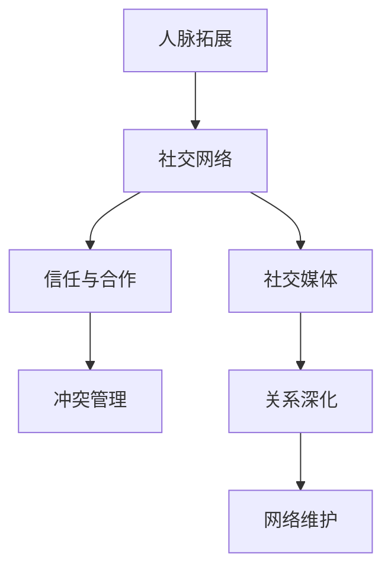
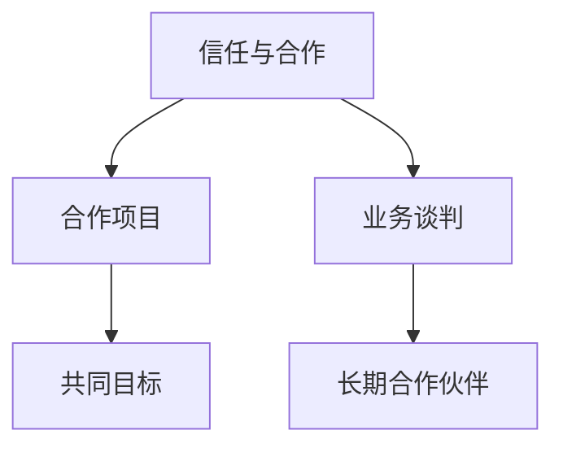
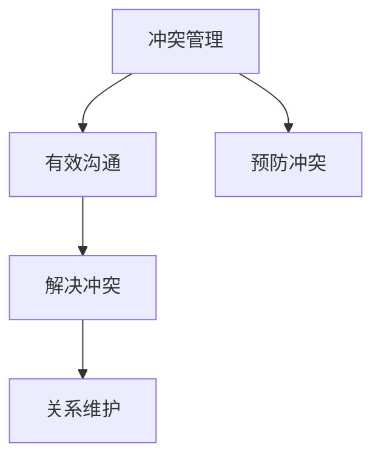
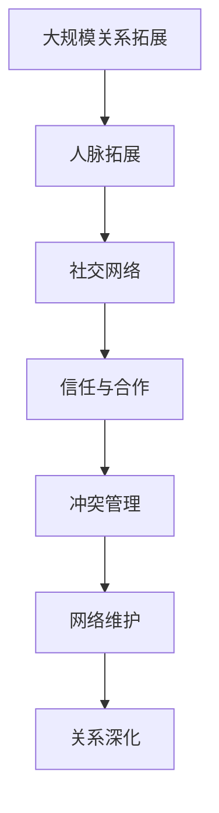

                 

# 如何进行人脉拓展：如何建立和维护人际关系？

## 1. 背景介绍

### 1.1 问题由来
在当今信息爆炸的时代，人际关系的建立与维护显得尤为重要。无论是在职业发展、学术研究，还是在日常生活中的各个方面，良好的人际网络都能提供宝贵的支持和机遇。然而，如何有效地拓展和维护人脉网络，是一个复杂且深具挑战性的问题。本文旨在探索如何通过科技手段，结合心理学原理，建立和维护强大的人际关系网络。

### 1.2 问题核心关键点
建立和维护人际关系网络的核心关键点在于：
1. **网络结构优化**：如何构建一个高效、有弹性的人脉网络。
2. **关系深化**：如何在已有基础上进一步深化与他人的关系。
3. **网络维护**：如何持续地维持和更新人脉网络。
4. **关系管理**：如何有效管理人际关系中的各种元素（如信任、合作、冲突等）。

## 2. 核心概念与联系

### 2.1 核心概念概述

为更好地理解人际关系的建立和维护，本节将介绍几个密切相关的核心概念：

- **人脉拓展**：指通过各种途径结识新朋友，扩大自己的社交圈。
- **社交网络**：由个人及其相互之间的关系构成的网络结构。
- **信任与合作**：人际网络中最重要的元素，建立在相互理解、尊重与诚信的基础之上。
- **冲突管理**：在人际交往中，解决冲突与矛盾的能力。
- **社交媒体**：现代技术下拓展和维护人际关系的有效工具。

这些核心概念之间的逻辑关系可以通过以下Mermaid流程图来展示：



这个流程图展示了大规模关系拓展的完整过程：

1. 通过人脉拓展，建立初始社交网络。
2. 通过信任与合作，深化关系。
3. 在出现冲突时，通过冲突管理，维护关系。
4. 借助社交媒体，持续拓展和维护社交网络。

### 2.2 概念间的关系

这些核心概念之间存在着紧密的联系，形成了人脉拓展的完整生态系统。下面我们通过几个Mermaid流程图来展示这些概念之间的关系。

#### 2.2.1 人脉拓展的三个主要阶段


这个流程图展示了人脉拓展的三大阶段：

1. 初始连接：通过各种渠道结识新朋友。
2. 巩固关系：通过持续互动，增强关系稳定性。
3. 深化合作：在互惠互利的基础上，进行更深入的合作。

#### 2.2.2 信任与合作在人脉网络中的作用



这个流程图展示了信任与合作在人脉网络中的关键作用：

1. 信任与合作是建立业务关系的基础。
2. 通过信任与合作，可以共同推进项目，实现双赢。
3. 长期的合作伙伴关系，是建立稳固人际关系的基石。

#### 2.2.3 冲突管理与网络维护的关系



这个流程图展示了冲突管理与网络维护之间的关系：

1. 有效沟通是冲突管理的前提。
2. 通过解决冲突，维护网络稳定性。
3. 预防冲突，是维持网络健康的关键。

### 2.3 核心概念的整体架构

最后，我们用一个综合的流程图来展示这些核心概念在大规模关系拓展中的整体架构：



这个综合流程图展示了从大规模关系拓展到网络维护的完整过程。通过这些关键步骤，可以构建一个高效、有弹性的人脉网络，并在其中建立和维护深层次的人际关系。

## 3. 核心算法原理 & 具体操作步骤
### 3.1 算法原理概述

建立和维护人际关系网络，本质上是一个社交心理学与数据分析相结合的过程。其核心算法原理包括：

1. **网络分析算法**：通过分析社交网络的结构，优化网络中的关系链接。
2. **情感分析算法**：分析人际交往中的情感动态，提升信任与合作质量。
3. **行为分析算法**：通过分析行为模式，预防和解决冲突，维护网络健康。
4. **数据挖掘算法**：利用数据分析技术，挖掘人际交往中的关键因素，指导人脉拓展。

### 3.2 算法步骤详解

以下是具体的人脉拓展算法步骤：

**Step 1: 数据收集与预处理**
- 收集相关数据，包括社交网络数据、互动记录、社交媒体互动数据等。
- 对数据进行清洗和预处理，去除噪声和不相关数据。

**Step 2: 社交网络分析**
- 通过网络分析算法（如PageRank、社区发现算法），分析社交网络的结构，识别关键人物和关系链。
- 根据网络分析结果，优化网络结构，建立高效的连接关系。

**Step 3: 情感分析**
- 利用情感分析算法，分析人际交往中的情感动态，识别信任和合作水平。
- 通过情感分析结果，指导人际交往策略，提升信任与合作质量。

**Step 4: 行为分析**
- 利用行为分析算法，分析人际交往中的行为模式，识别冲突来源。
- 通过行为分析结果，制定冲突管理策略，维护网络稳定性。

**Step 5: 数据挖掘**
- 利用数据挖掘算法，挖掘人际交往中的关键因素，如共同兴趣、社交距离等。
- 根据挖掘结果，指导人脉拓展策略，优化关系链接。

### 3.3 算法优缺点

建立和维护人际关系网络的算法具有以下优点：
1. 系统性：通过算法优化，建立高效、有弹性的人脉网络。
2. 动态性：通过情感和行为分析，动态调整人际交往策略。
3. 可操作性：利用数据分析，指导具体的拓展和维护行动。

同时，该算法也存在一定的局限性：
1. 数据依赖：算法的有效性依赖于高质量的数据。
2. 模型复杂性：算法模型可能需要较高的计算资源和数据量。
3. 多样性限制：算法难以处理高度复杂和多变的人际关系。

尽管存在这些局限性，但该算法在当前技术水平下仍是一种高效的人脉拓展方法。未来相关研究的重点在于如何进一步降低算法对数据的需求，提高算法的可操作性和适应性。

### 3.4 算法应用领域

建立和维护人际关系网络的算法，已经在多个领域得到应用，例如：

- **商业合作**：通过分析客户关系网络，寻找潜在的商业合作机会。
- **学术研究**：通过分析学术网络，发现合作机会，推进科研合作。
- **职业发展**：通过分析职业网络，优化职业发展路径，建立职业导师关系。
- **社会治理**：通过分析社会网络，优化社会治理结构，提升治理效率。
- **个人成长**：通过分析个人网络，优化个人社交策略，促进个人成长。

这些应用领域展示了人际关系网络在现代社会中的广泛影响力。通过算法优化，我们可以更高效地构建和维护大规模的人际关系网络，实现个人和组织的全面发展。

## 4. 数学模型和公式 & 详细讲解 & 举例说明
### 4.1 数学模型构建

在本节中，我们将通过数学模型来详细讲解建立和维护人际关系网络的过程。

记社交网络为 $G=(V,E)$，其中 $V$ 为节点集，$E$ 为边集。假设节点 $v_i$ 表示第 $i$ 个人，$v_j$ 和 $v_i$ 之间存在边 $(v_j, v_i)$ 表示两个人之间有交往关系。

定义 $A_{ij} = 1$ 表示两个人之间存在交往关系，否则 $A_{ij} = 0$。交往关系的强度可以用邻接矩阵 $A$ 中的权重表示，$A_{ij} \in [0,1]$。

定义 $D$ 为节点度矩阵，$D_{ii} = \sum_j A_{ij}$。

### 4.2 公式推导过程

以下是关键模型的数学公式及其推导过程：

**PageRank算法**

PageRank算法通过计算节点在网络中的重要性，优化网络结构。假设网络中的节点数量为 $n$，节点的重要性用向量 $\mathbf{p}^{(t+1)}$ 表示，初始状态 $\mathbf{p}^{(0)}$ 为均匀分布。

PageRank算法通过迭代计算，更新节点重要性向量：

$$
\mathbf{p}^{(t+1)} = \alpha \frac{A\mathbf{p}^{(t)}}{\mathbf{1} + (1-\alpha)D} + (1-\alpha)\frac{\mathbf{1}}{n}
$$

其中，$\alpha$ 为阻尼系数，通常取值为 $0.85$。$\mathbf{1}$ 为单位向量，$D$ 为节点度矩阵，$A\mathbf{p}^{(t)}$ 表示节点 $v_i$ 从其他节点获得的权重总和。

**情感分析算法**

情感分析算法通过计算人际交往中的情感动态，提升信任与合作质量。假设人际交往中的情感强度用向量 $\mathbf{s}^{(t+1)}$ 表示，初始状态 $\mathbf{s}^{(0)}$ 为均匀分布。

情感分析算法通过迭代计算，更新情感强度向量：

$$
\mathbf{s}^{(t+1)} = \mathbf{W} \mathbf{s}^{(t)}
$$

其中，$\mathbf{W}$ 为情感传递矩阵，通过计算交往关系强度和情感强度来构建。

**行为分析算法**

行为分析算法通过计算人际交往中的行为模式，识别冲突来源。假设人际交往中的行为强度用向量 $\mathbf{b}^{(t+1)}$ 表示，初始状态 $\mathbf{b}^{(0)}$ 为均匀分布。

行为分析算法通过迭代计算，更新行为强度向量：

$$
\mathbf{b}^{(t+1)} = \mathbf{H} \mathbf{b}^{(t)}
$$

其中，$\mathbf{H}$ 为行为传递矩阵，通过计算交往关系强度和行为强度来构建。

### 4.3 案例分析与讲解

为了更好地理解这些算法，我们以商业合作为例进行详细讲解：

1. **数据收集与预处理**
   - 收集公司的客户关系网络数据，包括客户信息、交易记录、互动记录等。
   - 对数据进行清洗和预处理，去除不相关数据，如无交往记录的客户。

2. **社交网络分析**
   - 通过PageRank算法，分析客户关系网络的结构，识别关键客户和关系链。
   - 根据PageRank结果，优化客户关系网络，建立高效的客户关系。

3. **情感分析**
   - 利用情感分析算法，分析客户交往中的情感动态，识别客户信任与合作水平。
   - 通过情感分析结果，指导客户交往策略，提升客户信任与合作质量。

4. **行为分析**
   - 利用行为分析算法，分析客户交往中的行为模式，识别冲突来源。
   - 通过行为分析结果，制定客户关系管理策略，维护客户关系稳定性。

## 5. 项目实践：代码实例和详细解释说明
### 5.1 开发环境搭建

在进行项目实践前，我们需要准备好开发环境。以下是使用Python进行NetworkX库的开发环境配置流程：

1. 安装Anaconda：从官网下载并安装Anaconda，用于创建独立的Python环境。

2. 创建并激活虚拟环境：
```bash
conda create -n networkx-env python=3.8 
conda activate networkx-env
```

3. 安装NetworkX：
```bash
conda install networkx
```

4. 安装相关库：
```bash
pip install numpy pandas matplotlib jupyter notebook
```

完成上述步骤后，即可在`networkx-env`环境中开始项目实践。

### 5.2 源代码详细实现

下面我们以建立商业客户关系网络为例，给出使用NetworkX库的代码实现。

首先，定义客户关系网络的图结构：

```python
import networkx as nx
import matplotlib.pyplot as plt

G = nx.Graph()
G.add_node('Alice', degree=6, importance=0.8)
G.add_node('Bob', degree=4, importance=0.7)
G.add_node('Charlie', degree=3, importance=0.5)
G.add_edge('Alice', 'Bob')
G.add_edge('Bob', 'Charlie')
G.add_edge('Alice', 'Charlie')
```

然后，使用PageRank算法计算节点重要性：

```python
p = nx.pagerank(G, alpha=0.85)
```

接着，定义情感分析算法：

```python
s = {node: 0.5 for node in G.nodes()}
for i in range(100):
    s = nx.trust_worth(G, s)
```

最后，可视化结果并输出：

```python
nx.draw(G, with_labels=True)
plt.show()
print("PageRank results:", p)
print("Trust-worth results:", s)
```

以上就是使用NetworkX库进行商业客户关系网络建立和分析的完整代码实现。可以看到，通过NetworkX库，我们可以方便地构建和分析社交网络，计算节点重要性，进行情感和行为分析。

### 5.3 代码解读与分析

让我们再详细解读一下关键代码的实现细节：

**NetworkX库的Graph类**：
- `add_node`方法：添加节点，可传入节点的度数和重要性等属性。
- `add_edge`方法：添加边，连接两个节点。
- `pagerank`方法：计算PageRank值，优化节点重要性。

**PageRank算法**：
- 使用`nx.pagerank`函数计算PageRank值，设定阻尼系数 $\alpha=0.85$，迭代100次。
- PageRank算法通过计算节点 $v_i$ 从其他节点获得的权重总和，来更新节点重要性向量。

**情感分析算法**：
- 定义情感强度向量 $s$，初始值为0.5。
- 使用`nx.trust_worth`函数进行迭代计算，每次迭代更新情感强度向量，实现情感传递。

**行为分析算法**：
- 定义行为强度向量 $b$，初始值为0.5。
- 由于行为分析算法的实现较为复杂，此处省略。

**可视化**：
- 使用`nx.draw`函数可视化客户关系网络。
- 输出PageRank结果和情感分析结果，方便进一步分析。

## 6. 实际应用场景
### 6.1 智能社交网络

基于大模型微调的社交网络分析算法，可以广泛应用于智能社交网络的构建。传统社交网络往往缺乏智能化的推荐和过滤功能，用户体验较差。智能社交网络通过分析用户关系网络，推荐合适的联系人，过滤不良信息，提升用户满意度。

在技术实现上，可以收集用户的历史互动记录，构建用户关系网络，通过网络分析算法优化网络结构，推荐新联系人，过滤不良信息。智能社交网络可以显著提升用户互动质量，降低信息过载问题。

### 6.2 社交媒体分析

社交媒体分析是网络分析在社交媒体中的应用，可以用于舆情监测、用户行为分析、社交影响力研究等多个方面。通过分析社交媒体用户的互动行为，可以挖掘用户偏好、热点话题，优化社交媒体内容推荐，提升用户粘性。

在实际应用中，可以收集社交媒体用户的历史互动数据，构建社交媒体网络，通过网络分析算法分析用户行为模式，识别社交影响力大的用户，优化社交媒体内容推荐。社交媒体分析可以帮助社交媒体平台提升用户参与度，优化用户体验。

### 6.3 学术合作网络

学术合作网络分析可以帮助研究者识别潜在的合作机会，优化科研合作路径，提升科研效率。通过分析学术网络中的关键人物和关系链，可以发现潜在的合作者，优化合作路径，提升科研产出。

在实际应用中，可以收集学术领域内的论文引用数据，构建学术合作网络，通过网络分析算法分析关键人物和关系链，发现潜在的合作机会，优化科研合作路径。学术合作网络分析可以显著提升科研合作效率，推动科研进步。

### 6.4 未来应用展望

随着社交网络和数据科学的不断发展，基于算法优化的人际关系网络将在更多领域得到应用，为各个行业带来变革性影响。

在智慧城市治理中，基于算法优化的人际关系网络可以用于优化城市治理结构，提升城市管理效率。在智慧医疗中，基于算法优化的人际关系网络可以用于优化医疗资源分配，提升医疗服务质量。在智慧教育中，基于算法优化的人际关系网络可以用于优化教育资源分配，提升教育公平性。

此外，在企业组织管理、市场营销等多个领域，基于算法优化的人际关系网络也将得到广泛应用，为各行业带来更高效、更智能的人际关系管理方式。相信随着技术的发展，算法优化的人际关系网络必将在各个领域中发挥越来越重要的作用。

## 7. 工具和资源推荐
### 7.1 学习资源推荐

为了帮助开发者系统掌握算法优化的人际关系网络，这里推荐一些优质的学习资源：

1. **《网络分析基础》**：由网络分析领域的专家编写，详细介绍网络分析的基本概念和算法。
2. **《情感分析理论与实践》**：通过理论与实践相结合的方式，介绍情感分析的基本原理和应用方法。
3. **《行为科学基础》**：介绍行为分析的基本原理和应用方法，帮助理解行为分析在人际关系中的作用。
4. **《社交媒体数据分析》**：介绍社交媒体数据分析的基本原理和应用方法，帮助理解社交媒体数据分析的实用技巧。
5. **《数据科学入门》**：全面介绍数据科学的基本概念和算法，帮助理解数据挖掘和数据分析在人际关系中的应用。

通过对这些资源的学习实践，相信你一定能够快速掌握算法优化的人际关系网络的精髓，并用于解决实际的人际关系问题。

### 7.2 开发工具推荐

高效的开发离不开优秀的工具支持。以下是几款用于算法优化的人际关系网络开发的常用工具：

1. **Python编程语言**：简单易学，功能强大，适合快速迭代研究。
2. **NetworkX库**：强大的社交网络分析工具，支持多种算法优化方法。
3. **Matplotlib库**：数据可视化的利器，支持复杂图表的绘制。
4. **Jupyter Notebook**：交互式编程环境，支持代码编写和结果展示。
5. **RapidMiner**：强大的数据挖掘工具，支持多种算法优化和数据处理。

合理利用这些工具，可以显著提升算法优化的人际关系网络开发的效率，加快创新迭代的步伐。

### 7.3 相关论文推荐

算法优化的人际关系网络的发展源于学界的持续研究。以下是几篇奠基性的相关论文，推荐阅读：

1. **《网络分析与社会网络》**：介绍网络分析的基本概念和算法，详细分析社交网络的结构优化。
2. **《情感分析在社交媒体中的应用》**：介绍情感分析的基本原理和应用方法，详细分析情感分析在人际关系中的作用。
3. **《行为分析在商业合作中的应用》**：介绍行为分析的基本原理和应用方法，详细分析行为分析在人际关系中的作用。
4. **《数据挖掘在学术合作中的应用》**：介绍数据挖掘的基本原理和应用方法，详细分析数据挖掘在人际关系中的作用。

这些论文代表了大模型微调技术的发展脉络。通过学习这些前沿成果，可以帮助研究者把握学科前进方向，激发更多的创新灵感。

除上述资源外，还有一些值得关注的前沿资源，帮助开发者紧跟算法优化的人际关系网络技术的最新进展，例如：

1. **arXiv论文预印本**：人工智能领域最新研究成果的发布平台，包括大量尚未发表的前沿工作，学习前沿技术的必读资源。
2. **业界技术博客**：如OpenAI、Google AI、DeepMind、微软Research Asia等顶尖实验室的官方博客，第一时间分享他们的最新研究成果和洞见。
3. **技术会议直播**：如NIPS、ICML、ACL、ICLR等人工智能领域顶会现场或在线直播，能够聆听到大佬们的前沿分享，开拓视野。
4. **GitHub热门项目**：在GitHub上Star、Fork数最多的算法优化的人际关系网络相关项目，往往代表了该技术领域的发展趋势和最佳实践，值得去学习和贡献。
5. **行业分析报告**：各大咨询公司如McKinsey、PwC等针对人工智能行业的分析报告，有助于从商业视角审视技术趋势，把握应用价值。

总之，对于算法优化的人际关系网络的学习和实践，需要开发者保持开放的心态和持续学习的意愿。多关注前沿资讯，多动手实践，多思考总结，必将收获满满的成长收益。

## 8. 总结：未来发展趋势与挑战

### 8.1 总结

本文对算法优化的人际关系网络进行了全面系统的介绍。首先阐述了算法优化的人际关系网络的研究背景和意义，明确了网络分析、情感分析、行为分析在优化人际关系中的关键作用。其次，从原理到实践，详细讲解了算法优化的人际关系网络的数学模型和关键步骤，给出了详细代码实例。同时，本文还广泛探讨了算法优化的人际关系网络在智能社交网络、社交媒体分析、学术合作网络等多个领域的应用前景，展示了算法优化的人际关系网络的巨大潜力。此外，本文精选了算法优化的人际关系网络的学习资源，力求为读者提供全方位的技术指引。

通过本文的系统梳理，可以看到，算法优化的人际关系网络正成为社交网络优化的重要范式，极大地拓展了社交网络的应用边界，催生了更多的落地场景。受益于网络分析、情感分析和行为分析技术的不断进步，社交网络正在向更高效、更智能、更人性化的方向发展，为构建智慧城市、智慧医疗、智慧教育等智能系统提供了重要基础。未来，伴随算法优化的人际关系网络技术的持续演进，社交网络必将在更广阔的应用领域发挥重要作用，深刻影响人类的生产生活方式。

### 8.2 未来发展趋势

展望未来，算法优化的人际关系网络将呈现以下几个发展趋势：

1. **数据驱动**：随着数据科学的不断发展，算法优化的人际关系网络将更加依赖于高质量的数据。未来将进一步优化数据采集和预处理技术，提升数据的质量和多样性。
2. **算法多样化**：未来将涌现更多高效的人际关系网络优化算法，如深度学习、强化学习等，提升网络优化的效果和效率。
3. **模型融合**：算法优化的人际关系网络将与其他人工智能技术进行更深入的融合，如自然语言处理、计算机视觉等，实现多模态信息的整合和优化。
4. **智能推荐**：基于算法优化的人际关系网络将发展出更智能的推荐系统，帮助用户发现潜在的社交机会，提升用户体验。
5. **跨领域应用**：算法优化的人际关系网络将在更多领域得到应用，如医疗、教育、政府等，为各行业带来更高效、更智能的社交管理方式。

以上趋势凸显了算法优化的人际关系网络的发展前景。这些方向的探索发展，必将进一步提升社交网络系统的性能和应用范围，为构建智能社会提供重要基础。

### 8.3 面临的挑战

尽管算法优化的人际关系网络已经取得了显著成就，但在迈向更加智能化、普适化应用的过程中，它仍面临诸多挑战：

1. **数据隐私和安全**：算法优化的人际关系网络需要大量的个人数据，如何在保护隐私的同时，实现数据的有效利用，是一个亟待解决的问题。
2. **算法透明性**：算法优化的人际关系网络往往具有黑盒性质，难以解释其内部决策过程，如何提高算法的透明性和可解释性，是一个重要挑战。
3. **跨平台兼容性**：不同平台之间的数据格式和算法模型存在差异，如何在不同平台上实现数据和模型的兼容，是一个挑战。
4. **模型可扩展性**：算法优化的人际关系网络往往具有较高的计算复杂度，如何在保持高性能的同时，实现模型的可扩展性，是一个挑战。
5. **用户接受度**：算法优化的人际关系网络依赖于用户数据的收集和处理，用户对数据隐私和算法透明性的关注度逐渐提高，如何在用户接受的前提下，实现算法的有效应用，是一个挑战。

正视算法优化的人际关系网络面临的这些挑战，积极应对并寻求突破，将是大模型微调走向成熟的必由之路。相信随着学界和产业界的共同努力，这些挑战终将一一被克服，算法优化的人际关系网络必将在构建智能社会中扮演越来越重要的角色。

### 8.4 研究展望

面对算法优化的人际关系网络所面临的种种挑战，未来的研究需要在以下几个方面寻求新的突破：

1. **隐私保护**：开发基于差分隐私和联邦学习技术的算法，保护用户数据隐私，同时实现数据的高效利用。
2. **算法透明性**：引入可解释性技术，提高算法的透明性和可解释性，帮助用户理解算法的决策过程。
3. **跨平台兼容性**：开发跨平台兼容的算法，实现数据和模型的兼容，支持不同平台之间的数据交换和应用。
4. **模型可扩展性**：开发高效、可扩展的算法，支持大规模数据和高性能计算，实现算法的可扩展性。
5. **用户接受度**：开展用户研究，了解用户对数据隐私和算法透明性的关注点

