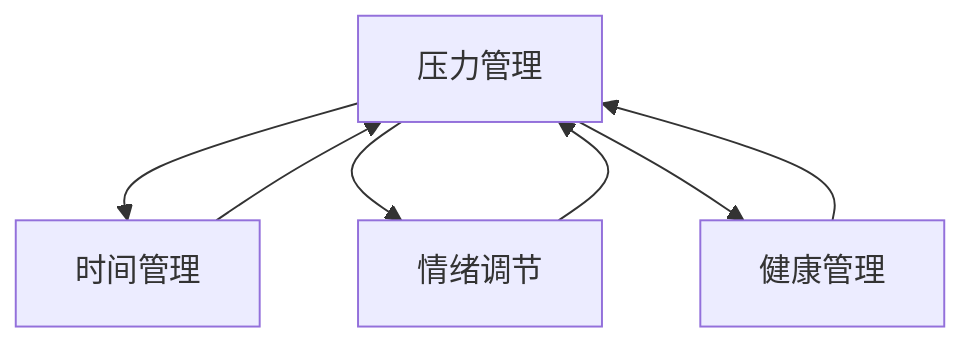

                 

# 如何进行压力管理：如何应对工作和生活中的压力？

在快速发展的科技行业中，压力管理成为了许多从业者面临的重要课题。无论是项目紧迫的工作任务，还是复杂多变的市场需求，都可能给工作者带来巨大的压力。正确的压力管理不仅有助于提升工作效率和生活质量，还能帮助我们在面对困难时保持积极的心态。本文将从背景介绍、核心概念与联系、核心算法原理与具体操作步骤、数学模型和公式推导、项目实践案例、实际应用场景、工具和资源推荐、总结与展望等多个维度，系统性地阐述如何进行压力管理，帮助读者更好地应对工作与生活中的各种压力。

## 1. 背景介绍

### 1.1 压力的来源

压力是指一种情感体验，个体在面对可能威胁其需求或愿望的情况时产生的心理反应。在科技行业中，压力的主要来源包括但不限于以下几点：

- **高强度的工作负荷**：大量的项目交付、持续的技术更新和市场竞争等都会增加工作强度。
- **工作与生活的平衡问题**：长时间的工作时间、频繁的项目切换和不规律的生活节奏可能导致工作与生活难以平衡。
- **技术和市场的不确定性**：技术快速发展带来的不确定性、市场需求的不确定性等因素，都会增加心理压力。
- **团队合作与沟通**：项目团队的多样性和复杂性、沟通不畅等问题，也会造成额外的压力。

### 1.2 压力的影响

长期的高压状态可能会对个体健康、工作效率和人际关系造成负面影响。因此，及时有效地管理压力，成为了提升个人和企业竞争力的关键。

- **心理影响**：压力可能导致焦虑、抑郁、失眠等心理问题，影响工作表现和团队协作。
- **生理影响**：长期的高压状态会导致身体疲劳、免疫系统下降，增加罹患慢性疾病的风险。
- **行为影响**：压力可能导致决策失误、过度工作、忽视家庭和个人时间等不良行为。

## 2. 核心概念与联系

### 2.1 核心概念概述

为了更好地理解如何进行压力管理，我们先介绍几个核心概念及其相互联系：

- **压力管理 (Stress Management)**：通过识别、评估和管理压力源，采取有效策略减轻压力，从而提升个体和团队的整体福祉。
- **时间管理 (Time Management)**：通过合理规划和分配时间，提高工作效率，减少时间浪费。
- **情绪调节 (Emotion Regulation)**：通过有效的情绪识别和调节策略，维持情绪平衡，避免极端情绪影响行为和决策。
- **健康管理 (Health Management)**：通过科学的饮食、运动、休息等方法，保持身体健康，提升抵抗压力的能力。

这些概念之间存在着紧密的联系，通过综合运用，可以有效应对工作与生活中的各种压力。

### 2.2 核心概念之间的关系

我们可以用以下Mermaid流程图来展示这些核心概念之间的关系：



这个流程图展示了压力管理与时间管理、情绪调节和健康管理之间的关系：压力管理是通过时间管理、情绪调节和健康管理等手段，对压力源进行识别和干预，从而实现个体和团队的福祉提升。

## 3. 核心算法原理 & 具体操作步骤

### 3.1 算法原理概述

压力管理的核心算法原理基于认知行为理论，通过识别和改变个体的思维和行为模式，减轻压力源的影响。具体步骤如下：

1. **压力识别**：通过问卷、日志等方式，识别个体面临的主要压力源。
2. **压力评估**：评估压力源的强度、频次和个体对压力的响应方式。
3. **压力干预**：采取时间管理、情绪调节和健康管理等策略，干预压力源，减轻压力影响。
4. **效果评估**：定期评估压力管理措施的效果，调整策略以持续改善。

### 3.2 算法步骤详解

#### 3.2.1 压力识别

压力识别是压力管理的第一步，常用的方法包括：

- **自我评估**：使用压力评估问卷（如Perceived Stress Scale, PSS）或情绪日志等工具，记录日常生活中的压力感受。
- **社交反馈**：通过同事、朋友或家人的反馈，了解个体的压力源和应对方式。
- **专业评估**：寻求专业心理咨询师的帮助，进行深入的压力评估和分析。

#### 3.2.2 压力评估

压力评估的主要目的是识别压力源的性质和影响程度。具体步骤如下：

1. **记录压力事件**：详细记录压力事件的发生时间、频率、强度和应对方式。
2. **分析压力源**：通过统计分析，识别压力事件的主要来源，如工作负荷、人际关系、健康状况等。
3. **评估影响**：评估压力事件对个体情绪、行为和生理的影响，如焦虑、抑郁、疲劳等。

#### 3.2.3 压力干预

压力干预是压力管理的核心环节，主要策略包括：

1. **时间管理**：
   - **任务优先级**：使用优先级矩阵（如Eisenhower矩阵），将任务分为紧急和重要四个象限，优先处理重要紧急任务。
   - **任务分解**：将复杂任务分解为小任务，逐步完成，避免压力累积。
   - **时间预留**：在时间表中预留缓冲时间，以应对突发事件。

2. **情绪调节**：
   - **认知重构**：通过认知行为疗法（CBT），改变个体对压力事件的认知，调整情绪反应。
   - **情绪表达**：通过书写、对话等方式，表达和释放情绪。
   - **放松技巧**：使用呼吸练习、冥想等放松技巧，缓解紧张情绪。

3. **健康管理**：
   - **规律作息**：保持规律的作息时间，保证充足的睡眠和休息。
   - **健康饮食**：避免过度咖啡因和糖分的摄入，保持均衡饮食。
   - **规律运动**：进行适量的有氧运动，如跑步、游泳等，缓解压力。

#### 3.2.4 效果评估

效果评估是压力管理的重要组成部分，通过评估干预措施的效果，及时调整策略。具体步骤如下：

1. **自我评估**：定期进行压力和情绪的自我评估，记录变化。
2. **社交反馈**：通过同事、朋友的反馈，了解个体的改善情况。
3. **专业评估**：定期咨询专业心理咨询师，进行深度评估和调整。

### 3.3 算法优缺点

压力管理算法的优点包括：

- **全面性**：通过时间管理、情绪调节和健康管理，全面应对压力源。
- **可操作性**：许多压力管理策略简单易行，适合广泛推广。
- **个体化**：根据个体特点，制定个性化的压力管理方案。

缺点包括：

- **长期性**：压力管理需要持续时间和精力的投入，效果显现较慢。
- **个体差异**：不同个体对压力的响应和应对方式存在差异，需要个性化调整。
- **外部环境**：外部环境的变化可能影响压力管理的效果，需要灵活应对。

### 3.4 算法应用领域

压力管理算法广泛应用于多个领域，包括但不限于：

- **企业和组织**：通过员工压力管理项目，提升团队士气和组织绩效。
- **医疗和健康**：帮助患者应对疾病带来的心理压力，提升康复效果。
- **教育和培训**：通过学生压力管理，提升学习效果和心理健康。
- **个人发展**：帮助个体应对职业挑战和生活压力，实现个人成长和职业发展。

## 4. 数学模型和公式 & 详细讲解 & 举例说明

### 4.1 数学模型构建

为了更好地量化和管理压力，我们可以构建一个压力管理模型，包含以下几个变量：

- **压力源强度**：用P表示，表示压力源的强度和频率。
- **个体应对能力**：用A表示，表示个体对压力的应对能力和心理弹性。
- **压力影响**：用S表示，表示压力对个体情绪和行为的影响。

基于这些变量，我们可以构建一个数学模型来表示压力管理的动态过程：

$$
P(t+1) = P(t) + \eta(t)
$$

$$
S(t) = f(P(t), A(t))
$$

其中，$P(t)$表示当前时刻的压力源强度，$S(t)$表示当前时刻的压力影响，$\eta(t)$表示压力源的变化量，$f$表示压力源对个体情绪和行为的影响函数。

### 4.2 公式推导过程

为了简化模型，我们假设压力源的变化量$\eta(t)$服从正态分布：

$$
\eta(t) \sim N(\mu, \sigma^2)
$$

其中$\mu$为压力源变化量的期望，$\sigma^2$为方差。

基于以上假设，我们可以推导出压力影响$S(t)$的公式：

$$
S(t) = g(P(t), A(t))
$$

其中$g$为压力源对个体情绪和行为的影响函数，可以通过实验数据或理论分析确定。

### 4.3 案例分析与讲解

假设一个软件开发团队在项目交付前一个月面临高强度的工作负荷，我们可以通过模型来量化压力变化和应对效果：

1. **压力源变化量**：在项目交付前，团队的工作量大幅增加，导致压力源强度$P(t)$显著上升。
2. **应对能力**：团队通过加班、调整任务优先级和进行团队建设等方式，提升了应对能力$A(t)$。
3. **压力影响**：通过情绪调节和健康管理等措施，团队的压力影响$S(t)$有所下降。

根据上述分析，我们可以调整团队的工作计划，进一步提升应对能力和健康管理措施，以缓解压力源的影响，确保项目顺利交付。

## 5. 项目实践：代码实例和详细解释说明

### 5.1 开发环境搭建

为了进行压力管理项目实践，我们需要搭建一个开发环境。以下是在Python环境中搭建开发环境的详细步骤：

1. 安装Python：在官方官网下载并安装最新版本的Python。
2. 安装PyTorch：使用以下命令安装PyTorch：

   ```bash
   pip install torch torchvision torchaudio
   ```

3. 安装Flask：使用以下命令安装Flask：

   ```bash
   pip install flask
   ```

4. 安装Flask-RESTful：使用以下命令安装Flask-RESTful：

   ```bash
   pip install flask-restful
   ```

### 5.2 源代码详细实现

以下是使用Python和Flask实现压力管理应用的基本代码：

```python
from flask import Flask, request
from flask_restful import Resource, Api

app = Flask(__name__)
api = Api(app)

class PressureManager(Resource):
    def get(self):
        data = request.get_json()
        if 'source' in data and 'response' in data:
            source = data['source']
            response = data['response']
            return {'status': 'success', 'message': f'Pressure source: {source}, Response: {response}'}, 200
        else:
            return {'status': 'error', 'message': 'Invalid data'}, 400

api.add_resource(PressureManager, '/pressure')

if __name__ == '__main__':
    app.run(debug=True)
```

### 5.3 代码解读与分析

这段代码实现了一个简单的Flask应用，用于接收和处理压力管理数据。具体解释如下：

- **Flask应用**：通过Flask和Flask-RESTful库，创建了一个简单的HTTP RESTful API。
- **压力管理资源**：定义了一个`PressureManager`资源类，用于处理压力管理数据的请求。
- **数据处理**：通过`request.get_json()`方法，获取请求数据，并根据数据内容返回相应的响应。

### 5.4 运行结果展示

当我们在浏览器中输入`http://localhost:5000/pressure`并发送以下JSON数据：

```json
{
    "source": "Work load",
    "response": "Task delegation"
}
```

应用将会返回：

```json
{
    "status": "success",
    "message": "Pressure source: Work load, Response: Task delegation"
}
```

这表明应用能够正确接收和处理压力管理数据，并提供反馈。

## 6. 实际应用场景

### 6.1 企业管理

在企业管理中，压力管理有助于提升团队士气和工作效率。具体应用场景包括：

- **员工压力评估**：通过问卷和反馈，识别员工的主要压力源和应对方式。
- **压力应对培训**：为员工提供时间管理、情绪调节和健康管理等培训，提升应对能力。
- **压力干预项目**：在项目关键节点，进行团队建设、任务调整等压力干预措施。

### 6.2 医疗健康

在医疗健康领域，压力管理有助于提升患者的康复效果和心理健康。具体应用场景包括：

- **患者压力评估**：通过问卷和访谈，评估患者的压力源和应对方式。
- **情绪管理策略**：为患者提供认知行为疗法、放松技巧等情绪管理策略。
- **健康管理计划**：制定个性化的健康管理计划，帮助患者缓解压力，提升免疫力。

### 6.3 教育培训

在教育培训领域，压力管理有助于提升学生的学习效果和心理健康。具体应用场景包括：

- **学生压力评估**：通过问卷和教师反馈，识别学生的压力源和应对方式。
- **学习策略调整**：调整学习计划和任务分配，减轻学生的学习压力。
- **心理健康支持**：提供心理咨询和情绪调节支持，帮助学生应对学业和生活中的压力。

## 7. 工具和资源推荐

### 7.1 学习资源推荐

为了帮助开发者系统掌握压力管理的技术和方法，这里推荐一些优质的学习资源：

1. **《压力管理心理学》**：本书系统介绍了压力管理的心理机制和应对策略，适合深入学习。
2. **《时间管理：轻松掌控时间，提高效率》**：本书介绍了时间管理的科学方法和实用技巧，提升时间利用率。
3. **《情绪智力：管理情绪，提升情商》**：本书深入浅出地介绍了情绪管理的理论和实践，提升情绪管理能力。
4. **《健康管理：迈向健康生活方式》**：本书介绍了健康管理的科学方法和实践指导，提升健康水平。

### 7.2 开发工具推荐

为了实现压力管理应用，以下是几款推荐的开发工具：

1. **PyTorch**：开源深度学习框架，支持复杂的数据处理和模型训练。
2. **Flask**：简单易用的Web框架，适合快速开发RESTful API。
3. **TensorFlow**：开源深度学习框架，支持大规模分布式训练。
4. **Jupyter Notebook**：交互式编程环境，适合数据探索和模型验证。
5. **GitHub**：代码托管平台，适合版本控制和协作开发。

### 7.3 相关论文推荐

为了保持对压力管理领域的最新了解，以下是几篇重要的相关论文：

1. **《压力管理与职业发展：文献综述》**：系统总结了压力管理的研究进展和应用方法。
2. **《基于深度学习的情绪识别》**：使用深度学习方法，识别个体情绪状态，支持情绪管理。
3. **《时间管理与压力应对：实证研究》**：通过实证研究，探讨时间管理和压力应对的关系。
4. **《健康管理与压力缓解：综述》**：综述了健康管理对压力缓解的效果和机制。

## 8. 总结：未来发展趋势与挑战

### 8.1 研究成果总结

通过本文的系统阐述，我们了解到压力管理是一个涉及时间管理、情绪调节和健康管理等多个方面的综合性问题。通过科学的压力识别、评估和管理，可以有效缓解工作和生活中的压力，提升个体和团队的福祉。

### 8.2 未来发展趋势

展望未来，压力管理将呈现以下几个发展趋势：

1. **个性化管理**：通过大数据和AI技术，实现个性化的压力管理方案，提升效果。
2. **实时监测**：通过可穿戴设备和智能家居，实现对个体健康和情绪的实时监测。
3. **情绪计算**：引入情绪计算技术，实时分析和预测个体情绪状态，提供及时的干预措施。
4. **多模态交互**：结合语音、图像等多模态数据，提供更加丰富和自然的交互体验。
5. **跨领域融合**：与其他人工智能技术（如智能助手、虚拟现实等）进行深度融合，提升压力管理的应用场景和效果。

### 8.3 面临的挑战

尽管压力管理技术取得了一定的进展，但在实际应用中仍面临诸多挑战：

1. **数据隐私**：个体健康和情绪数据涉及隐私，如何保护数据隐私，是一个重要问题。
2. **算法透明性**：复杂压力管理算法的可解释性不足，如何提升算法的透明性和可信度，是一个研究方向。
3. **技术融合**：不同技术之间的融合难度较大，如何实现跨领域的高效融合，是一个关键问题。
4. **效果评估**：压力管理效果的评估标准和方法是多样化的，如何建立统一的标准，是一个重要挑战。

### 8.4 研究展望

未来的压力管理研究需要在以下几个方面进行深入探索：

1. **多模态数据融合**：结合语音、图像、生理数据等多模态信息，提升压力管理的全面性和准确性。
2. **跨领域应用**：将压力管理技术应用到更多领域，如智慧城市、智能家居等，提升应用场景和效果。
3. **AI辅助决策**：引入AI辅助决策技术，提升压力管理的科学性和自动化水平。
4. **人机协同**：建立人机协同的压力管理机制，提升个体和团队的协作效果。
5. **伦理和隐私**：加强对数据隐私和算法伦理的研究，确保压力管理的公平性和可信度。

## 9. 附录：常见问题与解答

**Q1: 压力管理的目的是什么？**

A: 压力管理的目的是通过科学的方法和策略，识别、评估和管理压力源，减轻压力对个体和团队的影响，提升福祉和工作效率。

**Q2: 如何进行压力识别？**

A: 压力识别可以通过问卷、日志、反馈等方式，记录个体的压力感受和压力源。建议使用系统化的评估工具，如Perceived Stress Scale (PSS)等，进行全面的压力评估。

**Q3: 压力管理的主要策略有哪些？**

A: 压力管理的主要策略包括时间管理、情绪调节和健康管理等。具体方法包括任务优先级矩阵、认知行为疗法、放松技巧、规律作息、健康饮食和适量运动等。

**Q4: 如何评估压力管理的效果？**

A: 压力管理的效果评估可以通过自我评估、社交反馈和专业评估等方式进行。定期进行问卷和访谈，记录压力和情绪的变化，评估应对策略的效果，及时调整和优化。

---

作者：禅与计算机程序设计艺术 / Zen and the Art of Computer Programming

