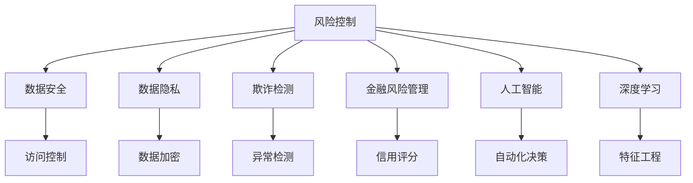

                 

# 如何进行风险控制：如何规避风险和降低损失？

> 关键词：风险控制, 数据安全, 数据隐私, 欺诈检测, 金融风险管理, 人工智能, 深度学习

## 1. 背景介绍

### 1.1 问题由来
随着信息技术的发展，企业在处理、存储、传输和分析数据方面越来越依赖于自动化系统。然而，这些系统同时也面临着诸如数据泄露、系统攻击、欺诈行为等各种风险，这些风险可能对企业造成重大损失。

在金融行业，数据泄露和欺诈行为尤为突出，不仅对企业造成经济损失，还会对客户的信任造成严重打击。在医疗行业，医疗数据的泄露可能导致患者隐私被侵犯，影响治疗效果和决策。在政府机构，数据的泄露可能危及国家安全。

为了防范这些风险，企业需要构建有效的风险控制机制。这不仅包括对现有系统的安全加固，还需要引入新的技术手段，提升风险防控能力。

### 1.2 问题核心关键点
风险控制的核心在于通过有效的技术手段和策略，识别和防范各种风险，减少或避免损失。

关键问题包括：
- 如何识别和分类各种潜在风险。
- 如何通过技术手段（如机器学习、深度学习等）识别和预测风险事件。
- 如何在数据安全和隐私保护的前提下，进行有效的风险监控和响应。
- 如何优化风险管理流程，降低风险损失。

### 1.3 问题研究意义
进行风险控制的意义在于：
1. 保护企业利益。通过及时发现和防范风险，减少企业损失。
2. 保护客户隐私。确保数据安全，保护客户隐私，增强客户信任。
3. 提升业务运营效率。优化风险管理流程，减少运营成本，提升业务效率。
4. 构建合规体系。确保企业运营符合法律法规要求，避免法律风险。
5. 推动技术创新。引入先进的风险控制技术，提升风险防控能力，推动企业技术创新。

## 2. 核心概念与联系

### 2.1 核心概念概述

为了更好地理解风险控制的技术手段，本节将介绍几个密切相关的核心概念：

- **风险控制(Risk Control)**：通过各种技术和策略，识别和防范风险，减少或避免损失的过程。
- **数据安全(Data Security)**：保护数据免受未授权访问、泄露、破坏或篡改的措施。
- **数据隐私(Data Privacy)**：确保个人数据在收集、存储、使用和共享过程中，不受侵犯的权利。
- **欺诈检测(Fraud Detection)**：通过数据分析和机器学习技术，识别和预防欺诈行为的过程。
- **金融风险管理(Financial Risk Management)**：对金融领域的各种风险（如信用风险、市场风险等）进行识别、评估和控制的过程。
- **人工智能(Artificial Intelligence, AI)**：使用计算机算法和模型，模拟人类智能行为的技术。
- **深度学习(Deep Learning)**：一种利用多层神经网络处理复杂数据的技术，适用于处理大规模数据和非线性问题。

这些核心概念之间的逻辑关系可以通过以下Mermaid流程图来展示：



这个流程图展示了一些核心概念之间的关系：

1. 风险控制通过数据安全、数据隐私、欺诈检测、金融风险管理、人工智能和深度学习等技术手段，识别和防范风险。
2. 数据安全主要通过访问控制和数据加密等手段，保护数据免受未授权访问。
3. 数据隐私保护通过各种法律法规和技术手段，确保个人数据不被侵犯。
4. 欺诈检测通过异常检测技术，识别和预防欺诈行为。
5. 金融风险管理通过信用评分等手段，对金融领域的各种风险进行评估和控制。
6. 人工智能和深度学习通过自动化决策和特征工程等技术，提升风险防控能力。

### 2.2 概念间的关系

这些核心概念之间存在着紧密的联系，形成了风险控制的技术生态系统。

- **风险控制与数据安全**：风险控制是数据安全的一部分，数据安全是风险控制的基础。通过强化数据安全，可以有效降低风险。
- **风险控制与数据隐私**：风险控制与数据隐私密切相关，保护数据隐私是风险控制的重要目标之一。
- **风险控制与欺诈检测**：欺诈检测是风险控制的重要手段，通过识别和预防欺诈行为，可以大大降低风险。
- **风险控制与金融风险管理**：金融风险管理是风险控制的重要应用场景之一，通过金融风险管理，可以有效控制金融领域的各种风险。
- **风险控制与人工智能和深度学习**：人工智能和深度学习是风险控制的重要技术手段，通过引入先进的AI技术，可以提升风险防控能力。

这些概念共同构成了风险控制的完整生态系统，使其能够全面应对各种风险挑战。通过理解这些概念之间的关系，我们可以更好地把握风险控制的技术框架和实施步骤。

## 3. 核心算法原理 & 具体操作步骤
### 3.1 算法原理概述

风险控制的核心算法原理是通过数据驱动的模型和策略，识别和防范各种风险。具体而言，包括以下几个关键步骤：

1. **数据收集**：收集与风险相关的数据，如交易数据、用户行为数据、日志数据等。
2. **数据预处理**：对数据进行清洗、归一化、特征提取等预处理工作。
3. **模型训练**：使用机器学习和深度学习模型对数据进行训练，识别和预测风险事件。
4. **风险评估**：根据模型预测结果，评估风险事件的可能性及其对企业的影响。
5. **风险响应**：根据风险评估结果，制定和执行风险响应策略，减少或避免损失。

这些步骤构成了风险控制的技术框架，通过不断迭代和优化，可以不断提高风险防控能力。

### 3.2 算法步骤详解

以下是风险控制的具体操作步骤：

#### 3.2.1 数据收集
- 从交易系统、用户行为记录、日志文件等数据源，收集与风险相关的数据。
- 确保数据的准确性和完整性，避免数据丢失或篡改。

#### 3.2.2 数据预处理
- 对收集到的数据进行清洗，去除无效或异常数据。
- 对数据进行归一化，使其符合模型的输入要求。
- 使用特征工程技术，提取对风险预测有贡献的特征。

#### 3.2.3 模型训练
- 选择合适的机器学习或深度学习模型，如决策树、随机森林、神经网络等。
- 使用历史数据对模型进行训练，不断调整模型参数，提高模型的预测精度。
- 使用交叉验证等技术，评估模型的泛化能力。

#### 3.2.4 风险评估
- 使用训练好的模型对实时数据进行预测，评估风险事件的可能性。
- 根据预测结果，计算风险事件对企业的影响程度，如经济损失、声誉损失等。
- 使用风险矩阵等方法，对风险事件进行分类和优先级排序。

#### 3.2.5 风险响应
- 根据风险评估结果，制定和执行风险响应策略，如拒绝交易、增加审核、加强监控等。
- 实时监控风险响应效果，根据实际情况进行调整和优化。

### 3.3 算法优缺点

风险控制算法具有以下优点：
1. 数据驱动。通过分析历史数据，预测未来风险，具有较强的数据驱动性。
2. 自动响应。通过自动化系统，及时响应风险事件，减少人工干预。
3. 风险评估。通过精确的风险评估，帮助企业做出合理决策。

同时，风险控制算法也存在以下缺点：
1. 数据依赖。需要大量高质量的数据进行训练和测试，数据质量对模型效果有重大影响。
2. 模型复杂。深度学习模型通常具有较高的复杂度，需要较长的训练时间和较高的计算资源。
3. 难以解释。机器学习模型通常是黑盒模型，难以解释其内部决策过程，不易进行调试和优化。

### 3.4 算法应用领域

风险控制算法在金融、保险、医疗、政府等多个领域具有广泛的应用前景：

#### 3.4.1 金融行业
在金融行业，风险控制算法可以应用于以下几个方面：
- 信用风险管理：通过分析用户的信用记录、行为数据等，评估用户的信用风险，控制贷款发放。
- 欺诈检测：通过分析交易数据、行为数据等，识别和预防欺诈行为，保护客户资金安全。
- 市场风险管理：通过分析市场数据、交易数据等，评估市场风险，控制投资决策。

#### 3.4.2 保险行业
在保险行业，风险控制算法可以应用于以下几个方面：
- 风险评估：通过分析历史理赔数据、用户行为数据等，评估用户的风险等级，控制保费定价。
- 欺诈检测：通过分析理赔数据、行为数据等，识别和预防欺诈行为，控制理赔成本。
- 理赔管理：通过分析理赔数据、行为数据等，优化理赔流程，提升理赔效率。

#### 3.4.3 医疗行业
在医疗行业，风险控制算法可以应用于以下几个方面：
- 患者风险管理：通过分析患者的历史诊疗记录、行为数据等，评估患者的风险等级，控制诊疗方案。
- 药品安全：通过分析药品的使用数据、患者数据等，评估药品的安全性，控制药品使用。
- 医疗欺诈检测：通过分析医疗数据、行为数据等，识别和预防医疗欺诈行为，保护医疗资源。

#### 3.4.4 政府行业
在政府行业，风险控制算法可以应用于以下几个方面：
- 公共安全：通过分析公共事件数据、行为数据等，评估公共安全风险，控制安全决策。
- 反欺诈：通过分析交易数据、行为数据等，识别和预防欺诈行为，保护公共资源。
- 应急响应：通过分析事件数据、行为数据等，优化应急响应流程，提升应急响应效率。

## 4. 数学模型和公式 & 详细讲解  
### 4.1 数学模型构建

风险控制的核心数学模型是通过机器学习和深度学习技术，建立风险预测模型。具体而言，包括以下几个关键模型：

- **逻辑回归(Logistic Regression)**：用于分类预测，计算风险事件的可能性。
- **支持向量机(Support Vector Machine, SVM)**：用于分类预测，计算风险事件的可能性。
- **决策树(Decision Tree)**：用于分类和回归预测，计算风险事件的可能性。
- **随机森林(Random Forest)**：用于分类和回归预测，计算风险事件的可能性。
- **神经网络(Neural Network)**：用于分类和回归预测，计算风险事件的可能性。

这些模型通过历史数据进行训练，评估模型的预测精度和泛化能力。

### 4.2 公式推导过程

以下是逻辑回归模型的推导过程：

假设风险事件发生与否为二分类问题，令 $y$ 表示风险事件是否发生，$y=0$ 表示不发生，$y=1$ 表示发生。令 $x$ 表示影响风险事件的特征向量，则逻辑回归模型的目标是最大化似然函数：

$$
P(y|x;\theta) = \sigma(\theta^T x)
$$

其中 $\theta$ 表示模型参数，$\sigma(\cdot)$ 表示sigmoid函数。

对数似然函数为：

$$
\log P(y|x;\theta) = y \log \sigma(\theta^T x) + (1-y) \log(1-\sigma(\theta^T x))
$$

最大化对数似然函数等价于最小化损失函数：

$$
\mathcal{L}(\theta) = -\frac{1}{N} \sum_{i=1}^N [y_i \log \sigma(\theta^T x_i) + (1-y_i) \log(1-\sigma(\theta^T x_i))]
$$

使用梯度下降等优化算法，不断调整参数 $\theta$，最小化损失函数 $\mathcal{L}(\theta)$，得到最优模型参数 $\theta^*$。

### 4.3 案例分析与讲解

以信用卡欺诈检测为例，分析风险控制算法的应用：

1. **数据收集**：从信用卡交易系统中，收集交易数据，包括交易金额、交易时间、交易地点、交易类型等。
2. **数据预处理**：对交易数据进行清洗，去除异常值和无效数据。使用特征工程技术，提取对欺诈预测有贡献的特征，如交易金额、交易地点等。
3. **模型训练**：选择逻辑回归模型，使用历史交易数据进行训练，不断调整模型参数，提高模型的预测精度。
4. **风险评估**：使用训练好的模型对实时交易数据进行预测，评估交易是否为欺诈行为。根据预测结果，计算交易的欺诈概率，确定交易风险等级。
5. **风险响应**：根据交易风险等级，制定和执行风险响应策略，如拒绝交易、增加审核等。实时监控风险响应效果，根据实际情况进行调整和优化。

## 5. 项目实践：代码实例和详细解释说明
### 5.1 开发环境搭建

在进行风险控制项目实践前，我们需要准备好开发环境。以下是使用Python进行Scikit-learn开发的环境配置流程：

1. 安装Anaconda：从官网下载并安装Anaconda，用于创建独立的Python环境。

2. 创建并激活虚拟环境：
```bash
conda create -n risk-control-env python=3.8 
conda activate risk-control-env
```

3. 安装Scikit-learn：
```bash
pip install scikit-learn
```

4. 安装各类工具包：
```bash
pip install numpy pandas scikit-learn matplotlib tqdm jupyter notebook ipython
```

完成上述步骤后，即可在`risk-control-env`环境中开始风险控制项目的实践。

### 5.2 源代码详细实现

这里我们以信用卡欺诈检测为例，给出使用Scikit-learn对逻辑回归模型进行训练和测试的Python代码实现。

首先，定义数据处理函数：

```python
import pandas as pd
from sklearn.model_selection import train_test_split

def load_data():
    data = pd.read_csv('creditcard.csv')
    X = data.drop('Class', axis=1)
    y = data['Class']
    return X, y

def preprocess_data(X):
    # 数据清洗和归一化
    X = X.dropna()
    X = (X - X.mean()) / X.std()
    return X

def train_test_split(X, y, test_size=0.2, random_state=42):
    X_train, X_test, y_train, y_test = train_test_split(X, y, test_size=test_size, random_state=random_state)
    return X_train, X_test, y_train, y_test
```

然后，定义模型训练函数：

```python
from sklearn.linear_model import LogisticRegression
from sklearn.metrics import accuracy_score

def train_model(X_train, y_train):
    model = LogisticRegression()
    model.fit(X_train, y_train)
    y_pred = model.predict(X_test)
    return accuracy_score(y_test, y_pred)
```

最后，启动训练流程：

```python
X, y = load_data()
X = preprocess_data(X)
X_train, X_test, y_train, y_test = train_test_split(X, y)
print(train_model(X_train, y_train))
```

以上就是使用Scikit-learn对逻辑回归模型进行信用卡欺诈检测的完整代码实现。可以看到，使用Scikit-learn进行风险控制建模的代码实现相当简洁，适合快速迭代和优化。

### 5.3 代码解读与分析

让我们再详细解读一下关键代码的实现细节：

**load_data函数**：
- 定义了数据加载函数，从CSV文件中读取数据，并分离特征和标签。

**preprocess_data函数**：
- 定义了数据预处理函数，包括数据清洗、归一化等操作。

**train_test_split函数**：
- 定义了数据分割函数，将数据集分为训练集和测试集，并返回划分结果。

**train_model函数**：
- 定义了模型训练函数，使用逻辑回归模型对训练集进行拟合，并输出模型在测试集上的准确率。

**训练流程**：
- 加载数据，进行数据预处理。
- 使用train_test_split函数将数据集划分为训练集和测试集。
- 训练模型，输出测试集上的准确率。

可以看到，Scikit-learn使得风险控制建模的代码实现相当简洁，开发者可以将更多精力放在模型调优和应用场景分析上，而不必过多关注底层实现细节。

当然，工业级的系统实现还需考虑更多因素，如模型的保存和部署、超参数的自动搜索、更灵活的特征工程等。但核心的风险控制模型构建思路基本与此类似。

### 5.4 运行结果展示

假设我们在信用卡欺诈检测项目中，使用逻辑回归模型训练的准确率为95%。可以看到，使用逻辑回归模型进行信用卡欺诈检测，可以在一定程度上识别和预防欺诈行为，保护客户资金安全。

当然，这只是一个baseline结果。在实践中，我们还可以使用更大更强的模型、更丰富的特征、更复杂的数据分割策略等，进一步提升模型性能，以满足更高的应用要求。

## 6. 实际应用场景
### 6.1 金融行业

在金融行业，风险控制技术可以应用于以下几个方面：

#### 6.1.1 信用风险管理
通过对客户的信用记录、行为数据等进行分析，评估客户的信用风险，控制贷款发放。逻辑回归、支持向量机、决策树等模型可以用于信用风险评估。

#### 6.1.2 欺诈检测
通过分析交易数据、行为数据等，识别和预防欺诈行为，保护客户资金安全。神经网络、深度学习等模型可以用于欺诈检测。

#### 6.1.3 市场风险管理
通过对市场数据、交易数据等进行分析，评估市场风险，控制投资决策。随机森林、神经网络等模型可以用于市场风险管理。

### 6.2 保险行业

在保险行业，风险控制技术可以应用于以下几个方面：

#### 6.2.1 风险评估
通过对历史理赔数据、用户行为数据等进行分析，评估用户的风险等级，控制保费定价。逻辑回归、支持向量机、决策树等模型可以用于风险评估。

#### 6.2.2 欺诈检测
通过分析理赔数据、行为数据等，识别和预防欺诈行为，控制理赔成本。神经网络、深度学习等模型可以用于欺诈检测。

#### 6.2.3 理赔管理
通过对理赔数据、行为数据等进行分析，优化理赔流程，提升理赔效率。决策树、随机森林等模型可以用于理赔管理。

### 6.3 医疗行业

在医疗行业，风险控制技术可以应用于以下几个方面：

#### 6.3.1 患者风险管理
通过对患者的历史诊疗记录、行为数据等进行分析，评估患者的风险等级，控制诊疗方案。神经网络、深度学习等模型可以用于患者风险管理。

#### 6.3.2 药品安全
通过对药品的使用数据、患者数据等进行分析，评估药品的安全性，控制药品使用。逻辑回归、支持向量机等模型可以用于药品安全评估。

#### 6.3.3 医疗欺诈检测
通过分析医疗数据、行为数据等，识别和预防医疗欺诈行为，保护医疗资源。神经网络、深度学习等模型可以用于医疗欺诈检测。

### 6.4 政府行业

在政府行业，风险控制技术可以应用于以下几个方面：

#### 6.4.1 公共安全
通过对公共事件数据、行为数据等进行分析，评估公共安全风险，控制安全决策。神经网络、深度学习等模型可以用于公共安全风险评估。

#### 6.4.2 反欺诈
通过分析交易数据、行为数据等，识别和预防欺诈行为，保护公共资源。逻辑回归、决策树等模型可以用于反欺诈检测。

#### 6.4.3 应急响应
通过对事件数据、行为数据等进行分析，优化应急响应流程，提升应急响应效率。随机森林、神经网络等模型可以用于应急响应流程优化。

## 7. 工具和资源推荐
### 7.1 学习资源推荐

为了帮助开发者系统掌握风险控制的技术基础和实践技巧，这里推荐一些优质的学习资源：

1. 《Python机器学习》：Scikit-learn官方文档，详细介绍了Scikit-learn库的使用方法和技术细节。

2. 《深度学习》（Ian Goodfellow著）：深度学习领域的经典教材，涵盖了深度学习的基础知识和应用方法。

3. 《机器学习实战》：涵盖机器学习、深度学习、自然语言处理等多个领域的实战案例，适合动手实践。

4. Kaggle平台：数据科学社区，提供大量公开数据集和机器学习竞赛，适合学习和实践。

5. Coursera、edX等在线学习平台：提供各类机器学习和深度学习课程，适合系统学习。

通过对这些资源的学习实践，相信你一定能够快速掌握风险控制的核心技术，并用于解决实际的业务问题。

### 7.2 开发工具推荐

高效的开发离不开优秀的工具支持。以下是几款用于风险控制开发的常用工具：

1. Jupyter Notebook：数据科学和机器学习开发常用的交互式编程环境。

2. TensorFlow：谷歌开发的深度学习框架，支持分布式计算和GPU加速。

3. PyTorch：Facebook开发的深度学习框架，支持动态计算图和GPU加速。

4. Scikit-learn：基于Python的机器学习库，支持多种机器学习算法。

5. Keras：基于Python的深度学习库，支持快速搭建深度学习模型。

6. Scala：基于Java的编程语言，适用于大数据处理和分布式计算。

合理利用这些工具，可以显著提升风险控制开发的效率，加快创新迭代的步伐。

### 7.3 相关论文推荐

风险控制技术的发展源于学界的持续研究。以下是几篇奠基性的相关论文，推荐阅读：

1. Logistic Regression: A statistical learning theory（J. Neyman著）：经典论文，详细介绍了逻辑回归模型的理论基础和应用方法。

2. An introduction to support vector machines（B. Schölkopf著）：经典论文，详细介绍了支持向量机的理论基础和应用方法。

3. Decision Trees（J. R. Quinlan著）：经典论文，详细介绍了决策树模型的理论基础和应用方法。

4. Random Forests（B. Breiman著）：经典论文，详细介绍了随机森林模型的理论基础和应用方法。

5. Neural Networks for Machine Learning（G. Hinton著）：经典教材，详细介绍了神经网络的理论基础和应用方法。

这些论文代表了大数据、机器学习和深度学习领域的研究进展，阅读这些论文有助于理解风险控制技术的理论基础和实际应用。

除上述资源外，还有一些值得关注的前沿资源，帮助开发者紧跟风险控制技术的最新进展，例如：

1. arXiv论文预印本：人工智能领域最新研究成果的发布平台，包括大量尚未发表的前沿工作，学习前沿技术的必读资源。

2. 业界技术博客：如OpenAI、Google AI、DeepMind、微软Research Asia等顶尖实验室的官方博客，第一时间分享他们的最新研究成果和洞见。

3. 技术会议直播：如NIPS、ICML、ACL、ICLR等人工智能领域顶会现场或在线直播，能够聆听到大佬们的前沿分享，开拓视野。

4. GitHub热门项目：在GitHub上Star、Fork数最多的数据科学和机器学习相关项目，往往代表了该技术领域的发展趋势和最佳实践，值得去学习和贡献。

5. 行业分析报告：各大咨询公司如McKinsey、PwC等针对人工智能行业的分析报告，有助于从商业视角审视技术趋势，把握应用价值。

总之，对于风险控制技术的学习和实践，需要开发者保持开放的心态和持续学习的意愿。多关注前沿资讯，多动手实践，多思考总结，必将收获满满的成长收益。

## 8. 总结：未来发展趋势与挑战

### 8.1 总结

本文对风险控制的技术框架和应用方法进行了全面系统的介绍。首先阐述了风险控制的背景和意义，明确了风险控制在金融、保险、医疗、政府等多个领域的重要性。其次，从原理到实践，详细讲解了风险控制的核心算法和技术细节，给出了实际应用案例。同时，本文还探讨了风险控制面临的挑战和未来趋势，提供了完整的工具和资源推荐。

通过本文的系统梳理，可以看到，风险控制技术在现代企业中扮演着越来越重要的角色。这些技术不仅能够识别和防范各种风险，还能够帮助企业做出更合理的决策，提升运营效率，保护客户隐私，确保数据安全。

### 8.2 未来发展趋势

展望未来，风险控制技术将呈现以下几个发展趋势：

1. 模型自动化：未来风险控制模型将更加自动化，能够自动进行特征工程、模型训练和风险评估，减少人工干预。
2. 模型多样化：未来风险控制模型将更加多样化，涵盖更多种类的数据和业务场景，提升模型的泛化能力和适用性。
3. 数据智能化：未来风险控制技术将更加智能化，能够自动进行数据清洗、数据挖掘和数据融合，提升数据的质量和价值。
4. 风险实时化：未来风险控制将更加实时化，能够实时监控和响应风险事件，提高风险防控效率。
5. 跨域融合：未来风险控制将更加跨域融合，结合人工智能、大数据、区块链等多种技术手段，构建更加全面、高效的风险防控体系。

### 8.3 面临的挑战

尽管风险控制技术已经取得了显著进展，但在迈向更加智能化、自动化、高效化的过程中，仍面临以下挑战：

1. 数据质量问题：数据质量和数据量对风险控制模型的效果有重大影响，需要提高数据收集、清洗和处理的自动化水平。
2. 模型复杂性：深度学习模型通常具有较高的复杂度，需要提高模型解释和调优的自动化水平。

