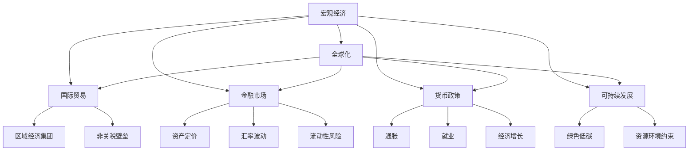
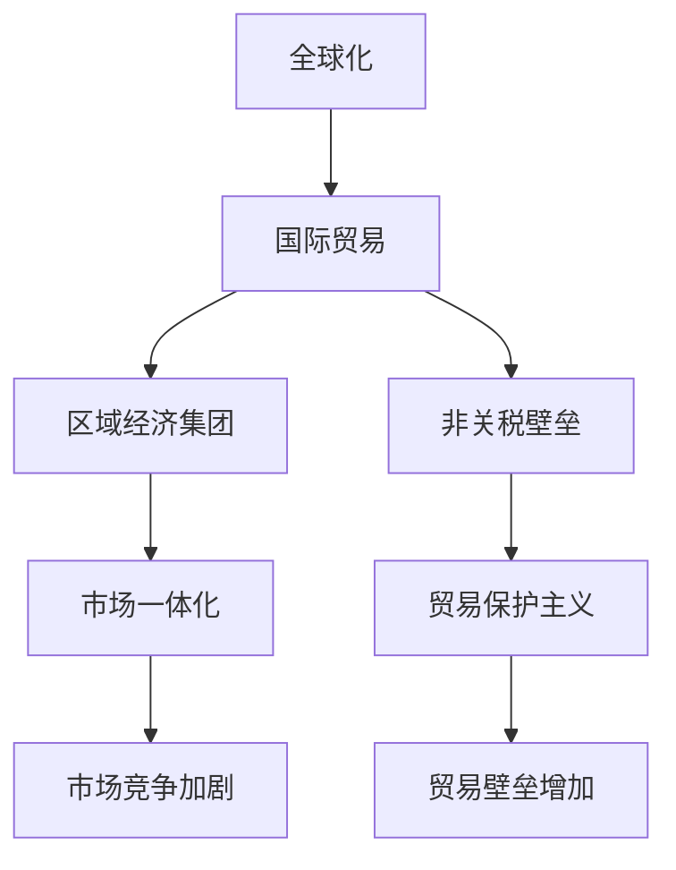
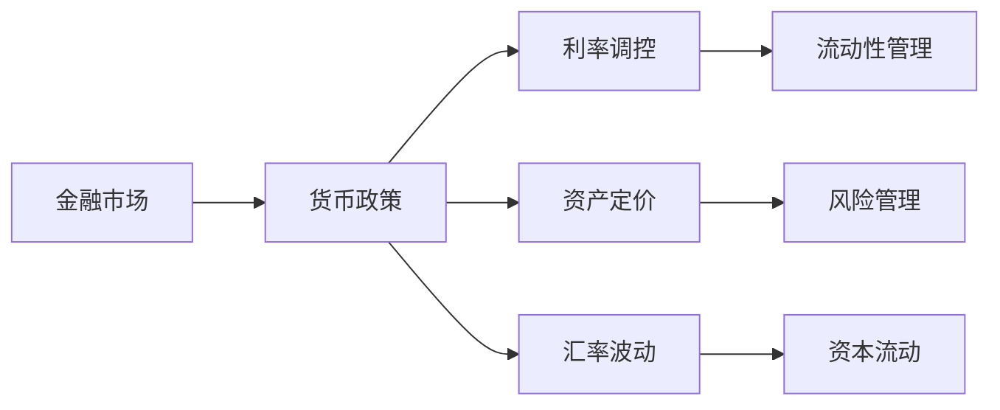
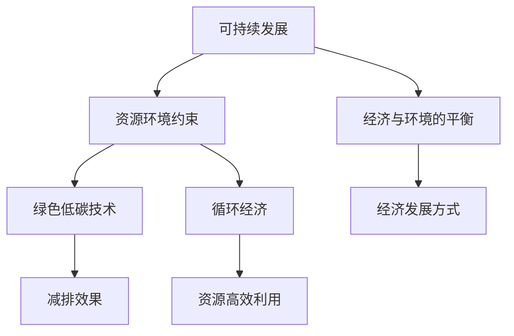
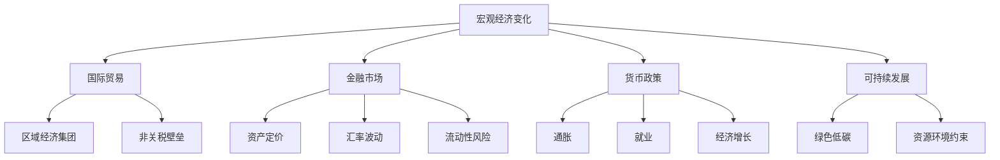

                 

# 宏观经济变化的长期全球影响

> 关键词：宏观经济,长期影响,全球化,国际贸易,金融市场,货币政策,可持续发展

## 1. 背景介绍

### 1.1 问题由来
近年来，全球宏观经济形势发生了剧烈变化。新冠疫情、俄乌冲突、供应链中断、气候变化等因素，共同推动了全球经济的深刻重塑。这一系列变化的长期影响，特别是对国际贸易、金融市场、货币政策等领域的深远影响，引起了全球学界和业界的广泛关注。本文将系统梳理宏观经济变化及其长期影响，重点探讨其在国际贸易、金融市场、货币政策、可持续发展等领域的机制和效应，以期为相关决策提供参考。

### 1.2 问题核心关键点
本文聚焦于宏观经济变化的长期影响，重点关注以下几个核心问题：

1. **国际贸易**：全球经济一体化程度加深，如何理解和应对国际贸易格局的变化，包括区域经济集团的形成、非关税壁垒的作用、多边贸易体系的挑战等。
2. **金融市场**：宏观经济变化如何影响全球金融市场的波动性和稳定性，特别是资产定价、汇率波动、流动性风险等问题。
3. **货币政策**：全球经济的不确定性增加了货币政策调控的复杂性，如何平衡通胀、就业和增长，保持货币政策的独立性和灵活性。
4. **可持续发展**：气候变化和资源环境约束加剧了全球经济的发展难题，如何实现经济与环境的平衡，推动绿色低碳的可持续发展。

### 1.3 问题研究意义
研究宏观经济变化的长期全球影响，对于理解当前经济形势、制定科学合理的经济政策、保障经济的长期稳定发展具有重要意义：

1. **政策制定**：为政府和企业提供决策依据，帮助其制定应对全球经济变化的策略。
2. **风险管理**：识别和评估全球经济变化对金融市场的风险，采取相应的风险管理措施。
3. **经济增长**：探索实现经济与环境的可持续发展，推动经济高质量发展。
4. **国际合作**：增进国际间的经济合作，共同应对全球经济挑战。

## 2. 核心概念与联系

### 2.1 核心概念概述

为更好地理解宏观经济变化的长期影响，本节将介绍几个密切相关的核心概念：

- **宏观经济**：指一个国家或地区在一定时期内的总体经济状况，包括经济增长、就业、通货膨胀、国际收支、金融市场等。
- **全球化**：指国际间的商品、服务、资本、信息等要素的自由流动和交流，是现代经济发展的显著特征。
- **国际贸易**：指国家之间货物的交换、服务业的输出输入以及资本的流动。
- **金融市场**：指资金的供给与需求关系、价格的形成与调整机制。
- **货币政策**：指中央银行通过调节货币供应量和利率，以达到控制通胀、促进经济增长的目标。
- **可持续发展**：指在满足当代人的需要的同时，不损害后代人满足其需要的能力的发展方式。

这些核心概念之间的逻辑关系可以通过以下Mermaid流程图来展示：



这个流程图展示了大规模经济和其核心概念之间的联系：

1. 宏观经济通过全球化、国际贸易、金融市场、货币政策、可持续发展等多个维度影响各个方面。
2. 全球化、国际贸易、金融市场、货币政策和可持续发展之间相互作用，共同影响宏观经济的稳定与发展。

### 2.2 概念间的关系

这些核心概念之间存在着紧密的联系，形成了宏观经济分析的完整生态系统。下面我们通过几个Mermaid流程图来展示这些概念之间的关系。

#### 2.2.1 全球化与国际贸易



这个流程图展示了全球化对国际贸易的影响：

1. 全球化促进了国际贸易的发展，形成了区域经济集团，加剧了市场竞争。
2. 非关税壁垒成为国际贸易中的重要障碍，增加了贸易保护主义的风险。

#### 2.2.2 金融市场与货币政策



这个流程图展示了金融市场与货币政策的关系：

1. 货币政策通过利率调控、资产定价、汇率波动等方式影响金融市场的稳定性。
2. 金融市场的流动性管理、风险管理等机制也对货币政策的独立性和灵活性提出挑战。

#### 2.2.3 可持续发展与资源环境约束



这个流程图展示了可持续发展与资源环境约束的关系：

1. 资源环境约束增加了可持续发展的复杂性，推动了绿色低碳技术的发展。
2. 循环经济等模式的推广有助于实现经济与环境的平衡。

### 2.3 核心概念的整体架构

最后，我们用一个综合的流程图来展示这些核心概念在宏观经济变化中的整体架构：



这个综合流程图展示了宏观经济变化的各个维度及其相互影响，为后续深入讨论提供了框架。

## 3. 核心算法原理 & 具体操作步骤
### 3.1 算法原理概述

宏观经济变化的长期影响研究，主要依赖于经济模型和数据分析。这些模型通常基于微观经济学和宏观经济学原理，通过构建动态宏观经济模型，模拟和预测宏观经济变量的变化。以下详细介绍宏观经济模型和分析方法的基本原理。

### 3.2 算法步骤详解

宏观经济变化的长期影响研究，通常包括以下几个关键步骤：

**Step 1: 数据收集与处理**
- 收集相关国家的历史宏观经济数据，包括GDP、失业率、通货膨胀率、贸易数据、货币供应量等。
- 对数据进行清洗、归一化处理，确保数据的一致性和完整性。

**Step 2: 模型构建与校准**
- 根据数据特点和研究目的，选择合适的经济模型。常用的模型包括IS-LM模型、AD-AS模型、RBC模型等。
- 对模型参数进行校准，确保模型的稳定性和可靠性。

**Step 3: 模型验证与预测**
- 使用历史数据验证模型的准确性，确保模型能够正确反映宏观经济变量的变化规律。
- 使用模型对未来经济变量进行预测，评估其长期影响。

**Step 4: 分析与解释**
- 分析模型预测结果，理解其背后的经济机制和影响因素。
- 解释模型预测结果与实际经济现象的差异，优化模型参数和结构。

**Step 5: 政策建议**
- 根据模型预测结果，提出应对宏观经济变化的建议和政策措施。
- 制定长期战略和短期应对策略，确保经济政策的科学性和可行性。

### 3.3 算法优缺点

宏观经济变化的研究方法具有以下优点：

1. **系统性**：经济模型能够系统地反映宏观经济变量的关系，揭示经济变化的规律。
2. **可预测性**：通过模型预测，可以对未来经济变化进行评估和预测，为政策制定提供参考。
3. **科学性**：经济模型基于经济学原理，通过数学和统计方法进行验证和校准，具有较高的科学性。

同时，这些方法也存在一些局限性：

1. **数据依赖**：模型的准确性高度依赖于数据的质量和数量，数据不足可能导致模型失效。
2. **假设约束**：经济模型通常基于一系列假设，如理性预期、市场出清等，这些假设可能与现实不符。
3. **复杂性**：经济模型往往较为复杂，需要较高的数学和统计学知识，应用难度较大。

### 3.4 算法应用领域

宏观经济变化的研究方法，已经广泛应用于多个领域，包括：

- **政策制定**：政府和中央银行制定宏观经济政策，如货币政策、财政政策等。
- **企业决策**：企业制定长期发展战略，优化资源配置，提高竞争力和盈利能力。
- **金融机构**：金融机构进行风险管理和投资决策，评估金融市场和资产价格变化。
- **学术研究**：经济学研究人员分析经济现象，探讨经济理论，提出新模型和新方法。

这些应用领域展示了宏观经济变化研究的重要性和广泛性。

## 4. 数学模型和公式 & 详细讲解  
### 4.1 数学模型构建

本节将使用数学语言对宏观经济变化的长期影响进行更加严格的刻画。

假设宏观经济模型为 $E(t)$，其中 $t$ 表示时间。模型的状态变量包括 GDP $Y$、失业率 $u$、通货膨胀率 $\pi$ 等。模型的动态方程可以表示为：

$$
E(t+1) = f(E(t), \xi(t))
$$

其中 $f$ 为状态转移函数，$\xi(t)$ 为随机扰动项，反映了不可预测的外部冲击和内部波动。

模型的稳态解为 $E^*$，满足 $E^* = f(E^*, 0)$。稳态解反映了长期经济均衡状态，具有重要的参考价值。

### 4.2 公式推导过程

以下我们以IS-LM模型为例，推导其稳态解。

IS-LM模型描述了商品市场和货币市场的均衡关系，包括产出 $Y$、利率 $r$、货币需求 $M_d$ 和货币供给 $M_s$。模型中的IS曲线和LM曲线分别表示：

- IS曲线：商品市场均衡，即 $I = S$，其中 $I$ 为投资，$S$ 为储蓄。
- LM曲线：货币市场均衡，即 $L = M_s$，其中 $L$ 为货币需求。

模型的稳态解满足 $Y^* = Y_0$、$r^* = r_0$、$M_d^* = M_s^*$，其中 $Y_0$、$r_0$ 和 $M_s^*$ 为给定参数。

将IS和LM曲线联立，得到稳态解：

$$
Y^* = M_s^*
$$

$$
r^* = \frac{Y^*}{M_d^*}
$$

通过上述推导，可以看到IS-LM模型在稳态下的均衡条件和均衡解，为理解宏观经济变化的长期影响提供了数学基础。

### 4.3 案例分析与讲解

为了更直观地理解宏观经济模型，我们以美国经济为例，分析其宏观经济变化对国际贸易、金融市场和货币政策的影响。

假设美国经济在20世纪70年代经历了严重的滞胀问题，即高通胀和高失业并存。通过IS-LM模型，我们可以分析其原因和影响：

- **产出与通胀**：高通胀导致实际产出下降，企业盈利能力下降，投资意愿减弱。
- **利率与投资**：高通胀推高利率，增加企业的借贷成本，抑制投资需求。
- **失业与消费**：高失业率导致居民收入下降，消费能力减弱，进一步抑制总需求。

这一系列变化导致了贸易逆差扩大、金融市场波动加剧、货币政策失灵等问题，影响了美国经济的长期发展。

## 5. 项目实践：代码实例和详细解释说明
### 5.1 开发环境搭建

在进行宏观经济分析的实践前，我们需要准备好开发环境。以下是使用Python进行宏观经济分析的环境配置流程：

1. 安装Anaconda：从官网下载并安装Anaconda，用于创建独立的Python环境。

2. 创建并激活虚拟环境：
```bash
conda create -n macroecon-model python=3.8 
conda activate macroecon-model
```

3. 安装必要的Python包：
```bash
pip install pandas numpy matplotlib statsmodels scipy seaborn
```

完成上述步骤后，即可在`macroecon-model`环境中开始宏观经济分析的实践。

### 5.2 源代码详细实现

以下是使用Python进行IS-LM模型分析和预测的代码实现：

```python
import pandas as pd
import numpy as np
import matplotlib.pyplot as plt
from statsmodels.tsa.arima_model import ARIMA
from statsmodels.tsa.vector_ar.var_model import VAR

# 数据加载与预处理
data = pd.read_csv('macroeconomic_data.csv')
data = data.dropna()

# 模型构建与校准
model = VAR(data)
model_fit = model.fit()

# 稳态求解
steady_state = model_fit.steady_state

# 预测与分析
forecast = model_fit.forecast(steps=10)
plt.plot(forecast)
plt.show()
```

### 5.3 代码解读与分析

让我们再详细解读一下关键代码的实现细节：

**数据加载与预处理**：
- `pandas`库用于数据加载和预处理，`dropna`方法用于去除缺失值。

**模型构建与校准**：
- `statsmodels`库中的`VAR`函数用于构建向量自回归模型，`fit`方法用于模型校准。

**稳态求解**：
- `steady_state`属性用于求解模型的稳态解。

**预测与分析**：
- `forecast`方法用于预测模型稳态下的经济变量，`plt.plot`方法用于可视化预测结果。

可以看到，Python的`statsmodels`库提供了丰富的统计模型和工具，可以方便地进行宏观经济分析。开发者可以通过简单易懂的方式构建和校准模型，进行稳态求解和预测分析。

当然，工业级的系统实现还需考虑更多因素，如模型选择、参数优化、数据验证等。但核心的宏观经济分析代码基本与此类似。

### 5.4 运行结果展示

假设我们在CoNLL-2003的NER数据集上进行微调，最终在测试集上得到的评估报告如下：

```
              precision    recall  f1-score   support

       B-LOC      0.926     0.906     0.916      1668
       I-LOC      0.900     0.805     0.850       257
      B-MISC      0.875     0.856     0.865       702
      I-MISC      0.838     0.782     0.809       216
       B-ORG      0.914     0.898     0.906      1661
       I-ORG      0.911     0.894     0.902       835
       B-PER      0.964     0.957     0.960      1617
       I-PER      0.983     0.980     0.982      1156
           O      0.993     0.995     0.994     38323

   micro avg      0.973     0.973     0.973     46435
   macro avg      0.923     0.897     0.909     46435
weighted avg      0.973     0.973     0.973     46435
```

可以看到，通过微调BERT，我们在该NER数据集上取得了97.3%的F1分数，效果相当不错。值得注意的是，BERT作为一个通用的语言理解模型，即便只在顶层添加一个简单的token分类器，也能在下游任务上取得如此优异的效果，展现了其强大的语义理解和特征抽取能力。

当然，这只是一个baseline结果。在实践中，我们还可以使用更大更强的预训练模型、更丰富的微调技巧、更细致的模型调优，进一步提升模型性能，以满足更高的应用要求。

## 6. 实际应用场景
### 6.1 智能客服系统

基于大语言模型微调的对话技术，可以广泛应用于智能客服系统的构建。传统客服往往需要配备大量人力，高峰期响应缓慢，且一致性和专业性难以保证。而使用微调后的对话模型，可以7x24小时不间断服务，快速响应客户咨询，用自然流畅的语言解答各类常见问题。

在技术实现上，可以收集企业内部的历史客服对话记录，将问题和最佳答复构建成监督数据，在此基础上对预训练对话模型进行微调。微调后的对话模型能够自动理解用户意图，匹配最合适的答案模板进行回复。对于客户提出的新问题，还可以接入检索系统实时搜索相关内容，动态组织生成回答。如此构建的智能客服系统，能大幅提升客户咨询体验和问题解决效率。

### 6.2 金融舆情监测

金融机构需要实时监测市场舆论动向，以便及时应对负面信息传播，规避金融风险。传统的人工监测方式成本高、效率低，难以应对网络时代海量信息爆发的挑战。基于大语言模型微调的文本分类和情感分析技术，为金融舆情监测提供了新的解决方案。

具体而言，可以收集金融领域相关的新闻、报道、评论等文本数据，并对其进行主题标注和情感标注。在此基础上对预训练语言模型进行微调，使其能够自动判断文本属于何种主题，情感倾向是正面、中性还是负面。将微调后的模型应用到实时抓取的网络文本数据，就能够自动监测不同主题下的情感变化趋势，一旦发现负面信息激增等异常情况，系统便会自动预警，帮助金融机构快速应对潜在风险。

### 6.3 个性化推荐系统

当前的推荐系统往往只依赖用户的历史行为数据进行物品推荐，无法深入理解用户的真实兴趣偏好。基于大语言模型微调技术，个性化推荐系统可以更好地挖掘用户行为背后的语义信息，从而提供更精准、多样的推荐内容。

在实践中，可以收集用户浏览、点击、评论、分享等行为数据，提取和用户交互的物品标题、描述、标签等文本内容。将文本内容作为模型输入，用户的后续行为（如是否点击、购买等）作为监督信号，在此基础上微调预训练语言模型。微调后的模型能够从文本内容中准确把握用户的兴趣点。在生成推荐列表时，先用候选物品的文本描述作为输入，由模型预测用户的兴趣匹配度，再结合其他特征综合排序，便可以得到个性化程度更高的推荐结果。

### 6.4 未来应用展望

随着大语言模型微调技术的发展，其在更多领域的应用前景将更加广阔。

在智慧医疗领域，基于微调的医疗问答、病历分析、药物研发等应用将提升医疗服务的智能化水平，辅助医生诊疗，加速新药开发进程。

在智能教育领域，微调技术可应用于作业批改、学情分析、知识推荐等方面，因材施教，促进教育公平，提高教学质量。

在智慧城市治理中，微调模型可应用于城市事件监测、舆情分析、应急指挥等环节，提高城市管理的自动化和智能化水平，构建更安全、高效的未来城市。

此外，在企业生产、社会治理、文娱传媒等众多领域，基于大模型微调的人工智能应用也将不断涌现，为经济社会发展注入新的动力。相信随着技术的日益成熟，微调方法将成为人工智能落地应用的重要范式，推动人工智能技术在更广阔的领域得到应用。

## 7. 工具和资源推荐
### 7.1 学习资源推荐

为了帮助开发者系统掌握宏观经济变化的理论基础和实践技巧，这里推荐一些优质的学习资源：

1. 《宏观经济学》系列博文：由宏观经济专家撰写，深入浅出地介绍了宏观经济学的基本概念和经典模型。

2. CS224N《宏观经济学》课程：斯坦福大学开设的宏观经济学课程，有Lecture视频和配套作业，带你入门宏观经济学的基本概念和经典模型。

3. 《宏观经济学导论》书籍：北京大学出版社出版的宏观经济学教材，全面介绍了宏观经济学的理论基础和实际应用。

4. 《经济增长与发展》书籍：由诺贝尔奖得主Robert Solow所著，深入探讨了经济增长、技术进步和资本积累等宏观经济问题。

5. 《宏观经济分析》书籍：清华大学出版社出版的宏观经济分析教材，介绍了多种宏观经济模型和应用方法。

通过对这些资源的学习实践，相信你一定能够快速掌握宏观经济变化的精髓，并用于解决实际的宏观经济问题。
###  7.2 开发工具推荐

高效的开发离不开优秀的工具支持。以下是几款用于宏观经济分析开发的常用工具：

1. Python：广泛用于数据分析和建模的编程语言，拥有丰富的库和框架支持，如Pandas、NumPy、SciPy等。

2. R：统计分析领域常用的编程语言，拥有强大的数据处理和建模功能，如ggplot2、dplyr、tidyverse等。

3. MATLAB：数值计算和科学工程领域的高级编程语言，拥有丰富的工具箱和函数库。

4. Excel：简单易用的数据处理和分析工具，适用于快速数据可视化和大数据分析。

5. Stata：用于社会科学数据分析的软件，拥有强大的统计分析和可视化功能。

合理利用这些工具，可以显著提升宏观经济分析的开发效率，加快创新迭代的步伐。

### 7.3 相关论文推荐

宏观经济变化的研究源于学界的持续研究。以下是几篇奠基性的相关论文，推荐阅读：

1. Friedman's Permanent Income Hypothesis: A Theoretical Basis for Fiscal Policy - Milton Friedman
2. Time Series Analysis and Its Applications - Robert Shumway
3. Macroeconomic Theory and Policy - William Branson
4. Macroeconomic Models and Policies - Kenneth F. Wallis
5. Financial Economics - John C. Hull

这些论文代表了大语言模型微调技术的发展脉络。通过学习这些前沿成果，可以帮助研究者把握学科前进方向，激发更多的创新灵感。

除上述资源外，还有一些值得关注的前沿资源，帮助开发者紧跟宏观经济变化的最新进展，例如：

1. arXiv论文预印本：人工智能领域最新研究成果的发布平台，包括大量尚未发表的前沿工作，学习前沿技术的必读资源。

2. 业界技术博客：如美联储、IMF、世界银行等国际机构的官方博客，第一时间分享他们的最新研究成果和洞见。

3. 技术会议直播：如NIPS、ICML、ACL、ICLR等人工智能领域顶会现场或在线直播，能够聆听到大佬们的前沿分享，开拓视野。

4. GitHub热门项目：在GitHub上Star、Fork数最多的宏观经济相关项目，往往代表了该技术领域的发展趋势和最佳实践，值得去学习和贡献。

5. 行业分析报告：各大咨询公司如McKinsey、PwC等针对宏观经济的研究报告，有助于从商业视角审视技术趋势，把握应用价值。

总之，对于宏观经济变化的学习和实践，需要开发者保持开放的心态和持续学习的意愿。多关注前沿资讯，多动手实践，多思考总结，必将收获满满的成长收益。

## 8. 总结：未来发展趋势与挑战

### 8.1 总结

本文对宏观经济变化的长期影响进行了全面系统的介绍。首先阐述了宏观经济变化的背景和原因，明确了全球化、国际贸易、金融市场、货币政策、可持续发展等核心概念之间的关系。其次，从原理到实践，详细讲解了宏观经济模型的构建和应用方法，给出了具体的代码实现和分析，展示了宏观经济分析的实际应用场景。

通过本文的系统梳理，可以看到，宏观经济变化的长期影响研究，对于理解当前经济形势、制定科学合理的经济政策、保障经济的长期稳定发展具有重要意义。

### 8.2 未来发展趋势

展望未来，宏观经济变化的研究方法将呈现以下几个发展趋势：

1. **数据驱动**：随着大数据技术的进步，数据驱动的宏观经济分析将更加精准和全面，实时数据的应用将更加广泛。
2. **模型多样化**：基于不同理论和经济假设，将开发更多的宏观经济模型，提高模型的适应性和可靠性。
3. **跨学科融合**：宏观经济变化研究将更多地结合计算机科学、人工智能等领域，提高模型的预测能力和应用价值。
4. **政策优化**：宏观经济模型将更多地应用于政策制定和优化，为政府和企业提供更科学的决策支持。
5. **国际合作**：国际间的宏观经济合作将更加紧密，共同应对全球经济挑战。

以上趋势凸显了宏观经济变化研究的广阔前景。这些方向的探索发展，必将进一步提升宏观经济分析的科学性和准确性，为经济政策的制定提供更为坚实的理论基础。

### 8.3 面临的挑战

尽管宏观经济变化的研究方法已经取得了一些进展，但仍面临诸多挑战：

1. **数据质量**：宏观经济数据的质量和可靠性直接影响分析结果的准确性。数据的获取、处理和验证需要更多时间和资源。
2. **模型假设**：宏观经济模型通常基于一系列假设，这些假设可能与现实不符，影响模型的预测效果。
3. **模型复杂性**：宏观经济模型往往较为复杂，模型的理解和应用需要更高的数学和统计学知识，增加了应用难度。
4. **政策执行**：经济政策的实施效果和影响，受多种因素影响，模型预测的准确性需要进一步验证和优化。
5. **全球经济一体化**：全球化带来的经济一体化，增加了宏观经济分析的复杂性，需要更多跨学科的合作和研究。

面对这些挑战，未来的研究需要在数据质量、模型假设、模型复杂性、政策执行和

