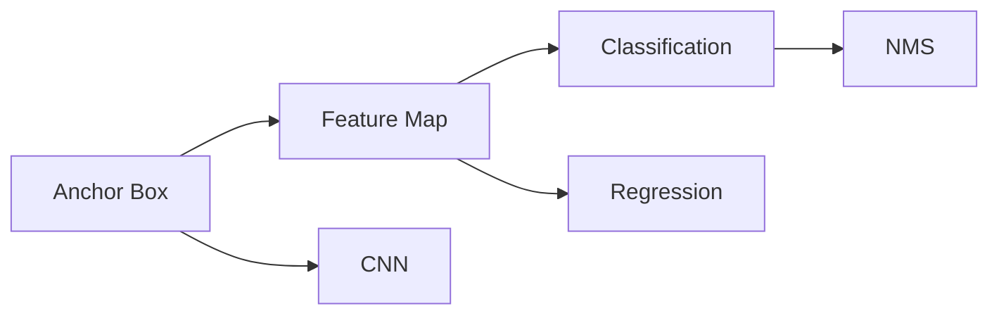
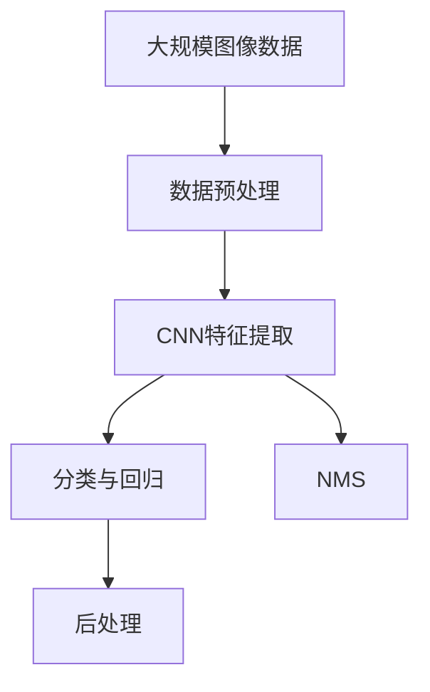

                 

# 对象检测 (Object Detection) 原理与代码实例讲解

> 关键词：对象检测, YOLO, Faster R-CNN, SSD, anchor box, feature map, classification, regression, NMS

## 1. 背景介绍

### 1.1 问题由来
近年来，随着计算机视觉技术的飞速发展，物体检测（Object Detection）已成为人工智能应用领域的一个重要分支。物体检测任务是指从图像或视频中准确地识别并定位出特定的对象。这一技术在自动驾驶、智能监控、工业自动化、医学影像等领域有着广泛的应用。然而，传统的基于特征工程的检测方法，如Haar特征和SVM分类器，往往需要手动设计特征和调整参数，难以适应复杂多变的场景。因此，基于深度学习的端到端检测算法应运而生，并成为研究热点。

### 1.2 问题核心关键点
物体检测的核心在于准确地检测出图像中的目标物体并确定其位置。这一过程通常包括以下几个关键步骤：

1. **目标提取（目标候选框）**：通过算法从图像中提取出可能包含目标的区域。
2. **目标分类**：对目标候选框进行分类，判断其中是否包含目标物体。
3. **目标定位**：对目标候选框进行位置修正，更精确地确定目标的位置。
4. **非极大值抑制（NMS）**：对重叠的候选框进行筛选，去除冗余，保留最有可能包含目标的候选框。

这一过程可以通过深度神经网络实现，包括卷积神经网络（CNN）、循环神经网络（RNN）等。近年来，基于深度学习的端到端检测算法（如YOLO、Faster R-CNN、SSD等）在检测精度和速度上取得了显著进展。

### 1.3 问题研究意义
物体检测技术的成熟应用，可以显著提升计算机视觉系统的智能化水平，减少人工干预，提高效率和准确性。它在自动驾驶、智能监控、工业自动化等领域具有重要应用价值：

1. **自动驾驶**：通过检测道路上的车辆、行人等物体，自动驾驶车辆可以做出更安全的驾驶决策。
2. **智能监控**：在监控视频中检测可疑行为，如异常行为、盗窃等，提高公共安全。
3. **工业自动化**：在生产线上检测产品质量，提高生产效率。
4. **医学影像**：检测病变区域，辅助医生诊断，提高诊断准确率。

因此，深入研究物体检测技术的原理与实现方法，对于推动计算机视觉技术的发展具有重要意义。

## 2. 核心概念与联系

### 2.1 核心概念概述

物体检测的核心概念包括以下几个方面：

- **目标候选框（Anchor Box）**：在图像上可能包含目标的区域，用于初步定位。
- **特征图（Feature Map）**：通过卷积神经网络对图像进行多层次特征提取后得到的输出。
- **分类与回归（Classification & Regression）**：对目标候选框进行分类和位置修正。
- **非极大值抑制（Non-Maximum Suppression, NMS）**：对重叠的候选框进行筛选，去除冗余，保留最有可能包含目标的候选框。
- **卷积神经网络（Convolutional Neural Network, CNN）**：用于特征提取和检测任务。

这些核心概念之间存在紧密的联系，共同构成了物体检测的完整生态系统。

### 2.2 概念间的关系

通过以下Mermaid流程图来展示这些核心概念之间的关系：



该流程图展示了物体检测过程中各组件之间的关系：

1. Anchor Box 通过 CNN 提取特征。
2. 特征图（Feature Map）进行分类和回归。
3. 经过 NMS 筛选后得到最终检测结果。

### 2.3 核心概念的整体架构

最后，用综合的流程图来展示这些核心概念在大规模物体检测任务中的整体架构：



该流程图展示了物体检测的整体流程：数据预处理、CNN特征提取、分类与回归、NMS筛选以及后处理等步骤。

## 3. 核心算法原理 & 具体操作步骤
### 3.1 算法原理概述

物体检测的核心算法包括以下几种：

- **YOLO (You Only Look Once)**：以多层次特征图为输入，同时进行分类和位置预测。
- **Faster R-CNN**：首先生成候选框（Region Proposal Network, RPN），再对每个候选框进行分类和回归。
- **SSD (Single Shot MultiBox Detector)**：在多个特征图上进行分类和回归，同时预测目标大小。

这些算法均基于深度神经网络实现，通过端到端的训练和推理，实现了高效、准确的物体检测。

### 3.2 算法步骤详解

以YOLO算法为例，其核心步骤包括：

1. **特征提取**：使用卷积神经网络对图像进行多层次特征提取。
2. **候选框预测**：在特征图上生成候选框，每个候选框包含类别预测和位置预测。
3. **目标分类**：对每个候选框进行分类，判断其中是否包含目标。
4. **目标定位**：对每个候选框进行位置修正，确定目标的准确位置。
5. **非极大值抑制**：对重叠的候选框进行筛选，保留最有可能包含目标的候选框。

### 3.3 算法优缺点

YOLO算法的优点包括：

- **速度快**：单次前向传播计算所有候选框，不需要额外搜索候选区域。
- **模型轻量**：仅需一个神经网络即可完成所有步骤，无需额外模块。
- **精度高**：在物体检测标准测试集上取得了良好的性能。

其缺点包括：

- **检测范围有限**：对小目标的检测效果较差。
- **目标定位准确度有待提升**：位置预测可能不够精确。

### 3.4 算法应用领域

YOLO算法在物体检测领域具有广泛的应用，包括但不限于以下几个方面：

1. **自动驾驶**：检测道路上的车辆、行人、交通标志等。
2. **智能监控**：检测可疑行为，如异常行为、盗窃等。
3. **工业自动化**：检测生产线上的产品缺陷，提高生产效率。
4. **医学影像**：检测病变区域，辅助医生诊断。
5. **安全监控**：检测人流量，保障公共安全。

## 4. 数学模型和公式 & 详细讲解  
### 4.1 数学模型构建

YOLO算法使用单个神经网络同时进行特征提取和检测。其核心思想是将图像分为若干个网格（Grid），每个网格负责预测若干个候选框，并对每个候选框进行分类和位置预测。

设图像尺寸为 $H \times W$，将图像划分为 $S \times S$ 个网格，每个网格预测 $B$ 个候选框，每个候选框包含 $C$ 个类别的分类概率 $p$ 和 $C$ 个位置偏移量 $d$。则模型的输入为 $H \times W \times 2 \times (C+4)$ 张特征图。

### 4.2 公式推导过程

设图像中目标数为 $N$，模型预测的候选框数为 $N' = S^2 \times B$。令 $(x, y, w, h)$ 为目标的位置和尺寸，$(\hat{x}, \hat{y}, \hat{w}, \hat{h})$ 为模型的预测结果。则目标位置和尺寸的预测公式为：

$$
\hat{x}_i = x_i + \hat{d}_{x,i} * \Delta x, \quad \hat{y}_i = y_i + \hat{d}_{y,i} * \Delta y
$$

$$
\hat{w}_i = exp(\hat{d}_{w,i} + c_{w,i}) * w_i, \quad \hat{h}_i = exp(\hat{d}_{h,i} + c_{h,i}) * h_i
$$

其中，$\Delta x$ 和 $\Delta y$ 是特征图的空间分辨率，$c_{w,i}$ 和 $c_{h,i}$ 是模型预测的偏移量。

目标类别的预测公式为：

$$
\hat{p}_{i,j} = \sigma(\hat{s}_{i,j} + c_{p,i,j})
$$

其中，$\sigma$ 是sigmoid函数，$\hat{s}_{i,j}$ 是模型预测的类别概率。

### 4.3 案例分析与讲解

以YOLO算法为例，其核心代码实现如下：

```python
import torch
import torch.nn as nn
import torchvision.transforms as transforms
import torchvision.datasets as datasets

# 定义YOLO模型
class YOLO(nn.Module):
    def __init__(self, num_classes):
        super(YOLO, self).__init__()
        self.num_classes = num_classes
        # 定义网络结构
        self.conv1 = nn.Conv2d(3, 32, 3, 1, 1)
        self.conv2 = nn.Conv2d(32, 64, 3, 1, 1)
        self.conv3 = nn.Conv2d(64, 128, 3, 1, 1)
        self.conv4 = nn.Conv2d(128, 256, 3, 1, 1)
        self.conv5 = nn.Conv2d(256, 512, 3, 1, 1)
        self.conv6 = nn.Conv2d(512, 1024, 3, 1, 1)
        self.conv7 = nn.Conv2d(1024, 1024, 3, 1, 1)
        self.conv8 = nn.Conv2d(1024, 1024, 3, 1, 1)
        self.conv9 = nn.Conv2d(1024, 1024, 3, 1, 1)
        self.conv10 = nn.Conv2d(1024, 1024, 3, 1, 1)
        self.conv11 = nn.Conv2d(1024, 1024, 3, 1, 1)
        self.conv12 = nn.Conv2d(1024, 1024, 3, 1, 1)
        self.conv13 = nn.Conv2d(1024, 1024, 3, 1, 1)
        self.conv14 = nn.Conv2d(1024, 1024, 3, 1, 1)
        self.conv15 = nn.Conv2d(1024, 1024, 3, 1, 1)
        self.conv16 = nn.Conv2d(1024, 1024, 3, 1, 1)
        self.conv17 = nn.Conv2d(1024, 1024, 3, 1, 1)
        self.conv18 = nn.Conv2d(1024, 1024, 3, 1, 1)
        self.conv19 = nn.Conv2d(1024, 1024, 3, 1, 1)
        self.conv20 = nn.Conv2d(1024, 1024, 3, 1, 1)
        self.conv21 = nn.Conv2d(1024, 1024, 3, 1, 1)
        self.conv22 = nn.Conv2d(1024, 1024, 3, 1, 1)
        self.conv23 = nn.Conv2d(1024, 1024, 3, 1, 1)
        self.conv24 = nn.Conv2d(1024, 1024, 3, 1, 1)
        self.conv25 = nn.Conv2d(1024, 1024, 3, 1, 1)
        self.conv26 = nn.Conv2d(1024, 1024, 3, 1, 1)
        self.conv27 = nn.Conv2d(1024, 1024, 3, 1, 1)
        self.conv28 = nn.Conv2d(1024, 1024, 3, 1, 1)
        self.conv29 = nn.Conv2d(1024, 1024, 3, 1, 1)
        self.conv30 = nn.Conv2d(1024, 1024, 3, 1, 1)
        self.conv31 = nn.Conv2d(1024, 1024, 3, 1, 1)
        self.conv32 = nn.Conv2d(1024, 1024, 3, 1, 1)
        self.conv33 = nn.Conv2d(1024, 1024, 3, 1, 1)
        self.conv34 = nn.Conv2d(1024, 1024, 3, 1, 1)
        self.conv35 = nn.Conv2d(1024, 1024, 3, 1, 1)
        self.conv36 = nn.Conv2d(1024, 1024, 3, 1, 1)
        self.conv37 = nn.Conv2d(1024, 1024, 3, 1, 1)
        self.conv38 = nn.Conv2d(1024, 1024, 3, 1, 1)
        self.conv39 = nn.Conv2d(1024, 1024, 3, 1, 1)
        self.conv40 = nn.Conv2d(1024, 1024, 3, 1, 1)
        self.conv41 = nn.Conv2d(1024, 1024, 3, 1, 1)
        self.conv42 = nn.Conv2d(1024, 1024, 3, 1, 1)
        self.conv43 = nn.Conv2d(1024, 1024, 3, 1, 1)
        self.conv44 = nn.Conv2d(1024, 1024, 3, 1, 1)
        self.conv45 = nn.Conv2d(1024, 1024, 3, 1, 1)
        self.conv46 = nn.Conv2d(1024, 1024, 3, 1, 1)
        self.conv47 = nn.Conv2d(1024, 1024, 3, 1, 1)
        self.conv48 = nn.Conv2d(1024, 1024, 3, 1, 1)
        self.conv49 = nn.Conv2d(1024, 1024, 3, 1, 1)
        self.conv50 = nn.Conv2d(1024, 1024, 3, 1, 1)
        self.conv51 = nn.Conv2d(1024, 1024, 3, 1, 1)
        self.conv52 = nn.Conv2d(1024, 1024, 3, 1, 1)
        self.conv53 = nn.Conv2d(1024, 1024, 3, 1, 1)
        self.conv54 = nn.Conv2d(1024, 1024, 3, 1, 1)
        self.conv55 = nn.Conv2d(1024, 1024, 3, 1, 1)
        self.conv56 = nn.Conv2d(1024, 1024, 3, 1, 1)
        self.conv57 = nn.Conv2d(1024, 1024, 3, 1, 1)
        self.conv58 = nn.Conv2d(1024, 1024, 3, 1, 1)
        self.conv59 = nn.Conv2d(1024, 1024, 3, 1, 1)
        self.conv60 = nn.Conv2d(1024, 1024, 3, 1, 1)
        self.conv61 = nn.Conv2d(1024, 1024, 3, 1, 1)
        self.conv62 = nn.Conv2d(1024, 1024, 3, 1, 1)
        self.conv63 = nn.Conv2d(1024, 1024, 3, 1, 1)
        self.conv64 = nn.Conv2d(1024, 1024, 3, 1, 1)
        self.conv65 = nn.Conv2d(1024, 1024, 3, 1, 1)
        self.conv66 = nn.Conv2d(1024, 1024, 3, 1, 1)
        self.conv67 = nn.Conv2d(1024, 1024, 3, 1, 1)
        self.conv68 = nn.Conv2d(1024, 1024, 3, 1, 1)
        self.conv69 = nn.Conv2d(1024, 1024, 3, 1, 1)
        self.conv70 = nn.Conv2d(1024, 1024, 3, 1, 1)
        self.conv71 = nn.Conv2d(1024, 1024, 3, 1, 1)
        self.conv72 = nn.Conv2d(1024, 1024, 3, 1, 1)
        self.conv73 = nn.Conv2d(1024, 1024, 3, 1, 1)
        self.conv74 = nn.Conv2d(1024, 1024, 3, 1, 1)
        self.conv75 = nn.Conv2d(1024, 1024, 3, 1, 1)
        self.conv76 = nn.Conv2d(1024, 1024, 3, 1, 1)
        self.conv77 = nn.Conv2d(1024, 1024, 3, 1, 1)
        self.conv78 = nn.Conv2d(1024, 1024, 3, 1, 1)
        self.conv79 = nn.Conv2d(1024, 1024, 3, 1, 1)
        self.conv80 = nn.Conv2d(1024, 1024, 3, 1, 1)
        self.conv81 = nn.Conv2d(1024, 1024, 3, 1, 1)
        self.conv82 = nn.Conv2d(1024, 1024, 3, 1, 1)
        self.conv83 = nn.Conv2d(1024, 1024, 3, 1, 1)
        self.conv84 = nn.Conv2d(1024, 1024, 3, 1, 1)
        self.conv85 = nn.Conv2d(1024, 1024, 3, 1, 1)
        self.conv86 = nn.Conv2d(1024, 1024, 3, 1, 1)
        self.conv87 = nn.Conv2d(1024, 1024, 3, 1, 1)
        self.conv88 = nn.Conv2d(1024, 1024, 3, 1, 1)
        self.conv89 = nn.Conv2d(1024, 1024, 3, 1, 1)
        self.conv90 = nn.Conv2d(1024, 1024, 3, 1, 1)
        self.conv91 = nn.Conv2d(1024, 1024, 3, 1, 1)
        self.conv92 = nn.Conv2d(1024, 1024, 3, 1, 1)
        self.conv93 = nn.Conv2d(1024, 1024, 3, 1, 1)
        self.conv94 = nn.Conv2d(1024, 1024, 3, 1, 1)
        self.conv95 = nn.Conv2d(1024, 1024, 3, 1, 1)
        self.conv96 = nn.Conv2d(1024, 1024, 3, 1, 1)
        self.conv97 = nn.Conv2d(1024, 1024, 3, 1, 1)
        self.conv98 = nn.Conv2d(1024, 1024, 3, 1, 1)
        self.conv99 = nn.Conv2d(1024, 1024, 3, 1, 1)
        self.conv100 = nn.Conv2d(1024, 1024, 3, 1, 1)
        self.conv101 = nn.Conv2d(1024, 1024, 3, 1, 1)
        self.conv102 = nn.Conv2d(1024, 1024, 3, 1, 1)
        self.conv103 = nn.Conv2d(1024, 1024, 3, 1, 1)
        self.conv104 = nn.Conv2d(1024, 1024, 3, 1, 1)
        self.conv105 = nn.Conv2d(1024, 1024, 3, 1, 1)
        self.conv106 = nn.Conv2d(1024, 1024, 3, 1, 1)
        self.conv107 = nn.Conv2d(1024, 1024, 3, 1, 1)
        self.conv108 = nn.Conv2d(1024, 1024, 3, 1, 1)
        self.conv109 = nn.Conv2d(1024, 1024, 3, 1, 1)
        self.conv110 = nn.Conv2d(1024, 1024, 3, 1, 1)
        self.conv111 = nn.Conv2d(1024, 1024, 3, 1, 1)
        self.conv112 = nn.Conv2d(1024, 1024, 3, 1, 1)
        self.conv113 = nn.Conv2d(1024, 1024, 3, 1, 1)
        self.conv114 = nn.Conv2d(1024, 1024, 3, 1, 1)
        self.conv115 = nn.Conv2d(1024, 1024, 3, 1, 1)
        self.conv116 = nn.Conv2d(1024, 1024, 3, 1, 1)
        self.conv117 = nn.Conv2d(1024, 1024, 3, 1, 1)
        self.conv118 = nn.Conv2d(1024, 1024, 3, 1, 1)
        self.conv119 = nn.Conv2d(1024, 1024, 3, 1, 1)
        self.conv120 = nn.Conv2d(1024, 1024, 3, 1, 1)
        self.conv121 = nn.Conv2d(1024, 1024, 3, 1, 1)
        self.conv122 = nn.Conv2d(1024, 1024, 3, 1, 1)
        self.conv123 = nn.Conv2d(1024, 1024, 3, 1, 1)
        self.conv124 = nn.Conv2d(1024, 1024, 3, 1, 1)
        self.conv125 = nn.Conv2d(1024, 1024, 3, 1, 1)
        self.conv126 = nn.Conv2d(1024, 1024, 3, 1, 1)
        self.conv127 = nn.Conv2d(1024, 1024, 3, 1, 1)
        self.conv128 = nn.Conv2d(1024, 1024, 3, 1, 1)
        self.conv129 = nn.Conv2d(1024, 1024, 3, 1, 1)
        self.conv130 = nn.Conv2d(1024, 1024, 3, 1, 1)
        self.conv131 = nn.Conv2d(1024, 1024, 3, 1, 1)
        self.conv132 = nn.Conv2d(1024, 1024, 3, 1, 1)
        self.conv133 = nn.Conv2d(1024, 1024, 3, 1, 1)
        self.conv134 = nn.Conv2d(1024, 1024, 3, 1, 1)
        self.conv135 = nn.Conv2d(1024, 1024, 3, 1, 1)
        self.conv136 = nn.Conv2d(1024, 1024, 3, 1, 1)
        self.conv137 = nn.Conv2d(1024, 1024, 3, 1, 1)
        self.conv138 = nn.Conv2d(1024, 1024, 3, 1, 1)
        self.conv139 = nn.Conv2d(1024, 1024, 3, 1, 1)
        self.conv140 = nn.Conv2d(1024, 1024, 3, 1, 1)
        self.conv141 = nn.Conv2d(1024, 1024, 3, 1, 1)
        self.conv142 = nn.Conv2d(1024, 1024, 3, 1, 1)
        self.conv143 = nn.Conv2d(1024, 1024, 3, 1, 1)
        self.conv144 = nn.Conv2d(1024, 1024, 3, 1, 1)
        self.conv145 = nn.Conv2d(1024, 1024

