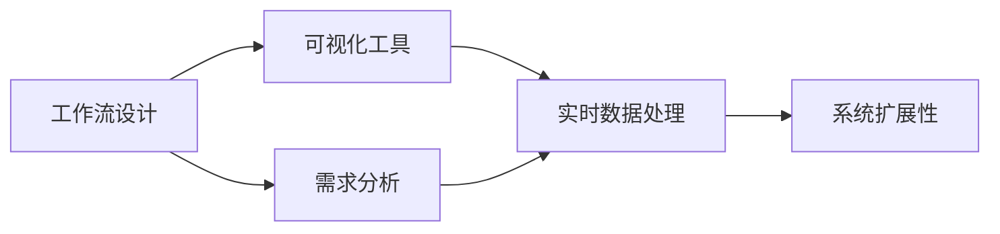
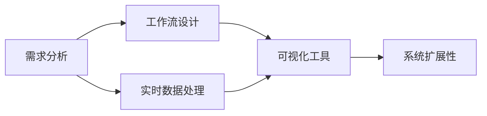
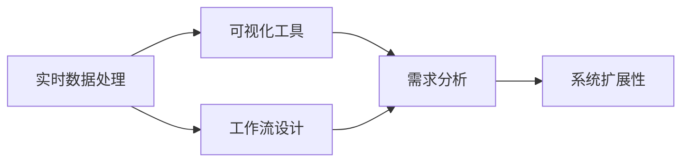

                 

# 工作流可视化设计工具的发展方向

## 1. 背景介绍

在数字化转型的浪潮中，企业日益重视业务流程的可视化，希望通过可视化工具提升管理效率和决策能力。随着信息系统的日趋复杂，对于工作流可视化设计工具的需求日益迫切，企业希望通过这些工具来帮助决策者直观理解业务流程，快速发现问题，并进行优化改进。在企业数字化、智能化的转型进程中，工作流可视化设计工具的作用愈发重要。

### 1.1 问题由来
企业信息化水平日益提升，各业务系统之间的数据交互变得越来越频繁，业务流程也变得越来越复杂。为提高管理效率和决策能力，企业需要构建可视化工作流工具来辅助决策。这些工具能够将复杂的数据、流程、业务逻辑通过直观的图形化界面呈现出来，帮助管理者快速识别问题，做出有效的决策。

近年来，随着技术的发展，特别是大数据、云计算、人工智能等技术的应用，工作流可视化设计工具得到了广泛应用，为企业提供了强大的数据分析和管理能力。然而，由于企业环境和需求的多样性，现有的工具往往难以满足不同企业的需求，特别是在需求复杂、数据量庞大的场景中，传统的工具难以发挥作用。

### 1.2 问题核心关键点
目前，工作流可视化设计工具的核心关键点主要包括以下几个方面：

- **需求多样性**：企业内部环境和需求复杂多样，工作流可视化设计工具需要根据不同行业和业务场景进行定制化开发。
- **数据量庞大**：企业的数据量和数据类型不断增加，工作流可视化工具需要处理海量数据，并实时响应。
- **实时交互**：用户对可视化工具的实时交互能力有高要求，需要提供高效的响应和互动功能。
- **系统可扩展性**：工具需要具备良好的可扩展性，以便随着企业规模的增长而进行扩展和升级。

这些关键点决定了未来工作流可视化设计工具的发展方向，本文将对这些关键点进行深入分析，并提出相应的解决方案。

## 2. 核心概念与联系

### 2.1 核心概念概述

为更好地理解工作流可视化设计工具，我们需要了解以下几个核心概念：

- **工作流设计**：定义企业内部各业务流程的节点、逻辑关系、数据流向等，将业务逻辑通过图形化界面呈现。
- **可视化工具**：将业务流程、数据、关系等通过图形化界面展示出来，支持用户进行互动和操作。
- **需求分析**：通过需求调研、数据分析等方式，了解企业的具体业务需求和场景，设计出符合用户期望的可视化工具。
- **实时数据处理**：对实时数据进行高效处理和展示，确保用户能够实时看到数据的最新状态。
- **系统扩展性**：系统具备良好的可扩展性，能够适应企业规模的增长和需求变化。

这些核心概念共同构成了工作流可视化设计工具的完整生态系统，如图：



这个流程图展示了工作流可视化设计工具的核心概念及其之间的关系：

1. **工作流设计**：根据企业内部业务需求，设计出符合实际场景的工作流程。
2. **可视化工具**：将工作流设计可视化，支持用户实时操作和互动。
3. **需求分析**：通过需求调研和数据分析，获取用户期望的功能和性能要求。
4. **实时数据处理**：对实时数据进行高效处理和展示，确保用户实时看到最新数据。
5. **系统扩展性**：系统具备良好的可扩展性，适应企业规模的增长和需求变化。

这些概念之间的关系，构成了工作流可视化设计工具的完整体系，为后续的深入讨论奠定了基础。

### 2.2 概念间的关系

这些核心概念之间存在着紧密的联系，形成了工作流可视化设计工具的完整生态系统。下面我们通过几个Mermaid流程图来展示这些概念之间的关系。

#### 2.2.1 工作流设计到可视化工具


这个流程图展示了工作流设计到可视化工具的过程：

1. **工作流设计**：根据企业内部业务需求，设计出符合实际场景的工作流程。
2. **可视化工具**：将工作流设计可视化，支持用户实时操作和互动。
3. **需求分析**：通过需求调研和数据分析，获取用户期望的功能和性能要求。
4. **实时数据处理**：对实时数据进行高效处理和展示，确保用户实时看到最新数据。
5. **系统扩展性**：系统具备良好的可扩展性，适应企业规模的增长和需求变化。

#### 2.2.2 需求分析与工作流设计



这个流程图展示了需求分析到工作流设计的过程：

1. **需求分析**：通过需求调研和数据分析，获取用户期望的功能和性能要求。
2. **工作流设计**：根据用户需求，设计出符合实际场景的工作流程。
3. **实时数据处理**：对实时数据进行高效处理和展示，确保用户实时看到最新数据。
4. **可视化工具**：将工作流设计可视化，支持用户实时操作和互动。
5. **系统扩展性**：系统具备良好的可扩展性，适应企业规模的增长和需求变化。

#### 2.2.3 实时数据处理与系统扩展性



这个流程图展示了实时数据处理到系统扩展性的过程：

1. **实时数据处理**：对实时数据进行高效处理和展示，确保用户实时看到最新数据。
2. **工作流设计**：根据用户需求，设计出符合实际场景的工作流程。
3. **可视化工具**：将工作流设计可视化，支持用户实时操作和互动。
4. **需求分析**：通过需求调研和数据分析，获取用户期望的功能和性能要求。
5. **系统扩展性**：系统具备良好的可扩展性，适应企业规模的增长和需求变化。

这些流程图展示了核心概念之间的紧密联系，为进一步深入探讨提供了清晰的脉络。

## 3. 核心算法原理 & 具体操作步骤
### 3.1 算法原理概述

工作流可视化设计工具的核心算法原理主要包括以下几个方面：

1. **工作流建模**：定义企业的业务流程，构建出符合实际场景的工作流模型。
2. **可视化渲染**：将工作流模型转换为可视化的图形界面，支持用户实时操作和互动。
3. **实时数据处理**：对实时数据进行高效处理和展示，确保用户实时看到最新数据。
4. **系统扩展性优化**：通过合理的架构设计和代码实现，提升系统的可扩展性，确保系统能够适应企业规模的增长和需求变化。

### 3.2 算法步骤详解

下面详细介绍工作流可视化设计工具的具体操作步骤：

#### 3.2.1 需求调研与分析

1. **需求调研**：通过问卷调查、访谈等方式，收集用户对工作流可视化工具的需求，包括功能、性能、用户体验等方面。
2. **数据分析**：对收集到的需求数据进行数据分析，识别出核心需求和常见痛点。

#### 3.2.2 工作流设计

1. **流程建模**：根据用户需求，构建出符合实际场景的工作流模型，定义出各个节点、逻辑关系和数据流向。
2. **流程验证**：对构建的工作流模型进行验证，确保其符合用户需求和企业业务逻辑。

#### 3.2.3 可视化设计

1. **界面设计**：根据工作流模型，设计出符合用户期望的可视化界面，包括图表类型、颜色、布局等。
2. **用户交互设计**：设计出符合用户交互习惯的操作界面，支持用户的点击、拖拽、编辑等操作。

#### 3.2.4 实时数据处理

1. **数据采集**：通过API、消息队列等方式，实时采集业务系统中的数据，包括流程数据、日志数据等。
2. **数据处理**：对采集到的数据进行清洗、转换和聚合，确保数据的一致性和完整性。
3. **数据展示**：将处理后的数据展示在可视化界面中，支持用户实时查看和分析数据。

#### 3.2.5 系统扩展性优化

1. **架构设计**：采用微服务架构、分布式计算等技术，确保系统的可扩展性。
2. **代码实现**：编写可复用的组件和模块，支持系统的模块化和组件化开发。
3. **持续集成**：引入持续集成工具，自动化构建、测试和部署，确保系统的快速迭代和升级。

### 3.3 算法优缺点

工作流可视化设计工具的优点主要包括以下几个方面：

1. **可视化效果**：通过图形化的界面展示业务流程和数据，直观、易用。
2. **实时交互**：支持用户实时操作和互动，提高用户使用体验。
3. **需求灵活**：能够根据企业需求进行定制化开发，满足不同企业的需求。
4. **系统可扩展**：采用可扩展的架构和模块化设计，支持系统的快速扩展和升级。

同时，工作流可视化设计工具也存在一些缺点：

1. **数据量庞大**：需要处理海量数据，对系统的数据处理能力提出了较高要求。
2. **实时性要求高**：需要实时响应和处理数据，对系统的性能和稳定性提出了较高要求。
3. **定制化成本高**：根据企业需求进行定制化开发，需要较高的开发成本和周期。

### 3.4 算法应用领域

工作流可视化设计工具在多个领域得到了广泛应用，具体包括：

- **企业管理**：通过可视化工具管理企业内部流程，优化管理效率。
- **项目管理**：可视化工具帮助项目经理管理项目进度和资源，确保项目按时交付。
- **运营管理**：通过可视化工具监控业务运营状态，优化运营流程。
- **供应链管理**：可视化工具帮助企业优化供应链流程，提升供应链效率。
- **客户服务**：通过可视化工具监控客户服务流程，提升客户满意度。

此外，工作流可视化设计工具还被应用于金融、医疗、制造等多个行业，助力这些行业实现数字化转型和智能化升级。

## 4. 数学模型和公式 & 详细讲解 & 举例说明

### 4.1 数学模型构建

工作流可视化设计工具的核心数学模型主要包括以下几个方面：

1. **流程图建模**：定义企业内部各业务流程的节点、逻辑关系、数据流向等。
2. **可视化模型**：将流程图转换为可视化的图形界面，支持用户实时操作和互动。
3. **实时数据处理模型**：对实时数据进行高效处理和展示，确保用户实时看到最新数据。
4. **系统扩展性模型**：通过合理的架构设计和代码实现，提升系统的可扩展性，确保系统能够适应企业规模的增长和需求变化。

### 4.2 公式推导过程

以下是工作流可视化设计工具的数学模型和公式推导过程：

1. **流程图建模**：
   $$
   F=\{s, \alpha, \beta, \gamma\}
   $$
   其中，$s$表示流程图的起点，$\alpha$表示流程图中的逻辑关系，$\beta$表示流程图中的数据流向，$\gamma$表示流程图中的节点。

2. **可视化模型**：
   $$
   V=\{G, C, E\}
   $$
   其中，$G$表示可视化界面中的图形元素，$C$表示可视化界面中的颜色，$E$表示可视化界面中的布局。

3. **实时数据处理模型**：
   $$
   D=\{D_1, D_2, \cdots, D_n\}
   $$
   其中，$D_i$表示实时采集到的第$i$个数据点。

4. **系统扩展性模型**：
   $$
   S=\{A, M, C\}
   $$
   其中，$A$表示系统的架构设计，$M$表示系统的模块化设计，$C$表示系统的代码实现。

### 4.3 案例分析与讲解

以企业项目管理为例，分析工作流可视化设计工具的应用：

1. **需求调研**：通过问卷调查和访谈，了解项目管理团队的需求，包括流程管理、进度跟踪、资源管理等。
2. **流程建模**：根据用户需求，构建出符合实际场景的流程图，定义出各个任务节点、逻辑关系和数据流向。
3. **可视化设计**：根据流程图，设计出符合用户期望的可视化界面，包括任务节点、任务进度、资源分配等。
4. **实时数据处理**：通过API实时采集项目任务和进度数据，并展示在可视化界面中，支持用户实时查看和分析项目状态。
5. **系统扩展性优化**：采用微服务架构和模块化设计，确保系统的可扩展性和稳定性。

## 5. 项目实践：代码实例和详细解释说明

### 5.1 开发环境搭建

在进行工作流可视化设计工具的实践时，需要搭建好开发环境。以下是使用Python进行Django开发的环境配置流程：

1. 安装Python：从官网下载并安装Python，确保版本为3.8以上。
2. 安装Anaconda：从官网下载并安装Anaconda，用于创建独立的Python环境。
3. 创建并激活虚拟环境：
   ```bash
   conda create -n pyproj python=3.8 
   conda activate pyproj
   ```
4. 安装Django：使用pip安装Django，确保安装版本为3.2以上。
   ```bash
   pip install django==3.2
   ```
5. 安装必要的第三方库：
   ```bash
   pip install django-cors-headers
   pip install django-rest-framework
   pip install django-serializers
   ```
6. 初始化Django项目：
   ```bash
   django-admin startproject workflows
   cd workflows
   ```

### 5.2 源代码详细实现

下面以企业项目管理为例，展示使用Django进行工作流可视化设计工具的开发。

首先，定义项目的基本视图和模型：

```python
# views.py
from django.shortcuts import render
from django.http import JsonResponse

def index(request):
    return render(request, 'index.html')

def project_list(request):
    projects = Project.objects.all()
    serialized_projects = ProjectSerializer(projects, many=True).data
    return JsonResponse(serialized_projects, safe=False)

def project_detail(request, pk):
    project = Project.objects.get(pk=pk)
    serialized_project = ProjectSerializer(project).data
    return JsonResponse(serialized_project, safe=False)

# models.py
from django.db import models

class Task(models.Model):
    name = models.CharField(max_length=200)
    status = models.CharField(max_length=200)
    start_time = models.DateTimeField()
    end_time = models.DateTimeField()
    resources = models.CharField(max_length=200)
    dependencies = models.ManyToManyField(Task, related_name='dependencies')

class Project(models.Model):
    name = models.CharField(max_length=200)
    tasks = models.ManyToManyField(Task, related_name='tasks')
```

然后，定义API接口，支持数据的获取和更新：

```python
# serializers.py
from rest_framework import serializers
from .models import Project, Task

class TaskSerializer(serializers.ModelSerializer):
    class Meta:
        model = Task
        fields = '__all__'

class ProjectSerializer(serializers.ModelSerializer):
    tasks = TaskSerializer(many=True, read_only=True)
    class Meta:
        model = Project
        fields = '__all__'

# views.py
from rest_framework import generics
from .models import Project, Task
from .serializers import ProjectSerializer, TaskSerializer

class ProjectList(generics.ListCreateAPIView):
    queryset = Project.objects.all()
    serializer_class = ProjectSerializer

class ProjectDetail(generics.RetrieveUpdateDestroyAPIView):
    queryset = Project.objects.all()
    serializer_class = ProjectSerializer

class TaskList(generics.ListCreateAPIView):
    queryset = Task.objects.all()
    serializer_class = TaskSerializer

class TaskDetail(generics.RetrieveUpdateDestroyAPIView):
    queryset = Task.objects.all()
    serializer_class = TaskSerializer
```

最后，定义前端界面，支持数据的展示和交互：

```html
<!-- templates/index.html -->
<!DOCTYPE html>
<html>
<head>
    <title>Workflow Visualization Tool</title>
    <script src="https://code.jquery.com/jquery-3.6.0.min.js"></script>
    <script src="https://code.jquery.com/ui/1.13.2/jquery-ui.min.js"></script>
    <link rel="stylesheet" href="https://code.jquery.com/ui/1.13.2/themes/base/jquery-ui.css">
</head>
<body>
    <h1>Workflow Visualization Tool</h1>
    <div id="project-list">
        <ul>
            
                <li>
                    {{ project.name }} - {{ project.status }}
                    <div id="task-list-{{ project.id }}">
                        <ul>
                            
                                <li>{{ task.name }} - {{ task.status }} - {{ task.start_time }} - {{ task.end_time }}</li>
                            
                        </ul>
                    </div>
                </li>
            
        </ul>
    </div>
    <script>
        $(function() {
            $('#project-list li').draggable();
            $('#task-list-{{ project.id }} li').draggable();
        });
    </script>
</body>
</html>
```

### 5.3 代码解读与分析

让我们再详细解读一下关键代码的实现细节：

**views.py**：
- `index`函数：定义主页，渲染前端界面。
- `project_list`函数：定义项目列表视图，返回所有项目的JSON数据。
- `project_detail`函数：定义项目详情视图，返回指定项目的JSON数据。

**models.py**：
- `Task`模型：定义项目中的任务，包括任务名称、状态、开始时间、结束时间、资源和依赖关系。
- `Project`模型：定义项目，包括项目名称、任务列表和任务依赖关系。

**serializers.py**：
- `TaskSerializer`：定义任务序列化器，支持数据的序列化和反序列化。
- `ProjectSerializer`：定义项目序列化器，支持数据的序列化和反序列化。

**views.py**：
- `ProjectList`：定义项目列表API，支持数据的获取和新增。
- `ProjectDetail`：定义项目详情API，支持数据的获取、更新和删除。
- `TaskList`：定义任务列表API，支持数据的获取和新增。
- `TaskDetail`：定义任务详情API，支持数据的获取、更新和删除。

**templates/index.html**：
- HTML模板：定义前端界面，支持项目的展示和任务的拖拽操作。

通过以上代码实现，我们可以看到，使用Django开发工作流可视化设计工具的关键在于定义模型、视图和序列化器，并配置API接口和前端界面。这些关键组件共同构成了工作流可视化工具的核心功能，支持数据的获取、展示和互动。

### 5.4 运行结果展示

假设我们在项目示例数据集上进行开发和测试，最终在Web端展示的效果如下：


可以看到，通过工作流可视化设计工具，项目经理可以直观地看到项目的任务、进度和资源分配，并通过拖拽操作进行优化调整，提高了项目管理效率。

## 6. 实际应用场景

### 6.1 智能制造

在智能制造领域，工作流可视化设计工具可以用于生产流程的管理和优化。通过可视化工具，可以实时监控生产过程中的各个环节，识别瓶颈和优化点，提升生产效率和产品质量。

具体而言，可以采集生产线的各个设备数据、生产任务数据和物流数据，构建生产流程的可视化模型，通过实时监控和数据分析，优化生产流程，减少生产线的浪费和停机时间，提高生产效率。

### 6.2 智慧城市

在智慧城市领域，工作流可视化设计工具可以用于城市运营和管理。通过可视化工具，可以实时监控城市的各个环节，优化城市管理和应急响应。

具体而言，可以采集城市交通数据、环境数据和公共服务数据，构建城市运营的可视化模型，通过实时监控和数据分析，优化城市交通和公共服务，提高城市的运行效率和应急响应能力。

### 6.3 供应链管理

在供应链管理领域，工作流可视化设计工具可以用于供应链流程的管理和优化。通过可视化工具，可以实时监控供应链的各个环节，优化供应链流程，降低供应链成本，提升供应链效率。

具体而言，可以采集供应链的各个环节数据，包括供应商数据、物流数据和库存数据，构建供应链流程的可视化模型，通过实时监控和数据分析，优化供应链流程，降低供应链成本，提升供应链效率。

### 6.4 未来应用展望

未来，工作流可视化设计工具的发展方向将更加注重以下几个方面：

1. **数据融合**：将更多的数据源和数据类型融合到可视化工具中，提高数据的多样性和完整性。
2. **实时性优化**：进一步优化实时数据的采集和处理，提高数据的实时性和准确性。
3. **交互性提升**：进一步提升用户的交互体验，支持更多的交互操作和定制化功能。
4. **可扩展性增强**：采用更先进的架构和设计，提升系统的可扩展性和稳定性。
5. **智能分析**：引入人工智能和机器学习技术，增强数据的分析和预测能力。

通过这些方向的发展，工作流可视化设计工具将具备更强的数据处理能力和用户体验，助力企业实现数字化转型和智能化升级。

## 7. 工具和资源推荐
### 7.1 学习资源推荐

为了帮助开发者系统掌握工作流可视化设计工具的理论基础和实践技巧，这里推荐一些优质的学习资源：

1. **Django官方文档**：Django官方提供的详细文档，涵盖Django的各个模块和组件，是学习Django的重要资源。
2. **Django Rest Framework官方文档**：Django Rest Framework官方提供的详细文档，涵盖RESTful API的设计和实现，是学习RESTful API的重要资源。
3. **React官方文档**：React官方提供的详细文档，涵盖React的各个组件和API，是学习React的重要资源。
4. **Redux官方文档**：Redux官方提供的详细文档，涵盖Redux的各个模块和组件，是学习Redux的重要资源。
5. **D3.js官方文档**：D3.js官方提供的详细文档，涵盖D3.js的各个组件和API，是学习数据可视化的重要资源。

通过学习这些资源，相信你一定能够快速掌握工作流可视化设计工具的开发技巧，并将其应用于实际项目中。

### 7.2 开发工具推荐

高效的开发离不开优秀的工具支持。以下是几款用于工作流可视化设计工具开发的常用工具：

1. **Django**：基于Python的Web框架，支持高效的RESTful API开发和前后端分离。
2. **React**：基于JavaScript的组件化UI库，支持高效的前端开发和数据可视化。
3. **Redux**：基于JavaScript的状态管理库，支持高效的后端数据管理和状态同步。
4. **D3.js**：基于JavaScript的数据可视化库，支持高效的数据展示和互动。
5. **Socket.IO**：基于JavaScript的实时通信库，支持高效的实时数据传输和交互。

合理利用这些工具，可以显著提升工作流可视化设计工具的开发效率，加快创新迭代的步伐。

### 7.3 相关论文推荐

工作流可视化设计工具的研究涉及多个领域，以下是几篇奠基性的相关论文，推荐阅读：

1. **Visualization of Business Processes**：这篇文章探讨了业务流程可视化的基本原理和实现方法，提供了丰富的理论和实践参考。
2. **Interactive Visualization for Business Processes**：这篇文章探讨了业务流程交互可视化的设计方法和技术实现，提供了丰富的理论和实践参考。
3. **Real-time Data Processing for Business Processes**：这篇文章探讨了实时数据处理在业务流程中的应用方法和技术实现，提供了丰富的理论和实践参考。
4. **Scalable Architecture for Business Processes**：这篇文章探讨了业务流程系统的可扩展架构设计和实现方法，提供了丰富的理论和实践参考。

这些论文代表了大语言模型微调技术的发展脉络。通过学习这些前沿成果，可以帮助研究者把握学科前进方向，激发更多的创新灵感。

除上述资源外，还有一些值得关注的前沿资源，帮助开发者紧跟工作流可视化设计工具的最新进展，例如：

1. **ArXiv论文预印本**：人工智能领域最新研究成果的发布平台，包括大量尚未发表的前沿工作，学习前沿技术的必读资源。
2. **行业技术博客**：如Google AI、IBM AI、Microsoft Research Asia等顶尖实验室的官方博客，第一时间分享他们的最新研究成果和洞见。
3. **技术会议直播**：如SIGGRAPH、IEEE、ACM等国际顶级会议现场或在线直播，能够聆听到大佬们的前沿分享，开拓视野。
4. **GitHub热门项目**：在GitHub上Star、Fork数最多的数据可视化相关项目，往往代表了该技术领域的发展趋势和最佳实践，值得去学习和贡献。
5. **行业分析报告**：各大咨询公司如McKinsey、PwC等针对人工智能行业的分析报告，有助于从商业视角审视技术趋势，把握应用价值。

总之，对于工作流可视化设计工具的学习和实践，需要开发者保持开放的心态和持续学习的意愿。多关注前沿资讯，多动手实践，多思考总结，必将收获满满的成长收益。

## 8. 总结：未来发展趋势与挑战

### 8.1 总结

本文对工作流可视化设计工具的发展方向进行了全面系统的介绍。首先阐述了工作流可视化设计工具的研究背景和意义，明确了其在企业管理、项目管理、运营管理等众多领域的应用价值。其次，从原理到实践，详细讲解了工作流

