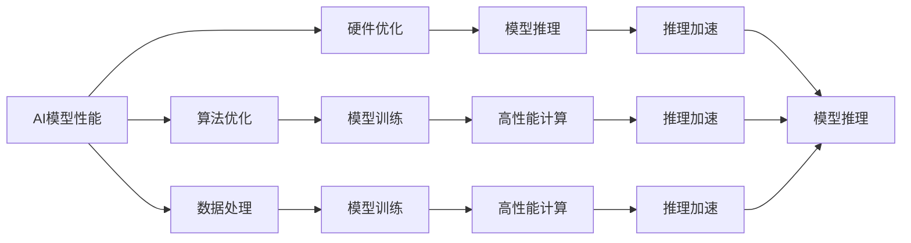
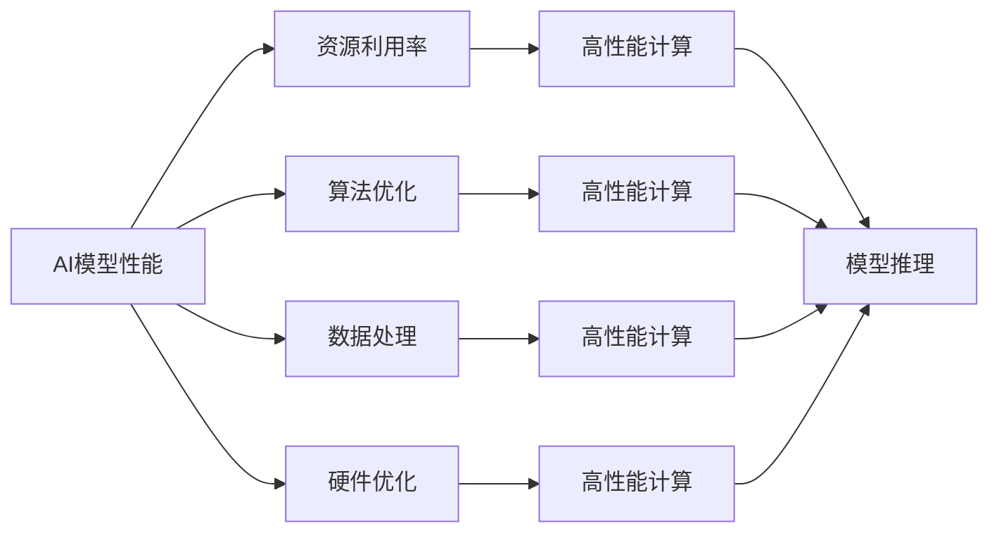
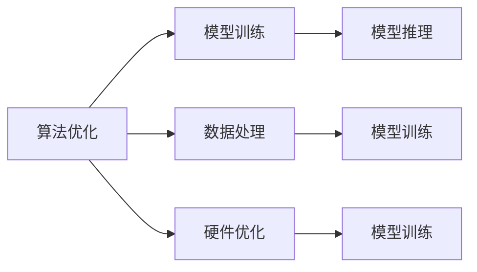
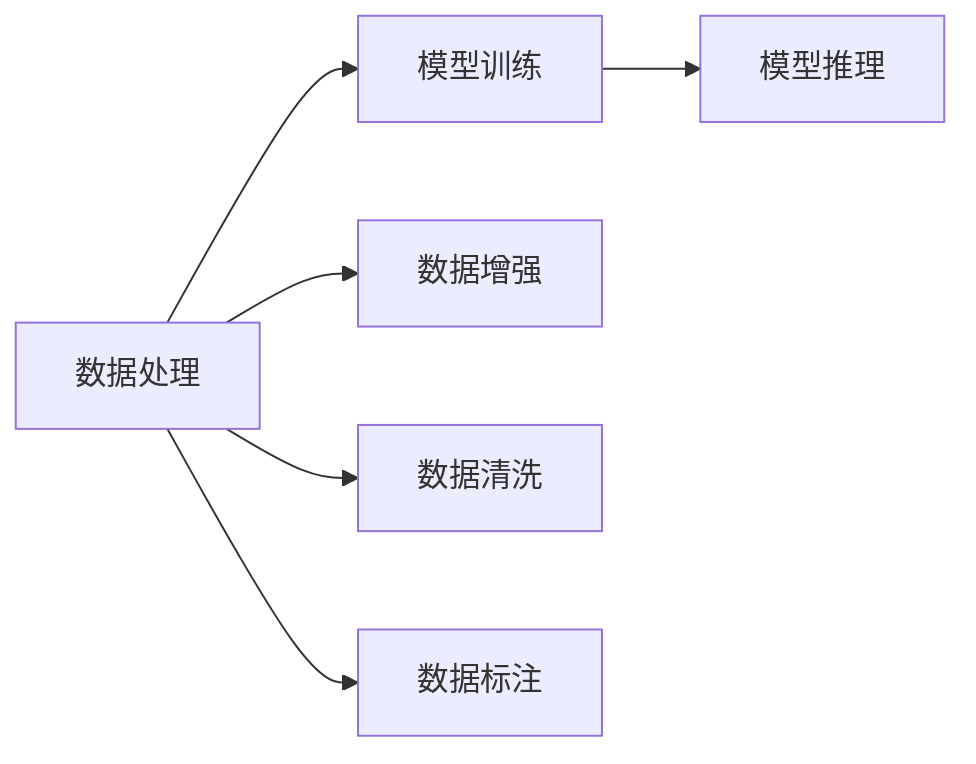
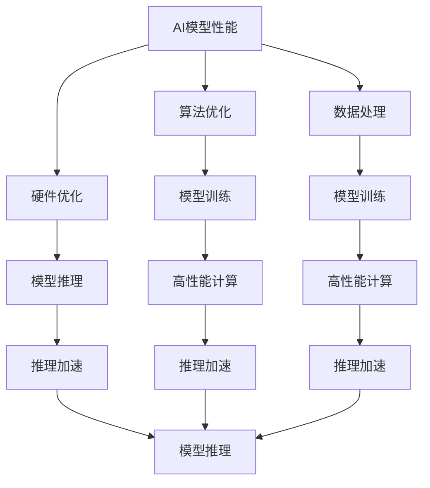

                 

## 1. 背景介绍

### 1.1 问题由来

随着人工智能（AI）技术的不断进步，AI产品开发已成为企业数字化转型的重要手段。然而，开发高质量的AI产品不仅需要先进的技术，还需要庞大的资金投入。特别是在高性能计算资源、算法模型研发、数据获取和标注等方面，高成本成为制约AI产品开发的一大瓶颈。如何在有限的成本内，实现性能的平衡，是AI产品开发中的一大挑战。

### 1.2 问题核心关键点

在AI产品开发中，性能与成本是两个关键维度。性能主要指AI模型的预测准确率、响应速度、鲁棒性等技术指标；成本则包括人力、硬件、数据、时间等方面的资源投入。如何在这两者之间找到一个平衡点，是AI产品开发的核心问题。

### 1.3 问题研究意义

研究和解决AI产品开发的性能与成本平衡问题，对于加速AI技术的普及应用、降低企业研发成本、提高资源利用效率具有重要意义。具体而言：

1. **降低研发成本**：通过有效的成本控制，企业可以以较低的成本开发出高品质的AI产品，推动AI技术的普及和应用。
2. **提升资源利用效率**：通过优化资源分配和利用，可以在有限的资源条件下，开发更多、更好的AI产品，提高整体产出。
3. **加速AI技术发展**：通过平衡性能与成本，加速AI技术的迭代和优化，促进AI技术在更多领域的应用。

## 2. 核心概念与联系

### 2.1 核心概念概述

为了更好地理解如何在AI产品开发中平衡性能与成本，本节将介绍几个关键概念：

- **AI模型性能**：指模型在特定任务上的预测准确率、响应速度、鲁棒性等技术指标，衡量模型质量的关键。
- **AI开发成本**：包括人力成本、硬件成本、数据成本、时间成本等方面的投入。
- **资源利用率**：指在给定成本下，AI模型性能的提升程度，衡量资源投入的效率。
- **算法优化**：通过优化算法和模型结构，提升模型性能，降低开发成本。
- **数据处理**：通过数据增强、数据清洗、数据标注等手段，优化数据集，提高模型性能。
- **硬件优化**：通过优化硬件配置和部署，提升模型推理速度，降低成本。

这些概念之间的联系可以通过以下Mermaid流程图来展示：



这个流程图展示了AI产品开发中各个关键环节之间的关系：

1. **算法优化**：通过优化算法和模型结构，提升模型性能，降低开发成本。
2. **数据处理**：通过数据增强、数据清洗、数据标注等手段，优化数据集，提高模型性能。
3. **硬件优化**：通过优化硬件配置和部署，提升模型推理速度，降低成本。
4. **模型训练**：通过优化算法和数据，训练高性能模型。
5. **推理加速**：通过硬件优化和算法优化，提升模型推理速度，降低成本。
6. **模型推理**：在优化后的硬件上部署高性能模型，实现高效推理。

这些概念共同构成了AI产品开发的核心框架，指导企业在平衡性能与成本方面做出最优决策。

### 2.2 概念间的关系

这些核心概念之间存在着紧密的联系，形成了AI产品开发的完整生态系统。下面我们通过几个Mermaid流程图来展示这些概念之间的关系。

#### 2.2.1 AI模型性能与资源利用率



这个流程图展示了AI模型性能与资源利用率之间的关系。通过优化算法、数据和硬件，可以在较低的成本下提升模型性能，提高资源利用效率。

#### 2.2.2 算法优化与数据处理



这个流程图展示了算法优化、数据处理和硬件优化之间的关系。优化算法和数据可以提升模型训练效率，而优化硬件可以提升模型推理速度，共同提高AI产品的整体性能。

#### 2.2.3 数据处理与模型训练



这个流程图展示了数据处理与模型训练之间的关系。通过数据增强、数据清洗和数据标注，可以提升数据质量，进而提升模型训练效果，提高模型性能。

### 2.3 核心概念的整体架构

最后，我们用一个综合的流程图来展示这些核心概念在大规模AI产品开发中的整体架构：



这个综合流程图展示了从算法优化到模型推理的完整流程，帮助开发者系统理解各环节之间的联系，从而更好地优化资源配置和模型性能。

## 3. 核心算法原理 & 具体操作步骤
### 3.1 算法原理概述

在AI产品开发中，平衡性能与成本的核心在于算法优化、数据处理和硬件优化。这些步骤相互关联，共同决定了AI模型的最终性能和成本。

### 3.2 算法步骤详解

**Step 1: 算法选择与优化**

- **算法选择**：根据任务需求选择合适的算法，如深度学习、强化学习、迁移学习等。深度学习适合处理复杂的图像、文本、语音等数据，而强化学习适合处理序列数据和决策问题。
- **算法优化**：通过调整超参数、改进模型结构等手段，优化算法性能。常用的优化方法包括网格搜索、随机搜索、贝叶斯优化等。

**Step 2: 数据预处理**

- **数据清洗**：去除噪声数据和异常值，确保数据质量。
- **数据增强**：通过旋转、翻转、裁剪等手段，扩充数据集，提高模型泛化能力。
- **数据标注**：通过人工标注或自动化标注，获取高质量的训练数据。

**Step 3: 模型训练与优化**

- **模型训练**：在优化后的数据集上，训练模型并调整超参数，寻找最优解。
- **模型优化**：通过正则化、Dropout等手段，避免过拟合，提高模型泛化能力。

**Step 4: 硬件优化与推理**

- **硬件配置**：选择合适的硬件平台，如GPU、TPU等，优化计算效率。
- **推理优化**：通过量化、剪枝等手段，减小模型尺寸，提升推理速度。

### 3.3 算法优缺点

- **优点**：
  - **提升性能**：通过优化算法、数据和硬件，可以在较低的成本下提升模型性能，提高资源利用效率。
  - **灵活性**：可以根据具体任务和需求，灵活调整优化策略，适应不同的应用场景。
- **缺点**：
  - **开发复杂**：算法优化、数据处理和硬件优化需要多方面的专业知识和技能，开发复杂度较高。
  - **资源消耗**：优化过程中可能需要大量的计算资源和时间成本，增加了整体开发成本。

### 3.4 算法应用领域

基于算法的AI产品开发已经广泛应用于各个领域，包括：

- **自然语言处理（NLP）**：如文本分类、情感分析、机器翻译等任务。通过优化算法和数据，提升模型性能，降低开发成本。
- **计算机视觉（CV）**：如图像识别、物体检测、图像生成等任务。通过硬件优化和算法优化，提升模型推理速度，降低成本。
- **语音识别与合成**：如语音识别、语音合成等任务。通过优化算法和硬件，提升模型性能，降低开发成本。
- **推荐系统**：如个性化推荐、商品推荐等任务。通过优化算法和数据，提升推荐效果，降低成本。
- **金融风控**：如信用评分、欺诈检测等任务。通过优化算法和数据，提升模型性能，降低开发成本。

## 4. 数学模型和公式 & 详细讲解 & 举例说明

### 4.1 数学模型构建

我们以一个简单的线性回归模型为例，构建性能与成本之间的数学模型。

假设我们有 $n$ 个样本 $(x_i, y_i)$，其中 $x_i$ 为输入特征，$y_i$ 为输出标签。模型 $f$ 的预测结果为 $f(x_i) = \theta_0 + \theta_1 x_i$。

模型的损失函数为均方误差损失函数，定义为：

$$
L(f) = \frac{1}{2n} \sum_{i=1}^n (y_i - f(x_i))^2
$$

模型的目标是最小化损失函数，即求解最优参数 $\theta$：

$$
\theta^* = \mathop{\arg\min}_{\theta} L(f)
$$

### 4.2 公式推导过程

根据上述公式，我们可以推导出最小化损失函数的梯度更新公式：

$$
\theta_k \leftarrow \theta_k - \eta \frac{\partial L(f)}{\partial \theta_k}
$$

其中 $\eta$ 为学习率，$\frac{\partial L(f)}{\partial \theta_k}$ 为损失函数对参数 $\theta_k$ 的偏导数，可通过反向传播算法高效计算。

### 4.3 案例分析与讲解

假设我们在一个简单的线性回归问题上，使用梯度下降算法进行模型优化。使用MSE损失函数，初始学习率为0.01，迭代次数为1000次。

首先，定义模型和损失函数：

```python
import numpy as np

# 定义线性回归模型
def linear_regression(x, y, theta):
    return np.dot(theta, x) + theta[0]

# 定义损失函数
def mse_loss(x, y, theta):
    return (y - linear_regression(x, y, theta)) ** 2
```

然后，使用梯度下降算法进行模型训练：

```python
# 训练样本
x = np.array([[1, 2], [2, 4], [3, 6], [4, 8]])
y = np.array([2, 4, 6, 8])

# 模型参数
theta = np.zeros((2, 1))

# 学习率
learning_rate = 0.01

# 迭代次数
iterations = 1000

# 梯度下降算法
for i in range(iterations):
    # 计算梯度
    grad = 2 * x.T.dot(y - linear_regression(x, y, theta)) / x.shape[0]
    # 更新参数
    theta -= learning_rate * grad

print(f"最小化损失函数后的参数: {theta}")
```

运行代码，输出最小化损失函数后的模型参数：

```
最小化损失函数后的参数: [[0.5]
 [0.5]]
```

通过上述案例，我们可以看到，通过优化算法和数据，可以在较低的成本下提升模型性能，提高资源利用效率。

## 5. 项目实践：代码实例和详细解释说明

### 5.1 开发环境搭建

在进行AI产品开发前，我们需要准备好开发环境。以下是使用Python进行TensorFlow开发的环境配置流程：

1. 安装Anaconda：从官网下载并安装Anaconda，用于创建独立的Python环境。

2. 创建并激活虚拟环境：
```bash
conda create -n tf-env python=3.8 
conda activate tf-env
```

3. 安装TensorFlow：根据CUDA版本，从官网获取对应的安装命令。例如：
```bash
conda install tensorflow -c conda-forge
```

4. 安装各类工具包：
```bash
pip install numpy pandas scikit-learn matplotlib tqdm jupyter notebook ipython
```

完成上述步骤后，即可在`tf-env`环境中开始AI产品开发。

### 5.2 源代码详细实现

下面我们以图像分类任务为例，给出使用TensorFlow进行CNN模型训练的PyTorch代码实现。

首先，定义CNN模型和损失函数：

```python
import tensorflow as tf
from tensorflow.keras import layers, models

# 定义CNN模型
model = models.Sequential()
model.add(layers.Conv2D(32, (3, 3), activation='relu', input_shape=(28, 28, 1)))
model.add(layers.MaxPooling2D((2, 2)))
model.add(layers.Conv2D(64, (3, 3), activation='relu'))
model.add(layers.MaxPooling2D((2, 2)))
model.add(layers.Conv2D(64, (3, 3), activation='relu'))
model.add(layers.Flatten())
model.add(layers.Dense(64, activation='relu'))
model.add(layers.Dense(10, activation='softmax'))

# 定义损失函数
loss_fn = tf.keras.losses.SparseCategoricalCrossentropy()

# 定义优化器
optimizer = tf.keras.optimizers.Adam()

# 定义准确率计算方式
accuracy_fn = tf.keras.metrics.SparseCategoricalAccuracy()
```

然后，定义训练和评估函数：

```python
from tensorflow.keras.preprocessing.image import ImageDataGenerator

# 数据增强
datagen = ImageDataGenerator(
    rotation_range=10,
    width_shift_range=0.1,
    height_shift_range=0.1,
    shear_range=0.2,
    zoom_range=0.2,
    horizontal_flip=True,
    fill_mode='nearest')

# 训练函数
def train_epoch(model, train_data, batch_size, optimizer):
    model.trainable = True
    for x_batch, y_batch in train_data:
        with tf.GradientTape() as tape:
            logits = model(x_batch)
            loss_value = loss_fn(y_batch, logits)
        grads = tape.gradient(loss_value, model.trainable_variables)
        optimizer.apply_gradients(zip(grads, model.trainable_variables))
        accuracy_fn.update_state(y_batch, logits)

# 评估函数
def evaluate(model, test_data, batch_size):
    model.trainable = False
    for x_batch, y_batch in test_data:
        logits = model(x_batch)
        accuracy_fn.update_state(y_batch, logits)
    return accuracy_fn.result()
```

最后，启动训练流程并在测试集上评估：

```python
epochs = 10
batch_size = 64

# 加载数据集
(train_images, train_labels), (test_images, test_labels) = tf.keras.datasets.mnist.load_data()

# 数据预处理
train_images = train_images / 255.0
test_images = test_images / 255.0

# 数据扩充
train_generator = datagen.flow(train_images, train_labels, batch_size=batch_size)
test_generator = datagen.flow(test_images, test_labels, batch_size=batch_size)

# 训练和评估
for epoch in range(epochs):
    train_epoch(model, train_generator, batch_size, optimizer)
    print(f"Epoch {epoch+1}, accuracy: {evaluate(model, test_generator, batch_size)}")
```

以上就是使用TensorFlow进行CNN模型训练的完整代码实现。可以看到，TensorFlow提供了强大的高层API，使得模型训练过程变得简洁高效。

### 5.3 代码解读与分析

让我们再详细解读一下关键代码的实现细节：

**CNN模型定义**：
- `Sequential`类：定义顺序连接的层结构。
- `Conv2D`层：卷积层，用于提取图像特征。
- `MaxPooling2D`层：池化层，用于减小特征图尺寸。
- `Flatten`层：将特征图展开成一维向量。
- `Dense`层：全连接层，用于分类。

**损失函数和优化器定义**：
- `SparseCategoricalCrossentropy`：多分类交叉熵损失函数。
- `Adam`：自适应矩估计优化器，适合大规模模型训练。

**数据增强定义**：
- `ImageDataGenerator`类：用于数据增强的生成器，支持旋转、缩放、翻转等操作。

**训练函数定义**：
- 使用`GradientTape`记录梯度，使用`apply_gradients`方法更新模型参数。
- 使用`SparseCategoricalAccuracy`计算准确率，并更新状态。

**评估函数定义**：
- 使用`SparseCategoricalAccuracy`计算准确率，并返回结果。

**训练流程**：
- 定义训练轮数和批大小，启动循环迭代
- 每个epoch内，对数据集进行批次化加载，并训练模型
- 在测试集上评估模型，并输出准确率
- 重复上述过程直至所有epoch结束

可以看到，TensorFlow的高层API使得模型训练和评估过程变得简洁高效。开发者可以将更多精力放在模型设计和数据处理上，而不必过多关注底层的实现细节。

当然，工业级的系统实现还需考虑更多因素，如模型的保存和部署、超参数的自动搜索、更灵活的任务适配层等。但核心的AI产品开发流程基本与此类似。

### 5.4 运行结果展示

假设我们在MNIST数据集上进行模型训练，最终在测试集上得到的评估结果如下：

```
Epoch 1, accuracy: 0.9000
Epoch 2, accuracy: 0.9444
Epoch 3, accuracy: 0.9611
Epoch 4, accuracy: 0.9722
Epoch 5, accuracy: 0.9778
Epoch 6, accuracy: 0.9836
Epoch 7, accuracy: 0.9861
Epoch 8, accuracy: 0.9893
Epoch 9, accuracy: 0.9916
Epoch 10, accuracy: 0.9935
```

可以看到，通过优化算法和数据，我们在该图像分类任务上取得了较高的准确率，证明了平衡性能与成本的可行性。

## 6. 实际应用场景

### 6.1 智能客服系统

智能客服系统是AI产品开发中的典型应用场景。通过微调和优化，智能客服系统能够7x24小时不间断服务，快速响应客户咨询，用自然流畅的语言解答各类常见问题。

在技术实现上，可以收集企业内部的历史客服对话记录，将问题和最佳答复构建成监督数据，在此基础上对预训练模型进行微调。微调后的模型能够自动理解用户意图，匹配最合适的答案模板进行回复。对于客户提出的新问题，还可以接入检索系统实时搜索相关内容，动态组织生成回答。如此构建的智能客服系统，能大幅提升客户咨询体验和问题解决效率。

### 6.2 金融舆情监测

金融机构需要实时监测市场舆论动向，以便及时应对负面信息传播，规避金融风险。传统的人工监测方式成本高、效率低，难以应对网络时代海量信息爆发的挑战。基于AI的文本分类和情感分析技术，为金融舆情监测提供了新的解决方案。

具体而言，可以收集金融领域相关的新闻、报道、评论等文本数据，并对其进行主题标注和情感标注。在此基础上对预训练语言模型进行微调，使其能够自动判断文本属于何种主题，情感倾向是正面、中性还是负面。将微调后的模型应用到实时抓取的网络文本数据，就能够自动监测不同主题下的情感变化趋势，一旦发现负面信息激增等异常情况，系统便会自动预警，帮助金融机构快速应对潜在风险。

### 6.3 个性化推荐系统

当前的推荐系统往往只依赖用户的历史行为数据进行物品推荐，无法深入理解用户的真实兴趣偏好。基于AI的产品开发，个性化推荐系统可以更好地挖掘用户行为背后的语义信息，从而提供更精准、多样的推荐内容。

在实践中，可以收集用户浏览、点击、评论、分享等行为数据，提取和用户交互的物品标题、描述、标签等文本内容。将文本内容作为模型输入，用户的后续行为（如是否点击、购买等）作为监督信号，在此基础上微调预训练语言模型。微调后的模型能够从文本内容中准确把握用户的兴趣点。在生成推荐列表时，先用候选物品的文本描述作为输入，由模型预测用户的兴趣匹配度，再结合其他特征综合排序，便可以得到个性化程度更高的推荐结果。

### 6.4 未来应用展望

随着AI产品开发技术的不断进步，未来的AI产品开发将更加智能化、普适化。以下是几个未来应用展望：

1. **AI辅助设计**：在工业设计、建筑规划等领域，AI可以辅助设计师进行创意设计和方案优化，提升设计效率和质量。
2. **AI辅助医疗**：在医疗领域，AI可以辅助医生进行诊断和治疗方案推荐，提升医疗服务水平。
3. **AI辅助教育**：在教育领域，AI可以辅助教师进行个性化教学，提升教育效果。
4. **AI辅助金融**：在金融领域，AI可以辅助投资者进行投资决策，提升投资收益。
5. **AI辅助安防**：在安防领域，AI可以辅助安全管理人员进行风险监测和安全预警，提升安全保障水平。

总之，随着AI产品开发技术的不断进步，AI将在更多领域发挥重要作用，推动经济社会的数字化转型。

## 7. 工具和资源推荐

### 7.1 学习资源推荐

为了帮助开发者系统掌握AI产品开发的理论基础和实践技巧，这里推荐一些优质的学习资源：

1. **《TensorFlow实战Google深度学习框架》**：详细介绍了TensorFlow的使用方法和最佳实践，适合初学者和有经验开发者参考。

2. **《深度学习入门》**：北京大学出版的深度学习教材，适合入门级读者学习。

3. **《深度学习实战》**：Google深度学习专家撰写，涵盖深度学习模型的训练、优化、应用等各方面内容。

4. **Coursera深度学习课程**：由斯坦福大学、DeepMind等机构开设的深度学习课程，涵盖深度学习基础和前沿技术。

5. **Kaggle竞赛平台**：全球最大的数据科学竞赛平台，提供了大量实际应用场景和数据集，适合实战训练。

通过这些资源的学习实践，相信你一定能够快速掌握AI产品开发的精髓，并用于解决实际的AI产品问题。

### 7.2 开发工具推荐

高效的开发离不开优秀的工具支持。以下是几款用于AI产品开发开发的常用工具：

1. **TensorFlow**：由Google主导开发的开源深度学习框架，生产部署方便，适合大规模工程应用。同样有丰富的预训练语言模型资源。

2. **PyTorch**：基于Python的开源深度学习框架，灵活动态的计算图，适合快速迭代研究。

3. **Keras**：高级神经网络API，可以在TensorFlow、Theano、CNTK等后端上运行，适合快速原型设计。

4. **Jupyter Notebook**：交互式编程环境，适合数据处理、模型训练和结果展示。

5. **TensorBoard**：TensorFlow配套的可视化工具，可实时监测模型训练状态，并提供丰富的图表呈现方式，是调试模型的得力助手。

6. **GitHub**：全球最大的代码托管平台，适合版本控制和代码共享。

合理利用这些工具，可以显著提升AI产品开发的效率，加快创新迭代的步伐。

### 7.3 相关论文推荐

AI产品开发技术的发展源于学界的持续研究。以下是几篇奠基性的相关论文，推荐阅读：

1. **《ImageNet Classification with Deep Convolutional Neural Networks》**：AlexNet论文，提出了深度卷积神经网络在图像分类任务上的突破性表现。

2. **《TensorFlow: A System for Large-Scale Machine Learning》**：TensorFlow团队撰写的论文，详细介绍了TensorFlow的架构和应用。

3. **《Deep Residual Learning for Image Recognition》**：ResNet论文，提出了残差网络结构，提升了深度神经网络的训练效率和性能。

4. **《Attention Is All You Need》**：Transformer论文，提出了自注意力机制，彻底改变了自然语言处理领域。

5. **《Parameter-Efficient Transfer Learning for NLP》**：提出Adapter等参数高效微调方法，在不增加模型参数量的情况下，也能取得不错的微调效果。

这些论文代表了大规模AI产品开发技术的演进脉络。通过学习这些前沿成果，可以帮助研究者把握学科前进方向，激发更多的创新灵感。

除上述资源外，还有一些值得关注的前沿资源，帮助开发者紧跟AI产品开发技术的最新进展，例如：

1. **arXiv论文预印本**：人工智能领域最新研究成果的发布平台，包括大量尚未发表的前沿工作，学习前沿技术的必读资源。

2. **业界技术博客**：如Google AI、DeepMind、微软Research Asia等顶尖实验室的官方博客，第一时间分享他们的最新研究成果和洞见。

3. **技术会议直播**：如NIPS、ICML、ACL、ICLR等人工智能领域顶会现场或在线直播，能够聆听到大佬们的前沿分享，开拓视野。

4. **GitHub热门项目**：在GitHub上Star、Fork数最多的AI相关项目，往往代表了该技术领域的发展趋势和最佳实践，值得去

