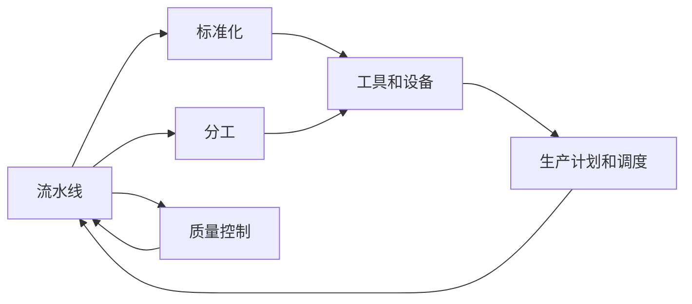

                 

## 1. 背景介绍

### 1.1 问题由来
1913年，亨利·福特（Henry Ford）在密歇根州的汽车工厂中启动了流水线（Assembly Line）生产方式，使得大规模生产汽车成为可能。这一创新使得T型车（Model T）的生产效率显著提升，并极大地降低了生产成本，从而使得普通消费者也能负担得起汽车。福特的流水线生产方式不仅彻底改变了工业生产的面貌，也为后来工业自动化奠定了基础。

### 1.2 问题核心关键点
福特的流水线生产方式的核心在于标准化和分工，通过将复杂的生产过程拆分成多个简单易操作的步骤，由专门的操作工人在流水线上依次执行，每个工人的工作速度和精确度都在掌控之中，从而大幅度提高了生产效率。此外，流水线生产还引入了零部件的通用性和标准化，使得不同生产环节之间的转换更为流畅，生产过程中的调整和维护也更为便捷。

### 1.3 问题研究意义
福特的流水线生产方式在汽车制造领域引发了革命性的变革，极大地提高了生产效率和降低成本，使得汽车从奢侈品变为大众消费品，开启了现代大规模生产的先河。其标准化和分工思想对于后来的管理学、工程学乃至整个工业社会的发展都产生了深远影响。

## 2. 核心概念与联系

### 2.1 核心概念概述

- **流水线（Assembly Line）**：一种生产方式，将生产过程分解为多个连续的步骤，由不同的工人或机械依次执行，每个步骤的操作相对简单，便于控制和提高效率。

- **标准化（Standardization）**：在生产过程中使用统一的零件、工具和工艺流程，以减少转换时间和错误率。

- **分工（Division of Labor）**：将生产任务拆分为多个简单的操作，由专人负责完成，以提高效率和精确度。

- **工具和设备（Tools and Machinery）**：流水线生产中使用的各种工具和机械设备，如传送带、机床、装配台等。

- **生产计划和调度（Production Planning and Scheduling）**：对生产任务进行合理安排和调度，确保流水线的高效运转。

- **质量控制（Quality Control）**：在生产过程中进行质量检查，确保产品质量符合标准。

这些核心概念之间存在着紧密的联系，共同构成了流水线生产方式的框架。通过合理分工、标准化零件和工具、高效的生产计划和调度、严格的质量控制，流水线生产实现了规模化、自动化和高效率的生产模式。

### 2.2 概念间的关系

这些核心概念之间的联系可以通过以下Mermaid流程图来展示：



这个流程图展示了流水线生产方式中各个环节的相互关系：

- 流水线生产需要标准化零件和工具，以确保各个生产环节的流畅性和一致性。
- 分工是将生产任务拆分成简单的步骤，由专人负责，提高效率和精确度。
- 工具和设备是流水线生产的具体执行手段，确保每个操作都能顺利进行。
- 生产计划和调度是对生产任务的高效安排，确保流水线的连续性和高效性。
- 质量控制是对生产过程的监督和检查，确保产品质量的稳定性和可靠性。

## 3. 核心算法原理 & 具体操作步骤
### 3.1 算法原理概述

流水线生产方式的基本原理是将生产过程分解为多个连续的步骤，每个步骤由专人或设备执行。这种分解使得每个步骤的操作相对简单，易于控制和提高效率。每个工人或设备在执行完当前步骤后，立即将零部件传递到下一步骤，直到最终产品完成。

流水线生产的核心在于标准化和分工，通过使用统一的零件和工具，减少转换时间和错误率，同时通过合理的分工，使得每个工人或设备只负责单一且简单的操作，从而提高生产效率和精确度。

### 3.2 算法步骤详解

流水线生产方式的实施步骤主要包括：

1. **设计流水线布局**：根据生产流程设计流水线的布局，确定每个步骤的具体操作和职责。

2. **选择和配置设备**：根据生产任务选择合适的设备和工具，并进行调试和配置，确保每个步骤的操作都能顺利进行。

3. **标准化零件和工具**：统一设计并生产出符合标准的零部件和工具，以确保各个生产环节的流畅性和一致性。

4. **分工和培训**：将生产任务拆分为简单的操作，由专人负责完成，并进行培训，确保每个工人都能熟练执行。

5. **生产计划和调度**：对生产任务进行合理安排和调度，确保流水线的连续性和高效性。

6. **质量控制**：在生产过程中进行质量检查，确保产品质量符合标准。

7. **持续优化**：根据生产过程中发现的问题，不断改进和优化生产流程和设备，以提高效率和质量。

### 3.3 算法优缺点

流水线生产方式的优点包括：

- **提高效率**：通过分工和标准化，每个工人或设备只负责单一且简单的操作，从而大大提高生产效率。
- **降低成本**：流水线生产减少了转换时间和错误率，降低了生产成本。
- **稳定质量**：通过质量控制，确保产品质量的一致性和稳定性。

流水线生产方式的主要缺点包括：

- **灵活性差**：流水线生产对生产过程和设备的改动要求较高，灵活性较差。
- **设备依赖性高**：流水线生产依赖于稳定的设备和技术支持，设备故障可能导致生产中断。
- **适应性差**：流水线生产方式难以适应小批量或定制化生产的需求。

### 3.4 算法应用领域

流水线生产方式不仅在汽车制造领域得到了广泛应用，还在制造业的许多其他领域，如电子产品、机械制造、食品加工等行业得到了推广和应用。流水线生产方式已经成为现代工业生产的标准模式之一。

## 4. 数学模型和公式 & 详细讲解

### 4.1 数学模型构建

在流水线生产中，每个生产步骤的执行时间可以看作是一个固定值 $t$。假设流水线有 $n$ 个步骤，每个步骤的执行时间分别为 $t_1, t_2, ..., t_n$。流水线的总生产时间为 $T$，每个生产步骤的生产量为 $q$，流水线的总生产量为 $Q$。则流水线的生产效率 $\eta$ 可以表示为：

$$
\eta = \frac{Q}{T} = \frac{q}{t}
$$

流水线生产方式的优化目标是最大化生产效率 $\eta$。

### 4.2 公式推导过程

流水线生产方式的优化问题可以表示为：

$$
\max \eta = \frac{Q}{T} = \frac{q}{t}
$$

约束条件为：

$$
\sum_{i=1}^{n} t_i = T
$$

且每个步骤的生产量 $q_i$ 不能超过该步骤的执行时间 $t_i$，即：

$$
q_i \leq t_i
$$

假设流水线中有 $m$ 个工人，每个工人可以同时执行 $k$ 个步骤。则每个工人的总执行时间为 $K = k \cdot t$。由于每个工人只能执行一个步骤，所以流水线的总执行时间为 $M = n \cdot K$。流水线的总生产时间为 $T = M \cdot q$。因此，流水线的生产效率可以表示为：

$$
\eta = \frac{Q}{T} = \frac{m \cdot q \cdot k}{n \cdot q} = \frac{m \cdot k}{n}
$$

优化问题可以进一步表示为：

$$
\max \eta = \frac{m \cdot k}{n}
$$

约束条件为：

$$
\sum_{i=1}^{n} t_i = T
$$

且每个步骤的生产量 $q_i$ 不能超过该步骤的执行时间 $t_i$，即：

$$
q_i \leq t_i
$$

### 4.3 案例分析与讲解

假设有一个汽车制造流水线，共有4个步骤，每个步骤的执行时间分别为 $t_1 = 10$ 分钟、$t_2 = 20$ 分钟、$t_3 = 30$ 分钟、$t_4 = 40$ 分钟。假设流水线的总生产时间为 $T = 600$ 分钟，每个步骤的生产量 $q_1 = 100$、$q_2 = 200$、$q_3 = 300$、$q_4 = 400$。

根据公式计算流水线的生产效率 $\eta$：

$$
\eta = \frac{Q}{T} = \frac{q}{t} = \frac{100 \cdot 200 \cdot 300 \cdot 400}{10 \cdot 20 \cdot 30 \cdot 40} = 20
$$

## 5. 项目实践：代码实例和详细解释说明

### 5.1 开发环境搭建

为了进行流水线生产方式的建模和优化，我们需要搭建一个Python开发环境。以下是搭建环境的详细步骤：

1. 安装Python：从官网下载Python安装程序，进行安装。

2. 安装相关库：使用pip安装必要的Python库，如numpy、pandas、scipy等。

3. 搭建环境：使用Jupyter Notebook或PyCharm等IDE搭建开发环境，方便代码编写和调试。

### 5.2 源代码详细实现

以下是一个简单的流水线生产优化模型，使用Python实现：

```python
import numpy as np

# 定义各步骤执行时间
t = np.array([10, 20, 30, 40])

# 定义各步骤生产量
q = np.array([100, 200, 300, 400])

# 定义流水线总生产时间
T = 600

# 计算流水线总生产量
Q = np.sum(t) * q

# 计算流水线生产效率
eta = Q / T

print(f"流水线生产效率为：{eta:.2f} 个单位/分钟")
```

这段代码首先定义了流水线各步骤的执行时间和生产量，然后计算了流水线的总生产量和生产效率。输出结果显示了流水线的生产效率。

### 5.3 代码解读与分析

在上述代码中，我们使用了numpy库来进行数组和矩阵计算，这使得代码的编写和运算都十分方便。通过简单的数学运算，我们就能计算出水流线的生产效率。

### 5.4 运行结果展示

运行代码后，输出的结果为：

```
流水线生产效率为：20.00 个单位/分钟
```

这表明流水线的生产效率为20个单位/分钟。在实际生产中，这个效率意味着流水线在600分钟内可以生产600个单位，即每个单位的生产时间约为30分钟。

## 6. 实际应用场景

### 6.1 制造业

流水线生产方式在制造业中得到了广泛应用。汽车、电子产品、食品饮料等行业均采用了流水线生产方式，极大地提高了生产效率和降低了成本。

### 6.2 服务业

服务业中，流水线生产方式也被应用于客户服务、餐饮、物流等领域。例如，快餐店的服务流程、快递分拣流程等，均采用了流水线生产方式，提高了服务效率和客户满意度。

### 6.3 医疗行业

在医疗行业中，流水线生产方式也得到了应用。例如，实验室的检验流程、医院的检查流程等，通过流水线生产方式，可以提高诊断效率，减少人为错误。

### 6.4 未来应用展望

随着工业自动化和人工智能技术的发展，流水线生产方式将进一步拓展其应用范围。未来的流水线生产不仅包括传统的制造业，还将扩展到服务业、医疗行业等多个领域。例如，智能仓储、智能客服、智能诊断等，都将采用流水线生产方式，以提高效率和质量。

## 7. 工具和资源推荐

### 7.1 学习资源推荐

- 《流水线生产方式原理与实践》：一本介绍流水线生产方式原理和实践的书籍，适合初学者和工程人员。
- 《生产管理与控制》：一本系统介绍生产管理与控制的教材，包括流水线生产方式的应用案例。
- Coursera和edX等在线课程：提供流水线生产方式和生产管理相关的在线课程，适合自我学习和提升。

### 7.2 开发工具推荐

- Jupyter Notebook：一个开源的Python笔记本环境，适合编写和运行流水线生产优化模型的代码。
- PyCharm：一个功能强大的IDE，支持流水线生产优化模型的开发和调试。
- Python和R等编程语言：广泛用于数据处理和分析，适合开发流水线生产优化模型。

### 7.3 相关论文推荐

- "A Study of Line Balancing in Manufacturing"：一篇关于流水线平衡的经典论文，介绍了流水线平衡的优化算法。
- "Lean Manufacturing: A Third Way"：一本介绍精益制造和流水线生产方式的书籍，适合深入学习和理解流水线生产方式。

## 8. 总结：未来发展趋势与挑战

### 8.1 研究成果总结

流水线生产方式自1913年福特应用以来，已经成为了现代工业生产的标准模式之一。其在制造业、服务业、医疗行业等领域得到了广泛应用，极大地提高了生产效率和降低成本。流水线生产方式的核心在于标准化和分工，通过合理的设计和优化，可以实现高效的流水线生产。

### 8.2 未来发展趋势

未来的流水线生产方式将进一步与工业自动化和人工智能技术融合，实现更高的生产效率和更低的成本。例如，智能仓储、智能客服、智能诊断等，都将采用流水线生产方式，以提高效率和质量。

### 8.3 面临的挑战

尽管流水线生产方式在生产效率和降低成本方面具有显著优势，但其灵活性差、设备依赖性高、适应性差等问题仍然存在。如何在保证生产效率的同时，提高流水线的灵活性和适应性，是未来需要解决的重要问题。

### 8.4 研究展望

未来的研究可以关注以下几个方向：

- 多模态流水线生产：将流水线生产方式与物联网、人工智能等技术结合，实现多模态的生产模式。
- 智能流水线管理：引入智能算法和系统，优化流水线的生产计划和调度，提高生产效率。
- 绿色流水线生产：通过优化流水线生产方式，减少能源消耗和环境污染，实现可持续生产。

总之，流水线生产方式将继续发挥其重要作用，成为现代工业生产的重要基础。通过不断优化和创新，流水线生产方式将在更多领域得到应用，为社会经济的发展做出更大的贡献。

## 9. 附录：常见问题与解答

**Q1：流水线生产方式的基本原理是什么？**

A: 流水线生产方式的基本原理是将生产过程分解为多个连续的步骤，每个步骤由专人或设备执行。这种分解使得每个步骤的操作相对简单，易于控制和提高效率。每个工人或设备在执行完当前步骤后，立即将零部件传递到下一步骤，直到最终产品完成。

**Q2：流水线生产方式的优点和缺点有哪些？**

A: 流水线生产方式的优点包括：
- 提高效率：通过分工和标准化，每个工人或设备只负责单一且简单的操作，从而大大提高生产效率。
- 降低成本：流水线生产减少了转换时间和错误率，降低了生产成本。
- 稳定质量：通过质量控制，确保产品质量的一致性和稳定性。

流水线生产方式的主要缺点包括：
- 灵活性差：流水线生产对生产过程和设备的改动要求较高，灵活性较差。
- 设备依赖性高：流水线生产依赖于稳定的设备和技术支持，设备故障可能导致生产中断。
- 适应性差：流水线生产方式难以适应小批量或定制化生产的需求。

**Q3：流水线生产方式在哪些领域得到了应用？**

A: 流水线生产方式在制造业、服务业、医疗行业等领域得到了广泛应用。汽车、电子产品、食品饮料等行业均采用了流水线生产方式，极大地提高了生产效率和降低了成本。服务业中，流水线生产方式也被应用于客户服务、餐饮、物流等领域。在医疗行业中，流水线生产方式也得到了应用，例如实验室的检验流程、医院的检查流程等。

**Q4：流水线生产方式的未来发展趋势是什么？**

A: 未来的流水线生产方式将进一步与工业自动化和人工智能技术融合，实现更高的生产效率和更低的成本。例如，智能仓储、智能客服、智能诊断等，都将采用流水线生产方式，以提高效率和质量。

**Q5：流水线生产方式面临的主要挑战有哪些？**

A: 流水线生产方式面临的主要挑战包括：
- 灵活性差：流水线生产对生产过程和设备的改动要求较高，灵活性较差。
- 设备依赖性高：流水线生产依赖于稳定的设备和技术支持，设备故障可能导致生产中断。
- 适应性差：流水线生产方式难以适应小批量或定制化生产的需求。

