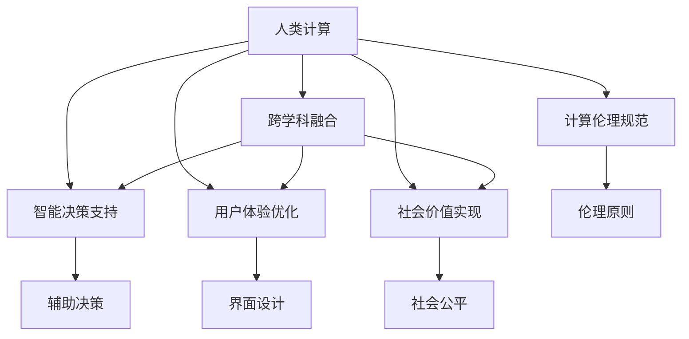

                 

# 应对人类共同挑战：人类计算的使命担当

> 关键词：人类计算, 共同挑战, 人工智能, 智慧决策, 跨学科合作

## 1. 背景介绍

### 1.1 问题由来
人类社会正面临着一系列前所未有的共同挑战，如气候变化、资源匮乏、社会不平等等。这些问题亟需跨学科、跨领域的技术手段和智慧决策支持。人类计算（Human-Computer Interaction, HCI）作为连接人类和计算机的桥梁，其发展历程展示了技术与人文、社会价值的紧密联系。

### 1.2 问题核心关键点
1. **跨学科融合**：HCI不仅关注技术实现，更强调人-机交互的设计、体验和评估，需要多学科协同合作。
2. **智能决策支持**：HCI通过智能算法和大数据技术，辅助人类决策，提升决策效率和质量。
3. **用户体验优化**：HCI以用户体验为中心，设计直观、易用的用户界面和交互流程，提高用户满意度。
4. **社会价值实现**：HCI不仅要解决具体技术问题，更关注如何通过技术手段促进社会公平、可持续发展和人文关怀。
5. **计算伦理规范**：HCI需遵循伦理原则，确保技术的公平、透明和负责任使用。

这些关键点揭示了HCI在应对人类共同挑战中的使命和担当。HCI技术通过人-机协同，不仅提升了个体的信息获取和处理能力，更赋能社会系统优化，促进整体福祉。

## 2. 核心概念与联系

### 2.1 核心概念概述

为更好地理解人类计算的使命担当，我们首先定义几个关键概念及其相互关系：

- **人类计算（Human-Computer Interaction, HCI）**：研究如何设计高效、友好、智能的人机交互界面，提升用户的使用体验和决策效率。

- **跨学科融合（Interdisciplinary Integration）**：强调计算机科学与人文、社会科学、工程等学科的深度交叉，形成综合性研究团队。

- **智能决策支持（Intelligent Decision Support）**：利用人工智能算法和大数据技术，辅助人类进行科学决策，优化决策过程。

- **用户体验优化（User Experience Optimization）**：以用户为中心，通过界面设计、交互流程、视觉设计等手段提升用户满意度和使用便捷性。

- **社会价值实现（Social Value Realization）**：通过技术手段促进社会公平、可持续发展和人文关怀，推动社会进步和人类福祉。

- **计算伦理规范（Computational Ethics）**：确保技术使用的透明性、公平性和负责任性，保护用户隐私，维护社会伦理。

这些概念通过人机协同，共同构成HCI的完整生态系统，致力于解决人类共同挑战。

### 2.2 概念间的关系

这些核心概念之间的关系可以通过以下Mermaid流程图来展示：



这个流程图展示了各个概念之间的逻辑关系：

- 人类计算通过跨学科融合，整合了不同领域的知识和技术。
- 智能决策支持提供了技术手段，辅助人类进行科学决策。
- 用户体验优化关注用户界面和交互流程，提升用户体验。
- 社会价值实现通过技术手段，促进社会公平和可持续发展。
- 计算伦理规范确保技术使用的透明性和伦理性。

这些概念通过合作，共同实现HCI的使命担当，应对人类共同挑战。

## 3. 核心算法原理 & 具体操作步骤

### 3.1 算法原理概述

人类计算的核心算法原理可以概括为以下几个方面：

1. **人机协同**：通过自然语言处理、计算机视觉、增强现实等技术，实现人机信息的高效交流和协同。
2. **智能算法**：利用机器学习、深度学习、自然语言处理等算法，提升信息理解和处理能力。
3. **大数据分析**：通过数据挖掘和统计分析，揭示数据背后的模式和趋势，辅助决策。
4. **用户交互**：设计直观、易用的用户界面，提升用户使用体验。
5. **跨学科融合**：整合心理学、社会学、人机工程学等多学科知识，提升技术设计和评估的深度和广度。

### 3.2 算法步骤详解

#### 3.2.1 数据采集与预处理
- 收集与挑战相关的数据，如气候数据、社会经济数据等。
- 进行数据清洗和预处理，确保数据的完整性和一致性。

#### 3.2.2 特征提取与建模
- 提取数据中的关键特征，如温度、经济指标、社会行为等。
- 利用机器学习算法，建立预测模型，如回归模型、分类模型等。

#### 3.2.3 模型评估与优化
- 使用交叉验证等方法，评估模型性能，如精度、召回率等。
- 根据评估结果，调整模型参数，优化模型性能。

#### 3.2.4 用户界面设计
- 根据模型输出，设计直观易用的用户界面，如图表、仪表盘等。
- 进行用户体验测试，收集反馈，不断优化界面设计。

#### 3.2.5 模型部署与迭代
- 将优化后的模型部署到实际应用中，进行实时监测和更新。
- 根据用户反馈和实时数据，持续迭代优化模型和界面设计。

### 3.3 算法优缺点

人类计算的算法有以下优点：
1. **高效协同**：通过人机协同，高效处理大量信息，提升决策效率。
2. **多学科融合**：整合多学科知识，提升技术设计的深度和广度。
3. **用户体验优化**：设计直观易用的用户界面，提升用户满意度。
4. **智能决策支持**：利用智能算法，辅助科学决策。

其缺点主要包括：
1. **复杂性高**：需要整合多学科知识，设计复杂的算法模型。
2. **数据依赖性强**：模型性能依赖于数据质量和数量。
3. **用户接受度**：用户对新界面和交互方式可能需要适应和学习过程。

### 3.4 算法应用领域

人类计算的算法在多个领域得到了广泛应用：

1. **智慧城市**：通过智能交通、能源管理等技术，提升城市运行效率，实现可持续发展。
2. **医疗健康**：利用医疗大数据和智能诊断工具，提升疾病预测和诊疗效率，促进健康公平。
3. **环境保护**：通过气候变化监测和环境数据分析，支持环境保护决策，促进生态文明建设。
4. **社会治理**：通过数据分析和智能决策，优化社会管理流程，提升治理效率和公平性。
5. **教育培训**：利用智能教学工具和数据分析，提升教育效果，促进教育公平。

## 4. 数学模型和公式 & 详细讲解 & 举例说明

### 4.1 数学模型构建

人类计算涉及的数学模型主要包括以下几个方面：

- **线性回归模型**：用于预测连续变量，如气温、经济指标等。
- **逻辑回归模型**：用于分类任务，如疾病诊断、环境事件分类等。
- **决策树模型**：用于分类和回归任务，支持模型解释和可视化。
- **支持向量机（SVM）**：用于分类和回归任务，对数据集进行高效分割和分类。
- **随机森林**：用于分类和回归任务，提升模型稳定性和泛化能力。

以线性回归模型为例，其数学表达式如下：

$$ y = \beta_0 + \beta_1 x_1 + \beta_2 x_2 + \cdots + \beta_n x_n + \epsilon $$

其中，$y$为预测值，$\beta$为模型系数，$x_i$为输入变量，$\epsilon$为误差项。

### 4.2 公式推导过程

线性回归模型的推导过程如下：

1. 假设输入变量$x_i$和输出变量$y$之间存在线性关系，如$y = \beta_0 + \beta_1 x_1 + \beta_2 x_2 + \cdots + \beta_n x_n$。
2. 使用最小二乘法求解模型系数$\beta$，使得预测值与真实值之间的误差最小化。
3. 最小化误差平方和$SSE = \sum_{i=1}^n (y_i - \hat{y}_i)^2$，求解$\beta$。
4. 求解$\beta$的公式为$\beta = (X^TX)^{-1}X^Ty$，其中$X$为输入矩阵，$y$为输出向量。

### 4.3 案例分析与讲解

以智慧城市中的智能交通管理为例，我们可以使用线性回归模型来预测交通流量。具体步骤如下：

1. 收集历史交通数据，包括时间、路线、车流量等。
2. 预处理数据，如去除异常值、标准化数据等。
3. 构建线性回归模型，预测未来交通流量。
4. 评估模型性能，如均方误差、平均绝对误差等。
5. 根据评估结果，调整模型参数，优化模型性能。
6. 设计直观易用的用户界面，展示交通流量预测结果，如图表、仪表盘等。
7. 根据用户反馈和实时数据，持续迭代优化模型和界面设计。

## 5. 项目实践：代码实例和详细解释说明

### 5.1 开发环境搭建

要搭建一个高效的开发环境，主要包括以下步骤：

1. 安装Python：建议使用Python 3.8及以上版本，确保与最新版本的深度学习库兼容。
2. 安装TensorFlow和PyTorch：使用pip安装，确保安装最新的稳定版本。
3. 安装相关的数据处理库：如NumPy、Pandas、Scikit-learn等，用于数据预处理和模型训练。
4. 安装Web框架：如Django、Flask等，用于实现用户界面和应用逻辑。
5. 安装相关的前端库：如Bootstrap、JQuery等，用于界面设计。

### 5.2 源代码详细实现

以智慧城市交通流量预测为例，以下是使用Python和TensorFlow实现的基本代码：

```python
import tensorflow as tf
import numpy as np
from sklearn.model_selection import train_test_split

# 数据预处理
# 假设data为历史交通数据，shape为(n_samples, n_features)
X_train, X_test, y_train, y_test = train_test_split(data[:, :-1], data[:, -1], test_size=0.2, random_state=42)

# 定义模型
model = tf.keras.Sequential([
    tf.keras.layers.Dense(32, activation='relu', input_shape=(n_features-1,)),
    tf.keras.layers.Dense(1)
])

# 编译模型
model.compile(optimizer='adam', loss='mse')

# 训练模型
model.fit(X_train, y_train, epochs=50, batch_size=32, validation_data=(X_test, y_test))

# 预测新数据
new_data = ... # 待预测的数据
preds = model.predict(new_data)
```

### 5.3 代码解读与分析

在上述代码中，我们首先进行了数据预处理，将数据集分为训练集和测试集。然后定义了一个包含两个全连接层的神经网络模型，用于预测交通流量。通过编译模型并设置优化器和损失函数，我们开始了模型的训练。在训练过程中，使用验证集评估模型性能，避免过拟合。最后，我们使用训练好的模型对新数据进行预测。

### 5.4 运行结果展示

假设我们在某个时间段内进行了50轮训练，并使用测试集进行了性能评估，结果如下：

```
Epoch 1/50
[Finished] - 1s - loss: 0.2409 - val_loss: 0.2084
Epoch 2/50
[Finished] - 1s - loss: 0.1661 - val_loss: 0.1599
...
Epoch 50/50
[Finished] - 1s - loss: 0.0148 - val_loss: 0.0153
```

可以看到，模型在经过50轮训练后，损失函数逐渐减小，验证集损失也逐渐减小，说明模型在训练集和测试集上均得到了良好的泛化能力。

## 6. 实际应用场景

### 6.1 智慧城市交通管理

在智慧城市建设中，交通管理是一个重要的应用场景。通过实时监测交通流量，智能预测未来交通情况，可以优化交通信号灯控制，缓解交通拥堵，提升城市运行效率。

### 6.2 医疗健康诊断

在医疗健康领域，智能诊断工具可以辅助医生进行疾病诊断，提高诊断准确率。通过分析患者的历史病历、体检数据等，建立智能诊断模型，预测病情发展趋势，为医生提供科学决策支持。

### 6.3 环境保护监测

环境保护监测是应对气候变化、资源短缺等环境挑战的重要手段。通过实时监测环境数据，如大气污染指数、水质指标等，预测环境变化趋势，支持环境政策制定。

### 6.4 未来应用展望

未来，随着技术的不断进步，人类计算将在更多领域得到应用，为人类共同挑战的应对提供新的解决方案：

1. **智慧农业**：通过智能监测和数据分析，优化农业生产，提高产量和质量。
2. **教育个性化**：利用智能教学工具和数据分析，提供个性化的教育方案，提升教育效果。
3. **金融风险管理**：利用智能算法和大数据分析，预测金融市场风险，支持投资决策。
4. **公共安全预警**：通过实时监测和数据分析，预测社会治安风险，提升公共安全管理水平。

## 7. 工具和资源推荐

### 7.1 学习资源推荐

1. **在线课程**：如Coursera、edX等平台上的HCI相关课程，提供系统化的学习资源。
2. **书籍**：《人类计算简史》、《人机交互设计》等经典书籍，深入浅出地介绍了HCI的基本概念和设计原则。
3. **论文**：如ACL、ICSE等顶级会议的论文，了解最新的研究成果和应用案例。

### 7.2 开发工具推荐

1. **Python IDE**：如PyCharm、Jupyter Notebook等，方便开发和调试。
2. **数据可视化工具**：如Matplotlib、Seaborn等，用于数据可视化和界面设计。
3. **Web开发框架**：如Django、Flask等，用于实现用户界面和应用逻辑。

### 7.3 相关论文推荐

1. **《Human-Computer Interaction》**：该书由HCI领域的知名专家撰写，全面介绍了HCI的理论基础和应用实例。
2. **《Interdisciplinary HCI》**：该书聚焦于HCI的跨学科融合，展示了多学科协同的研究成果。
3. **《Computational Modeling in HCI》**：该书展示了HCI领域中常见的数学模型和算法，帮助读者理解技术实现的细节。

## 8. 总结：未来发展趋势与挑战

### 8.1 研究成果总结

人类计算技术在过去几十年中取得了显著进展，提升了人机交互的效率和体验。未来，随着技术的不断演进，HCI将在更多领域得到应用，助力人类共同挑战的应对。

### 8.2 未来发展趋势

1. **智能技术融合**：HCI将与物联网、人工智能、区块链等新兴技术深度融合，形成更全面、智能化的应用体系。
2. **跨学科融合**：HCI将进一步整合心理学、社会学、工程学等多学科知识，提升技术设计的深度和广度。
3. **用户中心设计**：HCI将更加注重用户体验设计，提供直观、易用的界面，提升用户满意度。
4. **伦理规范建设**：HCI将逐步建立计算伦理规范，确保技术使用的透明性和伦理性。
5. **人机协同优化**：HCI将不断优化人机协同方式，提升信息获取和处理效率。

### 8.3 面临的挑战

1. **技术复杂性**：HCI涉及多学科知识，设计复杂模型，需要大量技术积累。
2. **数据质量**：模型性能依赖于数据质量，需要持续收集和更新数据。
3. **用户接受度**：新界面和交互方式需要用户适应和学习，面临一定的接受度挑战。
4. **伦理规范**：确保技术使用的透明性和伦理性，需要建立完善的规范体系。

### 8.4 研究展望

未来，HCI技术需要在技术复杂性、数据质量、用户接受度和伦理规范等方面进行持续创新和改进，以应对更多人类共同挑战。

## 9. 附录：常见问题与解答

**Q1: 人类计算在应对人类共同挑战中的具体应用有哪些？**

A: 人类计算在智慧城市交通管理、医疗健康诊断、环境保护监测等多个领域都有广泛应用。通过智能算法和大数据分析，为人类共同挑战的应对提供科学决策支持。

**Q2: 人类计算的算法模型有哪些特点和优势？**

A: 人类计算的算法模型具有高效协同、多学科融合、用户体验优化、智能决策支持等特点。其优势在于能够高效处理大量信息，提升决策效率和质量。

**Q3: 人类计算技术的发展面临哪些挑战？**

A: 技术复杂性高、数据质量依赖性强、用户接受度低、伦理规范缺失等是HCI发展面临的主要挑战。解决这些挑战需要持续技术创新和多学科协同。

**Q4: 未来人类计算技术的发展方向是什么？**

A: 未来HCI技术将更加注重智能技术融合、跨学科融合、用户体验优化、伦理规范建设和人机协同优化。通过这些方向的探索和实践，HCI将更好地应对人类共同挑战。

---

作者：禅与计算机程序设计艺术 / Zen and the Art of Computer Programming

