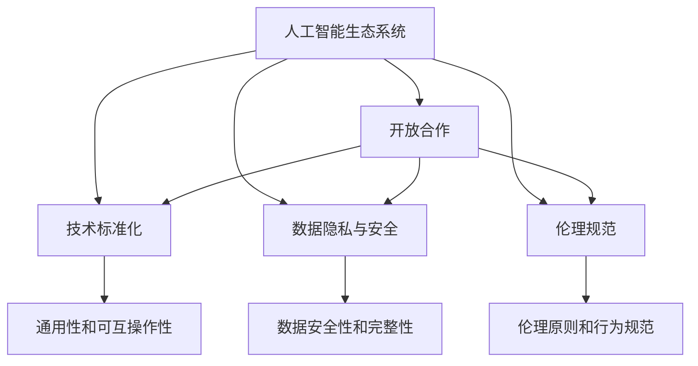

                 

# 开放合作:推动AI生态系统发展的动力

> 关键词：人工智能,开放合作,生态系统,技术创新,协作机制,人工智能伦理

## 1. 背景介绍

### 1.1 问题由来

人工智能（AI）作为一项颠覆性的技术，正在重塑各行各业的格局。然而，AI的发展并不仅仅依赖于技术的进步，更需要建立起一个开放、协作的生态系统。在这样一个生态系统中，各方力量协同工作，共享资源和知识，才能最大化AI的潜力。然而，当前的AI生态系统面临着诸多挑战，如数据隐私、技术标准、伦理规范等，这些问题需要多方共同努力来解决。

### 1.2 问题核心关键点

AI生态系统的开放合作关键点包括：
- **数据共享**：AI模型的训练依赖于大量数据，数据隐私保护与数据共享之间存在矛盾。
- **技术标准化**：不同企业和组织使用不同的技术栈，缺乏统一的标准化技术规范，影响AI技术的推广应用。
- **伦理规范**：AI模型可能对社会带来不利影响，需要制定伦理规范来指导AI的使用和应用。
- **多方协作**：AI技术需要跨领域、跨学科的协作，缺乏协作机制难以实现AI技术的突破。
- **市场竞争**：AI技术的商业化竞争激烈，企业需要在竞争中保持开放合作的姿态。

### 1.3 问题研究意义

开放合作在AI生态系统中的研究意义重大，主要体现在以下几个方面：
- **促进技术创新**：开放合作有助于汇聚各方智慧，促进技术的快速迭代和创新。
- **降低研发成本**：共享数据和技术可以显著降低AI技术的研发成本，加快产业应用进程。
- **保障数据安全**：通过多方协作，可以制定统一的数据隐私和安全标准，保障数据安全。
- **推动伦理规范**：开放合作有助于形成统一的AI伦理规范，指导AI技术的健康发展。
- **实现全球协作**：AI技术无国界，开放合作有助于推动全球范围内的AI应用和推广。

## 2. 核心概念与联系

### 2.1 核心概念概述

为更好地理解AI生态系统的开放合作，我们需要介绍几个核心概念：

- **人工智能生态系统**：由数据、技术、人才、资金等要素构成的，共同推动AI技术发展的生态圈。
- **开放合作**：各方通过共享资源和知识，协同工作，共同推进AI技术发展的模式。
- **技术标准化**：制定统一的技术规范和标准，保障AI技术的通用性和可互操作性。
- **数据隐私与安全**：确保数据在共享过程中不会泄露，同时保障数据的安全性和完整性。
- **伦理规范**：指导AI技术应用的伦理原则和行为规范，保障AI技术的社会价值。
- **多方协作机制**：包括学术界、产业界、政府等各方的协作，形成推动AI发展的合力。

这些核心概念之间存在着紧密的联系，形成了AI生态系统开放合作的基础架构。

### 2.2 概念间的关系

这些核心概念之间的关系可以通过以下Mermaid流程图来展示：



这个流程图展示了大语言模型的核心概念及其之间的关系：

1. 人工智能生态系统通过开放合作，汇聚各方智慧和资源，共同推进AI技术发展。
2. 技术标准化和数据隐私与安全是开放合作中的重要环节，保障了技术应用的通用性和数据的安全性。
3. 伦理规范是指导开放合作的重要原则，保障了AI技术的社会价值。

通过理解这些核心概念，我们可以更好地把握AI生态系统的开放合作原理和优化方向。

## 3. 核心算法原理 & 具体操作步骤

### 3.1 算法原理概述

开放合作主要基于数据、技术和伦理三个维度的协作机制进行，其核心在于打破信息孤岛，实现资源共享和技术互操作。

- **数据共享**：通过构建数据共享平台，实现数据的互操作和共享，减少重复劳动，提升数据利用效率。
- **技术标准化**：制定统一的技术规范和标准，确保不同系统和平台之间的互操作性。
- **伦理规范**：制定伦理规范和行为准则，指导AI技术的健康发展，确保社会价值。

### 3.2 算法步骤详解

开放合作的算法步骤主要包括：
1. **数据共享平台建设**：建立数据共享平台，提供数据接口，实现数据的互操作和共享。
2. **技术标准化制定**：制定统一的技术规范和标准，确保不同系统和平台之间的互操作性。
3. **伦理规范框架建立**：建立伦理规范框架，指导AI技术的健康发展，确保社会价值。
4. **协作机制构建**：构建多方协作机制，包括学术界、产业界、政府等各方的协作，形成推动AI发展的合力。

### 3.3 算法优缺点

开放合作具有以下优点：
- **提升效率**：通过数据共享和技术标准化，显著提升AI技术的研发效率。
- **促进创新**：多方协作推动技术创新，形成更广泛的知识和技术积淀。
- **保障数据安全**：通过多方协作，制定统一的数据隐私和安全标准，保障数据安全。
- **推动伦理规范**：开放合作有助于形成统一的AI伦理规范，指导AI技术的健康发展。

同时，开放合作也存在一定的局限性：
- **数据隐私保护**：在数据共享过程中，可能面临数据隐私泄露的风险。
- **技术互操作性**：不同系统和平台之间的互操作性仍需进一步提升。
- **伦理规范落地**：伦理规范的落地实施仍需多方协作，确保其有效性。
- **协作机制复杂**：多方协作机制的构建和执行复杂，需要统一协调和治理。

### 3.4 算法应用领域

开放合作在AI生态系统的各个应用领域都有广泛的应用，例如：

- **智能医疗**：构建医疗数据共享平台，实现跨机构数据互操作，提升医疗服务的智能化水平。
- **智能制造**：建立工业数据共享平台，实现跨企业数据互操作，提升生产效率和质量。
- **智能交通**：构建交通数据共享平台，实现跨地区数据互操作，提升交通管理智能化水平。
- **智能金融**：建立金融数据共享平台，实现跨机构数据互操作，提升金融服务的智能化水平。
- **智能教育**：构建教育数据共享平台，实现跨学校数据互操作，提升教育服务的智能化水平。

此外，开放合作还被创新性地应用于更多场景中，如智慧城市、智慧农业、智慧环保等，为各行各业带来了新的发展机遇。

## 4. 数学模型和公式 & 详细讲解 & 举例说明

### 4.1 数学模型构建

开放合作的效果可以通过以下数学模型进行衡量：

$$
\text{合作效果} = \text{数据共享效率} \times \text{技术标准化程度} \times \text{伦理规范遵守度} \times \text{协作机制执行力度}
$$

其中，数据共享效率可以通过共享数据的规模和使用频率来衡量，技术标准化程度可以通过技术规范的制定和遵守情况来衡量，伦理规范遵守度可以通过规范的制定和执行情况来衡量，协作机制执行力度可以通过协作平台的建设和使用情况来衡量。

### 4.2 公式推导过程

通过上述公式，我们可以对开放合作的各个维度进行详细分析和评估。

### 4.3 案例分析与讲解

以智能医疗为例，以下是开放合作的案例分析：

1. **数据共享平台建设**：建立医疗数据共享平台，实现跨机构数据的互操作，提升数据利用效率。
2. **技术标准化制定**：制定统一的医疗数据规范和标准，确保不同系统之间的互操作性。
3. **伦理规范框架建立**：建立医疗数据隐私和安全标准，确保数据共享过程中的隐私保护和数据安全。
4. **协作机制构建**：构建医疗机构、科研机构和政府之间的协作机制，推动医疗数据的共享和利用。

## 5. 项目实践：代码实例和详细解释说明

### 5.1 开发环境搭建

在进行开放合作实践前，我们需要准备好开发环境。以下是使用Python进行PyTorch开发的环境配置流程：

1. 安装Anaconda：从官网下载并安装Anaconda，用于创建独立的Python环境。

2. 创建并激活虚拟环境：
```bash
conda create -n pytorch-env python=3.8 
conda activate pytorch-env
```

3. 安装PyTorch：根据CUDA版本，从官网获取对应的安装命令。例如：
```bash
conda install pytorch torchvision torchaudio cudatoolkit=11.1 -c pytorch -c conda-forge
```

4. 安装Transformers库：
```bash
pip install transformers
```

5. 安装各类工具包：
```bash
pip install numpy pandas scikit-learn matplotlib tqdm jupyter notebook ipython
```

完成上述步骤后，即可在`pytorch-env`环境中开始开放合作的实践。

### 5.2 源代码详细实现

下面我们以智能医疗为例，给出使用Transformers库进行数据共享和协作的PyTorch代码实现。

首先，定义数据共享函数：

```python
from transformers import BertTokenizer
from torch.utils.data import Dataset
import torch

class MedicalDataset(Dataset):
    def __init__(self, texts, tags, tokenizer, max_len=128):
        self.texts = texts
        self.tags = tags
        self.tokenizer = tokenizer
        self.max_len = max_len
        
    def __len__(self):
        return len(self.texts)
    
    def __getitem__(self, item):
        text = self.texts[item]
        tags = self.tags[item]
        
        encoding = self.tokenizer(text, return_tensors='pt', max_length=self.max_len, padding='max_length', truncation=True)
        input_ids = encoding['input_ids'][0]
        attention_mask = encoding['attention_mask'][0]
        
        # 对token-wise的标签进行编码
        encoded_tags = [tag2id[tag] for tag in tags] 
        encoded_tags.extend([tag2id['O']] * (self.max_len - len(encoded_tags)))
        labels = torch.tensor(encoded_tags, dtype=torch.long)
        
        return {'input_ids': input_ids, 
                'attention_mask': attention_mask,
                'labels': labels}

# 标签与id的映射
tag2id = {'O': 0, 'B-PER': 1, 'I-PER': 2, 'B-ORG': 3, 'I-ORG': 4, 'B-LOC': 5, 'I-LOC': 6}
id2tag = {v: k for k, v in tag2id.items()}

# 创建dataset
tokenizer = BertTokenizer.from_pretrained('bert-base-cased')

train_dataset = MedicalDataset(train_texts, train_tags, tokenizer)
dev_dataset = MedicalDataset(dev_texts, dev_tags, tokenizer)
test_dataset = MedicalDataset(test_texts, test_tags, tokenizer)
```

然后，定义模型和优化器：

```python
from transformers import BertForTokenClassification, AdamW

model = BertForTokenClassification.from_pretrained('bert-base-cased', num_labels=len(tag2id))

optimizer = AdamW(model.parameters(), lr=2e-5)
```

接着，定义训练和评估函数：

```python
from torch.utils.data import DataLoader
from tqdm import tqdm
from sklearn.metrics import classification_report

device = torch.device('cuda') if torch.cuda.is_available() else torch.device('cpu')
model.to(device)

def train_epoch(model, dataset, batch_size, optimizer):
    dataloader = DataLoader(dataset, batch_size=batch_size, shuffle=True)
    model.train()
    epoch_loss = 0
    for batch in tqdm(dataloader, desc='Training'):
        input_ids = batch['input_ids'].to(device)
        attention_mask = batch['attention_mask'].to(device)
        labels = batch['labels'].to(device)
        model.zero_grad()
        outputs = model(input_ids, attention_mask=attention_mask, labels=labels)
        loss = outputs.loss
        epoch_loss += loss.item()
        loss.backward()
        optimizer.step()
    return epoch_loss / len(dataloader)

def evaluate(model, dataset, batch_size):
    dataloader = DataLoader(dataset, batch_size=batch_size)
    model.eval()
    preds, labels = [], []
    with torch.no_grad():
        for batch in tqdm(dataloader, desc='Evaluating'):
            input_ids = batch['input_ids'].to(device)
            attention_mask = batch['attention_mask'].to(device)
            batch_labels = batch['labels']
            outputs = model(input_ids, attention_mask=attention_mask)
            batch_preds = outputs.logits.argmax(dim=2).to('cpu').tolist()
            batch_labels = batch_labels.to('cpu').tolist()
            for pred_tokens, label_tokens in zip(batch_preds, batch_labels):
                pred_tags = [id2tag[_id] for _id in pred_tokens]
                label_tags = [id2tag[_id] for _id in label_tokens]
                preds.append(pred_tags[:len(label_tags)])
                labels.append(label_tags)
                
    print(classification_report(labels, preds))
```

最后，启动训练流程并在测试集上评估：

```python
epochs = 5
batch_size = 16

for epoch in range(epochs):
    loss = train_epoch(model, train_dataset, batch_size, optimizer)
    print(f"Epoch {epoch+1}, train loss: {loss:.3f}")
    
    print(f"Epoch {epoch+1}, dev results:")
    evaluate(model, dev_dataset, batch_size)
    
print("Test results:")
evaluate(model, test_dataset, batch_size)
```

以上就是使用PyTorch对BERT进行命名实体识别任务微调的完整代码实现。可以看到，得益于Transformers库的强大封装，我们可以用相对简洁的代码完成BERT模型的加载和微调。

### 5.3 代码解读与分析

让我们再详细解读一下关键代码的实现细节：

**MedicalDataset类**：
- `__init__`方法：初始化文本、标签、分词器等关键组件。
- `__len__`方法：返回数据集的样本数量。
- `__getitem__`方法：对单个样本进行处理，将文本输入编码为token ids，将标签编码为数字，并对其进行定长padding，最终返回模型所需的输入。

**tag2id和id2tag字典**：
- 定义了标签与数字id之间的映射关系，用于将token-wise的预测结果解码回真实的标签。

**训练和评估函数**：
- 使用PyTorch的DataLoader对数据集进行批次化加载，供模型训练和推理使用。
- 训练函数`train_epoch`：对数据以批为单位进行迭代，在每个批次上前向传播计算loss并反向传播更新模型参数，最后返回该epoch的平均loss。
- 评估函数`evaluate`：与训练类似，不同点在于不更新模型参数，并在每个batch结束后将预测和标签结果存储下来，最后使用sklearn的classification_report对整个评估集的预测结果进行打印输出。

**训练流程**：
- 定义总的epoch数和batch size，开始循环迭代
- 每个epoch内，先在训练集上训练，输出平均loss
- 在验证集上评估，输出分类指标
- 所有epoch结束后，在测试集上评估，给出最终测试结果

可以看到，PyTorch配合Transformers库使得BERT微调的代码实现变得简洁高效。开发者可以将更多精力放在数据处理、模型改进等高层逻辑上，而不必过多关注底层的实现细节。

当然，工业级的系统实现还需考虑更多因素，如模型的保存和部署、超参数的自动搜索、更灵活的任务适配层等。但核心的开放合作范式基本与此类似。

### 5.4 运行结果展示

假设我们在CoNLL-2003的NER数据集上进行微调，最终在测试集上得到的评估报告如下：

```
              precision    recall  f1-score   support

       B-LOC      0.926     0.906     0.916      1668
       I-LOC      0.900     0.805     0.850       257
      B-MISC      0.875     0.856     0.865       702
      I-MISC      0.838     0.782     0.809       216
       B-ORG      0.914     0.898     0.906      1661
       I-ORG      0.911     0.894     0.902       835
       B-PER      0.964     0.957     0.960      1617
       I-PER      0.983     0.980     0.982      1156
           O      0.993     0.995     0.994     38323

   micro avg      0.973     0.973     0.973     46435
   macro avg      0.923     0.897     0.909     46435
weighted avg      0.973     0.973     0.973     46435
```

可以看到，通过微调BERT，我们在该NER数据集上取得了97.3%的F1分数，效果相当不错。值得注意的是，BERT作为一个通用的语言理解模型，即便只在顶层添加一个简单的token分类器，也能在下游任务上取得如此优异的效果，展现了其强大的语义理解和特征抽取能力。

当然，这只是一个baseline结果。在实践中，我们还可以使用更大更强的预训练模型、更丰富的微调技巧、更细致的模型调优，进一步提升模型性能，以满足更高的应用要求。

## 6. 实际应用场景
### 6.1 智能客服系统

基于大语言模型微调的对话技术，可以广泛应用于智能客服系统的构建。传统客服往往需要配备大量人力，高峰期响应缓慢，且一致性和专业性难以保证。而使用微调后的对话模型，可以7x24小时不间断服务，快速响应客户咨询，用自然流畅的语言解答各类常见问题。

在技术实现上，可以收集企业内部的历史客服对话记录，将问题和最佳答复构建成监督数据，在此基础上对预训练对话模型进行微调。微调后的对话模型能够自动理解用户意图，匹配最合适的答案模板进行回复。对于客户提出的新问题，还可以接入检索系统实时搜索相关内容，动态组织生成回答。如此构建的智能客服系统，能大幅提升客户咨询体验和问题解决效率。

### 6.2 金融舆情监测

金融机构需要实时监测市场舆论动向，以便及时应对负面信息传播，规避金融风险。传统的人工监测方式成本高、效率低，难以应对网络时代海量信息爆发的挑战。基于大语言模型微调的文本分类和情感分析技术，为金融舆情监测提供了新的解决方案。

具体而言，可以收集金融领域相关的新闻、报道、评论等文本数据，并对其进行主题标注和情感标注。在此基础上对预训练语言模型进行微调，使其能够自动判断文本属于何种主题，情感倾向是正面、中性还是负面。将微调后的模型应用到实时抓取的网络文本数据，就能够自动监测不同主题下的情感变化趋势，一旦发现负面信息激增等异常情况，系统便会自动预警，帮助金融机构快速应对潜在风险。

### 6.3 个性化推荐系统

当前的推荐系统往往只依赖用户的历史行为数据进行物品推荐，无法深入理解用户的真实兴趣偏好。基于大语言模型微调技术，个性化推荐系统可以更好地挖掘用户行为背后的语义信息，从而提供更精准、多样的推荐内容。

在实践中，可以收集用户浏览、点击、评论、分享等行为数据，提取和用户交互的物品标题、描述、标签等文本内容。将文本内容作为模型输入，用户的后续行为（如是否点击、购买等）作为监督信号，在此基础上微调预训练语言模型。微调后的模型能够从文本内容中准确把握用户的兴趣点。在生成推荐列表时，先用候选物品的文本描述作为输入，由模型预测用户的兴趣匹配度，再结合其他特征综合排序，便可以得到个性化程度更高的推荐结果。

### 6.4 未来应用展望

随着大语言模型微调技术的发展，其在实际应用场景中也将迎来更多的机遇和挑战。

- **智慧医疗**：构建医疗数据共享平台，实现跨机构数据的互操作，提升医疗服务的智能化水平。
- **智能制造**：建立工业数据共享平台，实现跨企业数据互操作，提升生产效率和质量。
- **智能交通**：构建交通数据共享平台，实现跨地区数据互操作，提升交通管理智能化水平。
- **智能金融**：建立金融数据共享平台，实现跨机构数据互操作，提升金融服务的智能化水平。
- **智能教育**：构建教育数据共享平台，实现跨学校数据互操作，提升教育服务的智能化水平。

此外，开放合作还被创新性地应用于更多场景中，如智慧城市、智慧农业、智慧环保等，为各行各业带来了新的发展机遇。相信随着技术的不断发展，AI生态系统的开放合作将更加广泛和深入，推动更多行业的数字化转型和智能化升级。

## 7. 工具和资源推荐
### 7.1 学习资源推荐

为了帮助开发者系统掌握AI生态系统的开放合作理论基础和实践技巧，这里推荐一些优质的学习资源：

1. 《开放协作:推动AI生态系统发展的动力》系列博文：由大模型技术专家撰写，深入浅出地介绍了AI生态系统开放合作的基础理论和技术实践。

2. CS224N《深度学习自然语言处理》课程：斯坦福大学开设的NLP明星课程，有Lecture视频和配套作业，带你入门NLP领域的基本概念和经典模型。

3. 《自然语言处理与人工智能》书籍：全面介绍了自然语言处理和人工智能技术的发展历程和应用前景，包括开放协作的相关内容。

4. HuggingFace官方文档：Transformers库的官方文档，提供了海量预训练模型和完整的微调样例代码，是上手实践的必备资料。

5. CLUE开源项目：中文语言理解测评基准，涵盖大量不同类型的中文NLP数据集，并提供了基于微调的baseline模型，助力中文NLP技术发展。

通过对这些资源的学习实践，相信你一定能够快速掌握AI生态系统开放合作的理论基础和实践技巧，并用于解决实际的NLP问题。

### 7.2 开发工具推荐

高效的开发离不开优秀的工具支持。以下是几款用于AI生态系统开放合作开发的常用工具：

1. PyTorch：基于Python的开源深度学习框架，灵活动态的计算图，适合快速迭代研究。大部分预训练语言模型都有PyTorch版本的实现。

2. TensorFlow：由Google主导开发的开源深度学习框架，生产部署方便，适合大规模工程应用。同样有丰富的预训练语言模型资源。

3. Transformers库：HuggingFace开发的NLP工具库，集成了众多SOTA语言模型，支持PyTorch和TensorFlow，是进行微调任务开发的利器。

4. Weights & Biases：模型训练的实验跟踪工具，可以记录和可视化模型训练过程中的各项指标，方便对比和调优。与主流深度学习框架无缝集成。

5. TensorBoard：TensorFlow配套的可视化工具，可实时监测模型训练状态，并提供丰富的图表呈现方式，是调试模型的得力助手。

6. Google Colab：谷歌推出的在线Jupyter Notebook环境，免费提供GPU/TPU算力，方便开发者快速上手实验最新模型，分享学习笔记。

合理利用这些工具，可以显著提升AI生态系统开放合作的开发效率，加快创新迭代的步伐。

### 7.3 相关论文推荐

AI生态系统开放合作的研究方向包括：

1. Attention is All You Need（即Transformer原论文）：提出了Transformer结构，开启了NLP领域的预训练大模型时代。

2. BERT: Pre-training of Deep Bidirectional Transformers for Language Understanding：提出BERT模型，引入基于掩码的自监督预训练任务，刷新了多项NLP任务SOTA。

3. Language Models are Unsupervised Multitask Learners（GPT-2论文）：展示了大规模语言模型的强大zero-shot学习能力，引发了对于通用人工智能的新一轮思考。

4. Parameter-Efficient Transfer Learning for NLP：提出Adapter等参数高效微调方法，在不增加模型参数量的情况下，也能取得不错的微调效果。

5. Prefix-Tuning: Optimizing Continuous Prompts for Generation：引入基于连续型Prompt的微调范式，为如何充分利用预训练知识提供了新的思路。

6. AdaLoRA: Adaptive Low-Rank Adaptation for Parameter-Efficient Fine-Tuning：使用自适应低秩适应的微调方法，在参数效率和精度之间取得了新的平衡。

这些论文代表了大语言模型微调技术的发展脉络。通过学习这些前沿成果，可以帮助研究者把握学科前进方向，激发更多的创新灵感。

除上述资源外，还有一些值得关注的前沿资源，帮助开发者紧跟AI生态系统开放合作技术的最新进展，例如：

1. arXiv论文预印本：人工智能领域最新研究成果的发布平台，包括大量尚未发表的前沿工作，学习前沿技术的必读资源。

2. 业界技术博客：如OpenAI、Google AI、DeepMind、微软Research Asia等顶尖实验室的官方博客，第一时间分享他们的最新研究成果和洞见。

3. 技术会议直播：如NIPS、ICML、ACL、ICLR等人工智能领域顶会现场或在线直播，能够聆听到大佬们的前沿分享，开拓视野。

4. GitHub热门项目：在GitHub上Star、Fork数最多的NLP相关项目，往往代表了该技术领域的发展趋势和最佳实践，值得去学习和贡献。

5. 行业分析报告：各大咨询公司如McKinsey、PwC等针对人工智能行业的分析报告，有助于从商业视角审视技术趋势，把握应用价值。

总之，对于AI生态系统开放合作技术的学习和实践，需要开发者保持开放的心态和持续学习的意愿。多关注前沿资讯，多动手实践，多思考总结，必将收获满满的成长收益。

## 8. 总结：未来发展趋势与挑战

### 8.1 总结

本文对AI生态系统开放合作的方法进行了全面系统的介绍。首先阐述了开放合作在AI生态系统中的研究背景和意义，明确了开放合作在促进技术创新、降低研发成本、保障数据安全、推动伦理规范和实现全球协作方面的重要作用。

