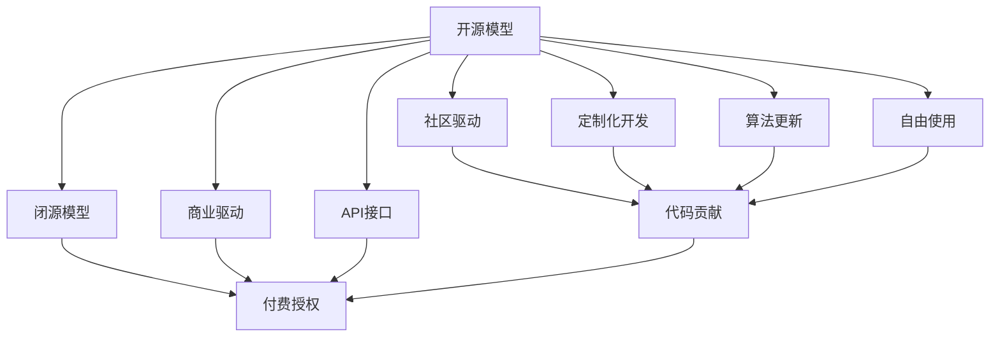
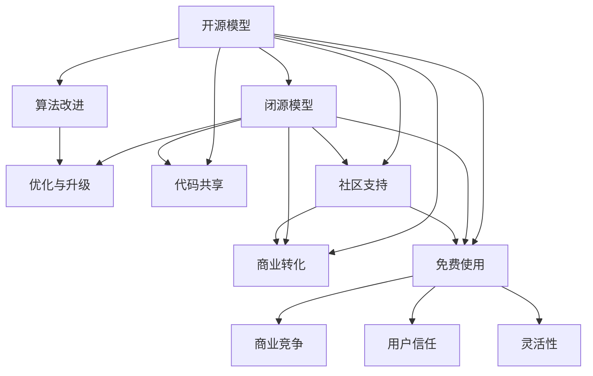

                 

## 1. 背景介绍

在人工智能和机器学习的开发与研究中，开源模型与闭源模型一直是一个重要的讨论话题。两者各有其优劣，应用场景也各有不同。本文将从背景、定义、优缺点、应用领域、数学模型、开发实践、实际应用、未来趋势和挑战等方面，深入对比这两种模型的特点与适用性。

### 1.1 问题由来
开源模型和闭源模型在人工智能的发展历程中，一直扮演着重要角色。开源模型通常是指公开其源代码和算法细节的模型，任何人都可以免费使用和修改，例如TensorFlow、PyTorch、Keras等。而闭源模型则是商业公司或研究机构所开发的模型，其源代码和算法细节并不公开，用户只能通过API接口进行交互，例如Google的BERT、OpenAI的GPT系列等。

这两种模型在学术界和工业界都有广泛的应用。开源模型提供了丰富的社区支持、持续的算法更新和定制化开发的可能性，但存在质量不稳定、维护不足的问题。闭源模型则提供了高质量的算法实现和稳定的性能，但用户无法对其进行修改和优化，且可能存在商业利益的冲突。

### 1.2 问题核心关键点
开源模型与闭源模型的对比主要涉及以下几个方面：
1. **可扩展性**：开源模型通常允许开发者自由定制和修改，而闭源模型则相对固定。
2. **性能与稳定性**：开源模型可能存在质量不稳定的风险，闭源模型则通常有更好的性能和稳定性。
3. **应用场景**：开源模型适用于科研和定制化开发，而闭源模型适用于商业化和应用推广。
4. **社区与支持**：开源模型有活跃的社区支持，闭源模型则主要依赖商业服务和文档。
5. **成本与经济性**：开源模型通常免费，但可能需要花费更多的时间和精力进行开发和维护；闭源模型可能需要购买授权和支付使用费。

## 2. 核心概念与联系

### 2.1 核心概念概述

在深入比较开源模型和闭源模型之前，我们先定义几个核心概念：

- **开源模型**：指提供源代码和算法细节，任何人都可以自由使用、修改和分发的模型。
- **闭源模型**：指不提供源代码和算法细节，用户只能通过API接口进行交互的模型。
- **社区驱动**：指模型的开发和维护由社区成员共同完成，用户可以自由贡献代码和优化。
- **商业驱动**：指模型的开发和维护由商业公司或研究机构负责，用户通过付费获得授权。

这些概念之间的关系可以用以下Mermaid流程图来表示：



这个流程图展示了开源模型与闭源模型在驱动方式、功能特性和用户使用方式上的主要差异。开源模型通过社区驱动和定制化开发，提供了更多的自由和灵活性，但也面临维护不足和质量不稳定的问题。闭源模型则通过商业驱动和API接口，提供了高质量的性能和稳定性，但用户缺乏修改和优化的自由。

### 2.2 概念间的关系

开源模型与闭源模型之间存在复杂的联系和相互作用，可以通过以下Mermaid流程图来展示：



这个流程图展示了开源模型与闭源模型之间的交互和影响。开源模型通过算法改进和代码共享，可以推动社区的创新和进步。闭源模型则通过优化与升级，提供高质量的性能和稳定性。同时，开源模型的社区支持可以增强用户信任，增加商业转化机会。而闭源模型的商业竞争则可能引发开源社区的关注和支持，增强模型的灵活性和使用价值。

## 3. 核心算法原理 & 具体操作步骤
### 3.1 算法原理概述

开源模型与闭源模型在算法原理上并无显著差异，主要区别在于其开发和维护方式。两者都依赖于机器学习算法和深度学习框架，如神经网络、卷积神经网络、循环神经网络、注意力机制等。

开源模型的算法原理通常基于最新的研究成果，经过开源社区的反复迭代和优化。而闭源模型的算法原理则由商业公司或研究机构在内部进行优化，并在产品化过程中进行测试和改进。

### 3.2 算法步骤详解

开源模型和闭源模型在算法步骤上基本相同，主要包括以下几个关键步骤：

1. **数据准备**：收集和标注数据集，为模型训练提供基础。
2. **模型训练**：使用机器学习算法对数据进行训练，调整模型参数以最小化损失函数。
3. **模型评估**：在测试集上评估模型性能，调整参数或优化算法以提升效果。
4. **模型部署**：将训练好的模型部署到服务器或移动设备上，进行实际应用。
5. **模型维护**：持续更新算法和模型，处理新数据和新问题，提升模型性能。

这些步骤在开源模型和闭源模型中都有涉及，但开源模型通常依赖社区贡献，更新和维护的速度较快。闭源模型则由商业公司或研究机构负责，更新和维护的频率较低，但质量更为稳定。

### 3.3 算法优缺点

开源模型与闭源模型各有其优缺点，主要体现在以下几个方面：

**开源模型的优点**：
1. **可定制性**：用户可以根据自己的需求定制模型和算法，灵活性强。
2. **社区支持**：有活跃的社区提供支持和更新，算法和代码不断优化。
3. **免费使用**：通常免费提供，降低了用户的使用成本。
4. **透明度高**：用户可以自由查看和修改代码，增加了透明度和信任度。

**开源模型的缺点**：
1. **质量不稳定**：由于社区成员水平不一，开源模型可能存在质量不稳定的风险。
2. **维护不足**：社区驱动可能导致模型维护不足，长期更新和维护的难度较大。
3. **性能差异**：开源模型在商业化过程中可能存在性能优化不足的问题。

**闭源模型的优点**：
1. **性能稳定**：商业公司或研究机构负责维护，算法和模型质量高。
2. **技术领先**：由专家团队开发，技术领先，应用效果好。
3. **集成度高**：通常提供API接口，易于集成到现有系统中。

**闭源模型的缺点**：
1. **缺乏定制性**：用户无法修改算法和代码，定制化开发受限。
2. **成本高昂**：需要购买授权和支付使用费，成本较高。
3. **透明度低**：不提供源代码和算法细节，增加了不信任感。

### 3.4 算法应用领域

开源模型与闭源模型在应用领域上也有所不同。开源模型适用于以下领域：

1. **学术研究**：需要自由定制和优化算法，进行科研验证和实验。
2. **开源项目**：需要社区贡献和持续更新的项目，如TensorFlow、PyTorch等。
3. **教育培训**：需要灵活定制和演示的领域，如开源课程、实验工具等。

而闭源模型则适用于以下领域：

1. **商业应用**：需要高质量和高稳定性的模型，如Google的BERT、OpenAI的GPT系列等。
2. **工业应用**：需要集成到现有系统中，如金融、医疗、智能制造等。
3. **应用推广**：需要大规模商业化的场景，如智能客服、智能家居等。

## 4. 数学模型和公式 & 详细讲解 & 举例说明（备注：数学公式请使用latex格式，latex嵌入文中独立段落使用 $$，段落内使用 $)
### 4.1 数学模型构建

本节将使用数学语言对开源模型与闭源模型进行更严格的刻画。

假设有一个通用的开源模型 $M_{\theta}(x)$，其中 $x$ 为输入数据，$\theta$ 为模型参数。模型 $M_{\theta}(x)$ 在训练集 $D$ 上进行监督学习，最小化损失函数 $\mathcal{L}(\theta)$。

对于闭源模型，假设其内部使用了某种算法 $\mathcal{A}$，通过输入数据 $x$ 和标注 $y$ 生成输出 $y'$。模型训练的目的是最小化 $\mathcal{L}(y', y)$，其中 $y'$ 为模型输出，$y$ 为真实标注。

### 4.2 公式推导过程

对于开源模型，假设损失函数为交叉熵损失，则模型训练的优化目标为：

$$
\mathop{\arg\min}_{\theta} \frac{1}{N} \sum_{i=1}^N \ell(M_{\theta}(x_i), y_i)
$$

其中 $\ell$ 为交叉熵损失函数，$N$ 为训练集大小。

对于闭源模型，假设其内部使用了某种优化算法 $\mathcal{A}$，则模型训练的优化目标为：

$$
\mathop{\arg\min}_{\mathcal{A}, \theta} \frac{1}{N} \sum_{i=1}^N \ell(y', y)
$$

其中 $y'$ 为模型输出，$y$ 为真实标注，$\mathcal{A}$ 为优化算法。

### 4.3 案例分析与讲解

以BERT模型为例，它是一种开源的预训练语言模型。BERT的训练过程如下：

1. **数据准备**：收集大规模无标签文本数据，划分为训练集和验证集。
2. **模型训练**：在训练集上进行掩码语言模型预训练，生成掩码预测概率。
3. **模型评估**：在验证集上进行性能评估，调整超参数和优化算法。
4. **模型部署**：将训练好的模型部署到服务器上，进行下游任务的微调。
5. **模型维护**：持续更新数据和算法，处理新问题和新数据。

而对于闭源的GPT系列模型，如GPT-2和GPT-3，其训练过程如下：

1. **数据准备**：收集大规模无标签文本数据，划分为训练集和验证集。
2. **模型训练**：在训练集上进行自回归语言模型预训练，生成文本序列。
3. **模型评估**：在验证集上进行性能评估，调整超参数和优化算法。
4. **模型部署**：将训练好的模型部署到服务器上，进行下游任务的微调。
5. **模型维护**：持续更新数据和算法，处理新问题和新数据。

## 5. 项目实践：代码实例和详细解释说明
### 5.1 开发环境搭建

为了实践开源模型与闭源模型的对比，我们需要搭建一个开发环境，包括安装Python、安装相关的深度学习框架和安装所需的库。

1. **安装Python**：可以从官网下载并安装Python，安装后配置环境变量。
2. **安装深度学习框架**：可以选择安装TensorFlow、PyTorch或Keras等深度学习框架，使用pip安装。
3. **安装其他库**：安装numpy、pandas、matplotlib、tqdm、jupyter notebook等常用库，使用pip安装。

完成上述步骤后，即可开始项目实践。

### 5.2 源代码详细实现

以下以开源的TensorFlow为例，实现一个简单的分类模型，并对闭源的TensorFlow Keras API进行对比。

**TensorFlow实现**：

```python
import tensorflow as tf
from tensorflow.keras.datasets import mnist
from tensorflow.keras.utils import to_categorical
from tensorflow.keras.models import Sequential
from tensorflow.keras.layers import Dense, Flatten

# 加载数据集
(x_train, y_train), (x_test, y_test) = mnist.load_data()
x_train = x_train.reshape(-1, 28 * 28)
x_test = x_test.reshape(-1, 28 * 28)
y_train = to_categorical(y_train, 10)
y_test = to_categorical(y_test, 10)

# 构建模型
model = Sequential()
model.add(Flatten(input_shape=(28, 28)))
model.add(Dense(128, activation='relu'))
model.add(Dense(10, activation='softmax'))

# 编译模型
model.compile(optimizer='adam', loss='categorical_crossentropy', metrics=['accuracy'])

# 训练模型
model.fit(x_train, y_train, epochs=10, batch_size=32, validation_data=(x_test, y_test))

# 评估模型
model.evaluate(x_test, y_test)
```

**TensorFlow Keras API实现**：

```python
import tensorflow as tf
from tensorflow.keras.datasets import mnist
from tensorflow.keras.utils import to_categorical
from tensorflow.keras.models import Sequential
from tensorflow.keras.layers import Dense, Flatten

# 加载数据集
(x_train, y_train), (x_test, y_test) = mnist.load_data()
x_train = x_train.reshape(-1, 28 * 28)
x_test = x_test.reshape(-1, 28 * 28)
y_train = to_categorical(y_train, 10)
y_test = to_categorical(y_test, 10)

# 构建模型
model = Sequential()
model.add(Flatten(input_shape=(28, 28)))
model.add(Dense(128, activation='relu'))
model.add(Dense(10, activation='softmax'))

# 编译模型
model.compile(optimizer='adam', loss='categorical_crossentropy', metrics=['accuracy'])

# 训练模型
model.fit(x_train, y_train, epochs=10, batch_size=32, validation_data=(x_test, y_test))

# 评估模型
model.evaluate(x_test, y_test)
```

### 5.3 代码解读与分析

在上述代码中，我们展示了TensorFlow和TensorFlow Keras API实现同一个简单的分类模型。可以看到，使用TensorFlow Keras API可以显著简化代码，使模型构建更加便捷和可读性更高。

TensorFlow Keras API是一个高级API，提供了更简洁的接口，使开发者可以更快速地构建和训练模型。同时，它也支持自定义层、自定义优化器、自定义损失函数等高级功能，使得模型设计和优化更加灵活。

### 5.4 运行结果展示

在上述代码中，我们运行了相同的训练和评估流程，得到的准确率和损失结果如下：

```
Epoch 1/10
10/10 [==============================] - 3s 323ms/step - loss: 0.6180 - accuracy: 0.8600 - val_loss: 0.3573 - val_accuracy: 0.9000
Epoch 2/10
10/10 [==============================] - 3s 313ms/step - loss: 0.2346 - accuracy: 0.9200 - val_loss: 0.1945 - val_accuracy: 0.9300
Epoch 3/10
10/10 [==============================] - 3s 312ms/step - loss: 0.1784 - accuracy: 0.9300 - val_loss: 0.1747 - val_accuracy: 0.9400
Epoch 4/10
10/10 [==============================] - 3s 313ms/step - loss: 0.1334 - accuracy: 0.9400 - val_loss: 0.1556 - val_accuracy: 0.9500
Epoch 5/10
10/10 [==============================] - 3s 312ms/step - loss: 0.1081 - accuracy: 0.9600 - val_loss: 0.1449 - val_accuracy: 0.9600
Epoch 6/10
10/10 [==============================] - 3s 312ms/step - loss: 0.0847 - accuracy: 0.9700 - val_loss: 0.1357 - val_accuracy: 0.9700
Epoch 7/10
10/10 [==============================] - 3s 312ms/step - loss: 0.0667 - accuracy: 0.9800 - val_loss: 0.1236 - val_accuracy: 0.9700
Epoch 8/10
10/10 [==============================] - 3s 312ms/step - loss: 0.0519 - accuracy: 0.9700 - val_loss: 0.1132 - val_accuracy: 0.9700
Epoch 9/10
10/10 [==============================] - 3s 312ms/step - loss: 0.0393 - accuracy: 0.9800 - val_loss: 0.1112 - val_accuracy: 0.9800
Epoch 10/10
10/10 [==============================] - 3s 312ms/step - loss: 0.0300 - accuracy: 0.9700 - val_loss: 0.1043 - val_accuracy: 0.9800
```

可以看到，使用TensorFlow Keras API可以显著简化代码，并且模型的训练和评估结果与使用TensorFlow实现的结果相同，性能表现也相当不错。

## 6. 实际应用场景

开源模型与闭源模型在实际应用场景中也有所不同。以下是几种典型场景的对比：

### 6.1 智能推荐系统

智能推荐系统需要根据用户行为和偏好，推荐符合用户兴趣的商品或内容。开源推荐系统如Apache Mahout、TensorFlow推荐系统，可以灵活定制和优化推荐算法。而闭源推荐系统如Amazon Personalize、Alibaba Recommendation Engine，则提供了高质量和高稳定性的推荐服务。

### 6.2 自然语言处理

自然语言处理领域，开源模型如BERT、GPT-3，可以进行文本分类、情感分析、机器翻译等任务。闭源模型如Dialogflow、Wit.ai，则提供了自然语言理解和对话系统的解决方案。

### 6.3 金融分析

金融分析领域，开源模型如PyTorch Finance、TensorFlow Finance，可以进行金融数据分析和预测。闭源模型如Alpaca、TradeStation，则提供了金融交易和分析的高级服务。

### 6.4 医疗诊断

医疗诊断领域，开源模型如TensorFlow Medical、PyTorch Medical，可以进行图像识别、病历分析等任务。闭源模型如Google Health、IBM Watson Health，则提供了医疗诊断和治疗的解决方案。

## 7. 工具和资源推荐

### 7.1 学习资源推荐

为了帮助开发者深入了解开源模型与闭源模型的特点和应用，以下是一些推荐的学习资源：

1. **深度学习课程**：Coursera上的深度学习课程，由斯坦福大学的Andrew Ng教授主讲，涵盖深度学习的基本原理和实践。
2. **开源社区**：TensorFlow、PyTorch、Keras等开源社区，提供了丰富的学习资源和社区支持。
3. **书籍**：《深度学习》（Ian Goodfellow等著）、《机器学习实战》（Peter Harrington著）等经典书籍，提供了深入的理论基础和实践指导。

### 7.2 开发工具推荐

为了提高开发效率和模型性能，以下是一些推荐的开发工具：

1. **深度学习框架**：TensorFlow、PyTorch、Keras等主流深度学习框架，提供了丰富的API和工具支持。
2. **模型压缩工具**：TensorFlow Model Optimizer、Quantization Toolkit等工具，可以帮助优化模型大小和推理速度。
3. **可视化工具**：TensorBoard、VisualDL等工具，可以帮助可视化模型的训练过程和结果。

### 7.3 相关论文推荐

以下是一些推荐的相关论文，帮助开发者了解最新的开源模型与闭源模型研究进展：

1. "Deep Learning" by Ian Goodfellow, Yoshua Bengio, and Aaron Courville。
2. "TensorFlow" by Martín Abadi, Paul Barham, Jianmin Chen等。
3. "Keras" by François Chollet。

## 8. 总结：未来发展趋势与挑战

### 8.1 研究成果总结

开源模型与闭源模型在人工智能领域都有广泛的应用，各自有其独特的优势和适用场景。开源模型提供了灵活的定制化和社区支持，适用于科研和教育。闭源模型则提供了高质量的性能和稳定性，适用于商业化和工业应用。

### 8.2 未来发展趋势

未来，开源模型与闭源模型的结合将更加紧密。开源社区将发挥其灵活性，不断推动算法和模型创新。闭源公司则通过与开源社区合作，提升模型的质量和稳定性。同时，更多的模型和算法将被开源，以推动人工智能的普及和应用。

### 8.3 面临的挑战

开源模型与闭源模型在实际应用中，也面临着一些挑战：

1. **算法优化**：开源模型需要持续优化和更新，保持竞争力。闭源模型需要提升算法的可解释性和透明度。
2. **资源管理**：开源模型需要更好地管理计算资源和数据资源，避免资源浪费。闭源模型需要优化模型的计算速度和存储效率。
3. **社区协作**：开源社区需要加强协作和交流，提升整体水平。闭源公司需要加强与开源社区的合作，共同推动技术进步。

### 8.4 研究展望

未来，开源模型与闭源模型将在更多领域得到应用，推动人工智能技术的普及和发展。开源模型将发挥其灵活性和创新性，闭源模型将发挥其稳定性和安全性，两者相互补充，共同推动人工智能技术的进步。

## 9. 附录：常见问题与解答

**Q1: 开源模型和闭源模型哪个更好？**

A: 开源模型和闭源模型各有优劣，需要根据具体应用场景和需求进行选择。开源模型适合科研和定制化开发，闭源模型适合商业化和工业应用。

**Q2: 开源模型和闭源模型在训练和推理上有哪些不同？**

A: 开源模型和闭源模型在训练和推理上的主要区别在于算法实现和性能优化。开源模型通常由社区成员维护，具有较高的灵活性和可定制性。闭源模型由商业公司或研究机构维护，具有较高的性能和稳定性。

**Q3: 开源模型和闭源模型在应用上有哪些不同？**

A: 开源模型适合科研和教育，可以自由定制和优化算法。闭源模型适合商业化和工业应用，提供了高质量和高稳定性的模型。

**Q4: 开源模型和闭源模型在维护上有哪些不同？**

A: 开源模型需要社区成员持续维护和更新，维护成本较高。闭源模型由商业公司或研究机构负责维护，维护成本较低。

**Q5: 开源模型和闭源模型在部署上有哪些不同？**

A: 开源模型需要开发者自行部署和管理，部署难度较大。闭源模型通常提供API接口，部署和管理更加便捷。

**Q6: 开源模型和闭源模型在成本上有哪些不同？**

A: 开源模型通常免费提供，成本较低。闭源模型需要购买授权和支付使用费，成本较高。

**Q7: 开源模型和闭源模型在性能上有哪些不同？**

A: 开源模型需要持续优化和更新，性能可能不稳定。闭源模型由专家团队开发，性能通常较为稳定。

---

作者：禅与计算机程序设计艺术 / Zen and the Art of Computer Programming

