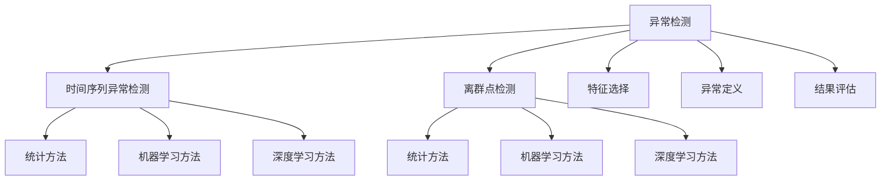
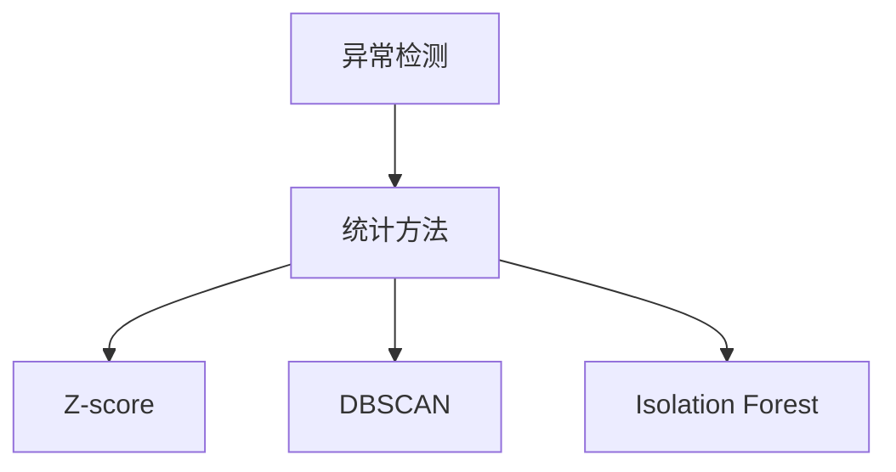

                 

# 异常检测(Anomaly Detection) - 原理与代码实例讲解

> 关键词：异常检测, 时间序列, 离群点检测, 机器学习, 深度学习, 无监督学习, 数据挖掘

## 1. 背景介绍

### 1.1 问题由来
在现代信息化社会中，数据已经成为不可或缺的重要资源，涉及金融、医疗、交通、网络安全等众多领域。然而，在数据生成和传输过程中，难免会出现异常或离群数据。例如，银行交易数据中可能存在欺诈行为，医疗数据中可能存在误诊病例，网络数据中可能存在恶意攻击等。异常检测(Anomaly Detection)作为一种重要的数据挖掘技术，能够帮助识别和处理异常数据，预防潜在的风险和威胁，保障数据安全和系统的稳定运行。

异常检测是一种无监督学习任务，其目的是识别并隔离数据集中的异常或离群点，即不同于正常数据点的样本。这些异常点可能包含错误、噪声、异常行为或有害信息，及时发现并处理异常数据对于保障数据质量和系统安全具有重要意义。异常检测技术已经广泛应用于网络安全、金融风险管理、医疗健康监测等领域。

### 1.2 问题核心关键点
异常检测的核心在于如何定义和识别异常点，以及如何处理异常点以减少其影响。具体来说，异常检测涉及以下几个关键点：

- **异常定义**：首先需要明确异常数据的定义，即什么样的数据被认为是异常的。例如，数值异常可能指偏离正常范围的数值，时间序列异常可能指偏离正常时间点的数据点。
- **特征选择**：需要选取合适的特征描述数据点，通常包括数值特征、时间特征、文本特征等。特征选择的好坏直接影响到异常检测的性能。
- **算法选择**：根据数据特点和应用需求选择合适的异常检测算法。常见的算法包括基于统计的方法、基于机器学习的方法和基于深度学习的方法。
- **结果评估**：需要定义合适的评估指标，如准确率、召回率、F1分数等，以衡量异常检测算法的性能。
- **应用实现**：将异常检测算法应用到实际场景中，结合业务需求进行优化和调参，以达到最佳效果。

### 1.3 问题研究意义
异常检测技术对于保障数据安全和系统稳定运行具有重要意义。具体来说：

- **数据质量提升**：异常检测能够识别和纠正数据中的错误和噪声，提高数据的质量和可靠性。
- **风险管理**：异常检测可以识别潜在的风险和威胁，如网络攻击、金融欺诈等，从而及时采取防范措施。
- **性能优化**：异常检测可以帮助优化系统性能，如在网络中检测到异常流量，及时进行处理，保障网络安全。
- **运营效率**：异常检测能够帮助识别异常业务操作，提高系统运营效率，减少资源浪费。
- **决策支持**：异常检测可以辅助决策，如在医疗领域检测异常病历，帮助医生快速做出诊断决策。

异常检测技术已经成为保障数据安全和提升系统运营效率的重要手段，其应用前景广阔。

## 2. 核心概念与联系

### 2.1 核心概念概述

为了更好地理解异常检测的原理和应用，本节将介绍几个密切相关的核心概念：

- **异常检测(Anomaly Detection)**：指识别并隔离数据集中的异常或离群点的过程。异常检测主要分为基于统计的方法、基于机器学习的方法和基于深度学习的方法。
- **离群点检测(Outlier Detection)**：与异常检测类似，指识别并隔离数据集中的离群点。离群点可能包含错误、噪声或异常行为，与正常数据点有显著区别。
- **时间序列异常检测(Time Series Anomaly Detection)**：指在时间序列数据中识别异常点，如股票价格波动、网络流量变化等。时间序列异常检测需要考虑时间特征，通常使用滑动窗口或递归方法。
- **机器学习(ML)**：一种利用数据驱动的方法，通过训练模型来预测或分类数据。机器学习在异常检测中主要用于特征工程和模型选择。
- **深度学习(Deep Learning)**：一种基于多层神经网络的结构，能够处理大规模非结构化数据。深度学习在异常检测中主要用于复杂特征的提取和建模。
- **无监督学习(Unsupervised Learning)**：一种不需要标签数据的学习方法，主要用于探索数据的潜在模式和结构。异常检测作为一种无监督学习任务，能够识别并隔离异常数据点。

这些核心概念之间的逻辑关系可以通过以下Mermaid流程图来展示：



这个流程图展示了异常检测的核心概念及其之间的关系：

1. 异常检测可以细分为时间序列异常检测和离群点检测，后者更侧重于识别显著不同的数据点。
2. 异常检测可以采用统计方法、机器学习方法或深度学习方法进行。
3. 特征选择和异常定义是异常检测的基础，直接影响到算法的性能。
4. 结果评估是衡量算法性能的关键，常用的指标包括准确率、召回率、F1分数等。

### 2.2 概念间的关系

这些核心概念之间存在着紧密的联系，形成了异常检测的完整生态系统。下面我们通过几个Mermaid流程图来展示这些概念之间的关系。

#### 2.2.1 异常检测的统计方法



这个流程图展示了异常检测的统计方法，包括Z-score、DBSCAN和Isolation Forest等。这些方法基于统计学原理，不需要标注数据，适用于大规模数据集。

#### 2.2.2 异常检测的机器学习方法

```mermaid
graph LR
    A[异常检测] --> B[机器学习方法]
    B --> C[支持向量机(SVM)]
    B --> D[随机森林(Random Forest)]
    B --> E[神经网络(ANN)]
```

这个流程图展示了异常检测的机器学习方法，包括SVM、随机森林和神经网络等。这些方法需要标注数据，能够处理复杂特征和结构。

#### 2.2.3 异常检测的深度学习方法

```mermaid
graph TB
    A[异常检测] --> B[深度学习方法]
    B --> C[自编码器(AE)]
    B --> D[生成对抗网络(GAN)]
    B --> E[变分自编码器(VAE)]
```

这个流程图展示了异常检测的深度学习方法，包括自编码器、GAN和VAE等。这些方法能够处理大规模非结构化数据，具有较高的精度和鲁棒性。

#### 2.2.4 异常检测的结果评估

```mermaid
graph LR
    A[异常检测] --> B[结果评估]
    B --> C[准确率(Accuracy)]
    B --> D[召回率(Recall)]
    B --> E[F1分数(F1 Score)]
```

这个流程图展示了异常检测的结果评估方法，包括准确率、召回率和F1分数等。这些指标能够综合评估算法的性能。

### 2.3 核心概念的整体架构

最后，我们用一个综合的流程图来展示这些核心概念在异常检测中的应用：

```mermaid
graph TB
    A[大规模数据] --> B[特征选择]
    A --> C[异常定义]
    B --> D[统计方法]
    B --> E[机器学习方法]
    B --> F[深度学习方法]
    C --> G[离群点检测]
    C --> H[时间序列异常检测]
    D --> I[Z-score]
    D --> J[DBSCAN]
    D --> K[Isolation Forest]
    E --> L[支持向量机(SVM)]
    E --> M[随机森林(Random Forest)]
    E --> N[神经网络(ANN)]
    F --> O[自编码器(AE)]
    F --> P[生成对抗网络(GAN)]
    F --> Q[变分自编码器(VAE)]
    G --> R[统计方法]
    G --> S[机器学习方法]
    G --> T[深度学习方法]
    H --> U[统计方法]
    H --> V[机器学习方法]
    H --> W[深度学习方法]
    A --> X[结果评估]
    X --> Y[准确率(Accuracy)]
    X --> Z[召回率(Recall)]
    X --> $[F1分数(F1 Score)]$
```

这个综合流程图展示了从数据预处理到结果评估的完整异常检测流程。大规模数据经过特征选择后，使用统计方法、机器学习方法或深度学习方法进行异常检测，得到异常检测结果。最后，使用结果评估方法综合评估算法的性能。

## 3. 核心算法原理 & 具体操作步骤
### 3.1 算法原理概述

异常检测算法主要分为统计方法、机器学习方法和深度学习方法。以下是这三种方法的简要概述：

#### 3.1.1 统计方法
统计方法基于数据的分布特征进行异常检测。常见的统计方法包括：

- **Z-score**：计算数据点与均值的标准差，将超出3σ的数据点视为异常。
- **DBSCAN**：基于密度的聚类算法，将密度小于阈值的数据点视为异常。
- **Isolation Forest**：通过随机森林的方式，将数据点隔离到单个子树中，将深度较大的数据点视为异常。

#### 3.1.2 机器学习方法
机器学习方法使用标注数据训练模型，预测新数据是否为异常。常见的机器学习方法包括：

- **支持向量机(SVM)**：通过构建超平面进行分类，将异常点与正常点分开。
- **随机森林(Random Forest)**：通过集成多个决策树，进行异常检测。
- **神经网络(ANN)**：使用多层神经网络，对数据进行分类和回归。

#### 3.1.3 深度学习方法
深度学习方法使用神经网络对数据进行建模，识别异常点。常见的深度学习方法包括：

- **自编码器(AE)**：通过重构误差进行异常检测，异常点难以被重构。
- **生成对抗网络(GAN)**：通过生成器和判别器的对抗训练，识别异常点。
- **变分自编码器(VAE)**：通过生成潜在变量进行异常检测，异常点难以生成。

这些算法的基本原理是通过统计学、机器学习和深度学习的不同方式，对数据进行建模和分析，从而识别异常点。

### 3.2 算法步骤详解

#### 3.2.1 时间序列异常检测

时间序列异常检测需要考虑时间特征，通常使用滑动窗口或递归方法。以下是时间序列异常检测的基本步骤：

1. **数据预处理**：将时间序列数据转换为数值型特征，并进行归一化处理。
2. **滑动窗口或递归方法**：使用滑动窗口或递归方法，将时间序列数据划分为多个时间片段。
3. **异常检测算法**：使用统计方法、机器学习方法或深度学习方法进行异常检测，识别异常点。
4. **结果可视化**：将异常点可视化，并进行分析，确定异常的特征和原因。

#### 3.2.2 机器学习异常检测

机器学习异常检测需要使用标注数据进行训练。以下是机器学习异常检测的基本步骤：

1. **数据预处理**：将数据转换为特征向量，并进行归一化处理。
2. **模型选择**：选择合适的异常检测算法，如SVM、随机森林、神经网络等。
3. **模型训练**：使用标注数据训练模型，并进行交叉验证，调整超参数。
4. **模型评估**：使用测试数据集评估模型性能，计算准确率、召回率和F1分数等指标。
5. **结果应用**：将训练好的模型应用于实际场景，进行异常检测和处理。

#### 3.2.3 深度学习异常检测

深度学习异常检测需要使用深度神经网络对数据进行建模。以下是深度学习异常检测的基本步骤：

1. **数据预处理**：将数据转换为特征向量，并进行归一化处理。
2. **模型选择**：选择合适的异常检测算法，如自编码器、GAN、VAE等。
3. **模型训练**：使用标注数据训练模型，并进行交叉验证，调整超参数。
4. **模型评估**：使用测试数据集评估模型性能，计算准确率、召回率和F1分数等指标。
5. **结果应用**：将训练好的模型应用于实际场景，进行异常检测和处理。

### 3.3 算法优缺点

#### 3.3.1 统计方法

**优点**：

- 简单易用，不需要标注数据。
- 能够处理大规模数据集，计算复杂度较低。
- 适用于分布明显的数据集，能够识别出明显异常的数据点。

**缺点**：

- 对于非分布明显的数据集，效果较差。
- 对于多维数据的处理较为困难。
- 需要手动确定阈值，参数设置较为复杂。

#### 3.3.2 机器学习方法

**优点**：

- 精度较高，适用于复杂数据集。
- 能够处理高维数据，效果较好。
- 可以通过交叉验证调整超参数，提高模型性能。

**缺点**：

- 需要大量标注数据，训练和计算成本较高。
- 模型较为复杂，调参难度较大。
- 对于新数据集的效果较为不稳定。

#### 3.3.3 深度学习方法

**优点**：

- 精度较高，适用于复杂非结构化数据。
- 能够处理大规模数据集，效果较好。
- 可以通过深度学习框架进行快速开发和训练。

**缺点**：

- 需要大量标注数据，训练和计算成本较高。
- 模型较为复杂，调参难度较大。
- 对于新数据集的效果较为不稳定。

### 3.4 算法应用领域

异常检测算法已经广泛应用于多个领域，包括但不限于：

- **金融风险管理**：通过异常检测识别交易中的欺诈行为，保障资金安全。
- **网络安全**：通过异常检测识别网络中的恶意流量，保障网络安全。
- **医疗健康监测**：通过异常检测识别异常病历，帮助医生快速做出诊断决策。
- **制造业质量控制**：通过异常检测识别生产中的异常数据，保障产品质量。
- **交通流量监测**：通过异常检测识别交通中的异常事件，保障交通安全。

这些领域中，异常检测技术的广泛应用已经展示了其在保障系统稳定和提升数据质量方面的巨大潜力。

## 4. 数学模型和公式 & 详细讲解 & 举例说明

### 4.1 数学模型构建

#### 4.1.1 时间序列异常检测

时间序列异常检测需要考虑时间特征，通常使用滑动窗口或递归方法。以下是时间序列异常检测的数学模型构建：

1. **滑动窗口方法**：

   假设时间序列数据为 $X_t$，其中 $t$ 表示时间，$t \in [1, T]$，$T$ 为时间序列长度。将时间序列数据划分为多个时间片段，每个片段长度为 $k$，即 $k$ 个时间点。对于每个时间片段 $X_t, X_{t+1}, \ldots, X_{t+k-1}$，可以定义滑动窗口的平均值为 $\bar{X}_t$，标准差为 $\sigma_t$。异常检测的数学模型可以表示为：

   $$
   \text{Anomaly}(X_t) = \begin{cases}
   1, & \text{if} \; |X_t - \bar{X}_t| > c \times \sigma_t \\
   0, & \text{otherwise}
   \end{cases}
   $$

   其中 $c$ 为阈值，通常取 $3$ 或 $5$。

2. **递归方法**：

   对于时间序列数据 $X_t$，可以定义递归的异常检测模型：

   $$
   \text{Anomaly}(X_t) = \begin{cases}
   1, & \text{if} \; X_t \geq R(X_{t-1}) + d \\
   0, & \text{otherwise}
   \end{cases}
   $$

   其中 $R(X_{t-1})$ 表示前一个时间点的异常概率，$d$ 为阈值，通常取 $0.5$ 或 $1$。

#### 4.1.2 机器学习异常检测

机器学习异常检测需要使用标注数据进行训练。以下是机器学习异常检测的数学模型构建：

假设异常检测任务为二分类问题，正常数据点为 $x_1, x_2, \ldots, x_n$，异常数据点为 $x_{n+1}, x_{n+2}, \ldots, x_{n+m}$。训练数据集为 $\{(x_i, y_i)\}_{i=1}^{n+m}$，其中 $y_i \in \{0, 1\}$，$y_i = 1$ 表示 $x_i$ 为异常数据点，$y_i = 0$ 表示 $x_i$ 为正常数据点。

使用随机森林进行异常检测时，可以定义异常检测模型为：

$$
\text{Anomaly}(x) = \begin{cases}
1, & \text{if} \; \sum_{i=1}^{n+m} w_i \times F(x, T_i) > \theta \\
0, & \text{otherwise}
\end{cases}
$$

其中 $w_i$ 为样本权重，$F(x, T_i)$ 为随机森林中第 $i$ 棵树的异常概率，$\theta$ 为阈值。

#### 4.1.3 深度学习异常检测

深度学习异常检测需要使用深度神经网络对数据进行建模。以下是深度学习异常检测的数学模型构建：

假设异常检测任务为二分类问题，输入为 $x$，输出为 $y$，其中 $y \in \{0, 1\}$，$y = 1$ 表示 $x$ 为异常数据点，$y = 0$ 表示 $x$ 为正常数据点。

使用自编码器进行异常检测时，可以定义异常检测模型为：

$$
\text{Anomaly}(x) = \begin{cases}
1, & \text{if} \; |\hat{x} - x| > \tau \\
0, & \text{otherwise}
\end{cases}
$$

其中 $\hat{x}$ 为重构后的数据点，$\tau$ 为阈值。

### 4.2 公式推导过程

#### 4.2.1 时间序列异常检测

对于时间序列数据 $X_t$，可以使用滑动窗口或递归方法进行异常检测。以下是滑动窗口方法的公式推导：

1. **滑动窗口方法**：

   假设时间序列数据为 $X_t$，其中 $t$ 表示时间，$t \in [1, T]$，$T$ 为时间序列长度。将时间序列数据划分为多个时间片段，每个片段长度为 $k$，即 $k$ 个时间点。对于每个时间片段 $X_t, X_{t+1}, \ldots, X_{t+k-1}$，可以定义滑动窗口的平均值为 $\bar{X}_t$，标准差为 $\sigma_t$。异常检测的公式可以表示为：

   $$
   \text{Anomaly}(X_t) = \begin{cases}
   1, & \text{if} \; |X_t - \bar{X}_t| > c \times \sigma_t \\
   0, & \text{otherwise}
   \end{cases}
   $$

   其中 $c$ 为阈值，通常取 $3$ 或 $5$。

2. **递归方法**：

   对于时间序列数据 $X_t$，可以定义递归的异常检测模型：

   $$
   \text{Anomaly}(X_t) = \begin{cases}
   1, & \text{if} \; X_t \geq R(X_{t-1}) + d \\
   0, & \text{otherwise}
   \end{cases}
   $$

   其中 $R(X_{t-1})$ 表示前一个时间点的异常概率，$d$ 为阈值，通常取 $0.5$ 或 $1$。

#### 4.2.2 机器学习异常检测

机器学习异常检测需要使用标注数据进行训练。以下是机器学习异常检测的公式推导：

假设异常检测任务为二分类问题，正常数据点为 $x_1, x_2, \ldots, x_n$，异常数据点为 $x_{n+1}, x_{n+2}, \ldots, x_{n+m}$。训练数据集为 $\{(x_i, y_i)\}_{i=1}^{n+m}$，其中 $y_i \in \{0, 1\}$，$y_i = 1$ 表示 $x_i$ 为异常数据点，$y_i = 0$ 表示 $x_i$ 为正常数据点。

使用随机森林进行异常检测时，可以定义异常检测模型为：

$$
\text{Anomaly}(x) = \begin{cases}
1, & \text{if} \; \sum_{i=1}^{n+m} w_i \times F(x, T_i) > \theta \\
0, & \text{otherwise}
\end{cases}
$$

其中 $w_i$ 为样本权重，$F(x, T_i)$ 为随机森林中第 $i$ 棵树的异常概率，$\theta$ 为阈值。

#### 4.2.3 深度学习异常检测

深度学习异常检测需要使用深度神经网络对数据进行建模。以下是深度学习异常检测的公式推导：

假设异常检测任务为二分类问题，输入为 $x$，输出为 $y$，其中 $y \in \{0, 1\}$，$y = 1$ 表示 $x$ 为异常数据点，$y = 0$ 表示 $x$ 为正常数据点。

使用自编码器进行异常检测时，可以定义异常检测模型为：

$$
\text{Anomaly}(x) = \begin{cases}
1, & \text{if} \; |\hat{x} - x| > \tau \\
0, & \text{otherwise}
\end{cases}
$$

其中 $\hat{x}$ 为重构后的数据点，$\tau$ 为阈值。

### 4.3 案例分析与讲解

#### 4.3.1 时间序列异常检测案例

假设有一个股票价格时间序列数据，记录了某公司的股票价格变化。使用滑动窗口方法进行异常检测，可以将其划分为多个时间片段，每个片段长度为 $k$。假设 $k=30$，即每个时间片段包含30个时间点。

对于每个时间片段 $X_t, X_{t+1}, \ldots, X_{t+29}$，可以定义滑动窗口的平均值为 $\bar{X}_t$，标准差为 $\sigma_t$。异常检测的公式可以表示为：

$$
\text{Anomaly}(X_t) = \begin{cases}
1, & \text{if} \; |X_t - \bar{X}_t| > c \times \sigma_t \\
0, & \text{otherwise}
\end{cases}
$$

其中 $c$ 为阈值，通常取 $3$ 或 $5$。

#### 4.3.2 机器学习异常检测案例

假设有一个异常检测任务，包含100个正常数据点和50个异常数据点。使用随机森林进行异常检测，可以定义异常检测模型为：

$$
\text{Anomaly}(x) = \begin{cases}
1, & \text{if} \; \sum_{i=1}^{150} w_i \times F(x, T_i) > \theta \\
0, & \text{otherwise}
\end{cases}
$$

其中 $w_i$ 为样本权重，$F(x, T_i)$ 为随机森林中第 $i$ 棵树的异常概率，$\theta$ 为阈值。

#### 4.3.3 深度学习异常检测案例

假设有一个异常检测任务，输入为 $x$，输出为 $y$，其中 $y \in \{0, 1\}$，$y = 1$ 表示 $x$ 为异常数据点，$y = 0$ 表示 $x$ 为正常数据点。使用自编码器进行异常检测时，可以定义异常检测模型为：

$$
\text{Anomaly}(x) = \begin{cases}
1, & \text{if} \; |\hat{x} - x| > \tau \\
0, & \text{otherwise}
\end{cases}
$$

其中 $\hat{x}$ 为重构后的数据点，$\tau$ 为阈值。

## 5. 项目实践：代码实例和详细解释说明

### 5.1 开发环境搭建

在进行异常检测实践前，我们需要准备好开发环境。以下是使用Python进行Scikit-learn开发的环境配置流程：

1. 安装Anaconda：从官网下载并安装Anaconda，用于创建独立的Python环境。

2. 创建并激活虚拟环境：
```bash
conda create -n sklearn-env python=3.8 
conda activate sklearn-env
```

3. 安装Scikit-learn：
```bash
conda install scikit-learn
```

4. 安装相关工具包：
```bash
pip install

