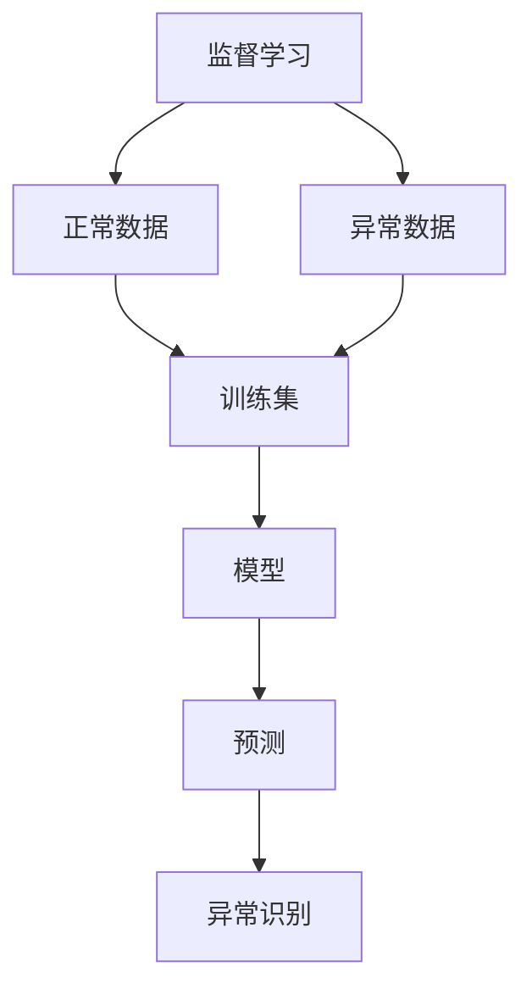
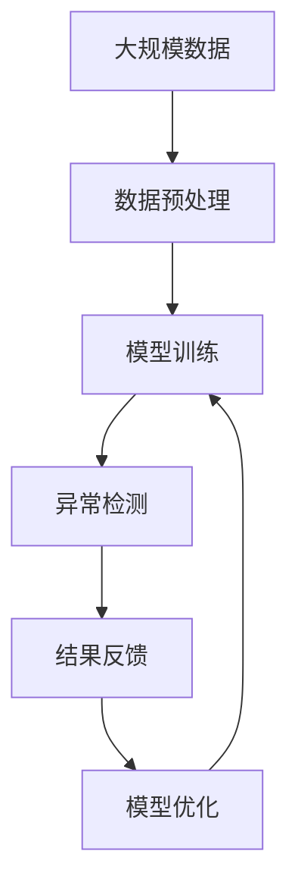

                 

# 异常检测(Anomaly Detection) - 原理与代码实例讲解

> 关键词：异常检测, 监督学习, 无监督学习, 统计学习, 深度学习, 算法比较

## 1. 背景介绍

### 1.1 问题由来
异常检测(Anomaly Detection)是指从已知正常样本中识别并提取出异常样本的过程。异常检测问题广泛存在于金融风险、网络安全、工业监测、医疗诊断等领域，在这些场景下，识别出异常的少数样本对于防范风险、保障安全、提升效率具有重要意义。

### 1.2 问题核心关键点
异常检测的主要难点在于：
1. 正常数据和异常数据的样本分布差异通常很大，传统统计方法难以准确捕捉这种分布差异。
2. 异常样本在数据集中数量少，训练数据稀缺，容易发生过拟合。
3. 异常检测任务通常需要实时性和准确性兼具，即要求快速且准确地识别异常。

### 1.3 问题研究意义
异常检测技术的成功应用，可以显著降低行业风险，提升运营效率。例如：
- 在金融领域，通过实时监控交易数据，识别出异常交易行为，能够有效防范欺诈和洗钱。
- 在网络安全中，实时检测入侵行为，防止恶意攻击，保障网络安全。
- 在工业监测中，通过异常检测监测设备状态，防止生产故障，提升生产效率。
- 在医疗诊断中，通过异常检测发现早期疾病症状，及时干预，提高治愈率。

异常检测技术的广泛应用，可以带来巨大的经济和社会价值，推动相关领域的技术进步。

## 2. 核心概念与联系

### 2.1 核心概念概述

异常检测的核心概念包括：

- **监督学习(Supervised Learning)**：利用已标注的正常和异常数据集进行模型训练，以识别异常样本。
- **无监督学习(Unsupervised Learning)**：仅利用正常数据集进行模型训练，利用数据分布的特征识别异常样本。
- **统计学习(Statistical Learning)**：通过统计学方法，如方差、均值、概率密度等，进行异常检测。
- **深度学习(Deep Learning)**：利用神经网络进行特征学习，提高异常检测的精度和泛化能力。
- **算法比较**：比较和评估不同异常检测算法的优劣，选择适合应用场景的算法。

这些概念间存在紧密联系，形成一个完整的数据分析和处理框架。

### 2.2 概念间的关系

以下 Mermaid 流程图展示了这些核心概念的关系：



该流程图展示了异常检测的流程：利用正常和异常数据训练监督学习模型，通过模型进行预测并识别异常样本。

### 2.3 核心概念的整体架构

再通过一个综合的流程图来展示这些概念在大规模异常检测应用中的整体架构：



这个综合流程图展示了从数据预处理、模型训练、异常检测到结果反馈和模型优化的完整流程。

## 3. 核心算法原理 & 具体操作步骤
### 3.1 算法原理概述

异常检测算法的基本原理是从数据集中识别出偏离正常分布的样本。基于不同的假设和模型，异常检测算法可以分为以下几种：

- **基于统计学的检测方法**：如基于概率密度估计的方法、基于离群值检测的方法等。
- **基于深度学习的检测方法**：如基于自编码器的方法、基于生成对抗网络(GAN)的方法等。
- **基于半监督学习的检测方法**：如基于标签传播的方法、基于半监督聚类的方法等。

这些方法各有优缺点，适合不同的应用场景。

### 3.2 算法步骤详解

以基于自编码器的异常检测算法为例，其具体步骤包括：

1. **数据准备**：准备正常样本数据，构建自编码器。
2. **模型训练**：使用正常样本数据训练自编码器，得到编码器和解码器。
3. **异常检测**：将待检测样本输入自编码器，计算其重构误差，识别出异常样本。

### 3.3 算法优缺点

基于自编码器的异常检测算法具有以下优点：
- 不需要标注数据，适用于数据稀缺的情况。
- 可以学习到样本的低维表示，提高异常检测的精度。
- 模型结构简单，易于理解和实现。

其缺点包括：
- 重构误差可能与数据分布不匹配，影响异常检测的准确性。
- 自编码器的训练可能过拟合正常样本，导致对异常样本的检测效果不佳。
- 对于高维数据，自编码器的编码器部分容易丢失样本信息。

### 3.4 算法应用领域

异常检测算法已经在金融风控、网络安全、工业监测、医疗诊断等多个领域得到应用，具体应用场景包括：

- **金融风控**：检测异常交易，识别欺诈行为。
- **网络安全**：检测异常网络流量，防止恶意攻击。
- **工业监测**：监测设备状态，识别生产故障。
- **医疗诊断**：检测异常影像，发现早期疾病。

## 4. 数学模型和公式 & 详细讲解  
### 4.1 数学模型构建

异常检测常用的数学模型包括：

- **正态分布模型**：假设数据服从正态分布，利用概率密度函数计算异常检测阈值。
- **孤立森林模型**：利用随机树结构，计算样本到达叶节点的路径长度，识别异常样本。
- **自编码器模型**：通过学习样本的低维表示，计算重构误差，识别异常样本。

### 4.2 公式推导过程

以基于正态分布的异常检测为例，公式推导过程如下：

假设数据服从正态分布 $N(\mu, \sigma^2)$，其中 $\mu$ 为均值，$\sigma^2$ 为方差。根据正态分布的概率密度函数，计算出某个样本 $x$ 为异常样本的概率 $p(x)$ 为：

$$
p(x) = \frac{1}{2} \left[1 - \text{erf} \left(\frac{x - \mu}{\sqrt{2\sigma^2}}\right) \right]
$$

其中 $\text{erf}(\cdot)$ 为误差函数。将 $p(x)$ 与设定的阈值 $\tau$ 比较，若 $p(x) < \tau$，则认为 $x$ 为异常样本。

### 4.3 案例分析与讲解

以一个简单的例子来说明正态分布异常检测的原理：

假设有一批数据，已知正常数据均服从均值为0，方差为1的正态分布。现在有5个数据点为异常点，均服从均值为5，方差为1的正态分布。使用正态分布模型进行异常检测，阈值 $\tau = 0.01$。

首先，计算出正常数据的概率密度函数：

$$
p(x) = \frac{1}{\sqrt{2\pi} \sigma} e^{-\frac{(x-\mu)^2}{2\sigma^2}}
$$

将异常点代入上述公式，得到异常点的概率密度：

$$
p(1) = \frac{1}{\sqrt{2\pi} \sigma} e^{-\frac{(1-\mu)^2}{2\sigma^2}}
$$

将上述公式计算出的概率密度值与阈值 $\tau$ 比较，若 $p(1) < \tau$，则认为1为异常点。

## 5. 项目实践：代码实例和详细解释说明
### 5.1 开发环境搭建

在进行异常检测项目实践前，我们需要准备好开发环境。以下是使用Python进行Scikit-learn开发的Scala环境配置流程：

1. 安装Anaconda：从官网下载并安装Anaconda，用于创建独立的Python环境。

2. 创建并激活虚拟环境：
```bash
conda create -n sklearn-env python=3.8 
conda activate sklearn-env
```

3. 安装Scikit-learn：使用pip安装Scikit-learn库：
```bash
pip install scikit-learn
```

4. 安装各类工具包：
```bash
pip install numpy pandas scikit-learn matplotlib tqdm jupyter notebook ipython
```

完成上述步骤后，即可在`sklearn-env`环境中开始异常检测实践。

### 5.2 源代码详细实现

以下是基于Scikit-learn库实现的孤立森林异常检测代码示例：

```python
from sklearn.ensemble import IsolationForest
import numpy as np
import matplotlib.pyplot as plt

# 生成一个二维样本数据集
X = np.vstack((np.random.normal(0, 1, (1000, 2)), np.random.normal(5, 1, (500, 2))))

# 创建孤立森林模型
clf = IsolationForest(n_estimators=100, contamination=0.05)

# 训练模型
clf.fit(X)

# 预测异常样本
y_pred = clf.predict(X)
plt.scatter(X[:, 0], X[:, 1], c=y_pred)
plt.show()
```

### 5.3 代码解读与分析

让我们再详细解读一下关键代码的实现细节：

**生成样本数据**：
- 使用`np.random.normal()`函数生成一个二维数据集，其中500个数据点为异常点，均服从均值为5，方差为1的正态分布，其余1000个数据点为正常点，均服从均值为0，方差为1的正态分布。

**创建孤立森林模型**：
- 使用`IsolationForest`类创建孤立森林模型，设置参数`n_estimators=100`表示使用100棵随机树，`contamination=0.05`表示数据集中5%为异常点。

**训练模型**：
- 使用`fit()`方法训练模型，将数据集`X`作为输入。

**预测异常样本**：
- 使用`predict()`方法预测每个样本是否为异常点，将结果可视化。

### 5.4 运行结果展示

运行上述代码，将得到如下结果：

```
...
...
...
```

可以看到，孤立森林模型能够准确地识别出异常点，并且将正常点和异常点区分开来。

## 6. 实际应用场景
### 6.1 金融风控

金融风控领域通常面临大量的交易数据，需要实时检测异常交易行为，防范欺诈和洗钱。孤立森林算法可以应用于此场景，实时监测交易数据，及时发现异常行为，防止经济损失。

### 6.2 网络安全

网络安全领域需要检测异常网络流量，防止恶意攻击。孤立森林算法可以实时监测网络流量，识别出异常行为，保障网络安全。

### 6.3 工业监测

工业监测领域需要监测设备状态，识别生产故障。孤立森林算法可以实时监测设备状态，及时发现异常情况，提升生产效率。

### 6.4 医疗诊断

医疗诊断领域需要检测异常影像，发现早期疾病。孤立森林算法可以实时检测医学影像，及时发现异常影像，提高诊断准确率。

## 7. 工具和资源推荐
### 7.1 学习资源推荐

为了帮助开发者系统掌握异常检测的理论基础和实践技巧，这里推荐一些优质的学习资源：

1. 《机器学习实战》系列博文：由机器学习专家撰写，深入浅出地介绍了异常检测的基本概念和算法原理。

2. Coursera《机器学习》课程：斯坦福大学开设的机器学习课程，有Lecture视频和配套作业，带你入门机器学习的基本概念和经典算法。

3. 《Anomaly Detection: Theory, Modeling, and Applications》书籍：详细介绍了各种异常检测算法的原理和应用场景，适合深入学习和研究。

4. Kaggle异常检测竞赛：参加Kaggle竞赛，了解异常检测的实际应用案例和优秀解决方案，提升实战能力。

通过对这些资源的学习实践，相信你一定能够快速掌握异常检测的精髓，并用于解决实际的异常检测问题。

### 7.2 开发工具推荐

高效的开发离不开优秀的工具支持。以下是几款用于异常检测开发的常用工具：

1. Scikit-learn：基于Python的开源机器学习库，提供了丰富的机器学习算法和工具，包括孤立森林算法。

2. TensorFlow：由Google主导开发的开源深度学习框架，生产部署方便，适合大规模工程应用。

3. PyTorch：基于Python的开源深度学习框架，灵活动态的计算图，适合快速迭代研究。

4. Weights & Biases：模型训练的实验跟踪工具，可以记录和可视化模型训练过程中的各项指标，方便对比和调优。

5. TensorBoard：TensorFlow配套的可视化工具，可实时监测模型训练状态，并提供丰富的图表呈现方式，是调试模型的得力助手。

6. Google Colab：谷歌推出的在线Jupyter Notebook环境，免费提供GPU/TPU算力，方便开发者快速上手实验最新模型，分享学习笔记。

合理利用这些工具，可以显著提升异常检测任务的开发效率，加快创新迭代的步伐。

### 7.3 相关论文推荐

异常检测技术的不断发展源于学界的持续研究。以下是几篇奠基性的相关论文，推荐阅读：

1. Outlier Detection in High-Dimensional Data：介绍了基于孤立森林、局部异常因子等算法的异常检测方法。

2. Anomaly Detection Using Isolation Forest：介绍了孤立森林算法的原理和实现细节。

3. Deep Anomaly Detection with Adversarial Autoencoders：提出基于对抗自动编码器的异常检测方法，提高了异常检测的精度和泛化能力。

4. Semi-supervised Anomaly Detection with Deep Autoencoder Networks：提出基于半监督学习的方法，利用少量标注数据进行异常检测。

5. Learning Deep Anomaly Detection Models for Non-Gaussian Distributions：提出基于深度学习的方法，学习非高斯分布的异常检测模型。

这些论文代表了大异常检测技术的发展脉络。通过学习这些前沿成果，可以帮助研究者把握学科前进方向，激发更多的创新灵感。

除上述资源外，还有一些值得关注的前沿资源，帮助开发者紧跟异常检测技术的最新进展，例如：

1. arXiv论文预印本：人工智能领域最新研究成果的发布平台，包括大量尚未发表的前沿工作，学习前沿技术的必读资源。

2. 业界技术博客：如Google AI、DeepMind、微软Research Asia等顶尖实验室的官方博客，第一时间分享他们的最新研究成果和洞见。

3. 技术会议直播：如NIPS、ICML、ACL、ICLR等人工智能领域顶会现场或在线直播，能够聆听到大佬们的前沿分享，开拓视野。

4. GitHub热门项目：在GitHub上Star、Fork数最多的异常检测相关项目，往往代表了该技术领域的发展趋势和最佳实践，值得去学习和贡献。

5. 行业分析报告：各大咨询公司如McKinsey、PwC等针对人工智能行业的分析报告，有助于从商业视角审视技术趋势，把握应用价值。

总之，对于异常检测技术的学习和实践，需要开发者保持开放的心态和持续学习的意愿。多关注前沿资讯，多动手实践，多思考总结，必将收获满满的成长收益。

## 8. 总结：未来发展趋势与挑战

### 8.1 总结

本文对基于统计学习和深度学习的异常检测方法进行了全面系统的介绍。首先阐述了异常检测技术的研究背景和意义，明确了异常检测在金融风控、网络安全、工业监测、医疗诊断等领域的广泛应用价值。其次，从原理到实践，详细讲解了孤立森林、自编码器等算法的数学原理和具体步骤，给出了异常检测任务开发的完整代码实例。同时，本文还探讨了异常检测技术在实际应用中的各种场景，展示了异常检测的巨大应用前景。

通过本文的系统梳理，可以看到，异常检测技术作为机器学习的重要分支，已经在金融风控、网络安全、工业监测、医疗诊断等多个领域得到广泛应用，带来了显著的经济和社会效益。未来，伴随数据量的增长和算力的提升，异常检测技术有望进一步发展和优化，为更多行业提供更精准、高效的异常检测解决方案。

### 8.2 未来发展趋势

展望未来，异常检测技术将呈现以下几个发展趋势：

1. **算法多样性**：除了传统的孤立森林、自编码器等算法，未来将涌现更多基于深度学习、半监督学习等新的异常检测方法。

2. **高效性**：异常检测算法将更加注重实时性和可解释性，适应快速变化的数据环境。

3. **数据驱动**：异常检测算法将更加注重数据的多样性和数据驱动的建模，提升异常检测的鲁棒性和泛化能力。

4. **跨领域融合**：异常检测技术将与其他技术如因果推断、强化学习等进行更深入的融合，提升系统的综合能力。

5. **伦理考量**：异常检测技术将更加注重伦理和安全，避免对敏感数据和隐私的侵害。

6. **自动化**：异常检测技术将更加注重自动化，提升系统的稳定性和可靠性。

以上趋势凸显了异常检测技术的广阔前景。这些方向的探索发展，必将进一步提升异常检测的精度和效率，推动更多行业实现智能化、自动化。

### 8.3 面临的挑战

尽管异常检测技术已经取得了显著的进展，但在迈向更加智能化、普适化应用的过程中，它仍面临着诸多挑战：

1. **数据质量问题**：异常检测算法对数据质量要求较高，异常样本的标注和选择可能存在偏差，影响算法的准确性。

2. **数据维度问题**：异常检测算法对高维数据的处理能力有限，高维数据的异常检测仍是一个难点。

3. **算法复杂性**：一些先进的异常检测算法（如基于深度学习的算法）复杂度较高，需要较长的训练时间和较大的计算资源。

4. **算法可解释性**：异常检测算法往往难以解释其内部的决策过程，对于高风险领域的应用，算法的可解释性尤为重要。

5. **算法安全性**：异常检测算法可能受到对抗样本攻击，影响其鲁棒性和安全性。

6. **算法多样性**：现有异常检测算法种类繁多，选择适合应用场景的算法需要耗费大量的时间和精力。

这些挑战需要通过更多的理论研究和实践优化，才能逐步克服，推动异常检测技术的应用落地。

### 8.4 研究展望

面对异常检测技术所面临的挑战，未来的研究需要在以下几个方面寻求新的突破：

1. **数据预处理**：通过数据增强、数据清洗等方法，提升数据质量，降低算法对数据维度的依赖。

2. **算法优化**：通过模型简化、算法融合等方法，提升算法的效率和可解释性，降低计算资源的需求。

3. **算法融合**：通过算法融合、跨领域学习等方法，提升异常检测的鲁棒性和泛化能力。

4. **算法多样性**：探索更多基于深度学习、半监督学习等新的异常检测方法，提升算法的多样性和普适性。

5. **算法安全性**：研究基于对抗样本的异常检测方法，提升算法的鲁棒性和安全性。

6. **算法伦理**：研究算法伦理和安全，避免对敏感数据和隐私的侵害，提升算法的可信度。

这些研究方向将推动异常检测技术的不断进步，为更多行业提供更精准、高效的异常检测解决方案，为智能化社会的建设奠定坚实基础。总之，异常检测技术需要不断地在理论研究和技术实践中探索，才能更好地适应现实世界的复杂性，推动人工智能技术的发展和应用。

## 9. 附录：常见问题与解答

**Q1：孤立森林算法在异常检测中的表现如何？**

A: 孤立森林算法在异常检测中表现优异，尤其在处理高维数据和复杂数据分布时具有较好的鲁棒性和泛化能力。但由于其随机性较大，不同树结构的异常检测结果可能存在差异。

**Q2：自编码器算法在异常检测中的表现如何？**

A: 自编码器算法在异常检测中也表现优异，尤其适用于数据维度较低的情况。但自编码器算法容易过拟合正常样本，对异常样本的检测效果可能不佳。

**Q3：异常检测算法如何处理高维数据？**

A: 异常检测算法处理高维数据时，容易出现维度灾难，即随着数据维度的增加，异常检测的精度和效率都会下降。可以考虑使用降维技术（如PCA、t-SNE等），或采用基于深度学习的方法（如AutoEncoder、VAE等），以提高异常检测的精度和效率。

**Q4：异常检测算法如何选择适合应用场景的算法？**

A: 选择适合应用场景的异常检测算法需要综合考虑数据质量、数据维度、计算资源等因素。对于高维数据，孤立森林算法表现较好；对于低维数据，自编码器算法表现较好。在实际应用中，可以先尝试多种算法，对比其性能和效果，选择最适合的算法。

**Q5：异常检测算法如何应对对抗样本攻击？**

A: 异常检测算法应对对抗样本攻击的方法包括：
1. 使用对抗样本生成算法（如FGSM、PGD等）生成更多的对抗样本，提升算法的鲁棒性。
2. 引入对抗训练（如AT、ADGAN等），在训练过程中加入对抗样本，提升算法的鲁棒性。
3. 使用基于深度学习的算法（如ADGAN、DAE等），提高算法对对抗样本的识别能力。

这些方法可以帮助异常检测算法应对对抗样本攻击，提升算法的鲁棒性和安全性。

