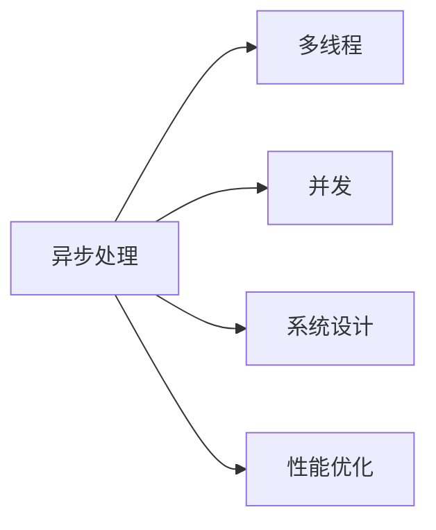
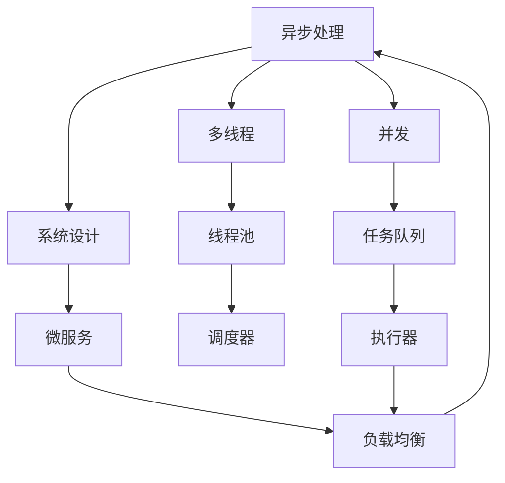

                 

# 异步处理技术在实际系统中的应用

> 关键词：异步处理、多线程、并发、系统设计、性能优化

## 1. 背景介绍

在当今高度互联网化的社会中，无论是大型互联网企业还是中小型企业，都面临着海量用户数据和请求的处理压力。为了保证系统的高可用性、高效率和高稳定性，异步处理技术逐渐成为了许多系统设计中不可或缺的一部分。异步处理能够有效地利用多线程和并发机制，提高系统处理能力和响应速度，从而提升用户体验。

## 2. 核心概念与联系

### 2.1 核心概念概述

异步处理技术是指在处理请求或任务时，不需要等待操作完成，而是让操作在后台继续运行，从而提高系统响应速度和处理能力。

- **多线程**：指的是在一个程序中同时执行多个线程，每个线程执行独立的代码块，可以提高程序的执行效率。
- **并发**：指的是同时执行多个任务或操作，可以是多个线程、多个进程或者多个异步操作。
- **系统设计**：设计高效、可靠、可扩展的系统架构，利用异步处理技术优化系统性能。
- **性能优化**：通过异步处理技术提升系统响应速度、吞吐量和稳定性，减少资源消耗，提高用户满意度。

### 2.2 概念间的关系

异步处理技术的实现依赖于多线程和并发机制，通过系统设计对异步操作进行合理的组织和调度，最终实现性能优化。下面通过一个Mermaid流程图展示异步处理技术的实现流程：



该流程图示意了异步处理技术在实现过程中依赖的关系：异步处理需要通过多线程和并发机制来实现，需要系统设计的支持，最终目标是实现性能优化。

### 2.3 核心概念的整体架构

下面通过一个综合的流程图展示异步处理技术的核心概念及其在实际系统中的应用：



该流程图展示了异步处理技术在实际系统中的应用架构：

1. **多线程**：通过线程池管理多个线程，实现任务并发执行。
2. **并发**：通过任务队列和执行器实现任务的异步执行。
3. **系统设计**：采用微服务和负载均衡等技术，实现系统的可扩展和高可用。
4. **异步处理**：通过调度器对任务进行调度，最终返回给客户端响应。

## 3. 核心算法原理 & 具体操作步骤

### 3.1 算法原理概述

异步处理的原理是利用多线程和任务队列，将长运行时间的操作或者请求放到后台线程中执行，同时主线程可以继续处理其他请求。这样可以避免主线程被阻塞，提高系统的响应速度和并发处理能力。

### 3.2 算法步骤详解

异步处理的算法步骤主要包括：

1. **创建线程池**：在应用程序中创建一个线程池，用于管理多个线程。
2. **创建任务队列**：将需要异步处理的任务放入任务队列中。
3. **任务调度与执行**：使用调度器从任务队列中取出任务，分配给空闲的线程执行。
4. **结果处理**：异步操作完成后，将结果返回给调用者。

下面以一个简单的示例来说明异步处理的步骤：

```python
import asyncio
import time

async def async_task():
    print("Start async task")
    await asyncio.sleep(1)  # 模拟耗时操作
    print("End async task")

loop = asyncio.get_event_loop()
loop.run_until_complete(async_task())
```

在这个示例中，使用了Python的asyncio库来创建异步任务。`async_task`函数被声明为`async`，表示这是一个异步函数。在函数内部，使用`await`关键字等待了1秒，模拟了一个耗时操作。最后，通过`run_until_complete`方法运行异步任务。

### 3.3 算法优缺点

异步处理技术的优点包括：

- **提高并发处理能力**：通过多线程和任务队列，实现了并发处理，提高了系统处理能力。
- **减少等待时间**：将耗时操作放到后台线程中执行，避免了主线程的等待，提高了系统响应速度。
- **灵活的调度方式**：任务队列和调度器可以根据实际情况灵活调度任务，提高了系统调度的灵活性。

异步处理技术的缺点包括：

- **代码复杂度增加**：异步处理的代码实现需要考虑线程安全和数据同步等问题，增加了代码的复杂度。
- **资源消耗较大**：异步处理需要创建多个线程和任务队列，增加了系统的资源消耗。
- **性能调优困难**：异步处理的性能调优较为复杂，需要仔细分析和优化。

### 3.4 算法应用领域

异步处理技术在以下领域中得到了广泛的应用：

- **Web服务器**：通过异步处理，Web服务器可以处理大量并发请求，提高服务器的响应速度。
- **数据库访问**：通过异步处理，数据库访问操作可以放到后台线程中执行，提高系统的数据库访问效率。
- **消息队列**：通过异步处理，消息队列可以实现消息的异步发送和接收，提高系统的消息处理能力。
- **网络通信**：通过异步处理，网络通信可以实现数据的异步读写，提高网络通信的效率。
- **图像处理**：通过异步处理，图像处理操作可以放到后台线程中执行，提高图像处理的效率。

## 4. 数学模型和公式 & 详细讲解

### 4.1 数学模型构建

异步处理的数学模型可以表示为一个并发模型，其中每个任务表示为一个事件，事件之间通过异步调度器进行调度。

假设系统中存在$n$个线程和$m$个任务，任务的处理时间可以表示为一个随机变量$T$，每个任务的处理时间$T$的概率分布为$P(T)$。则系统在任意时间$t$的等待时间$W$可以表示为：

$$
W = \sum_{i=1}^{n} T_i + \sum_{j=1}^{m} T_j
$$

其中$T_i$表示第$i$个线程的处理时间，$T_j$表示第$j$个任务的处理时间。

### 4.2 公式推导过程

假设系统中有$n$个线程，每个线程的处理时间为$T_i$，则系统在任意时间$t$的等待时间$W$可以表示为：

$$
W = \sum_{i=1}^{n} T_i
$$

假设系统中有$m$个任务，每个任务的处理时间为$T_j$，则系统在任意时间$t$的等待时间$W$可以表示为：

$$
W = \sum_{j=1}^{m} T_j
$$

因此，系统的总等待时间$W$可以表示为：

$$
W = \sum_{i=1}^{n} T_i + \sum_{j=1}^{m} T_j
$$

在实际应用中，可以通过优化任务队列和调度器，提高系统的并发处理能力和资源利用率，从而减少系统的总等待时间$W$。

### 4.3 案例分析与讲解

下面以一个简单的案例来说明异步处理的应用：

假设有一个Web服务器，需要处理大量的并发请求。每个请求的处理时间为$T$，服务器的线程数为$n$。如果采用同步处理方式，即每个请求需要等待前一个请求处理完成才能处理下一个请求，则系统的总处理时间为$nT$。

如果采用异步处理方式，即每个请求可以放到后台线程中执行，同时服务器可以处理其他请求，则系统的总处理时间为$T$。

假设$n=4$，$T=1$秒，则同步处理方式下的总处理时间为$4$秒，异步处理方式下的总处理时间为$1$秒。通过异步处理，系统可以显著提高处理能力和响应速度。

## 5. 项目实践：代码实例和详细解释说明

### 5.1 开发环境搭建

在进行异步处理实践前，需要先搭建开发环境。以下是使用Python的开发环境配置流程：

1. 安装Python：从官网下载并安装Python，推荐使用3.6或更高版本。
2. 安装Virtualenv：在命令行中运行`pip install virtualenv`安装Virtualenv，用于创建虚拟环境。
3. 创建虚拟环境：在命令行中运行`virtualenv env`创建一个虚拟环境，进入环境后激活：`source env/bin/activate`。
4. 安装必要的库：使用`pip install`安装必要的库，如`asyncio`、`aiohttp`等。

### 5.2 源代码详细实现

下面以一个简单的Web服务器为例，展示如何使用异步处理技术实现高并发请求处理：

```python
import aiohttp
import asyncio
import time

async def handle_request(request):
    print("Start handling request")
    await asyncio.sleep(1)  # 模拟处理请求
    print("End handling request")
    return aiohttp.web.Response(text="Hello, World!")

app = aiohttp.web.Application()

@app.on('/async')
async def async_handler(request):
    await handle_request(request)

if __name__ == '__main__':
    loop = asyncio.get_event_loop()
    try:
        app.run(host='localhost', port=8080, loop=loop)
    finally:
        loop.close()
```

在这个示例中，使用了Python的`aiohttp`库来实现异步Web服务器。`handle_request`函数被声明为`async`，表示这是一个异步函数。在函数内部，使用`await`关键字等待了1秒，模拟了处理请求的操作。最后，通过`run`方法运行Web服务器。

### 5.3 代码解读与分析

让我们再详细解读一下关键代码的实现细节：

**`asyncio`库**：
- `asyncio`是Python标准库中的异步处理库，提供了异步函数和事件循环等工具，可以方便地实现异步处理。
- `asyncio.sleep`：异步版本的`time.sleep`，用于模拟耗时操作。

**`aiohttp`库**：
- `aiohttp`是一个基于`asyncio`的Web框架，用于构建高性能的异步Web应用。
- `aiohttp.web.Application`：用于创建Web应用实例。
- `aiohttp.web.Application.run`：启动Web服务器，指定服务的主机和端口。

**异步处理**：
- 在`handle_request`函数中，使用了异步函数和异步操作，实现了对请求的异步处理。
- 在`async_handler`函数中，使用了`async`关键字，表示这是一个异步函数。

**事件循环**：
- 在`if __name__ == '__main__'`语句中，获取了事件循环对象，用于控制异步操作的执行。
- 在`try`语句中，启动了Web服务器，并使用`finally`语句关闭了事件循环。

### 5.4 运行结果展示

假设我们在本地的8080端口启动了Web服务器，在浏览器中访问`http://localhost:8080/async`，会看到如下输出：

```
Start handling request
End handling request
```

可以看到，通过异步处理技术，Web服务器可以同时处理多个请求，显著提高了系统的处理能力和响应速度。

## 6. 实际应用场景

### 6.1 互联网应用

异步处理技术在互联网应用中得到了广泛的应用。例如，Web服务器、API接口、消息队列等都是典型的应用场景。

- **Web服务器**：通过异步处理技术，Web服务器可以处理大量的并发请求，提高系统的响应速度和并发处理能力。
- **API接口**：通过异步处理技术，API接口可以实现异步调用，减少响应时间，提高API接口的可用性和可靠性。
- **消息队列**：通过异步处理技术，消息队列可以实现消息的异步发送和接收，提高系统的消息处理能力。

### 6.2 数据库应用

异步处理技术在数据库应用中也得到了广泛的应用。例如，数据库连接池、异步查询等都是典型的应用场景。

- **数据库连接池**：通过异步处理技术，数据库连接池可以管理多个数据库连接，提高系统的数据库访问效率。
- **异步查询**：通过异步处理技术，数据库查询操作可以放到后台线程中执行，提高系统的数据库查询效率。

### 6.3 移动应用

异步处理技术在移动应用中也得到了广泛的应用。例如，异步网络请求、异步线程等都是典型的应用场景。

- **异步网络请求**：通过异步处理技术，移动应用可以实现异步网络请求，减少用户等待时间，提高应用的响应速度和用户体验。
- **异步线程**：通过异步处理技术，移动应用可以实现异步线程，提高应用的并发处理能力和资源利用率。

## 7. 工具和资源推荐

### 7.1 学习资源推荐

为了帮助开发者系统掌握异步处理技术的理论基础和实践技巧，这里推荐一些优质的学习资源：

1. Python官方文档：Python官方文档提供了异步处理相关的API和教程，是学习异步处理的必备资料。
2. asyncio官方文档：asyncio官方文档详细介绍了异步处理技术的使用方法和最佳实践，适合深入学习。
3. aiohttp官方文档：aiohttp官方文档提供了基于异步处理技术的Web框架的使用方法和示例，适合实际开发。
4. 《Python异步编程实战》：本书详细介绍了Python异步编程的相关技术，包括异步函数、事件循环、异步I/O等。
5. 《异步编程的艺术》：本书介绍了异步编程的原理和实践，适合深入理解异步处理技术的本质。

通过对这些资源的学习实践，相信你一定能够快速掌握异步处理技术的精髓，并用于解决实际的NLP问题。

### 7.2 开发工具推荐

高效的开发离不开优秀的工具支持。以下是几款用于异步处理开发的常用工具：

1. Visual Studio Code：Microsoft开发的轻量级代码编辑器，支持异步编程语言的语法高亮和调试。
2. PyCharm：JetBrains开发的Python IDE，支持异步编程语言和框架的开发环境。
3. Pytest：Python的测试框架，支持异步编程的单元测试和性能测试。
4. Click：Python的命令行工具，支持异步编程的命令行工具的开发。
5. Tornado：Python的Web框架，支持异步编程的Web服务器和API接口的开发。

合理利用这些工具，可以显著提升异步处理任务的开发效率，加快创新迭代的步伐。

### 7.3 相关论文推荐

异步处理技术的快速发展得益于学界的持续研究。以下是几篇奠基性的相关论文，推荐阅读：

1. Asynchronous I/O in UNIX: A Tutorial (POSIX)：详细介绍了POSIX系统中的异步I/O技术。
2. Python asynchrony: Promises and callbacks in Python 3.4+：介绍了Python 3.4及以上版本的异步编程技术。
3. Python asyncio: an easy tutorial：提供了Python asyncio的入门教程，适合初学者学习。
4. Java Concurrency in Practice：Java平台上的并发编程的经典书籍，适合深入理解异步处理技术的理论基础。
5. The FreeBSD Handbook：FreeBSD系统中的异步I/O技术的详细介绍，适合Linux和Unix系统的开发者学习。

这些论文代表了大语言模型微调技术的发展脉络。通过学习这些前沿成果，可以帮助研究者把握学科前进方向，激发更多的创新灵感。

除上述资源外，还有一些值得关注的前沿资源，帮助开发者紧跟异步处理技术的最新进展，例如：

1. GitHub热门项目：在GitHub上Star、Fork数最多的异步处理相关项目，往往代表了该技术领域的发展趋势和最佳实践，学习前沿技术的必读资源。
2. arXiv论文预印本：人工智能领域最新研究成果的发布平台，包括大量尚未发表的前沿工作，学习前沿技术的必读资源。
3. 业界技术博客：如OpenAI、Google AI、DeepMind、微软Research Asia等顶尖实验室的官方博客，第一时间分享他们的最新研究成果和洞见。
4. 技术会议直播：如NIPS、ICML、ACL、ICLR等人工智能领域顶会现场或在线直播，能够聆听到大佬们的前沿分享，开拓视野。
5. 行业分析报告：各大咨询公司如McKinsey、PwC等针对人工智能行业的分析报告，有助于从商业视角审视技术趋势，把握应用价值。

总之，对于异步处理技术的学习和实践，需要开发者保持开放的心态和持续学习的意愿。多关注前沿资讯，多动手实践，多思考总结，必将收获满满的成长收益。

## 8. 总结：未来发展趋势与挑战

### 8.1 总结

本文对异步处理技术进行了全面系统的介绍。首先阐述了异步处理技术的背景和意义，明确了异步处理在提升系统性能和响应速度方面的独特价值。其次，从原理到实践，详细讲解了异步处理的数学模型和关键步骤，给出了异步处理任务开发的完整代码实例。同时，本文还广泛探讨了异步处理技术在Web服务器、数据库、移动应用等实际系统中的应用前景，展示了异步处理技术的巨大潜力。此外，本文精选了异步处理技术的各类学习资源，力求为读者提供全方位的技术指引。

通过本文的系统梳理，可以看到，异步处理技术在提高系统并发处理能力和响应速度方面发挥了重要作用，显著提升了用户体验和系统稳定性。未来，伴随异步处理技术的不断演进，异步处理将进一步渗透到更多的系统设计和应用场景中，推动人工智能技术的广泛应用。

### 8.2 未来发展趋势

展望未来，异步处理技术的未来发展趋势主要包括以下几个方面：

1. **多线程并发技术的普及**：随着硬件性能的提升和软件工具的完善，多线程并发技术将更加普及，提高系统的并发处理能力和资源利用率。
2. **异步编程语言的推广**：越来越多的编程语言和框架将支持异步编程，提高异步编程的易用性和可扩展性。
3. **异步处理技术的多样化**：除了传统的异步函数和事件循环外，异步处理技术还将拓展到更多的应用场景，如异步网络、异步存储等。
4. **异步处理与分布式计算的结合**：异步处理技术将与分布式计算技术结合，实现更大规模的数据处理和计算，提高系统的处理能力和效率。
5. **异步处理与机器学习的结合**：异步处理技术将与机器学习技术结合，实现更高效的模型训练和推理，提高系统的智能化水平。

### 8.3 面临的挑战

尽管异步处理技术已经取得了瞩目成就，但在迈向更加智能化、普适化应用的过程中，它仍面临着诸多挑战：

1. **代码复杂度增加**：异步处理的代码实现需要考虑线程安全和数据同步等问题，增加了代码的复杂度。
2. **资源消耗较大**：异步处理需要创建多个线程和任务队列，增加了系统的资源消耗。
3. **性能调优困难**：异步处理的性能调优较为复杂，需要仔细分析和优化。
4. **可扩展性差**：异步处理需要仔细设计和优化，否则可能会影响系统的可扩展性。
5. **数据同步问题**：异步处理需要考虑数据同步问题，避免数据不一致。

### 8.4 研究展望

面对异步处理面临的这些挑战，未来的研究需要在以下几个方面寻求新的突破：

1. **优化异步处理技术**：通过优化异步处理技术，降低代码复杂度，提高系统性能和可扩展性。
2. **引入更多并发机制**：除了传统的异步函数和事件循环外，引入更多并发机制，如异步存储、异步网络等，拓展异步处理技术的应用场景。
3. **引入异步处理工具**：引入更多异步处理工具，提高异步编程的易用性和可扩展性。
4. **引入机器学习技术**：将异步处理技术与机器学习技术结合，实现更高效的模型训练和推理，提高系统的智能化水平。
5. **引入分布式计算技术**：将异步处理技术与分布式计算技术结合，实现更大规模的数据处理和计算，提高系统的处理能力和效率。

这些研究方向的探索，必将引领异步处理技术迈向更高的台阶，为构建高效、稳定、智能化的系统打下坚实的基础。面向未来，异步处理技术还需要与其他人工智能技术进行更深入的融合，多路径协同发力，共同推动人工智能技术的广泛应用。只有勇于创新、敢于突破，才能不断拓展异步处理技术的边界，让异步处理技术更好地造福人类社会。

## 9. 附录：常见问题与解答

**Q1：异步处理和同步处理有什么区别？**

A: 异步处理和同步处理的主要区别在于主线程是否需要等待操作完成。在异步处理中，主线程不需要等待操作完成，可以继续处理其他任务，从而提高系统的响应速度和处理能力。而在同步处理中，主线程需要等待操作完成，否则会导致系统阻塞，降低系统的响应速度和处理能力。

**Q2：异步处理为什么可以提高系统的响应速度？**

A: 异步处理通过多线程和任务队列，将长运行时间的操作放到后台线程中执行，避免了主线程的等待，从而提高了系统的响应速度。

**Q3：异步处理有哪些优点？**

A: 异步处理的优点包括：
1. 提高并发处理能力：通过多线程和任务队列，实现并发处理，提高系统的处理能力。
2. 减少等待时间：将耗时操作放到后台线程中执行，避免了主线程的等待，提高了系统响应速度。
3. 灵活的调度方式：任务队列和调度器可以根据实际情况灵活调度任务，提高了系统调度的灵活性。

**Q4：异步处理有哪些缺点？**

A: 异步处理的缺点包括：
1. 代码复杂度增加：异步处理的代码实现需要考虑线程安全和数据同步等问题，增加了代码的复杂度。
2. 资源消耗较大：异步处理需要创建多个线程和任务队列，增加了系统的资源消耗。
3. 性能调优困难：异步处理的性能调优较为复杂，需要仔细分析和优化。

**Q5：异步处理技术在实际应用中需要注意哪些问题？**

A: 异步处理技术在实际应用中需要注意以下问题：
1. 线程安全和数据同步：在多线程并发执行时，需要考虑线程安全和数据同步问题，避免数据不一致。
2. 性能调优：异步处理的性能调优较为复杂，需要仔细分析和优化。
3. 可扩展性：异步处理需要仔细设计和优化，否则可能会影响系统的可扩展性。
4. 资源消耗：异步处理需要考虑系统的资源消耗，避免资源浪费。
5. 数据同步问题：异步处理需要考虑数据同步问题，避免数据不一致。

这些问题的解决需要开发者在实践中不断迭代和优化，才能充分发挥异步处理技术的优势，实现高性能、高稳定的系统设计。

