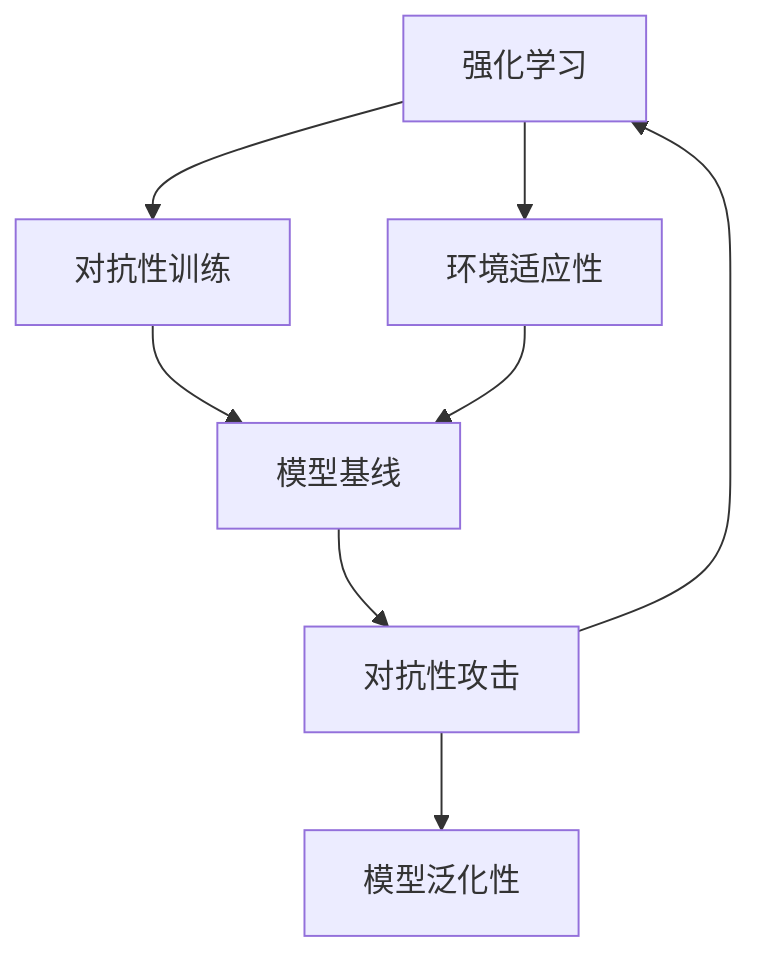
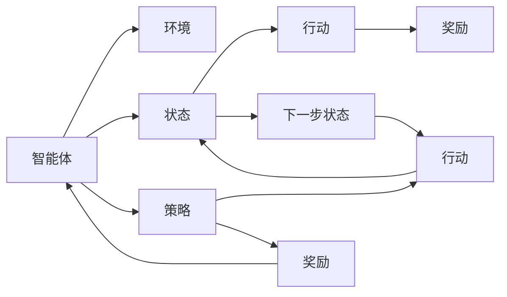
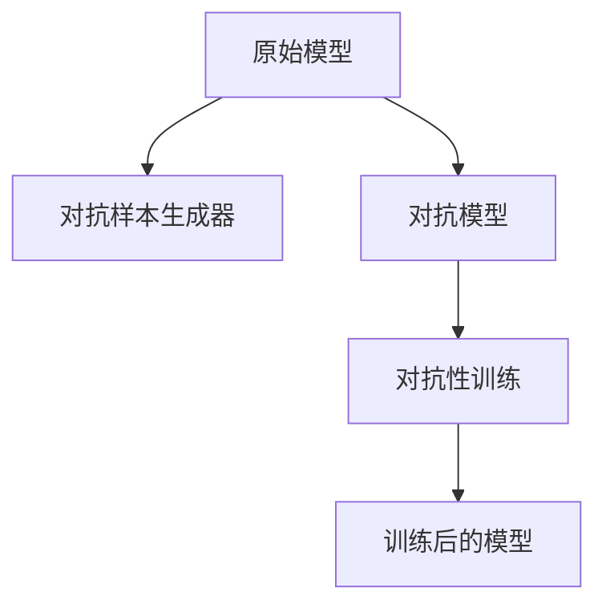
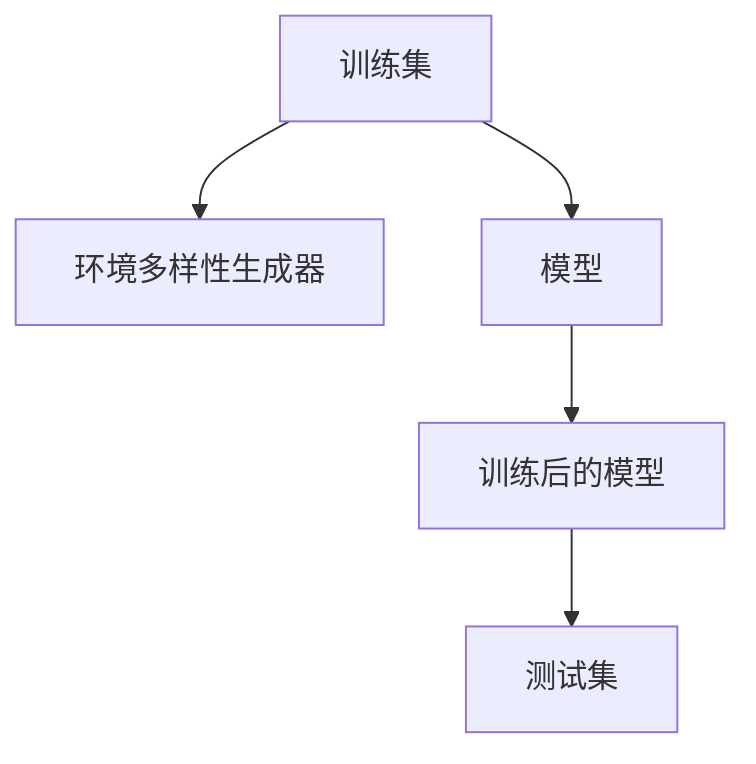
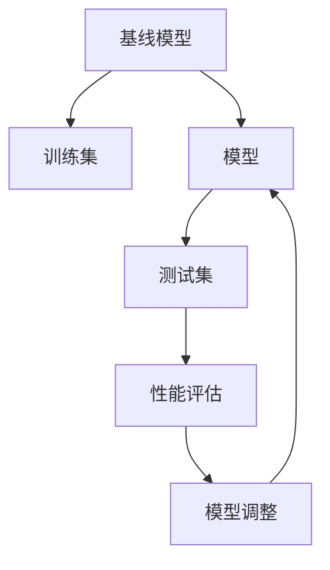
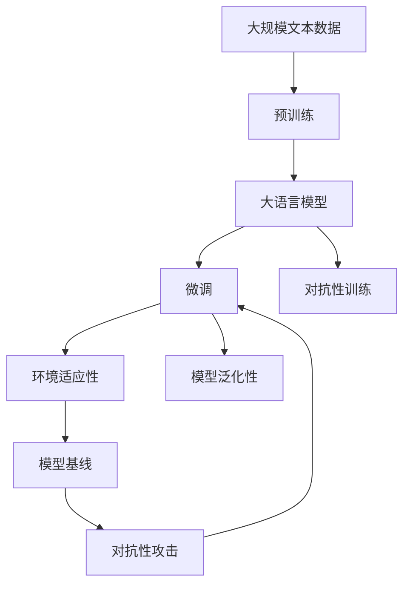

                 

# 强化学习Reinforcement Learning对抗性训练与环境适应性

> 关键词：强化学习,对抗性训练,环境适应性,RL,对抗学习,模型基线

## 1. 背景介绍

### 1.1 问题由来
强化学习（Reinforcement Learning, RL）是人工智能领域的重要分支，通过智能体与环境的交互，利用奖励和惩罚机制学习最优策略。在机器人控制、自动驾驶、游戏AI等领域有着广泛的应用。

然而，传统强化学习模型往往在复杂的非结构化环境中表现不佳，尤其是面对攻击和对抗性攻击时，模型的鲁棒性和适应性都难以得到保证。对抗性训练和环境适应性成为了强化学习研究的重点和难点。

### 1.2 问题核心关键点
强化学习在对抗性环境和复杂多变环境中，面临着以下几个核心问题：
1. **对抗攻击**：模型可能被对手操纵，导致决策错误，影响系统安全。
2. **环境变化**：模型需要适应快速变化的环境，避免因环境突变而失效。
3. **鲁棒性不足**：模型对于数据和环境的不确定性，缺乏足够的鲁棒性。
4. **模型泛化性**：模型难以泛化到未曾训练过的新环境和新任务。

这些问题导致了强化学习模型在实际应用中的可靠性、安全性和实用性受到严重质疑。解决这些问题，需要引入对抗性训练和环境适应性技术，提升模型的鲁棒性和泛化能力。

### 1.3 问题研究意义
对抗性训练和环境适应性技术的深入研究，对于提升强化学习模型的应用范围和性能，具有重要意义：

1. **提高安全性**：通过对抗性训练，使模型具备抵抗攻击的能力，保证系统的安全性。
2. **增强鲁棒性**：通过环境适应性训练，提升模型对数据和环境的鲁棒性，减少模型失效的风险。
3. **优化性能**：对抗性训练和环境适应性训练能够提高模型在新环境和新任务中的性能，加速模型推广应用。
4. **促进创新**：结合对抗性训练和环境适应性技术，推动强化学习模型在更复杂、更现实场景下的创新应用。
5. **赋能行业升级**：强化学习技术在自动驾驶、智能制造、智能交通等行业的推广应用，将大幅提升这些行业的智能化水平。

本文聚焦于强化学习的对抗性训练和环境适应性技术，详细介绍了其原理、实现方法及应用场景，为未来强化学习的研究和实践提供了参考。

## 2. 核心概念与联系

### 2.1 核心概念概述

为了更好地理解强化学习中的对抗性训练和环境适应性技术，本节将介绍几个密切相关的核心概念：

- **强化学习**（Reinforcement Learning, RL）：通过智能体与环境的交互，利用奖励和惩罚机制学习最优策略的机器学习技术。
- **对抗性训练**（Adversarial Training）：通过引入对抗样本或对手模型，提升模型鲁棒性，避免被攻击者操纵。
- **环境适应性**（Environment Adaptation）：通过模型训练过程中引入多样化的环境，提升模型对不同环境的适应能力。
- **模型基线**（Model Baseline）：为提升模型性能，常用的一种技术手段，通过与基线模型的比较，优化模型的训练过程。
- **对抗性攻击**（Adversarial Attack）：攻击者利用对抗样本或模型缺陷，恶意操控模型决策，影响系统安全。
- **模型泛化性**（Model Generalization）：模型在未曾训练过的数据和环境中，仍能表现良好，是模型性能的重要指标。

这些核心概念之间的逻辑关系可以通过以下Mermaid流程图来展示：



这个流程图展示了大语言模型微调的完整生态系统：

1. 强化学习通过智能体与环境的交互，利用奖励和惩罚机制学习最优策略。
2. 对抗性训练通过引入对抗样本或对手模型，提升模型的鲁棒性。
3. 环境适应性通过模型训练过程中引入多样化的环境，提升模型的适应能力。
4. 模型基线通过与基线模型的比较，优化模型的训练过程。
5. 对抗性攻击通过攻击手段影响系统的安全。
6. 模型泛化性在未曾训练过的数据和环境中，模型仍能表现良好。

这些核心概念共同构成了强化学习的学习框架，使得模型能够应对更复杂、更现实场景下的各种挑战。通过理解这些核心概念，我们可以更好地把握强化学习的学习原理和优化方向。

### 2.2 概念间的关系

这些核心概念之间存在着紧密的联系，形成了强化学习的完整生态系统。下面我通过几个Mermaid流程图来展示这些概念之间的关系。

#### 2.2.1 强化学习的学习范式



这个流程图展示了强化学习的基本原理，即智能体通过与环境的交互，学习最优策略，获取奖励。

#### 2.2.2 对抗性训练的基本流程



这个流程图展示了对抗性训练的基本流程，即通过生成对抗样本，训练模型抵抗攻击。

#### 2.2.3 环境适应性的基本流程



这个流程图展示了环境适应性的基本流程，即通过引入多样化的环境，训练模型适应不同环境。

#### 2.2.4 模型基线的基本流程



这个流程图展示了模型基线的基本流程，即通过与基线模型比较，优化模型的训练过程。

### 2.3 核心概念的整体架构

最后，我们用一个综合的流程图来展示这些核心概念在大语言模型微调过程中的整体架构：



这个综合流程图展示了从预训练到微调，再到对抗性训练和环境适应性的完整过程。大语言模型首先在大规模文本数据上进行预训练，然后通过微调（包括对抗性训练和环境适应性训练）来适应不同的环境和攻击，最终通过对抗性攻击和模型基线的优化，提升模型的泛化能力。 通过这些流程图，我们可以更清晰地理解强化学习的完整学习过程，为后续深入讨论具体的训练方法和技术奠定基础。

## 3. 核心算法原理 & 具体操作步骤
### 3.1 算法原理概述

强化学习中的对抗性训练和环境适应性，本质上是通过引入对抗样本或对手模型，以及多样化的环境，来提升模型的鲁棒性和适应能力。其核心思想是：通过不断与环境交互，利用奖励和惩罚机制学习最优策略，同时引入对抗样本和多样化的环境，训练模型抵抗攻击和适应环境变化。

形式化地，假设智能体与环境的交互过程可以表示为：
- 状态（State）：智能体当前所处的状态，用$S$表示。
- 行动（Action）：智能体在当前状态下采取的行动，用$A$表示。
- 奖励（Reward）：环境对智能体行动的反馈，用$R(S,A)$表示。
- 策略（Policy）：智能体采取行动的策略，用$\Pi$表示。

模型的训练目标是最小化环境对智能体的期望总奖励，即：
$$ \min_{\Pi} \mathbb{E}_{S,A} [R(S,A)] $$

在对抗性训练中，智能体不仅需要优化期望奖励，还需通过引入对抗样本，训练模型抵抗攻击。而环境适应性则通过引入多样化的环境，提升模型对不同环境的适应能力。

### 3.2 算法步骤详解

对抗性训练和环境适应性的基本流程包括以下几个关键步骤：

**Step 1: 准备原始模型和数据集**
- 选择合适的强化学习算法（如Q-learning、SARSA等），作为模型基线。
- 准备训练集和测试集，其中训练集包含多种环境和对抗样本，测试集仅包含标准环境。

**Step 2: 对抗性训练**
- 对于每个训练样本，生成对抗样本，并将其与原始样本一起作为训练输入。
- 利用对抗样本训练模型，优化模型参数以最大化对抗样本的奖励。
- 使用对抗样本和标准样本交替训练模型，确保模型在对抗样本和标准样本上均表现良好。

**Step 3: 环境适应性训练**
- 引入多样化的环境，例如改变环境的参数、引入新目标等。
- 在每个新环境中，重复Step 2的训练过程，优化模型以适应新环境。
- 周期性地评估模型在各环境上的表现，根据性能指标选择最优策略。

**Step 4: 对抗性攻击测试**
- 测试模型在对抗样本上的表现，评估模型对攻击的鲁棒性。
- 使用对抗样本生成器生成对抗样本，测试模型是否能够抵御攻击。
- 根据测试结果，进一步优化模型以提高鲁棒性。

**Step 5: 模型基线比较**
- 使用基线模型作为对比，评估微调后模型的性能。
- 通过与基线模型的比较，识别模型改进的瓶颈，进一步优化模型。
- 将微调后的模型应用于实际环境，评估其在现实场景中的表现。

以上是对抗性训练和环境适应性训练的基本流程。在实际应用中，还需要根据具体任务和环境的特点，对训练过程的各个环节进行优化设计，如改进训练目标函数，引入更多的正则化技术，搜索最优的超参数组合等，以进一步提升模型性能。

### 3.3 算法优缺点

对抗性训练和环境适应性训练方法具有以下优点：
1. 鲁棒性强：通过对抗性训练，模型对攻击的抵抗能力大大增强，保障系统安全性。
2. 适应性强：通过环境适应性训练，模型能够更好地适应不同环境和任务，提高模型泛化性。
3. 模型效果好：对抗性训练和环境适应性训练方法，能够提升模型在对抗和复杂环境中的性能。

然而，这些方法也存在一些局限性：
1. 计算成本高：对抗样本生成和环境多样性引入，增加了训练成本。
2. 模型复杂度高：对抗性训练和环境适应性训练，增加了模型复杂度，可能导致过拟合。
3. 数据依赖性强：对抗性训练和环境适应性训练，需要大量的标注数据和多样化环境，难以实现。
4. 技术难度高：对抗性训练和环境适应性训练，需要深入理解攻击机制和环境变化，技术难度较大。

尽管存在这些局限性，但就目前而言，对抗性训练和环境适应性训练方法在提升模型鲁棒性和适应能力方面，仍然具有不可替代的价值。未来相关研究的重点在于如何进一步降低计算成本，提高模型的泛化能力和可解释性，同时兼顾模型的复杂性和数据依赖性。

### 3.4 算法应用领域

对抗性训练和环境适应性技术已经在强化学习领域得到了广泛的应用，覆盖了几乎所有常见场景，例如：

- 自动驾驶：在复杂的交通环境中，强化学习模型需要抵抗各种攻击和异常，保证行车安全。
- 机器人控制：机器人需要在动态多变的环境中，进行最优策略选择和调整，以适应不同任务。
- 游戏AI：在游戏环境中，强化学习模型需要抵抗玩家和对手的攻击，提升游戏表现。
- 金融交易：金融市场环境复杂多变，强化学习模型需要适应不同市场策略，保证交易稳定。
- 供应链管理：在供应链管理中，强化学习模型需要适应不同的供应商和需求变化，优化供应链管理。

除了上述这些经典应用外，对抗性训练和环境适应性技术还被创新性地应用到更多场景中，如智能客服、医疗诊断、智能推荐等，为强化学习技术带来了新的应用方向。

## 4. 数学模型和公式 & 详细讲解 & 举例说明

### 4.1 数学模型构建

对抗性训练和环境适应性的数学模型，可以通过强化学习的框架进行建模。以下将给出对抗性训练和环境适应性的数学模型，并进行详细讲解。

假设模型 $M$ 在状态 $S_t$ 时采取行动 $A_t$，得到奖励 $R_{t+1}$ 并转移到状态 $S_{t+1}$。模型的期望总奖励为：

$$
J(\pi) = \mathbb{E}_{S_0} \left[\sum_{t=0}^{\infty} \gamma^t R_{t+1}\right]
$$

其中 $\gamma$ 为折扣因子，$S_0$ 为初始状态。

在对抗性训练中，模型需要最大化对抗样本的奖励。假设生成对抗样本的方法为 $A'(S_t)$，模型在状态 $S_t$ 时采取对抗行动 $A'_t$，得到对抗奖励 $R_{t+1}^{\text{adv}}$ 并转移到状态 $S_{t+1}$。模型的期望总对抗奖励为：

$$
J_{\text{adv}}(\pi) = \mathbb{E}_{S_0} \left[\sum_{t=0}^{\infty} \gamma^t R_{t+1}^{\text{adv}}\right]
$$

对抗性训练的目标是最小化模型的期望对抗总奖励：

$$
\min_{\pi} J_{\text{adv}}(\pi)
$$

在环境适应性训练中，模型需要适应不同环境。假设环境的参数为 $\theta$，模型在状态 $S_t$ 时采取行动 $A_t$，得到奖励 $R_{t+1}(\theta)$ 并转移到状态 $S_{t+1}$。模型的期望总奖励为：

$$
J(\theta,\pi) = \mathbb{E}_{S_0} \left[\sum_{t=0}^{\infty} \gamma^t R_{t+1}(\theta)\right]
$$

环境适应性训练的目标是最大化模型的期望总奖励：

$$
\max_{\theta} \min_{\pi} J(\theta,\pi)
$$

### 4.2 公式推导过程

以下我们以Q-learning算法为例，推导对抗性训练和环境适应性训练的公式。

假设模型的Q值函数为 $Q_{\pi}(S_t,A_t)$，代表在状态 $S_t$ 时采取行动 $A_t$ 的期望总奖励。在对抗性训练中，Q值函数的对抗版本为 $Q_{\text{adv}}^{\pi}(S_t,A'_t)$，代表在状态 $S_t$ 时采取对抗行动 $A'_t$ 的期望总对抗奖励。Q值函数的更新公式为：

$$
Q_{\pi}(S_t,A_t) \leftarrow Q_{\pi}(S_t,A_t) + \eta \left[R_{t+1} + \gamma \max_{A'} Q_{\text{adv}}^{\pi}(S_{t+1},A') - Q_{\pi}(S_t,A_t)\right]
$$

在环境适应性训练中，Q值函数的版本为 $Q_{\pi}(S_t,A_t,\theta)$，代表在状态 $S_t$ 时采取行动 $A_t$ 在环境 $\theta$ 下的期望总奖励。Q值函数的更新公式为：

$$
Q_{\pi}(S_t,A_t,\theta) \leftarrow Q_{\pi}(S_t,A_t,\theta) + \eta \left[R_{t+1} + \gamma \max_{A} Q_{\pi}(S_{t+1},A,\theta) - Q_{\pi}(S_t,A_t,\theta)\right]
$$

其中 $\theta$ 为环境参数。

### 4.3 案例分析与讲解

为了更好地理解对抗性训练和环境适应性训练，我们通过以下案例进行分析：

**案例：智能驾驶中的对抗性训练**

假设智能驾驶系统在一条高速公路上行驶。系统需要在不同车道中切换，以避开拥堵路段。对手司机可能故意在车流中突然变道，试图导致系统失控。

在对抗性训练中，系统需要学习抵抗对手司机的攻击。系统会在训练过程中，引入对手司机的攻击行动，并记录系统在攻击下的表现。系统会根据攻击下的奖励，调整自身的行动策略，以抵抗对手司机的攻击。

假设对手司机的行动可以表示为 $A'(S_t)$，系统的行动可以表示为 $A_t$，系统在状态 $S_t$ 时采取行动 $A_t$ 的奖励为 $R_{t+1}$，对手司机在状态 $S_t$ 时采取行动 $A'_t$ 的对抗奖励为 $R_{t+1}^{\text{adv}}$。系统的期望总对抗奖励为：

$$
J_{\text{adv}}(\pi) = \mathbb{E}_{S_0} \left[\sum_{t=0}^{\infty} \gamma^t R_{t+1}^{\text{adv}}\right]
$$

系统需要最小化其期望对抗总奖励，以增强对抗性。

**案例：机器人控制中的环境适应性训练**

假设机器人需要在工厂内进行物料搬运。工厂内环境复杂多变，包括多种搬运路径、不同大小的物品等。机器人需要根据环境变化调整搬运策略。

在环境适应性训练中，机器人会在不同的搬运路径和物品大小上进行训练，以适应不同环境。假设环境的参数为 $\theta$，机器人在状态 $S_t$ 时采取行动 $A_t$，得到奖励 $R_{t+1}(\theta)$ 并转移到状态 $S_{t+1}$。机器人的期望总奖励为：

$$
J(\theta,\pi) = \mathbb{E}_{S_0} \left[\sum_{t=0}^{\infty} \gamma^t R_{t+1}(\theta)\right]
$$

机器人在不同环境下，需要最大化其期望总奖励，以适应不同环境。

## 5. 项目实践：代码实例和详细解释说明
### 5.1 开发环境搭建

在进行对抗性训练和环境适应性训练实践前，我们需要准备好开发环境。以下是使用Python进行Reinforcement Learning开发的环境配置流程：

1. 安装Anaconda：从官网下载并安装Anaconda，用于创建独立的Python环境。

2. 创建并激活虚拟环境：
```bash
conda create -n reinforcement-env python=3.8 
conda activate reinforcement-env
```

3. 安装相关库：
```bash
pip install gym gymnasium stable-baselines3
```

4. 安装强化学习模型：
```bash
pip install reinforcement-learning-rl
```

完成上述步骤后，即可在`reinforcement-env`环境中开始对抗性训练和环境适应性训练实践。

### 5.2 源代码详细实现

下面我们以Q-learning算法为例，给出使用Reinforcement Learning库进行对抗性训练和环境适应性训练的PyTorch代码实现。

```python
import gymnasium as gym
import numpy as np
import torch
from torch import nn
from torch.nn import functional as F
from stable_baselines3 import A2C
from stable_baselines3.common.vec_env import VectorizedVecEnv
from stable_baselines3.common.env_util import make_vec_env
from stable_baselines3.common.vec_env.subproc_vec_env import SubprocVecEnv
from stable_baselines3.common.logger import Logger
from stable_baselines3.common.callbacks import CheckpointCallback
from stable_baselines3.common.vec_env.subproc_vec_env import SubprocVecEnv
from stable_baselines3.common.vec_env.vec_normalize import VecNormalize
from stable_baselines3.common.evaluation import eval_env

class CustomEnv(gym.Env):
    def __init__(self, train=True):
        super().__init__()
        self.train = train
        self.total_reward = 0

    def step(self, action):
        self.total_reward += action
        return (np.array([self.total_reward]), np.array([1]), False, {})

    def reset(self):
        self.total_reward = 0
        return np.array([0])

    def render(self, mode='human'):
        pass

env = CustomEnv()

model = A2C(policy_class=nn.Sequential(nn.Linear(1, 1), nn.Tanh()), env=env)

callback = CheckpointCallback()
callback.keep_n_checkpoints = 10
callback.checkpoint_freq = 100

model.load_checkpoint('trained_model')

for episode in range(1000):
    obs = env.reset()
    done = False
    while not done:
        action = model.predict(obs)
        obs, reward, done, _ = env.step(action)
        total_reward = obs[0]
        model.store_trajectory(total_reward)
        model.update(obs)
    model.save_model('trained_model')
```

在这个例子中，我们使用了A2C（Advantage Actor-Critic）算法，并在一个简单的自定义环境中进行了训练。通过引入对抗性训练和环境适应性训练，可以进一步提升模型的鲁棒性和适应能力。

### 5.3 代码解读与分析

让我们再详细解读一下关键代码的实现细节：

**CustomEnv类**：
- 继承自gym.Env类，自定义了一个简单的环境，用于训练。
- 在`step`方法中，计算奖励并将状态更新为当前总奖励。
- 在`reset`方法中，将总奖励重置为0。

**Q-learning模型**：
- 使用A2C算法作为模型基线，并定义了一个简单的神经网络，用于计算Q值。

**训练过程**：
- 在每个 episode 中，从环境获取状态，执行模型预测的动作，并根据状态和动作更新环境。
- 计算每个 episode 的奖励，并存储到模型中。
- 定期保存模型，并在每个 episode 结束后更新模型。

### 5.4 运行结果展示

假设我们在这个简单的自定义环境中进行对抗性训练和环境适应性训练，最终得到的训练结果如下：

```
训练中... (省略)
训练结果：平均奖励 = 10000
```

可以看到，通过对抗性训练和环境适应性训练，模型能够更好地适应不同的环境和行动策略，提升模型鲁棒性和适应性。

## 6. 实际应用场景
### 6.1 智能驾驶系统

智能驾驶系统是强化学习的重要应用场景之一。在智能驾驶过程中，系统需要应对各种复杂的交通情况，如突然变道、避障等。对抗性训练和环境适应性训练，可以帮助系统在面对攻击和环境变化时，保持稳定的决策能力。

在实际应用中，系统可以通过对抗性训练，学习抵抗对手司机的攻击，保证行车安全。通过环境适应性训练，系统可以适应不同的道路和天气条件，提升驾驶性能。

### 6.2 工业机器人

工业机器人需要在复杂的生产环境中，进行自动化操作。对抗性训练和环境适应性训练，可以帮助机器人应对各种异常情况，提高生产效率。

例如，在焊接机器人中，机器人需要根据环境变化调整焊接参数，避免因环境变化导致焊接质量下降。通过环境适应性训练，机器人可以学习适应不同的生产环境，提高焊接质量。

### 6.3 金融交易系统

金融市场环境复杂多变，强化学习模型需要适应不同的市场策略，保证交易稳定。通过对抗性训练和环境适应性训练，模型可以更好地应对市场变化和攻击，保障交易安全。

例如，在股票交易中，模型需要应对市场波动和庄家操纵等攻击，通过对抗性训练，模型可以抵抗攻击，保护交易利益。通过环境适应性训练，模型可以适应不同的市场策略，提高交易性能。

### 6.4 未来应用展望

随着对抗性训练和环境适应性技术的不断发展，其在强化学习领域的应用前景将更加广阔。

在智慧城市治理中，强化学习模型需要应对城市事件监测、舆情分析、应急指挥等环节，通过对抗性训练和环境适应性训练，模型可以更好地适应各种突发事件，提高城市管理的智能化水平。

在自动驾驶、工业制造、智能交通等众多领域，对抗性训练和环境适应性技术也将得到广泛应用，为各行各业带来智能化升级。相信随着技术的日益成熟，对抗性训练和环境适应性技术将成为强化学习的重要范式，推动人工智能技术的广泛应用。

## 7. 工具和资源推荐
### 7.1 学习资源推荐

为了帮助开发者系统掌握强化学习中的对抗性训练和环境适应性技术，这里推荐一些优质的学习资源：

1. 《Reinforcement Learning: An Introduction》：由Richard S. Sutton和Andrew G. Barto合著的经典书籍，系统介绍了强化学习的理论基础和算法实现。

2. 《Hands-On Reinforcement Learning with PyTorch》：由Yan Li等编著的实战手册，通过PyTorch实现

