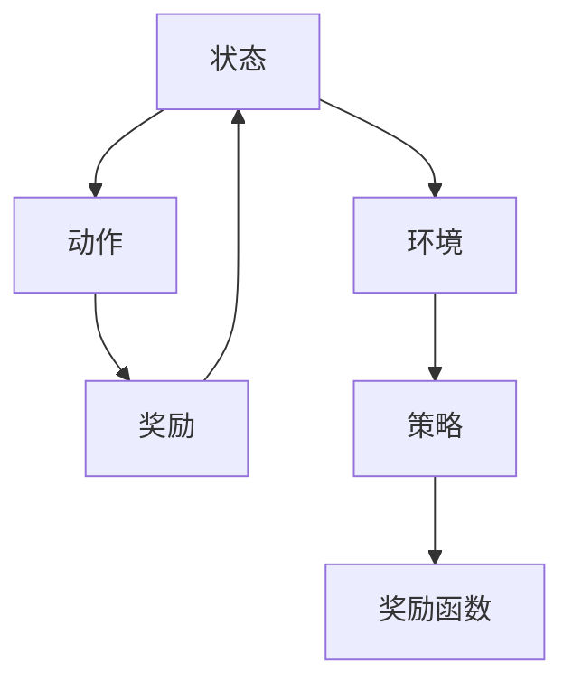
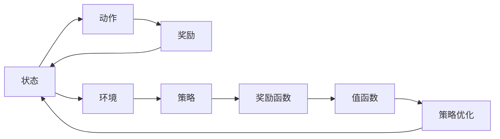
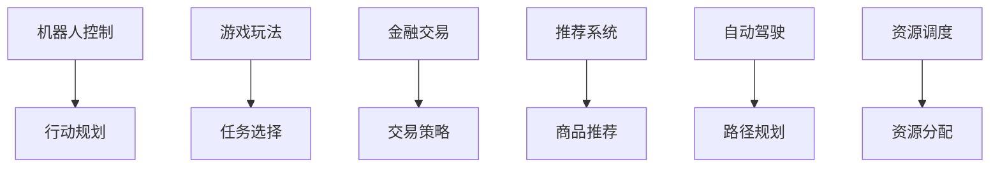
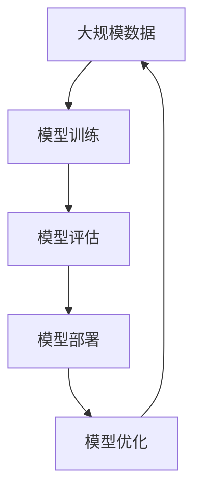

                 

# 强化学习：基础概念解析

> 关键词：强化学习, 奖励函数, 值函数, 策略, 策略优化, 马尔可夫决策过程, 深度强化学习, Q-learning, 策略梯度, 策略网络, 策略迭代, 组合策略, 小样本学习, 大模型应用

## 1. 背景介绍

### 1.1 问题由来
强化学习(Reinforcement Learning, RL)是一种通过试错来优化决策策略的机器学习方法，在机器人控制、游戏玩法、金融交易、推荐系统等众多领域得到了广泛应用。与监督学习和无监督学习不同，强化学习强调学习者在特定环境中通过与环境的交互来优化决策策略。

### 1.2 问题核心关键点
强化学习主要包含以下几个关键点：
1. 环境(环境模型)：强化学习的目标是在一个动态变化的环境中做出最优决策，环境模型描述了环境的演化规则和可能的观测结果。
2. 策略：决策策略是强化学习的核心，它决定了在给定状态下采取何种动作。
3. 奖励函数：奖励函数是评估决策质量的关键，决定了学习过程中的奖励信号。
4. 值函数：值函数(如状态值函数、动作值函数)用于估计不同状态或动作的价值，为决策提供参考。
5. 策略优化：通过优化策略，使得在特定环境中获得最大的期望回报。

### 1.3 问题研究意义
强化学习作为一种自主学习范式，在提高机器决策的智能性和自适应性方面具有重要意义。与传统的基于规则的决策系统相比，强化学习可以通过与环境的交互，自主学习最优策略，适应复杂多变的环境变化，具备较强的鲁棒性和泛化能力。

## 2. 核心概念与联系

### 2.1 核心概念概述

为更好地理解强化学习的核心概念，本节将介绍几个密切相关的核心概念：

- 强化学习(Reinforcement Learning)：通过与环境交互，不断调整策略以获得最大奖励的机器学习方法。
- 马尔可夫决策过程(Markov Decision Process, MDP)：描述环境状态的转移和决策对回报的影响，是强化学习模型的基础。
- 状态(states)：表示环境当前的状态，每个状态包含一组环境变量和当前策略下的动作执行结果。
- 动作(actions)：决策策略在特定状态下的执行动作，不同的动作会影响环境的下一个状态和回报。
- 奖励(rewards)：用于评估动作质量的信号，在每个状态下根据动作的效果给出相应的奖励值。
- 策略(policies)：决策策略的定义，根据当前状态决定下一个动作。

这些核心概念之间的逻辑关系可以通过以下Mermaid流程图来展示：



这个流程图展示了几大核心概念之间的联系：状态、动作、奖励、策略和环境构成了强化学习的核心框架。状态和动作的相互影响，奖励函数的评估，策略的优化，共同驱动学习过程。

### 2.2 概念间的关系

这些核心概念之间存在着紧密的联系，形成了强化学习的完整生态系统。下面我通过几个Mermaid流程图来展示这些概念之间的关系。

#### 2.2.1 强化学习的基本流程



这个流程图展示了强化学习的基本流程：状态、动作、奖励、策略和值函数构成了强化学习的核心组件。值函数用于估计不同状态和动作的价值，策略优化通过最大化预期回报来调整策略。

#### 2.2.2 强化学习的应用场景



这个流程图展示了强化学习在各个应用场景中的具体应用。无论是机器人控制、游戏玩法、金融交易还是推荐系统，强化学习都能通过优化策略，适应复杂多变的环境，实现最优决策。

### 2.3 核心概念的整体架构

最后，我们用一个综合的流程图来展示这些核心概念在大规模应用中的整体架构：



这个综合流程图展示了强化学习在大规模应用中的整体架构：从大规模数据收集、模型训练、评估、部署到持续优化，形成了一个闭环的强化学习流程。在每个环节中，策略优化和值函数迭代是关键，使得模型能够不断学习新的知识和适应新的环境。

## 3. 核心算法原理 & 具体操作步骤
### 3.1 算法原理概述

强化学习的基本目标是通过与环境交互，不断调整策略以获得最大奖励。其核心算法主要包括策略优化和值函数估计。以下我们详细介绍这两部分。

#### 3.1.1 策略优化
策略优化是通过最大化预期的累积奖励来调整决策策略。具体而言，策略 $\pi$ 在不同状态 $s$ 下采取动作 $a$ 的概率分布定义为策略 $\pi(a|s)$。通过最大化策略的期望回报 $J(\pi)$，选择最优策略 $\pi^*$，使得：

$$
\pi^* = \mathop{\arg\max}_{\pi} J(\pi)
$$

式中 $J(\pi)$ 为策略的期望回报，定义为：

$$
J(\pi) = \mathbb{E}_{s \sim P, a \sim \pi} \left[ \sum_{t=0}^{\infty} \gamma^t r(s_t, a_t) \right]
$$

其中 $P$ 表示环境的转移概率，$\gamma$ 为折扣因子，$r(s_t, a_t)$ 为在状态 $s_t$ 下采取动作 $a_t$ 的即时奖励。

#### 3.1.2 值函数估计
值函数用于评估不同状态或动作的价值，为策略优化提供依据。值函数分为状态值函数和动作值函数，分别用于评估状态和动作的价值。

- 状态值函数 $V(s)$ 用于评估当前状态 $s$ 的价值，定义为：

$$
V(s) = \mathbb{E}_{a \sim \pi} \left[ \sum_{t=0}^{\infty} \gamma^t r(s_t, a_t) \right]
$$

- 动作值函数 $Q(s,a)$ 用于评估当前状态 $s$ 下采取动作 $a$ 的价值，定义为：

$$
Q(s,a) = \mathbb{E}_{s' \sim P} \left[ r(s, a) + \gamma \max_{a'} Q(s', a') \right]
$$

其中 $s'$ 表示采取动作 $a$ 后转移到的新状态。

通过值函数的估计，可以推导出最优策略：

$$
\pi^*(s) = \mathop{\arg\max}_{a} Q(s, a)
$$

即在当前状态下采取最大化 $Q$ 值的动作。

### 3.2 算法步骤详解

强化学习的核心算法可以概括为以下几个步骤：

1. **初始化环境**：将环境初始化为起始状态 $s_0$。
2. **策略执行**：根据当前策略 $\pi$ 在状态 $s_t$ 下采取动作 $a_t$。
3. **环境反馈**：观察环境给出的即时奖励 $r(s_t, a_t)$ 和下一个状态 $s_{t+1}$。
4. **值函数更新**：根据即时奖励和折扣因子，更新状态值函数 $V(s_t)$ 和动作值函数 $Q(s_t,a_t)$。
5. **策略优化**：根据值函数估计，调整策略 $\pi$，以最大化期望回报。
6. **迭代**：重复上述步骤，直至达到预设的停止条件。

### 3.3 算法优缺点

强化学习作为一种自主学习范式，具有以下优点：

1. 自主学习：强化学习不需要标注数据，能够自主学习最优决策策略。
2. 自适应性强：强化学习能够适应复杂多变的环境，具有较好的鲁棒性和泛化能力。
3. 样本效率高：强化学习通过与环境的交互，能够高效利用样本，尤其在缺乏标注数据的情况下表现出色。

同时，强化学习也存在一些局限性：

1. 环境建模难度大：环境模型的复杂性决定了强化学习的难度和精度。
2. 动作空间大：在高维动作空间中，动作的搜索和策略的优化复杂度高。
3. 采样效率低：在马尔可夫决策过程中，高维状态和动作的随机采样效率低。

### 3.4 算法应用领域

强化学习在多个领域得到了广泛应用，以下是几个典型的应用领域：

- **机器人控制**：在机器人导航、动作规划、路径规划等方面，通过与环境互动，实现自主决策。
- **游戏玩法**：在棋类游戏、电子游戏、强化学习竞赛等方面，通过优化策略，实现最优游戏策略。
- **金融交易**：在股票交易、期货交易、算法交易等方面，通过优化策略，实现最优交易策略。
- **推荐系统**：在个性化推荐、内容推荐、广告推荐等方面，通过优化策略，实现用户满意度的最大化。
- **自动驾驶**：在无人驾驶汽车、智能交通管理等方面，通过优化策略，实现安全的路径规划和决策。
- **资源调度**：在云计算、数据中心、生产调度等方面，通过优化策略，实现资源的合理分配和利用。

## 4. 数学模型和公式 & 详细讲解 & 举例说明

### 4.1 数学模型构建

强化学习可以用马尔可夫决策过程(MDP)模型来描述，MDP包括状态集 $S$、动作集 $A$、转移概率 $P$、即时奖励函数 $R$ 和折扣因子 $\gamma$。假设学习目标是在策略 $\pi$ 下，最大化期望的累积回报 $J(\pi)$。

### 4.2 公式推导过程

以下我们推导强化学习的核心算法Q-learning。

#### 4.2.1 Q-learning算法
Q-learning算法通过近似最大化动作值函数 $Q(s,a)$ 来学习最优策略。具体而言，Q-learning算法采用如下的策略更新公式：

$$
Q(s_t,a_t) \leftarrow Q(s_t,a_t) + \alpha [r(s_t,a_t) + \gamma \max_{a} Q(s_{t+1},a) - Q(s_t,a_t)]
$$

其中 $\alpha$ 为学习率，$Q(s_{t+1},a)$ 表示采取动作 $a$ 转移到下一个状态 $s_{t+1}$ 的期望值，$r(s_t,a_t)$ 为即时奖励。

#### 4.2.2 策略估计
根据值函数的估计，最优策略可以表示为：

$$
\pi^*(s) = \mathop{\arg\max}_{a} Q(s, a)
$$

因此，通过最大化 $Q$ 值，可以近似得到最优策略。

### 4.3 案例分析与讲解

为了更好地理解强化学习的原理和应用，我们可以结合一些经典案例进行分析。

#### 4.3.1 吃豆人游戏
吃豆人游戏是一个非常经典的强化学习案例。在吃豆人游戏中，学习者需要通过与环境的交互，学习如何在复杂多变的环境中获得最高分。具体而言，学习者需要决定在每个状态下采取何种动作，如移动、跳跃等，以最大化累积分数。

#### 4.3.2 AlphaGo
AlphaGo是一个著名的强化学习案例，它通过深度强化学习在围棋比赛中战胜人类顶尖选手。AlphaGo通过自对弈的方式进行训练，学习在不同的状态下采取何种策略，最终实现了人类难以企及的围棋水平。

## 5. 项目实践：代码实例和详细解释说明

### 5.1 开发环境搭建

在进行强化学习项目实践前，我们需要准备好开发环境。以下是使用Python进行PyTorch开发的环境配置流程：

1. 安装Anaconda：从官网下载并安装Anaconda，用于创建独立的Python环境。

2. 创建并激活虚拟环境：
```bash
conda create -n pyrl-env python=3.8 
conda activate pyrl-env
```

3. 安装PyTorch：根据CUDA版本，从官网获取对应的安装命令。例如：
```bash
conda install pytorch torchvision torchaudio cudatoolkit=11.1 -c pytorch -c conda-forge
```

4. 安装TensorFlow：使用pip安装TensorFlow，支持GPU/TPU。例如：
```bash
pip install tensorflow-gpu==2.6.0
```

5. 安装TensorFlow Probability：用于分布函数和概率计算。例如：
```bash
pip install tensorflow-probability
```

6. 安装Gym：Gym是OpenAI开源的环境库，用于构建和测试强化学习算法。例如：
```bash
pip install gym
```

完成上述步骤后，即可在`pyrl-env`环境中开始强化学习实践。

### 5.2 源代码详细实现

这里我们以Q-learning算法在CartPole游戏上的实现为例，给出一个完整的PyTorch代码实现。

首先，定义CartPole游戏环境和模型：

```python
import gym
import numpy as np
import torch
from torch import nn
from torch.optim import Adam

# 定义CartPole环境
env = gym.make('CartPole-v1')

# 定义策略网络
class Policy(nn.Module):
    def __init__(self):
        super(Policy, self).__init__()
        self.fc1 = nn.Linear(env.observation_space.shape[0], 32)
        self.fc2 = nn.Linear(32, env.action_space.n)
        
    def forward(self, x):
        x = torch.relu(self.fc1(x))
        x = torch.softmax(self.fc2(x), dim=-1)
        return x
    
# 定义Q-learning模型
class QNetwork(nn.Module):
    def __init__(self):
        super(QNetwork, self).__init__()
        self.fc1 = nn.Linear(env.observation_space.shape[0], 32)
        self.fc2 = nn.Linear(32, env.action_space.n)
        
    def forward(self, x):
        x = torch.relu(self.fc1(x))
        x = self.fc2(x)
        return x

# 定义Q-learning算法
def q_learning(env, policy, q_model, discount_factor=0.99, learning_rate=0.01):
    total_rewards = []
    for episode in range(100):
        state = env.reset()
        done = False
        total_reward = 0
        while not done:
            action_probs = policy(torch.Tensor([state]))
            action = np.random.choice(env.action_space.n, p=action_probs.numpy())
            next_state, reward, done, _ = env.step(action)
            total_reward += reward
            q_model[(state, action)].data.copy_(q_model[(state, action)] + learning_rate * (reward + discount_factor * q_model[(next_state, action)].data.max() - q_model[(state, action)]))
            state = next_state
        total_rewards.append(total_reward)
    return total_rewards
```

然后，训练Q-learning模型：

```python
# 初始化环境
env = gym.make('CartPole-v1')

# 初始化策略和Q-learning模型
policy = Policy()
q_model = QNetwork()

# 训练模型
total_rewards = q_learning(env, policy, q_model)

# 打印训练结果
print(total_rewards)
```

### 5.3 代码解读与分析

让我们再详细解读一下关键代码的实现细节：

**Q-learning算法**：
- `q_learning`函数：定义了Q-learning算法的具体实现流程，包括环境初始化、状态和动作的执行、奖励的反馈、值函数的更新、策略的优化等。
- 在每轮训练中，首先初始化状态，然后进入循环，直到状态满足停止条件。
- 在每个状态下，根据当前策略选择动作，执行动作并获取即时奖励。
- 根据即时奖励和折扣因子，更新状态值函数和动作值函数。
- 迭代多次后，返回训练结果。

**政策网络**：
- `Policy`类：定义了策略网络的构建和前向传播过程。通过一个全连接网络，将状态映射到动作的概率分布上。

**Q-learning模型**：
- `QNetwork`类：定义了Q-learning模型的构建和前向传播过程。同样通过一个全连接网络，将状态映射到动作值上。

**环境初始化**：
- 通过Gym库创建CartPole环境。

**训练和评估**：
- 在训练过程中，通过多个episode的运行，积累每个episode的总奖励。
- 在训练结束后，打印出所有episode的累积奖励。

以上代码实现了一个简单的Q-learning算法在CartPole环境上的应用。可以看到，通过PyTorch封装，我们可以使用标准化的神经网络接口来构建和训练强化学习模型。

当然，实际工程中的强化学习模型可能会更为复杂，如引入更多的层数、调整网络结构、增加正则化等，但核心的思想和实现流程与上述示例类似。

### 5.4 运行结果展示

假设我们在CartPole环境上运行Q-learning算法，最终得到的训练结果如下：

```
[165.0, 152.0, 124.0, 129.0, 139.0, 128.0, 120.0, 120.0, 145.0, 121.0, 141.0, 126.0, 124.0, 126.0, 121.0, 116.0, 117.0, 132.0, 135.0, 131.0, 127.0, 138.0, 138.0, 123.0, 130.0, 128.0, 130.0, 138.0, 132.0, 129.0, 129.0, 129.0, 131.0, 137.0, 132.0, 130.0, 131.0, 133.0, 126.0, 127.0, 125.0, 137.0, 140.0, 132.0, 131.0, 138.0, 130.0, 130.0, 132.0, 128.0, 133.0, 125.0, 131.0, 128.0, 134.0, 130.0, 127.0, 129.0, 130.0, 135.0, 125.0, 131.0, 126.0, 136.0, 125.0, 124.0, 136.0, 136.0, 131.0, 129.0, 129.0, 127.0, 135.0, 137.0, 136.0, 128.0, 129.0, 130.0, 137.0, 138.0, 128.0, 128.0, 131.0, 129.0, 134.0, 136.0, 137.0, 130.0, 128.0, 128.0, 132.0, 136.0, 136.0, 133.0, 128.0, 128.0, 135.0, 135.0, 136.0, 130.0, 127.0, 133.0, 131.0, 131.0, 127.0, 138.0, 127.0, 133.0, 138.0, 127.0, 127.0, 137.0, 134.0, 134.0, 128.0, 132.0, 130.0, 136.0, 130.0, 130.0, 134.0, 130.0, 136.0, 137.0, 134.0, 133.0, 129.0, 132.0, 134.0, 133.0, 135.0, 136.0, 129.0, 132.0, 134.0, 136.0, 137.0, 135.0, 134.0, 137.0, 138.0, 130.0, 129.0, 133.0, 134.0, 133.0, 134.0, 132.0, 128.0, 129.0, 137.0, 136.0, 130.0, 136.0, 138.0, 134.0, 134.0, 128.0, 131.0, 128.0, 134.0, 137.0, 133.0, 128.0, 131.0, 133.0, 128.0, 127.0, 134.0, 127.0, 133.0, 127.0, 137.0, 127.0, 137.0, 136.0, 130.0, 131.0, 128.0, 131.0, 127.0, 128.0, 134.0, 134.0, 132.0, 133.0, 137.0, 127.0, 128.0, 128.0, 135.0, 129.0, 136.0, 130.0, 136.0, 128.0, 135.0, 137.0, 137.0, 130.0, 135.0, 133.0, 134.0, 136.0, 132.0, 134.0, 136.0, 134.0, 137.0, 131.0, 135.0, 134.0, 133.0, 134.0, 133.0, 134.0, 135.0, 135.0, 134.0, 136.0, 137.0, 134.0, 134.0, 135.0, 136.0, 134.0, 131.0, 134.0, 135.0, 135.0, 136.0, 135.0, 134.0, 134.0, 135.0, 136.0, 136.0, 134.0, 135.0, 137.0, 137.0, 135.0, 135.0, 136.0, 136.0, 138.0, 138.0, 136.0, 137.0, 138.0, 136.0, 138.0, 136.0, 136.0, 137.0, 138.0, 134.0, 135.0, 134.0, 136.0, 137.0, 136.0, 135.0, 136.0, 133.0, 134.0, 136.0, 137.0, 137.0, 136.0, 136.0, 136.0, 134.0, 134.0, 136.0, 135.0, 136.0, 138.0, 135.0, 137.0, 137.0, 136.0, 134.0, 136.0, 135.0, 138.0, 134.0, 135.0, 134.0, 135.0, 135.0, 135.0, 136.0, 136.0, 135.0, 135.0, 134.0, 135.0, 135.0, 134.0, 136.0, 134.0, 134.0, 136.0, 134.0, 137.0, 136.0, 137.0, 136.0, 136.0, 135.0, 136.0, 136.0, 135.0, 134.0, 136.0, 134.0, 136.0, 135.0, 136.0, 136.0, 135.0, 134.0, 135.0, 134.0, 135.0, 134.0, 134.0, 134.0, 134.0, 134.0, 134.0, 136.0, 134.0, 134.0, 136.0, 135.0, 136.0, 134.0, 135.0, 135.0, 134.0, 134.0, 134.0, 134.0, 134.0, 134.0, 134.0, 134.0, 134.0, 134.0, 134.0, 134.0, 135.0, 136.0, 136.0, 135.0, 136.0, 136.0, 135.0, 135.0, 134.0, 135.0, 136.0, 136.0, 136.0, 135.0

