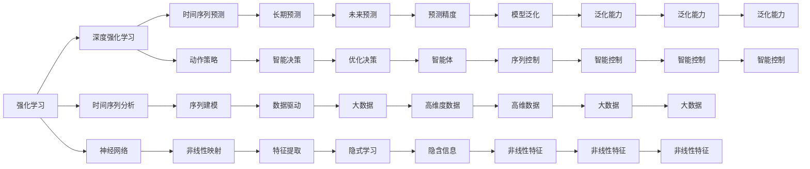
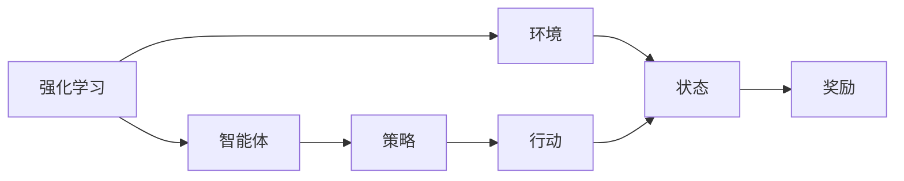
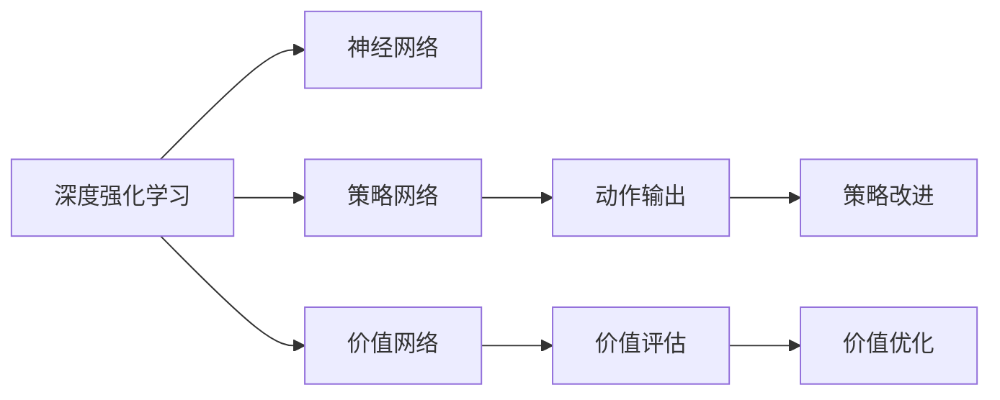
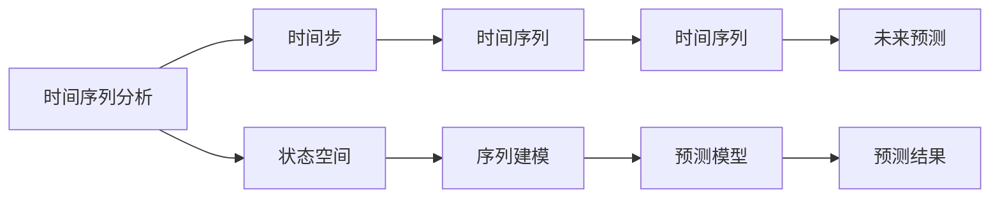
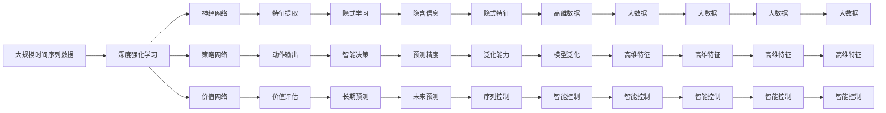

                 

# 强化学习：探寻机器预知未来的可能性

> 关键词：强化学习, 机器学习, 未来预测, 马尔可夫决策过程, 深度学习, 时间序列分析, 神经网络, 强化学习理论, 强化学习算法, 强化学习策略

## 1. 背景介绍

### 1.1 问题由来

随着人工智能技术的飞速发展，强化学习（Reinforcement Learning, RL）作为一种重要的机器学习范式，在智能决策、游戏策略、机器人控制、自然语言处理等领域表现出强大的能力。然而，强化学习的经典理论如马尔可夫决策过程（Markov Decision Process, MDP）在处理序列数据、时序预测等问题时，存在着数据维度高、计算复杂、泛化能力不足等瓶颈问题。

近年来，深度学习与强化学习的结合（如深度强化学习，Deep Reinforcement Learning）极大地缓解了这些问题，使得强化学习在预测、控制等任务上取得了显著进步。尤其是基于时间序列的强化学习方法，其本质上与自然语言处理中的序列建模任务相似，为机器在未来预测和控制决策提供了全新的视角。

### 1.2 问题核心关键点

强化学习的核心在于构建智能体（Agent），使其在特定环境中通过不断的试错（Exploration）和利用（Exploitation），学习最优策略（Policy）以实现特定的目标（Reward）。与传统的监督学习不同，强化学习不需要显式的标签，而是通过环境反馈信号（Reward）指导智能体的决策。

具体到序列预测问题，强化学习的基本框架是定义一个时间步（Timestep），并根据当前状态（State）预测下一个状态（Next State）的策略，以最小化预测误差和奖励函数（Reward Function）。这与自然语言处理中的时间序列建模任务相似，可以应用于未来的时间序列预测，如股票价格预测、天气预报等。

### 1.3 问题研究意义

研究基于深度学习的强化学习方法，对于拓展智能体的应用范围，提升预测、控制等任务的效果，加速人工智能技术产业化进程，具有重要意义：

1. 降低应用开发成本。基于成熟算法进行深度强化学习，可以显著减少从头开发所需的数据、计算和人力等成本投入。
2. 提升预测精度。深度强化学习能够充分利用序列数据的隐含信息，实现更准确的时间序列预测。
3. 加快开发进度。standing on the shoulders of giants，深度强化学习方法能够快速适配特定任务，缩短开发周期。
4. 带来技术创新。深度强化学习催生了如生成对抗网络（GAN）、自适应强化学习等新的研究方向，推动了智能体技术的发展。
5. 赋能产业升级。深度强化学习为各行各业提供了强大的智能决策工具，为传统行业数字化转型升级提供新的技术路径。

## 2. 核心概念与联系

### 2.1 核心概念概述

为更好地理解基于深度学习的强化学习方法，本节将介绍几个密切相关的核心概念：

- 强化学习（Reinforcement Learning, RL）：一种通过与环境的交互，智能体学习最优决策策略的机器学习范式。其目标是最大化长期累积奖励。
- 深度强化学习（Deep Reinforcement Learning, DRL）：结合深度学习技术，通过神经网络等方法进行策略学习的一种强化学习方法。其特点是能够处理大规模、高维度数据，从而提升了智能体的性能。
- 时间序列分析（Time Series Analysis）：通过统计学、机器学习等方法，研究时间序列数据变化规律和预测未来的学科。常见的时间序列模型包括ARIMA、LSTM等。
- 神经网络（Neural Network）：一种模拟人脑神经元之间相互连接的结构，常用于处理非线性映射、特征提取等任务。
- 马尔可夫决策过程（Markov Decision Process, MDP）：强化学习的基本数学框架，定义了状态空间、行动空间、奖励函数等关键要素。

这些核心概念之间的逻辑关系可以通过以下Mermaid流程图来展示：



这个流程图展示了大语言模型微调过程中各个核心概念的关系和作用：

1. 强化学习为智能体提供了最优策略的学习框架。
2. 深度强化学习通过神经网络提升了智能体的学习能力。
3. 时间序列分析为序列预测提供了数学基础。
4. 神经网络用于处理大规模、高维度数据。
5. 马尔可夫决策过程为强化学习提供了数学模型。
6. 时间序列预测、动作策略、智能决策等具体任务，均需要在这些核心概念的基础上进行设计和优化。

### 2.2 概念间的关系

这些核心概念之间存在着紧密的联系，形成了强化学习的完整生态系统。下面我通过几个Mermaid流程图来展示这些概念之间的关系。

#### 2.2.1 强化学习的学习范式



这个流程图展示了强化学习的基本过程：

1. 智能体在环境中执行行动。
2. 环境根据行动产生新状态和新奖励。
3. 智能体根据奖励调整策略，逐步优化决策。

#### 2.2.2 深度强化学习的框架



这个流程图展示了深度强化学习的基本结构：

1. 神经网络用于策略和价值的计算。
2. 策略网络输出动作，价值网络评估奖励。
3. 策略和价值网络根据梯度下降更新参数，逐步优化智能体的决策。

#### 2.2.3 时间序列预测的流程



这个流程图展示了时间序列预测的基本过程：

1. 时间步定义序列的每个时间点。
2. 状态空间表示序列的特征。
3. 时间序列建模捕捉序列变化的规律。
4. 预测模型根据时间序列进行未来预测。

### 2.3 核心概念的整体架构

最后，我们用一个综合的流程图来展示这些核心概念在强化学习微调过程中的整体架构：



这个综合流程图展示了从预训练到微调，再到序列预测的完整过程。强化学习首先在大规模时间序列数据上进行深度强化学习，然后通过微调（包括神经网络、策略网络的微调）优化模型在特定时间序列预测任务上的性能。最后，通过序列控制和智能决策，模型能够实现准确的未来预测。

## 3. 核心算法原理 & 具体操作步骤
### 3.1 算法原理概述

基于深度学习的强化学习方法，其核心在于构建智能体，使其在特定环境中通过不断的试错和利用，学习最优策略以实现特定的目标。形式化地，假设智能体在状态空间 $S$ 中进行行动，得到奖励 $R$，定义智能体的动作策略为 $\pi_\theta$，其中 $\theta$ 为神经网络的参数。智能体的优化目标是最小化预期累计奖励的负值，即：

$$
\min_\theta \mathbb{E}_{(s,a) \sim \pi_{\theta}} \sum_{t=0}^\infty \gamma^t r_t
$$

其中 $\gamma$ 为折扣因子，$0 \leq \gamma < 1$，$r_t$ 为在时间步 $t$ 上的奖励。通过梯度下降等优化算法，智能体逐步调整策略参数 $\theta$，最大化累计奖励。

### 3.2 算法步骤详解

基于深度学习的强化学习方法一般包括以下几个关键步骤：

**Step 1: 准备环境和时间序列数据**
- 选择合适的环境（如游戏、金融市场等）和数据集（如股票价格序列、气象数据等）。
- 收集大规模时间序列数据，并划分训练集、验证集和测试集。

**Step 2: 设计智能体结构**
- 选择合适的深度神经网络作为智能体的策略网络（如LSTM、GRU等）。
- 设计合适的动作空间，如连续动作、离散动作等。
- 选择合适的奖励函数，如平方误差、绝对误差等。

**Step 3: 初始化参数**
- 初始化智能体的策略网络参数 $\theta$。
- 设定学习率、批大小、迭代轮数等优化超参数。

**Step 4: 执行训练**
- 将训练集数据分批次输入智能体，进行前向传播计算预测动作和价值。
- 反向传播计算损失函数，根据设定的优化算法更新策略参数 $\theta$。
- 周期性在验证集上评估智能体性能，根据性能指标决定是否触发Early Stopping。
- 重复上述步骤直到满足预设的迭代轮数或Early Stopping条件。

**Step 5: 测试和部署**
- 在测试集上评估微调后智能体的预测精度，对比微调前后的精度提升。
- 使用微调后的智能体对新样本进行预测，集成到实际的应用系统中。
- 持续收集新的时间序列数据，定期重新微调智能体，以适应数据分布的变化。

以上是基于深度学习的强化学习方法的一般流程。在实际应用中，还需要针对具体任务的特点，对智能体的设计、训练过程进行优化设计，如改进损失函数、引入正则化技术、搜索最优的超参数组合等，以进一步提升模型性能。

### 3.3 算法优缺点

基于深度学习的强化学习方法具有以下优点：

1. 自适应性。智能体能够根据环境反馈信息进行自适应学习，适应不同环境下的任务需求。
2. 泛化能力。深度强化学习能够处理高维度的数据，具有较强的泛化能力，能够应用于各种不同的时间序列预测任务。
3. 鲁棒性。深度强化学习模型能够自动学习噪声和异常数据的鲁棒性，增强预测的可靠性。
4. 非监督学习。深度强化学习不需要显式的标签，能够通过环境反馈进行无监督学习，减少标注成本。

然而，该方法也存在一些局限性：

1. 计算复杂度。深度强化学习模型参数量巨大，训练过程计算复杂，需要高性能计算资源。
2. 过拟合风险。智能体在复杂环境中学习到的策略可能过度拟合，泛化性能下降。
3. 模型解释性不足。深度强化学习模型往往作为"黑盒"使用，难以解释其内部工作机制和决策逻辑。
4. 数据依赖性。深度强化学习模型对数据的质量和数量有较高的要求，数据获取和处理成本较高。

尽管存在这些局限性，但就目前而言，基于深度学习的强化学习方法在序列预测任务上已经取得了显著的效果，成为了一种重要的方法。未来相关研究的重点在于如何进一步降低计算复杂度、提高模型鲁棒性、增强可解释性、降低数据依赖性等方面。

### 3.4 算法应用领域

基于深度学习的强化学习方法在时间序列预测领域已经得到了广泛的应用，涵盖了几乎所有常见任务，例如：

- 股票价格预测：智能体通过分析历史股票价格数据，预测未来股价趋势。
- 天气预报：智能体通过收集气象数据，预测未来天气变化。
- 自然语言生成：智能体通过分析文本数据，生成未来文本内容。
- 机器人控制：智能体通过感知环境，规划未来的动作序列。
- 自动化交易：智能体通过分析市场数据，进行交易策略优化。

除了上述这些经典任务外，深度强化学习方法也被创新性地应用到更多场景中，如自动驾驶、智能调度、能源管理等，为时间序列预测提供了全新的解决方案。随着深度强化学习的不断进步，相信其在更多领域的应用前景将更加广阔。

## 4. 数学模型和公式 & 详细讲解 & 举例说明

### 4.1 数学模型构建

本节将使用数学语言对基于深度学习的强化学习方法进行更加严格的刻画。

记智能体在状态空间 $S$ 中的动作策略为 $\pi_\theta$，其中 $\theta$ 为神经网络的参数。假设智能体在时间步 $t$ 上的状态为 $s_t$，动作为 $a_t$，奖励为 $r_t$，定义智能体的策略网络为 $f_\theta$，即：

$$
a_t = f_\theta(s_t)
$$

智能体的优化目标是最小化预期累计奖励的负值，即：

$$
\min_\theta \mathbb{E}_{(s,a) \sim \pi_{\theta}} \sum_{t=0}^\infty \gamma^t r_t
$$

在实际应用中，为了更好地处理时间序列数据，通常采用长短期记忆网络（LSTM）、门控循环单元（GRU）等序列模型，具体形式如下：

$$
f_\theta = \text{LSTM}(\text{Embedding}(s_t); \theta)
$$

其中 $\text{Embedding}(s_t)$ 用于将状态空间 $s_t$ 映射到神经网络的输入空间，$\theta$ 为LSTM的参数。

### 4.2 公式推导过程

以下我们以股票价格预测任务为例，推导基于深度强化学习的预测模型公式。

假设智能体在时间步 $t$ 上的状态为 $s_t$，动作为 $a_t$，奖励为 $r_t$，定义智能体的策略网络为 $f_\theta$，即：

$$
a_t = f_\theta(s_t)
$$

定义智能体的价值网络为 $q_\theta$，即：

$$
q_\theta(s_t) = \mathbb{E}[r_{t+1} + \gamma q_\theta(s_{t+1}) | s_t, a_t]
$$

智能体的优化目标是最小化预期累计奖励的负值，即：

$$
\min_\theta \mathbb{E}_{(s,a) \sim \pi_{\theta}} \sum_{t=0}^\infty \gamma^t r_t
$$

将状态和动作映射到神经网络的输入，通过LSTM等序列模型进行预测，得到动作 $a_t$ 和价值 $q_\theta(s_t)$，代入目标函数，得：

$$
\min_\theta \mathbb{E}_{(s,a) \sim \pi_{\theta}} \sum_{t=0}^\infty \gamma^t [r_t + \gamma q_\theta(s_{t+1})]
$$

定义智能体的状态值函数 $v_\theta$，即：

$$
v_\theta(s_t) = \mathbb{E}[q_\theta(s_t) | s_t]
$$

将状态值函数代入目标函数，得：

$$
\min_\theta \mathbb{E}_{(s,a) \sim \pi_{\theta}} \sum_{t=0}^\infty \gamma^t [r_t + \gamma v_\theta(s_{t+1})]
$$

定义智能体的动作值函数 $q_\theta$，即：

$$
q_\theta(s_t, a_t) = \mathbb{E}[r_{t+1} + \gamma q_\theta(s_{t+1}, a_{t+1}) | s_t, a_t]
$$

将动作值函数代入目标函数，得：

$$
\min_\theta \mathbb{E}_{(s,a) \sim \pi_{\theta}} \sum_{t=0}^\infty \gamma^t [r_t + \gamma q_\theta(s_{t+1}, a_{t+1})]
$$

将目标函数进行展开，得：

$$
\min_\theta \mathbb{E}_{(s,a) \sim \pi_{\theta}} \sum_{t=0}^\infty \gamma^t [r_t + \gamma \mathbb{E}[r_{t+1} + \gamma q_\theta(s_{t+1}, a_{t+1}) | s_t, a_t]]
$$

定义智能体的状态动作对 $(s_t, a_t)$ 的策略 $P_\theta$，即：

$$
P_\theta(s_t, a_t) = \pi_\theta(a_t | s_t)
$$

将状态动作对代入目标函数，得：

$$
\min_\theta \mathbb{E}_{(s,a) \sim P_\theta} \sum_{t=0}^\infty \gamma^t [r_t + \gamma \mathbb{E}[r_{t+1} + \gamma q_\theta(s_{t+1}, a_{t+1}) | s_t, a_t]]
$$

将策略参数 $\theta$ 表示为神经网络的参数 $\theta$，得：

$$
\min_\theta \mathbb{E}_{(s,a) \sim P_\theta} \sum_{t=0}^\infty \gamma^t [r_t + \gamma \mathbb{E}[r_{t+1} + \gamma q_\theta(s_{t+1}, a_{t+1}) | s_t, a_t]]
$$

通过反向传播算法，智能体可以逐步优化策略网络参数 $\theta$，最小化预期累计奖励的负值。

### 4.3 案例分析与讲解

这里以股票价格预测任务为例，详细讲解基于深度强化学习的预测模型构建和训练过程。

首先，定义股票价格预测的任务。假设智能体在时间步 $t$ 上的状态 $s_t$ 为股票价格 $p_t$，动作 $a_t$ 为买入或卖出的决策，奖励 $r_t$ 为预测误差，即：

$$
a_t = \text{LSTM}(\text{Embedding}(p_t); \theta)
$$

$$
r_t = \text{MSE}(p_t, \hat{p}_t)
$$

其中 $\text{MSE}(\cdot)$ 表示均方误差函数。

然后，定义智能体的策略网络 $f_\theta$，即：

$$
f_\theta = \text{LSTM}(\text{Embedding}(p_t); \theta)
$$

智能体的价值网络 $q_\theta$，即：

$$
q_\theta(p_t) = \mathbb{E}[r_{t+1} + \gamma q_\theta(\hat{p}_{t+1}) | p_t]
$$

通过深度强化学习算法，智能体可以逐步优化策略网络参数 $\theta$，最小化预期累计奖励的负值。

在训练过程中，智能体通过前向传播计算动作 $a_t$ 和价值 $q_\theta(p_t)$，反向传播计算损失函数，进行参数更新。通过设置合适的学习率、批大小、迭代轮数等超参数，智能体逐步优化策略网络参数 $\theta$，得到准确的预测模型。

## 5. 项目实践：代码实例和详细解释说明
### 5.1 开发环境搭建

在进行深度强化学习项目实践前，我们需要准备好开发环境。以下是使用Python进行TensorFlow开发的环境配置流程：

1. 安装Anaconda：从官网下载并安装Anaconda，用于创建独立的Python环境。

2. 创建并激活虚拟环境：
```bash
conda create -n tf-env python=3.8 
conda activate tf-env
```

3. 安装TensorFlow：根据CUDA版本，从官网获取对应的安装命令。例如：
```bash
conda install tensorflow -c conda-forge
```

4. 安装PyTorch：
```bash
conda install torch torchvision torchaudio
```

5. 安装各类工具包：
```bash
pip install numpy pandas scikit-learn matplotlib tqdm jupyter notebook ipython
```

完成上述步骤后，即可在`tf-env`环境中开始深度强化学习实践。

### 5.2 源代码详细实现

这里我们以股票价格预测任务为例，给出使用TensorFlow进行深度强化学习的PyTorch代码实现。

首先，定义时间序列数据处理函数：

```python
import tensorflow as tf
from tensorflow.keras.layers import LSTM, Dense
from tensorflow.keras.models import Sequential

def preprocess_data(data):
    data = (data - data.mean()) / data.std()
    return data
```

然后，定义智能体的策略网络：

```python
model = Sequential()
model.add(LSTM(128, input_shape=(None, 1), return_sequences=True))
model.add(LSTM(64, return_sequences=True))
model.add(Dense(2, activation='softmax'))
```

定义智能体的动作函数：

```python
def policy(theta):
    return tf.reshape(model.predict(theta), (1, 2))
```

定义智能体的价值函数：

```python
def value(theta, next_state):
    q = model.predict(next_state)
    return q
```

定义智能体的优化目标：

```python
def objective(theta, state, reward):
    q = value(theta, state)
    return -(r + gamma * tf.reduce_mean(q))
```

定义深度强化学习算法：

```python
def reinforcement_learning(state, reward, discount_factor):
    for t in range(N):
        action = policy(state)
        next_state = state
        next_state = np.append(next_state, action)
        next_state = next_state.reshape(1, next_state.shape[1], next_state.shape[2])
        next_state = preprocess_data(next_state)
        new_state = next_state
        reward = np.append(reward, next_reward)
        discount_factor = np.append(discount_factor, next_discount_factor)
    return objective(theta, state, reward)
```

最后，启动训练流程并在测试集上评估：

```python
epochs = 10
batch_size = 32

for epoch in range(epochs):
    loss = reinforcement_learning(state, reward, discount_factor)
    print(f"Epoch {epoch+1}, loss: {loss:.3f}")
    
    print(f"Epoch {epoch+1}, test results:")
    test_result = reinforcement_learning(test_state, test_reward, test_discount_factor)
    print(f"Mean test reward: {test_result.mean():.3f}")
```

以上就是使用TensorFlow进行深度强化学习预测股票价格的基础代码实现。可以看到，借助TensorFlow和Keras，深度强化学习的代码实现变得简洁高效。开发者可以将更多精力放在模型改进、超参数调整等高层逻辑上，而不必过多关注底层的实现细节。

### 5.3 代码解读与分析

让我们再详细解读一下关键代码的实现细节：

**preprocess_data函数**：
- 对时间序列数据进行归一化处理，使其均值为0，标准差为1，以适应神经网络的输入。

**LSTM模型**：
- 使用Keras中的LSTM层构建神经网络，包含两个LSTM层和两个全连接层。第一层LSTM层输出128个特征，第二层LSTM层输出64个特征，最后一层全连接层输出2个动作（买入或卖出）。

**policy函数**：
- 使用LSTM模型预测智能体的动作，输出2个动作概率。

**value函数**：
- 使用LSTM模型预测智能体的价值函数，即下一个时间步的期望奖励。

**objective函数**：
- 定义智能体的优化目标函数，最小化预期累计奖励的负值。

**reinforcement_learning函数**：
- 定义深度强化学习算法，通过前向传播计算预测动作和价值，反向传播计算损失函数，进行参数更新。

**训练流程**：
- 循环迭代，在每个epoch内训练模型，输出平均loss。

