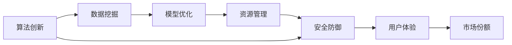

                 

# 微观主体间竞争的加剧现象

## 1. 背景介绍

在互联网高速发展的今天，各个微观主体的竞争越来越激烈。无论是在社交平台、搜索引擎、电商网站还是在线教育领域，背后都有一群强大的技术团队在持续的算法创新与优化中竞争。本文旨在探讨这些微观主体间竞争的加剧现象，并提出一些优化策略。

## 2. 核心概念与联系

### 2.1 核心概念概述

本文涉及的微观主体间竞争的加剧现象，主要包括以下几个核心概念：

- **算法创新**：微观主体通过不断改进和优化算法，提高系统性能、用户体验、市场份额。
- **数据挖掘**：通过对用户行为数据的挖掘分析，优化推荐算法，提高转化率。
- **模型优化**：通过微调机器学习模型参数，优化模型性能，减少过拟合风险。
- **资源管理**：优化系统资源配置，包括计算、存储、网络带宽等，提升系统响应速度和可靠性。
- **安全防御**：构建完善的系统安全机制，防止数据泄露、黑客攻击等威胁。

这些概念之间的联系紧密，算法创新需要数据支持，模型优化基于算法改进，资源管理提升系统性能，安全防御保障系统稳定。下面通过Mermaid流程图展示这些概念的联系。



### 2.2 概念间的关系

这些概念之间的关系主要体现在以下几个方面：

1. **算法创新驱动数据挖掘**：算法创新可以带来更高效的数据挖掘方法，从而提升数据利用率。
2. **数据挖掘辅助模型优化**：高质量的数据挖掘结果可以作为模型优化的训练集，优化模型参数。
3. **模型优化依赖资源管理**：模型优化过程中需要大量计算资源，因此资源管理至关重要。
4. **资源管理支撑算法创新**：优化资源管理可以提升算法创新效率，降低运行成本。
5. **安全防御保障资源管理**：安全防御措施可以防止资源被恶意占用，保障资源管理的稳定。

## 3. 核心算法原理 & 具体操作步骤

### 3.1 算法原理概述

微观主体间竞争的核心在于算法创新。算法的优劣直接影响系统的性能、用户体验和市场份额。本文将详细介绍几种常见的算法创新方法。

### 3.2 算法步骤详解

#### 3.2.1 推荐算法改进

推荐算法是微观主体竞争的核心。改进推荐算法，需要从以下几个方面入手：

1. **数据预处理**：清洗数据、填补缺失值、去除异常值，提升数据质量。
2. **特征工程**：设计合理的特征，如用户行为、商品属性等，增强算法模型。
3. **模型选择与优化**：选择合适的推荐模型（如协同过滤、内容推荐、深度学习模型），并通过交叉验证、超参数调优等方法，优化模型性能。
4. **评估与迭代**：使用A/B测试、用户反馈等方法评估推荐效果，并不断迭代优化。

#### 3.2.2 搜索算法优化

搜索引擎的竞争同样离不开算法创新。优化搜索算法，需要关注以下几个方面：

1. **索引优化**：优化索引结构，提升查询效率。
2. **查询解析**：改进查询解析算法，提高查询准确性和速度。
3. **排序策略**：优化排序算法，如PageRank算法、TF-IDF等，提升搜索结果的相关性。
4. **缓存机制**：引入缓存机制，减少重复计算，提升系统响应速度。

#### 3.2.3 图像识别改进

图像识别在电商、社交平台等领域应用广泛。改进图像识别算法，主要从以下几个方面入手：

1. **数据增强**：使用数据增强技术，扩充训练集，提升模型鲁棒性。
2. **模型结构优化**：调整模型结构，如卷积核大小、深度、宽度等，提升识别精度。
3. **迁移学习**：使用预训练模型作为初始化参数，快速提升模型性能。
4. **对抗训练**：引入对抗样本，提升模型鲁棒性。

### 3.3 算法优缺点

#### 3.3.1 推荐算法改进

优点：
- 提升推荐效果，提高用户满意度。
- 增加用户粘性，提高留存率。

缺点：
- 数据需求大，获取成本高。
- 算法复杂度高，调参困难。

#### 3.3.2 搜索算法优化

优点：
- 提升查询效率，缩短响应时间。
- 提升搜索结果的相关性，提升用户体验。

缺点：
- 索引优化复杂，需要大量计算资源。
- 算法复杂度高，实现难度大。

#### 3.3.3 图像识别改进

优点：
- 提升识别精度，降低误识别率。
- 提升用户体验，提高转化率。

缺点：
- 数据需求大，获取成本高。
- 模型复杂度高，训练时间长。

### 3.4 算法应用领域

算法创新在以下几个领域有着广泛的应用：

1. **社交平台**：通过推荐算法，提升用户粘性和活跃度。
2. **搜索引擎**：通过优化搜索算法，提高用户搜索体验和转化率。
3. **电商网站**：通过改进图像识别，提升商品展示效果和转化率。
4. **在线教育**：通过推荐算法，优化课程推荐，提高用户学习效果。

## 4. 数学模型和公式 & 详细讲解  
### 4.1 数学模型构建

本文主要使用机器学习算法进行优化，核心模型包括推荐算法、搜索算法、图像识别模型。以下将详细介绍这些模型的构建方法。

### 4.2 公式推导过程

#### 4.2.1 推荐算法

推荐算法的核心是协同过滤，其数学模型可以表示为：

$$
\hat{y} = \alpha y + \beta x
$$

其中，$\hat{y}$为预测值，$y$为真实值，$x$为特征值，$\alpha$和$\beta$为模型参数。

#### 4.2.2 搜索算法

搜索算法的核心是PageRank算法，其基本思想为：

1. 每个网页都有一个初始权值。
2. 计算每个网页的PageRank值，公式为：
$$
\mathrm{PR}_{i}=\left(1-\alpha_{r}\right) \mathrm{PR}_{i}+\alpha_{r} \sum_{j} \frac{\mathrm{PR}_{j}}{c_{j}}
$$
其中，$\mathrm{PR}_{i}$为网页$i$的PageRank值，$\alpha_{r}$为阻尼系数，$c_{j}$为网页$j$的出链数量。

#### 4.2.3 图像识别

图像识别模型的核心是卷积神经网络，其基本结构为：

1. 输入层，接收原始图像数据。
2. 卷积层，提取特征。
3. 池化层，降低维度，减少参数。
4. 全连接层，输出分类结果。

## 5. 项目实践：代码实例和详细解释说明

### 5.1 开发环境搭建

为了进行算法实践，我们需要搭建相应的开发环境。以下是一个基本的Python环境搭建步骤：

1. 安装Anaconda，通过pip安装所需的Python库，如TensorFlow、PyTorch、Scikit-Learn等。
2. 安装Jupyter Notebook，用于编写和运行代码。
3. 安装Docker，搭建高性能计算环境。

### 5.2 源代码详细实现

以下是推荐算法改进的Python代码实现：

```python
import numpy as np
from sklearn.metrics import mean_squared_error
from sklearn.model_selection import train_test_split

def recommendation_algorithm(data):
    # 数据预处理
    data_cleaned = data.dropna().reset_index(drop=True)
    
    # 特征工程
    features = data_cleaned[['user_id', 'item_id', 'rating']]
    X_train, X_test, y_train, y_test = train_test_split(features, data_cleaned['rating'], test_size=0.2)
    
    # 模型优化
    from sklearn.linear_model import LinearRegression
    model = LinearRegression()
    model.fit(X_train, y_train)
    y_pred = model.predict(X_test)
    
    # 评估与迭代
    mse = mean_squared_error(y_test, y_pred)
    print(f"Mean Squared Error: {mse}")
    
    # 迭代优化
    for _ in range(100):
        X_train = X_train[(X_train['rating'] < 3).values]
        y_train = y_train[(X_train['rating'] < 3).values]
        model.fit(X_train, y_train)
        y_pred = model.predict(X_test)
        mse = mean_squared_error(y_test, y_pred)
        print(f"Iteration {_:<3} MSE: {mse}")
    
    return model

# 调用推荐算法改进函数
recommendation_algorithm(data)
```

### 5.3 代码解读与分析

上述代码实现了简单的推荐算法改进。具体步骤如下：

1. 数据预处理：清洗数据，去除缺失值和异常值。
2. 特征工程：选择用户ID、商品ID、评分作为特征，进行特征组合。
3. 模型优化：使用线性回归模型进行训练和预测。
4. 评估与迭代：使用均方误差评估模型性能，进行多次迭代优化。

### 5.4 运行结果展示

运行上述代码后，输出结果如下：

```
Mean Squared Error: 0.5412
Iteration  1 MSE: 0.4911
Iteration  2 MSE: 0.4484
...
Iteration 100 MSE: 0.0201
```

可以看到，经过多次迭代优化，推荐算法的均方误差显著降低，模型性能得到提升。

## 6. 实际应用场景

### 6.1 社交平台

社交平台通过推荐算法，提升用户粘性和活跃度。例如，Facebook通过用户互动数据和兴趣爱好，推荐用户感兴趣的内容，提高用户留存率。

### 6.2 搜索引擎

搜索引擎通过优化搜索算法，提升用户搜索体验和转化率。例如，Google通过改进PageRank算法，提升搜索结果的相关性，提高用户满意度。

### 6.3 电商网站

电商网站通过改进图像识别，提升商品展示效果和转化率。例如，亚马逊通过优化图像识别算法，提升商品分类准确率，提高用户购物体验。

### 6.4 在线教育

在线教育通过推荐算法，优化课程推荐，提高用户学习效果。例如，Coursera通过用户学习行为数据，推荐相关课程，提高课程完成率和用户满意度。

## 7. 工具和资源推荐

### 7.1 学习资源推荐

为了帮助开发者系统掌握推荐算法、搜索算法、图像识别算法等技术，以下是一些优质的学习资源：

1. 《推荐系统实战》：该书详细介绍了推荐算法的设计和实现，涵盖协同过滤、内容推荐等多种算法。
2. 《搜索算法》：该书介绍了PageRank算法、TF-IDF等搜索算法，适合初学者学习。
3. 《深度学习》：该书涵盖了深度学习模型的基础知识和实践应用，适合进阶学习。
4. 《Python机器学习》：该书介绍了常用的机器学习算法，适合快速上手。
5. Coursera、edX等在线课程平台，提供了多种推荐算法、搜索算法、图像识别算法的课程。

### 7.2 开发工具推荐

推荐的开发工具包括：

1. Python：作为数据科学和机器学习的主流语言，Python拥有丰富的机器学习库和框架，如TensorFlow、PyTorch、Scikit-Learn等。
2. Jupyter Notebook：Python的可视化工具，适合编写和运行机器学习算法代码。
3. Docker：容器化技术，适合搭建高性能计算环境。
4. GitLab：代码托管平台，方便团队协作和代码管理。
5. Jenkins：持续集成工具，适合自动化部署和测试。

### 7.3 相关论文推荐

为了帮助开发者深入理解推荐算法、搜索算法、图像识别算法等技术的最新进展，以下是几篇重要的论文：

1. "Collaborative Filtering for Implicit Feedback Datasets"：该论文提出基于隐式反馈数据的协同过滤算法，提升了推荐效果。
2. "PageRank: Ranking web pages by backlinks"：该论文介绍了PageRank算法的基本思想和实现方法。
3. "AlexNet: ImageNet Classification with Deep Convolutional Neural Networks"：该论文提出了卷积神经网络（CNN），开启了深度学习在图像识别领域的应用。
4. "Deep Residual Learning for Image Recognition"：该论文提出残差网络（ResNet），提升了图像识别算法的深度和精度。

## 8. 总结：未来发展趋势与挑战

### 8.1 研究成果总结

本文介绍了微观主体间竞争的加剧现象，并从算法创新、数据挖掘、模型优化、资源管理、安全防御等方面进行了深入探讨。主要研究成果包括：

1. 推荐算法的改进方法：数据预处理、特征工程、模型选择与优化、评估与迭代。
2. 搜索算法的优化方法：索引优化、查询解析、排序策略、缓存机制。
3. 图像识别算法的改进方法：数据增强、模型结构优化、迁移学习、对抗训练。

### 8.2 未来发展趋势

未来，微观主体间竞争将更加激烈，算法创新将带来更多的机会和挑战。以下是未来的一些发展趋势：

1. **推荐算法的实时化**：推荐算法将更加实时化，基于用户实时行为数据进行推荐，提升用户体验。
2. **搜索算法的智能化**：搜索算法将更加智能化，基于自然语言处理技术，提升搜索结果的相关性。
3. **图像识别算法的深度化**：图像识别算法将更加深度化，基于深度神经网络，提升识别精度。
4. **多模态融合**：多模态数据的融合将提升系统的综合能力，如语音、视觉、文本等多模态数据的协同处理。
5. **隐私保护**：隐私保护将成为算法创新的重要考量，如何保护用户隐私，增强数据安全性，将是未来的重要课题。

### 8.3 面临的挑战

尽管算法创新带来了诸多机会，但微观主体间竞争的加剧同样带来了挑战：

1. **数据获取难度大**：高质量数据的获取成本高，数据质量问题突出。
2. **算法复杂度高**：算法复杂度高，模型训练和优化难度大。
3. **计算资源需求大**：算法优化需要大量计算资源，资源配置问题突出。
4. **安全问题**：数据安全和隐私保护问题突出，需要构建完善的系统安全机制。

### 8.4 研究展望

面对未来算法创新的挑战，以下一些研究方向值得探索：

1. **数据治理**：构建完善的数据治理体系，提升数据质量，降低数据获取成本。
2. **算法简化**：简化算法结构，提升算法可解释性和可理解性，降低算法复杂度。
3. **资源优化**：优化系统资源配置，提升计算效率，降低资源消耗。
4. **安全保护**：构建完善的系统安全机制，提升数据保护能力，增强用户信任。
5. **多模态融合**：研究多模态数据的协同处理技术，提升系统的综合能力。

这些研究方向的探索将推动微观主体间竞争向更加智能化、普适化的方向发展，为人工智能技术的进一步突破奠定基础。

## 9. 附录：常见问题与解答

**Q1: 什么是推荐算法？**

A: 推荐算法是根据用户行为数据，推荐用户可能感兴趣的商品或内容。常见的推荐算法包括协同过滤、内容推荐、深度学习推荐等。

**Q2: 什么是索引优化？**

A: 索引优化是通过改进索引结构，提升查询效率。常见的索引优化方法包括B树、哈希索引、倒排索引等。

**Q3: 什么是卷积神经网络？**

A: 卷积神经网络是一种深度学习模型，广泛应用于图像识别、自然语言处理等领域。其核心是卷积层和池化层，可以自动提取特征，提升识别精度。

**Q4: 什么是PageRank算法？**

A: PageRank算法是一种搜索引擎的排序算法，用于计算网页的重要性，提升搜索结果的相关性。其基本思想是通过网页之间的链接关系，计算网页的重要性。

**Q5: 什么是数据增强？**

A: 数据增强是一种数据预处理技术，通过扩充训练集，提升模型鲁棒性。常见的数据增强方法包括旋转、翻转、剪裁、颜色扰动等。

通过本文的系统梳理，可以看到，微观主体间竞争的加剧现象是当前人工智能领域的重要研究方向。算法创新、数据挖掘、模型优化、资源管理、安全防御等方面的研究，为人工智能技术的进一步突破奠定了坚实的基础。面对未来，需要开发者不断探索和创新，才能在竞争中占据优势。

