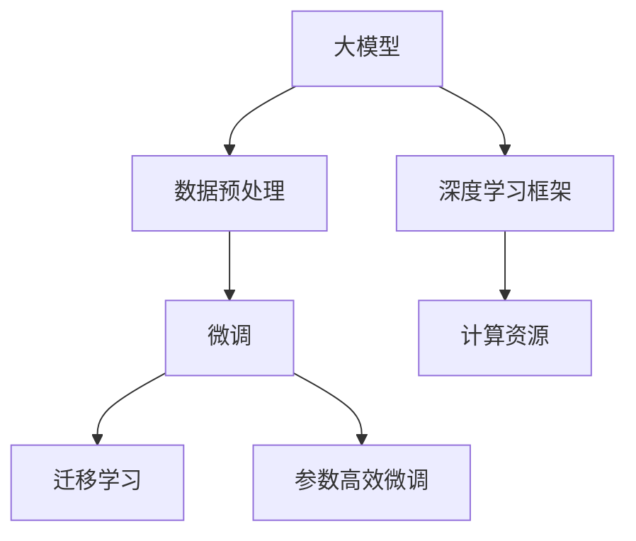

                 

# 技术创新：大模型创业的核心竞争力

## 1. 背景介绍

### 1.1 问题由来

在全球数字化转型加速的背景下，人工智能（AI）技术正逐渐成为各行业竞争力的关键所在。其中，大模型（Large Models）作为AI领域的突破性成果，凭借其强大的数据分析和决策支持能力，吸引了大量创业公司和投资者的关注。大模型不仅能够处理海量数据，提供精准的预测与决策支持，还能够帮助企业优化运营流程，提升业务效率，因此在各行各业都展现了广阔的应用前景。

### 1.2 问题核心关键点

大模型创业的核心竞争力主要体现在以下几个方面：

- **技术优势**：大模型在数据处理、模式识别、自然语言处理等方面的领先技术，能够为创业公司提供强大的技术支持。
- **数据积累**：随着行业的发展，数据规模和多样性不断增加，大模型能够通过海量数据训练，不断提升其准确性和泛化能力。
- **应用场景广泛**：从智能客服、金融分析到医疗诊断，大模型在众多领域都有广泛应用，能够为企业提供多样化的解决方案。
- **可扩展性强**：大模型架构灵活，可以适应不同的应用场景和需求，具有较强的可扩展性和适应性。
- **经济效益显著**：大模型通过降低运营成本、提高决策效率、优化资源配置等方式，为企业带来显著的经济效益。

### 1.3 问题研究意义

研究大模型创业的核心竞争力，对于创业公司、投资者和行业从业者来说具有重要意义：

- **指导创业方向**：深入理解大模型的技术优势和应用场景，有助于企业制定正确的创业策略，找到市场突破口。
- **评估投资价值**：通过分析大模型的技术成熟度和市场前景，投资者可以更准确地评估投资项目的潜力。
- **提升行业标准**：大模型技术的普及和应用，将推动行业整体技术水平的提升，加速AI技术的产业化进程。
- **促进创新发展**：基于大模型的技术创新能够为新兴产业带来新的增长点，推动经济结构的优化升级。
- **推动行业应用**：大模型的广泛应用将促进AI技术在各行业的深度融合，提升行业整体竞争力。

## 2. 核心概念与联系

### 2.1 核心概念概述

为了更好地理解大模型创业的核心竞争力，我们首先需要明确几个核心概念：

- **大模型（Large Models）**：指具有大量参数的深度学习模型，如BERT、GPT-3等。这些模型通常基于大规模数据进行预训练，能够捕捉到数据中的复杂模式和结构，具有较高的泛化能力。
- **数据预处理**：指在大模型训练前，对原始数据进行清洗、标注和格式转换等预处理工作，以提高数据质量和模型训练效率。
- **微调（Fine-tuning）**：指在大模型上加载特定领域的数据，通过有监督学习进行模型微调，以适应特定任务的需求。
- **迁移学习（Transfer Learning）**：指将预训练模型在不同领域任务间的知识迁移，减少新任务数据的需求，提升模型在特定任务上的性能。
- **参数高效微调（Parameter-Efficient Fine-tuning, PEFT）**：指在大模型微调时，仅更新少量参数，以减少计算资源消耗和避免过拟合。
- **深度学习框架（Deep Learning Frameworks）**：如TensorFlow、PyTorch等，提供高效的深度学习模型构建和训练工具。
- **计算资源（Computational Resources）**：指进行大模型训练和推理所需的硬件资源，如GPU、TPU等。

这些核心概念之间存在着紧密的联系，共同构成了大模型创业的基础框架。下面我们将通过Mermaid流程图来展示这些概念之间的关系：



这个流程图展示了从大模型到微调和迁移学习的基本流程，以及深度学习框架和计算资源的重要性。

### 2.2 概念间的关系

这些核心概念之间的关系主要体现在以下几个方面：

- **大模型与数据预处理**：大模型需要大量的高质量数据进行预处理，以提升模型的泛化能力和训练效果。
- **大模型与微调**：微调是大模型在特定任务上的优化过程，通过加载新数据进行微调，可以显著提升模型在该任务上的性能。
- **大模型与迁移学习**：迁移学习是大模型在不同任务间知识迁移的过程，能够减少新任务数据的需求，加速模型训练。
- **大模型与参数高效微调**：参数高效微调是在微调过程中减少计算资源消耗的技术，适用于大模型在特定任务上的微调。
- **深度学习框架与大模型**：深度学习框架提供了高效的工具和算法，使大模型的构建和训练更加便捷和高效。
- **计算资源与大模型**：大模型训练和推理需要强大的计算资源支持，如GPU、TPU等。

这些概念之间的联系和大模型创业的核心竞争力紧密相关，是大模型技术应用的基础。

## 3. 核心算法原理 & 具体操作步骤

### 3.1 算法原理概述

大模型创业的核心竞争力主要体现在以下几个算法原理上：

- **深度学习模型**：大模型通过深度学习模型进行训练，能够学习到数据的复杂模式和结构，具有较高的泛化能力。
- **自监督预训练**：大模型通常在无标签数据上进行自监督预训练，学习到丰富的语言表示和知识。
- **微调与迁移学习**：通过微调和迁移学习，大模型能够适应不同的任务和应用场景，提升模型性能。
- **参数高效微调**：在微调过程中，通过参数高效微调技术，减少计算资源消耗，提升模型效率。
- **多模态融合**：大模型支持多模态数据融合，能够结合文本、图像、语音等多种数据源，提升模型的理解能力和表现效果。

### 3.2 算法步骤详解

大模型创业的核心算法步骤主要包括：

1. **数据收集与预处理**：收集与任务相关的数据，并进行清洗、标注和格式转换等预处理工作，确保数据质量。
2. **模型构建与训练**：选择合适的深度学习模型（如BERT、GPT-3），使用深度学习框架进行模型构建和训练。
3. **微调与优化**：在预训练模型基础上，加载特定领域的数据进行微调，并使用正则化、对抗训练等技术优化模型性能。
4. **迁移学习与扩展**：将预训练模型应用到不同领域任务，通过迁移学习提升模型在特定任务上的性能，并根据需求进行扩展。
5. **参数高效微调与资源优化**：在微调过程中，使用参数高效微调技术减少计算资源消耗，优化模型资源使用。
6. **模型部署与应用**：将微调后的模型部署到生产环境，进行实时应用和性能监控，确保模型稳定运行。

### 3.3 算法优缺点

大模型创业在技术应用上具有以下优点：

- **泛化能力强**：大模型通过自监督预训练，学习到丰富的语言表示和知识，能够应对多种应用场景。
- **适应性强**：大模型能够适应不同领域的任务，通过微调和迁移学习，提升模型性能。
- **效率高**：参数高效微调技术能够减少计算资源消耗，提高模型训练和推理效率。

同时，大模型创业也面临一些挑战：

- **数据需求高**：大模型需要大量的高质量数据进行预训练和微调，数据收集和标注成本较高。
- **计算资源要求高**：大模型训练和推理需要强大的计算资源支持，如GPU、TPU等。
- **模型复杂度高**：大模型结构复杂，训练和微调过程需要较高的技术门槛。
- **解释性不足**：大模型作为黑盒模型，难以解释其内部工作机制和决策逻辑，缺乏透明性。
- **安全性问题**：大模型可能学习到有害信息，使用不当可能带来安全隐患。

### 3.4 算法应用领域

大模型创业在多个领域具有广泛的应用前景，包括但不限于以下几个方面：

- **智能客服**：通过大模型进行自然语言处理和语音识别，实现智能客服系统，提升客户满意度。
- **金融分析**：使用大模型进行数据挖掘和情感分析，提升金融市场的风险预测和决策支持能力。
- **医疗诊断**：利用大模型进行医学图像分析和病历分析，提升医疗诊断的准确性和效率。
- **智能推荐**：通过大模型进行用户行为分析和内容推荐，提升电商平台的推荐效果和用户体验。
- **内容生成**：利用大模型进行文本生成和图像生成，提升内容创作和媒体传播的效果。
- **数据分析**：使用大模型进行数据挖掘和模式识别，提升数据驱动决策的能力。

## 4. 数学模型和公式 & 详细讲解 & 举例说明

### 4.1 数学模型构建

大模型创业的数学模型主要基于深度学习框架进行构建，其中常用的模型包括BERT、GPT-3等。下面以BERT模型为例，展示其数学模型的构建过程：

```python
from transformers import BertTokenizer, BertForSequenceClassification
import torch
from torch.utils.data import Dataset, DataLoader

class CustomDataset(Dataset):
    def __init__(self, texts, labels):
        self.tokenizer = BertTokenizer.from_pretrained('bert-base-uncased')
        self.texts = texts
        self.labels = labels
    
    def __len__(self):
        return len(self.texts)
    
    def __getitem__(self, idx):
        text = self.texts[idx]
        label = self.labels[idx]
        encoding = self.tokenizer(text, truncation=True, padding=True, return_tensors='pt')
        input_ids = encoding['input_ids']
        attention_mask = encoding['attention_mask']
        return {
            'input_ids': input_ids,
            'attention_mask': attention_mask,
            'labels': torch.tensor(label, dtype=torch.long)
        }
```

### 4.2 公式推导过程

BERT模型的数学公式主要基于Transformer结构进行推导。以BERT的Masked Language Model (MLM)任务为例，其目标是通过预测掩码位置的词汇来提高模型的语言理解能力。具体公式如下：

- **输入表示**：将输入序列$x_i$转化为词嵌入向量$x_{i,\text{token}} \in \mathbb{R}^{d_{model}}$，其中$d_{model}$为词嵌入维度。
- **注意力机制**：在Transformer结构中，使用多头注意力机制计算$Q$、$K$、$V$三个矩阵，得到注意力权重矩阵$W_{QK}$。
- **前向传播**：将注意力权重矩阵与$V$矩阵相乘，得到加权向量$W_{QV}$，再通过层归一化、前馈网络等操作，得到最终的输出表示$h_i \in \mathbb{R}^{d_{model}}$。

### 4.3 案例分析与讲解

以BERT模型在情感分析任务上的应用为例，展示其数学模型和微调过程：

1. **数据准备**：收集情感分析任务的数据集，并进行数据预处理，如清洗、标注等。
2. **模型构建**：使用BERT模型作为初始化参数，搭建情感分析的微调模型。
3. **微调过程**：在微调过程中，使用交叉熵损失函数和AdamW优化器，对模型进行有监督学习。
4. **评估与优化**：在验证集上评估模型性能，根据评估结果调整超参数，如学习率、批次大小等。
5. **测试与应用**：在测试集上评估模型性能，并将其应用于实际应用场景中，进行情感分析。

## 5. 项目实践：代码实例和详细解释说明

### 5.1 开发环境搭建

在项目实践过程中，需要搭建完善的开发环境，以便于模型的训练和测试。以下是搭建Python开发环境的步骤：

1. **安装Python**：从官网下载并安装Python，推荐使用3.8及以上版本。
2. **安装虚拟环境**：使用conda或virtualenv创建虚拟环境，如：
   ```bash
   conda create -n pytorch-env python=3.8
   conda activate pytorch-env
   ```
3. **安装深度学习框架**：安装PyTorch、TensorFlow等深度学习框架，如：
   ```bash
   pip install torch torchvision torchaudio
   ```

### 5.2 源代码详细实现

以BERT模型在情感分析任务上的微调为例，展示其代码实现过程：

```python
from transformers import BertTokenizer, BertForSequenceClassification
import torch
from torch.utils.data import Dataset, DataLoader

class CustomDataset(Dataset):
    def __init__(self, texts, labels):
        self.tokenizer = BertTokenizer.from_pretrained('bert-base-uncased')
        self.texts = texts
        self.labels = labels
    
    def __len__(self):
        return len(self.texts)
    
    def __getitem__(self, idx):
        text = self.texts[idx]
        label = self.labels[idx]
        encoding = self.tokenizer(text, truncation=True, padding=True, return_tensors='pt')
        input_ids = encoding['input_ids']
        attention_mask = encoding['attention_mask']
        return {
            'input_ids': input_ids,
            'attention_mask': attention_mask,
            'labels': torch.tensor(label, dtype=torch.long)
        }

# 数据准备
tokenizer = BertTokenizer.from_pretrained('bert-base-uncased')
train_dataset = CustomDataset(train_texts, train_labels)
val_dataset = CustomDataset(val_texts, val_labels)
test_dataset = CustomDataset(test_texts, test_labels)

# 模型构建
model = BertForSequenceClassification.from_pretrained('bert-base-uncased', num_labels=2)
optimizer = AdamW(model.parameters(), lr=2e-5)

# 微调过程
device = torch.device('cuda' if torch.cuda.is_available() else 'cpu')
model.to(device)
for epoch in range(epochs):
    model.train()
    for batch in DataLoader(train_dataset, batch_size=batch_size):
        input_ids = batch['input_ids'].to(device)
        attention_mask = batch['attention_mask'].to(device)
        labels = batch['labels'].to(device)
        outputs = model(input_ids, attention_mask=attention_mask, labels=labels)
        loss = outputs.loss
        optimizer.zero_grad()
        loss.backward()
        optimizer.step()

    # 验证与评估
    model.eval()
    with torch.no_grad():
        val_loss = 0
        val_correct = 0
        for batch in DataLoader(val_dataset, batch_size=batch_size):
            input_ids = batch['input_ids'].to(device)
            attention_mask = batch['attention_mask'].to(device)
            labels = batch['labels'].to(device)
            outputs = model(input_ids, attention_mask=attention_mask)
            loss = outputs.loss
            val_loss += loss.item()
            val_correct += torch.argmax(outputs.logits, dim=1) == labels
        val_accuracy = val_correct / len(val_dataset)

    print(f"Epoch {epoch+1}, Val Loss: {val_loss / len(val_dataset)}, Val Accuracy: {val_accuracy}")
```

### 5.3 代码解读与分析

以上代码展示了BERT模型在情感分析任务上的微调过程，以下是关键代码的详细解读：

- **数据准备**：使用BERT的Tokenizer将文本序列转化为token ids，并进行padding和truncation处理。
- **模型构建**：使用BertForSequenceClassification类加载预训练的BERT模型，并进行微调。
- **微调过程**：在训练过程中，使用AdamW优化器和交叉熵损失函数进行有监督学习，并使用梯度累积技巧提高训练效率。
- **验证与评估**：在验证集上评估模型性能，计算损失和准确率，并根据评估结果调整学习率等超参数。
- **测试与应用**：在测试集上评估模型性能，并将模型应用于实际应用场景中。

## 6. 实际应用场景

### 6.1 智能客服系统

智能客服系统是大模型创业在实际应用中的典型场景之一。通过使用BERT模型进行自然语言处理和语音识别，实现智能客服系统，提升客户满意度。以下是一个智能客服系统的应用示例：

1. **数据收集与预处理**：收集客户咨询记录，并进行文本清洗、标注等预处理工作。
2. **模型构建与训练**：使用BERT模型作为初始化参数，搭建智能客服系统。
3. **微调与优化**：在微调过程中，使用正则化、对抗训练等技术优化模型性能。
4. **应用与反馈**：将微调后的模型部署到生产环境，进行实时应用，并根据用户反馈不断优化模型。

### 6.2 金融分析

金融分析是大模型创业在金融领域的典型应用场景之一。通过使用BERT模型进行数据挖掘和情感分析，提升金融市场的风险预测和决策支持能力。以下是一个金融分析系统的应用示例：

1. **数据准备**：收集金融市场的交易数据、新闻、评论等，并进行清洗、标注等预处理工作。
2. **模型构建与训练**：使用BERT模型作为初始化参数，搭建金融分析系统。
3. **微调与优化**：在微调过程中，使用正则化、对抗训练等技术优化模型性能。
4. **应用与反馈**：将微调后的模型部署到金融市场，进行实时分析，并根据市场反馈不断优化模型。

### 6.3 医疗诊断

医疗诊断是大模型创业在医疗领域的典型应用场景之一。通过使用BERT模型进行医学图像分析和病历分析，提升医疗诊断的准确性和效率。以下是一个医疗诊断系统的应用示例：

1. **数据准备**：收集医疗影像、病历、实验室检查等数据，并进行清洗、标注等预处理工作。
2. **模型构建与训练**：使用BERT模型作为初始化参数，搭建医疗诊断系统。
3. **微调与优化**：在微调过程中，使用正则化、对抗训练等技术优化模型性能。
4. **应用与反馈**：将微调后的模型部署到医疗系统，进行实时诊断，并根据医生反馈不断优化模型。

## 7. 工具和资源推荐

### 7.1 学习资源推荐

为了帮助开发者系统掌握大模型创业的理论基础和实践技巧，以下是一些优质的学习资源：

1. **《深度学习》课程**：由Coursera开设的深度学习课程，涵盖深度学习模型的基本概念和算法。
2. **《Transformer简介》论文**：Google论文，介绍了Transformer模型的原理和应用。
3. **《BERT: Pre-training of Deep Bidirectional Transformers for Language Understanding》论文**：Google论文，介绍了BERT模型的预训练和微调过程。
4. **《大模型与AI创业》书籍**：一本关于大模型创业的书籍，系统讲解了大模型在各个行业的应用场景和技术细节。
5. **HuggingFace官方文档**：提供丰富的预训练语言模型和微调样例，是学习大模型创业的必备资源。

### 7.2 开发工具推荐

开发大模型创业项目，需要选择合适的开发工具，以便于模型的训练和部署。以下是一些推荐的开发工具：

1. **PyTorch**：基于Python的开源深度学习框架，提供了丰富的模型构建和训练工具。
2. **TensorFlow**：由Google主导开发的深度学习框架，生产部署方便，支持多种硬件平台。
3. **TensorBoard**：TensorFlow配套的可视化工具，实时监测模型训练状态，提供丰富的图表呈现方式。
4. **Weights & Biases**：模型训练的实验跟踪工具，记录和可视化模型训练过程中的各项指标，方便对比和调优。
5. **Jupyter Notebook**：Python开发常用的笔记本工具，支持多种编程语言和库的集成，便于实验和文档记录。

### 7.3 相关论文推荐

大模型创业涉及的技术领域广泛，以下是一些值得关注的相关论文：

1. **Attention is All You Need**：Transformer模型的原论文，介绍了Transformer结构的设计和应用。
2. **BERT: Pre-training of Deep Bidirectional Transformers for Language Understanding**：BERT模型的论文，介绍了BERT模型的预训练和微调过程。
3. **Language Models are Unsupervised Multitask Learners**：GPT-2论文，展示了大模型在零样本学习和少样本学习方面的强大能力。
4. **AdaLoRA: Adaptive Low-Rank Adaptation for Parameter-Efficient Fine-Tuning**：提出了LoRA参数高效微调方法，减少了微调过程中的计算资源消耗。
5. **Parameter-Efficient Transfer Learning for NLP**：提出了 Adapter等参数高效微调方法，提升了微调模型的性能和效率。

## 8. 总结：未来发展趋势与挑战

### 8.1 总结

本文对大模型创业的核心竞争力进行了全面系统的介绍。通过深入理解大模型的技术优势和应用场景，帮助创业公司、投资者和行业从业者更好地把握大模型创业的方向和潜力。

### 8.2 未来发展趋势

展望未来，大模型创业将呈现以下几个发展趋势：

1. **技术成熟度提升**：随着大模型预训练和微调技术的不断进步，大模型创业的成熟度将不断提高，应用场景和性能将不断扩展。
2. **多模态融合发展**：未来的大模型创业将更加注重多模态数据的融合，提升系统的理解能力和表现效果。
3. **跨领域应用扩展**：大模型创业将更多地应用于各个垂直行业，如医疗、金融、教育等，提升行业整体竞争力。
4. **安全性和伦理问题重视**：大模型创业将更加重视系统的安全性和伦理问题，确保模型的应用符合人类价值观和伦理道德。
5. **自动化和智能化提升**：大模型创业将更加注重自动化和智能化，提升系统的自动化程度和智能化水平。

### 8.3 面临的挑战

尽管大模型创业具有广泛的应用前景，但也面临一些挑战：

1. **数据需求高**：大模型创业需要大量的高质量数据进行预训练和微调，数据收集和标注成本较高。
2. **计算资源要求高**：大模型训练和推理需要强大的计算资源支持，如GPU、TPU等。
3. **模型复杂度高**：大模型结构复杂，训练和微调过程需要较高的技术门槛。
4. **解释性不足**：大模型作为黑盒模型，难以解释其内部工作机制和决策逻辑，缺乏透明性。
5. **安全性问题**：大模型可能学习到有害信息，使用不当可能带来安全隐患。

### 8.4 研究展望

未来的大模型创业需要在以下几个方面进行进一步的研究：

1. **数据收集与标注自动化**：探索无监督和半监督微调方法，减少数据需求和标注成本。
2. **计算资源优化**：开发更加高效的模型架构和计算图，提高模型的训练和推理效率。
3. **模型解释性提升**：引入因果分析和博弈论工具，提升模型的可解释性和透明性。
4. **多模态融合**：将符号化的先验知识与神经网络模型结合，增强模型的理解能力和表现效果。
5. **跨领域知识整合**：将知识图谱、逻辑规则等专家知识与模型结合，提升系统的综合能力。

通过在这些领域的进一步研究，大模型创业将能够更好地发挥其技术优势，提升系统的性能和应用价值，推动AI技术的产业化进程。

## 9. 附录：常见问题与解答

### Q1: 大模型创业的难点有哪些？

A: 大模型创业的难点主要包括：
1. **数据需求高**：大模型创业需要大量的高质量数据进行预训练和微调，数据收集和标注成本较高。
2. **计算资源要求高**：大模型训练和推理需要强大的计算资源支持，如GPU、TPU等。
3. **模型复杂度高**：大模型结构复杂，训练和微调过程需要较高的技术门槛。
4. **解释性不足**：大模型作为黑盒模型，难以解释其内部工作机制和决策逻辑，缺乏透明性。
5. **安全性问题**：大模型可能学习到有害信息，使用不当可能带来安全隐患。

### Q2: 大模型创业的优势有哪些？

A: 大模型创业的优势主要包括：
1. **泛化能力强**：大模型通过自监督预训练，学习到丰富的语言表示和知识，能够应对多种应用场景。
2. **适应性强**：大模型能够适应不同领域的任务，通过微调和迁移学习，提升模型性能。
3. **效率高**：参数高效微调技术能够减少计算资源消耗，提高模型训练和推理效率。
4. **应用场景广泛**：大模型在智能客服、金融分析、医疗诊断、内容生成等领域具有广泛的应用前景。

### Q3: 大模型创业如何确保安全性？

A: 大模型创业需要采取以下措施确保安全性：
1. **数据隐私保护**：在数据收集和处理过程中，采取数据匿名化、加密等措施，确保数据隐私安全。
2. **模型安全审查**：在模型部署前，进行全面的安全审查，确保模型没有恶意行为。
3. **监控与预警**：部署后的模型需要实时监控，及时发现和处理异常行为，并设置告警机制。
4. **人工干预**：在模型输出不符合伦理道德时，进行人工干预和审核，确保模型输出符合人类价值观和伦理道德。

总之，大模型创业需要综合考虑技术、数据、资源等多方面因素，确保系统的安全性、高效性和透明性，才能更好地发挥其技术优势，推动AI技术的产业化进程。

---

作者：禅与计算机程序设计艺术 / Zen and the Art of Computer Programming

