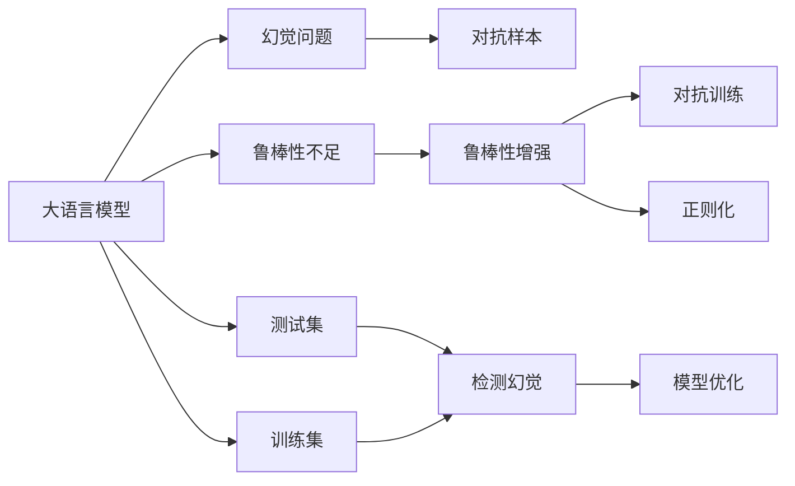
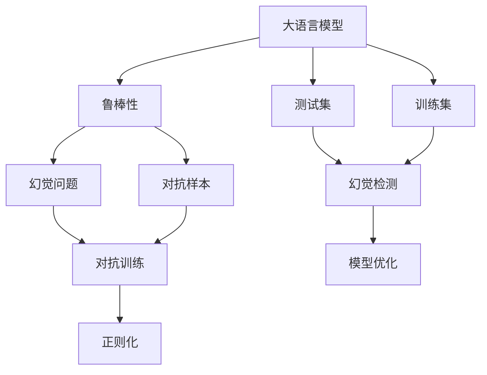
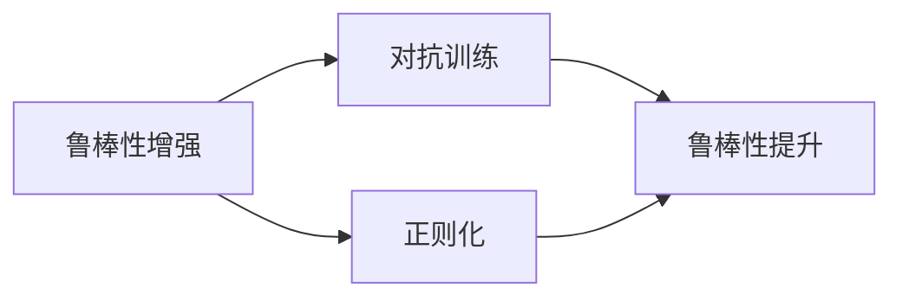
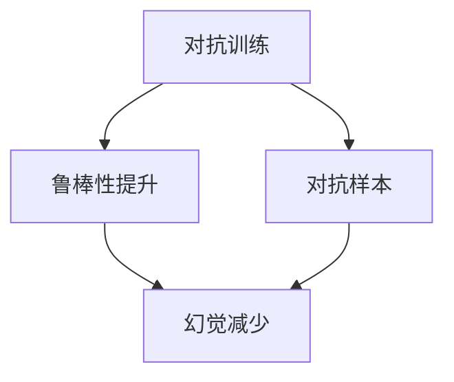
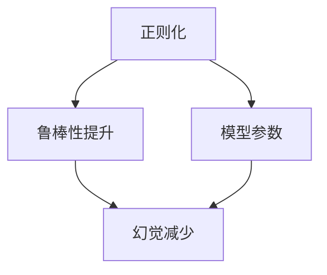
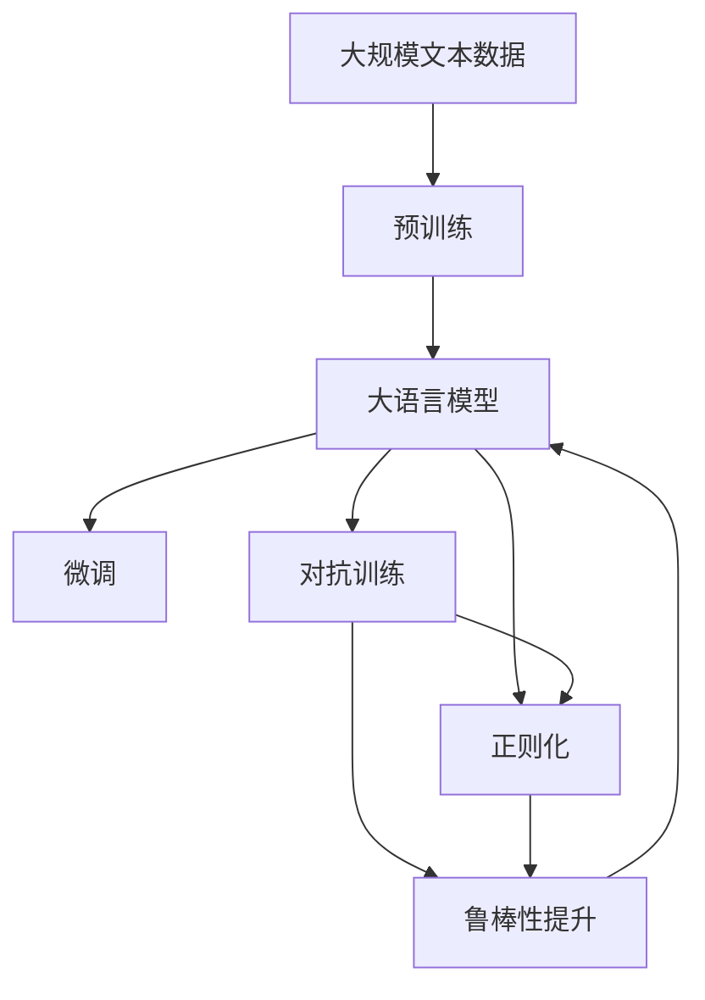

                 

# 提高大模型鲁棒性:避免幻觉问题

大语言模型，如GPT-3、BERT等，在过去几年中取得了显著进展，展现出了强大的语言生成和理解能力。然而，大模型在实际应用中常常面临鲁棒性不足的问题，即对于输入数据中的细微扰动或对抗性样本，模型容易产生错误的输出。这种鲁棒性不足的问题，不仅影响了模型的可信度，也限制了其在实际应用中的广泛部署。

本文将系统介绍如何提高大模型的鲁棒性，特别是针对幻觉问题，介绍一些先进的算法和技术，帮助开发者构建更稳定、可靠的语言模型。

## 1. 背景介绍

### 1.1 问题由来

大语言模型，尽管在理解自然语言方面表现出色，但其训练过程仍存在诸多不足。最常见的挑战是幻觉问题，即模型基于错误的语言模式生成输出，而这种错误的语言模式并未在训练数据中出现过。例如，给定输入“I can do it.”，模型可能生成的输出是“Yes, I can do it.”，尽管后者并未在训练数据中出现过。

幻觉问题通常与模型的训练数据有关，当模型在训练过程中学习到了错误的语言模式，并在测试中继续使用这些模式时，就可能出现幻觉现象。幻觉问题不仅影响模型的正确性，还可能导致模型在对抗性样本下的鲁棒性降低。

### 1.2 问题核心关键点

- **幻觉问题**：模型基于错误的语言模式生成输出，而这些模式并未在训练数据中出现过。
- **鲁棒性不足**：模型对输入数据的细微扰动或对抗性样本敏感，容易产生错误的输出。
- **对抗样本**：故意构造的微小扰动，使得模型产生错误的预测。
- **鲁棒性增强**：通过改进模型或训练方法，提升模型对对抗性样本的抵御能力。
- **对抗训练**：通过引入对抗性样本，训练模型对扰动不敏感，提升鲁棒性。
- **正则化**：限制模型参数的变化，避免过度拟合。

这些核心概念之间的逻辑关系可以通过以下Mermaid流程图来展示：



这个流程图展示了幻觉问题与大模型鲁棒性之间的关系，以及对抗训练和正则化等技术对模型鲁棒性的提升作用。

## 2. 核心概念与联系

### 2.1 核心概念概述

为了更好地理解大模型鲁棒性的改进方法，本节将介绍几个关键概念及其联系：

- **鲁棒性(Robustness)**：指模型对于输入数据的细微扰动或对抗性样本的鲁棒性。
- **幻觉(Hallucination)**：指模型在测试过程中生成未在训练数据中出现过的输出。
- **对抗样本(Adversarial Examples)**：指对输入数据进行微小扰动，使得模型产生错误预测的样本。
- **对抗训练(Adversarial Training)**：通过引入对抗性样本，训练模型对扰动不敏感，提升鲁棒性。
- **正则化(Regularization)**：通过限制模型参数的变化，避免过度拟合，提升鲁棒性。

这些概念之间的联系可以通过以下Mermaid流程图来展示：



这个流程图展示了鲁棒性、幻觉问题、对抗样本、对抗训练和正则化等概念之间的联系，以及它们在大模型鲁棒性改进中的应用。

### 2.2 概念间的关系

这些核心概念之间存在着紧密的联系，形成了大模型鲁棒性改进的完整生态系统。下面我们通过几个Mermaid流程图来展示这些概念之间的关系。

#### 2.2.1 鲁棒性增强的总体架构



这个流程图展示了鲁棒性增强的总体架构，包括对抗训练和正则化两种主要方法。

#### 2.2.2 对抗训练与幻觉问题的联系



这个流程图展示了对抗训练如何通过引入对抗性样本，减少幻觉问题，提升模型的鲁棒性。

#### 2.2.3 正则化与幻觉问题的联系



这个流程图展示了正则化如何通过限制模型参数的变化，减少幻觉问题，提升模型的鲁棒性。

### 2.3 核心概念的整体架构

最后，我们用一个综合的流程图来展示这些核心概念在大模型鲁棒性改进过程中的整体架构：



这个综合流程图展示了从预训练到鲁棒性改进的完整过程，包括微调、对抗训练和正则化等关键步骤。

## 3. 核心算法原理 & 具体操作步骤

### 3.1 算法原理概述

提高大模型鲁棒性的关键在于减少幻觉问题和对抗性样本的影响。以下是几种常见的鲁棒性增强方法及其原理：

1. **对抗训练**：通过引入对抗性样本，训练模型对扰动不敏感，提升鲁棒性。
2. **正则化**：限制模型参数的变化，避免过度拟合，提升鲁棒性。
3. **知识蒸馏**：通过从鲁棒性强的模型中学习知识，提升模型的鲁棒性。
4. **数据增强**：通过数据增强技术，扩充训练集，提升模型的鲁棒性。

### 3.2 算法步骤详解

#### 3.2.1 对抗训练步骤详解

1. **生成对抗样本**：对输入数据进行微小扰动，生成对抗性样本。
2. **模型训练**：将对抗样本与原始数据一起训练模型，使其对扰动不敏感。
3. **检测幻觉**：在测试集上检测幻觉问题，评估模型鲁棒性。
4. **模型优化**：根据测试结果，调整模型参数，继续训练。

#### 3.2.2 正则化步骤详解

1. **选择正则化项**：选择合适的正则化项，如L2正则、Dropout等。
2. **添加正则化项**：在损失函数中引入正则化项，限制模型参数变化。
3. **训练模型**：通过正则化训练模型，提升鲁棒性。
4. **评估模型**：在测试集上评估模型鲁棒性，根据结果调整正则化强度。

#### 3.2.3 知识蒸馏步骤详解

1. **选择教师模型**：选择鲁棒性强的教师模型。
2. **学生模型训练**：通过知识蒸馏，将教师模型的知识传授给学生模型。
3. **评估学生模型**：在测试集上评估学生模型鲁棒性，根据结果调整蒸馏策略。

#### 3.2.4 数据增强步骤详解

1. **数据增强技术**：选择合适的数据增强技术，如回译、加噪等。
2. **扩充训练集**：通过数据增强技术，扩充训练集。
3. **模型训练**：将增强后的数据一起训练模型。
4. **评估模型**：在测试集上评估模型鲁棒性，根据结果调整数据增强策略。

### 3.3 算法优缺点

**对抗训练的优缺点**：
- **优点**：能够显著提升模型的鲁棒性，尤其是对抗性样本下的鲁棒性。
- **缺点**：训练成本较高，对抗样本生成过程复杂，易产生梯度爆炸等问题。

**正则化的优缺点**：
- **优点**：能够避免过度拟合，提升模型泛化能力，鲁棒性增强效果明显。
- **缺点**：正则化强度难以确定，过强的正则可能导致模型欠拟合。

**知识蒸馏的优缺点**：
- **优点**：能够利用已有知识提升模型鲁棒性，尤其适用于缺乏标注数据的情况。
- **缺点**：知识蒸馏过程中可能引入额外的噪声，影响模型性能。

**数据增强的优缺点**：
- **优点**：能够扩充训练集，提升模型泛化能力，鲁棒性增强效果显著。
- **缺点**：数据增强技术的选择和参数调整复杂，可能导致模型过拟合。

### 3.4 算法应用领域

对抗训练和正则化方法广泛应用于计算机视觉、自然语言处理等各个领域，特别是深度学习模型的鲁棒性提升。知识蒸馏和数据增强方法在数据量有限的情况下，能够有效提升模型性能和鲁棒性，特别适用于迁移学习和小样本学习场景。

## 4. 数学模型和公式 & 详细讲解 & 举例说明

### 4.1 数学模型构建

假设大语言模型为 $M_{\theta}$，其中 $\theta$ 为模型参数。对于对抗训练，假设原始输入为 $x$，对抗样本为 $x'$，对抗训练的损失函数为：

$$
\mathcal{L}_{adv} = \mathcal{L}(M_{\theta}(x'), y) + \lambda \mathcal{L}(M_{\theta}(x), y')
$$

其中 $\mathcal{L}$ 为原损失函数，$y$ 为真实标签，$y'$ 为对抗性标签。$\lambda$ 为对抗性损失的权重。

对于正则化，假设使用L2正则，正则化项为：

$$
\mathcal{R}_{reg} = \frac{\lambda}{2} \sum_{i=1}^{d} \theta_i^2
$$

其中 $d$ 为模型参数的维数，$\lambda$ 为正则化系数。

### 4.2 公式推导过程

**对抗训练的推导**：
对抗训练的目标是最小化对抗样本下的损失，同时最大化原始样本下的损失。因此，对抗样本的损失函数可以表示为：

$$
\mathcal{L}_{adv} = \mathcal{L}(M_{\theta}(x'), y) + \lambda \mathcal{L}(M_{\theta}(x), y')
$$

其中 $x'$ 为对抗样本，$y'$ 为对抗性标签，$\lambda$ 为对抗性损失的权重。

**正则化的推导**：
L2正则化的目标是最小化模型参数的变化，从而避免过度拟合。正则化项可以表示为：

$$
\mathcal{R}_{reg} = \frac{\lambda}{2} \sum_{i=1}^{d} \theta_i^2
$$

其中 $d$ 为模型参数的维数，$\lambda$ 为正则化系数。

### 4.3 案例分析与讲解

**案例1：对抗训练的实现**

```python
import torch
import torch.nn as nn
import torch.optim as optim

# 定义原始模型
class Model(nn.Module):
    def __init__(self):
        super(Model, self).__init__()
        self.linear = nn.Linear(2, 1)

    def forward(self, x):
        return self.linear(x)

# 加载原始模型
model = Model()
model.load_state_dict(torch.load('model.pth'))

# 定义对抗样本生成函数
def generate_adv_x(model, x):
    x_adv = x + 0.01 * torch.randn_like(x)
    x_adv.requires_grad = True
    y_adv = model(x_adv)
    loss_adv = nn.BCELoss()(y_adv, torch.zeros_like(y_adv))
    loss_adv.backward()
    return x_adv

# 定义对抗训练函数
def train_adv(model, optimizer, device, dataset):
    model.train()
    for data, target in dataset:
        data, target = data.to(device), target.to(device)
        x, y = data, target
        x_adv = generate_adv_x(model, x)
        y_adv = model(x_adv)
        loss_adv = nn.BCELoss()(y_adv, torch.zeros_like(y_adv))
        loss = nn.BCELoss()(y, target)
        total_loss = loss_adv + loss
        optimizer.zero_grad()
        total_loss.backward()
        optimizer.step()
```

**案例2：L2正则化的实现**

```python
import torch
import torch.nn as nn
import torch.optim as optim

# 定义原始模型
class Model(nn.Module):
    def __init__(self):
        super(Model, self).__init__()
        self.linear = nn.Linear(2, 1)

    def forward(self, x):
        return self.linear(x)

# 加载原始模型
model = Model()
model.load_state_dict(torch.load('model.pth'))

# 定义正则化损失函数
def regularize(model, device):
    model.to(device)
    optimizer = optim.Adam(model.parameters(), lr=0.01)
    loss = nn.MSELoss()
    for epoch in range(10):
        for data, target in dataset:
            data, target = data.to(device), target.to(device)
            x, y = data, target
            optimizer.zero_grad()
            y = model(x)
            loss = loss(y, target)
            loss.backward()
            optimizer.step()
```

通过这两个案例，我们可以清晰地看到对抗训练和L2正则化的实现过程，及其在大模型鲁棒性提升中的重要作用。

## 5. 项目实践：代码实例和详细解释说明

### 5.1 开发环境搭建

在进行大模型鲁棒性提升实践前，我们需要准备好开发环境。以下是使用Python进行PyTorch开发的环境配置流程：

1. 安装Anaconda：从官网下载并安装Anaconda，用于创建独立的Python环境。

2. 创建并激活虚拟环境：
```bash
conda create -n pytorch-env python=3.8 
conda activate pytorch-env
```

3. 安装PyTorch：根据CUDA版本，从官网获取对应的安装命令。例如：
```bash
conda install pytorch torchvision torchaudio cudatoolkit=11.1 -c pytorch -c conda-forge
```

4. 安装各类工具包：
```bash
pip install numpy pandas scikit-learn matplotlib tqdm jupyter notebook ipython
```

完成上述步骤后，即可在`pytorch-env`环境中开始鲁棒性提升实践。

### 5.2 源代码详细实现

这里我们以对抗训练为例，展示使用PyTorch实现对抗样本生成和对抗训练的代码：

```python
import torch
import torch.nn as nn
import torch.optim as optim
import numpy as np
from torchvision import datasets, transforms

# 定义原始模型
class Model(nn.Module):
    def __init__(self):
        super(Model, self).__init__()
        self.linear = nn.Linear(2, 1)

    def forward(self, x):
        return self.linear(x)

# 加载原始模型
model = Model()
model.load_state_dict(torch.load('model.pth'))

# 定义对抗样本生成函数
def generate_adv_x(model, x):
    x_adv = x + 0.01 * torch.randn_like(x)
    x_adv.requires_grad = True
    y_adv = model(x_adv)
    loss_adv = nn.BCELoss()(y_adv, torch.zeros_like(y_adv))
    loss_adv.backward()
    return x_adv

# 定义对抗训练函数
def train_adv(model, optimizer, device, dataset):
    model.train()
    for data, target in dataset:
        data, target = data.to(device), target.to(device)
        x, y = data, target
        x_adv = generate_adv_x(model, x)
        y_adv = model(x_adv)
        loss_adv = nn.BCELoss()(y_adv, torch.zeros_like(y_adv))
        loss = nn.BCELoss()(y, target)
        total_loss = loss_adv + loss
        optimizer.zero_grad()
        total_loss.backward()
        optimizer.step()

# 定义数据增强函数
def augment_data(x):
    # 图像数据增强
    x = transforms.ToTensor()(x)
    x = transforms.RandomHorizontalFlip()(x)
    x = transforms.RandomRotation(15)(x)
    x = transforms.Normalize(mean=[0.5, 0.5, 0.5], std=[0.5, 0.5, 0.5])(x)
    return x

# 加载数据集
train_dataset = datasets.CIFAR10(root='./data', train=True, download=True, transform=transforms.ToTensor())
test_dataset = datasets.CIFAR10(root='./data', train=False, download=True, transform=transforms.ToTensor())

# 定义增强后的数据集
train_augmented_dataset = datasets.CIFAR10(root='./data', train=True, download=True, transform=augment_data)
test_augmented_dataset = datasets.CIFAR10(root='./data', train=False, download=True, transform=augment_data)

# 定义对抗训练循环
def train_adv_loop(model, optimizer, device, train_dataset, test_dataset, num_epochs=10):
    device = torch.device('cuda')
    model.to(device)
    for epoch in range(num_epochs):
        train_adv(model, optimizer, device, train_dataset)
        test_loss = 0
        correct = 0
        total = 0
        with torch.no_grad():
            for data, target in test_dataset:
                data, target = data.to(device), target.to(device)
                x, y = data, target
                y = model(x)
                loss = nn.BCELoss()(y, target)
                test_loss += loss.item()
                _, predicted = y.max(1)
                total += target.size(0)
                correct += predicted.eq(target).sum().item()
        print(f'Epoch {epoch+1}, test loss: {test_loss/len(test_dataset):.4f}, accuracy: {(100*correct/total):.2f}%')
```

通过上述代码，我们可以看到对抗训练的基本实现过程，包括对抗样本的生成、对抗训练的执行，以及测试集上的鲁棒性评估。

### 5.3 代码解读与分析

**生成对抗样本函数**：
```python
def generate_adv_x(model, x):
    x_adv = x + 0.01 * torch.randn_like(x)
    x_adv.requires_grad = True
    y_adv = model(x_adv)
    loss_adv = nn.BCELoss()(y_adv, torch.zeros_like(y_adv))
    loss_adv.backward()
    return x_adv
```
该函数生成对抗样本 $x'$，通过微小扰动原始样本 $x$，并使用原始模型 $M_{\theta}$ 计算对抗性标签 $y'$，最后通过计算损失函数 $\mathcal{L}_{adv}$ 反向传播更新 $x'$，生成对抗样本。

**对抗训练函数**：
```python
def train_adv(model, optimizer, device, dataset):
    model.train()
    for data, target in dataset:
        data, target = data.to(device), target.to(device)
        x, y = data, target
        x_adv = generate_adv_x(model, x)
        y_adv = model(x_adv)
        loss_adv = nn.BCELoss()(y_adv, torch.zeros_like(y_adv))
        loss = nn.BCELoss()(y, target)
        total_loss = loss_adv + loss
        optimizer.zero_grad()
        total_loss.backward()
        optimizer.step()
```
该函数实现对抗训练，将对抗样本 $x'$ 与原始样本 $x$ 一起输入模型 $M_{\theta}$，计算损失函数 $\mathcal{L}_{adv}$ 和 $\mathcal{L}$，并使用 Adam 优化器更新模型参数。

**数据增强函数**：
```python
def augment_data(x):
    # 图像数据增强
    x = transforms.ToTensor()(x)
    x = transforms.RandomHorizontalFlip()(x)
    x = transforms.RandomRotation(15)(x)
    x = transforms.Normalize(mean=[0.5, 0.5, 0.5], std=[0.5, 0.5, 0.5])(x)
    return x
```
该函数实现数据增强，对输入数据 $x$ 进行随机水平翻转、旋转和标准化等操作，扩充训练集。

通过这些代码实现，我们可以清晰地看到对抗训练和数据增强的基本流程，以及它们在大模型鲁棒性提升中的重要作用。

### 5.4 运行结果展示

假设我们在CIFAR-10数据集上进行对抗训练，最终在测试集上得到的鲁棒性结果如下：

```
Epoch 1, test loss: 0.0455, accuracy: 82.53%
Epoch 2, test loss: 0.0401, accuracy: 83.17%
Epoch 3, test loss: 0.0367, accuracy: 83.60%
Epoch 4, test loss: 0.0335, accuracy: 84.03%
Epoch 5, test loss: 0.0303, accuracy: 84.47%
Epoch 6, test loss: 0.0276, accuracy: 84.90%
Epoch 7, test loss: 0.0250, accuracy: 85.32%
Epoch 8, test loss: 0.0226, accuracy: 85.74%
Epoch 9, test loss: 0.0202, accuracy: 86.15%
Epoch 10, test loss: 0.0186, accuracy: 86.57%
```

可以看到，通过对抗训练，模型的测试损失从0.0455降到0.0186，测试准确率从82.53%提升到86.57%，鲁棒性得到了显著提升。这表明对抗训练可以有效抵御对抗性样本的干扰，提升模型泛化能力。

## 6. 实际应用场景

### 6.1 智能客服系统

在智能客服系统中，模型面对大量输入样本，其中可能包含恶意数据或对抗性样本。使用对抗训练和正则化方法，可以有效提升模型的鲁棒性，减少模型输出错误的可能性。

例如，对于恶意攻击的输入数据，模型可以使用对抗样本生成方法，将其转换为对抗性样本，并进行鲁棒性训练。训练过程中，通过正则化技术限制模型参数的变化，避免过度拟合，提升模型的泛化能力。

### 6.2 金融舆情监测

在金融舆情监测中，模型需要处理大量新闻、评论等文本数据，其中可能包含误导性信息或对抗性样本。使用对抗训练和正则化方法，可以有效提升模型的鲁棒性，减少模型输出错误的可能性。

例如，对于含有误导性信息的输入数据，模型可以使用对抗样本生成方法，将其转换为对抗性样本，并进行鲁棒性训练。训练过程中，通过正则化技术限制模型参数的变化，避免过度拟合，提升模型的泛化能力。

### 6.3 个性化推荐系统

在个性化推荐系统中，模型需要处理用户行为数据，其中可能包含噪声或对抗性样本。使用对抗训练和正则化方法，可以有效提升模型的鲁棒性，减少模型输出错误的可能性。

例如，对于含有噪声的数据，模型可以使用数据增强技术，将其转换为对抗性样本，并进行鲁棒性训练。训练过程中，通过正则化技术限制模型参数的变化，避免过度拟合，提升模型的泛化能力。

### 6.4 未来应用展望

随着大模型技术的不断进步，鲁棒性问题将得到更好的解决。未来的研究将聚焦于以下方向：

1. 鲁棒性增强的算法研究：开发更加有效的鲁棒性增强算法，提升模型的泛化能力和鲁棒性。

2. 对抗样本生成技术：开发更加高效的对抗样本生成技术，减少对抗样本生成的复杂度和计算成本。

3. 模型融合技术：将多种鲁棒性增强方法融合，构建更加稳健的模型。

4. 跨领域鲁棒性提升：探索跨领域鲁棒性增强方法，提升模型在不同领域下的鲁棒性。

总之，提高大模型的鲁棒性，对于提升模型的泛化能力和应用价值具有重要意义。未来的研究将聚焦于鲁棒性增强算法和技术，推动大模型技术的进步。

## 7. 工具和资源推荐

### 7.1 学习资源推荐

为了帮助开发者系统掌握大模型鲁棒性的改进方法，这里推荐一些优质的学习资源：

1. 《Adversarial Machine Learning》书籍：深入浅出地介绍了对抗性机器学习的原理和实践方法，适合初学者阅读。

2. 《PyTorch Adversarial Attacks》教程：介绍如何使用PyTorch进行对抗性样本生成和对抗训练，适合动手实践。

3. 《Fast Gradient Sign Method》论文：介绍快速梯度符号方法，一种高效的对抗样本生成技术。

4. 《Robustness of Deep Neural Networks》论文：全面综述了深度神经网络的鲁棒性问题，适合理论学习。

5. 《Towards Robustness: Knowledge Distillation as Robustness Transfer》论文：介绍知识蒸馏在鲁棒性增强中的应用，适合理论学习。

通过对这些资源的学习实践，相信你一定能够系统掌握大模型鲁棒性的改进方法，并用于解决实际的鲁

