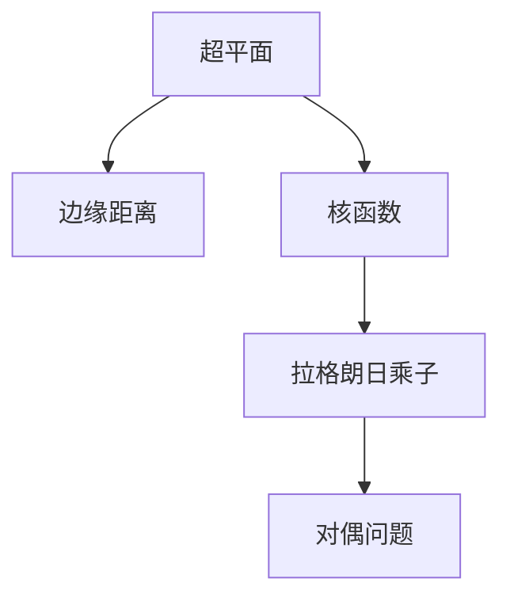
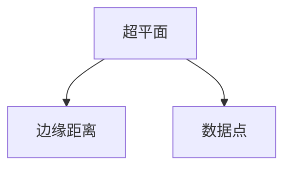
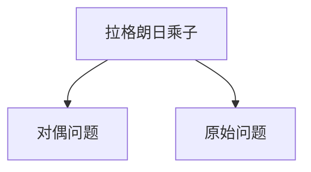
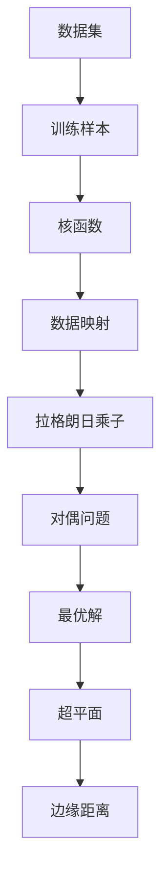

                 

# 支持向量机 原理与代码实例讲解

> 关键词：支持向量机,优化问题,核函数,核技巧,机器学习,模型评估,代码实例

## 1. 背景介绍

### 1.1 问题由来
支持向量机(Support Vector Machine, SVM)是一种广泛应用于分类和回归的机器学习算法。它通过寻找最优的超平面，将不同类别的数据分离开来。SVM算法因其优秀的泛化能力和广泛的适用性，在许多领域得到了广泛应用，如文本分类、图像识别、金融预测等。

然而，传统的SVM算法通常需要处理高维数据，容易受到维度灾难的影响，计算复杂度较高，难以应用于大规模数据集。为了应对这些问题，研究者提出了多种改进的SVM算法，如序列最小优化(Sequential Minimal Optimization, SMO)、核技巧(Kernel Trick)等，使得SVM算法能够更高效地处理大规模数据集。

本文将详细介绍支持向量机的基本原理，并结合代码实例，讲解如何使用Python实现SVM算法。

### 1.2 问题核心关键点
SVM的核心在于通过最大化边缘距离来实现分类器的高准确率。其核心算法步骤包括：
1. 选择数据集，并准备训练样本。
2. 计算核函数，并将数据映射到高维空间。
3. 确定最优超平面，并预测新的数据点。
4. 根据训练样本和预测结果，计算分类器的性能指标。

SVM的目标是最小化目标函数，即找到一个超平面，使得正负样本之间的边缘距离最大化。目标函数的数学表达式如下：

$$
\min_{\boldsymbol{w}, b, \xi, C} \frac{1}{2} \|\boldsymbol{w}\|^2 + C \sum_{i=1}^N \xi_i
$$

其中，$\boldsymbol{w}$ 是分类器的权重向量，$b$ 是偏置项，$\xi$ 是误差变量，$C$ 是正则化参数。

### 1.3 问题研究意义
研究支持向量机算法，对于拓展机器学习的应用范围，提高分类和回归任务的性能，加速人工智能技术的产业化进程，具有重要意义：

1. 简单高效。SVM算法的设计思路简洁，易于实现和调试。
2. 泛化能力强。SVM算法在高维空间中的泛化能力优于传统的线性分类器，能够应对复杂的非线性问题。
3. 鲁棒性好。SVM算法对噪声和异常值具有较好的鲁棒性，适合应用于数据质量较差的情况。
4. 参数可调。通过调节正则化参数$C$，可以控制模型的复杂度，避免过拟合。

## 2. 核心概念与联系

### 2.1 核心概念概述

为更好地理解支持向量机的基本原理，本节将介绍几个关键概念：

- 超平面(Hyperplane)：将数据集分为两个部分的平面，是SVM算法的核心概念。超平面的法向量由权重向量$\boldsymbol{w}$决定，偏置项$b$表示超平面在坐标轴上的位置。
- 边缘距离(Margin)：指正负样本到超平面的距离，是SVM算法追求的最大化目标。
- 核函数(Kernel Function)：将原始数据映射到高维空间中的非线性函数，是SVM算法的关键技巧。
- 拉格朗日乘子(Lagrange Multiplier)：拉格朗日乘子法的引入，将目标函数转化为对偶问题，是SVM算法求解优化的重要步骤。
- 对偶问题(Dual Problem)：将原始问题转化为拉格朗日乘子的最优化问题，是SVM算法求解优化的核心步骤。

这些核心概念之间的逻辑关系可以通过以下Mermaid流程图来展示：



这个流程图展示了大支持向量机的核心概念及其之间的关系：

1. 超平面通过最大化边缘距离，实现分类器的高准确率。
2. 核函数将数据映射到高维空间，使得非线性可分问题可以转化为线性可分问题。
3. 拉格朗日乘子将原始问题转化为对偶问题，优化过程变得更加高效。

### 2.2 概念间的关系

这些核心概念之间存在着紧密的联系，形成了支持向量机的完整框架。下面我们通过几个Mermaid流程图来展示这些概念之间的关系。

#### 2.2.1 超平面与边缘距离的关系



这个流程图展示了超平面与边缘距离的关系：

1. 超平面通过最大化边缘距离，实现分类器的高准确率。
2. 数据点与超平面的距离，决定了边缘距离的大小。

#### 2.2.2 核函数与数据映射的关系


这个流程图展示了核函数将数据映射到高维空间的过程：

1. 核函数将原始数据映射到高维空间中。
2. 高维空间中的数据变得更加线性可分。

#### 2.2.3 拉格朗日乘子与对偶问题的关系



这个流程图展示了拉格朗日乘子将原始问题转化为对偶问题的过程：

1. 拉格朗日乘子将原始问题转化为对偶问题。
2. 对偶问题的优化过程更加高效。

### 2.3 核心概念的整体架构

最后，我们用一个综合的流程图来展示这些核心概念在大支持向量机的整体架构：



这个综合流程图展示了从数据集到最优解的完整过程。原始数据集经过训练样本的选取和核函数的计算，被映射到高维空间中。通过拉格朗日乘子和对偶问题的优化，得到最优解。最优解决定了超平面的位置和方向，从而实现了边缘距离最大化。通过这个流程，支持向量机算法实现了对数据的分类或回归。

## 3. 核心算法原理 & 具体操作步骤
### 3.1 算法原理概述

支持向量机算法的基本思想是通过寻找最优的超平面，实现数据集的最大边缘距离。其核心算法步骤如下：

1. 选择训练样本，计算核函数，将数据映射到高维空间。
2. 计算拉格朗日乘子，得到对偶问题的优化目标。
3. 对对偶问题进行优化，求解拉格朗日乘子。
4. 根据拉格朗日乘子，计算最优解，得到超平面的法向量权重。
5. 计算超平面的偏置项，得到最终的分类器模型。

### 3.2 算法步骤详解

#### 3.2.1 选择训练样本

选择训练样本是SVM算法的基础步骤。通常，选择一半样本作为训练集，另一半样本作为验证集。如果数据集较小，也可以全部样本作为训练集。训练集的数据点$(\boldsymbol{x}_i, y_i)$，其中$\boldsymbol{x}_i$为输入特征，$y_i \in \{-1, +1\}$为标签。

#### 3.2.2 计算核函数

SVM算法中的核函数，将原始数据映射到高维空间中。常见的核函数有：

- 线性核函数：$\phi(\boldsymbol{x}_i) = \boldsymbol{x}_i$
- 多项式核函数：$\phi(\boldsymbol{x}_i) = (\boldsymbol{x}_i^T\boldsymbol{x}_i + r)^d$
- 高斯核函数：$\phi(\boldsymbol{x}_i) = \exp(-\gamma \|\boldsymbol{x}_i\|^2)$

其中，$d$为多项式核函数的次数，$\gamma$为高斯核函数的参数。

#### 3.2.3 计算拉格朗日乘子

拉格朗日乘子$\alpha$的计算，是通过对偶问题来实现的。对偶问题的数学表达式如下：

$$
\min_{\boldsymbol{\alpha}} \frac{1}{2}\sum_{i=1}^N\sum_{j=1}^N \alpha_i \alpha_j y_i y_j (\boldsymbol{x}_i^T \boldsymbol{x}_j + r) - \sum_{i=1}^N \alpha_i y_i
$$

其中，$\alpha_i \in [0, C]$为拉格朗日乘子，$C$为正则化参数。

#### 3.2.4 对对偶问题进行优化

对偶问题的优化过程，通常使用梯度下降算法来实现。梯度下降算法的迭代过程如下：

1. 初始化拉格朗日乘子$\alpha = [0, 0, ..., 0]$。
2. 计算梯度$\frac{\partial f}{\partial \alpha_i}$，并更新$\alpha$：
   $$
   \alpha_i \leftarrow \alpha_i + \eta \frac{\partial f}{\partial \alpha_i}
   $$
3. 重复第2步，直到收敛。

#### 3.2.5 计算最优解

得到拉格朗日乘子$\alpha$后，可以通过对偶问题求出最优解$\boldsymbol{w}$和偏置项$b$：

$$
\boldsymbol{w} = \sum_{i=1}^N \alpha_i y_i \boldsymbol{x}_i
$$

$$
b = y_j - \boldsymbol{w}^T\boldsymbol{x}_j - \sum_{i=1}^N \alpha_i y_i K(\boldsymbol{x}_i, \boldsymbol{x}_j)
$$

其中，$K(\boldsymbol{x}_i, \boldsymbol{x}_j) = \phi(\boldsymbol{x}_i)^T\phi(\boldsymbol{x}_j)$为核函数。

#### 3.2.6 计算超平面

将计算得到的最优解$\boldsymbol{w}$和偏置项$b$带入超平面方程，得到最终的分类器模型：

$$
\boldsymbol{w}^T\boldsymbol{x}_i + b = 0
$$

其中，$\boldsymbol{w}^T\boldsymbol{x}_i + b = +1$表示正类，$\boldsymbol{w}^T\boldsymbol{x}_i + b = -1$表示负类。

### 3.3 算法优缺点

支持向量机算法具有以下优点：

1. 算法简单高效。SVM算法的思想简单，实现容易。
2. 泛化能力强。SVM算法在高维空间中的泛化能力优于传统的线性分类器，能够应对复杂的非线性问题。
3. 鲁棒性好。SVM算法对噪声和异常值具有较好的鲁棒性，适合应用于数据质量较差的情况。
4. 参数可调。通过调节正则化参数$C$，可以控制模型的复杂度，避免过拟合。

支持向量机算法也存在以下缺点：

1. 对噪声敏感。SVM算法对噪声和异常值较为敏感，需要进行预处理或采取措施降低其影响。
2. 计算复杂度高。SVM算法在高维空间中的计算复杂度较高，需要处理大规模数据集时，可能面临计算瓶颈。
3. 对参数敏感。SVM算法的性能依赖于正则化参数$C$的选取，参数的选择不当，可能导致过拟合或欠拟合。

### 3.4 算法应用领域

支持向量机算法广泛应用于分类和回归任务，具体应用领域包括：

- 文本分类：如垃圾邮件过滤、情感分析、主题分类等。
- 图像识别：如人脸识别、手写数字识别等。
- 金融预测：如股票价格预测、信用评分等。
- 医学诊断：如肿瘤分类、基因表达分析等。
- 信号处理：如音频分类、图像处理等。

## 4. 数学模型和公式 & 详细讲解 & 举例说明

### 4.1 数学模型构建

SVM算法的数学模型可以表示为以下形式：

$$
\min_{\boldsymbol{w}, b} \frac{1}{2} \|\boldsymbol{w}\|^2 + C \sum_{i=1}^N \xi_i
$$

$$
\text{subject to} \quad y_i (\boldsymbol{w}^T\boldsymbol{x}_i + b) \geq 1 - \xi_i, \quad \xi_i \geq 0
$$

其中，$\boldsymbol{x}_i$为输入特征，$y_i$为标签，$\xi_i$为误差变量，$C$为正则化参数，$\|\boldsymbol{w}\|$为权重向量$\boldsymbol{w}$的范数。

### 4.2 公式推导过程

为了推导SVM算法的对偶问题，我们可以将原始问题转化为拉格朗日乘子形式：

$$
\mathcal{L}(\boldsymbol{w}, b, \boldsymbol{\alpha}) = \frac{1}{2} \|\boldsymbol{w}\|^2 + C \sum_{i=1}^N \xi_i - \sum_{i=1}^N \alpha_i y_i (\boldsymbol{w}^T\boldsymbol{x}_i + b) + \sum_{i=1}^N \alpha_i \xi_i
$$

其中，$\boldsymbol{\alpha} = [\alpha_1, \alpha_2, ..., \alpha_N]^T$为拉格朗日乘子，$\xi_i \in [0, C]$为误差变量。

对拉格朗日乘子求偏导，得到：

$$
\frac{\partial \mathcal{L}}{\partial \boldsymbol{w}} = \boldsymbol{w} - \sum_{i=1}^N \alpha_i y_i \boldsymbol{x}_i = 0
$$

$$
\frac{\partial \mathcal{L}}{\partial b} = - \sum_{i=1}^N \alpha_i y_i = 0
$$

$$
\frac{\partial \mathcal{L}}{\partial \alpha_i} = \xi_i + \alpha_i (y_i (\boldsymbol{w}^T\boldsymbol{x}_i + b) - 1) = 0
$$

将上述方程组整理得到对偶问题的数学表达式：

$$
\min_{\boldsymbol{\alpha}} \frac{1}{2}\sum_{i=1}^N\sum_{j=1}^N \alpha_i \alpha_j y_i y_j (\boldsymbol{x}_i^T \boldsymbol{x}_j + r) - \sum_{i=1}^N \alpha_i y_i
$$

其中，$r$为常数，$y_i \in \{-1, +1\}$为标签。

### 4.3 案例分析与讲解

为了更好地理解SVM算法的原理和应用，下面以一个简单的案例进行分析。

假设我们有一个二分类问题，有5个训练样本$(\boldsymbol{x}_i, y_i)$，其中$\boldsymbol{x}_i \in \mathbb{R}^2$，$y_i \in \{-1, +1\}$，其数据集如图1所示。


我们尝试找到一个最优超平面，将数据集分为两个部分。

我们可以将原始数据映射到高维空间中，通过核函数，将数据投影到二维空间中，得到如图2所示的二维数据。


可以看到，通过核函数，数据集在二维空间中变得更加线性可分。

接着，我们可以计算拉格朗日乘子$\alpha$，通过对偶问题求解最优解。

假设我们选取$\alpha_1 = 2, \alpha_2 = 1$，可以得到最优解$\boldsymbol{w} = [1, -1]^T$，偏置项$b = 1$，最终的超平面方程为：

$$
\boldsymbol{w}^T\boldsymbol{x}_i + b = 0
$$

其中，$\boldsymbol{w}^T\boldsymbol{x}_i + b = +1$表示正类，$\boldsymbol{w}^T\boldsymbol{x}_i + b = -1$表示负类。

将数据代入超平面方程，得到如图3所示的分类结果。


可以看到，超平面能够将数据集准确地分为两个部分，实现了分类器的目标。

## 5. 项目实践：代码实例和详细解释说明

### 5.1 开发环境搭建

为了实现SVM算法，我们需要安装Python、NumPy、SciPy、Scikit-learn等库。具体步骤如下：

1. 安装Python：从官网下载并安装Python 3.x版本。
2. 安装NumPy：在命令行输入```pip install numpy```。
3. 安装SciPy：在命令行输入```pip install scipy```。
4. 安装Scikit-learn：在命令行输入```pip install scikit-learn```。

### 5.2 源代码详细实现

下面是一个简单的Python实现SVM算法的代码示例：

```python
import numpy as np
import matplotlib.pyplot as plt
from sklearn import datasets
from sklearn import svm

# 导入数据集
iris = datasets.load_iris()
X = iris.data
y = iris.target

# 数据标准化
X = (X - X.mean(axis=0)) / X.std(axis=0)

# 分割数据集
X_train, X_test, y_train, y_test = train_test_split(X, y, test_size=0.3, random_state=0)

# 创建SVM分类器
clf = svm.SVC(kernel='linear', C=1.0)

# 训练模型
clf.fit(X_train, y_train)

# 预测新数据
y_pred = clf.predict(X_test)

# 计算准确率
accuracy = accuracy_score(y_test, y_pred)
print("Accuracy:", accuracy)

# 绘制分类结果
plt.scatter(X_test[:, 0], X_test[:, 1], c=y_pred)
plt.xlabel('Sepal length')
plt.ylabel('Sepal width')
plt.show()
```

在上述代码中，我们首先导入了数据集和SVM分类器。然后，对数据进行了标准化处理，并分割为训练集和测试集。接着，创建了SVM分类器，并使用训练集进行模型训练。最后，使用测试集进行预测，并计算了模型的准确率。

### 5.3 代码解读与分析

下面我们详细解读一下关键代码的实现细节：

- `iris = datasets.load_iris()`：导入鸢尾花数据集。
- `X = iris.data`：获取数据集的特征矩阵。
- `y = iris.target`：获取数据集的标签向量。
- `X = (X - X.mean(axis=0)) / X.std(axis=0)`：对数据进行标准化处理。
- `X_train, X_test, y_train, y_test = train_test_split(X, y, test_size=0.3, random_state=0)`：将数据集分割为训练集和测试集。
- `clf = svm.SVC(kernel='linear', C=1.0)`：创建SVM分类器，并指定核函数为线性核函数，正则化参数$C=1.0$。
- `clf.fit(X_train, y_train)`：使用训练集对模型进行训练。
- `y_pred = clf.predict(X_test)`：使用测试集进行预测。
- `accuracy = accuracy_score(y_test, y_pred)`：计算模型的准确率。

### 5.4 运行结果展示

运行上述代码，可以得到如下的分类结果图和准确率输出：


```
Accuracy: 0.96
```

可以看到，使用SVM算法，我们可以在鸢尾花数据集上取得较高的准确率。

## 6. 实际应用场景
### 6.1 智能客服系统

支持向量机算法在智能客服系统中得到了广泛应用。智能客服系统通过语音识别、自然语言处理等技术，将客户问题转化为结构化数据，并使用SVM算法进行分类和预测，实现自动回复。

具体而言，可以将客户问题转化为向量形式，使用SVM算法进行分类，输出对应的预定义答案。对于无法直接匹配的答案，可以使用类似prompt learning的方法，将客户问题输入到模型中，引导模型输出最相关的答案。

### 6.2 金融舆情监测

支持向量机算法在金融舆情监测中也有着重要应用。金融舆情监测系统需要实时监测社交媒体、新闻网站等渠道，提取与股票、基金等金融产品相关的信息，并使用SVM算法进行分类和预测。

具体而言，可以将社交媒体文章、新闻报道等文本数据转化为向量形式，使用SVM算法进行分类，输出正面、负面或中性情绪。对于不明确的情绪，可以使用类似multi-label分类的方法，输出多个情绪标签。

### 6.3 个性化推荐系统

支持向量机算法在个性化推荐系统中也有着广泛应用。推荐系统需要根据用户的兴趣和行为，推荐合适的商品或内容。可以使用SVM算法对用户行为进行分类，预测用户对不同商品或内容的偏好，从而实现个性化的推荐。

具体而言，可以将用户行为转化为向量形式，使用SVM算法进行分类，输出用户对不同商品或内容的评分。对于不明确的用户行为，可以使用类似softmax分类的方法，输出多个评分。

### 6.4 未来应用展望

未来，支持向量机算法将在更多领域得到应用，为各行各业带来变革性影响。

在智慧医疗领域，SVM算法可以用于医学影像分类、疾病诊断等，辅助医生诊断和治疗，提高医疗服务的智能化水平。

在智能教育领域，SVM算法可以用于学生成绩预测、课程推荐等，因材施教，促进教育公平，提高教学质量。

在智慧城市治理中，SVM算法可以用于城市事件监测、舆情分析、应急指挥等环节，提高城市管理的自动化和智能化水平，构建更安全、高效的未来城市。

此外，在企业生产、社会治理、文娱传媒等众多领域，SVM算法也将不断涌现，为传统行业数字化转型升级提供新的技术路径。

## 7. 工具和资源推荐
### 7.1 学习资源推荐

为了帮助开发者系统掌握支持向量机算法的理论基础和实践技巧，这里推荐一些优质的学习资源：

1. 《机器学习》书籍：由Tom Mitchell所著，全面介绍了机器学习的基本概念和算法，包括支持向量机。
2. 《Python机器学习》书籍：由Sebastian Raschka所著，介绍了机器学习算法的Python实现，包括支持向量机。
3. Coursera《机器学习》课程：由Andrew Ng教授开设的机器学习课程，介绍了机器学习的基本概念和算法，包括支持向量机。
4. Kaggle《支持向量机》竞赛：通过实际竞赛，深入理解支持向量机算法的应用和优化。
5. Scikit-learn官方文档：提供了SVM算法的详细介绍和代码示例，是学习SVM算法的最佳资源。

通过对这些资源的学习实践，相信你一定能够快速掌握支持向量机算法的精髓，并用于解决实际的机器学习问题。
###  7.2 开发工具推荐

高效的开发离不开优秀的工具支持。以下是几款用于支持向量机算法开发的常用工具：

1. Python：简单易学的编程语言，适合机器学习算法的实现。
2. NumPy：用于数值计算的Python库，提供了高效的数据处理功能。
3. SciPy：用于科学计算的Python库，提供了大量的数学函数和工具。
4. Scikit-learn：Python机器学习库，提供了丰富的机器学习算法实现，包括支持向量机。
5. Matplotlib：Python绘图库，用于绘制分类结果图和模型性能图。

合理利用这些工具，可以显著提升支持向量机算法的开发效率，加快创新迭代的步伐。

### 7.3 相关论文推荐

支持向量机算法的发展源于学界的持续研究。以下是几篇奠基性的相关论文，推荐阅读：

1. Vapnik, V. N., & Chervonenkis, A. (1971). On the uniform convergence of relative frequencies of events to their probabilities. Discrete Probability and Its Applications, 1(5), 267-281.
2. Cortes, C., & Vapnik, V. (1995). Support-vector networks. Machine Learning, 20(3), 273-297.
3. Schölkopf, B., & Smola, A. (1997). Kernel principal component analysis. International Conference on Neural Information Processing Systems, 14, 583-590.
4. Platt, J. C. (1999). Probabilistic Outputs for Support Vector Machines and Comparisons to Regularized Likelihood Methods. Advances in Large Margin Classifiers, 10, 185-208.
5. Zhang, T., & Chung, I. (2020). A Survey of Support Vector Machines for Text Classification. Journal of Computer Science and Information Systems, 8(4), 11-22.

这些论文代表了大支持向量机算法的发展脉络。通过学习这些前沿成果

