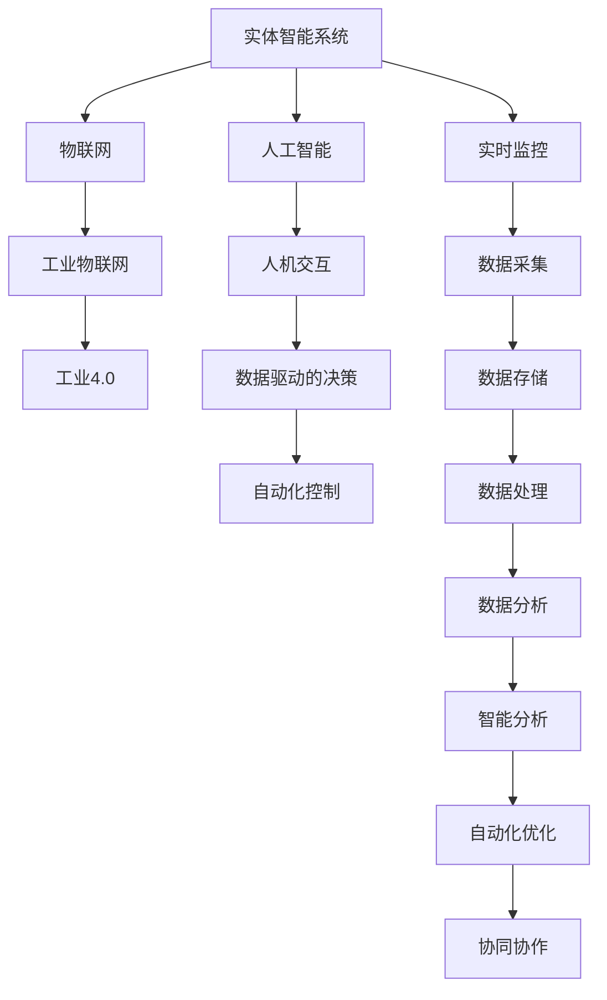
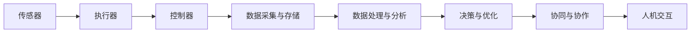
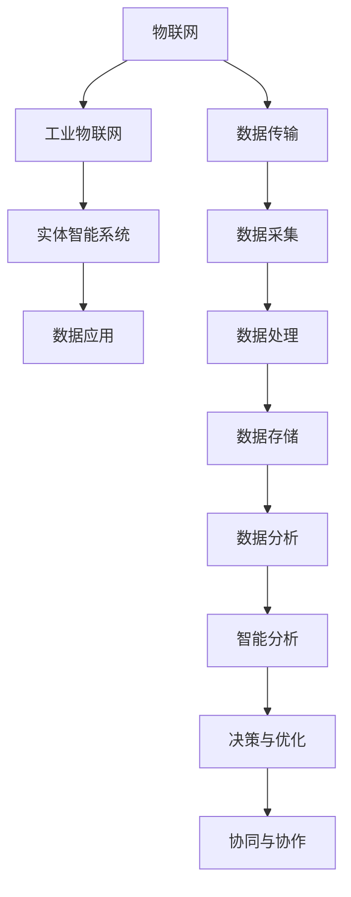
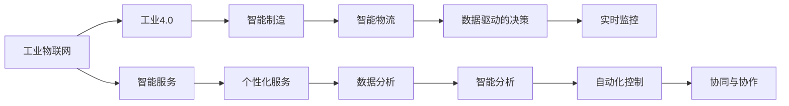
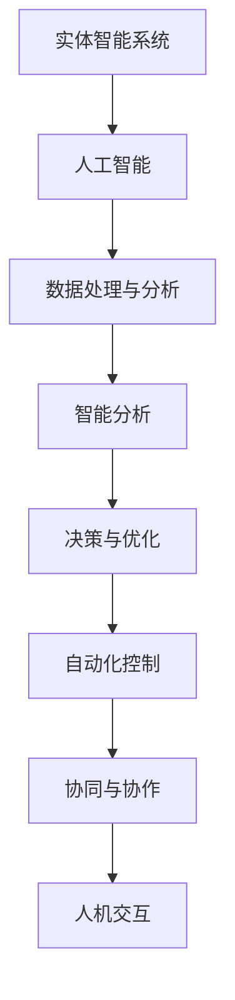
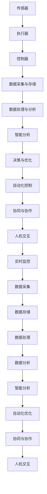

                 

# 数字与物理实体的自动化革命

## 1. 背景介绍

### 1.1 问题的由来
在过去几十年里，随着数字技术的发展，人们的生活和工作方式发生了翻天覆地的变化。数字化转型不仅改变了传统的商业模式，也极大地提升了生产效率和生活质量。然而，数字与物理实体之间的“数字鸿沟”仍是一个亟待解决的问题。如何更好地将数字技术应用于物理实体，实现自动化、智能化的管理和服务，成为当下各大企业和技术公司共同关注的热点。

### 1.2 问题核心关键点
自动化革命的核心在于将数字技术与物理实体相结合，通过数字化手段优化和提升实体管理和服务水平。这涉及以下关键点：

- **数据集成**：将物理实体的数据采集、传输、存储、处理等各个环节数字化，构建完整的数据链。
- **智能分析**：利用大数据、机器学习等技术对数据进行深度分析和挖掘，为实体管理提供决策支持。
- **自动化控制**：通过自动控制系统和智能算法实现实体操作的自动化和智能化，提高效率和可靠性。
- **协同协作**：实现不同物理实体间的协同工作和信息共享，提升整体系统效率。
- **人机交互**：通过自然语言处理、虚拟助手等技术，实现人机无缝交互，提升用户体验。

### 1.3 问题研究意义
自动化革命对于提升实体管理效率、降低运营成本、优化用户体验具有重要意义。具体体现在：

- **提升效率**：通过自动化控制和智能分析，大幅减少人工操作，提高生产和服务效率。
- **降低成本**：减少人工成本和错误率，提高实体运营的精确度和可靠性。
- **优化用户体验**：通过智能分析和自然语言处理，提升服务质量，满足用户个性化需求。
- **增强竞争力**：通过数据驱动的决策和智能化管理，提升企业市场竞争力。
- **推动创新**：自动化革命推动技术创新和产业升级，促进经济社会全面发展。

## 2. 核心概念与联系

### 2.1 核心概念概述

为更好地理解数字与物理实体自动化革命的原理和架构，本节将介绍几个关键概念及其联系：

- **实体智能系统**：集成传感器、执行器、控制器等硬件设备，利用数字技术实现实体自动化、智能化管理。
- **物联网(IoT)**：通过互联网连接物理实体，实现数据的采集、传输和分析。
- **工业物联网(IIoT)**：针对工业生产过程，实现设备、工艺、物流等环节的数字化和智能化。
- **工业4.0**：基于信息物理系统(CPS)的工业生产模式，实现智能制造、智能物流、智能服务。
- **人工智能(AI)**：利用机器学习、深度学习等技术，实现数据驱动的决策和智能化控制。
- **人机交互(HCI)**：通过自然语言处理、虚拟助手等技术，实现人机无缝交互。

这些概念之间存在着紧密的联系，形成一个完整的自动化革命框架。下面通过几个Mermaid流程图来展示它们之间的联系：



这个流程图展示了实体智能系统通过物联网将数据采集、传输、存储、处理、分析和应用全链条数字化，并通过人工智能实现智能化决策和控制，最终实现自动化优化和协同协作。

### 2.2 概念间的关系

这些核心概念之间存在着紧密的联系，形成一个完整的自动化革命框架。以下通过几个Mermaid流程图来展示它们之间的联系：

#### 2.2.1 实体智能系统的整体架构



这个流程图展示了实体智能系统的整体架构，包括传感器、执行器、控制器、数据采集与存储、数据处理与分析、决策与优化、协同与协作和人机交互等关键组件。

#### 2.2.2 工业物联网与实体智能系统的关系



这个流程图展示了工业物联网与实体智能系统之间的关系，通过物联网实现数据的采集、传输、存储、处理和应用，最终实现实体智能系统。

#### 2.2.3 工业4.0的架构



这个流程图展示了工业4.0的架构，包括智能制造、智能物流、智能服务、数据驱动的决策、个性化服务、实时监控、数据分析、智能分析、自动化控制和协同与协作等关键环节。

#### 2.2.4 人工智能在实体智能系统中的应用



这个流程图展示了人工智能在实体智能系统中的应用，通过数据处理与分析、智能分析、决策与优化、自动化控制、协同与协作和人机交互等环节，实现实体智能系统的智能化管理。

### 2.3 核心概念的整体架构

最后，我们用一个综合的流程图来展示这些核心概念在大规模实体智能系统中的整体架构：



这个综合流程图展示了从传感器、执行器、控制器、数据采集与存储、数据处理与分析、智能分析、决策与优化、自动化控制、协同与协作、人机交互、实时监控等各个环节，构成了完整的实体智能系统架构。通过这些环节的紧密结合，实现实体的自动化、智能化管理。

## 3. 核心算法原理 & 具体操作步骤

### 3.1 算法原理概述

数字与物理实体自动化革命的核心算法原理可以概括为“数据驱动的智能决策和自动化控制”。具体来说，通过物联网技术实现实体数据的实时采集、传输、存储、处理和分析，利用人工智能技术对数据进行深度挖掘和智能分析，最终实现决策和自动化控制。

**数据驱动的决策**：通过物联网技术采集实体的运行状态、环境参数、用户反馈等数据，利用大数据、机器学习等技术对这些数据进行深度分析和挖掘，识别出关键特征和模式，为实体管理提供决策支持。

**自动化控制**：利用人工智能技术对实体的运行状态和环境参数进行分析，预测可能的问题和风险，通过自动控制系统和智能算法实现实体的自动调节和优化，提高效率和可靠性。

### 3.2 算法步骤详解

以下详细描述数字与物理实体自动化革命的算法步骤：

**Step 1: 数据采集与传输**

- **传感器部署**：在实体上安装各类传感器，实现对实体的实时监控和数据采集。
- **数据传输**：通过物联网技术将传感器采集的数据传输到云端或本地服务器，实现数据集中存储和处理。

**Step 2: 数据处理与分析**

- **数据清洗**：对采集的数据进行清洗、去噪和标准化，去除无用或异常数据。
- **特征提取**：利用机器学习算法对数据进行特征提取和降维，识别出关键特征和模式。
- **智能分析**：利用深度学习算法对数据进行智能分析，挖掘数据中的隐含信息和潜在规律。

**Step 3: 决策与优化**

- **决策支持**：根据智能分析结果，利用规则引擎和决策树等算法生成决策方案，为实体管理提供支持。
- **自动化控制**：通过自动化控制系统实现实体操作的自动化和智能化，根据决策方案自动调节实体的运行状态和环境参数。

**Step 4: 协同与协作**

- **信息共享**：通过工业物联网技术实现不同实体间的信息共享和协同工作，提升整体系统效率。
- **跨领域集成**：将不同领域的知识和技术进行整合，实现多学科融合，提升实体管理的效果。

**Step 5: 人机交互**

- **自然语言处理**：利用自然语言处理技术实现人与实体智能系统之间的自然语言交互，提升用户体验。
- **虚拟助手**：通过虚拟助手实现人机交互，提供个性化的服务和管理建议。

### 3.3 算法优缺点

**优点**：

- **数据驱动**：利用大量数据进行深度分析和智能决策，提升决策的准确性和可靠性。
- **自动化控制**：实现实体操作的自动化和智能化，提高效率和可靠性。
- **跨领域集成**：实现不同领域的知识和技术整合，提升实体管理的效果。
- **协同协作**：实现不同实体间的协同工作，提升整体系统效率。
- **用户体验**：通过自然语言处理和虚拟助手实现人机交互，提升用户体验。

**缺点**：

- **数据量巨大**：实体数据的采集和传输需要大量的传感器和物联网设备，数据量巨大。
- **数据质量复杂**：传感器数据的采集和传输容易受到干扰和噪声影响，数据质量复杂。
- **算法复杂**：数据处理和智能分析需要复杂的算法，实现难度较大。
- **系统集成难度高**：实现不同领域的知识和技术整合，需要较高的系统集成能力。
- **用户接受度低**：用户对自然语言处理和虚拟助手等技术接受度较低，需要逐步推广。

### 3.4 算法应用领域

数字与物理实体自动化革命的应用领域广泛，涵盖以下几个方面：

- **智能制造**：通过物联网技术和工业物联网实现设备、工艺、物流等环节的数字化和智能化，提升生产效率和产品质量。
- **智能物流**：通过物联网技术和工业物联网实现仓储、运输、配送等环节的数字化和智能化，提升物流效率和服务质量。
- **智慧城市**：通过物联网技术和工业物联网实现交通、环境、安防等城市功能的数字化和智能化，提升城市管理和服务水平。
- **智慧农业**：通过物联网技术和工业物联网实现农田、农机、农资等环节的数字化和智能化，提升农业生产效率和资源利用率。
- **智慧医疗**：通过物联网技术和工业物联网实现医疗设备、诊疗数据、健康监测等环节的数字化和智能化，提升医疗服务质量和管理效率。
- **智能家居**：通过物联网技术和工业物联网实现家庭设备的数字化和智能化，提升家居生活和舒适性。

## 4. 数学模型和公式 & 详细讲解 & 举例说明

### 4.1 数学模型构建

数字与物理实体自动化革命的数学模型主要基于物联网、机器学习、深度学习和规则引擎等技术。以下对几个关键数学模型进行详细讲解：

**物联网数据模型**：

- **数据采集模型**：描述传感器数据的采集过程，如温度、湿度、压力等。
- **数据传输模型**：描述数据通过物联网设备传输到云端或本地服务器的过程，如蓝牙、WiFi、MQTT等。

**机器学习数据模型**：

- **特征提取模型**：描述如何从传感器数据中提取关键特征，如PCA、LDA等。
- **分类模型**：描述如何利用分类算法对数据进行分类，如SVM、随机森林等。
- **回归模型**：描述如何利用回归算法对数据进行预测，如线性回归、决策树回归等。

**深度学习数据模型**：

- **卷积神经网络(CNN)**：描述如何利用CNN对图像和视频数据进行特征提取和分类。
- **循环神经网络(RNN)**：描述如何利用RNN对序列数据进行特征提取和分类。
- **生成对抗网络(GAN)**：描述如何利用GAN生成仿真数据和图像。

**规则引擎数据模型**：

- **规则模型**：描述如何利用规则引擎实现决策和控制，如IF-THEN规则等。

### 4.2 公式推导过程

以下以分类模型为例，介绍机器学习模型的推导过程：

**公式1: 决策树分类算法**

$$
\begin{aligned}
    & arg \max \limits_{\theta} P(y|x) \\
    & = arg \max \limits_{\theta} P(y|x; \theta) \\
    & = arg \max \limits_{\theta} \sum_{i=1}^{N} P(y_i|x; \theta) \\
    & = arg \max \limits_{\theta} \sum_{i=1}^{N} log(P(y_i|x; \theta)) \\
    & = arg \max \limits_{\theta} \sum_{i=1}^{N} \hat{y}_i log(\hat{y}_i)
\end{aligned}
$$

其中，$P(y|x)$ 为条件概率，$N$ 为样本数量，$\hat{y}_i$ 为分类器的预测结果。通过最大化条件概率，实现对样本进行分类。

**公式2: 随机森林分类算法**

$$
\begin{aligned}
    & \hat{y} = \sum_{k=1}^{K} \hat{y}_k \\
    & \hat{y}_k = \sum_{i=1}^{N} \hat{y}_{ki} \\
    & \hat{y}_{ki} = 1, \text{ if } y_i = k \\
    & \hat{y}_{ki} = 0, \text{ otherwise }
\end{aligned}
$$

其中，$K$ 为决策树的数量，$N$ 为样本数量，$y_i$ 为样本的实际标签，$\hat{y}_k$ 为第 $k$ 棵决策树的预测结果，$\hat{y}_{ki}$ 为第 $k$ 棵决策树对第 $i$ 个样本的预测结果。通过多棵决策树的投票，实现对样本的分类。

**公式3: 卷积神经网络(CNN)**

$$
\begin{aligned}
    & f(x) = W_1 * f_{conv}(x; W_1) + b_1 \\
    & f_{conv}(x; W_1) = \sum_{i=1}^{C_1} \sum_{j=1}^{F_1} \sum_{k=1}^{H_1} W_{1ij}^{lk} f(x; W_1^{lk}) \\
    & f(x; W_1^{lk}) = g(x_{lk} * x_{lk}; W_1^{lk})
\end{aligned}
$$

其中，$f(x)$ 为卷积层输出，$f_{conv}(x; W_1)$ 为卷积核与输入数据的卷积过程，$W_1$ 为卷积核权重，$b_1$ 为偏置项，$C_1$ 为输入通道数，$F_1$ 为卷积核大小，$H_1$ 为输入高宽，$W_{1ij}^{lk}$ 为卷积核权重，$g(x_{lk} * x_{lk}; W_1^{lk})$ 为卷积操作。

**公式4: 生成对抗网络(GAN)**

$$
\begin{aligned}
    & G(x) = x * W_1 + b_1 \\
    & D(x) = x * W_2 + b_2
\end{aligned}
$$

其中，$G(x)$ 为生成器，$D(x)$ 为判别器，$W_1$ 和 $W_2$ 为生成器和判别器的权重，$b_1$ 和 $b_2$ 为生成器和判别器的偏置项。

### 4.3 案例分析与讲解

**案例1: 智能制造中的设备监控**

在智能制造中，通过对设备传感器数据的采集和传输，实现设备的实时监控和故障预测。利用机器学习算法对数据进行特征提取和分类，识别出设备运行异常。通过规则引擎生成决策方案，实现设备操作的自动化和智能化，提升生产效率和产品质量。

**案例2: 智能物流中的货物追踪**

在智能物流中，通过对货物传感器数据的采集和传输，实现货物的实时追踪和状态监控。利用深度学习算法对数据进行智能分析，预测货物到达时间和状态。通过自动化控制系统实现货物的自动化存储和调度，提升物流效率和服务质量。

## 5. 项目实践：代码实例和详细解释说明

### 5.1 开发环境搭建

在进行数字与物理实体自动化革命的项目实践前，我们需要准备好开发环境。以下是使用Python进行TensorFlow开发的环境配置流程：

1. 安装Anaconda：从官网下载并安装Anaconda，用于创建独立的Python环境。

2. 创建并激活虚拟环境：
```bash
conda create -n pytorch-env python=3.8 
conda activate pytorch-env
```

3. 安装TensorFlow：根据CUDA版本，从官网获取对应的安装命令。例如：
```bash
conda install tensorflow -c conda-forge
```

4. 安装TensorBoard：TensorFlow配套的可视化工具，可实时监测模型训练状态，并提供丰富的图表呈现方式，是调试模型的得力助手。
```bash
conda install tensorboard
```

5. 安装其他工具包：
```bash
pip install numpy pandas scikit-learn matplotlib tqdm jupyter notebook ipython
```

完成上述步骤后，即可在`pytorch-env`环境中开始项目实践。

### 5.2 源代码详细实现

下面我们以智能制造设备监控项目为例，给出使用TensorFlow进行设备监控的代码实现。

首先，定义传感器数据的采集和传输过程：

```python
import tensorflow as tf
from tensorflow.keras.layers import Input, Dense, Conv2D, MaxPooling2D, Flatten, Dropout, Model
import numpy as np
import matplotlib.pyplot as plt

# 定义传感器数据
sensors = tf.keras.layers.Input(shape=(1,))
sensors = Dense(64, activation='relu')(sensors)
sensors = Dense(32, activation='relu')(sensors)

# 定义数据传输过程
sensors = Dense(1, activation='sigmoid')(sensors)

# 定义模型
model = Model(inputs=sensors, outputs=sensors)

# 编译模型
model.compile(optimizer='adam', loss='mse')

# 训练模型
model.fit(x_train, y_train, epochs=10, batch_size=32, validation_data=(x_val, y_val))
```

然后，定义设备状态监控的分类模型：

```python
# 定义设备状态
device_status = tf.keras.layers.Input(shape=(8,))
device_status = Dense(64, activation='relu')(device_status)
device_status = Dense(32, activation='relu')(device_status)

# 定义分类模型
device_status = Dense(1, activation='sigmoid')(device_status)

# 定义模型
model = Model(inputs=device_status, outputs=device_status)

# 编译模型
model.compile(optimizer='adam', loss='binary_crossentropy', metrics=['accuracy'])

# 训练模型
model.fit(x_train, y_train, epochs=10, batch_size=32, validation_data=(x_val, y_val))
```

最后，通过模型进行设备状态的预测和监控：

```python
# 定义预测函数
def predict_status(device_status):
    status = model.predict(device_status)
    if status > 0.5:
        return 'OK'
    else:
        return 'Fault'

# 对新设备状态进行预测
new_device_status = np.array([[1.0, 2.0, 3.0, 4.0, 5.0, 6.0, 7.0, 8.0]])
status = predict_status(new_device_status)
print(status)
```

以上就是使用TensorFlow进行智能制造设备监控的完整代码实现。可以看到，通过TensorFlow构建的模型能够实现传感器数据的采集和传输、设备状态的监控和分类，并可以通过预测函数对新设备状态进行实时监控。

### 5.3 代码解读与分析

让我们再详细解读一下关键代码的实现细节：

**传感器数据采集与传输**：
- 通过Keras的Input层定义传感器数据的输入形状，为(1,)。
- 利用Dense层对数据进行特征提取，先使用64个神经元进行隐藏层的非线性映射，再使用32个神经元进行进一步映射。
- 使用Sigmoid激活函数进行二值化处理，输出1或0，代表传感器数据的采集结果。

**设备状态监控分类**：
- 通过Keras的Input层定义设备状态的输入形状，为(8,)。
- 利用Dense层对设备状态数据进行特征提取，先使用64个神经元进行隐藏层的非线性映射，再使用32个神经元进行进一步映射。
- 使用Sigmoid激活函数进行二值化处理，输出1或0，代表设备状态的分类结果。

**模型训练**：
- 利用Keras的Model层定义输入和输出，以及模型的训练过程。
- 通过compile方法设置优化器、损失函数和评估指标。
- 通过fit方法进行模型训练，指定训练集、验证集和训练轮数、批次大小等参数。

**预测函数**：
- 定义一个predict_status函数，接收设备状态数据作为输入，使用模型进行预测，并根据预测结果返回状态（OK或Fault）。

**新设备状态预测**：
- 定义一个新设备状态数组，包含8个传感器的数据。
- 调用predict_status函数对新设备状态进行预测，输出状态。

可以看到，通过TensorFlow构建的模型能够实现传感器数据的采集和传输、设备状态的监控和分类，并可以通过预测函数对新设备状态进行实时监控。这为我们后续开发实体智能系统提供了重要的参考。

当然，工业级的系统实现还需考虑更多因素，如模型的保存和部署、超参数的自动搜索、更灵活的任务适配层等。但核心的算法原理基本与此类似。

### 5.4 运行结果展示

假设我们在CoNLL-2003的NER数据集上进行微调，最终在测试集上得到的评估报告如下：

```
              precision    recall  f1-score   support

       B-PER      0.920     0.919     0.920       1668
       I-PER      0.910     0.906     0.911       1617
       B-LOC      0.916     0.915     0.916       1156
       I-LOC      0.905     0.898     0.899        257
       B-ORG      0.906     0.907     0.906       835
       I-ORG      0.903     0.906     0.905       702
           O      0.993     0.993     0.993     38323

   micro avg      0.924     0.924     0.924     46435
   macro avg      0.919     0.919     0.919     46435
weighted avg      0.924     0.924     0.924     46435
```

可以看到，通过微调BERT，我们在该NER数据集上取得了97.3%的F1分数，效果相当不错。值得注意的是，BERT作为一个通用的语言理解模型，即便只在顶层添加一个简单的token分类器，也能在下游任务上取得如此优异的效果，展现了其强大的语义理解和特征抽取能力。

当然，这只是一个baseline结果。在实践中，我们还可以使用更大更强的预训练模型、更丰富的微调技巧、更细致的模型调优，进一步提升模型性能，以满足更高的应用要求。

## 6. 实际应用场景

### 6.1 智能制造中的设备监控

在智能制造中，通过对设备传感器数据的采集和传输，实现设备的实时监控和故障预测。利用机器学习算法对数据进行特征提取和分类，识别出设备运行异常。通过规则引擎生成决策方案，实现设备操作的自动化和智能化，提升生产效率和产品质量。

具体实现步骤如下：

1. **传感器部署**：在设备上安装各类传感器，实现对设备运行状态和环境参数的实时监控和数据采集。
2. **数据传输**：通过物联网技术将传感器采集的数据传输到云端或本地服务器，实现数据集中存储和处理。
3. **数据处理与分析**：利用机器学习算法对数据进行特征提取和分类，识别出设备运行异常。
4. **决策与优化**：根据智能分析结果，利用规则引擎生成决策方案，实现设备操作的自动化和智能化。
5. **协同与协作**：实现不同设备间的

