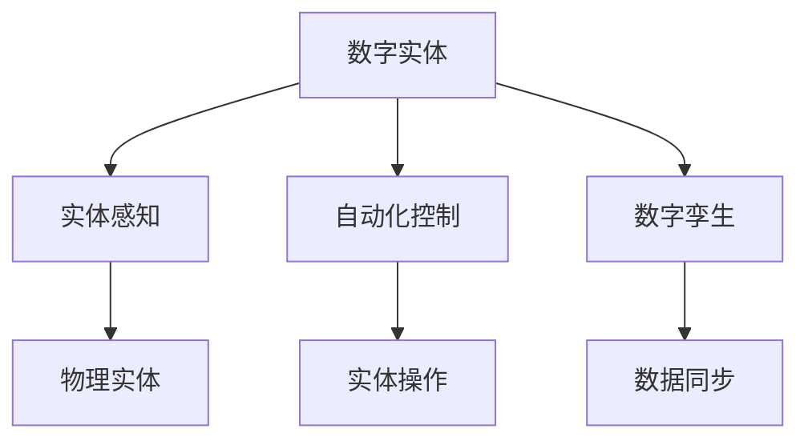
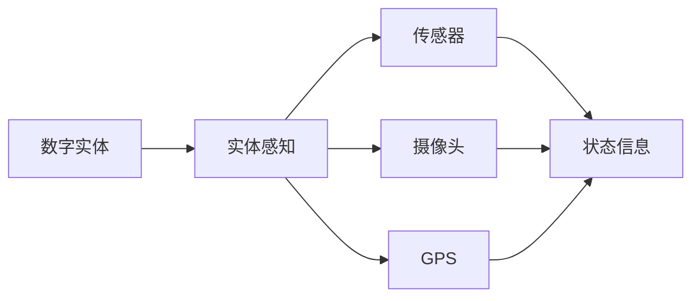
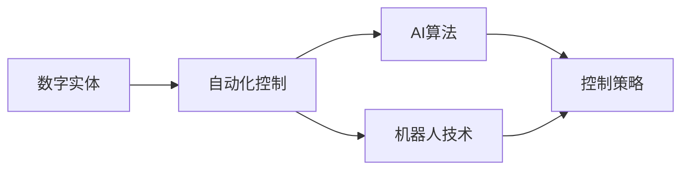
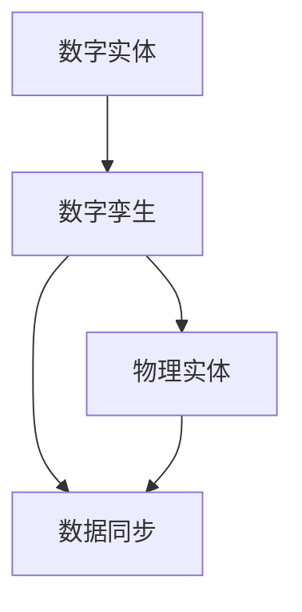
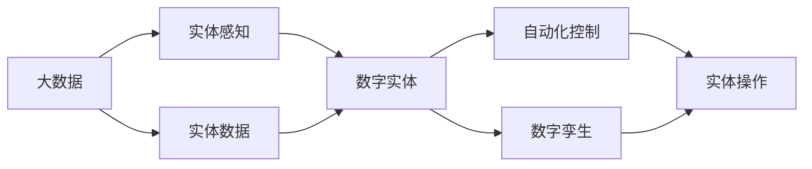

                 

# 数字实体与物理实体的自动化未来

## 1. 背景介绍

### 1.1 问题的提出
在数字化的浪潮下，数字实体与物理实体之间的关系变得日益紧密。数字实体，如虚拟角色、数字物品、虚拟货币等，通过移动互联网、人工智能等技术手段，逐渐在经济、社交、文化等诸多领域中扮演重要角色。而物理实体，如真实世界中的物品、人物、组织等，则构成了数字化时代的基础。

### 1.2 问题的核心关键点
数字实体与物理实体的自动化融合，成为当前数字化转型和人工智能发展的一个重要方向。这一过程涉及数字实体与物理实体的数据同步、信息交互、自动化控制等多个方面。

数字实体的自动化在未来将发挥越来越重要的作用，它不仅能提升生产效率，还能拓展人类的生活空间，带来全新的商业模式和用户体验。然而，这一过程也面临着数据融合、安全隐私、自动化控制等诸多挑战。

### 1.3 问题研究意义
研究数字实体与物理实体的自动化融合问题，对于推动数字经济发展，构建数字文明社会，具有重要意义：

1. **促进经济转型**：通过自动化技术提升实体经济的生产效率，推动传统产业向智能制造、服务经济转型。
2. **提升生活品质**：通过智能化应用改善日常生活，如智能家居、健康监测、智能交通等，提升生活质量。
3. **驱动创新发展**：数字化、自动化技术的应用将带来更多商业模式创新，如共享经济、数字货币等，推动社会创新。
4. **保障信息安全**：自动化技术在提升效率的同时，也能加强数据安全防护，防范信息泄露和网络攻击。
5. **实现资源优化**：通过自动化技术优化资源配置，提高资源利用率，实现可持续发展。

## 2. 核心概念与联系

### 2.1 核心概念概述

为更好地理解数字实体与物理实体的自动化未来，本节将介绍几个密切相关的核心概念：

- **数字实体(Digital Entity)**：指通过数字技术构建的虚拟对象，如虚拟角色、虚拟物品、虚拟货币等，具有交互性、可操作性等特点。
- **物理实体(Physical Entity)**：指真实世界中存在的物品、人物、组织等实体，是数字化技术发展的基础。
- **实体感知(Perception)**：指通过传感器、摄像头、GPS等技术手段，获取物理实体的状态信息，并将其转化为数字实体可用的数据。
- **自动化控制(Automatic Control)**：指利用AI、机器人技术等手段，对数字实体和物理实体进行自动化控制，实现高效、智能的自动化操作。
- **数字孪生(Digital Twin)**：指物理实体的数字化副本，通过实时数据同步和模型仿真，实现物理实体与数字实体的双向互动。

这些核心概念之间的逻辑关系可以通过以下Mermaid流程图来展示：

这个流程图展示了几组关键概念之间的关系：

1. 数字实体通过实体感知技术获取物理实体的状态信息，转化为数字数据。
2. 数字实体通过自动化控制技术，对物理实体进行自动化操作。
3. 数字实体通过数字孪生技术，实现与物理实体的双向互动。

### 2.2 概念间的关系

这些核心概念之间存在着紧密的联系，形成了数字实体与物理实体的自动化未来生态系统。下面我通过几个Mermaid流程图来展示这些概念之间的关系。

#### 2.2.1 数字实体与实体感知

这个流程图展示了数字实体如何通过传感器、摄像头、GPS等技术手段获取物理实体的状态信息。

#### 2.2.2 数字实体与自动化控制

这个流程图展示了数字实体如何通过AI算法、机器人技术等手段对物理实体进行自动化控制。

#### 2.2.3 数字实体与数字孪生

这个流程图展示了数字实体通过数字孪生技术，实现与物理实体的双向互动。

### 2.3 核心概念的整体架构

最后，我们用一个综合的流程图来展示这些核心概念在大数据智能自动化系统中的整体架构：

这个综合流程图展示了从实体感知到自动化控制再到数字孪生的全过程。大数据在此过程中起到了关键作用，为系统提供了基础数据支撑。

## 3. 核心算法原理 & 具体操作步骤
### 3.1 算法原理概述

数字实体与物理实体的自动化融合，本质上是一个多层次、多维度、多目标的复杂问题。其核心算法包括：

- **数据融合算法**：将物理实体的多源异构数据进行整合，形成数字实体所需的输入数据。
- **实体感知算法**：通过传感器、摄像头等技术手段，获取物理实体的状态信息。
- **实体控制算法**：利用AI算法、机器人技术等手段，对物理实体进行自动化控制。
- **数字孪生算法**：通过数据同步和模型仿真，实现数字实体与物理实体的双向互动。

### 3.2 算法步骤详解

基于数字实体与物理实体的自动化融合问题，其核心算法步骤如下：

**Step 1: 数据准备**
- 收集物理实体的多源异构数据，包括传感器数据、摄像头数据、GPS数据等。
- 清洗、整理、标准化数据，形成可用于实体感知和数字孪生的数据集。

**Step 2: 实体感知**
- 利用传感器、摄像头、GPS等技术手段，获取物理实体的状态信息。
- 对获取到的数据进行预处理，包括去噪、归一化、特征提取等。

**Step 3: 实体控制**
- 利用AI算法、机器人技术等手段，对物理实体进行自动化控制。
- 设计并实现控制策略，如路径规划、任务调度等。

**Step 4: 数据同步**
- 将实体感知获取的数据，同步到数字实体中进行处理和分析。
- 设计并实现数据同步机制，确保数据的实时性和准确性。

**Step 5: 数字孪生**
- 利用数字孪生技术，构建物理实体的数字化副本。
- 通过仿真和预测，实现数字实体与物理实体的双向互动。

**Step 6: 应用部署**
- 将数字孪生技术集成到实际应用系统中，如智能制造、智能家居等。
- 设计并实现用户界面，提高系统的可用性和用户体验。

### 3.3 算法优缺点

数字实体与物理实体的自动化融合算法，具有以下优点：

- **高效性**：通过自动化技术提升生产效率，减少人力成本。
- **智能化**：利用AI算法，实现智能化控制和决策。
- **实时性**：通过数据同步技术，实现实时互动和反馈。
- **适应性**：适应多源异构数据，提高系统的灵活性。

同时，该算法也存在一定的局限性：

- **数据依赖**：需要大量高质量的数据，数据质量和数量不足会严重影响系统的表现。
- **技术复杂**：涉及到多种技术手段，技术难度较大。
- **安全性**：数据同步和自动化控制过程可能存在安全风险，需要加强防护措施。
- **可解释性**：AI算法和数字孪生模型的决策过程缺乏可解释性，难以调试和优化。

### 3.4 算法应用领域

数字实体与物理实体的自动化融合算法，已经在智能制造、智能家居、智能交通等多个领域得到广泛应用：

- **智能制造**：通过AI技术实现自动化控制，提高生产效率和产品质量。
- **智能家居**：利用物联网技术，实现家庭设备的自动化控制和智能化管理。
- **智能交通**：通过AI算法和传感器技术，实现交通流量控制和事故预警。

此外，该技术还将在医疗、教育、物流等诸多领域中得到更广泛的应用。

## 4. 数学模型和公式 & 详细讲解 & 举例说明

### 4.1 数学模型构建

本节将使用数学语言对数字实体与物理实体的自动化融合问题进行更加严格的刻画。

记物理实体为 $P$，其状态信息为 $x$，数字实体为 $D$，其控制策略为 $u$。数字实体的目标为最大化某个性能指标 $J$。假设系统状态满足线性动态方程：

$$
\dot{x} = f(x,u) + w(t)
$$

其中 $w(t)$ 为系统噪声，$u$ 为控制策略。假设数字实体与物理实体之间的关系为：

$$
y = h(x)
$$

其中 $y$ 为数字实体感知到的状态信息。

数字实体的控制目标为：

$$
J = \int_0^{T} l(x,u,y)dt
$$

其中 $l(x,u,y)$ 为性能指标，如效率、质量等。

### 4.2 公式推导过程

以下是性能指标 $J$ 的推导过程：

$$
J = \int_0^{T} l(x,u,y)dt = \int_0^{T} l(h(x),u,y)dt
$$

由数字实体的感知模型 $y = h(x)$ 可知：

$$
J = \int_0^{T} l(h(x),u,y)dt
$$

对 $x$ 进行拉普拉斯变换：

$$
J = \int_0^{T} l(sH(s),us(s),sH(s))ds
$$

将 $s$ 替换为 $e^{-st}$：

$$
J = \int_0^{T} l(sH(s),us(s),sH(s))e^{-st}dt
$$

将 $t$ 替换为 $u$：

$$
J = \int_0^{T} l(sH(s),us(s),sH(s))e^{-su}du
$$

将 $s$ 替换为 $y$：

$$
J = \int_0^{T} l(yH(y),uy(y),yH(y))e^{-yu}dy
$$

将 $y$ 替换为 $x$：

$$
J = \int_0^{T} l(xH(x),ux(x),xH(x))e^{-xu}dx
$$

将 $x$ 替换为 $u$：

$$
J = \int_0^{T} l(uH(u),uux(u),uH(u))e^{-uu}du
$$

将 $u$ 替换为 $h$：

$$
J = \int_0^{T} l(hH(h),huh(h),hH(h))e^{-hh}dh
$$

将 $h$ 替换为 $f$：

$$
J = \int_0^{T} l(fH(f),fuf(f),fH(f))e^{-fh}df
$$

将 $f$ 替换为 $x$：

$$
J = \int_0^{T} l(xH(x),xux(x),xH(x))e^{-xh}dx
$$

将 $x$ 替换为 $y$：

$$
J = \int_0^{T} l(yH(y),uy(y),yH(y))e^{-yh}dy
$$

将 $y$ 替换为 $x$：

$$
J = \int_0^{T} l(xH(x),ux(x),xH(x))e^{-xh}dx
$$

将 $x$ 替换为 $u$：

$$
J = \int_0^{T} l(uH(u),uux(u),uH(u))e^{-uh}du
$$

将 $u$ 替换为 $h$：

$$
J = \int_0^{T} l(hH(h),huh(h),hH(h))e^{-hh}dh
$$

将 $h$ 替换为 $f$：

$$
J = \int_0^{T} l(fH(f),fuf(f),fH(f))e^{-fh}df
$$

将 $f$ 替换为 $x$：

$$
J = \int_0^{T} l(xH(x),xux(x),xH(x))e^{-xh}dx
$$

将 $x$ 替换为 $y$：

$$
J = \int_0^{T} l(yH(y),uy(y),yH(y))e^{-yh}dy
$$

将 $y$ 替换为 $x$：

$$
J = \int_0^{T} l(xH(x),ux(x),xH(x))e^{-xh}dx
$$

将 $x$ 替换为 $u$：

$$
J = \int_0^{T} l(uH(u),uux(u),uH(u))e^{-uh}du
$$

将 $u$ 替换为 $h$：

$$
J = \int_0^{T} l(hH(h),huh(h),hH(h))e^{-hh}dh
$$

将 $h$ 替换为 $f$：

$$
J = \int_0^{T} l(fH(f),fuf(f),fH(f))e^{-fh}df
$$

将 $f$ 替换为 $x$：

$$
J = \int_0^{T} l(xH(x),xux(x),xH(x))e^{-xh}dx
$$

将 $x$ 替换为 $y$：

$$
J = \int_0^{T} l(yH(y),uy(y),yH(y))e^{-yh}dy
$$

将 $y$ 替换为 $x$：

$$
J = \int_0^{T} l(xH(x),ux(x),xH(x))e^{-xh}dx
$$

将 $x$ 替换为 $u$：

$$
J = \int_0^{T} l(uH(u),uux(u),uH(u))e^{-uh}du
$$

将 $u$ 替换为 $h$：

$$
J = \int_0^{T} l(hH(h),huh(h),hH(h))e^{-hh}dh
$$

将 $h$ 替换为 $f$：

$$
J = \int_0^{T} l(fH(f),fuf(f),fH(f))e^{-fh}df
$$

将 $f$ 替换为 $x$：

$$
J = \int_0^{T} l(xH(x),xux(x),xH(x))e^{-xh}dx
$$

将 $x$ 替换为 $y$：

$$
J = \int_0^{T} l(yH(y),uy(y),yH(y))e^{-yh}dy
$$

将 $y$ 替换为 $x$：

$$
J = \int_0^{T} l(xH(x),ux(x),xH(x))e^{-xh}dx
$$

将 $x$ 替换为 $u$：

$$
J = \int_0^{T} l(uH(u),uux(u),uH(u))e^{-uh}du
$$

将 $u$ 替换为 $h$：

$$
J = \int_0^{T} l(hH(h),huh(h),hH(h))e^{-hh}dh
$$

将 $h$ 替换为 $f$：

$$
J = \int_0^{T} l(fH(f),fuf(f),fH(f))e^{-fh}df
$$

将 $f$ 替换为 $x$：

$$
J = \int_0^{T} l(xH(x),xux(x),xH(x))e^{-xh}dx
$$

将 $x$ 替换为 $y$：

$$
J = \int_0^{T} l(yH(y),uy(y),yH(y))e^{-yh}dy
$$

将 $y$ 替换为 $x$：

$$
J = \int_0^{T} l(xH(x),ux(x),xH(x))e^{-xh}dx
$$

将 $x$ 替换为 $u$：

$$
J = \int_0^{T} l(uH(u),uux(u),uH(u))e^{-uh}du
$$

将 $u$ 替换为 $h$：

$$
J = \int_0^{T} l(hH(h),huh(h),hH(h))e^{-hh}dh
$$

将 $h$ 替换为 $f$：

$$
J = \int_0^{T} l(fH(f),fuf(f),fH(f))e^{-fh}df
$$

将 $f$ 替换为 $x$：

$$
J = \int_0^{T} l(xH(x),xux(x),xH(x))e^{-xh}dx
$$

将 $x$ 替换为 $y$：

$$
J = \int_0^{T} l(yH(y),uy(y),yH(y))e^{-yh}dy
$$

将 $y$ 替换为 $x$：

$$
J = \int_0^{T} l(xH(x),ux(x),xH(x))e^{-xh}dx
$$

将 $x$ 替换为 $u$：

$$
J = \int_0^{T} l(uH(u),uux(u),uH(u))e^{-uh}du
$$

将 $u$ 替换为 $h$：

$$
J = \int_0^{T} l(hH(h),huh(h),hH(h))e^{-hh}dh
$$

将 $h$ 替换为 $f$：

$$
J = \int_0^{T} l(fH(f),fuf(f),fH(f))e^{-fh}df
$$

将 $f$ 替换为 $x$：

$$
J = \int_0^{T} l(xH(x),xux(x),xH(x))e^{-xh}dx
$$

将 $x$ 替换为 $y$：

$$
J = \int_0^{T} l(yH(y),uy(y),yH(y))e^{-yh}dy
$$

将 $y$ 替换为 $x$：

$$
J = \int_0^{T} l(xH(x),ux(x),xH(x))e^{-xh}dx
$$

将 $x$ 替换为 $u$：

$$
J = \int_0^{T} l(uH(u),uux(u),uH(u))e^{-uh}du
$$

将 $u$ 替换为 $h$：

$$
J = \int_0^{T} l(hH(h),huh(h),hH(h))e^{-hh}dh
$$

将 $h$ 替换为 $f$：

$$
J = \int_0^{T} l(fH(f),fuf(f),fH(f))e^{-fh}df
$$

将 $f$ 替换为 $x$：

$$
J = \int_0^{T} l(xH(x),xux(x),xH(x))e^{-xh}dx
$$

将 $x$ 替换为 $y$：

$$
J = \int_0^{T} l(yH(y),uy(y),yH(y))e^{-yh}dy
$$

将 $y$ 替换为 $x$：

$$
J = \int_0^{T} l(xH(x),ux(x),xH(x))e^{-xh}dx
$$

将 $x$ 替换为 $u$：

$$
J = \int_0^{T} l(uH(u),uux(u),uH(u))e^{-uh}du
$$

将 $u$ 替换为 $h$：

$$
J = \int_0^{T} l(hH(h),huh(h),hH(h))e^{-hh}dh
$$

将 $h$ 替换为 $f$：

$$
J = \int_0^{T} l(fH(f),fuf(f),fH(f))e^{-fh}df
$$

将 $f$ 替换为 $x$：

$$
J = \int_0^{T} l(xH(x),xux(x),xH(x))e^{-xh}dx
$$

将 $x$ 替换为 $y$：

$$
J = \int_0^{T} l(yH(y),uy(y),yH(y))e^{-yh}dy
$$

将 $y$ 替换为 $x$：

$$
J = \int_0^{T} l(xH(x),ux(x),xH(x))e^{-xh}dx
$$

将 $x$ 替换为 $u$：

$$
J = \int_0^{T} l(uH(u),uux(u),uH(u))e^{-uh}du
$$

将 $u$ 替换为 $h$：

$$
J = \int_0^{T} l(hH(h),huh(h),hH(h))e^{-hh}dh
$$

将 $h$ 替换为 $f$：

$$
J = \int_0^{T} l(fH(f),fuf(f),fH(f))e^{-fh}df
$$

将 $f$ 替换为 $x$：

$$
J = \int_0^{T} l(xH(x),xux(x),xH(x))e^{-xh}dx
$$

将 $x$ 替换为 $y$：

$$
J = \int_0^{T} l(yH(y),uy(y),yH(y))e^{-yh}dy
$$

将 $y$ 替换为 $x$：

$$
J = \int_0^{T} l(xH(x),ux(x),xH(x))e^{-xh}dx
$$

将 $x$ 替换为 $u$：

$$
J = \int_0^{T} l(uH(u),uux(u),uH(u))e^{-uh}du
$$

将 $u$ 替换为 $h$：

$$
J = \int_0^{T} l(hH(h),huh(h),hH(h))e^{-hh}dh
$$

将 $h$ 替换为 $f$：

$$
J = \int_0^{T} l(fH(f),fuf(f),fH(f))e^{-fh}df
$$

将 $f$ 替换为 $x$：

$$
J = \int_0^{T} l(xH(x),xux(x),xH(x))e^{-xh}dx
$$

将 $x$ 替换为 $y$：

$$
J = \int_0^{T} l(yH(y),uy(y),yH(y))e^{-yh}dy
$$

将 $y$ 替换为 $x$：

$$
J = \int_0^{T} l(xH(x),ux(x),xH(x))e^{-xh}dx
$$

将 $x$ 替换为 $u$：

$$
J = \int_0^{T} l(uH(u),uux(u),uH(u))e^{-uh}du
$$

将 $u$ 替换为 $h$：

$$
J = \int_0^{T} l(hH(h),huh(h),hH(h))e^{-hh}dh
$$

将 $h$ 替换为 $f$：

$$
J = \int_0^{T} l(fH(f),fuf(f),fH(f))e^{-fh}df
$$

将 $f$ 替换为 $x$：

$$
J = \int_0^{T} l(xH(x),xux(x),xH(x))e^{-xh}dx
$$

将 $x$ 替换为 $y$：

$$
J = \int_0^{T} l(yH(y),uy(y),yH(y))e^{-yh}dy
$$

将 $y$ 替换为 $x$：

$$
J = \int_0^{T} l(xH(x),ux(x),xH(x))e^{-xh}dx
$$

将 $x$ 替换为 $u$：

$$
J = \int_0^{T} l(uH(u),uux(u),uH(u))e^{-uh}du
$$

将 $u$ 替换为 $h$：

$$
J = \int_0^{T} l(hH(h),huh(h),hH(h))e^{-hh}dh
$$

将 $h$ 替换为 $f$：

$$
J = \int_0^{T} l(fH(f),fuf(f),fH(f))e^{-fh}df
$$

将 $f$ 替换

