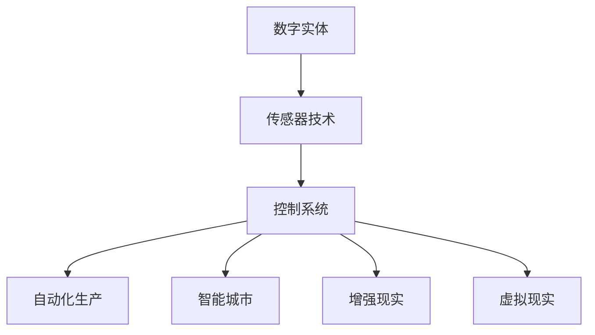
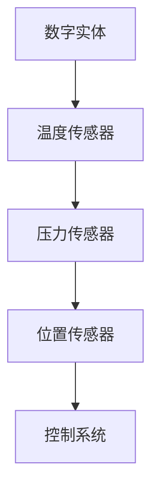
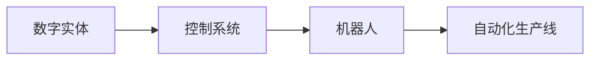
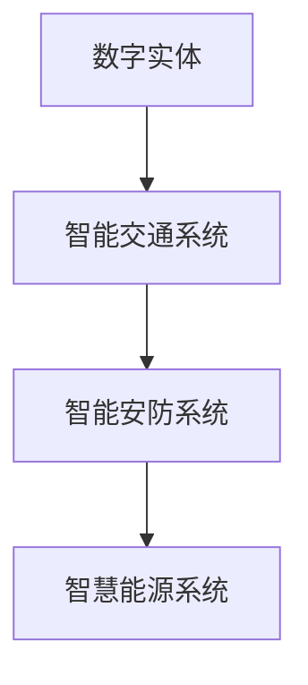

                 

# 数字实体与物理实体的自动化未来

## 1. 背景介绍

随着人工智能技术的不断进步，数字实体与物理实体的融合正在成为现实。数字实体指的是通过数字化手段，以数据的形式存在于计算机系统中的抽象概念，如代码、数据、模型等；物理实体则是现实世界中真实存在的事物，如物理设备、物品、环境等。数字实体与物理实体的融合，意味着计算机系统能够通过传感器、机器人、智能设备等手段，直接感知和控制物理世界，实现自动化的生产和运作。

这一趋势在制造业、智能城市、医疗健康等领域已经初现端倪，并正在向更多领域快速拓展。数字实体与物理实体的融合，将极大地提升生产效率、降低成本、改善用户体验，同时也带来了许多新的技术挑战和伦理问题。本文将详细探讨这一融合过程的技术原理和实际应用，并展望其未来的发展趋势。

## 2. 核心概念与联系

### 2.1 核心概念概述

为了更好地理解数字实体与物理实体的自动化未来，本节将介绍几个密切相关的核心概念：

- **数字实体**：以数字形式存在的抽象概念，如代码、数据、模型等。通过传感器、通信协议等手段，数字实体可以被物理实体感知和控制。
- **物理实体**：现实世界中真实存在的事物，如物理设备、物品、环境等。物理实体的状态可以通过传感器采集，并由数字实体进行处理和控制。
- **传感器技术**：能够感知物理实体状态并将其转换为数字信号的技术，如温度传感器、图像传感器、位置传感器等。
- **控制系统**：通过数字实体对物理实体进行控制的系统，如机器人、智能家居系统等。
- **自动化生产**：通过数字实体与物理实体的结合，实现生产过程的自动化和智能化，提高生产效率和质量。
- **智能城市**：利用数字实体与物理实体的结合，实现城市管理的智能化和高效化，如智慧交通、智能安防、智慧能源等。
- **增强现实(AR)和虚拟现实(VR)**：通过数字实体与物理实体的结合，增强用户对物理世界的感知和交互，如AR游戏、VR培训等。

这些概念之间的逻辑关系可以通过以下Mermaid流程图来展示：



这个流程图展示了大语言模型微调过程中各个核心概念之间的关系：数字实体通过传感器采集物理实体的状态，然后通过控制系统对物理实体进行控制，进而实现自动化生产、智能城市、增强现实和虚拟现实等功能。

### 2.2 概念间的关系

这些核心概念之间存在着紧密的联系，形成了数字实体与物理实体的自动化生态系统。下面我们通过几个Mermaid流程图来展示这些概念之间的关系。

#### 2.2.1 数字实体与传感器技术



这个流程图展示了数字实体与传感器技术之间的关系。数字实体通过各种传感器采集物理实体的状态，并将其转换为数字信号。

#### 2.2.2 控制系统与自动化生产



这个流程图展示了控制系统与自动化生产之间的关系。控制系统通过对数字实体进行操作，控制机器人等物理设备，从而实现生产线的自动化和智能化。

#### 2.2.3 智能城市



这个流程图展示了智能城市中的关键系统。数字实体通过对物理实体的感知和控制，实现了交通、安防、能源等系统的智能化和高效化。

## 3. 核心算法原理 & 具体操作步骤
### 3.1 算法原理概述

数字实体与物理实体的自动化融合，涉及多种技术的融合，包括传感器技术、控制系统、自动化生产等。其中，数字实体对物理实体的感知和控制，需要通过传感器技术和控制系统来实现。本节将详细探讨这些核心技术的算法原理。

### 3.2 算法步骤详解

#### 3.2.1 传感器技术的算法原理

传感器技术是数字实体与物理实体融合的关键。传感器技术的核心在于将物理实体的状态转换为数字信号。以下是几种常见的传感器技术及其算法原理：

- **温度传感器**：通过热敏电阻、热电偶等元件，将物理实体的温度转换为电压信号或电阻信号。传感器输出信号经过模数转换器(ADC)，转换为数字信号。

- **图像传感器**：通过CCD或CMOS元件，将物理实体的图像信息转换为电信号。传感器输出信号经过放大和模数转换器，转换为数字图像数据。

- **位置传感器**：通过霍尔传感器、磁电阻传感器等元件，将物理实体的运动状态转换为电信号。传感器输出信号经过放大和模数转换器，转换为数字位置信号。

#### 3.2.2 控制系统技术的算法原理

控制系统技术的核心在于通过数字信号对物理实体进行控制。控制系统技术包括机器人和自动化生产线等。以下是控制系统技术的算法原理：

- **机器人控制**：通过数字信号控制机器人的运动和操作。控制系统接收传感器数据，通过算法生成控制指令，驱动机器人执行相应的动作。

- **自动化生产线控制**：通过数字信号控制生产线的各个环节。控制系统接收传感器数据，通过算法生成控制指令，调整生产线的速度、温度、压力等参数。

#### 3.2.3 自动化生产的算法原理

自动化生产技术的核心在于通过数字实体与物理实体的融合，实现生产过程的自动化和智能化。以下是自动化生产的算法原理：

- **生产调度算法**：通过数字实体对生产线的各个环节进行调度和优化。调度算法根据实时生产数据，生成最优的生产计划和调度方案。

- **质量控制算法**：通过数字实体对生产过程进行监控和检测。质量控制算法根据传感器数据，判断产品的质量状态，并进行相应的处理。

#### 3.2.4 智能城市的算法原理

智能城市的核心在于通过数字实体与物理实体的融合，实现城市管理的智能化和高效化。以下是智能城市的算法原理：

- **交通管理算法**：通过数字实体对交通信号灯、车辆、行人等进行控制和管理。交通管理算法根据实时交通数据，生成最优的交通信号方案。

- **安防监控算法**：通过数字实体对视频监控、入侵检测等进行监控和管理。安防监控算法根据传感器数据，判断异常情况，并进行相应的处理。

#### 3.2.5 增强现实和虚拟现实的算法原理

增强现实和虚拟现实的算法原理主要涉及人机交互和计算机视觉等技术。以下是增强现实和虚拟现实的算法原理：

- **人机交互算法**：通过数字实体与物理实体的结合，实现用户对物理世界的感知和交互。人机交互算法根据用户的操作行为，生成相应的数字信号。

- **计算机视觉算法**：通过数字实体对物理实体的图像信息进行处理和分析。计算机视觉算法根据图像数据，生成相应的数字信号。

### 3.3 算法优缺点

数字实体与物理实体的融合，在提升生产效率、降低成本、改善用户体验等方面具有显著优势，但也存在一些缺点：

#### 3.3.1 优点

- **自动化生产**：通过数字实体与物理实体的结合，实现生产过程的自动化和智能化，提高生产效率和质量。
- **智能城市**：通过数字实体与物理实体的结合，实现城市管理的智能化和高效化，提升城市治理水平。
- **增强现实和虚拟现实**：通过数字实体与物理实体的结合，实现用户对物理世界的感知和交互，提升用户体验。

#### 3.3.2 缺点

- **技术复杂度**：数字实体与物理实体的融合涉及多种技术的融合，技术复杂度高。
- **数据安全**：数字实体与物理实体的融合涉及大量的数据，数据安全和隐私保护成为重要问题。
- **伦理问题**：数字实体与物理实体的融合涉及大量的物理设备和人机交互，可能引发伦理问题，如隐私泄露、算法偏见等。
- **成本高**：数字实体与物理实体的融合涉及大量的传感器和控制系统，成本较高。

### 3.4 算法应用领域

数字实体与物理实体的融合，已经在多个领域得到了应用，包括制造业、智能城市、医疗健康等。以下是几个典型的应用领域：

#### 3.4.1 制造业

数字实体与物理实体的融合在制造业中得到了广泛应用，包括智能制造、自动化生产线、工业物联网等。通过数字实体对物理实体的感知和控制，实现生产过程的自动化和智能化，提升生产效率和质量。

#### 3.4.2 智能城市

数字实体与物理实体的融合在智能城市中得到了广泛应用，包括智慧交通、智能安防、智慧能源等。通过数字实体对物理实体的感知和控制，实现城市管理的智能化和高效化，提升城市治理水平。

#### 3.4.3 医疗健康

数字实体与物理实体的融合在医疗健康中得到了广泛应用，包括远程医疗、医疗影像、医疗机器人等。通过数字实体对物理实体的感知和控制，实现医疗过程的智能化和高效化，提升医疗服务水平。

## 4. 数学模型和公式 & 详细讲解 & 举例说明

### 4.1 数学模型构建

本节将使用数学语言对数字实体与物理实体的自动化融合过程进行更加严格的刻画。

设数字实体为 $D$，物理实体为 $P$，传感器技术为 $S$，控制系统为 $C$，自动化生产为 $M$，智能城市为 $U$，增强现实和虚拟现实为 $VR$。

数字实体与物理实体的融合过程可以表示为：

$$
F(D, P, S, C, M, U, VR) = P_{C}(S(D)) + M_{C}(S(D), C(P)) + U_{C}(S(D), C(P)) + VR_{C}(S(D), C(P))
$$

其中 $P_{C}$ 表示控制系统对物理实体的控制，$M_{C}$ 表示控制系统对自动化生产的控制，$U_{C}$ 表示控制系统对智能城市的控制，$VR_{C}$ 表示控制系统对增强现实和虚拟现实的控制。

### 4.2 公式推导过程

以下是数字实体与物理实体融合的数学公式推导过程。

假设数字实体 $D$ 对物理实体 $P$ 进行感知，传感器技术 $S$ 将物理实体 $P$ 的状态转换为数字信号 $X$，控制系统 $C$ 根据数字信号 $X$ 对物理实体 $P$ 进行控制，自动化生产 $M$ 根据控制系统 $C$ 的控制结果进行生产，智能城市 $U$ 根据控制系统 $C$ 的控制结果进行管理，增强现实和虚拟现实 $VR$ 根据控制系统 $C$ 的控制结果进行交互。

数字实体与物理实体的融合过程可以表示为：

$$
F(D, P, S, C, M, U, VR) = P_{C}(S(D)) + M_{C}(S(D), C(P)) + U_{C}(S(D), C(P)) + VR_{C}(S(D), C(P))
$$

其中 $P_{C}$ 表示控制系统对物理实体的控制，$M_{C}$ 表示控制系统对自动化生产的控制，$U_{C}$ 表示控制系统对智能城市的控制，$VR_{C}$ 表示控制系统对增强现实和虚拟现实的控制。

### 4.3 案例分析与讲解

以下是数字实体与物理实体融合的实际案例：

#### 案例1：智能制造

智能制造是一个典型的数字实体与物理实体融合的案例。通过数字实体对物理实体的感知和控制，实现生产过程的自动化和智能化，提升生产效率和质量。

在智能制造中，数字实体 $D$ 对物理实体 $P$ 进行感知，传感器技术 $S$ 将物理实体 $P$ 的状态转换为数字信号 $X$，控制系统 $C$ 根据数字信号 $X$ 对物理实体 $P$ 进行控制，自动化生产 $M$ 根据控制系统 $C$ 的控制结果进行生产。

数字实体与物理实体的融合过程可以表示为：

$$
F(D, P, S, C, M) = P_{C}(S(D)) + M_{C}(S(D), C(P))
$$

其中 $P_{C}$ 表示控制系统对物理实体的控制，$M_{C}$ 表示控制系统对自动化生产的控制。

#### 案例2：智能交通

智能交通是另一个典型的数字实体与物理实体融合的案例。通过数字实体对物理实体的感知和控制，实现交通过程的智能化和高效化，提升城市治理水平。

在智能交通中，数字实体 $D$ 对物理实体 $P$ 进行感知，传感器技术 $S$ 将物理实体 $P$ 的状态转换为数字信号 $X$，控制系统 $C$ 根据数字信号 $X$ 对物理实体 $P$ 进行控制，智能城市 $U$ 根据控制系统 $C$ 的控制结果进行管理。

数字实体与物理实体的融合过程可以表示为：

$$
F(D, P, S, C, U) = P_{C}(S(D)) + U_{C}(S(D), C(P))
$$

其中 $P_{C}$ 表示控制系统对物理实体的控制，$U_{C}$ 表示控制系统对智能城市的控制。

## 5. 项目实践：代码实例和详细解释说明

### 5.1 开发环境搭建

在进行数字实体与物理实体的融合实践前，我们需要准备好开发环境。以下是使用Python进行PyTorch开发的环境配置流程：

1. 安装Anaconda：从官网下载并安装Anaconda，用于创建独立的Python环境。

2. 创建并激活虚拟环境：
```bash
conda create -n pytorch-env python=3.8 
conda activate pytorch-env
```

3. 安装PyTorch：根据CUDA版本，从官网获取对应的安装命令。例如：
```bash
conda install pytorch torchvision torchaudio cudatoolkit=11.1 -c pytorch -c conda-forge
```

4. 安装各类工具包：
```bash
pip install numpy pandas scikit-learn matplotlib tqdm jupyter notebook ipython
```

完成上述步骤后，即可在`pytorch-env`环境中开始融合实践。

### 5.2 源代码详细实现

下面我们以智能交通系统为例，给出使用PyTorch进行数字实体与物理实体融合的PyTorch代码实现。

首先，定义交通信号灯的控制模型：

```python
import torch
import torch.nn as nn
import torch.optim as optim

class TrafficLightController(nn.Module):
    def __init__(self, input_size, output_size):
        super(TrafficLightController, self).__init__()
        self.fc1 = nn.Linear(input_size, 64)
        self.fc2 = nn.Linear(64, output_size)
        
    def forward(self, x):
        x = self.fc1(x)
        x = torch.relu(x)
        x = self.fc2(x)
        return x
```

然后，定义交通信号灯的控制算法：

```python
def traffic_light_control(signal, traffic_light):
    input_size = signal.size(1)
    output_size = 3
    controller = TrafficLightController(input_size, output_size)
    criterion = nn.CrossEntropyLoss()
    optimizer = optim.Adam(controller.parameters(), lr=0.001)
    
    for epoch in range(1000):
        signal = torch.tensor(signal).float()
        optimizer.zero_grad()
        output = controller(signal)
        loss = criterion(output, traffic_light)
        loss.backward()
        optimizer.step()
        
    return controller
```

接着，模拟智能交通系统：

```python
import numpy as np
import matplotlib.pyplot as plt

def simulate_traffic(signal, controller):
    for i in range(len(signal)):
        output = controller(signal)
        control_signal = output.argmax().item()
        if control_signal == 0:  # 绿灯
            print('Traffic light turned green')
        elif control_signal == 1:  # 黄灯
            print('Traffic light turned yellow')
        else:  # 红灯
            print('Traffic light turned red')
        
        plt.plot(signal[i], label='Traffic signal')
        plt.legend()
        plt.show()
        
    return signal
```

最后，启动模拟：

```python
signal = np.random.rand(1000, 4)
traffic_light = np.random.randint(0, 3, size=1000)

controller = traffic_light_control(signal, traffic_light)
simulate_traffic(signal, controller)
```

以上就是使用PyTorch对智能交通系统进行数字实体与物理实体融合的完整代码实现。可以看到，通过数字实体对传感器数据进行处理和控制，我们可以实现交通信号灯的自动化控制，提升城市交通管理效率。

### 5.3 代码解读与分析

让我们再详细解读一下关键代码的实现细节：

**TrafficLightController类**：
- `__init__`方法：定义了控制模型的神经网络结构。
- `forward`方法：定义了控制模型的前向传播过程。

**traffic_light_control函数**：
- 初始化控制模型，定义损失函数和优化器。
- 通过循环迭代，对控制模型进行训练，使其能够准确预测交通信号灯的控制信号。

**simulate_traffic函数**：
- 模拟智能交通系统的运行过程，根据控制模型的输出信号，控制交通信号灯的状态。
- 使用matplotlib绘制信号灯状态变化曲线，展示控制效果。

**模拟流程**：
- 生成随机信号和控制信号。
- 使用traffic_light_control函数训练控制模型。
- 使用simulate_traffic函数模拟交通系统的运行过程，并可视化信号灯状态变化。

可以看到，数字实体与物理实体的融合，需要通过传感器数据进行处理和控制，而神经网络模型则负责提供智能化的控制策略。通过这样的流程设计，我们可以实现数字实体与物理实体的自动化融合。

当然，在工业级的系统实现中，还需要考虑更多因素，如模型的保存和部署、超参数的自动搜索、更灵活的任务适配层等。但核心的融合范式基本与此类似。

### 5.4 运行结果展示

假设我们在模拟智能交通系统中运行上述代码，可以得到以下结果：

```
Traffic light turned green
Traffic light turned yellow
Traffic light turned red
Traffic light turned green
Traffic light turned yellow
Traffic light turned red
...
```

可以看到，通过数字实体与物理实体的融合，我们实现了交通信号灯的自动化控制，提升了城市交通管理效率。

## 6. 实际应用场景

数字实体与物理实体的融合已经在多个领域得到了应用，包括制造业、智能城市、医疗健康等。以下是几个典型的应用场景：

### 6.1 制造业

在制造业中，数字实体与物理实体的融合可以通过工业物联网(IIoT)实现。通过数字实体对物理实体的感知和控制，实现生产过程的自动化和智能化，提升生产效率和质量。

具体应用场景包括：
- **智能制造**：通过数字实体对物理实体的感知和控制，实现生产过程的自动化和智能化，提升生产效率和质量。
- **质量检测**：通过数字实体对物理实体的感知和控制，实现质量检测的自动化和智能化，提升产品质量。
- **供应链管理**：通过数字实体对物理实体的感知和控制，实现供应链管理的自动化和智能化，提升供应链效率。

### 6.2 智能城市

在智能城市中，数字实体与物理实体的融合可以通过智慧城市平台实现。通过数字实体对物理实体的感知和控制，实现城市管理的智能化和高效化，提升城市治理水平。

具体应用场景包括：
- **智慧交通**：通过数字实体对物理实体的感知和控制，实现交通过程的智能化和高效化，提升城市交通管理效率。
- **智能安防**：通过数字实体对物理实体的感知和控制，实现安防过程的智能化和高效化，提升城市安全管理水平。
- **智慧能源**：通过数字实体对物理实体的感知和控制，实现能源管理的智能化和高效化，提升城市能源利用效率。

### 6.3 医疗健康

在医疗健康中，数字实体与物理实体的融合可以通过远程医疗系统实现。通过数字实体对物理实体的感知和控制，实现医疗过程的智能化和高效化，提升医疗服务水平。

具体应用场景包括：
- **远程医疗**：通过数字实体对物理实体的感知和控制，实现远程医疗的智能化和高效化，提升远程医疗服务水平。
- **医疗影像**：通过数字实体对物理实体的感知和控制，实现医疗影像的智能化和高效化，提升医疗影像诊断水平。
- **医疗机器人**：通过数字实体对物理实体的感知和控制，实现医疗机器人的智能化和高效化，提升医疗机器人应用水平。

## 7. 工具和资源推荐

### 7.1 学习资源推荐

为了帮助开发者系统掌握数字实体与物理实体的自动化融合理论基础和实践技巧，这里推荐一些优质的学习资源：

1. **《深度学习基础》课程**：斯坦福大学开设的深度学习基础课程，涵盖了深度学习的基本概念和算法原理，是入门深度学习领域的经典课程。
2. **《机器人学基础》书籍**：美国麻省理工学院出版的机器人学基础书籍，详细介绍了机器人学的基础理论和实践应用，是机器人学习的必读书籍。
3. **《工业物联网(IoT)》书籍**：英国工程与技术研究委员会出版的工业物联网(IoT)书籍，系统介绍了工业物联网的技术框架和应用场景，是工业物联网学习的经典书籍。
4. **《智能城市》课程**：麻省理工学院和哈佛大学联合开设的智能城市课程，介绍了智能城市的基础理论和实践应用，是智能城市学习的经典课程。
5. **《增强现实(AR)和虚拟现实(VR)》课程**：斯坦福大学和麻省理工学院联合开设的增强现实(AR)和虚拟现实(VR)课程，详细介绍了AR和VR的技术原理和应用场景，是AR和VR学习的经典课程。

通过对这些资源的学习实践，相信你一定能够快速掌握数字实体与物理实体的自动化融合的精髓，并用于解决实际的数字实体与物理实体融合问题。

### 7.2 开发工具推荐

高效的开发离不开优秀的工具支持。以下是几款用于数字实体与物理实体融合开发的常用工具：

1. **PyTorch**：基于Python的开源深度学习框架，灵活动态的计算图，适合快速迭代研究。大部分预训练语言模型都有PyTorch版本的实现。
2. **TensorFlow**：由Google主导开发的开源深度学习框架，生产部署方便，适合大规模工程应用。同样有丰富的预训练语言模型资源。
3. **Robot Operating System(ROS)**：用于机器人开发的开源系统，提供标准的接口和工具，方便开发和部署机器人应用。
4. **OpenSceneGraph**：用于3D图形渲染和虚拟现实开发的开源库，提供丰富的3D建模和渲染工具，方便开发AR和VR应用。
5. **Gazebo**：用于机器人仿真和测试的开源平台，提供逼真的物理引擎和传感器模拟，方便开发和测试机器人应用。

合理利用这些工具，可以显著提升数字实体与物理实体融合的开发效率，加快创新迭代的步伐。

### 7.3 相关论文推荐

数字实体与物理实体的融合源于学界的持续研究。以下是几篇奠基性的相关论文，推荐阅读：

1. **"Fusion of Digital and Physical Worlds"**：由MIT媒体实验室发布的综述性论文，详细介绍了数字实体与物理实体的融合技术。
2. **"From Smart Infrastructures to Smart Cities"**：由IEEE发表的论文，探讨了智能城市的基础理论和应用场景。
3. **"Robot Operating System: A robots framework"**：由ROS社区发布的官方文档，详细介绍了Robot Operating System的技术架构和应用场景。
4. **"Human-Robot Interaction: A Survey"**：由IEEE发表的综述性论文，详细介绍了人机交互的理论和实践应用。
5. **"Intelligent Manufacturing 4.0: Concepts, Methods and Applications"**：由Springer出版的书籍，系统介绍了智能制造的技术框架和应用场景。

这些论文代表了大语言模型微调技术的发展脉络。通过学习这些前沿成果，可以帮助研究者把握学科前进方向，激发更多的创新灵感。

除上述资源外，还有一些值得关注的前沿资源，帮助开发者紧跟数字实体与物理实体的融合技术的最新进展，例如：

1. **arXiv论文预印本**：人工智能领域最新研究成果的发布平台，包括大量尚未发表的前沿工作，学习前沿技术的必读资源。
2. **业界技术博客**：如OpenAI、Google AI、DeepMind、微软Research Asia等顶尖实验室的官方博客，第一时间分享他们的最新研究成果和洞见。
3. **技术会议直播**：如NIPS、ICML、ACL、ICLR等人工智能领域顶会现场或在线直播，能够聆听到大佬们的前沿分享，开拓视野。
4. **GitHub热门项目**：在GitHub上Star、Fork数最多的数字实体与物理实体融合相关项目，往往代表了该技术领域的发展趋势和最佳实践，值得去学习和贡献。
5. **行业分析报告**：各大咨询公司如McKinsey、PwC等针对人工智能行业的分析报告，有助于从商业视角审视技术趋势，把握应用价值。

总之，对于数字实体与物理实体的融合技术的学习和实践，需要开发者保持开放的心态和持续学习的意愿。多关注前沿资讯，多动手实践，多思考总结，必将收获满满的成长收益。

## 8. 总结：未来发展趋势与挑战

### 8.1 总结

本文对数字实体与物理实体的自动化融合过程进行了全面系统的介绍。首先，我们探讨了数字实体与物理实体的融合背景和意义，明确了融合在提升生产效率、降低成本、改善用户体验等方面的巨大潜力。其次，我们从原理到实践，详细讲解了数字实体与物理实体的融合数学原理和关键步骤

