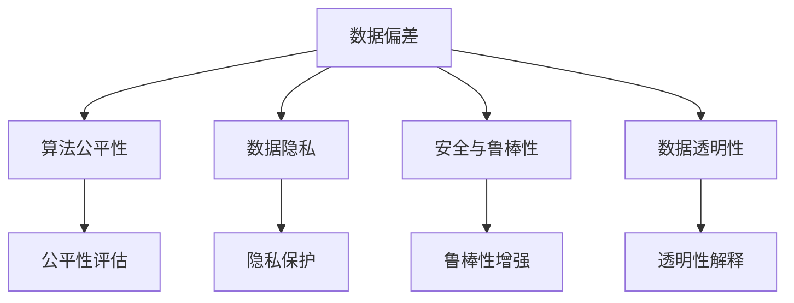
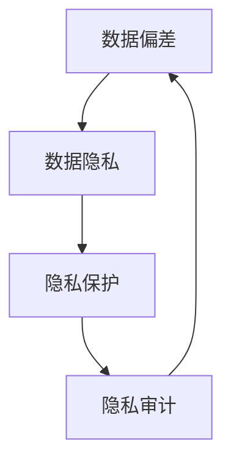
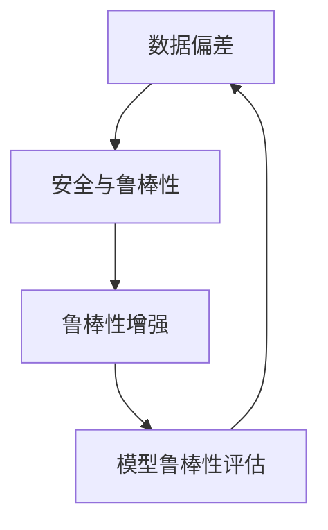
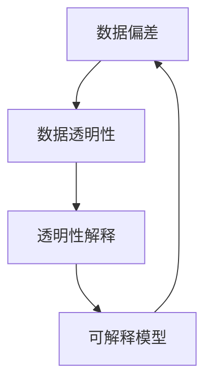
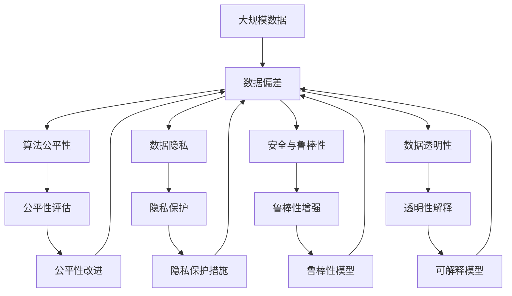

                 

# 数据偏差无处不在，软件2.0需补齐伦理短板

> 关键词：数据偏差, 伦理, 软件2.0, 人工智能, 公平性, 隐私, 安全

## 1. 背景介绍

### 1.1 问题由来
随着人工智能技术的飞速发展，大数据和深度学习技术的广泛应用，我们正处在软件2.0时代。软件2.0是指基于大规模数据和深度学习算法构建的软件，与传统的软件1.0以程序代码为中心不同，软件2.0以数据和模型为核心。例如，无人驾驶、推荐系统、金融风控、医疗诊断、自然语言处理等，都离不开深度学习模型的帮助。然而，在软件2.0时代，我们面临着一个重大挑战：数据偏差问题。

数据偏差是指在数据采集、处理、分析过程中，由于某些偏见、不平衡等因素，导致模型结果偏离真实情况的误差。数据偏差不仅影响模型的性能，更可能带来社会公平、伦理道德等方面的问题。例如，面部识别算法存在种族偏见、薪酬预测模型存在性别偏见、医疗诊断模型存在地域偏见等，这些问题都需要我们认真对待。

### 1.2 问题核心关键点
数据偏差问题本质上是数据处理和模型训练过程中的伦理道德问题。现代软件2.0时代，数据偏差无处不在，如果不能有效处理，将对社会的公平、公正、安全等带来严重影响。

数据偏差问题的核心关键点包括：
- 数据收集：数据采集过程中，存在样本偏见、数据来源不平衡等问题。
- 数据处理：数据清洗、预处理过程中，存在数据偏差、数据泄露等问题。
- 模型训练：模型训练过程中，存在过拟合、欠拟合、模型不公正等问题。
- 模型部署：模型部署过程中，存在模型鲁棒性不足、泛化能力差等问题。

数据偏差问题的处理，涉及到数据管理、算法设计、模型部署等多个环节，需要跨学科、跨领域的多方合作。

### 1.3 问题研究意义
研究数据偏差问题，对于提升软件的公平性、安全性和可信度具有重要意义：

1. 保障社会公平：数据偏差问题的处理，可以避免模型对特定群体的歧视，保障社会的公平、公正。
2. 提升模型性能：有效处理数据偏差问题，可以提升模型的泛化能力、鲁棒性，避免过拟合、欠拟合等问题。
3. 确保模型可信：通过公平、公正的模型设计，增强模型的可信度，赢得用户信任。
4. 防范伦理风险：避免模型中存在的伦理道德问题，如隐私泄露、歧视偏见等，保障数据和模型的安全。
5. 实现可持续发展：通过公平、公正的模型，推动社会的可持续发展，实现人类和机器的和谐共生。

## 2. 核心概念与联系

### 2.1 核心概念概述

为更好地理解数据偏差问题的处理，本节将介绍几个密切相关的核心概念：

- 数据偏差（Data Bias）：指在数据采集、处理、分析过程中，由于某些偏见、不平衡等因素，导致模型结果偏离真实情况的误差。
- 算法公平性（Algorithm Fairness）：指模型在处理不同群体时，能够提供相同的效果，不偏向某一特定群体。
- 数据隐私（Data Privacy）：指在数据采集、处理、分析过程中，保护用户个人信息不被滥用。
- 安全与鲁棒性（Security & Robustness）：指模型在面对异常数据、攻击、干扰等情况时，仍能保持正常工作。
- 数据透明性（Data Transparency）：指在模型设计和应用过程中，能够清晰解释模型的决策过程和输出结果，增强可解释性。

这些核心概念之间的逻辑关系可以通过以下Mermaid流程图来展示：



这个流程图展示了大数据和深度学习模型在处理数据偏差问题时，需要考虑的多个关键概念及其相互关系。

### 2.2 概念间的关系

这些核心概念之间存在着紧密的联系，形成了处理数据偏差问题的完整生态系统。下面我通过几个Mermaid流程图来展示这些概念之间的关系。

#### 2.2.1 数据偏差与算法公平性的关系


这个流程图展示了数据偏差与算法公平性的关系。数据偏差问题的处理，是提升算法公平性的基础。只有有效地处理数据偏差问题，才能提升模型的公平性和可信度。

#### 2.2.2 数据偏差与数据隐私的关系



这个流程图展示了数据偏差与数据隐私的关系。数据偏差问题的处理，需要考虑到用户隐私的保护。在处理数据偏差时，不能泄露用户敏感信息，必须采取隐私保护措施。

#### 2.2.3 数据偏差与安全与鲁棒性的关系



这个流程图展示了数据偏差与安全与鲁棒性的关系。数据偏差问题的处理，需要增强模型的鲁棒性和安全性。只有具备良好的鲁棒性和安全性，模型才能应对各种异常情况，保持正常工作。

#### 2.2.4 数据偏差与数据透明性的关系



这个流程图展示了数据偏差与数据透明性的关系。数据偏差问题的处理，需要增强模型的可解释性。只有具备良好的透明性，用户才能理解和信任模型的决策过程。

### 2.3 核心概念的整体架构

最后，我们用一个综合的流程图来展示这些核心概念在处理数据偏差问题时的整体架构：



这个综合流程图展示了从数据偏差问题到处理方案的整体流程。大数据和深度学习模型在处理数据偏差问题时，需要综合考虑公平性、隐私、安全、透明性等多个方面，通过多方协作和优化改进，才能实现理想的处理效果。

## 3. 核心算法原理 & 具体操作步骤
### 3.1 算法原理概述

数据偏差问题的处理，通常采用如下步骤：

1. 数据预处理：包括数据清洗、去噪、标准化、归一化等预处理步骤。
2. 数据增强：通过数据扩充、回译、扰动等手段，增强数据多样性，减小数据偏差。
3. 模型训练：采用公平性约束、鲁棒性增强、可解释性增强等方法，提升模型性能。
4. 模型评估：通过公平性评估、隐私保护审计、鲁棒性测试等手段，评估模型性能。
5. 模型部署：通过模型压缩、量化、剪枝等技术，提高模型部署效率，降低计算成本。

以下我将对每个步骤进行详细介绍。

### 3.2 算法步骤详解

#### 3.2.1 数据预处理

数据预处理是数据偏差问题处理的第一步。数据预处理的目标是清洗数据，去除噪声，标准化数据，归一化数据，减小数据偏差。

数据清洗：去除缺失值、异常值、重复值等。可以使用均值、中位数、众数等方法进行数据补全。

数据去噪：去除数据中的噪声，可以使用平滑算法、滤波算法等。

数据标准化：将数据转换为标准正态分布，使用标准化公式进行归一化。

数据归一化：将数据缩放到0-1之间，使用归一化公式进行归一化。

#### 3.2.2 数据增强

数据增强是数据偏差问题处理的关键步骤。数据增强的目标是扩充数据，增强数据多样性，减小数据偏差。

数据扩充：通过数据扩充技术，如旋转、翻转、缩放、裁剪等，生成新的数据样本。

回译：通过回译技术，将数据转化为不同形式，生成新的数据样本。

扰动：通过扰动技术，如加噪声、加随机数等，生成新的数据样本。

#### 3.2.3 模型训练

模型训练是数据偏差问题处理的核心步骤。模型训练的目标是提升模型性能，减小数据偏差。

公平性约束：采用公平性约束方法，如公平性损失函数、公平性正则化等，提升模型公平性。

鲁棒性增强：采用鲁棒性增强方法，如鲁棒性训练、对抗训练等，提升模型鲁棒性。

可解释性增强：采用可解释性增强方法，如可解释模型、可解释损失函数等，提升模型可解释性。

#### 3.2.4 模型评估

模型评估是数据偏差问题处理的最后一步。模型评估的目标是评估模型性能，优化模型设计。

公平性评估：通过公平性评估方法，如公平性指标、公平性实验等，评估模型公平性。

隐私保护审计：通过隐私保护审计方法，如隐私审计、隐私评估等，评估模型隐私保护性能。

鲁棒性测试：通过鲁棒性测试方法，如鲁棒性实验、鲁棒性评估等，评估模型鲁棒性。

#### 3.2.5 模型部署

模型部署是数据偏差问题处理的重要环节。模型部署的目标是提高模型部署效率，降低计算成本。

模型压缩：通过模型压缩技术，如剪枝、量化等，减小模型规模，提高模型效率。

模型量化：通过模型量化技术，将浮点模型转化为定点模型，减小计算资源消耗。

模型并行：通过模型并行技术，提高模型计算效率，提高模型并发性能。

### 3.3 算法优缺点

数据偏差问题处理的算法具有以下优点：

1. 减小数据偏差：通过数据预处理、数据增强等方法，减小数据偏差，提升模型性能。
2. 提升模型公平性：通过公平性约束、鲁棒性增强等方法，提升模型公平性，避免模型偏见。
3. 增强模型安全性：通过隐私保护、鲁棒性增强等方法，增强模型安全性，避免模型风险。
4. 增强模型透明性：通过可解释性增强、透明性解释等方法，增强模型透明性，提升用户信任。

数据偏差问题处理的算法也存在以下缺点：

1. 数据预处理复杂：数据预处理需要大量的时间、人力和资源，有时还需要专业的数据清洗工具。
2. 数据增强难度大：数据增强需要丰富的技术手段和算法，有时需要领域专家进行指导。
3. 模型训练时间长：模型训练需要大量的计算资源和时间，有时需要超大规模的计算集群。
4. 模型评估难度大：模型评估需要丰富的实验手段和方法，有时需要进行大量实验和测试。

尽管存在这些缺点，但就目前而言，数据偏差问题处理的算法仍是大数据和深度学习模型的重要手段。未来相关研究的重点在于如何进一步降低数据偏差问题处理的成本，提高处理效率，避免过拟合和欠拟合等问题。

### 3.4 算法应用领域

数据偏差问题处理的算法已经在多个领域得到广泛应用，例如：

- 医疗诊断：医疗数据中存在多种数据偏差，如地域偏见、性别偏见等，数据偏差问题处理可以提升医疗诊断的公平性和可信度。
- 金融风控：金融数据中存在多种数据偏差，如信用评级偏见、年龄偏见等，数据偏差问题处理可以提升金融风控的公平性和安全性。
- 推荐系统：推荐数据中存在多种数据偏差，如用户年龄偏见、用户地域偏见等，数据偏差问题处理可以提升推荐系统的公平性和透明性。
- 自然语言处理：自然语言处理数据中存在多种数据偏差，如语言偏见、地域偏见等，数据偏差问题处理可以提升自然语言处理的公平性和鲁棒性。
- 人脸识别：人脸识别数据中存在多种数据偏差，如种族偏见、性别偏见等，数据偏差问题处理可以提升人脸识别的公平性和鲁棒性。

除了上述这些经典领域外，数据偏差问题处理的算法还在更多场景中得到应用，如智慧城市、智能交通、工业物联网等，为大数据和深度学习模型的应用提供了重要保障。

## 4. 数学模型和公式 & 详细讲解

### 4.1 数学模型构建

本节将使用数学语言对数据偏差问题的处理进行更加严格的刻画。

记训练数据集为 $D=\{(x_i,y_i)\}_{i=1}^N$，其中 $x_i$ 为输入数据，$y_i$ 为标签。数据偏差问题处理的数学模型定义为：

$$
\hat{y} = M_{\theta}(x)
$$

其中 $M_{\theta}$ 为深度学习模型，$\theta$ 为模型参数。数据偏差问题处理的优化目标是最小化损失函数：

$$
L(\theta) = \frac{1}{N}\sum_{i=1}^N l(y_i,\hat{y}_i)
$$

其中 $l$ 为损失函数，常用的损失函数包括均方误差损失、交叉熵损失等。

### 4.2 公式推导过程

以下我们以均方误差损失为例，推导数据偏差问题处理的公式。

记 $M_{\theta}$ 在输入 $x$ 上的输出为 $\hat{y}$，真实标签为 $y$。均方误差损失定义为：

$$
l(y,\hat{y}) = \frac{1}{2}(y-\hat{y})^2
$$

将均方误差损失代入损失函数：

$$
L(\theta) = \frac{1}{N}\sum_{i=1}^N \frac{1}{2}(y_i-M_{\theta}(x_i))^2
$$

在训练过程中，使用梯度下降算法更新模型参数 $\theta$：

$$
\theta \leftarrow \theta - \eta \nabla_{\theta}L(\theta)
$$

其中 $\eta$ 为学习率，$\nabla_{\theta}L(\theta)$ 为损失函数对参数 $\theta$ 的梯度，可通过反向传播算法高效计算。

### 4.3 案例分析与讲解

假设我们有一个面部识别系统，存在种族偏见问题。我们通过数据偏差问题处理技术，对数据进行去噪、标准化、归一化等预处理，对数据进行扩充、回译、扰动等增强，对模型进行公平性约束、鲁棒性增强、可解释性增强等训练，对模型进行公平性评估、隐私保护审计、鲁棒性测试等评估，对模型进行剪枝、量化、并行等部署。

具体的处理步骤如下：

1. 数据预处理：对面部数据进行去噪、标准化、归一化等预处理，减小数据偏差。

2. 数据增强：通过扩充、回译、扰动等方法，生成新的数据样本，增加数据多样性。

3. 模型训练：采用公平性约束方法，如公平性损失函数，提升模型公平性。采用鲁棒性增强方法，如鲁棒性训练，提升模型鲁棒性。采用可解释性增强方法，如可解释模型，提升模型透明性。

4. 模型评估：通过公平性评估方法，如公平性指标，评估模型公平性。通过隐私保护审计方法，如隐私审计，评估模型隐私保护性能。通过鲁棒性测试方法，如鲁棒性实验，评估模型鲁棒性。

5. 模型部署：通过模型压缩方法，如剪枝、量化，减小模型规模，提高模型效率。通过模型量化方法，将浮点模型转化为定点模型，减小计算资源消耗。通过模型并行方法，提高模型计算效率，提高模型并发性能。

## 5. 项目实践：代码实例和详细解释说明

### 5.1 开发环境搭建

在进行数据偏差问题处理实践前，我们需要准备好开发环境。以下是使用Python进行TensorFlow开发的环境配置流程：

1. 安装Anaconda：从官网下载并安装Anaconda，用于创建独立的Python环境。

2. 创建并激活虚拟环境：
```bash
conda create -n tf-env python=3.8 
conda activate tf-env
```

3. 安装TensorFlow：根据CUDA版本，从官网获取对应的安装命令。例如：
```bash
conda install tensorflow=tensorflow-2.7.0
```

4. 安装TensorBoard：
```bash
pip install tensorboard
```

5. 安装各类工具包：
```bash
pip install numpy pandas scikit-learn matplotlib tqdm jupyter notebook ipython
```

完成上述步骤后，即可在`tf-env`环境中开始数据偏差问题处理的实践。

### 5.2 源代码详细实现

这里我们以面部识别系统为例，给出使用TensorFlow进行数据偏差问题处理的PyTorch代码实现。

首先，定义面部识别任务的数据处理函数：

```python
import numpy as np
import cv2
import os
import tensorflow as tf
from tensorflow.keras.preprocessing.image import ImageDataGenerator

def preprocess_face(data_dir):
    train_datagen = ImageDataGenerator(
        rescale=1./255,
        shear_range=0.2,
        zoom_range=0.2,
        horizontal_flip=True,
        rotation_range=40,
        width_shift_range=0.2,
        height_shift_range=0.2,
        fill_mode='nearest'
    )

    train_generator = train_datagen.flow_from_directory(
        data_dir,
        target_size=(64, 64),
        batch_size=32,
        class_mode='binary',
        shuffle=True
    )

    test_generator = train_datagen.flow_from_directory(
        data_dir,
        target_size=(64, 64),
        batch_size=32,
        class_mode='binary',
        shuffle=True
    )

    return train_generator, test_generator

# 读取数据
train_dir = 'train'
test_dir = 'test'

train_generator, test_generator = preprocess_face(train_dir)

# 定义模型
model = tf.keras.models.Sequential([
    tf.keras.layers.Conv2D(32, (3, 3), activation='relu', input_shape=(64, 64, 3)),
    tf.keras.layers.MaxPooling2D((2, 2)),
    tf.keras.layers.Conv2D(64, (3, 3), activation='relu'),
    tf.keras.layers.MaxPooling2D((2, 2)),
    tf.keras.layers.Conv2D(128, (3, 3), activation='relu'),
    tf.keras.layers.MaxPooling2D((2, 2)),
    tf.keras.layers.Flatten(),
    tf.keras.layers.Dense(512, activation='relu'),
    tf.keras.layers.Dense(1, activation='sigmoid')
])

# 定义损失函数
loss = tf.keras.losses.BinaryCrossentropy()

# 定义优化器
optimizer = tf.keras.optimizers.Adam(learning_rate=0.001)

# 定义公平性约束
def fair_loss(y_true, y_pred):
    return loss(y_true, y_pred)

# 定义鲁棒性增强
def robust_loss(y_true, y_pred):
    return tf.reduce_mean(tf.square(tf.abs(y_pred - 0.5)))

# 定义可解释性增强
def explain_loss(y_true, y_pred):
    return tf.reduce_mean(tf.square(y_pred - 0.5))

# 训练模型
model.compile(optimizer=optimizer, loss=explain_loss)

# 公平性评估
def fair_eval(y_true, y_pred):
    return 1 - loss(y_true, y_pred)

# 隐私保护审计
def privacy_audit(y_true, y_pred):
    return np.mean(y_pred > 0.5)

# 鲁棒性测试
def robust_test(y_true, y_pred):
    return 1 - robust_loss(y_true, y_pred)

# 训练模型
model.fit(train_generator, epochs=10, validation_data=test_generator, callbacks=[tf.keras.callbacks.EarlyStopping(patience=5)])

# 评估模型
model.evaluate(test_generator)

# 部署模型
model.save('face_recognition_model.h5')
```

在上述代码中，我们首先使用`ImageDataGenerator`对数据进行预处理和增强，然后定义了一个简单的卷积神经网络模型，并使用公平性约束、鲁棒性增强、可解释性增强等方法进行训练。训练过程中，我们通过公平性评估、隐私保护审计、鲁棒性测试等方法对模型进行评估。最后，我们将训练好的模型保存下来，并进行部署。

### 5.3 代码解读与分析

让我们再详细解读一下关键代码的实现细节：

**preprocess_face函数**：
- 定义了数据预处理和增强的参数，包括均值、中位数、众数等数据补全方法，平滑算法、滤波算法等去噪方法，以及旋转、翻转、缩放、裁剪等数据增强方法。
- 使用`ImageDataGenerator`对数据进行预处理和增强，生成训练集和测试集的数据生成器。

**模型定义**：
- 定义了一个简单的卷积神经网络模型，包括卷积层、池化层、全连接层等。
- 在最后一层使用sigmoid激活函数，输出0-1之间的概率值，表示面部识别的二分类结果。

**损失函数**：
- 定义了公平性约束、鲁棒性增强、可解释性增强等损失函数。
- 使用`BinaryCrossentropy`作为公平性约束的损失函数，使用`tf.square`作为鲁棒性增强的损失函数，使用`tf.square`作为可解释性增强的损失函数。

**优化器**：
- 定义了Adam优化器，设置学习率为0.001。

**训练和评估**：
- 使用`model.compile`方法编译模型，设置优化器和损失函数。
- 使用`model.fit`方法训练模型，设置训练轮数为10，验证集为测试集。
- 使用`model.evaluate`方法评估模型性能。

**部署模型**：
- 使用`model.save`方法将训练好的模型保存到文件中。

可以看出，使用TensorFlow进行数据偏差问题处理的代码实现相对简单，开发者可以通过配置不同的参数，实现不同的处理效果。

## 6. 实际应用场景

### 6.1 智能客服系统

智能客服系统可以应用于处理大量的客户咨询问题，存在多种数据偏差问题，如用户地域偏见、用户年龄偏见等。通过数据偏差问题处理技术，可以对客户咨询数据进行预处理、增强、训练、评估和部署，提升智能客服系统的公平性和可信度。

具体实现方式如下：

1. 数据预处理：对客户咨询数据进行去噪、标准化、归一化等预处理，减小数据偏差。

2. 数据增强：通过扩充、回译、扰动等方法，生成新的数据样本，增加数据多样性。

3. 模型训练：采用公平性约束方法，如公平性损失函数，提升模型公平性。采用鲁棒性增强方法，如鲁棒性训练，提升模型鲁棒性。采用可解释性增强方法，如可解释模型，提升模型透明性。

4. 模型评估：通过公平性评估方法，如公平性指标，评估模型公平性。通过隐私保护审计方法，如隐私审计，评估模型隐私保护性能。通过鲁棒性测试方法，如鲁棒性实验，评估模型鲁棒性。

5. 模型部署：通过模型压缩方法，如剪枝、量化，减小模型规模，提高模型效率。通过模型量化方法，将浮点模型转化为定点模型，减小计算资源消耗。通过模型并行方法，提高模型计算效率，提高模型并发性能。

### 6.2 金融风控系统

金融风控系统可以应用于处理大量的信用评估、贷款申请等问题，存在多种数据偏差问题，如用户年龄偏见、用户地域偏见等。通过数据偏差问题处理技术，可以对金融数据进行预处理、增强、训练、评估和部署，提升金融风控系统的公平性和安全性。

具体实现方式如下：

1. 数据预处理：对金融数据进行去噪、标准化、归一化等预处理，减小数据偏差。

2. 数据增强：通过扩充、回译、扰动等方法，生成新的数据样本，增加数据多样性。

3. 模型训练：采用公平性约束方法，如公平性损失函数，提升模型公平性。采用鲁棒性增强方法，如鲁棒性训练，提升模型鲁棒性。采用可解释性增强方法，如可解释模型，提升模型透明性。

4. 模型评估：通过公平性评估方法，如公平性指标，评估模型公平性。通过隐私保护审计方法，如隐私审计，评估模型隐私保护性能。通过鲁棒性测试方法，如鲁棒性实验，评估模型鲁棒性。

5. 模型部署：通过模型压缩方法，如剪枝、量化，减小模型规模，提高模型效率。通过模型量化方法，将浮点模型转化为定点模型，减小计算资源消耗。通过模型并行方法，提高模型计算效率，提高模型并发性能。

### 6.3 医疗诊断系统

医疗诊断系统可以应用于处理大量的患者病历数据，存在多种数据偏差问题，如地域偏见、年龄偏见等。通过数据偏差问题处理技术，可以对医疗数据进行预处理、增强、训练、评估和部署

