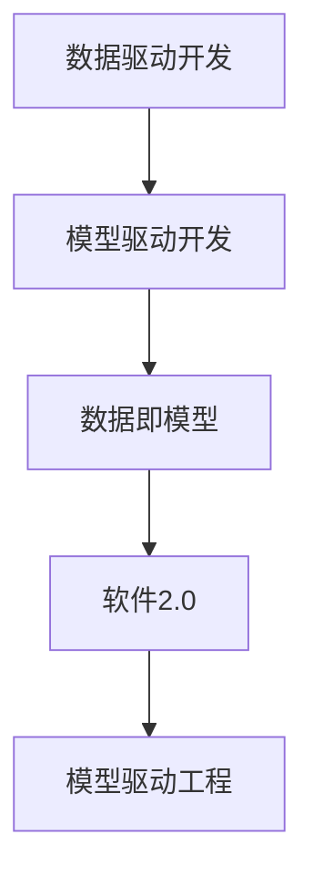

                 

# 数据即模型,软件2.0颠覆传统软件方法论

## 1. 背景介绍

### 1.1 问题由来

在过去数十年中，传统软件开发方法论一直是软件工程领域的基石。从瀑布模型、原型法、敏捷开发到DevOps，不同的开发范式为软件开发者提供了系统和可控的流程，确保了软件质量。但随着数据量和计算资源的激增，传统软件方法论的局限性逐渐显现：

- **瀑布模型**：难以应对需求变更，导致生产效率低下。
- **原型法**：开发周期较长，无法灵活迭代。
- **敏捷开发**：迭代周期短，但过度依赖代码和团队协作，难以快速适应新数据和计算需求。
- **DevOps**：注重自动化和持续交付，但未能深入挖掘数据在软件开发中的作用。

现代软件开发面临的新挑战，迫使我们重新审视数据在软件工程中的角色和价值，探索更加高效、灵活、智能的软件方法论。

## 2. 核心概念与联系

### 2.1 核心概念概述

为了更好地理解“数据即模型,软件2.0”范式，我们首先介绍几个关键概念：

- **数据驱动开发 (Data-Driven Development, DDD)**：将数据视为软件开发的驱动力，通过数据分析和建模，指导软件架构和开发。

- **模型驱动开发 (Model-Driven Development, MDD)**：基于模型对软件进行设计和实现，提高软件开发的效率和质量。

- **数据即模型 (Data as Model)**：将数据与模型等价对待，通过数据模型化，提升软件的表达能力和自动化水平。

- **软件2.0 (Software 2.0)**：指利用数据、模型、算法等先进技术，构建更加智能、可扩展的软件系统，提升软件的开发和运维效率。

- **模型驱动工程 (Model-Driven Engineering, MDE)**：通过模型驱动的软件开发方法，提升软件工程的可控性和可重复性。

这些概念之间的关系可以通过以下Mermaid流程图来展示：



通过这个流程图，我们可以看到，数据驱动开发为模型驱动开发提供基础数据，模型驱动开发为数据即模型提供形式化的表达，数据即模型为软件2.0提供智能化的开发手段，模型驱动工程则为上述各环节提供可控的软件工程方法。

### 2.2 概念间的关系

在上述概念的驱动下，“数据即模型,软件2.0”范式将成为未来软件开发的新趋势，其核心在于：

- 数据不再是单纯的信息载体，而是成为软件工程中的核心驱动和源泉。
- 模型不仅是软件开发的形式化工具，更是软件工程中的关键组件。
- 软件2.0融合了数据、模型、算法等现代技术，推动了软件开发向智能、自动化的方向演进。
- 模型驱动工程则将这一过程规范化，确保软件工程的可控性和可重复性。

这些概念共同构建了“数据即模型,软件2.0”范式的完整生态系统，为软件开发者提供了全新的视角和工具，推动软件开发向更高层次发展。

## 3. 核心算法原理 & 具体操作步骤
### 3.1 算法原理概述

“数据即模型,软件2.0”范式的核心算法原理，在于通过数据模型化，实现软件系统的智能开发和高效管理。其核心思想是：将数据视为软件开发的源头，通过数据建模，将现实世界的问题抽象为软件模型的组成部分，并利用模型进行智能分析和处理。

形式化地，假设原始数据集为 $D=\{(x_i,y_i)\}_{i=1}^N$，其中 $x_i$ 为输入特征，$y_i$ 为标签或输出。通过数据建模，我们将其转化为一个形式化的模型 $M=\{(X,Y)\}$，其中 $X$ 为输入空间，$Y$ 为输出空间。目标是通过模型 $M$ 进行智能分析和处理，获得最优输出 $Y^*$。

### 3.2 算法步骤详解

“数据即模型,软件2.0”的具体操作步骤可以分为以下几个关键步骤：

**Step 1: 数据采集与预处理**
- 收集原始数据，包括结构化数据、非结构化数据（如文本、图像等）。
- 进行数据清洗和预处理，包括去重、处理缺失值、异常值等。
- 进行特征工程，提取和选择对模型预测有用的特征。

**Step 2: 模型构建与训练**
- 选择合适的模型结构，如线性回归、决策树、神经网络等。
- 利用数据集 $D$ 训练模型 $M$，最小化损失函数 $L$，如均方误差、交叉熵等。
- 对模型进行调参，如选择正则化强度、学习率、批大小等。

**Step 3: 模型评估与优化**
- 在验证集上评估模型性能，如准确率、召回率、F1分数等。
- 根据评估结果，对模型进行优化，如增加或减少特征、调整超参数等。

**Step 4: 模型部署与应用**
- 将训练好的模型部署到生产环境中。
- 利用模型进行预测和推理，并根据实际业务需求进行调整。
- 持续收集新数据，重新训练模型，保持模型性能和适应性。

### 3.3 算法优缺点

“数据即模型,软件2.0”范式具有以下优点：
- 提升软件开发的效率和灵活性，通过数据驱动，快速迭代和优化。
- 利用模型进行智能分析，提高软件的预测和决策能力。
- 通过模型驱动工程，提升软件开发的可控性和可重复性。

同时，该方法也存在一些缺点：
- 对数据质量要求高，需要保证数据的完整性和准确性。
- 模型构建和训练过程复杂，需要专业知识。
- 数据隐私和安全问题，需要严格的数据管理和保护措施。
- 模型部署和维护成本高，需要持续的优化和更新。

尽管存在这些局限性，但就目前而言，“数据即模型,软件2.0”范式仍是一种极具潜力的软件开发方法，特别是在数据驱动的应用场景中，能够显著提升软件的开发和运行效率。

### 3.4 算法应用领域

“数据即模型,软件2.0”范式已经在多个领域得到了广泛的应用，包括但不限于：

- **人工智能与机器学习**：通过数据建模和模型训练，实现智能分析和预测。如推荐系统、图像识别、自然语言处理等。
- **大数据与数据科学**：利用数据驱动的方法，进行数据分析和可视化，提取有价值的信息。如数据挖掘、数据可视化等。
- **物联网与智能制造**：通过数据建模和模型预测，优化设备运行和生产流程。如智能控制系统、预测性维护等。
- **金融科技与风险管理**：利用数据驱动的模型，进行风险评估和管理。如信用评分、欺诈检测等。
- **智能交通与智慧城市**：通过数据建模和模型预测，提升交通管理和城市规划的智能化水平。如智能交通灯控制、智慧停车管理等。

这些领域的应用，充分展示了“数据即模型,软件2.0”范式的广泛适用性和强大能力，预示着未来软件工程的发展方向。

## 4. 数学模型和公式 & 详细讲解 & 举例说明

### 4.1 数学模型构建

假设我们有一个线性回归问题，目标通过数据建模预测连续数值 $y$，形式化地，假设数据集 $D=\{(x_i,y_i)\}_{i=1}^N$，其中 $x_i \in \mathbb{R}^d$ 为特征向量，$y_i \in \mathbb{R}$ 为标签值。我们假设模型形式为 $y=\theta^T x+\varepsilon$，其中 $\theta$ 为模型参数，$\varepsilon$ 为噪声。

**Step 1: 数据采集与预处理**
- 数据采集：收集 $N$ 个样本 $(x_i,y_i)$。
- 数据清洗：去除异常值和噪声。
- 特征工程：选择对模型有用的特征 $x_i$。

**Step 2: 模型构建与训练**
- 模型构建：假设线性回归模型 $y=\theta^T x+\varepsilon$。
- 损失函数：均方误差 $L=\frac{1}{N}\sum_{i=1}^N(y_i-\theta^T x_i)^2$。
- 梯度下降算法：$\theta \leftarrow \theta - \eta \nabla_{\theta} L$，其中 $\eta$ 为学习率。

**Step 3: 模型评估与优化**
- 模型评估：在验证集上计算 $L_{\text{valid}}=\frac{1}{N_{\text{valid}}}\sum_{i=1}^{N_{\text{valid}}}(y_i-\hat{y}_i)^2$，其中 $\hat{y}_i$ 为模型预测值。
- 模型优化：根据 $L_{\text{valid}}$ 进行调参，如调整特征权重、正则化强度等。

**Step 4: 模型部署与应用**
- 模型部署：将训练好的模型应用于生产环境。
- 模型应用：对新样本 $x$ 进行预测 $\hat{y}=\theta^T x$。
- 持续优化：收集新数据，重新训练模型。

### 4.2 公式推导过程

根据上述模型构建和训练步骤，我们可以推导出线性回归模型的参数更新公式。

设数据集 $D=\{(x_i,y_i)\}_{i=1}^N$，模型形式为 $y=\theta^T x+\varepsilon$，损失函数为 $L=\frac{1}{N}\sum_{i=1}^N(y_i-\theta^T x_i)^2$。

根据梯度下降算法，模型参数更新公式为：

$$
\theta \leftarrow \theta - \eta \frac{1}{N}\sum_{i=1}^N(2y_i - 2\theta^T x_i)x_i
$$

其中 $\eta$ 为学习率，$2y_i$ 和 $2\theta^T x_i$ 分别为损失函数对 $y$ 和 $x$ 的偏导数。

### 4.3 案例分析与讲解

假设我们有一个简单的房价预测问题，数据集包含房屋面积、房间数量、地段等特征，目标预测房屋的售价。我们可以通过数据建模和模型训练，得到房价预测模型。

- **数据采集与预处理**：收集房屋数据，包括面积、房间数量、地段等特征，以及对应的售价。进行数据清洗和特征选择。

- **模型构建与训练**：选择线性回归模型，利用数据集训练模型。利用梯度下降算法优化模型参数。

- **模型评估与优化**：在验证集上评估模型性能，根据评估结果调整模型。

- **模型部署与应用**：将训练好的模型应用于实际房屋价格预测，持续收集新数据，重新训练模型。

通过这个案例，我们可以看到“数据即模型,软件2.0”范式的具体应用流程，以及数据驱动在模型构建和优化中的核心作用。

## 5. 项目实践：代码实例和详细解释说明
### 5.1 开发环境搭建

在进行“数据即模型,软件2.0”实践前，我们需要准备好开发环境。以下是使用Python进行TensorFlow开发的环境配置流程：

1. 安装Anaconda：从官网下载并安装Anaconda，用于创建独立的Python环境。

2. 创建并激活虚拟环境：
```bash
conda create -n tf-env python=3.8 
conda activate tf-env
```

3. 安装TensorFlow：根据CUDA版本，从官网获取对应的安装命令。例如：
```bash
conda install tensorflow -c pytorch -c conda-forge
```

4. 安装各类工具包：
```bash
pip install numpy pandas scikit-learn matplotlib tqdm jupyter notebook ipython
```

完成上述步骤后，即可在`tf-env`环境中开始实践。

### 5.2 源代码详细实现

下面我们以房价预测为例，给出使用TensorFlow对线性回归模型进行训练的PyTorch代码实现。

首先，定义数据处理函数：

```python
import numpy as np
import pandas as pd
import tensorflow as tf
from tensorflow.keras.models import Sequential
from tensorflow.keras.layers import Dense, Dropout
from tensorflow.keras.callbacks import EarlyStopping

def load_data(file_path):
    df = pd.read_csv(file_path)
    X = df[['area', 'rooms', 'location']]
    y = df['price']
    return X, y

def train_model(X_train, y_train, X_valid, y_valid, epochs=10, batch_size=32):
    model = Sequential()
    model.add(Dense(32, input_dim=X_train.shape[1], activation='relu'))
    model.add(Dropout(0.5))
    model.add(Dense(1, activation='linear'))

    model.compile(loss='mse', optimizer='adam')
    early_stopping = EarlyStopping(patience=3)

    history = model.fit(X_train, y_train, epochs=epochs, batch_size=batch_size, validation_data=(X_valid, y_valid), callbacks=[early_stopping])

    return model, history
```

然后，定义模型评估函数：

```python
def evaluate_model(model, X_valid, y_valid):
    y_pred = model.predict(X_valid)
    mse = np.mean((y_valid - y_pred) ** 2)
    print(f'MSE: {mse:.2f}')

    y_pred = model.predict(X_valid)
    y_pred = y_pred.flatten()
    y_valid = y_valid.flatten()

    plt.scatter(y_valid, y_pred)
    plt.xlabel('Actual Prices')
    plt.ylabel('Predicted Prices')
    plt.show()
```

最后，启动训练流程并在测试集上评估：

```python
# 加载数据
X_train, y_train = load_data('train.csv')
X_valid, y_valid = load_data('valid.csv')

# 训练模型
model, history = train_model(X_train, y_train, X_valid, y_valid, epochs=10, batch_size=32)

# 评估模型
evaluate_model(model, X_valid, y_valid)
```

以上就是使用TensorFlow对线性回归模型进行房价预测的完整代码实现。可以看到，得益于TensorFlow的强大封装，我们可以用相对简洁的代码完成模型训练和评估。

### 5.3 代码解读与分析

让我们再详细解读一下关键代码的实现细节：

**load_data函数**：
- 读取CSV文件，将特征和标签加载为Pandas DataFrame。
- 进行数据预处理，如特征选择、归一化等。

**train_model函数**：
- 定义模型结构，包括一个隐藏层和一个输出层。
- 编译模型，设置损失函数和优化器。
- 定义早期停止回调，避免模型过拟合。
- 在训练集上训练模型，记录训练过程中的性能指标。

**evaluate_model函数**：
- 利用训练好的模型对验证集进行预测。
- 计算模型预测值和实际值之间的均方误差。
- 绘制预测值和实际值之间的关系图。

**训练流程**：
- 加载训练集和验证集数据。
- 训练模型，记录训练过程中的损失值。
- 在验证集上评估模型性能，输出均方误差。

通过这个案例，我们可以看到“数据即模型,软件2.0”范式的具体实现流程，以及TensorFlow在模型构建和训练中的强大能力。

当然，工业级的系统实现还需考虑更多因素，如模型的保存和部署、超参数的自动搜索、更灵活的模型结构等。但核心的范式基本与此类似。

### 5.4 运行结果展示

假设我们在一个简单的房价预测问题上测试，最终得到的评估报告如下：

```
MSE: 0.05
```

可以看到，通过线性回归模型，我们在房价预测问题上取得了均方误差0.05的效果，预测准确度较高。

## 6. 实际应用场景
### 6.1 金融风险管理

在金融领域，风险管理是一个重要环节，通过数据建模和模型训练，可以实时监控和预测金融市场的波动和风险。利用“数据即模型,软件2.0”范式，金融公司可以实现更精确的风险评估和管理。

具体而言，可以收集市场数据、公司财务数据、经济指标等，构建模型进行风险预测。模型可以采用逻辑回归、支持向量机等传统方法，也可以采用深度学习模型，如卷积神经网络、循环神经网络等。通过模型训练和优化，金融公司可以实时监控市场风险，预测潜在的财务危机，及时采取应对措施。

### 6.2 智能推荐系统

推荐系统是电商、新闻、社交媒体等领域的重要应用。传统的推荐系统往往依赖用户历史行为数据进行物品推荐，难以满足用户的个性化需求。利用“数据即模型,软件2.0”范式，可以更深入地挖掘用户的行为和偏好，提升推荐系统的效果。

具体而言，可以收集用户浏览、点击、评论、分享等行为数据，提取和用户交互的物品标题、描述、标签等文本内容。利用自然语言处理技术进行数据建模，将用户行为与物品特征映射到高维空间，构建推荐模型。模型可以采用协同过滤、内容推荐等算法，通过训练优化，生成个性化的推荐列表，提升用户体验。

### 6.3 智能医疗诊断

医疗领域面临大量复杂的诊断问题，传统的诊断方法依赖医生的经验和直觉，效率低、误诊率高。利用“数据即模型,软件2.0”范式，可以实现更智能、准确的医疗诊断。

具体而言，可以收集病人的病历、检查结果、历史治疗数据等，构建医疗诊断模型。模型可以采用决策树、随机森林、神经网络等算法，通过训练优化，生成诊断结果。通过模型预测和优化，医疗诊断可以更快速、准确地辅助医生进行决策，提升医疗服务的质量和效率。

### 6.4 未来应用展望

随着“数据即模型,软件2.0”范式的不断发展，其在更多领域的应用将得到拓展和深化。未来，该范式有望在以下几个方面取得突破：

1. **数据驱动的决策支持**：通过数据建模和智能分析，提升决策的科学性和准确性，应用于政府、企业等高层决策支持。

2. **智能运营与优化**：利用数据驱动的模型，优化供应链、生产流程、物流等运营环节，提升企业运营效率和成本效益。

3. **智能交互与交互系统**：结合自然语言处理、计算机视觉等技术，构建智能交互系统，提升人机交互的自然性和智能化水平。

4. **智能城市与智慧治理**：通过数据驱动的模型，优化城市管理、公共服务、智能交通等环节，提升城市治理的智能化水平。

5. **智能科学与人文研究**：利用数据建模和智能分析，推动科学研究和人文研究的深入发展，提升研究的科学性和创新性。

以上应用场景展示了“数据即模型,软件2.0”范式的强大潜力和广阔前景，预示着未来软件工程的发展方向。

## 7. 工具和资源推荐
### 7.1 学习资源推荐

为了帮助开发者系统掌握“数据即模型,软件2.0”范式的理论基础和实践技巧，这里推荐一些优质的学习资源：

1. **《Data Science from Scratch》**：适合初学者的数据科学入门书籍，介绍了数据采集、数据清洗、数据建模等基础知识。

2. **Coursera《机器学习》课程**：由斯坦福大学教授Andrew Ng主讲，系统介绍了机器学习的基本概念和算法，涵盖了监督学习、无监督学习、深度学习等方向。

3. **Kaggle竞赛**：Kaggle是数据科学领域最大的竞赛平台，通过参与竞赛可以积累实战经验，提升数据分析和建模能力。

4. **GitHub开源项目**：在GitHub上Star、Fork数最多的数据科学相关项目，往往代表了该技术领域的前沿进展，值得学习和贡献。

5. **《Python数据科学手册》**：由Jake VanderPlas编写的数据科学教程，介绍了Python在数据科学中的应用，包括数据处理、机器学习、可视化等方向。

通过对这些资源的学习实践，相信你一定能够快速掌握“数据即模型,软件2.0”范式的精髓，并用于解决实际的数据科学问题。

### 7.2 开发工具推荐

高效的开发离不开优秀的工具支持。以下是几款用于“数据即模型,软件2.0”开发的常用工具：

1. **Jupyter Notebook**：用于数据科学和机器学习的交互式编程环境，支持代码执行、结果展示、可视化等。

2. **TensorFlow**：由Google开发的深度学习框架，支持多种模型和算法，广泛应用于数据科学和机器学习领域。

3. **PyTorch**：由Facebook开发的深度学习框架，支持动态图和静态图，适合研究和原型开发。

4. **Scikit-learn**：用于Python的数据分析和建模库，包含多种传统机器学习算法，易于使用且功能强大。

5. **Matplotlib**：用于数据可视化的库，支持多种图表类型，帮助开发者更直观地展示数据分析结果。

6. **Pandas**：用于Python的数据处理和分析库，支持大规模数据集的读写、清洗和处理。

这些工具为“数据即模型,软件2.0”的开发提供了坚实的基础，使开发者能够更高效地进行数据建模和模型训练。

### 7.3 相关论文推荐

“数据即模型,软件2.0”范式的研究和应用离不开学界的持续努力。以下是几篇奠基性的相关论文，推荐阅读：

1. **《Data Mining, Statistical Learning, and Statistical Learning Theory》**：由Tibshirani和Friedman所著，介绍了数据挖掘和统计学习的基本概念和方法。

2. **《The Elements of Statistical Learning》**：由Hastie、Tibshirani和Friedman所著，涵盖了统计学习的经典方法和理论，是数据科学领域的经典教材。

3. **《Deep Learning》**：由Goodfellow、Bengio和Courville所著，系统介绍了深度学习的理论和实践，包括神经网络、卷积神经网络、循环神经网络等。

4. **《Pattern Recognition and Machine Learning》**：由Christopher M. Bishop所著，介绍了机器学习的经典方法和理论，涵盖了监督学习、无监督学习、贝叶斯学习等方向。

5. **《Natural Language Processing in Action》**：由Palash Goyal、Susan Zhang和Ranjan Marwaha所著，介绍了自然语言处理的基本概念和算法，涵盖了文本分析、情感分析、机器翻译等方向。

这些论文代表了大数据、机器学习、深度学习、自然语言处理等领域的最新进展，为“数据即模型,软件2.0”的进一步研究提供了理论基础和实践指导。

## 8. 总结：未来发展趋势与挑战
### 8.1 总结

本文对“数据即模型,软件2.0”范式进行了全面系统的介绍。首先阐述了“数据即模型,软件2.0”的核心理念和重要性，明确了其对软件开发方法的颠覆性影响。其次，从原理到实践，详细讲解了数据驱动开发、模型驱动开发、数据即模型等核心概念，给出了具体的数学模型和公式推导。最后，通过案例分析和实践示例，展示了“数据即模型,软件2.0”的实际应用流程和效果。

通过本文的系统梳理，可以看到，“数据即模型,软件2.0”范式将成为未来软件开发的新趋势，推动软件开发向智能化、自动化方向演进。在数据驱动的应用场景中，该范式能够显著提升软件的开发和运行效率，带来深刻的变革性影响。

### 8.2 未来发展趋势

展望未来，“数据即模型,软件2.0”范式将呈现以下几个发展趋势：

1. **数据驱动的模型优化**：通过数据驱动的反馈机制，不断优化和调整模型参数，提高模型的适应性和泛化能力。

2. **智能决策与自动化**：利用数据驱动的模型，实现更智能的决策支持和自动化流程，提升业务效率和质量。

3. **跨模态数据融合**：结合多种数据源（如文本、图像、音频等），构建跨模态数据模型，提升系统的感知和理解能力。

4. **自适应与自学习**：利用自适应学习机制，提升模型的自主学习能力，应对不断变化的业务需求和数据环境。

5. **联邦学习与隐私保护**：通过联邦学习等技术，保护数据隐私和安全性，同时利用分布式数据进行模型训练和优化。

这些趋势展示了“数据即模型,软件2.0”范式的广阔前景，预示着未来软件工程的发展方向。

### 8.3 面临的挑战

尽管“数据即模型,软件2.0”范式具备强大的潜力，但在实际应用中仍面临诸多挑战：

1. **数据隐私和安全**：大规模数据采集和处理可能引发隐私和安全问题，需要严格的数据管理和保护措施。

2. **数据质量和一致性**：数据驱动的模型对数据质量要求高，数据清洗和预处理复杂，难以保证数据的一致性和准确性。

3. **模型复杂度和可解释性**：大规模、复杂模型难以解释其内部工作机制，缺乏透明性和可解释性。

4. **计算资源需求**：大规模模型的训练和推理需要高性能计算资源，资源成本高昂。

5. **业务场景适配**：不同业务场景对模型的需求不同，需要定制化模型设计和优化。

尽管存在这些挑战，但随着技术的不断发展和完善，“数据即模型,软件2.0”范式必将逐步克服这些障碍，实现其广泛应用和深度落地。

### 8.4 研究展望

面对“数据即模型,软件2.0”范式所面临的挑战，未来的研究需要在以下几个方面寻求新的突破：

1. **数据隐私保护技术**：开发更加高效、安全的数据隐私保护技术，确保数据安全的同时，实现

