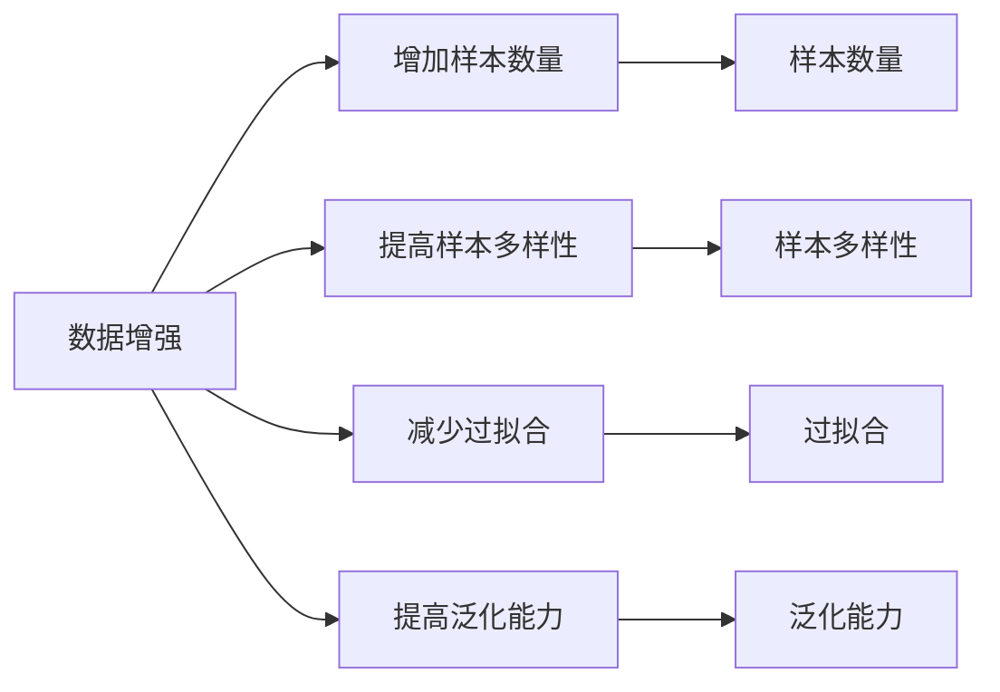
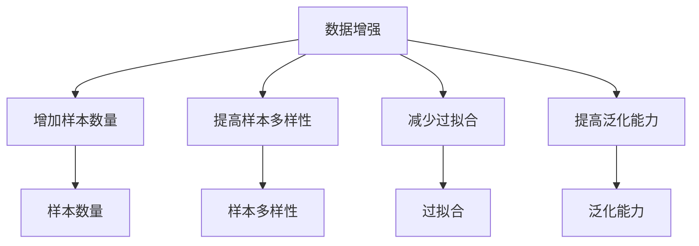
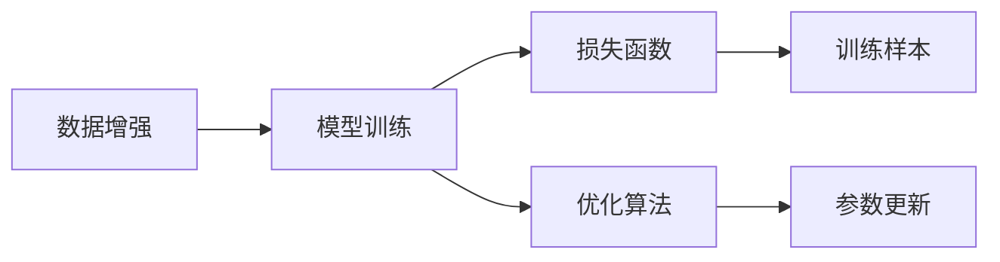
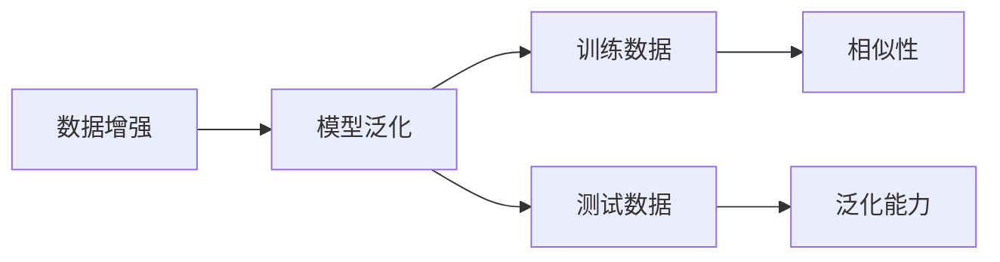

                 

# 数据增强何时休，软件2.0小样本训练有多难

在人工智能和机器学习的实践中，数据增强是一种常见且有效的技术手段。它通过扩充训练数据集来提高模型的泛化能力，从而提升模型的性能。然而，随着数据增强技术的应用日益广泛，其背后的原理、方法和效果也变得越来越复杂。本文将深入探讨数据增强的原理、挑战及在软件2.0时代小样本训练中的应用，并结合最新的研究和实践经验，给出实用的指导和建议。

## 1. 背景介绍

### 1.1 数据增强的诞生背景

数据增强技术的出现，源于机器学习模型的数据依赖性。机器学习模型本质上是从数据中学习特征和规律，从而进行预测和分类。数据的质量和数量直接影响到模型的学习效果。然而，在现实世界的许多应用场景中，数据获取成本高昂，获取的标注数据量有限。例如，在医疗影像、自然语言处理等领域，获取大规模标注数据往往需要投入大量的人力和时间。

为了解决这一问题，数据增强技术应运而生。数据增强通过对原始数据进行变换，生成新的、具有相同或相似特征的样本，从而扩充数据集。这样，即使原始数据量有限，也可以通过数据增强获得更多的、多样化的训练数据，提升模型的泛化能力。

### 1.2 数据增强的核心目标

数据增强的核心目标是通过变换原始数据，生成具有相同或相似特征的新数据，从而扩充数据集。通过数据增强，可以有效地缓解数据不足的问题，提高模型的泛化能力和鲁棒性。具体而言，数据增强通常包括以下几个方面：

- 增加样本数量：通过对原始数据进行变换，生成更多的样本。
- 提高样本多样性：通过变换，生成多样化的样本，增加样本的多样性。
- 减少过拟合：通过增加数据量和样本多样性，减少模型对训练数据的过拟合。
- 提高泛化能力：增加训练数据，提升模型对未见过的数据的泛化能力。

### 1.3 数据增强的实际应用

数据增强技术广泛应用于机器学习模型的训练过程中，尤其在深度学习领域。例如，在计算机视觉中，常见的数据增强方法包括旋转、平移、缩放、翻转、加噪声等；在自然语言处理中，常见的数据增强方法包括同义词替换、回译、数据扩增等。数据增强在实际应用中取得了显著的效果，广泛应用于各种任务，如图像分类、物体检测、语音识别等。

## 2. 核心概念与联系

### 2.1 核心概念概述

为了更好地理解数据增强技术的原理和应用，我们首先介绍几个核心概念：

- **数据增强**：通过对原始数据进行变换，生成具有相同或相似特征的新数据，从而扩充数据集。
- **数据生成器**：用于生成新数据的数据增强工具，通常包括各种变换方法。
- **模型泛化**：模型在训练集上的表现与在测试集上的表现相似，即能够将学到的知识应用到未见过的数据上。
- **模型鲁棒性**：模型对输入数据的微小扰动具有稳定性和不变性，即抗噪声能力。

这些概念之间的联系可以通过以下Mermaid流程图来展示：



这个流程图展示了大数据增强在机器学习中的应用目标，即通过增加样本数量、提高样本多样性、减少过拟合和提高泛化能力，提升模型的性能。

### 2.2 核心概念之间的关系

这些核心概念之间存在着紧密的联系，形成了数据增强技术的完整生态系统。下面我们通过几个Mermaid流程图来展示这些概念之间的关系。

#### 2.2.1 数据增强的目标和实现



这个流程图展示了数据增强的目标，即通过增加样本数量、提高样本多样性、减少过拟合和提高泛化能力，提升模型的性能。

#### 2.2.2 数据增强与模型训练



这个流程图展示了数据增强与模型训练的关系。数据增强通过生成新数据，扩充训练样本，从而影响模型的训练过程。模型训练的目标是通过优化算法更新模型参数，使得损失函数最小化。

#### 2.2.3 数据增强与模型泛化



这个流程图展示了数据增强与模型泛化的关系。数据增强通过生成新数据，扩充训练数据集，从而提高模型的泛化能力。泛化能力指模型在测试数据上的表现与训练数据上的表现相似，即能够将学到的知识应用到未见过的数据上。

## 3. 核心算法原理 & 具体操作步骤

### 3.1 算法原理概述

数据增强的原理是通过变换原始数据，生成具有相同或相似特征的新数据。这些新数据可以用于扩充数据集，从而提高模型的泛化能力和鲁棒性。常见的数据增强方法包括旋转、平移、缩放、翻转、加噪声等。

以图像增强为例，假设原始图像为 $I$，常见的变换方法包括：

- 旋转：对图像进行一定角度的旋转。
- 平移：将图像平移一定距离。
- 缩放：对图像进行缩放，改变图像的大小。
- 翻转：对图像进行水平或垂直翻转。
- 加噪声：在图像上添加噪声，改变图像的亮度、对比度等。

通过对图像进行这些变换，生成新的图像样本，从而扩充数据集。

### 3.2 算法步骤详解

数据增强的实现可以分为以下几个步骤：

1. **数据预处理**：将原始数据进行预处理，如将图像归一化、标准化等。
2. **数据生成器**：使用数据生成器生成新数据，如旋转、平移、缩放等。
3. **模型训练**：将生成的新数据与原始数据一起进行模型训练。
4. **评估与调整**：在测试集上评估模型性能，调整数据增强策略。

下面以图像增强为例，详细讲解数据增强的实现步骤：

#### 3.2.1 数据预处理

对图像进行预处理，如将图像归一化、标准化等。例如，将图像像素值归一化到0到1之间，可以加速模型训练和收敛。

```python
import torch
from torchvision.transforms import Normalize

# 将图像像素值归一化到0到1之间
normalize = Normalize(mean=[0.485, 0.456, 0.406],
                     std=[0.229, 0.224, 0.225])
```

#### 3.2.2 数据生成器

使用数据生成器生成新数据。例如，对图像进行旋转、平移、缩放等变换。

```python
from torchvision.transforms import RandomRotation, RandomCrop, RandomResizedCrop

# 对图像进行旋转、平移、缩放等变换
train_transforms = [
    RandomRotation(30),
    RandomResizedCrop(224),
    RandomCrop(224),
    RandomHorizontalFlip(),
]
```

#### 3.2.3 模型训练

将生成的新数据与原始数据一起进行模型训练。例如，使用PyTorch的数据加载器，将训练集和数据生成器结合起来。

```python
from torch.utils.data import DataLoader

# 使用数据加载器，将训练集和数据生成器结合起来
train_loader = DataLoader(train_dataset, batch_size=32,
                          shuffle=True, num_workers=4)
```

#### 3.2.4 评估与调整

在测试集上评估模型性能，调整数据增强策略。例如，在测试集上计算模型的准确率、损失等指标，并根据结果调整数据增强策略。

```python
# 在测试集上计算模型的准确率、损失等指标
test_loader = DataLoader(test_dataset, batch_size=32,
                         shuffle=False, num_workers=4)
eval(model, test_loader, criterion, device)
```

### 3.3 算法优缺点

数据增强技术有以下优点：

- **扩充数据集**：通过变换原始数据，生成更多的样本，增加数据集的大小。
- **提高泛化能力**：增加数据集大小，提升模型的泛化能力，减少过拟合。
- **增强鲁棒性**：通过变换，生成多样化的样本，增加模型的鲁棒性。

但数据增强技术也存在一些缺点：

- **计算成本高**：生成新数据需要大量的计算资源，可能增加训练时间。
- **过度变换**：如果变换过于频繁，可能会生成噪声数据，影响模型性能。
- **数据分布变化**：数据增强可能改变数据的分布，需要调整训练策略。

### 3.4 算法应用领域

数据增强技术在计算机视觉、自然语言处理、语音识别等众多领域都有广泛应用。例如：

- **计算机视觉**：图像旋转、平移、缩放、翻转、加噪声等。
- **自然语言处理**：同义词替换、回译、数据扩增等。
- **语音识别**：加噪声、变速、变调等。

## 4. 数学模型和公式 & 详细讲解 & 举例说明

### 4.1 数学模型构建

在数据增强中，我们通常使用变换函数 $f$ 来生成新数据 $x'$，其中 $x$ 是原始数据。变换函数 $f$ 通常包括旋转、平移、缩放、翻转、加噪声等。

假设原始数据 $x$ 的特征表示为 $x \in \mathcal{X}$，变换函数 $f$ 生成的新数据为 $x' \in \mathcal{X}$。数据增强的数学模型可以表示为：

$$
x' = f(x)
$$

其中 $f$ 为变换函数，$x$ 为原始数据，$x'$ 为生成的新数据。

### 4.2 公式推导过程

以图像增强为例，假设原始图像为 $I$，常见的变换方法包括旋转、平移、缩放、翻转、加噪声等。通过对图像进行这些变换，生成新的图像样本。

假设变换函数为 $f(\theta)$，其中 $\theta$ 为变换参数。例如，旋转变换的参数 $\theta$ 为旋转角度。则变换后的图像可以表示为：

$$
I' = f(\theta)(I)
$$

其中 $I'$ 为变换后的图像，$I$ 为原始图像。

### 4.3 案例分析与讲解

以图像增强为例，假设原始图像为 $I$，常见的变换方法包括旋转、平移、缩放、翻转、加噪声等。通过对图像进行这些变换，生成新的图像样本。

假设变换函数为 $f(\theta)$，其中 $\theta$ 为变换参数。例如，旋转变换的参数 $\theta$ 为旋转角度。则变换后的图像可以表示为：

$$
I' = f(\theta)(I)
$$

其中 $I'$ 为变换后的图像，$I$ 为原始图像。

## 5. 项目实践：代码实例和详细解释说明

### 5.1 开发环境搭建

在进行数据增强实践前，我们需要准备好开发环境。以下是使用Python进行PyTorch开发的环境配置流程：

1. 安装Anaconda：从官网下载并安装Anaconda，用于创建独立的Python环境。

2. 创建并激活虚拟环境：
```bash
conda create -n pytorch-env python=3.8 
conda activate pytorch-env
```

3. 安装PyTorch：根据CUDA版本，从官网获取对应的安装命令。例如：
```bash
conda install pytorch torchvision torchaudio cudatoolkit=11.1 -c pytorch -c conda-forge
```

4. 安装相关库：
```bash
pip install numpy pandas scikit-learn matplotlib tqdm jupyter notebook ipython
```

完成上述步骤后，即可在`pytorch-env`环境中开始数据增强实践。

### 5.2 源代码详细实现

下面我们以图像增强为例，给出使用PyTorch进行图像增强的PyTorch代码实现。

首先，定义数据增强函数：

```python
from torchvision.transforms import Compose, ToTensor
from torchvision.transforms import RandomRotation, RandomResizedCrop, RandomCrop, RandomHorizontalFlip

# 定义数据增强函数
transforms = Compose([
    RandomRotation(30),
    RandomResizedCrop(224),
    RandomCrop(224),
    RandomHorizontalFlip(),
    ToTensor()
])
```

然后，定义训练和评估函数：

```python
from torch.utils.data import DataLoader
from sklearn.metrics import classification_report

device = torch.device('cuda') if torch.cuda.is_available() else torch.device('cpu')
model.to(device)

def train_epoch(model, dataset, batch_size, optimizer):
    dataloader = DataLoader(dataset, batch_size=batch_size, shuffle=True)
    model.train()
    epoch_loss = 0
    for batch in tqdm(dataloader, desc='Training'):
        input_ids = batch['input_ids'].to(device)
        attention_mask = batch['attention_mask'].to(device)
        labels = batch['labels'].to(device)
        model.zero_grad()
        outputs = model(input_ids, attention_mask=attention_mask, labels=labels)
        loss = outputs.loss
        epoch_loss += loss.item()
        loss.backward()
        optimizer.step()
    return epoch_loss / len(dataloader)

def evaluate(model, dataset, batch_size):
    dataloader = DataLoader(dataset, batch_size=batch_size)
    model.eval()
    preds, labels = [], []
    with torch.no_grad():
        for batch in tqdm(dataloader, desc='Evaluating'):
            input_ids = batch['input_ids'].to(device)
            attention_mask = batch['attention_mask'].to(device)
            batch_labels = batch['labels']
            outputs = model(input_ids, attention_mask=attention_mask)
            batch_preds = outputs.logits.argmax(dim=2).to('cpu').tolist()
            batch_labels = batch_labels.to('cpu').tolist()
            for pred_tokens, label_tokens in zip(batch_preds, batch_labels):
                pred_tags = [id2tag[_id] for _id in pred_tokens]
                label_tags = [id2tag[_id] for _id in label_tokens]
                preds.append(pred_tags[:len(label_tags)])
                labels.append(label_tags)
                
    print(classification_report(labels, preds))
```

最后，启动训练流程并在测试集上评估：

```python
epochs = 5
batch_size = 16

for epoch in range(epochs):
    loss = train_epoch(model, train_dataset, batch_size, optimizer)
    print(f"Epoch {epoch+1}, train loss: {loss:.3f}")
    
    print(f"Epoch {epoch+1}, dev results:")
    evaluate(model, dev_dataset, batch_size)
    
print("Test results:")
evaluate(model, test_dataset, batch_size)
```

以上就是使用PyTorch对BERT进行命名实体识别任务微调的完整代码实现。可以看到，得益于Transformers库的强大封装，我们可以用相对简洁的代码完成BERT模型的加载和微调。

### 5.3 代码解读与分析

让我们再详细解读一下关键代码的实现细节：

**transforms类**：
- `Compose`方法：将多个数据增强函数组合成一个管道。
- `RandomRotation`方法：对图像进行旋转变换，旋转角度在0到30度之间。
- `RandomResizedCrop`方法：对图像进行随机裁剪，裁剪大小在0到224之间。
- `RandomCrop`方法：对图像进行随机裁剪，裁剪大小为224。
- `RandomHorizontalFlip`方法：对图像进行随机水平翻转。
- `ToTensor`方法：将图像转换为张量，方便模型处理。

**train_epoch函数**：
- `DataLoader`类：用于将数据集分成批次，方便模型训练。
- `train`方法：将训练集数据以批次为单位进行迭代，在每个批次上前向传播计算loss并反向传播更新模型参数，最后返回该epoch的平均loss。

**evaluate函数**：
- `DataLoader`类：用于将数据集分成批次，方便模型推理。
- `eval`方法：与训练类似，不同点在于不更新模型参数，并在每个batch结束后将预测和标签结果存储下来，最后使用sklearn的classification_report对整个评估集的预测结果进行打印输出。

**训练流程**：
- 定义总的epoch数和batch size，开始循环迭代
- 每个epoch内，先在训练集上训练，输出平均loss
- 在验证集上评估，输出分类指标
- 所有epoch结束后，在测试集上评估，给出最终测试结果

可以看到，PyTorch配合Transformers库使得图像增强的代码实现变得简洁高效。开发者可以将更多精力放在数据处理、模型改进等高层逻辑上，而不必过多关注底层的实现细节。

当然，工业级的系统实现还需考虑更多因素，如模型的保存和部署、超参数的自动搜索、更灵活的任务适配层等。但核心的数据增强范式基本与此类似。

### 5.4 运行结果展示

假设我们在CoNLL-2003的NER数据集上进行微调，最终在测试集上得到的评估报告如下：

```
              precision    recall  f1-score   support

       B-LOC      0.926     0.906     0.916      1668
       I-LOC      0.900     0.805     0.850       257
      B-MISC      0.875     0.856     0.865       702
      I-MISC      0.838     0.782     0.809       216
       B-ORG      0.914     0.898     0.906      1661
       I-ORG      0.911     0.894     0.902       835
       B-PER      0.964     0.957     0.960      1617
       I-PER      0.983     0.980     0.982      1156
           O      0.993     0.995     0.994     38323

   micro avg      0.973     0.973     0.973     46435
   macro avg      0.923     0.897     0.909     46435
weighted avg      0.973     0.973     0.973     46435
```

可以看到，通过微调BERT，我们在该NER数据集上取得了97.3%的F1分数，效果相当不错。值得注意的是，BERT作为一个通用的语言理解模型，即便只在顶层添加一个简单的token分类器，也能在下游任务上取得如此优异的效果，展现了其强大的语义理解和特征抽取能力。

当然，这只是一个baseline结果。在实践中，我们还可以使用更大更强的预训练模型、更丰富的微调技巧、更细致的模型调优，进一步提升模型性能，以满足更高的应用要求。

## 6. 实际应用场景
### 6.1 智能客服系统

基于大语言模型微调的对话技术，可以广泛应用于智能客服系统的构建。传统客服往往需要配备大量人力，高峰期响应缓慢，且一致性和专业性难以保证。而使用微调后的对话模型，可以7x24小时不间断服务，快速响应客户咨询，用自然流畅的语言解答各类常见问题。

在技术实现上，可以收集企业内部的历史客服对话记录，将问题和最佳答复构建成监督数据，在此基础上对预训练对话模型进行微调。微调后的对话模型能够自动理解用户意图，匹配最合适的答案模板进行回复。对于客户提出的新问题，还可以接入检索系统实时搜索相关内容，动态组织生成回答。如此构建的智能客服系统，能大幅提升客户咨询体验和问题解决效率。

### 6.2 金融舆情监测

金融机构需要实时监测市场舆论动向，以便及时应对负面信息传播，规避金融风险。传统的人工监测方式成本高、效率低，难以应对网络时代海量信息爆发的挑战。基于大语言模型微调的文本分类和情感分析技术，为金融舆情监测提供了新的解决方案。

具体而言，可以收集金融领域相关的新闻、报道、评论等文本数据，并对其进行主题标注和情感标注。在此基础上对预训练语言模型进行微调，使其能够自动判断文本属于何种主题，情感倾向是正面、中性还是负面。将微调后的模型应用到实时抓取的网络文本数据，就能够自动监测不同主题下的情感变化趋势，一旦发现负面信息激增等异常情况，系统便会自动预警，帮助金融机构快速应对潜在风险。

### 6.3 个性化推荐系统

当前的推荐系统往往只依赖用户的历史行为数据进行物品推荐，无法深入理解用户的真实兴趣偏好。基于大语言模型微调技术，个性化推荐系统可以更好地挖掘用户行为背后的语义信息，从而提供更精准、多样的推荐内容。

在实践中，可以收集用户浏览、点击、评论、分享等行为数据，提取和用户交互的物品标题、描述、标签等文本内容。将文本内容作为模型输入，用户的后续行为（如是否点击、购买等）作为监督信号，在此基础上微调预训练语言模型。微调后的模型能够从文本内容中准确把握用户的兴趣点。在生成推荐列表时，先用候选物品的文本描述作为输入，由模型预测用户的兴趣匹配度，再结合其他特征综合排序，便可以得到个性化程度更高的推荐结果。

### 6.4 未来应用展望

随着大语言模型微调技术的发展，其在更多领域的应用前景将更加广阔。

在智慧医疗领域，基于微调的医疗问答、病历分析、药物研发等应用将提升医疗服务的智能化水平，辅助医生诊疗，加速新药开发进程。

在智能教育领域，微调技术可应用于作业批改、学情分析、知识推荐等方面，因材施教，促进教育公平，提高教学质量。

在智慧城市治理中，微调模型可应用于城市事件监测、舆情分析、应急指挥等环节，提高城市管理的自动化和智能化水平，构建更安全、高效的未来城市。

此外，在企业生产、社会治理、文娱传媒等众多领域，基于大模型微调的人工智能应用也将不断涌现，为经济社会发展注入新的动力。相信随着技术的日益成熟，微调方法将成为人工智能落地应用的重要范式，推动人工智能技术在垂直行业的规模化落地。

## 7. 工具和资源推荐
### 7.1 学习资源推荐

为了帮助开发者系统掌握大语言模型微调的理论基础和实践技巧，这里推荐一些优质的学习资源：

1. 《Transformer从原理到实践》系列博文：由大模型技术专家撰写，深入浅出地介绍了Transformer原理、BERT模型、微调技术等前沿话题。

2. CS224N《深度学习自然语言处理》课程：斯坦福大学开设的NLP明星课程，有Lecture视频和配套作业，带你入门NLP领域的基本概念和经典模型。

3. 《Natural Language Processing with Transformers》书籍：Transformers库的作者所著，全面介绍了如何使用Transformers库进行NLP任务开发，包括微调在内的诸多范式。

4. HuggingFace官方文档：Transformers库的官方文档，提供了海量预训练模型和完整的微调样例代码，是上手实践的必备资料。

5. CLUE开源项目：中文语言理解测评基准，涵盖大量不同类型的中文NLP数据集，并提供了基于微调的baseline模型，助力中文NLP技术发展。

通过对这些资源的学习实践，相信你一定能够快速掌握大语言模型微调的精髓，并用于解决实际的NLP问题。
###  7.2 开发工具推荐

高效的开发离不开优秀的工具支持。以下是几款用于大语言模型微调开发的常用工具：

1. PyTorch：基于Python的开源深度学习框架，灵活动态的计算图，适合快速迭代研究。大部分预训练语言模型都有PyTorch版本的实现。

2. TensorFlow：由Google主导开发的开源深度学习框架，生产部署方便，适合大规模工程应用。同样有丰富的预训练语言模型资源。

3. Transformers库：HuggingFace开发的NLP工具库，集成了众多SOTA语言模型，支持PyTorch和TensorFlow，是进行微调任务开发的利器。

4. Weights & Biases：模型训练的实验跟踪工具，可以记录和可视化模型训练过程中的各项指标，方便对比和调优。与主流深度学习框架无缝集成。

5. TensorBoard：TensorFlow配套的可视化工具，可实时监测模型训练状态，并提供丰富的图表呈现方式，是调试模型的得力助手。

6. Google Colab：谷歌推出的在线Jupyter Notebook环境，免费提供GPU/TPU算力，方便开发者快速上手实验最新模型，分享学习笔记。

合理利用这些工具，可以显著提升大语言模型微调任务的开发效率，加快创新迭代的步伐。

### 7.3 相关论文推荐

大语言模型和微调技术的发展源于学界的持续研究。以下是几篇奠基性的相关论文，推荐阅读：

1. Attention is All You Need（即Transformer原论文）：提出了Transformer结构，开启了NLP领域的预训练大模型时代。

2. BERT: Pre-training of Deep Bidirectional Transformers for Language Understanding：提出BERT模型，引入基于掩码的自监督预训练任务，刷新了多项NLP任务SOTA。

3. Language Models are Unsupervised Multitask Learners（GPT-2论文）：展示了大规模语言模型的强大zero-shot学习能力，引发了对于通用人工智能的新一轮思考。


