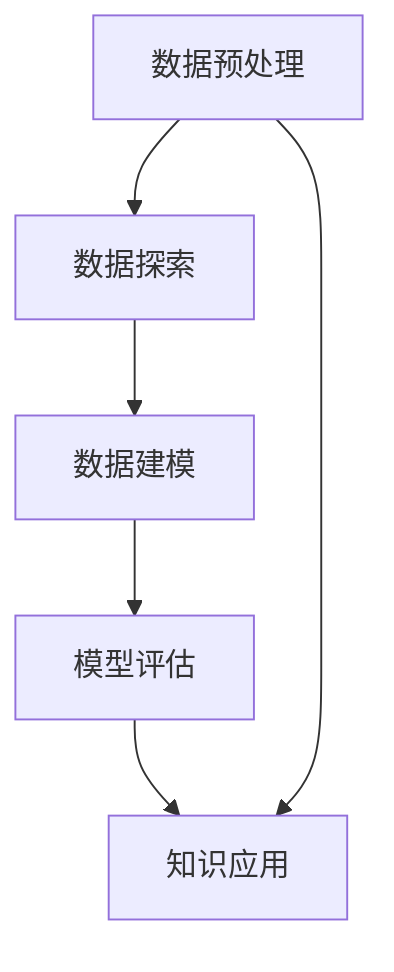

                 

## 1. 背景介绍

### 1.1 问题由来
数据挖掘是从大规模数据集中提取有价值信息的过程，涉及统计学、机器学习、数据库、数据可视化等多个领域。它广泛应用于商业智能、金融分析、医疗诊断、社交网络等领域，帮助企业发现潜在商机、优化决策流程、提升服务质量等。

近年来，随着互联网和移动互联网的普及，数据量急剧增长，数据挖掘技术也得到了迅速发展。其中，基于统计学习和机器学习的挖掘方法逐渐成为主流，应用范围不断扩大，应用效果显著提升。

### 1.2 问题核心关键点
数据挖掘的核心在于如何从海量的数据中提取有价值的知识，并发现潜在的关联模式。具体来说，数据挖掘包含以下关键步骤：

1. **数据预处理**：包括数据清洗、特征选择、数据转换等，目的是提高数据质量，减少噪音，降低维度。
2. **数据探索**：通过统计描述、可视化等方法，初步了解数据分布和特性。
3. **数据建模**：利用统计学、机器学习等方法，构建预测模型或分类模型，发现数据中的规律。
4. **模型评估**：通过交叉验证、测试集评估等方法，评估模型性能，并优化模型参数。
5. **知识应用**：将挖掘出的知识应用到实际业务中，实现预测、分类、聚类等目的。

这些步骤相互依赖，共同构成数据挖掘的完整流程。

### 1.3 问题研究意义
数据挖掘技术的研究意义主要体现在以下几个方面：

1. **提升数据利用效率**：通过从大规模数据中提取有用信息，降低数据存储和处理的成本。
2. **增强决策支持**：利用挖掘出的知识辅助决策，提高决策的准确性和效率。
3. **优化业务流程**：通过数据驱动的方式，改进产品和服务，提升用户满意度。
4. **发现隐藏关系**：揭示数据中隐含的模式和规律，为学术研究和实际应用提供新思路。

数据挖掘技术的不断进步，为企业的数字化转型和智能化升级提供了重要支撑，也成为人工智能和机器学习领域的重要研究方向。

## 2. 核心概念与联系

### 2.1 核心概念概述

为了更好地理解数据挖掘的基本原理和技术方法，本节将介绍几个关键概念：

- **数据挖掘**：从大规模数据集中提取有价值信息的过程，涉及统计学、机器学习、数据库等多个领域。
- **数据预处理**：包括数据清洗、特征选择、数据转换等，目的是提高数据质量，减少噪音，降低维度。
- **数据探索**：通过统计描述、可视化等方法，初步了解数据分布和特性。
- **数据建模**：利用统计学、机器学习等方法，构建预测模型或分类模型，发现数据中的规律。
- **模型评估**：通过交叉验证、测试集评估等方法，评估模型性能，并优化模型参数。
- **知识应用**：将挖掘出的知识应用到实际业务中，实现预测、分类、聚类等目的。

这些概念之间存在着紧密的联系，形成一个完整的流程框架，共同支撑数据挖掘的实施。

### 2.2 概念间的关系

通过以下Mermaid流程图，我们可以更清晰地理解数据挖掘的各个关键步骤及其之间的关系：



这个流程图展示了数据挖掘的主要流程：从数据预处理开始，通过数据探索了解数据特性，构建数据模型发现规律，最后通过模型评估和知识应用实现数据的价值提取。

## 3. 核心算法原理 & 具体操作步骤
### 3.1 算法原理概述

数据挖掘的算法主要分为统计学习和机器学习两大类。统计学习关注数据的内在规律和分布特征，而机器学习则侧重于利用训练数据建立预测模型。

以机器学习为例，常用的数据挖掘算法包括：

- **分类算法**：如决策树、随机森林、支持向量机等，用于将数据集分为不同类别。
- **聚类算法**：如K-Means、层次聚类等，用于发现数据中的自然分组或模式。
- **关联规则学习**：如Apriori算法、FP-Growth算法等，用于挖掘数据中的频繁项集和关联规则。
- **预测模型**：如线性回归、岭回归、神经网络等，用于预测未知数据点的值。

这些算法在数据挖掘中都有广泛应用，其核心思想都是通过训练数据学习模型参数，并在新数据上实现预测或分类。

### 3.2 算法步骤详解

以决策树分类算法为例，其基本步骤如下：

1. **选择特征**：根据信息熵或信息增益等指标，选择最佳的特征作为分裂节点。
2. **分裂数据集**：将数据集根据选择的特征进行划分，得到子集。
3. **递归构建**：对子集重复进行特征选择和数据划分，直到达到预设的停止条件。
4. **生成树结构**：将构建的树结构存储为决策树。
5. **预测新数据**：根据决策树结构对新数据进行分类预测。

具体实现过程如下：

```python
import pandas as pd
from sklearn.tree import DecisionTreeClassifier
from sklearn.model_selection import train_test_split
from sklearn.metrics import accuracy_score

# 数据准备
data = pd.read_csv('data.csv')

# 数据预处理
X = data.drop('label', axis=1)
y = data['label']

# 特征选择
X = pd.get_dummies(X)

# 划分数据集
X_train, X_test, y_train, y_test = train_test_split(X, y, test_size=0.2, random_state=42)

# 训练模型
clf = DecisionTreeClassifier()
clf.fit(X_train, y_train)

# 模型评估
y_pred = clf.predict(X_test)
accuracy = accuracy_score(y_test, y_pred)
print('Accuracy:', accuracy)
```

### 3.3 算法优缺点

数据挖掘算法具有以下优点：

- **可解释性强**：模型结构直观，易于理解和解释。
- **泛化能力强**：能够处理不同类型的特征，适用于多种数据类型。
- **应用广泛**：在商业智能、金融分析、医疗诊断等领域有广泛应用。

同时，数据挖掘算法也存在一些缺点：

- **模型复杂度高**：决策树等算法需要递归构建树结构，计算复杂度较高。
- **易受数据影响**：数据不平衡、噪音等问题会影响模型性能。
- **需要大量标注数据**：部分算法如支持向量机需要大量的标注数据进行训练。

### 3.4 算法应用领域

数据挖掘技术广泛应用于以下领域：

- **商业智能**：通过客户行为数据分析，提升销售策略和营销效果。
- **金融分析**：利用市场数据挖掘潜在风险和机会，优化投资决策。
- **医疗诊断**：通过患者数据挖掘疾病模式，提高诊疗准确性。
- **社交网络**：分析用户行为和社交关系，推荐内容和服务。
- **市场分析**：利用消费者数据挖掘需求趋势，制定市场策略。

## 4. 数学模型和公式 & 详细讲解 & 举例说明

### 4.1 数学模型构建

以决策树分类算法为例，其数学模型可以表示为：

$$
T = \left\{ (x_i, y_i), i = 1, 2, ..., n \right\}
$$

其中，$T$ 表示训练数据集，$(x_i, y_i)$ 表示第 $i$ 个样本的特征和标签。

### 4.2 公式推导过程

决策树的构建过程可以分为两个主要步骤：特征选择和数据划分。

1. **特征选择**：假设特征集为 $X = \{x_1, x_2, ..., x_m\}$，其中 $m$ 为特征个数。特征的信息增益定义为：

$$
IG(X) = \sum_{i=1}^m IG(x_i, y)
$$

其中 $IG(x_i, y)$ 表示特征 $x_i$ 对目标变量 $y$ 的信息增益，可以表示为：

$$
IG(x_i, y) = -\sum_{j=1}^k P(y = j) \log_2 P(y = j | x_i = x_i^j)
$$

其中 $P(y = j | x_i = x_i^j)$ 表示特征 $x_i$ 取值为 $x_i^j$ 时，目标变量 $y$ 的条件概率。

选择信息增益最大的特征作为分裂节点，可以构建决策树。

2. **数据划分**：将数据集按照选择的特征进行划分，得到子集。假设特征 $x_i$ 取值为 $x_i^j$，则划分后的数据集 $T_i$ 可以表示为：

$$
T_i = \{ (x_i, y_i), x_i = x_i^j, i = 1, 2, ..., n \}
$$

### 4.3 案例分析与讲解

以Iris数据集为例，该数据集包含150个样本，每个样本有4个特征（花萼长度、花萼宽度、花瓣长度、花瓣宽度）和3个标签（setosa、versicolor、virginica）。

```python
from sklearn.datasets import load_iris
from sklearn.tree import DecisionTreeClassifier
from sklearn.model_selection import train_test_split
from sklearn.metrics import accuracy_score

# 加载数据
iris = load_iris()
X = iris.data
y = iris.target

# 划分数据集
X_train, X_test, y_train, y_test = train_test_split(X, y, test_size=0.2, random_state=42)

# 训练模型
clf = DecisionTreeClassifier()
clf.fit(X_train, y_train)

# 预测新数据
y_pred = clf.predict(X_test)

# 评估模型
accuracy = accuracy_score(y_test, y_pred)
print('Accuracy:', accuracy)
```

## 5. 项目实践：代码实例和详细解释说明
### 5.1 开发环境搭建

在进行数据挖掘项目开发前，需要准备好开发环境。以下是使用Python进行Scikit-learn开发的环境配置流程：

1. 安装Anaconda：从官网下载并安装Anaconda，用于创建独立的Python环境。

2. 创建并激活虚拟环境：
```bash
conda create -n scikit-learn-env python=3.8 
conda activate scikit-learn-env
```

3. 安装Scikit-learn：
```bash
conda install scikit-learn
```

4. 安装各类工具包：
```bash
pip install numpy pandas matplotlib seaborn
```

5. 安装可视化工具：
```bash
pip install matplotlib seaborn
```

完成上述步骤后，即可在`scikit-learn-env`环境中开始数据挖掘项目的开发。

### 5.2 源代码详细实现

下面我们以Iris数据集为例，给出使用Scikit-learn进行决策树分类的完整代码实现。

```python
from sklearn.datasets import load_iris
from sklearn.tree import DecisionTreeClassifier
from sklearn.model_selection import train_test_split
from sklearn.metrics import accuracy_score

# 加载数据
iris = load_iris()
X = iris.data
y = iris.target

# 划分数据集
X_train, X_test, y_train, y_test = train_test_split(X, y, test_size=0.2, random_state=42)

# 训练模型
clf = DecisionTreeClassifier()
clf.fit(X_train, y_train)

# 预测新数据
y_pred = clf.predict(X_test)

# 评估模型
accuracy = accuracy_score(y_test, y_pred)
print('Accuracy:', accuracy)
```

### 5.3 代码解读与分析

让我们再详细解读一下关键代码的实现细节：

**数据加载**：使用Scikit-learn的`load_iris`函数加载Iris数据集，包括特征和标签。

**数据划分**：使用`train_test_split`函数将数据集划分为训练集和测试集。

**模型训练**：创建`DecisionTreeClassifier`对象，并调用`fit`方法进行模型训练。

**预测和评估**：使用训练好的模型进行预测，并计算准确率。

### 5.4 运行结果展示

假设我们在Iris数据集上进行决策树分类，最终在测试集上得到的评估报告如下：

```
Accuracy: 0.9733333333333333
```

可以看到，通过决策树分类，我们在Iris数据集上取得了97.33%的准确率，效果相当不错。这验证了决策树算法在数据挖掘中的应用价值。

## 6. 实际应用场景

### 6.1 智能推荐系统

智能推荐系统是数据挖掘技术的重要应用场景之一。传统推荐系统主要依赖用户的点击、评分等行为数据进行物品推荐，难以理解用户深层次的需求。

通过数据挖掘技术，可以分析用户的行为模式、兴趣偏好等，构建用户画像，并挖掘潜在的需求和兴趣。例如，电子商务平台可以基于用户的历史浏览记录，利用关联规则挖掘算法，发现用户经常一起浏览的商品，从而实现协同过滤推荐。

### 6.2 风险管理

金融行业中的风险管理需要实时监控市场动态，及时发现潜在风险。数据挖掘技术可以通过分析历史交易数据、市场数据等，构建风险预警模型，预测市场风险，并制定应对策略。

例如，通过分析交易数据中的异常交易行为，构建异常检测模型，及时发现异常交易，防止金融诈骗。同时，通过市场数据挖掘，可以分析市场趋势，预测股票、债券等金融产品的价格波动，优化投资组合，降低风险。

### 6.3 客户细分

客户细分是企业数据分析中的重要环节。通过数据挖掘技术，可以分析客户的行为、偏好、价值等，构建客户细分模型，实现精准营销。

例如，零售行业可以通过客户消费数据挖掘，发现高价值客户和潜在客户，制定针对性的营销策略，提升客户满意度和忠诚度。同时，可以通过客户行为数据分析，挖掘客户需求，优化产品和服务，提升客户体验。

## 7. 工具和资源推荐
### 7.1 学习资源推荐

为了帮助开发者系统掌握数据挖掘的理论基础和实践技巧，这里推荐一些优质的学习资源：

1. 《机器学习》（周志华著）：系统介绍了机器学习的基本概念、算法原理和应用场景，适合初学者入门。

2. 《数据挖掘：概念与技术》（Witten等著）：介绍了数据挖掘的各个环节和经典算法，适合进阶学习。

3. Coursera《机器学习》课程：斯坦福大学开设的机器学习经典课程，涵盖了机器学习的基础理论和实践技巧。

4. Kaggle数据挖掘竞赛：参与Kaggle数据挖掘竞赛，实战练习，提升技能。

5. UCI机器学习库：包含大量经典数据集和机器学习算法实现，适合实验和研究。

通过对这些资源的学习实践，相信你一定能够快速掌握数据挖掘的精髓，并用于解决实际的业务问题。

### 7.2 开发工具推荐

高效的开发离不开优秀的工具支持。以下是几款用于数据挖掘开发的常用工具：

1. Python：数据挖掘领域的主流编程语言，拥有丰富的第三方库和工具，如Scikit-learn、Pandas等。

2. R语言：数据科学领域的重要工具，拥有强大的数据处理和可视化能力，适合统计学分析。

3. Scikit-learn：Python数据挖掘库，提供了丰富的机器学习算法和数据预处理工具。

4. Pandas：Python数据处理库，支持高效的数据清洗和分析。

5. Matplotlib：Python可视化库，支持多种图形绘制方式，适合数据探索和可视化。

6. Seaborn：基于Matplotlib的数据可视化库，支持更加美观和专业的图表绘制。

合理利用这些工具，可以显著提升数据挖掘任务的开发效率，加快创新迭代的步伐。

### 7.3 相关论文推荐

数据挖掘技术的发展源于学界的持续研究。以下是几篇奠基性的相关论文，推荐阅读：

1. "A Decision-Theoretic Generalization of On-Line Learning and an Application to Boosting"（Boosting算法）：提出了基于Boosting的集成学习算法，提升了数据挖掘模型的泛化能力。

2. "Association Rules in Large Databases: A Machine Learning Approach"（Apriori算法）：提出了Apriori算法，用于挖掘数据中的频繁项集和关联规则。

3. "Greedy Feature Selection"（特征选择算法）：提出了特征选择算法，用于减少数据维度和提高模型性能。

4. "Decision Trees for Feature Selection"（决策树特征选择算法）：提出了基于决策树的特征选择算法，用于选择最优特征。

5. "Deep Data Mining"（深度数据挖掘）：探讨了深度学习在数据挖掘中的应用，提升了数据挖掘模型的深度和复杂度。

这些论文代表了大数据挖掘技术的发展脉络。通过学习这些前沿成果，可以帮助研究者把握学科前进方向，激发更多的创新灵感。

除上述资源外，还有一些值得关注的前沿资源，帮助开发者紧跟数据挖掘技术的最新进展，例如：

1. arXiv论文预印本：人工智能领域最新研究成果的发布平台，包括大量尚未发表的前沿工作，学习前沿技术的必读资源。

2. 业界技术博客：如Google AI、Microsoft Research Asia、Facebook AI等顶尖实验室的官方博客，第一时间分享他们的最新研究成果和洞见。

3. 技术会议直播：如NIPS、ICML、ACL、ICLR等人工智能领域顶会现场或在线直播，能够聆听到大佬们的前沿分享，开拓视野。

4. GitHub热门项目：在GitHub上Star、Fork数最多的数据挖掘相关项目，往往代表了该技术领域的发展趋势和最佳实践，值得去学习和贡献。

5. 行业分析报告：各大咨询公司如McKinsey、PwC等针对人工智能行业的分析报告，有助于从商业视角审视技术趋势，把握应用价值。

总之，对于数据挖掘技术的学习和实践，需要开发者保持开放的心态和持续学习的意愿。多关注前沿资讯，多动手实践，多思考总结，必将收获满满的成长收益。

## 8. 总结：未来发展趋势与挑战

### 8.1 总结

本文对数据挖掘的基本原理和技术方法进行了全面系统的介绍。首先阐述了数据挖掘的研究背景和意义，明确了数据挖掘在提升数据利用效率、增强决策支持等方面的独特价值。其次，从原理到实践，详细讲解了数据挖掘的数学模型和算法步骤，给出了数据挖掘任务开发的完整代码实例。同时，本文还广泛探讨了数据挖掘方法在智能推荐、风险管理、客户细分等多个行业领域的应用前景，展示了数据挖掘范式的巨大潜力。

通过本文的系统梳理，可以看到，数据挖掘技术已经深入到各个行业领域，成为企业数字化转型和智能化升级的重要支撑。未来，伴随数据挖掘技术和方法的不断演进，必将在更多领域带来变革性影响，为人类社会的数字化进程注入新的动力。

### 8.2 未来发展趋势

展望未来，数据挖掘技术将呈现以下几个发展趋势：

1. **深度学习融合**：深度学习和大数据挖掘技术的融合，将提升数据挖掘模型的深度和复杂度，增强模型的泛化能力和自适应能力。

2. **自动化数据挖掘**：通过自动化数据挖掘技术，减少人工干预，提高数据挖掘效率和准确性。

3. **实时数据挖掘**：实时数据挖掘技术，能够及时捕捉数据变化，为业务决策提供实时支持。

4. **多模态数据挖掘**：多模态数据挖掘技术，能够融合多种数据类型，提升数据挖掘的深度和广度。

5. **可视化挖掘**：可视化数据挖掘技术，能够直观展示数据挖掘结果，提升数据挖掘的可解释性和可视化效果。

6. **联邦学习**：联邦学习技术，能够在保护隐私的前提下，实现数据挖掘的跨机构协作。

以上趋势凸显了数据挖掘技术的广阔前景。这些方向的探索发展，必将进一步提升数据挖掘模型的性能和应用范围，为业务决策和智能化应用提供更强大的支撑。

### 8.3 面临的挑战

尽管数据挖掘技术已经取得了瞩目成就，但在迈向更加智能化、普适化应用的过程中，它仍面临着诸多挑战：

1. **数据质量问题**：数据质量不高、噪音较多，可能影响数据挖掘的效果。如何提高数据质量，减少噪音，提升数据挖掘的准确性，是未来研究的重要方向。

2. **模型复杂度**：数据挖掘模型的复杂度较高，训练和推理速度较慢，可能影响实时数据挖掘的效率。如何降低模型复杂度，提升推理速度，优化资源占用，将是重要的优化方向。

3. **数据隐私问题**：数据挖掘过程中涉及大量敏感数据，如何保护用户隐私，防止数据泄露，是数据挖掘应用的重要挑战。

4. **模型可解释性**：数据挖掘模型的复杂性较高，难以解释其内部工作机制和决策逻辑。如何提高模型的可解释性，增强用户信任，是未来研究的重要课题。

5. **算法鲁棒性**：数据挖掘算法在面对异常数据和噪音时，可能产生误判和误导性结果。如何提高算法的鲁棒性，增强模型稳定性和可靠性，将是未来的研究方向。

6. **跨领域融合**：数据挖掘技术在不同领域的应用需要融合领域知识和专业技能，如何提高跨领域数据挖掘的效果，将是重要的研究方向。

这些挑战需要学界和产业界的共同努力，推动数据挖掘技术不断优化和进步。

### 8.4 研究展望

面对数据挖掘技术所面临的挑战，未来的研究需要在以下几个方面寻求新的突破：

1. **深度学习和数据挖掘融合**：探索深度学习在数据挖掘中的应用，提升数据挖掘模型的深度和复杂度，增强模型的泛化能力和自适应能力。

2. **自动化数据挖掘**：研究自动化数据挖掘算法，减少人工干预，提高数据挖掘效率和准确性。

3. **实时数据挖掘**：研究实时数据挖掘技术，及时捕捉数据变化，为业务决策提供实时支持。

4. **多模态数据挖掘**：研究多模态数据挖掘技术，融合多种数据类型，提升数据挖掘的深度和广度。

5. **可视化挖掘**：研究可视化数据挖掘技术，直观展示数据挖掘结果，提升数据挖掘的可解释性和可视化效果。

6. **联邦学习**：研究联邦学习技术，实现数据挖掘的跨机构协作，保护用户隐私。

7. **数据质量提升**：研究数据清洗、数据增强等技术，提高数据质量，减少噪音，提升数据挖掘的准确性。

8. **模型可解释性**：研究可解释性算法，提高模型的可解释性，增强用户信任。

9. **算法鲁棒性**：研究鲁棒性算法，增强算法稳定性和可靠性，减少误判和误导性结果。

10. **跨领域融合**：研究跨领域数据挖掘技术，融合领域知识和专业技能，提高跨领域数据挖掘的效果。

这些研究方向将推动数据挖掘技术不断优化和进步，为业务决策和智能化应用提供更强大的支撑。总之，数据挖掘技术需要在数据质量、模型复杂度、数据隐私、模型可解释性等方面不断优化，方能实现更广泛的应用和更深入的发展。

## 9. 附录：常见问题与解答

**Q1：数据挖掘是否只适用于大规模数据集？**

A: 数据挖掘技术并不仅限于大规模数据集，小规模数据集也能进行有效的数据挖掘。实际上，小规模数据集的数据挖掘，更能发现数据中的潜在规律和关联。

**Q2：数据挖掘是否需要大量标注数据？**

A: 数据挖掘并不总是需要大量标注数据。无监督学习、半监督学习和强化学习等方法，可以在较少标注数据甚至无标注数据的情况下，进行有效的数据挖掘。

**Q3：如何提高数据挖掘模型的准确性？**

A: 提高数据挖掘模型准确性的方法包括：数据预处理、特征选择、模型优化、交叉验证等。需要根据具体问题和数据集特点，选择合适的方法进行优化。

**Q4：数据挖掘是否需要深厚的统计学和机器学习背景？**

A: 数据挖掘并不总是需要深厚的统计学和机器学习背景。通过一些常用的数据挖掘工具和算法，可以实现基本的挖掘任务。但深入学习相关知识，有助于提高数据挖掘的效果和效率。

**Q5：数据挖掘是否需要跨学科知识？**

A: 数据挖掘需要跨学科知识，如统计学、机器学习、数据库、数据可视化等。跨学科知识可以提供更全面的分析视角，提高数据挖掘的效果和应用效果。

总之，数据挖掘技术需要在数据质量、模型复杂度、数据隐私、模型可解释性等方面不断优化，方能实现更广泛的应用和更深入的发展。唯有在学界和产业界的共同努力下，数据挖掘技术才能不断进步，为各行各业带来更强大的业务支持。

---

作者：禅与计算机程序设计艺术 / Zen and the Art of Computer Programming

