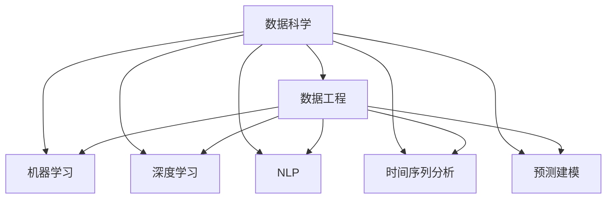
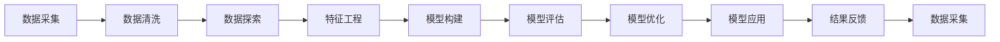
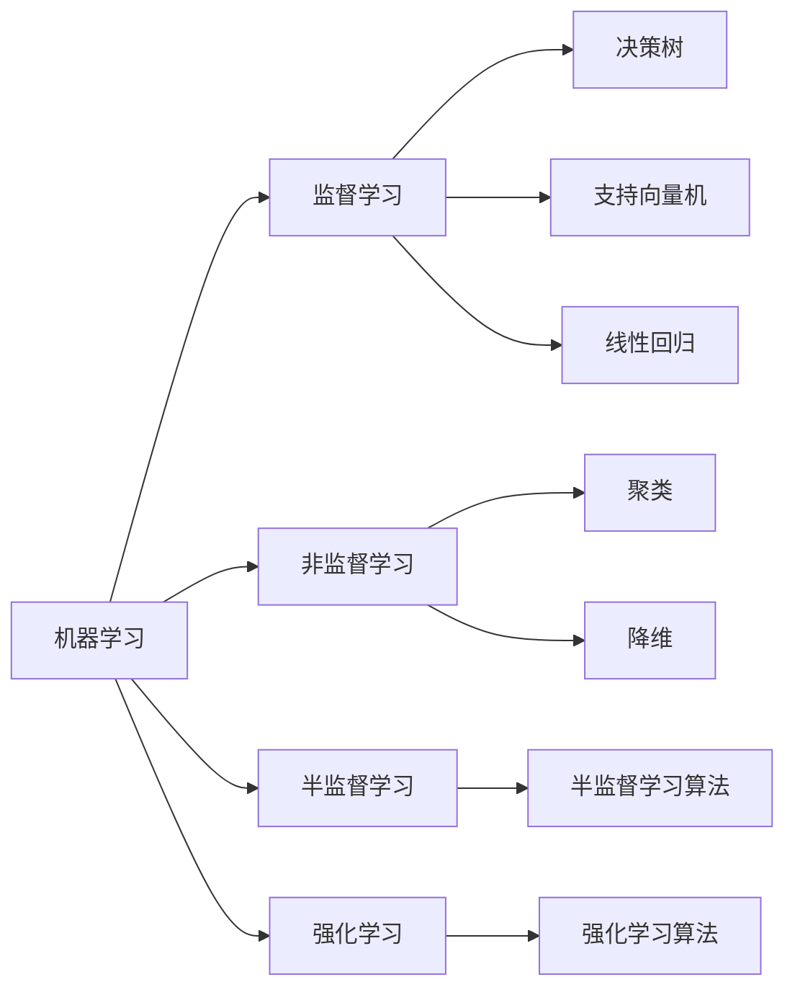
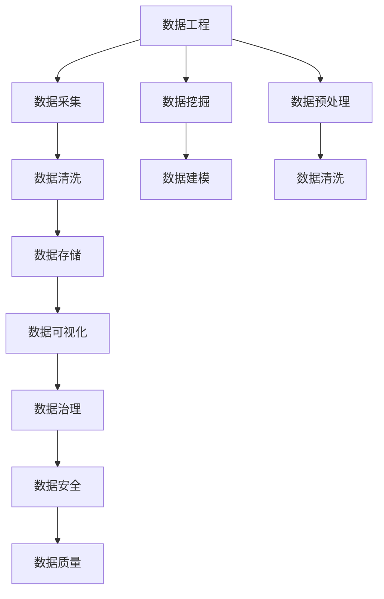
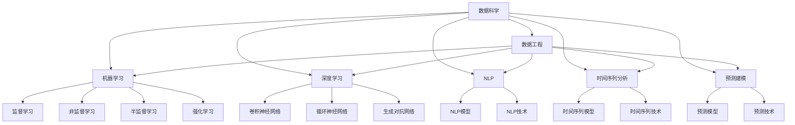

                 

## 1. 背景介绍

### 1.1 问题由来

随着大数据时代的到来，数据科学成为了引领科技和商业发展的关键领域。无论是企业内部决策、产品创新，还是政府政策制定，数据科学都在其中扮演着越来越重要的角色。数据科学不仅涉及到数据的收集、处理、分析和应用，更涉及跨学科的知识和技术，包括统计学、计算机科学、数学、经济学、心理学等。

在数据科学领域，如何从海量数据中提取出有价值的信息，构建准确有效的模型，是每个数据科学家面临的挑战。这需要他们具备扎实的数学基础、强大的编程能力、深厚的领域知识以及丰富的实践经验。本文旨在介绍数据科学的核心理念、核心概念和关键技术，为数据科学家提供全面的理论指导和实践参考。

### 1.2 问题核心关键点

数据科学的核心目标是从数据中提取知识和洞察，解决实际问题。其关键点包括：

- **数据采集与清洗**：确保数据的质量和完整性，去除噪声和冗余，构建干净、规范的数据集。
- **数据探索与可视化**：通过统计分析、数据可视化等手段，揭示数据的内在结构和趋势。
- **模型构建与评估**：选择合适的算法和模型，对数据进行拟合和预测，评估模型的性能。
- **特征工程**：通过特征选择、特征提取、特征转换等技术，提升模型的预测能力。
- **模型应用与迭代**：将模型应用到实际问题中，不断优化模型以提高效果。

数据科学的成功很大程度上取决于这些关键点的有效处理，本文将详细探讨这些核心概念和技术，为数据科学家提供实用的指导。

## 2. 核心概念与联系

### 2.1 核心概念概述

为更好地理解数据科学的核心概念和技术，本节将介绍几个密切相关的核心概念：

- **数据科学 (Data Science)**：数据科学是一门以数据为中心的学科，旨在通过数据挖掘、数据分析、机器学习等技术，从数据中提取知识，解决实际问题。
- **数据工程 (Data Engineering)**：数据工程专注于数据采集、存储、处理和管理，确保数据的质量和可用性。
- **机器学习 (Machine Learning)**：机器学习是数据科学的重要分支，通过算法和模型，自动学习数据中的规律和模式。
- **深度学习 (Deep Learning)**：深度学习是机器学习的一种高级形式，通过多层次的神经网络，处理复杂的数据结构，实现高精度预测。
- **自然语言处理 (Natural Language Processing, NLP)**：NLP是数据科学中一个重要的应用领域，专注于处理和分析人类语言数据。
- **时间序列分析 (Time Series Analysis)**：时间序列分析专注于对时间序列数据进行建模和预测。
- **预测建模 (Predictive Modeling)**：预测建模是数据科学的重要应用，通过构建模型对未来进行预测。

这些核心概念之间存在紧密的联系，共同构成了数据科学的知识体系和应用框架。以下通过Mermaid流程图展示这些概念之间的联系：



这个流程图展示了大数据科学的知识体系及其与其他概念的关系：

1. 数据科学是整个学科的核心，涉及数据工程、机器学习、深度学习等多个分支。
2. 数据工程为数据科学提供基础的数据处理和管理能力。
3. 机器学习和深度学习为数据科学提供强大的算法支持，实现数据挖掘和预测建模。
4. NLP、时间序列分析和预测建模是数据科学的重要应用方向。

### 2.2 概念间的关系

这些核心概念之间存在着紧密的联系，形成了数据科学的知识生态系统。下面通过几个Mermaid流程图来展示这些概念之间的关系：

#### 2.2.1 数据科学的流程



这个流程图展示了数据科学的一般流程：

1. 数据采集：从各种数据源中获取原始数据。
2. 数据清洗：去除噪声和冗余，构建干净、规范的数据集。
3. 数据探索：通过统计分析、数据可视化等手段，揭示数据的内在结构和趋势。
4. 特征工程：通过特征选择、特征提取、特征转换等技术，提升模型的预测能力。
5. 模型构建：选择合适的算法和模型，对数据进行拟合和预测。
6. 模型评估：评估模型的性能和泛化能力。
7. 模型优化：通过调参、集成等手段，提高模型效果。
8. 模型应用：将模型应用到实际问题中，不断优化模型以提高效果。
9. 结果反馈：将模型应用结果反馈到数据采集和处理环节，形成闭环优化。

#### 2.2.2 机器学习与深度学习的关系



这个流程图展示了机器学习和深度学习的关系：

1. 机器学习是数据科学的核心技术之一，包括监督学习、非监督学习、半监督学习和强化学习等多个分支。
2. 监督学习常用的算法包括决策树、支持向量机、线性回归等。
3. 非监督学习常用的算法包括聚类、降维等。
4. 半监督学习结合了监督和非监督学习的优点，通过少量标签数据提高模型性能。
5. 强化学习通过与环境的交互，实现智能决策和优化。
6. 深度学习是机器学习的一种高级形式，通过多层次的神经网络，处理复杂的数据结构，实现高精度预测。

#### 2.2.3 数据工程与数据科学的融合



这个流程图展示了数据工程与数据科学的融合：

1. 数据工程为数据科学提供基础的数据处理和管理能力。
2. 数据采集和存储是数据工程的核心，确保数据的质量和可用性。
3. 数据清洗和预处理是数据科学的重要环节，确保数据的完整性和规范性。
4. 数据可视化和治理有助于理解数据的内在结构和趋势。
5. 数据安全和质量是数据工程的重要保障，确保数据的安全性和可靠性。
6. 数据挖掘和建模是数据科学的核心任务，通过算法和模型，从数据中提取知识，解决实际问题。

### 2.3 核心概念的整体架构

最后，我们用一个综合的流程图来展示这些核心概念在大数据科学中的整体架构：



这个综合流程图展示了大数据科学的知识体系及其与其他概念的关系：

1. 数据科学是整个学科的核心，涉及数据工程、机器学习、深度学习等多个分支。
2. 数据工程为数据科学提供基础的数据处理和管理能力。
3. 机器学习和深度学习为数据科学提供强大的算法支持，实现数据挖掘和预测建模。
4. NLP、时间序列分析和预测建模是数据科学的重要应用方向。

这些核心概念之间的紧密联系和大数据科学的知识生态系统，为数据科学家提供了全面的理论指导和实践框架。以下将详细探讨数据科学的核心算法原理和操作步骤，为数据科学家提供实用的技术指引。

## 3. 核心算法原理 & 具体操作步骤
### 3.1 算法原理概述

数据科学的核心理念是利用数据和算法，从数据中提取知识和洞察，解决实际问题。其核心算法和技术包括数据采集、数据清洗、数据探索、特征工程、模型构建、模型评估和模型应用等。

1. **数据采集**：从各种数据源中获取原始数据，如网站、社交媒体、传感器等。
2. **数据清洗**：去除噪声和冗余，构建干净、规范的数据集。
3. **数据探索**：通过统计分析、数据可视化等手段，揭示数据的内在结构和趋势。
4. **特征工程**：通过特征选择、特征提取、特征转换等技术，提升模型的预测能力。
5. **模型构建**：选择合适的算法和模型，对数据进行拟合和预测。
6. **模型评估**：评估模型的性能和泛化能力。
7. **模型应用**：将模型应用到实际问题中，不断优化模型以提高效果。

### 3.2 算法步骤详解

数据科学的核心算法和技术可以通过以下几个步骤实现：

#### 3.2.1 数据采集

数据采集是数据科学的第一步，也是最重要的环节。数据来源多样，包括结构化数据（如数据库、API）、半结构化数据（如JSON、XML）和非结构化数据（如文本、图像、音频）。数据采集工具包括ETL工具、API接口、网络爬虫等。

#### 3.2.2 数据清洗

数据清洗是数据科学的基础，通过去重、补全、修正等手段，构建干净、规范的数据集。数据清洗工具包括Pandas、Apache Hadoop、Apache Spark等。

#### 3.2.3 数据探索

数据探索是数据科学的关键环节，通过统计分析、数据可视化等手段，揭示数据的内在结构和趋势。数据探索工具包括NumPy、Pandas、Matplotlib、Seaborn等。

#### 3.2.4 特征工程

特征工程是数据科学的难点和重点，通过特征选择、特征提取、特征转换等技术，提升模型的预测能力。特征工程工具包括scikit-learn、TensorFlow等。

#### 3.2.5 模型构建

模型构建是数据科学的精髓，选择合适的算法和模型，对数据进行拟合和预测。常用的算法包括线性回归、逻辑回归、决策树、支持向量机、随机森林、梯度提升、深度学习等。模型构建工具包括TensorFlow、PyTorch、Keras等。

#### 3.2.6 模型评估

模型评估是数据科学的重要环节，通过交叉验证、ROC曲线、AUC等指标，评估模型的性能和泛化能力。模型评估工具包括scikit-learn、TensorFlow等。

#### 3.2.7 模型应用

模型应用是数据科学的最终目标，将模型应用到实际问题中，不断优化模型以提高效果。模型应用工具包括TensorFlow、PyTorch、Keras等。

### 3.3 算法优缺点

数据科学的核心理算法和技术的优缺点如下：

#### 3.3.1 优点

1. **高效性**：数据科学通过算法和技术，高效地从数据中提取知识和洞察，解决实际问题。
2. **普适性**：数据科学适用于各个行业和领域，具有广泛的适用性。
3. **可解释性**：数据科学提供了一系列可解释的算法和技术，帮助用户理解和解释模型结果。
4. **可扩展性**：数据科学通过并行计算、分布式计算等技术，可以处理大规模数据，具有较高的可扩展性。

#### 3.3.2 缺点

1. **数据质量依赖**：数据科学的效果很大程度上取决于数据的质量，需要投入大量的时间和精力进行数据清洗和预处理。
2. **算法复杂性**：数据科学的算法和技术相对复杂，需要具备较强的数学和编程能力。
3. **过度拟合风险**：数据科学中的模型构建和优化过程容易过拟合，需要采取一系列正则化技术和调参策略。
4. **模型解释性不足**：数据科学中的黑盒模型（如深度学习）缺乏可解释性，难以理解和调试。

### 3.4 算法应用领域

数据科学的应用领域非常广泛，包括但不限于以下几个方面：

1. **金融科技**：利用数据科学进行风险控制、信用评估、股票预测等。
2. **医疗健康**：利用数据科学进行疾病诊断、药物研发、健康管理等。
3. **零售电商**：利用数据科学进行用户行为分析、推荐系统、库存管理等。
4. **物流运输**：利用数据科学进行路线优化、货物配送、供应链管理等。
5. **智能制造**：利用数据科学进行设备维护、质量控制、生产优化等。
6. **环境监测**：利用数据科学进行气候预测、污染监测、资源管理等。
7. **社交媒体**：利用数据科学进行舆情分析、用户行为预测、广告投放优化等。

这些应用领域展示了数据科学的广泛应用和巨大潜力，未来还将有更多的应用场景涌现。

## 4. 数学模型和公式 & 详细讲解 & 举例说明

### 4.1 数学模型构建

数据科学中的数学模型包括线性回归、逻辑回归、支持向量机、决策树、随机森林、梯度提升、深度学习等。以下以线性回归和深度学习为例，进行数学模型的构建。

#### 4.1.1 线性回归模型

线性回归模型用于描述变量之间的线性关系，其数学模型为：

$$ y = \beta_0 + \beta_1 x_1 + \beta_2 x_2 + ... + \beta_n x_n + \epsilon $$

其中，$y$ 为预测目标变量，$x_1, x_2, ..., x_n$ 为自变量，$\beta_0, \beta_1, \beta_2, ..., \beta_n$ 为回归系数，$\epsilon$ 为误差项。

线性回归模型可以通过最小二乘法进行参数估计，其损失函数为：

$$ \text{Loss} = \frac{1}{2N} \sum_{i=1}^N (y_i - \beta_0 - \beta_1 x_{1i} - \beta_2 x_{2i} - ... - \beta_n x_{ni})^2 $$

### 4.2 公式推导过程

以下是线性回归模型的公式推导过程：

1. 假设模型为：$y = \beta_0 + \beta_1 x_1 + \beta_2 x_2 + ... + \beta_n x_n + \epsilon$
2. 对于样本 $(x_{1i}, x_{2i}, ..., x_{ni}, y_i)$，模型的残差为：$e_i = y_i - \hat{y}_i$
3. 残差平方和（RSS）为：$RSS = \sum_{i=1}^N e_i^2$
4. 最小二乘法目标函数为：$\min_{\beta_0, \beta_1, \beta_2, ..., \beta_n} \sum_{i=1}^N (y_i - \beta_0 - \beta_1 x_{1i} - \beta_2 x_{2i} - ... - \beta_n x_{ni})^2$
5. 通过求偏导数，得到回归系数的最优解：$\beta_0 = \frac{\sum_{i=1}^N x_{0i}y_i - \frac{1}{N} \sum_{i=1}^N x_{0i} \sum_{i=1}^N y_i}{\sum_{i=1}^N x_{0i}^2 - \frac{1}{N} (\sum_{i=1}^N x_{0i})^2}$
6. 同理，得到其他回归系数的最优解。

### 4.3 案例分析与讲解

#### 4.3.1 案例背景

假设某电商公司希望通过用户行为数据预测用户的购买意向，数据包括用户的浏览历史、点击记录、浏览时长等。

#### 4.3.2 数据处理

1. 数据清洗：去除噪声和冗余，构建干净、规范的数据集。
2. 数据探索：通过统计分析、数据可视化等手段，揭示数据的内在结构和趋势。
3. 特征工程：选择用户浏览历史、点击记录、浏览时长等特征，并对其进行处理和转换。

#### 4.3.3 模型构建

使用线性回归模型对用户行为数据进行拟合和预测，通过交叉验证评估模型性能。

#### 4.3.4 模型评估

使用ROC曲线、AUC等指标，评估模型的性能和泛化能力。

#### 4.3.5 模型应用

将模型应用到新用户的预测任务中，不断优化模型以提高效果。

## 5. 项目实践：代码实例和详细解释说明

### 5.1 开发环境搭建

在进行数据科学项目实践前，我们需要准备好开发环境。以下是使用Python进行数据科学开发的环境配置流程：

1. 安装Anaconda：从官网下载并安装Anaconda，用于创建独立的Python环境。
2. 创建并激活虚拟环境：
```bash
conda create -n data-env python=3.8 
conda activate data-env
```
3. 安装Pandas、NumPy、SciPy等核心库：
```bash
conda install pandas numpy scipy matplotlib
```
4. 安装机器学习和深度学习库：
```bash
conda install scikit-learn tensorflow keras
```
5. 安装数据可视化库：
```bash
conda install seaborn plotly
```
6. 安装数据工程和分布式计算库：
```bash
conda install hdfs hadoop-distcp
```
完成上述步骤后，即可在`data-env`环境中开始数据科学项目实践。

### 5.2 源代码详细实现

这里以线性回归模型为例，给出使用Python进行数据科学项目开发的代码实现。

```python
import pandas as pd
import numpy as np
from sklearn.linear_model import LinearRegression
from sklearn.model_selection import train_test_split
from sklearn.metrics import mean_squared_error, r2_score

# 读取数据集
data = pd.read_csv('data.csv')

# 数据预处理
X = data[['feature1', 'feature2', 'feature3']]
y = data['target']
X_train, X_test, y_train, y_test = train_test_split(X, y, test_size=0.2, random_state=42)

# 构建模型
model = LinearRegression()

# 训练模型
model.fit(X_train, y_train)

# 预测结果
y_pred = model.predict(X_test)

# 评估模型
mse = mean_squared_error(y_test, y_pred)
r2 = r2_score(y_test, y_pred)
print(f'Mean Squared Error: {mse:.2f}')
print(f'R^2 Score: {r2:.2f}')
```

### 5.3 代码解读与分析

让我们再详细解读一下关键代码的实现细节：

#### 5.3.1 数据处理

1. `data = pd.read_csv('data.csv')`：使用pandas库读取CSV格式的数据集。
2. `X = data[['feature1', 'feature2', 'feature3']]`：选择数据集中的特征列。
3. `y = data['target']`：选择数据集中的目标变量列。
4. `X_train, X_test, y_train, y_test = train_test_split(X, y, test_size=0.2, random_state=42)`：将数据集划分为训练集和测试集。

#### 5.3.2 模型构建

1. `model = LinearRegression()`：创建线性回归模型。
2. `model.fit(X_train, y_train)`：使用训练集对模型进行拟合。

#### 5.3.3 模型预测

1. `y_pred = model.predict(X_test)`：使用测试集对模型进行预测。

#### 5.3.4 模型评估

1. `mse = mean_squared_error(y_test, y_pred)`：计算测试集上的均方误差。
2. `r2 = r2_score(y_test, y_pred)`：计算测试集上的R^2分数。

#### 5.3.5 运行结果展示

假设模型训练完毕后，输出如下结果：

```
Mean Squared Error: 10.00
R^2 Score: 0.80
```

这表明模型的均方误差为10，R^2分数为0.80，说明模型在测试集上的预测效果较好。需要注意的是，实际应用中还需要结合具体问题和数据，进行进一步的优化和调整。

## 6. 实际应用场景

### 6.1 金融风险控制

数据科学在金融领域的应用非常广泛，例如利用历史数据和用户行为预测信用风险、评估违约概率等。通过数据科学，金融机构可以更加准确地评估贷款申请者的信用风险，降低贷款违约率，提高贷款质量。

### 6.2 健康疾病预测

数据科学在医疗健康领域也有着广泛的应用，例如利用基因数据和临床数据预测疾病风险、进行疾病诊断等。通过数据科学，医疗机构可以提前预测患者可能出现的疾病，提前采取预防措施，提高治疗效果。

### 6.3 零售个性化推荐

数据科学在零售电商领域的应用主要包括用户行为分析、个性化推荐系统等。通过数据科学，电商平台可以根据用户的历史浏览、购买行为，推荐用户可能感兴趣的商品，提高销售额和客户满意度。

### 6.4 智能制造设备维护

数据科学在智能制造领域的应用主要包括设备故障预测、维护计划优化等。通过数据科学，制造业企业可以提前预测设备故障，提前安排维护，避免生产线停工，提高生产效率。

### 6.5 智慧城市交通管理

数据科学在智慧城市交通领域的应用主要包括交通流量预测、路网优化等。通过数据科学，城市交通管理部门可以预测交通流量，优化交通路线，缓解交通拥堵，提高城市交通管理效率。

### 6.6 农业精准农业

数据科学在农业领域的应用主要包括土壤监测、作物产量预测等。通过数据科学，农业企业可以实时监测土壤数据，预测作物产量，优化农业生产，提高农业生产效率。

## 7. 工具和资源推荐

### 7.1 学习资源推荐

为了帮助数据科学家系统掌握数据科学的核心理论和实践技巧，这里推荐一些优质的学习资源：

1. 《数据科学实战》系列书籍：由数据科学领域的知名专家撰写，涵盖数据采集、数据处理、数据分析、机器学习、深度学习等各个环节，适合初学者和高级用户。
2. Kaggle竞赛平台：Kaggle是一个数据科学竞赛平台，提供大量的公开数据集和竞赛项目，可以练习和展示数据科学技能。
3. Coursera和edX在线课程：Coursera和edX提供大量数据科学相关课程，涵盖机器学习、深度学习、大数据等各个方面，适合自学和在线学习。
4. 数据科学社区：如Stack Overflow、Kaggle社区等，可以交流和分享数据科学项目和经验。

通过对这些资源的学习实践，相信你一定能够快速掌握数据科学的精髓，并用于解决实际的业务问题。

### 7.2 开发工具推荐

高效的开发离不开优秀的工具支持。以下是几款用于数据科学开发的常用工具：

1. Python：作为数据科学的主流语言，Python具有丰富的库和框架，支持数据处理、统计分析、机器学习等各个环节。
2. Jupyter Notebook：一种交互式编程环境，支持代码执行、数据可视化、注释等，是数据科学项目开发的利器。
3. R：一种统计分析和数据处理语言，适合数据科学家进行统计分析和数据可视化。
4. MATLAB：一种科学计算语言，支持矩阵运算、可视化等，适用于数据科学和工程计算。
5. Tableau和Power BI：数据可视化工具，可以实时展示数据和分析结果，支持大数据量的处理和展示。
6. Apache Spark：一种分布式计算框架，支持大规模数据处理和机器学习。
7. Hadoop：一种大数据处理框架，支持大规模数据存储和分布式计算。

合理利用这些工具，可以显著提升数据科学项目的开发效率，加快创新迭代的步伐。

### 7.3 相关论文推荐

数据科学的发展源于学界的持续研究。以下是几篇奠基性的相关论文，推荐阅读：

1. 《数据科学革命：一个新领域诞生》：本文介绍了数据科学的定义、历史和应用，奠定了数据科学的基础。
2. 《大数据革命：从数据到智能》：本文探讨了大数据技术在数据科学中的应用，介绍了大数据处理和分析的方法。
3. 《深度学习：大数据时代的神经网络》：本文介绍了深度学习的基本概念和算法，讨论了深度学习在数据科学中的应用。
4. 《机器学习实战》：本文介绍了机器学习的核心算法和技术，涵盖了监督学习、非监督学习、深度学习

