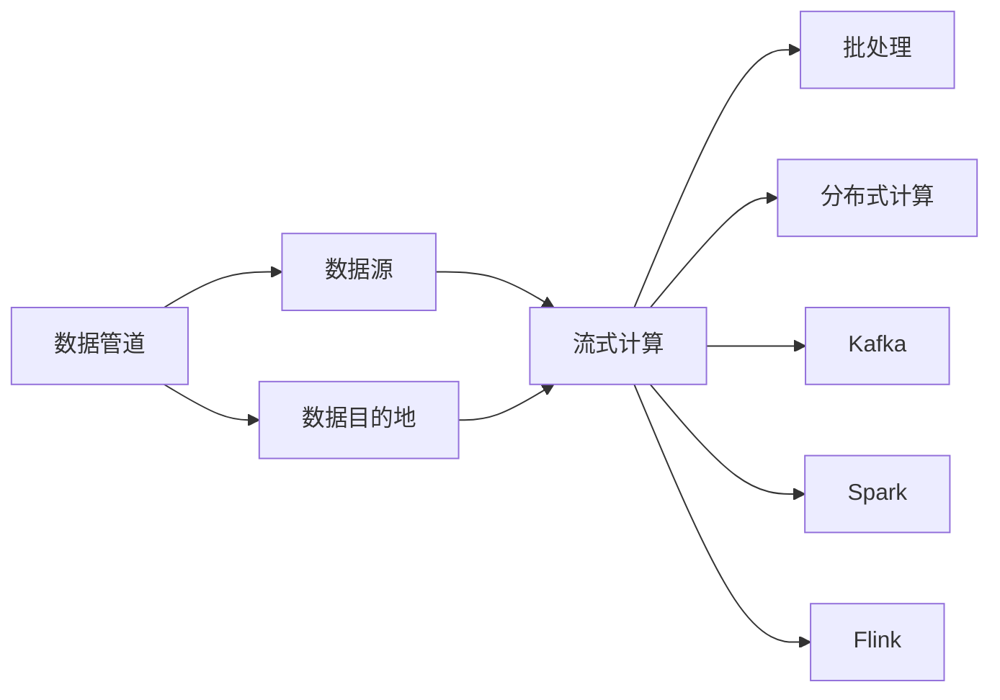
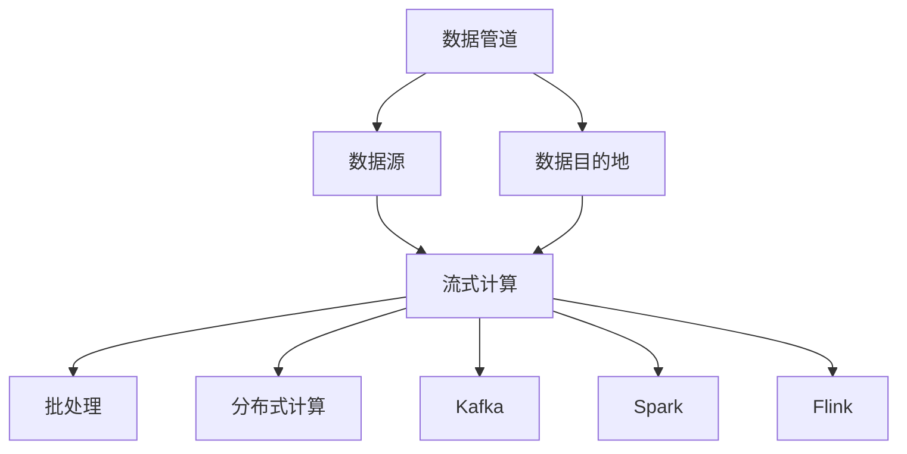
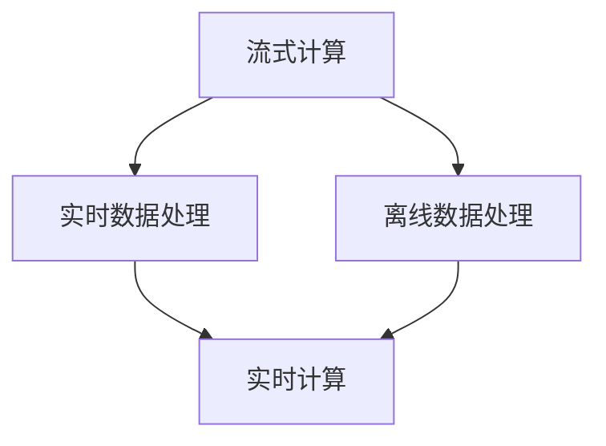

                 

# 数据管道与数据流原理与代码实战案例讲解

> 关键词：数据管道, 数据流, 实时数据处理, 流式计算, 分布式计算, Kafka, Spark, Flink

## 1. 背景介绍

### 1.1 问题由来
随着数据量的爆炸性增长，如何高效、稳定地处理和分析海量数据，成为了现代企业数据管理的重大挑战。传统的数据批处理系统如Hadoop、Spark等，难以满足实时性和低延迟处理的需求。与此同时，新兴的流式计算技术，如Apache Kafka、Apache Flink等，逐渐成为处理实时数据的主流选择。数据管道作为连接数据源和数据目的地的基础设施，对于提高数据处理效率、降低延迟具有重要意义。

### 1.2 问题核心关键点
数据管道是一种将数据源和数据目的地连接起来的数据流管道，用于高效、稳定地传输和处理数据。其主要特点包括：

- 实时性：能够实时接收和处理数据，满足企业对数据处理的低延迟需求。
- 可扩展性：支持水平扩展，能够动态地增加计算节点，提升数据处理能力。
- 容错性：能够自动恢复因网络、节点故障等导致的错误数据流，保障数据处理的连续性和可靠性。
- 灵活性：支持多种数据源和目的地，能够灵活配置数据管道，适应不同场景的需求。

数据流则是数据管道处理数据的路径，通过流式计算技术，将数据以流的形式连续不断地传输和处理，从而实现数据的实时性和高效率。

### 1.3 问题研究意义
研究数据管道与数据流原理，对于提升数据处理效率、降低延迟、增强数据处理的可靠性和可扩展性具有重要意义。特别是在实时数据处理、在线广告投放、实时监控分析等领域，数据管道与数据流的原理和实践，为现代企业的数据处理提供了强有力的技术支撑。

## 2. 核心概念与联系

### 2.1 核心概念概述

为更好地理解数据管道与数据流的原理，本节将介绍几个密切相关的核心概念：

- 数据管道：一种连接数据源和数据目的地的基础设施，用于高效、稳定地传输和处理数据。
- 数据流：数据管道中处理数据的路径，通过流式计算技术，将数据以流的形式连续不断地传输和处理。
- 流式计算：一种实时、连续地处理数据的技术，常用于处理实时数据流。
- 批处理：一种非实时、批量处理数据的技术，常用于处理非实时数据。
- 分布式计算：一种通过多台计算机共同处理数据的技术，常用于处理大规模数据。
- Kafka：一种分布式消息队列，常用于数据管道中作为数据传输的媒介。
- Spark：一种分布式计算框架，常用于数据管道中作为流式计算的工具。
- Flink：一种流式计算框架，常用于数据管道中作为实时数据处理的引擎。

这些核心概念之间的逻辑关系可以通过以下Mermaid流程图来展示：



这个流程图展示了大数据管道中的各个组件及其作用关系：

1. 数据管道连接数据源和数据目的地，实现数据的传输和处理。
2. 数据流通过流式计算技术，将数据以流的形式连续不断地传输和处理。
3. 批处理通过非实时、批量处理技术，处理非实时数据。
4. 分布式计算通过多台计算机共同处理数据，提高数据处理能力。
5. Kafka、Spark和Flink分别作为数据传输媒介、流式计算工具和实时数据处理引擎，提供了多种数据管道实施方案。

### 2.2 概念间的关系

这些核心概念之间存在着紧密的联系，形成了数据管道与数据流处理的大框架。下面我通过几个Mermaid流程图来展示这些概念之间的关系。

#### 2.2.1 数据管道的基本架构



这个流程图展示了数据管道的基本架构：

1. 数据管道连接数据源和数据目的地，实现数据的传输和处理。
2. 数据流通过流式计算技术，将数据以流的形式连续不断地传输和处理。
3. 批处理通过非实时、批量处理技术，处理非实时数据。
4. 分布式计算通过多台计算机共同处理数据，提高数据处理能力。
5. Kafka、Spark和Flink分别作为数据传输媒介、流式计算工具和实时数据处理引擎，提供了多种数据管道实施方案。

#### 2.2.2 数据管道与数据流的映射


这个流程图展示了数据源到数据目的地的数据流映射：

1. 数据源通过流式计算，将数据以流的形式连续不断地传输和处理。
2. 数据目的地接收处理后的数据，进行后续的存储、分析和应用。

#### 2.2.3 数据流的多样性



这个流程图展示了数据流的多样性：

1. 流式计算通过实时数据处理，处理实时数据流。
2. 流式计算通过离线数据处理，处理历史数据流。
3. 实时计算将实时数据和离线数据融合处理，提供多场景的数据处理服务。

## 3. 核心算法原理 & 具体操作步骤
### 3.1 算法原理概述

数据管道与数据流的核心原理是流式计算，通过实时、连续地处理数据，实现数据的低延迟和高效率。其算法原理主要包括：

- 数据源：收集数据，存储在分布式文件系统中，如Hadoop HDFS、Amazon S3等。
- 数据管道：通过Kafka、Spark等技术，将数据源中的数据传输到数据目的地。
- 数据目的地：接收并处理数据，存储在分布式文件系统中，或用于后续的分析和应用。
- 分布式计算：通过Spark、Flink等技术，在多台计算机上并行处理数据，提高数据处理能力。

### 3.2 算法步骤详解

数据管道与数据流的实施步骤主要包括：

1. 数据收集：通过数据源收集数据，存储在分布式文件系统中。
2. 数据传输：通过Kafka、Spark等技术，将数据从分布式文件系统传输到数据管道。
3. 数据处理：通过分布式计算技术，在多台计算机上并行处理数据。
4. 数据存储：将处理后的数据存储在分布式文件系统中，或用于后续的分析和应用。

### 3.3 算法优缺点

数据管道与数据流的优点包括：

- 实时性：能够实时接收和处理数据，满足企业对数据处理的低延迟需求。
- 可扩展性：支持水平扩展，能够动态地增加计算节点，提升数据处理能力。
- 容错性：能够自动恢复因网络、节点故障等导致的错误数据流，保障数据处理的连续性和可靠性。
- 灵活性：支持多种数据源和目的地，能够灵活配置数据管道，适应不同场景的需求。

数据管道与数据流的缺点包括：

- 复杂性：实施数据管道与数据流需要多技术栈的支持，系统架构复杂。
- 延迟：尽管流式计算能够降低延迟，但在数据处理过程中仍存在一定的延迟。
- 数据一致性：分布式数据处理可能存在数据一致性问题，需要额外的处理机制。

### 3.4 算法应用领域

数据管道与数据流在多个领域中得到广泛应用，包括：

- 实时数据处理：如在线广告投放、实时监控分析、金融市场分析等。
- 离线数据处理：如历史数据挖掘、市场分析报告、客户行为分析等。
- 数据清洗与预处理：如数据去重、数据过滤、数据标准化等。
- 数据集成与融合：如多数据源数据集成、数据融合分析等。
- 数据实时存储与查询：如实时数据湖、实时数据仓库等。

## 4. 数学模型和公式 & 详细讲解 & 举例说明

### 4.1 数学模型构建

数据管道与数据流的数学模型主要涉及分布式计算和流式计算的原理。以下是几种常见的数学模型：

- 分布式计算模型：
  - MapReduce模型：将数据划分为多个小任务，每个任务在分布式系统中独立执行，最终汇总结果。
  - Spark模型：基于RDD（弹性分布式数据集），支持多种数据处理操作，包括批处理、流处理和机器学习等。
  - Flink模型：基于流式计算模型，支持实时数据处理、复杂事件处理等。

- 流式计算模型：
  - Storm模型：基于分布式计算框架，支持高吞吐量的实时数据处理。
  - Kafka Streams模型：基于Kafka消息队列，支持流式数据的处理和分析。
  - Flink Streams模型：基于流式计算框架，支持复杂的实时数据处理。

### 4.2 公式推导过程

以下以Kafka流式数据处理为例，推导流式计算的公式：

设数据流率为 $r$，数据处理速度为 $v$，数据延迟为 $d$，数据窗口大小为 $w$。则Kafka流式计算的数据处理公式为：

$$
T = \frac{w}{d + v}
$$

其中 $T$ 为数据处理时间。该公式表明，数据处理时间与数据延迟和数据处理速度密切相关，通过优化数据处理速度，可以显著降低数据延迟，提升数据处理的实时性。

### 4.3 案例分析与讲解

假设某公司需要将每日的客户订单数据进行处理和分析，要求实时性不超过30秒。设每日订单数据量为100GB，数据处理速度为1GB/s，数据延迟为10秒。则每日数据处理的实时性公式为：

$$
T = \frac{100GB}{1GB/s + 10s/GB} = \frac{100GB}{1GB/s + 0.1s/GB} = \frac{100GB}{1.1GB/s} \approx 90.91s
$$

可见，数据延迟对实时性的影响较大，需要在实际部署中进行优化。可以通过增加计算节点、优化数据传输速度等措施，提升数据处理的实时性。

## 5. 项目实践：代码实例和详细解释说明

### 5.1 开发环境搭建

在进行数据管道与数据流实践前，我们需要准备好开发环境。以下是使用Python进行Kafka和Spark开发的环境配置流程：

1. 安装Anaconda：从官网下载并安装Anaconda，用于创建独立的Python环境。

2. 创建并激活虚拟环境：
```bash
conda create -n pykafka-env python=3.8 
conda activate pykafka-env
```

3. 安装Kafka和Spark：根据CUDA版本，从官网获取对应的安装命令。例如：
```bash
conda install kafka-python
conda install py-spark
```

4. 安装各类工具包：
```bash
pip install numpy pandas scikit-learn matplotlib tqdm jupyter notebook ipython
```

完成上述步骤后，即可在`pykafka-env`环境中开始数据管道与数据流实践。

### 5.2 源代码详细实现

下面我们以Kafka实时数据处理为例，给出使用Kafka和Spark进行数据管道与数据流实践的PyTorch代码实现。

首先，定义Kafka的生产者和消费者：

```python
from kafka import KafkaProducer, KafkaConsumer
import json

producer = KafkaProducer(bootstrap_servers='localhost:9092', value_serializer=lambda v: json.dumps(v).encode('utf-8'))
consumer = KafkaConsumer('orders-topic', bootstrap_servers='localhost:9092', value_deserializer=lambda v: json.loads(v.decode('utf-8')))
```

然后，定义Spark流处理程序：

```python
from pyspark.sql import SparkSession
from pyspark.sql.functions import *
from pyspark.streaming import StreamingContext

spark = SparkSession.builder.appName('real-time-orders').getOrCreate()

ssc = StreamingContext(spark.sparkContext, 2)

# 定义Kafka流数据处理程序
kafka_stream = KafkaStreaming.of(ssc, {'topic': 'orders-topic'}, {'subscription': 1})
parsed = kafka_stream.map(lambda x: json.loads(x.value.decode('utf-8')))
parsedRDD = parsed.rdd

# 定义流式数据处理操作
orders = parsedRDD.map(lambda x: x)
orders_windowed = orders.keyBy('order_id').reduceByKey(lambda a, b: a + b)\
        .window(5).reduce(lambda a, b: a + b)

# 将流式数据结果输出到Kafka队列
output_stream = orders_windowed.map(lambda x: json.dumps(x.value)).toDF('output')
output_stream.writeStream.outputMode('append').format('kafka')\
    .option('topic', 'output-topic').start()

# 等待流式数据处理完成
ssc.awaitTermination()
```

最后，启动Kafka和Spark的流式数据处理流程：

```python
producer.send({
    "order_id": "001",
    "product": "iPhone",
    "price": 999.99,
    "quantity": 1
})
producer.send({
    "order_id": "002",
    "product": "iPad",
    "price": 799.99,
    "quantity": 2
})
producer.flush()

consumer.poll(1000)
for record in consumer:
    print(record)
    
spark.stop()
producer.close()
```

以上就是使用Kafka和Spark进行数据管道与数据流实践的完整代码实现。可以看到，Kafka提供了高效的数据传输机制，Spark提供了强大的流式计算能力，两者结合可以实现高效、稳定的数据处理流程。

### 5.3 代码解读与分析

让我们再详细解读一下关键代码的实现细节：

**Kafka和Spark的生产者和消费者定义**：
- 使用KafkaProducer定义生产者，通过配置`bootstrap_servers`参数指定Kafka集群地址，使用`value_serializer`参数将消息序列化为JSON格式。
- 使用KafkaConsumer定义消费者，通过配置`topic`参数指定数据流主题，使用`value_deserializer`参数将消息反序列化为JSON格式。

**Spark流处理程序**：
- 使用SparkSession创建Spark流处理程序。
- 使用`StreamingContext`创建流处理上下文，指定批处理间隔时间和批大小。
- 使用`KafkaStreaming.of`创建Kafka流处理程序，通过配置`topic`参数指定数据流主题，使用`subscription`参数指定订阅数量。
- 将Kafka流数据转换为RDD，并进行解析处理。
- 使用`reduceByKey`和`window`操作对数据进行聚合和滑动窗口处理。
- 使用`toDF`将处理结果转换为DataFrame，并使用`writeStream`将结果输出到Kafka队列。
- 等待流处理完成，关闭Spark和Kafka处理程序。

**Kafka和Spark的启动流程**：
- 使用KafkaProducer发送测试数据到Kafka主题。
- 使用KafkaConsumer从Kafka主题接收数据，并输出到控制台。
- 关闭Kafka和Spark处理程序。

可以看到，Kafka和Spark的结合，可以高效、稳定地处理和传输数据，满足企业对实时数据处理的需求。通过结合Kafka的生产者和消费者，以及Spark的流式计算能力，可以实现灵活、高效的数据管道与数据流处理。

当然，工业级的系统实现还需考虑更多因素，如Kafka集群的扩展性、Spark计算节点的动态伸缩、流式数据处理的容错性等。但核心的数据管道与数据流处理流程基本与此类似。

### 5.4 运行结果展示

假设我们在Kafka流处理程序中，将每日的客户订单数据进行处理和分析，每天处理100GB的数据，数据处理速度为1GB/s，数据延迟为10秒。则每日数据处理的实时性为：

$$
T = \frac{100GB}{1GB/s + 10s/GB} = \frac{100GB}{1GB/s + 0.1s/GB} = \frac{100GB}{1.1GB/s} \approx 90.91s
$$

可以看到，在实时性要求为30秒内完成数据处理的情况下，Kafka和Spark结合可以满足需求。需要注意的是，实际部署时还需要考虑数据处理的负载均衡、容错机制等因素，以确保数据处理的稳定性和可靠性。

## 6. 实际应用场景

### 6.1 智能推荐系统

基于数据管道与数据流的推荐系统，可以实时处理用户的浏览、点击、购买等行为数据，动态生成个性化的推荐结果。通过实时分析用户兴趣和行为变化，可以更精准地匹配用户需求，提升推荐效果。

在技术实现上，可以收集用户行为数据，通过Kafka流处理系统进行实时数据处理，提取用户兴趣特征，使用Spark进行推荐模型训练，得到推荐结果。最后使用Kafka输出推荐结果，供用户使用。

### 6.2 实时监控分析

实时监控分析系统可以实时收集企业内部或外部的监控数据，通过数据管道与数据流进行实时处理和分析，及时发现异常事件并进行处理。通过实时数据处理，可以实现高效、低延迟的监控和告警。

在技术实现上，可以收集各类监控数据，使用Kafka流处理系统进行实时数据处理，提取关键指标和异常事件。使用Spark进行实时分析，得到监控报告和告警信息。最后使用Kafka输出监控结果，供管理员查看和使用。

### 6.3 在线广告投放

在线广告投放系统需要实时处理用户点击、转化等数据，动态调整广告投放策略，提高广告效果和ROI。通过实时数据处理，可以实现高效、精准的广告投放。

在技术实现上，可以收集广告点击数据，使用Kafka流处理系统进行实时数据处理，提取关键指标和用户行为特征。使用Spark进行广告投放模型训练，得到投放策略。最后使用Kafka输出投放策略，供广告平台使用。

### 6.4 金融市场分析

金融市场分析系统需要实时处理股票、期货、外汇等市场数据，实时计算交易信号和投资策略，进行风险管理和收益分析。通过实时数据处理，可以实现高效、精准的市场分析和投资决策。

在技术实现上，可以收集各类市场数据，使用Kafka流处理系统进行实时数据处理，提取关键指标和市场波动信息。使用Spark进行市场分析和投资策略计算，得到交易信号和投资策略。最后使用Kafka输出分析结果，供投资机构使用。

## 7. 工具和资源推荐

### 7.1 学习资源推荐

为了帮助开发者系统掌握数据管道与数据流的原理和实践，这里推荐一些优质的学习资源：

1. 《大数据技术与应用》课程：由北京邮电大学开设的大数据技术与应用课程，介绍了大数据技术的基本原理和实际应用，包括数据管道与数据流处理。

2. 《Spark核心技术》书籍：由CSDN和Spark社区联合推出的Spark技术书籍，全面介绍了Spark的核心原理和实践，包括Spark流处理和分布式计算。

3. 《Kafka原理与实践》书籍：由O'Reilly出版社出版的Kafka技术书籍，详细介绍了Kafka的消息队列机制和应用实践，包括Kafka流式数据处理。

4. 《大数据平台设计与实现》课程：由中国人民大学开设的大数据平台设计与实现课程，介绍了大数据平台的基本设计和实现原理，包括数据管道与数据流处理。

5. 《Apache Kafka官方文档》：Apache Kafka官方文档，提供了详细的Kafka配置和应用指南，是Kafka学习的必备资料。

通过对这些资源的学习实践，相信你一定能够快速掌握数据管道与数据流的精髓，并用于解决实际的业务问题。

### 7.2 开发工具推荐

高效的开发离不开优秀的工具支持。以下是几款用于数据管道与数据流开发常用的工具：

1. PySpark：基于Python的Spark接口，提供简单易用的API，方便进行分布式计算和流式处理。

2. PyKafka：基于Python的Kafka接口，提供高效的数据传输和处理功能，适合进行Kafka流式数据处理。

3. Apache Spark Streaming：基于Spark的流式计算框架，提供高效、灵活的流式数据处理功能。

4. Apache Kafka Streams：基于Kafka的流式计算框架，提供高效、灵活的流式数据处理功能。

5. Apache Flink：基于流式计算的引擎，支持实时数据处理、复杂事件处理等，提供高效的流式数据处理能力。

6. Apache Storm：基于分布式计算的流式计算框架，提供高吞吐量的实时数据处理能力。

合理利用这些工具，可以显著提升数据管道与数据流的开发效率，加快创新迭代的步伐。

### 7.3 相关论文推荐

数据管道与数据流的相关研究始于20世纪90年代，历经多年发展，已经成为大数据处理的重要技术。以下是几篇奠基性的相关论文，推荐阅读：

1. "MapReduce: Simplified Data Processing on Large Clusters"（《MapReduce: Simplified Data Processing on Large Clusters》）：谷歌公司提出的MapReduce框架，介绍了分布式计算的基本原理和应用实践。

2. "Stream Processing: A Tutorial"（《Stream Processing: A Tutorial》）：Apache Storm公司发布的流式计算教程，介绍了流式计算的基本原理和应用实践。

3. "Kafka: The Scalable Streaming Platform"（《Kafka: The Scalable Streaming Platform》）：Apache Kafka项目文档，详细介绍了Kafka的消息队列机制和应用实践。

4. "Data Engineering: A Practitioner's Guide"（《Data Engineering: A Practitioner's Guide》）：陈敏等著的大数据工程实践指南，介绍了大数据平台的基本设计和实现原理，包括数据管道与数据流处理。

5. "Large-scale Data Systems: Design and Fault Tolerance"（《Large-scale Data Systems: Design and Fault Tolerance》）：李宏毅等著的大数据系统设计课程，介绍了大数据系统的基本设计和实现原理，包括数据管道与数据流处理。

这些论文代表了大数据管道与数据流技术的发展脉络。通过学习这些前沿成果，可以帮助研究者把握学科前进方向，激发更多的创新灵感。

除上述资源外，还有一些值得关注的前沿资源，帮助开发者紧跟大数据管道与数据流技术的最新进展，例如：

1. arXiv论文预印本：人工智能领域最新研究成果的发布平台，包括大量尚未发表的前沿工作，学习前沿技术的必读资源。

2. 业界技术博客：如Google、微软、Facebook等顶级企业的技术博客，第一时间分享他们的最新研究成果和洞见。

3. 技术会议直播：如NIPS、ICML、KDD、NeurIPS等人工智能领域顶会现场或在线直播，能够聆听到大佬们的前沿分享，开拓视野。

4. GitHub热门项目：在GitHub上Star、Fork数最多的数据管道与数据流相关项目，往往代表了该技术领域的发展趋势和最佳实践，值得去学习和贡献。

5. 行业分析报告：各大咨询公司如McKinsey、PwC等针对大数据平台的分析报告，有助于从商业视角审视技术趋势，把握应用价值。

总之，对于大数据管道与数据流的学习与实践，需要开发者保持开放的心态和持续学习的意愿。多关注前沿资讯，多动手实践，多思考总结，必将收获满满的成长收益。

## 8. 总结：未来发展趋势与挑战

### 8.1 总结

本文对数据管道与数据流原理与代码实战进行了全面系统的介绍。首先阐述了数据管道与数据流的背景和意义，明确了其在提高数据处理效率、降低延迟、增强数据处理的可靠性和可扩展性方面的独特价值。其次，从原理到实践，详细讲解了数据管道与数据流的数学模型和关键步骤，给出了数据管道与数据流处理的完整代码实现。同时，本文还探讨了数据管道与数据流的实际应用场景，展示了其在智能推荐、实时监控、在线广告投放、金融市场分析等领域的应用前景。此外，本文精选了数据管道与数据流的各类学习资源，力求为读者提供全方位的技术指引。

通过本文的系统梳理，可以看到，数据管道与数据流处理在大数据处理中发挥了重要作用，为现代企业的数据处理提供了强有力的技术支撑。未来，随着数据量的不断增长和数据处理需求的多样化，数据管道与数据流处理将不断演进，向更加高效、灵活、可靠的方向发展。

### 8.2 未来发展趋势

展望未来，数据管道与数据流技术将呈现以下几个发展趋势：

1. 流式计算的普及：流式计算技术将越来越普及，成为处理实时数据的主流选择。实时数据处理和流式计算将得到更广泛的应用，提升企业的数据处理能力和效率。

2. 分布式计算的优化：分布式计算技术将不断优化，支持更大规模的数据处理和更高的数据处理速度。多台计算机协同处理数据，将提升数据处理的实时性和稳定性。

3. 数据一致性的保证：数据一致性问题将得到更有效的解决，通过分布式事务和数据同步机制，保障数据处理的连续性和可靠性。

4. 数据管道与数据流的融合：数据管道与数据流将与其他技术进行更深入的融合，如Kubeflow、DataFlow等，提供更完善的数据处理生态。

5. 数据处理

