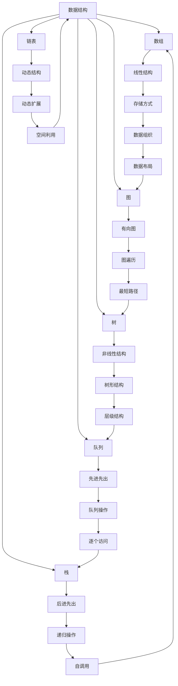
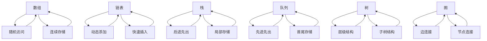
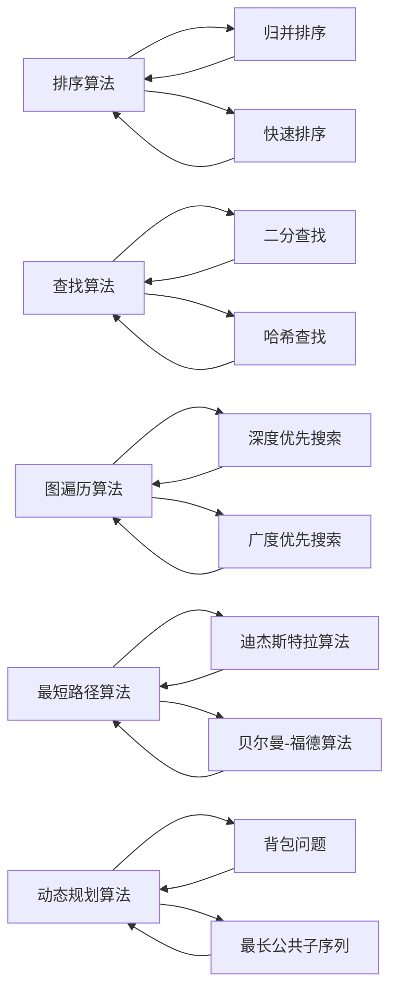
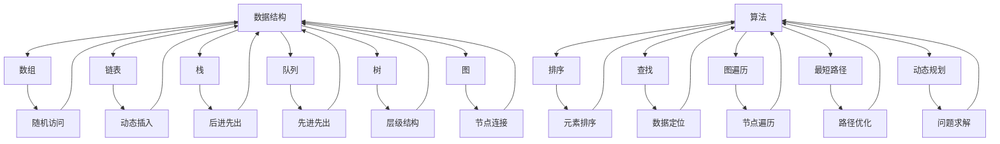

                 

# 数据结构与算法原理与代码实战案例讲解

> 关键词：数据结构, 算法原理, 实战案例, 编程技巧, 问题解决, 代码实现

## 1. 背景介绍

### 1.1 问题由来
在计算机科学领域，数据结构和算法是程序设计和软件开发的两大基石。深入理解数据结构和算法的原理，能够显著提升编程效率和程序性能。然而，数据结构和算法的理论知识往往抽象枯燥，难以在实际编程中灵活应用。因此，本文旨在通过实战案例，深入讲解数据结构和算法的原理与代码实现，帮助读者更好地理解和掌握这些核心知识。

### 1.2 问题核心关键点
本文将从数据结构的基本概念出发，系统讲解常见的经典数据结构，包括数组、链表、栈、队列、树、图等。在此基础上，深入分析经典算法的原理和实现，涵盖排序、查找、图遍历、最短路径、动态规划等常见算法。通过大量实战案例，展示如何将理论知识转化为高效实用的编程技巧。

### 1.3 问题研究意义
掌握数据结构和算法原理，是计算机科学教育中的重要环节。在编程实践、软件开发、系统设计、人工智能等诸多领域，数据结构和算法都发挥着至关重要的作用。本文通过实战案例，将抽象的理论知识与具体的代码实现相结合，旨在为读者提供一种更加直观、实用的学习路径，帮助他们在编程中更加高效地解决问题。

## 2. 核心概念与联系

### 2.1 核心概念概述

为更好地理解数据结构和算法的核心概念，本节将介绍几个关键概念及其联系：

- **数据结构(Data Structures)**：指组织和存储数据的方式，包括数组、链表、栈、队列、树、图等。数据结构为算法提供了操作数据的框架，是算法实现的基础。

- **算法(Algorithms)**：指解决问题的方法和步骤，包括排序、查找、图遍历、最短路径、动态规划等。算法通过特定步骤实现目标，是数据结构的具体应用。

- **时间复杂度(Time Complexity)**：指算法执行所需的时间量度，通常用大O符号表示。时间复杂度决定了算法在不同数据规模下的性能表现。

- **空间复杂度(Space Complexity)**：指算法所需存储空间的量度，也是算法优化的重要考虑因素。

- **递归(Recursion)**：指函数在调用过程中反复引用自身，是解决某些问题的常用技术。

- **回溯(Backtracking)**：指在问题求解过程中，通过尝试所有可能的解，逐个排除不可行的解，最终找到满足条件的解。

这些核心概念之间的关系可以通过以下Mermaid流程图来展示：



这个流程图展示了数据结构和算法的核心概念及其联系：

1. 数据结构提供数据的组织和存储方式。
2. 算法通过特定步骤解决问题。
3. 时间复杂度和空间复杂度是算法优化的关键指标。
4. 递归和回溯是常用的问题求解技术。
5. 数据结构与算法相互依赖，共同构成解决实际问题的框架。

### 2.2 概念间的关系

这些核心概念之间存在着紧密的联系，形成了数据结构和算法的基本框架。以下通过几个Mermaid流程图来展示这些概念之间的关系：

#### 2.2.1 数据结构的层次结构



这个流程图展示了不同数据结构的特性和应用场景：

1. 数组支持随机访问，但插入删除效率低。
2. 链表支持动态添加和快速插入，但访问效率低。
3. 栈支持后进先出，常用于表达式求值、函数调用等。
4. 队列支持先进先出，常用于广度优先搜索、任务调度等。
5. 树和图分别支持层级和节点连接，常用于路径规划、网络通信等。

#### 2.2.2 算法的解决步骤



这个流程图展示了常见算法的解决步骤：

1. 排序算法通过比较和交换实现元素排序。
2. 查找算法通过查找和比较实现数据定位。
3. 图遍历算法通过深度和广度优先搜索实现节点遍历。
4. 最短路径算法通过单源或多源最短路径算法实现路径优化。
5. 动态规划算法通过分治和优化实现复杂问题的求解。

### 2.3 核心概念的整体架构

最后，我们用一个综合的流程图来展示这些核心概念在大数据结构和算法中的应用：



这个综合流程图展示了从数据结构到算法的基本应用：

1. 数据结构提供数据的组织和存储方式。
2. 算法通过特定步骤解决问题。
3. 不同数据结构支持不同的算法应用。
4. 算法通过优化数据结构提升性能。

通过这些流程图，我们可以更清晰地理解数据结构和算法的核心概念及其联系，为后续深入讨论具体的算法实现和应用奠定基础。

## 3. 核心算法原理 & 具体操作步骤
### 3.1 算法原理概述

本节将深入讲解数据结构和算法的核心原理，包括时间复杂度、空间复杂度、递归和回溯等基本概念。通过详细的理论推导和实例讲解，帮助读者更好地理解和掌握这些核心原理。

#### 3.1.1 时间复杂度

时间复杂度是算法执行所需时间量的度量，通常用大O符号表示。时间复杂度决定了算法在不同数据规模下的性能表现。以下列举一些常见算法的时间复杂度：

- 线性时间复杂度：$O(n)$，如顺序查找、遍历数组等。
- 线性对数时间复杂度：$O(n \log n)$，如快速排序、归并排序等。
- 平方时间复杂度：$O(n^2)$，如冒泡排序、选择排序等。
- 指数时间复杂度：$O(2^n)$，如穷举搜索等。

理解时间复杂度的关键在于掌握其基本性质和常见算法的时间复杂度类别。通过大O符号表示，我们可以更直观地比较不同算法在不同数据规模下的性能表现。

#### 3.1.2 空间复杂度

空间复杂度是算法所需存储空间的量度，也是算法优化的重要考虑因素。空间复杂度通常用大O符号表示。以下列举一些常见算法的空间复杂度：

- 常数空间复杂度：$O(1)$，如快速幂算法、某些递归算法等。
- 线性空间复杂度：$O(n)$，如顺序存储数组、某些递归算法等。
- 平方空间复杂度：$O(n^2)$，如某些动态规划算法等。
- 指数空间复杂度：$O(2^n)$，如某些递归算法等。

理解空间复杂度的关键在于掌握其基本性质和常见算法的空间复杂度类别。通过大O符号表示，我们可以更直观地比较不同算法在不同数据规模下的存储需求。

#### 3.1.3 递归

递归是一种常用的问题求解技术，通过函数在调用过程中反复引用自身，逐步缩小问题规模，最终达到求解目标。以下以斐波那契数列为例，讲解递归的基本原理和实现。

斐波那契数列的递归定义如下：

$$
F(n) = \begin{cases}
0, & \text{if } n = 0 \\
1, & \text{if } n = 1 \\
F(n-1) + F(n-2), & \text{if } n > 1
\end{cases}
$$

递归实现斐波那契数列的代码如下：

```python
def fibonacci(n):
    if n == 0:
        return 0
    elif n == 1:
        return 1
    else:
        return fibonacci(n-1) + fibonacci(n-2)
```

这个递归函数的时间复杂度为$O(2^n)$，空间复杂度为$O(n)$。在实际应用中，递归可能导致栈溢出，因此需要引入记忆化搜索或动态规划等技术，优化递归算法的性能。

#### 3.1.4 回溯

回溯是一种常用的问题求解技术，通过尝试所有可能的解，逐个排除不可行的解，最终找到满足条件的解。以下以八皇后问题为例，讲解回溯的基本原理和实现。

八皇后问题的目标是在一个$8 \times 8$的棋盘上放置八个皇后，使得任意两个皇后不相邻。回溯实现八皇后问题的代码如下：

```python
def eight_queens(n, col=0, results=[]):
    if col >= n:
        results.append(col)
        return results
    for row in range(n):
        if is_valid(row, col, n):
            results = eight_queens(n, col+1, results)
    return results

def is_valid(row, col, n):
    for r in range(col):
        if board[row][r] or \
           row-r < n and board[row-r][col] or \
           row+r >= 0 and row+r < n and board[row+r][col]:
            return False
    return True
```

这个回溯函数的时间复杂度为$O(n!)$，空间复杂度为$O(n)$。在实际应用中，回溯可能导致超时，因此需要引入剪枝等技术，优化回溯算法的性能。

### 3.2 算法步骤详解

本节将深入讲解数据结构和算法的具体实现步骤，包括常见数据结构的实现、常见算法的实现等。通过详细的代码示例和案例分析，帮助读者更好地理解和掌握这些核心算法。

#### 3.2.1 数组的实现

数组是一种常用的数据结构，支持随机访问和顺序存储。以下是Python中数组的实现示例：

```python
class Array:
    def __init__(self, size):
        self.size = size
        self.data = [0] * size
    
    def get(self, index):
        return self.data[index]
    
    def set(self, index, value):
        self.data[index] = value
    
    def insert(self, index, value):
        self.data.insert(index, value)
    
    def delete(self, index):
        del self.data[index]
```

这个数组类支持基本的增删改查操作。需要注意的是，数组的插入和删除操作时间复杂度为$O(n)$，因此需要在实际应用中避免频繁的插入和删除操作。

#### 3.2.2 链表的实现

链表是一种常用的数据结构，支持动态添加和快速插入。以下是Python中链表的实现示例：

```python
class Node:
    def __init__(self, value):
        self.value = value
        self.next = None
    
class LinkedList:
    def __init__(self):
        self.head = None
    
    def add(self, value):
        new_node = Node(value)
        if not self.head:
            self.head = new_node
        else:
            current = self.head
            while current.next:
                current = current.next
            current.next = new_node
    
    def remove(self, value):
        if not self.head:
            return
        if self.head.value == value:
            self.head = self.head.next
        else:
            current = self.head
            while current.next and current.next.value != value:
                current = current.next
            if current.next:
                current.next = current.next.next
```

这个链表类支持基本的增删操作。需要注意的是，链表的插入和删除操作时间复杂度为$O(1)$，因此需要在实际应用中充分利用链表的动态特性。

#### 3.2.3 栈的实现

栈是一种常用的数据结构，支持后进先出。以下是Python中栈的实现示例：

```python
class Stack:
    def __init__(self):
        self.items = []
    
    def push(self, value):
        self.items.append(value)
    
    def pop(self):
        return self.items.pop()
    
    def is_empty(self):
        return len(self.items) == 0
    
    def peek(self):
        return self.items[-1]
```

这个栈类支持基本的入栈、出栈、判空等操作。需要注意的是，栈的入栈和出栈操作时间复杂度为$O(1)$，因此需要在实际应用中充分利用栈的特性。

#### 3.2.4 队列的实现

队列是一种常用的数据结构，支持先进先出。以下是Python中队列的实现示例：

```python
class Queue:
    def __init__(self):
        self.items = []
    
    def enqueue(self, value):
        self.items.append(value)
    
    def dequeue(self):
        return self.items.pop(0)
    
    def is_empty(self):
        return len(self.items) == 0
    
    def size(self):
        return len(self.items)
```

这个队列类支持基本的入队、出队、判空、大小等操作。需要注意的是，队列的入队和出队操作时间复杂度为$O(1)$，因此需要在实际应用中充分利用队列的特性。

#### 3.2.5 树的实现

树是一种常用的数据结构，支持层级结构和子树结构。以下是Python中树的实现示例：

```python
class TreeNode:
    def __init__(self, value):
        self.value = value
        self.left = None
        self.right = None
    
class BinaryTree:
    def __init__(self):
        self.root = None
    
    def insert(self, value):
        new_node = TreeNode(value)
        if not self.root:
            self.root = new_node
        else:
            current = self.root
            while current:
                if value < current.value:
                    if not current.left:
                        current.left = new_node
                        break
                    else:
                        current = current.left
                else:
                    if not current.right:
                        current.right = new_node
                        break
                    else:
                        current = current.right
    
    def search(self, value):
        current = self.root
        while current:
            if value == current.value:
                return True
            elif value < current.value:
                current = current.left
            else:
                current = current.right
        return False
```

这个二叉树类支持基本的插入和查找操作。需要注意的是，树的插入和查找操作时间复杂度为$O(h)$，其中$h$为树的高度，因此需要在实际应用中避免树的高度过高。

#### 3.2.6 图的实现

图是一种常用的数据结构，支持节点和边连接。以下是Python中图的实现示例：

```python
class Graph:
    def __init__(self, num_vertices):
        self.num_vertices = num_vertices
        self.adj_list = [[] for _ in range(num_vertices)]
    
    def add_edge(self, u, v):
        self.adj_list[u].append(v)
        self.adj_list[v].append(u)
    
    def dfs(self, start):
        visited = set()
        stack = [start]
        while stack:
            vertex = stack.pop()
            if vertex not in visited:
                print(vertex, end=' ')
                visited.add(vertex)
                stack.extend([v for v in self.adj_list[vertex] if v not in visited])
    
    def bfs(self, start):
        visited = set()
        queue = [start]
        while queue:
            vertex = queue.pop(0)
            if vertex not in visited:
                print(vertex, end=' ')
                visited.add(vertex)
                queue.extend([v for v in self.adj_list[vertex] if v not in visited])
```

这个图类支持基本的添加边、深度优先搜索、广度优先搜索等操作。需要注意的是，图的深度优先搜索和广度优先搜索时间复杂度为$O(V+E)$，其中$V$为顶点数，$E$为边数，因此需要在实际应用中优化搜索算法。

#### 3.2.7 排序算法的实现

排序算法是常见的算法之一，支持元素排序。以下是Python中排序算法的实现示例：

```python
def selection_sort(arr):
    n = len(arr)
    for i in range(n):
        min_index = i
        for j in range(i+1, n):
            if arr[j] < arr[min_index]:
                min_index = j
        arr[i], arr[min_index] = arr[min_index], arr[i]
    return arr

def bubble_sort(arr):
    n = len(arr)
    for i in range(n):
        for j in range(n-i-1):
            if arr[j] > arr[j+1]:
                arr[j], arr[j+1] = arr[j+1], arr[j]
    return arr

def quick_sort(arr):
    if len(arr) <= 1:
        return arr
    pivot = arr[0]
    left = [x for x in arr[1:] if x < pivot]
    right = [x for x in arr[1:] if x >= pivot]
    return quick_sort(left) + [pivot] + quick_sort(right)
```

这些排序算法支持基本的排序操作。需要注意的是，快速排序算法的时间复杂度为$O(n \log n)$，而选择排序和冒泡排序算法的时间复杂度为$O(n^2)$，因此需要在实际应用中根据数据规模选择合适的排序算法。

#### 3.2.8 查找算法的实现

查找算法是常见的算法之一，支持数据定位。以下是Python中查找算法的实现示例：

```python
def binary_search(arr, target):
    low, high = 0, len(arr)-1
    while low <= high:
        mid = (low + high) // 2
        if arr[mid] == target:
            return mid
        elif arr[mid] < target:
            low = mid + 1
        else:
            high = mid - 1
    return -1

def linear_search(arr, target):
    for i in range(len(arr)):
        if arr[i] == target:
            return i
    return -1
```

这些查找算法支持基本的查找操作。需要注意的是，二分查找算法的时间复杂度为$O(\log n)$，而线性查找算法的时间复杂度为$O(n)$，因此需要在实际应用中根据数据规模选择合适的查找算法。

#### 3.2.9 图遍历算法的实现

图遍历算法是常见的算法之一，支持节点遍历。以下是Python中图遍历算法的实现示例：

```python
def depth_first_search(graph, start):
    visited = set()
    stack = [start]
    while stack:
        vertex = stack.pop()
        if vertex not in visited:
            print(vertex, end=' ')
            visited.add(vertex)
            stack.extend([v for v in graph.adj_list[vertex] if v not in visited])

def breadth_first_search(graph, start):
    visited = set()
    queue = [start]
    while queue:
        vertex = queue.pop(0)
        if vertex not in visited:
            print(vertex, end=' ')
            visited.add(vertex)
            queue.extend([v for v in graph.adj_list[vertex] if v not in visited])
```

这些图遍历算法支持基本的深度优先搜索和广度优先搜索操作。需要注意的是，深度优先搜索和广度优先搜索的时间复杂度均为$O(V+E)$，其中$V$为顶点数，$E$为边数，因此需要在实际应用中优化搜索算法。

#### 3.2.10 最短路径算法的实现

最短路径算法是常见的算法之一，支持路径优化。以下是Python中最短路径算法的实现示例：

```python
def dijkstra(graph, start):
    distances = {vertex: float('inf') for vertex in graph}
    distances[start] = 0
    queue = [(0, start)]
    while queue:
        current_distance, current_vertex = heapq.heappop(queue)
        if current_distance > distances[current_vertex]:
            continue
        for neighbor, weight in graph[current_vertex].items():
            distance = current_distance + weight
            if distance < distances[neighbor]:
                distances[neighbor] = distance
                heapq.heappush(queue, (distance, neighbor))
    return distances
```

这个迪杰斯特拉算法支持基本的单源最短路径优化操作。需要注意的是，迪杰斯特拉算法的时间复杂度为$O(E+V \log V)$，其中$V$为顶点数，$E$为边数，因此需要在实际应用中优化算法。

#### 3.2.11 动态规划算法的实现

动态规划算法是常见的算法之一，支持复杂问题的求解。以下是Python中动态规划算法的实现示例：

```python
def fibonacci(n):
    if n == 0 or n == 1:
        return n
    fib_table = [0, 1]
    for i in range(2, n+1):
        fib_table.append(fib_table[i-1] + fib_table[i-2])
    return fib_table[n]

def knapsack(capacity, weights, values):
    n = len(weights)
    dp = [[0] * (capacity+1) for _ in range(n+1)]
    for i in range(1, n+1):
        for j in range(1, capacity+1):
            if weights[i-1] > j:
                dp[i][j] = dp[i-1][j]
            else:
                dp[i][j] = max(dp[i-1][j], values[i-1] + dp[i-1][j-weights[i-1]])
    return dp[n][capacity]
```

这些动态规划算法支持基本的复杂问题求解操作。需要注意的是，动态规划算法的时间复杂度通常为$O(n^2)$，因此需要在实际应用中优化算法。

### 3.3 算法优缺点

数据结构和算法具有各自的优缺点，需要在实际应用中根据具体情况选择合适的数据结构和算法。

#### 3.3.1 数据结构的优缺点

- 数组：支持随机访问，插入删除效率低。适用于静态数据存储，不适用于频繁的插入和删除操作。
- 链表：支持动态添加和快速插入，访问效率低。适用于动态数据存储，插入删除操作时间复杂度为$O(1)$。
- 栈：支持后进先出，常用于表达式求值、函数调用等。适用于需要后进先出的场景。
- 队列：支持先进先出，常用于广度优先搜索、任务调度等。适用于需要先进先出的场景。
- 树：支持层级结构和子树结构，常用于路径规划、网络通信等。适用于树形结构的场景。
- 图：支持节点和边连接，常用于网络通信、社交网络等。适用于网络结构的场景。

#### 3.3.2 算法的优缺点

- 排序算法：支持元素排序，适用于需要排序的场景。不同的排序算法时间复杂度不同，需要根据数据

