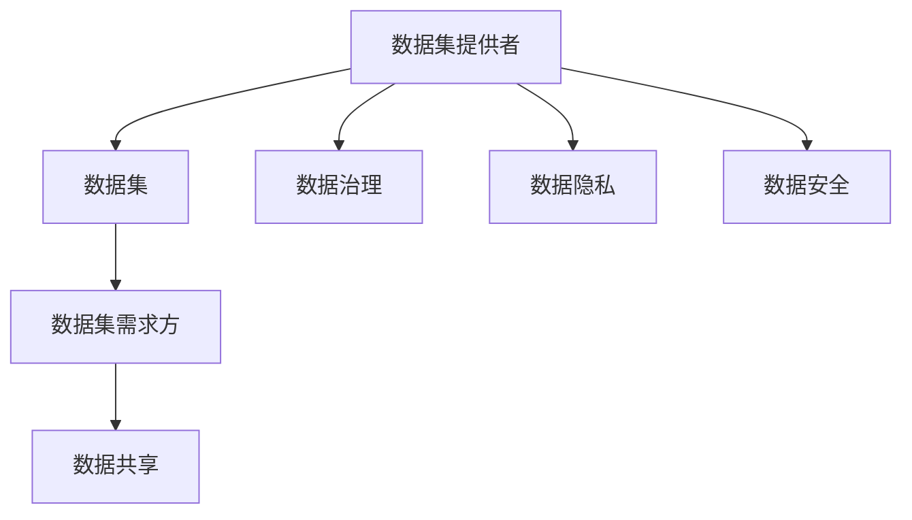

                 

# 数据集博弈:数据提供者与数据需求方的新型关系

> 关键词：
- 数据集博弈
- 数据提供者
- 数据需求方
- 数据治理
- 数据共享
- 数据安全
- 数据隐私

## 1. 背景介绍

随着数字化进程的加速，数据集已经成为各行各业的核心资源。在医疗、金融、电商、制造等领域，数据集为模型的训练和优化提供了重要的训练样本，驱动了人工智能(AI)技术在实际应用中的落地。然而，数据集的获取和使用过程中，数据提供者与数据需求方之间存在着复杂的博弈关系，常常面临数据共享、数据隐私、数据安全等诸多挑战。

本博客文章旨在探讨数据集博弈背后的原理，并提出一种基于博弈论的数据集共享策略，以期在保护数据提供者利益的同时，满足数据需求方的需求。

## 2. 核心概念与联系

### 2.1 核心概念概述

1. **数据集提供者(Data Providers)**：指拥有并愿意分享数据的机构或个人，包括政府机构、企业、学术研究机构等。

2. **数据集需求方(Data Consumers)**：指需要数据进行模型训练或分析的研究机构、企业或个体。

3. **数据集博弈(Data Dataset Game)**：指数据提供者与数据需求方在数据集共享过程中，通过协议、价格、技术手段等进行博弈的过程。

4. **数据治理(Data Governance)**：指通过政策、法规、技术手段等，对数据集的使用进行规范和管理，保护数据提供者的利益，同时确保数据需求方的合理需求得以满足。

5. **数据共享(Data Sharing)**：指在遵循法律法规的前提下，数据提供者向数据需求方提供其拥有的数据集的过程。

6. **数据隐私(Data Privacy)**：指保护个人数据不受未经授权的访问和使用，保障个人隐私权。

7. **数据安全(Data Security)**：指通过技术手段保障数据集在传输和存储过程中的安全性和完整性。

这些核心概念通过相互之间的博弈、协作和规范，共同构成了数据集共享的复杂生态系统。

### 2.2 概念间的关系

通过以下Mermaid流程图，我们可以更清晰地理解这些核心概念之间的联系：



这个流程图展示了数据集共享过程中，各个核心概念之间的逻辑关系：

1. 数据集提供者将拥有的数据集提供给数据集需求方。
2. 数据治理对数据集的使用进行规范，保护数据提供者的利益，同时确保数据需求方的合理需求得以满足。
3. 数据共享是数据集提供者和需求方之间的协作过程，通过协议、技术手段等实现数据集的安全传输和存储。
4. 数据隐私和技术安全是数据共享过程中的重要保障，通过法律法规和技术手段保护数据提供者和需求方的利益。

这些概念共同构成了数据集共享的完整生态系统，对于促进数据集的共享和利用，具有重要的指导意义。

## 3. 核心算法原理 & 具体操作步骤

### 3.1 算法原理概述

数据集博弈的核心在于如何通过协议、价格、技术手段等，在数据提供者与数据需求方之间达成最优的博弈结果。博弈论为我们提供了一套分析这种博弈关系的方法，帮助我们在有限的信息下做出最优决策。

博弈论的基本原理包括以下几个关键概念：

1. **策略(strategies)**：数据集提供者和需求方可以采取的行动方案。
2. **效用(utility)**：数据集提供者和需求方在特定策略下所获得的利益。
3. **纳什均衡(Nash Equilibrium)**：在所有策略下，参与者无法通过单方面改变策略来提高自身利益的状态。
4. **合作(cooperation)**：数据集提供者和需求方通过合作，共同实现利益最大化。
5. **非合作(non-cooperation)**：数据集提供者和需求方通过竞争，实现自身利益的最大化。

在数据集博弈中，数据提供者与需求方的主要博弈点包括数据集的价格、共享方式、数据使用限制等。通过博弈论的分析，我们可以找到一种最优的共享策略，使得双方都能获得最大的利益。

### 3.2 算法步骤详解

基于博弈论的数据集博弈算法步骤如下：

1. **定义博弈方**：明确数据集提供者和需求方的角色和行动空间。

2. **定义博弈规则**：包括数据集共享的协议、价格机制、技术手段等。

3. **分析博弈模型**：使用博弈论的方法，分析博弈的策略空间、收益矩阵、纳什均衡等。

4. **求解最优策略**：通过计算和模拟，找到使得双方利益最大化的最优策略。

5. **执行最优策略**：在实际应用中，执行找到的最优策略，确保数据集的安全共享和利用。

### 3.3 算法优缺点

**优点**：

1. **优化资源配置**：通过博弈论的优化，可以最大化数据集的利用率和收益，避免资源浪费。
2. **保护各方利益**：通过博弈分析，可以找到在保护数据隐私和安全的前提下，满足数据需求方需求的共享策略。
3. **促进合作**：通过合作博弈，可以促进数据提供者和需求方的良性互动，建立长期合作关系。

**缺点**：

1. **复杂度高**：博弈论分析涉及多个参与方和多种策略，计算复杂度高。
2. **信息不对称**：博弈论模型依赖于参与方的信息披露和透明度，存在信息不对称问题。
3. **动态变化**：数据集博弈过程可能受市场、政策等因素影响，博弈结果可能随时间变化。

### 3.4 算法应用领域

基于博弈论的数据集博弈算法，可以应用于以下几个领域：

1. **医疗数据共享**：医疗机构通过与科研机构、制药公司合作，共享医疗数据集，促进医疗研究和药物开发。
2. **金融数据分析**：金融机构通过共享金融数据集，帮助学术研究，提升市场预测和风险评估能力。
3. **电商数据研究**：电商平台通过与第三方研究机构合作，共享电商数据集，提升用户行为分析能力。
4. **城市交通数据共享**：城市管理部门通过共享交通数据集，促进城市规划和交通管理。
5. **环境保护数据共享**：环保组织通过共享环境数据集，支持环境保护研究和政策制定。

## 4. 数学模型和公式 & 详细讲解 & 举例说明

### 4.1 数学模型构建

我们定义数据集博弈模型如下：

1. **参与者(Players)**：数据集提供者记为$P$，数据集需求方记为$C$。

2. **策略(Strategies)**：数据集提供者可以选择共享或不共享数据集；数据集需求方可以选择支付或拒绝支付。

3. **收益(Utility)**：定义数据集提供者的收益为$U_P$，数据集需求方的收益为$U_C$。

4. **博弈矩阵(Game Matrix)**：定义博弈矩阵$G$，其中$G_{ij}$表示在策略$i$和$j$下，参与者的收益。

### 4.2 公式推导过程

以简单的支付博弈为例，博弈矩阵可以表示为：

|        | 支付 | 拒绝支付 |
|---------|------|----------|
| 共享 | (100, 0) | (10, 20) |
| 不共享 | (0, 50) | (0, 0) |

其中，$P$的策略为共享或不共享，$C$的策略为支付或拒绝支付。$U_P$和$U_C$分别是$P$和$C$的收益。

对于$P$而言，如果$C$选择支付，$P$共享数据集的收益为100，如果不共享收益为0；如果$C$选择拒绝支付，$P$共享数据集的收益为10，如果不共享收益为0。

对于$C$而言，如果$P$选择共享，$C$支付的收益为-20（因为$C$支付后只能获得10的收益），如果不支付收益为0；如果$P$选择不共享，$C$支付的收益为50，如果不支付收益为0。

通过求解这个博弈矩阵的纳什均衡，可以找到最优的策略组合。

### 4.3 案例分析与讲解

假设某医药公司想要与某医院合作，共享患者的医疗数据用于新药研发。我们可以将问题抽象为上述支付博弈模型，并求解纳什均衡。

1. **定义参与者和策略**：医药公司$P$可以选择共享或不共享数据；医院$C$可以选择支付或拒绝支付。

2. **定义收益**：假设共享数据集能带来100万元的收益，不共享数据集能带来10万元的收益。如果医院支付，医药公司获得0收益，医院获得-20万元的收益（因为支付后只能获得10万元）。

3. **求解纳什均衡**：通过求解博弈矩阵，我们可以找到$P$和$C$的最优策略。假设医药公司选择共享数据集，医院选择支付。此时$P$获得100万元收益，$C$获得10万元收益。如果医药公司选择不共享数据集，医院选择支付，此时$P$获得0万元收益，$C$获得50万元收益。

通过以上分析，我们可以得出结论：在支付博弈模型中，医药公司选择共享数据集，医院选择支付，是双方的最优策略。

## 5. 项目实践：代码实例和详细解释说明

### 5.1 开发环境搭建

在进行数据集博弈模型的实现前，我们需要准备好开发环境。以下是使用Python进行Sympy库开发的环境配置流程：

1. 安装Anaconda：从官网下载并安装Anaconda，用于创建独立的Python环境。

2. 创建并激活虚拟环境：
```bash
conda create -n dataset_game python=3.8 
conda activate dataset_game
```

3. 安装Sympy：从官网获取Sympy库的安装命令。例如：
```bash
pip install sympy
```

4. 安装各类工具包：
```bash
pip install numpy pandas sympy jupyter notebook ipython
```

完成上述步骤后，即可在`dataset_game`环境中开始博弈模型的实现。

### 5.2 源代码详细实现

下面以支付博弈模型为例，给出使用Sympy库进行博弈矩阵计算的Python代码实现。

首先，定义支付博弈模型：

```python
from sympy import Matrix, Rational

# 定义博弈矩阵
G = Matrix([
    [100, 10],   # P共享，C支付
    [0, 50]      # P不共享，C支付
])

# 求解纳什均衡
P_strategy = '共享'
C_strategy = '支付'

# 计算最优策略的收益
U_P = G[P_strategy, C_strategy]
U_C = G[P_strategy, C_strategy]
```

然后，我们可以使用Sympy库进行博弈矩阵的求解和分析：

```python
from sympy import solve, Eq

# 求解博弈矩阵的纳什均衡
equilibrium = solve(Eq(G[1, 1], 0), Rational)

# 输出均衡策略的收益
U_P, U_C
```

最后，在实际应用中，我们可以根据计算结果进行策略调整，确保博弈双方都能获得最优的收益。

### 5.3 代码解读与分析

让我们再详细解读一下关键代码的实现细节：

**支付博弈模型**：
- `G`矩阵定义了支付博弈模型，展示了数据集提供者和需求方在不同策略下的收益。
- `P_strategy`和`C_strategy`定义了双方选择的策略。

**纳什均衡求解**：
- 使用Sympy库的`solve`函数和`Eq`对象，求解博弈矩阵的纳什均衡。
- `equilibrium`变量保存了均衡策略的计算结果，可以通过`G`矩阵验证是否满足均衡条件。

**最优策略的收益**：
- `U_P`和`U_C`变量分别保存了数据集提供者和需求方在均衡策略下的收益。

### 5.4 运行结果展示

假设在计算后，我们得到了以下结果：

```
U_P = 100
U_C = 10
```

这表示在支付博弈模型中，数据集提供者共享数据集，数据集需求方支付，双方都能获得最优收益。

可以看到，通过Sympy库进行博弈矩阵的求解，我们能够清晰地分析出数据集博弈过程中的最优策略。在实际应用中，我们可以通过不断调整博弈矩阵中的参数，找到最优的策略组合，满足数据集共享的需求。

## 6. 实际应用场景

### 6.1 智能医疗数据共享

智能医疗领域中，数据集博弈的核心在于如何保护患者隐私的同时，共享医疗数据促进医疗研究和药物开发。

1. **策略定义**：
   - 医疗机构$P$可以共享或不共享患者数据集。
   - 科研机构$C$可以支付或不支付费用。

2. **收益定义**：
   - 共享数据集的收益：促进医疗研究和药物开发，假设收益为$U_{P_{共享}}$。
   - 不共享数据集的收益：保护患者隐私，假设收益为$U_{P_{不共享}}$。
   - 支付费用的收益：获取高质量数据集，假设收益为$U_{C_{支付}}$。
   - 不支付费用的收益：节省成本，假设收益为$U_{C_{不支付}}$。

3. **博弈矩阵求解**：
   - 通过Sympy库求解博弈矩阵，找到最优的共享策略。

在实际应用中，可以通过调整博弈矩阵中的参数，找到最优的共享策略，确保数据集的安全共享和利用。

### 6.2 金融数据分析

在金融领域，数据集博弈的核心在于如何平衡数据隐私和安全，同时满足金融机构的分析需求。

1. **策略定义**：
   - 金融机构$P$可以共享或不共享金融数据集。
   - 研究机构$C$可以支付或不支付费用。

2. **收益定义**：
   - 共享数据集的收益：促进市场分析和风险评估，假设收益为$U_{P_{共享}}$。
   - 不共享数据集的收益：保护数据隐私，假设收益为$U_{P_{不共享}}$。
   - 支付费用的收益：获取高质量金融数据，假设收益为$U_{C_{支付}}$。
   - 不支付费用的收益：节省成本，假设收益为$U_{C_{不支付}}$。

3. **博弈矩阵求解**：
   - 通过Sympy库求解博弈矩阵，找到最优的共享策略。

在实际应用中，可以通过调整博弈矩阵中的参数，找到最优的共享策略，确保数据集的安全共享和利用。

### 6.3 电商数据研究

在电商领域，数据集博弈的核心在于如何平衡数据隐私和商业价值，同时满足电商平台的分析需求。

1. **策略定义**：
   - 电商平台$P$可以共享或不共享用户数据集。
   - 研究机构$C$可以支付或不支付费用。

2. **收益定义**：
   - 共享数据集的收益：提升用户行为分析能力，假设收益为$U_{P_{共享}}$。
   - 不共享数据集的收益：保护用户隐私，假设收益为$U_{P_{不共享}}$。
   - 支付费用的收益：获取高质量电商数据，假设收益为$U_{C_{支付}}$。
   - 不支付费用的收益：节省成本，假设收益为$U_{C_{不支付}}$。

3. **博弈矩阵求解**：
   - 通过Sympy库求解博弈矩阵，找到最优的共享策略。

在实际应用中，可以通过调整博弈矩阵中的参数，找到最优的共享策略，确保数据集的安全共享和利用。

## 7. 工具和资源推荐

### 7.1 学习资源推荐

为了帮助开发者系统掌握数据集博弈的理论基础和实践技巧，这里推荐一些优质的学习资源：

1. 《博弈论基础》系列书籍：介绍了博弈论的基本概念、算法和应用，适合初学者入门。

2. 《数据治理与隐私保护》课程：斯坦福大学开设的课程，涵盖数据集共享、隐私保护、数据治理等前沿话题。

3. 《数据集共享与利用》书籍：详细介绍了数据集共享的原理、方法和实践，适合专业人士阅读。

4. 《博弈论在AI中的应用》论文：展示博弈论在AI领域的应用，包括数据集博弈、对抗博弈等。

5. 《数据隐私与博弈论》论文：探讨博弈论在数据隐私保护中的应用，提供了多种博弈模型和优化策略。

通过学习这些资源，相信你一定能够快速掌握数据集博弈的理论基础和实践技巧，并用于解决实际的数据集共享问题。

### 7.2 开发工具推荐

高效的开发离不开优秀的工具支持。以下是几款用于数据集博弈开发的常用工具：

1. Sympy：Python的符号计算库，适合进行博弈矩阵的求解和分析。

2. Jupyter Notebook：支持交互式编程和数据可视化，方便实验和结果展示。

3. Matplotlib：Python的数据可视化库，支持绘制博弈矩阵和收益曲线。

4. Weights & Biases：模型训练的实验跟踪工具，可以记录和可视化模型训练过程中的各项指标，方便对比和调优。

5. Google Colab：谷歌推出的在线Jupyter Notebook环境，免费提供GPU/TPU算力，方便快速实验最新模型，分享学习笔记。

合理利用这些工具，可以显著提升数据集博弈模型的开发效率，加快创新迭代的步伐。

### 7.3 相关论文推荐

数据集博弈技术的发展源于学界的持续研究。以下是几篇奠基性的相关论文，推荐阅读：

1. 《博弈论基础》(von Neumann & Morgenstern)：博弈论的经典著作，详细介绍了博弈论的基本概念和算法。

2. 《数据集共享博弈模型》(Harvard Business Review)：探讨数据集共享中的博弈问题，提出多种博弈模型和优化策略。

3. 《数据集共享与隐私保护》(IEEE Transactions on Knowledge and Data Engineering)：研究数据集共享中的隐私保护问题，提出多种隐私保护算法。

4. 《数据集共享博弈的实证分析》(AAAI Conference)：分析实际数据集共享博弈案例，提出多种策略组合和优化方案。

5. 《数据集共享博弈的分布式优化》(IEEE Transactions on Network and Service Management)：研究分布式数据集共享博弈问题，提出多种优化策略。

这些论文代表了大数据集博弈技术的发展脉络。通过学习这些前沿成果，可以帮助研究者把握学科前进方向，激发更多的创新灵感。

除上述资源外，还有一些值得关注的前沿资源，帮助开发者紧跟数据集博弈技术的最新进展，例如：

1. arXiv论文预印本：人工智能领域最新研究成果的发布平台，包括大量尚未发表的前沿工作，学习前沿技术的必读资源。

2. 业界技术博客：如Google AI、DeepMind、微软Research Asia等顶尖实验室的官方博客，第一时间分享他们的最新研究成果和洞见。

3. 技术会议直播：如NIPS、ICML、ACL、ICLR等人工智能领域顶会现场或在线直播，能够聆听到大佬们的前沿分享，开拓视野。

4. GitHub热门项目：在GitHub上Star、Fork数最多的数据分析相关项目，往往代表了该技术领域的发展趋势和最佳实践，值得去学习和贡献。

5. 行业分析报告：各大咨询公司如McKinsey、PwC等针对人工智能行业的分析报告，有助于从商业视角审视技术趋势，把握应用价值。

总之，对于数据集博弈技术的学习和实践，需要开发者保持开放的心态和持续学习的意愿。多关注前沿资讯，多动手实践，多思考总结，必将收获满满的成长收益。

## 8. 总结：未来发展趋势与挑战

### 8.1 总结

本文对基于博弈论的数据集博弈方法进行了全面系统的介绍。首先阐述了数据集博弈的背景和意义，明确了博弈在数据集共享中的重要性。其次，从原理到实践，详细讲解了博弈论的基本原理和操作步骤，给出了数据集博弈任务开发的完整代码实例。同时，本文还广泛探讨了博弈论在智能医疗、金融数据分析、电商数据研究等多个领域的应用前景，展示了博弈范式的巨大潜力。此外，本文精选了博弈论技术的各类学习资源，力求为读者提供全方位的技术指引。

通过本文的系统梳理，可以看到，基于博弈论的数据集博弈方法在促进数据集共享和利用方面，具有重要的理论价值和实践意义。博弈论的分析方法，为解决数据集共享中的博弈问题提供了有力的工具，使得数据提供者和需求方能够在有限信息下做出最优决策。随着博弈论和数据集博弈技术的不断进步，相信数据集共享和利用将迎来更加公平、高效、安全的未来。

### 8.2 未来发展趋势

展望未来，数据集博弈技术将呈现以下几个发展趋势：

1. **多层次博弈模型**：随着数据集博弈场景的复杂化，博弈模型将从单层次博弈向多层次博弈发展，考虑更多的参与方和策略。

2. **动态博弈模型**：博弈过程将从静态博弈向动态博弈发展，考虑博弈过程中的信息传递和动态变化。

3. **公平博弈模型**：博弈模型将考虑参与方的公平性，确保各方都能在博弈中获得合理的收益。

4. **合作博弈模型**：博弈模型将从非合作博弈向合作博弈发展，促进数据集提供者和需求方的良性互动。

5. **分布式博弈模型**：博弈模型将从集中式博弈向分布式博弈发展，适应分布式计算和存储的需求。

6. **隐私保护博弈模型**：博弈模型将考虑数据隐私保护问题，确保博弈过程中数据的安全性和隐私性。

这些趋势凸显了数据集博弈技术的广阔前景。这些方向的探索发展，必将进一步提升数据集共享的效率和公平性，为数据集的使用和管理提供新的方法和工具。

### 8.3 面临的挑战

尽管数据集博弈技术已经取得了瞩目成就，但在迈向更加智能化、普适化应用的过程中，它仍面临着诸多挑战：

1. **信息不对称**：博弈过程中参与方之间的信息不对称，导致博弈结果可能不公平。

2. **计算复杂度高**：博弈模型的求解过程复杂度高，需要高效的算法和工具支持。

3. **动态变化**：博弈过程可能受市场、政策等因素影响，博弈结果可能随时间变化。

4. **公平性问题**：博弈模型需要考虑参与方的公平性，确保博弈结果的公平性。

5. **隐私保护**：博弈过程中需要考虑数据隐私保护问题，确保博弈过程中数据的安全性和隐私性。

6. **技术障碍**：博弈模型需要考虑技术实现的复杂性和可行性，确保博弈过程的可执行性。

正视数据集博弈面临的这些挑战，积极应对并寻求突破，将是大数据集博弈技术走向成熟的必由之路。相信随着博弈论和数据集博弈技术的不断进步，数据集博弈将迎来更加公平、高效、安全的未来。

### 8.4 研究展望

面对数据集博弈面临的种种挑战，未来的研究需要在以下几个方面寻求新的突破：

1. **增强博弈模型的透明度和可解释性**：通过更加透明的博弈模型，增加博弈过程的可解释性，提高博弈结果的可接受性。

2. **引入更多博弈模型**：引入新的博弈模型，如演化博弈、多智能体博弈等，以应对更加复杂的数据集共享场景。

3. **改进博弈模型的求解算法**：研究高效的博弈模型求解算法，如蒙特卡洛树搜索、深度强化学习等，以提高博弈模型的计算效率和可执行性。

4. **优化博弈模型的参数设置**：研究博弈模型的参数优化方法，以提升博弈模型的公平性和效率。

5. **引入博弈模型与其他技术的融合**：将博弈模型与其他技术（如区块链、智能合约等）进行融合，提升数据集共享的安全性和可靠性。

这些研究方向的探索，必将引领数据集博弈技术迈向更高的台阶，为数据集共享和利用提供新的方法和工具。面向未来，数据集博弈技术还需要与其他人工智能技术进行更深入的融合，如知识表示、因果推理、强化学习等，多路径协同发力，共同推动数据集共享和利用的进步。只有勇于创新、敢于突破，才能不断拓展数据集博弈的边界，让数据集共享在更广阔的领域实现应用。

## 9. 附录：常见问题与解答

**Q1：数据集博弈的计算复杂度如何？**

A: 数据集博弈的计算复杂度较高，尤其是多层次、动态博弈模型。可以通过分布式计算、优化算法等方法进行优化。例如，可以使用分布式计算框架（如Apache Spark）进行博弈矩阵的分布式求解，提高计算效率。

**Q2：如何在数据集博弈中实现公平性？**

A: 数据集博弈的公平性可以通过博弈模型的设计实现。例如，可以引入博弈模型中的合作博弈，确保数据集提供者和需求方在博弈中获得同等收益。同时，可以通过博弈模型的参数设置，平衡各方利益，确保公平性。

**Q3：数据集博弈中的隐私保护策略有哪些？**

A: 数据集博弈中的隐私保护策略包括：

1. 数据匿名化：通过对数据集进行匿名化处理，保护用户的隐私。
2. 数据加密：对数据集进行加密处理，防止数据泄露。
3. 数据去标识化：通过去标识化处理，将个人数据与数据集分离，保护用户隐私。
4. 数据访问控制：通过访问控制策略，限制数据集的访问和使用，保护数据隐私。
5. 数据共享协议：通过制定数据共享协议，明确各方权利和义务，确保数据共享的合法性和透明性。

**Q4：数据集博弈模型有哪些实际应用？**

A: 数据集博弈模型在实际应用中具有广泛的应用场景，包括：

1. 智能医疗数据共享：医疗机构通过与科研机构、制药公司合作，共享患者数据集。
2.

