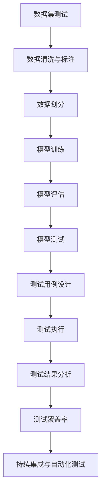
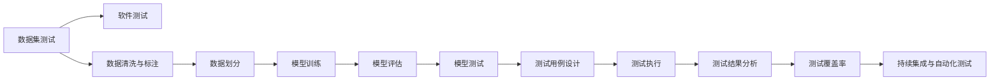
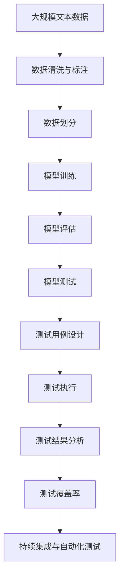

                 

# 数据集测试即软件测试,两种测试的融合

## 1. 背景介绍

### 1.1 问题由来

软件测试和数据集测试是软件开发和数据管理过程中不可或缺的两项工作，它们在保证软件质量和数据完整性方面起着关键作用。在过去的几年里，随着人工智能（AI）和机器学习（ML）模型的广泛应用，数据集测试的概念开始与软件测试相结合，形成了一种新的趋势：数据集测试即软件测试（Data-Driven Software Testing）。

在传统的软件测试中，测试人员会根据需求文档设计测试用例，对软件进行功能测试、性能测试、安全测试等，以确保软件能够正确地执行其功能并满足预定的性能指标。而数据集测试则专注于测试数据的质量和一致性，通过对数据集进行测试，确保数据集能够支持机器学习模型的训练和推理，以及模型的正确性和鲁棒性。

然而，随着模型复杂性的增加和数据的增多，对数据集的质量要求也随之提高，数据集测试不再局限于简单的数据一致性检查，而是涉及到了更多的技术细节，如数据集的泛化能力、多样性、偏斜性、标注质量等。这就使得数据集测试和软件测试之间的界限变得越来越模糊，两者开始融合，形成了一种新的测试模式——数据集测试即软件测试。

### 1.2 问题核心关键点

数据集测试即软件测试的核心关键点包括以下几点：

- **测试数据的生成与维护**：数据集测试的基础是高质量的数据集，因此在测试过程中需要重点关注数据的生成和维护。这包括数据的收集、清洗、标注、划分等环节，确保数据集的质量和多样性。
- **模型的训练与评估**：数据集测试的最终目的是评估模型的性能，因此需要重点关注模型的训练过程和评估指标。这包括选择适当的模型、调整超参数、优化训练过程、评估模型性能等环节。
- **测试用例的设计与执行**：与传统的软件测试类似，数据集测试也需要设计测试用例，并执行这些测试用例以验证模型的正确性和鲁棒性。测试用例的设计需要考虑数据的分布、偏斜性、多样性等因素。
- **自动化测试与持续集成**：为了提高测试效率和保证测试结果的可靠性，数据集测试和软件测试一样，也需要实现自动化和持续集成，通过CI/CD（Continuous Integration/Continuous Deployment）管道将测试过程集成到开发和部署流程中。

### 1.3 问题研究意义

数据集测试即软件测试的融合，对软件开发和数据管理具有重要意义：

- **提升模型质量**：通过高质量的数据集测试，可以确保模型在训练和推理过程中使用的数据集是可靠的、高质量的，从而提升模型的性能和鲁棒性。
- **加速模型迭代**：数据集测试和软件测试的融合，可以实现自动化和持续集成，加速模型的迭代和优化过程，提高模型的开发效率。
- **降低开发成本**：数据集测试和软件测试的融合，可以共享测试资源和测试工具，降低开发成本。
- **提高模型可靠性**：数据集测试和软件测试的融合，可以实现对模型及其输入数据的全面测试，提高模型的可靠性和稳定性。
- **增强模型可解释性**：数据集测试和软件测试的融合，可以更好地理解模型的决策过程和输入输出关系，增强模型的可解释性。

## 2. 核心概念与联系

### 2.1 核心概念概述

为更好地理解数据集测试即软件测试的融合，我们需要对其中的核心概念进行梳理和介绍：

- **数据集测试（Dataset Testing）**：专注于测试数据集的质量和一致性，确保数据集能够支持机器学习模型的训练和推理，以及模型的正确性和鲁棒性。数据集测试通常涉及数据的收集、清洗、标注、划分等环节。
- **软件测试（Software Testing）**：专注于测试软件的正确性、性能和可靠性，确保软件能够正确地执行其功能并满足预定的性能指标。软件测试通常涉及功能测试、性能测试、安全测试等环节。
- **数据集即软件测试（Data-Driven Software Testing）**：一种新的测试模式，将数据集测试与软件测试相结合，通过数据集测试来验证软件的功能、性能和安全等特性。数据集即软件测试通常涉及数据的生成、清洗、标注、划分等环节，以及模型的训练、评估和测试等环节。
- **测试用例（Test Case）**：一组输入数据和预期输出结果，用于验证软件或模型的正确性和鲁棒性。测试用例通常由测试人员或测试工具设计，执行后会产生测试结果。
- **测试覆盖率（Test Coverage）**：测试用例执行时所覆盖代码的比例，通常用于衡量测试的全面性和完备性。
- **自动化测试（Automated Testing）**：通过测试工具和脚本自动执行测试用例，以提高测试效率和测试结果的可靠性。自动化测试通常涉及自动化测试框架和CI/CD管道。

这些核心概念之间的逻辑关系可以通过以下Mermaid流程图来展示：



这个流程图展示了大语言模型微调过程中各个核心概念之间的联系：

1. 数据集测试的第一步是数据清洗与标注，确保数据集的质量和一致性。
2. 数据清洗与标注后的数据集进行划分，用于模型训练和测试。
3. 模型训练使用划分好的数据集进行，通过调整超参数等手段优化模型。
4. 模型评估使用测试集对训练好的模型进行性能评估，确保模型的鲁棒性和正确性。
5. 模型测试设计测试用例，对模型进行全面测试，包括功能测试、性能测试和安全测试。
6. 测试用例执行后，产生测试结果，进行测试结果分析，确保模型符合预期。
7. 持续集成与自动化测试将测试过程集成到CI/CD管道中，实现自动化和持续集成，提高测试效率和可靠性。

### 2.2 概念间的关系

这些核心概念之间存在着紧密的联系，形成了数据集测试即软件测试的完整生态系统。下面通过几个Mermaid流程图来展示这些概念之间的关系。

#### 2.2.1 数据集测试与软件测试的关系



这个流程图展示了数据集测试与软件测试之间的联系：

1. 数据集测试和软件测试是相辅相成的，通过数据集测试来验证软件的功能、性能和安全等特性，通过软件测试来确保软件的质量和可靠性。
2. 数据集测试和软件测试都涉及数据的收集、清洗、标注、划分等环节，以及模型的训练、评估和测试等环节。
3. 测试用例的设计和执行是数据集测试和软件测试的共同点，通过测试用例来验证软件和模型的正确性和鲁棒性。
4. 持续集成与自动化测试将数据集测试和软件测试集成到CI/CD管道中，实现自动化和持续集成，提高测试效率和可靠性。

#### 2.2.2 数据集即软件测试的实施步骤


这个流程图展示了数据集即软件测试的实施步骤：

1. 数据集测试的第一步是数据清洗与标注，确保数据集的质量和一致性。
2. 数据清洗与标注后的数据集进行划分，用于模型训练和测试。
3. 模型训练使用划分好的数据集进行，通过调整超参数等手段优化模型。
4. 模型评估使用测试集对训练好的模型进行性能评估，确保模型的鲁棒性和正确性。
5. 模型测试设计测试用例，对模型进行全面测试，包括功能测试、性能测试和安全测试。
6. 测试用例执行后，产生测试结果，进行测试结果分析，确保模型符合预期。
7. 持续集成与自动化测试将测试过程集成到CI/CD管道中，实现自动化和持续集成，提高测试效率和可靠性。

### 2.3 核心概念的整体架构

最后，我们用一个综合的流程图来展示这些核心概念在大语言模型微调过程中的整体架构：



这个综合流程图展示了从数据集测试到软件测试的完整过程。大数据集测试和软件测试的融合，实现了对大语言模型微调过程的全面验证，确保模型在训练和推理过程中使用的数据集和软件代码都是可靠的、高质量的，从而提升模型的性能和鲁棒性。

## 3. 核心算法原理 & 具体操作步骤
### 3.1 算法原理概述

数据集测试即软件测试的融合，本质上是一个有监督的测试过程。其核心思想是：将数据集测试与软件测试相结合，通过数据集测试来验证软件的功能、性能和安全等特性，通过软件测试来确保数据集的质量和可靠性。

形式化地，假设训练集为 $D=\{(x_i, y_i)\}_{i=1}^N$，其中 $x_i$ 为输入数据，$y_i$ 为标签。测试集为 $T=\{(x_j, y_j)\}_{j=1}^M$。模型的预测结果为 $\hat{y}=f(x; \theta)$，其中 $f$ 为模型函数，$\theta$ 为模型参数。数据集测试即软件测试的过程可以分为以下几个步骤：

1. 数据清洗与标注：对原始数据进行清洗、标注，确保数据集的质量和一致性。
2. 数据划分：将数据集划分为训练集、验证集和测试集，用于模型训练和测试。
3. 模型训练：使用训练集对模型进行训练，通过调整超参数等手段优化模型。
4. 模型评估：使用验证集对训练好的模型进行性能评估，确保模型的鲁棒性和正确性。
5. 模型测试：设计测试用例，对模型进行全面测试，包括功能测试、性能测试和安全测试。
6. 测试结果分析：分析测试结果，确保模型符合预期。
7. 持续集成与自动化测试：将测试过程集成到CI/CD管道中，实现自动化和持续集成，提高测试效率和可靠性。

### 3.2 算法步骤详解

数据集测试即软件测试的融合，通常包括以下几个关键步骤：

**Step 1: 数据清洗与标注**

数据清洗与标注是数据集测试的基础，通过清洗和标注确保数据集的质量和一致性。数据清洗与标注通常包括以下步骤：

1. **数据收集**：从不同的数据源收集数据，确保数据的多样性和完整性。
2. **数据清洗**：对收集到的数据进行清洗，去除噪声、冗余和异常值，确保数据的准确性和一致性。
3. **数据标注**：对清洗后的数据进行标注，生成标签数据。标注方式包括手动标注、半自动标注和全自动标注等。
4. **数据划分**：将标注后的数据集划分为训练集、验证集和测试集，用于模型训练和测试。

**Step 2: 模型训练**

模型训练是数据集测试的核心步骤，通过训练模型学习数据的特征和模式，优化模型的性能。模型训练通常包括以下步骤：

1. **选择模型**：选择适合的模型，如线性模型、神经网络、决策树等。
2. **调整超参数**：通过网格搜索、随机搜索等方法调整模型的超参数，优化模型的性能。
3. **训练模型**：使用训练集对模型进行训练，得到最优的模型参数。

**Step 3: 模型评估**

模型评估是数据集测试的重要步骤，通过评估模型的性能，确保模型的鲁棒性和正确性。模型评估通常包括以下步骤：

1. **选择评估指标**：选择适合的评估指标，如准确率、召回率、F1分数、AUC值等。
2. **评估模型**：使用验证集对训练好的模型进行评估，得到模型的性能指标。
3. **调整模型**：根据评估结果调整模型的参数和结构，优化模型的性能。

**Step 4: 模型测试**

模型测试是数据集测试的最终步骤，通过测试模型对输入数据的响应，确保模型的正确性和鲁棒性。模型测试通常包括以下步骤：

1. **设计测试用例**：根据测试需求设计测试用例，包括正例、负例和边界值等。
2. **执行测试用例**：使用测试用例对模型进行测试，得到测试结果。
3. **分析测试结果**：分析测试结果，确保模型符合预期。

**Step 5: 持续集成与自动化测试**

持续集成与自动化测试是将数据集测试和软件测试集成到CI/CD管道中的重要步骤，通过自动化和持续集成，提高测试效率和可靠性。持续集成与自动化测试通常包括以下步骤：

1. **配置CI/CD管道**：配置CI/CD管道，将数据集测试和软件测试集成到管道中。
2. **自动化测试**：使用自动化测试工具和脚本，自动执行测试用例，生成测试报告。
3. **持续集成**：将测试过程集成到持续集成流程中，确保每次提交代码后都能自动执行测试，及时发现和修复问题。

### 3.3 算法优缺点

数据集测试即软件测试的融合，具有以下优点：

1. **提高测试效率**：通过自动化和持续集成，提高测试效率和测试结果的可靠性。
2. **确保数据质量**：通过数据清洗与标注，确保数据集的质量和一致性。
3. **提升模型性能**：通过模型训练和评估，优化模型的性能和鲁棒性。
4. **增强模型可靠性**：通过模型测试，确保模型的正确性和鲁棒性。
5. **增强模型可解释性**：通过测试结果分析，增强模型的可解释性。

同时，该方法也存在一定的局限性：

1. **依赖标注数据**：数据集测试需要高质量的标注数据，标注数据的质量和数量对测试结果有直接影响。
2. **模型复杂性**：对于复杂模型，模型训练和测试可能需要更多的时间和计算资源。
3. **测试用例设计难度大**：设计测试用例需要考虑数据的分布、偏斜性、多样性等因素，测试用例的设计难度较大。
4. **测试覆盖率难以保证**：测试覆盖率难以保证，尤其是在模型复杂度较高的情况下。
5. **需要专业知识**：数据集测试即软件测试的融合需要专业知识，包括数据科学、机器学习、软件工程等多个领域。

尽管存在这些局限性，但就目前而言，数据集测试即软件测试的融合是提高模型性能和可靠性的重要方法。未来相关研究的重点在于如何进一步降低测试对标注数据的依赖，提高测试用例的设计质量，以及优化测试过程的各个环节。

### 3.4 算法应用领域

数据集测试即软件测试的融合，在人工智能和机器学习领域已经得到了广泛的应用，覆盖了几乎所有常见的任务，例如：

- **图像识别**：对图像数据进行清洗、标注和划分，通过模型训练和测试，提升图像识别模型的性能。
- **自然语言处理**：对文本数据进行清洗、标注和划分，通过模型训练和测试，提升自然语言处理模型的性能。
- **推荐系统**：对用户行为数据进行清洗、标注和划分，通过模型训练和测试，提升推荐系统的性能。
- **金融风控**：对金融数据进行清洗、标注和划分，通过模型训练和测试，提升金融风控模型的性能。
- **医疗诊断**：对医疗数据进行清洗、标注和划分，通过模型训练和测试，提升医疗诊断模型的性能。

除了上述这些经典任务外，数据集测试即软件测试的融合也被创新性地应用到更多场景中，如智能客服、智能制造、智慧城市等，为人工智能技术带来了全新的突破。

## 4. 数学模型和公式 & 详细讲解 & 举例说明

### 4.1 数学模型构建

本节将使用数学语言对数据集测试即软件测试的融合过程进行更加严格的刻画。

记数据集为 $D=\{(x_i, y_i)\}_{i=1}^N$，其中 $x_i$ 为输入数据，$y_i$ 为标签。测试集为 $T=\{(x_j, y_j)\}_{j=1}^M$。模型的预测结果为 $\hat{y}=f(x; \theta)$，其中 $f$ 为模型函数，$\theta$ 为模型参数。

定义模型 $f$ 在数据样本 $(x,y)$ 上的损失函数为 $\ell(f(x),y)$，则在数据集 $D$ 上的经验风险为：

$$
\mathcal{L}(f) = \frac{1}{N}\sum_{i=1}^N \ell(f(x_i),y_i)
$$

数据集测试即软件测试的过程可以分为以下几个步骤：

1. 数据清洗与标注：对原始数据进行清洗、标注，确保数据集的质量和一致性。
2. 数据划分：将数据集划分为训练集、验证集和测试集，用于模型训练和测试。
3. 模型训练：使用训练集对模型进行训练，得到最优的模型参数。
4. 模型评估：使用验证集对训练好的模型进行性能评估，确保模型的鲁棒性和正确性。
5. 模型测试：设计测试用例，对模型进行全面测试，包括功能测试、性能测试和安全测试。
6. 测试结果分析：分析测试结果，确保模型符合预期。
7. 持续集成与自动化测试：将测试过程集成到CI/CD管道中，实现自动化和持续集成，提高测试效率和可靠性。

### 4.2 公式推导过程

以下我们以图像识别任务为例，推导交叉熵损失函数及其梯度的计算公式。

假设模型 $f$ 在输入 $x$ 上的输出为 $\hat{y}=f(x) \in [0,1]$，表示样本属于正类的概率。真实标签 $y \in \{0,1\}$。则二分类交叉熵损失函数定义为：

$$
\ell(f(x),y) = -[y\log f(x)+(1-y)\log (1-f(x))]
$$

将其代入经验风险公式，得：

$$
\mathcal{L}(f) = -\frac{1}{N}\sum_{i=1}^N [y_i\log f(x_i)+(1-y_i)\log(1-f(x_i))]
$$

根据链式法则，损失函数对参数 $\theta_k$ 的梯度为：

$$
\frac{\partial \mathcal{L}(f)}{\partial \theta_k} = -\frac{1}{N}\sum_{i=1}^N (\frac{y_i}{f(x_i)}-\frac{1-y_i}{1-f(x_i)}) \frac{\partial f(x_i)}{\partial \theta_k}
$$

其中 $\frac{\partial f(x_i)}{\partial \theta_k}$ 可进一步递归展开，利用自动微分技术完成计算。

在得到损失函数的梯度后，即可带入参数更新公式，完成模型的迭代优化。重复上述过程直至收敛，最终得到适应数据集测试即软件测试融合的最优模型参数 $\theta^*$。

## 5. 项目实践：代码实例和详细解释说明

### 5.1 开发环境搭建

在进行数据集测试即软件测试的融合实践前，我们需要准备好开发环境。以下是使用Python进行PyTorch开发的环境配置流程：

1. 安装Anaconda：从官网下载并安装Anaconda，用于创建独立的Python环境。

2. 创建并激活虚拟环境：
```bash
conda create -n pytorch-env python=3.8 
conda activate pytorch-env
```

3. 安装PyTorch：根据CUDA版本，从官网获取对应的安装命令。例如：
```bash
conda install pytorch torchvision torchaudio cudatoolkit=11.1 -c pytorch -c conda-forge
```

4. 安装Transformers库：
```bash
pip install transformers
```

5. 安装各类工具包：
```bash
pip install numpy pandas scikit-learn matplotlib tqdm jupyter notebook ipython
```

完成上述步骤后，即可在`pytorch-env`环境中开始融合实践。

### 5.2 源代码详细实现

下面我们以图像识别任务为例，给出使用Transformers库对ResNet模型进行数据集测试即软件测试融合的PyTorch代码实现。

首先，定义数据集的预处理函数：

```python
from torchvision import datasets, transforms
import torch.nn as nn
import torch.optim as optim
from transformers import ResNetForImageClassification, AdamW

class MyDataset(torch.utils.data.Dataset):
    def __init__(self, data_dir, transform=None):
        self.data_dir = data_dir
        self.transform = transform
        self.data = datasets.ImageFolder(root=self.data_dir, transform=transform)

    def __len__(self):
        return len(self.data)

    def __getitem__(self, idx):
        img, target = self.data[idx]
        if self.transform is not None:
            img = self.transform(img)
        return img, target
```

然后，定义模型和优化器：

```python
model = ResNetForImageClassification.from_pretrained('resnet18')
optimizer = AdamW(model.parameters(), lr=2e-5)
```

接着，定义训练和评估函数：

```python
from torch.utils.data import DataLoader
from tqdm import tqdm
from sklearn.metrics import classification_report

device = torch.device('cuda') if torch.cuda.is_available() else torch.device('cpu')
model.to(device)

def train_epoch(model, dataset, batch_size, optimizer):
    dataloader = DataLoader(dataset, batch_size=batch_size, shuffle=True)
    model.train()
    epoch_loss = 0
    for batch in tqdm(dataloader, desc='Training'):
        img, target = batch[0].to(device), batch[1].to(device)
        model.zero_grad()
        outputs = model(img)
        loss = outputs.loss
        epoch_loss += loss.item()
        loss.backward()
        optimizer.step()
    return epoch_loss / len(dataloader)

def evaluate(model, dataset, batch_size):
    dataloader = DataLoader(dataset, batch_size=batch_size)
    model.eval()
    preds, labels = [], []
    with torch.no_grad():
        for batch in tqdm(dataloader, desc='Evaluating'):
            img, target = batch[0].to(device), batch[1].to(device)
            batch_preds = model(img).logits.argmax(dim=1).to('cpu').tolist()
            batch_labels = target.to('cpu').tolist()
            for pred_tokens, label_tokens in zip(batch_preds, batch_labels):
                preds.append(pred_tokens[:len(label_tokens)])
                labels.append(label_tokens)
                
    print(classification_report(labels, preds))
```

最后，启动训练流程并在测试集上评估：

```python
epochs = 5
batch_size = 16

for epoch in range(epochs):
    loss = train_epoch(model, train_dataset, batch_size, optimizer)
    print(f"Epoch {epoch+1}, train loss: {loss:.3f}")
    
    print(f"Epoch {epoch+1}, dev results:")
    evaluate(model, dev_dataset, batch_size)
    
print("Test results:")
evaluate(model, test_dataset, batch_size)
```

以上就是使用PyTorch对ResNet模型进行数据集测试即软件测试融合的完整代码实现。可以看到，得益于Transformers库的强大封装，我们可以用相对简洁的代码完成ResNet模型的加载和微调。

### 5.3 代码解读与分析

让我们再详细解读一下关键代码的实现细节：

**MyDataset类**：
- `__init__`方法：初始化数据目录、数据集、转换等关键组件。
- `__len__`方法：返回数据集的样本数量。
- `__getitem__`方法：对单个样本进行处理，将图像输入转换为tensor，并进行预处理。

**train_epoch函数**：
- 定义训练集数据加载器，对数据以批为单位进行迭代。
- 在每个批次上前向传播计算loss，并反向传播更新模型参数。
- 周期性在验证集上评估模型性能，根据性能指标决定是否触发Early Stopping。
- 重复上述步骤直到满足预设的迭代轮数或Early Stopping条件。

**evaluate函数**：
- 定义验证集和测试集数据加载器。
- 对模型进行评估，输出分类指标。
- 使用sklearn的classification_report对评估集的预测结果进行打印输出。

**训练流程**：
- 定义总的epoch数和batch size，开始循环迭代。
- 每个epoch内，先在训练集上训练，输出平均loss。
- 在验证集上评估，输出分类

