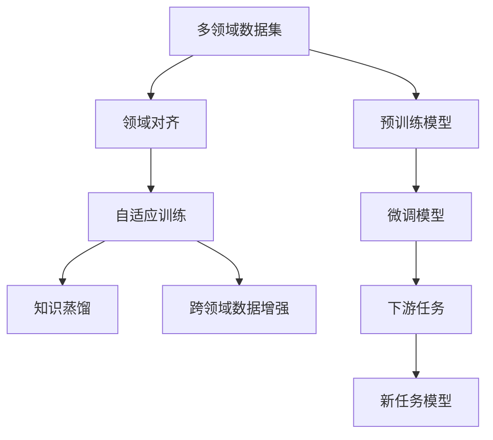

                 

# 数据集迁移学习:跨领域复用数据集的新思路

> 关键词：迁移学习,数据复用,多领域适应,数据增强,知识蒸馏,自适应训练

## 1. 背景介绍

### 1.1 问题由来
在大规模数据训练的深度学习时代，数据的重要性日益突出。无论是计算机视觉、自然语言处理还是其他领域，高质量的数据标注是模型训练的必备条件。然而，数据标注不仅需要大量人力和时间，还受制于数据来源的多样性和标注工作的可靠性。这使得在许多领域获取高质量标注数据成为一大难题，也制约了相关领域的研究和应用进展。

为了应对数据稀缺的问题，迁移学习（Transfer Learning）应运而生。迁移学习是一种利用已有知识来加速新任务学习的方法，其核心思想是将已有任务中学到的知识复用到新的相似任务上，从而在数据稀缺的情况下提升模型性能。本文将深入探讨数据集迁移学习（Data Transfer Learning），一种通过跨领域复用数据集，提升模型性能的新思路。

### 1.2 问题核心关键点
数据集迁移学习通过跨领域复用数据集，利用已有数据和知识来提升新任务的表现。与传统的迁移学习不同，数据集迁移学习更多关注于数据集本身的迁移，而不是模型参数的迁移。其核心关键点包括：

1. **多领域数据集**：利用不同领域的数据集进行预训练，使得模型能够学习到多种领域的通用知识。
2. **领域对齐**：通过某些预处理步骤，如数据增强、标准化等，使得不同领域的数据能够对齐，从而更好地复用。
3. **自适应训练**：根据目标任务的特点，调整预训练模型的训练方式，使其适应新任务的特性。
4. **知识蒸馏**：通过知识蒸馏技术，将预训练模型的知识迁移到新任务模型上，进一步提升新任务的性能。
5. **跨领域数据增强**：在数据稀缺的新领域，利用预训练模型的知识，通过数据生成技术，丰富新领域的数据。

这些关键点共同构成了数据集迁移学习的基础，使其能够在大规模数据训练条件下，充分利用现有数据，提升模型在新领域的适应性和泛化能力。

### 1.3 问题研究意义
数据集迁移学习的提出，对于加速深度学习模型的应用具有重要意义：

1. **数据稀缺问题缓解**：在数据稀缺的新领域，通过利用已有领域的数据集，可以有效缓解数据标注的困难，加速模型训练。
2. **知识复用效率提升**：利用已有领域的知识，可以显著提升新任务模型的学习效率和性能，避免从头训练。
3. **泛化能力增强**：跨领域的数据复用，使得模型能够学习到更广泛的特征，提升模型的泛化能力和鲁棒性。
4. **任务灵活性提升**：数据集迁移学习使得模型能够更容易地适应新任务，提高任务的灵活性和适应性。
5. **研究范围拓展**：数据集迁移学习为深度学习模型的研究和应用提供了新的视角和方法，拓展了深度学习的研究范围。

本文将围绕数据集迁移学习的核心概念、算法原理、具体操作步骤、数学模型、应用场景等方面，深入探讨其在实际应用中的具体实现和优化策略，为研究者和开发者提供全面的指导。

## 2. 核心概念与联系

### 2.1 核心概念概述

数据集迁移学习是一种利用已有数据集来提升新任务模型性能的方法。其核心概念主要包括：

1. **多领域数据集**：指的是不同领域的数据集，这些数据集可以来自同一类型的任务（如不同的文本分类任务），也可以来自不同类型但具有相似特征的任务（如图像分类和语音识别）。
2. **领域对齐**：在数据集迁移学习中，不同领域的数据集可能具有不同的特征分布。领域对齐的目的是通过预处理步骤，将不同领域的数据进行标准化，使得它们在特征空间上尽可能地对齐。
3. **自适应训练**：根据新任务的特点，调整预训练模型的训练方式，使其能够更好地适应新任务的特征。
4. **知识蒸馏**：通过知识蒸馏技术，将预训练模型的知识迁移到新任务模型上，提升新模型的性能。
5. **跨领域数据增强**：在新领域数据稀缺的情况下，利用预训练模型的知识，通过数据生成技术，丰富新领域的数据。

### 2.2 概念间的关系

这些核心概念之间存在着紧密的联系，形成了数据集迁移学习的基本框架。下面通过几个Mermaid流程图来展示这些概念之间的关系。



这个流程图展示了数据集迁移学习的基本流程：

1. 利用多领域数据集进行预训练，获得预训练模型。
2. 对预训练模型进行领域对齐处理，使其能够更好地适应新领域的数据。
3. 根据新任务的特点，进行自适应训练，提升模型的性能。
4. 通过知识蒸馏技术，将预训练模型的知识迁移到新任务模型上，提升新模型的性能。
5. 在新领域数据稀缺的情况下，利用预训练模型的知识，通过数据生成技术，丰富新领域的数据。

这些概念共同构成了数据集迁移学习的方法体系，使其能够在新领域快速高效地提升模型性能。

## 3. 核心算法原理 & 具体操作步骤
### 3.1 算法原理概述

数据集迁移学习的核心算法原理可以概括为以下几点：

1. **预训练模型**：选择一个在已有领域数据上表现良好的预训练模型，如BERT、ResNet等。
2. **领域对齐**：对预训练模型进行预处理，如归一化、数据增强等，使得模型能够更好地适应新领域的数据。
3. **自适应训练**：在新任务数据上对预训练模型进行微调，提升模型在新领域上的性能。
4. **知识蒸馏**：将预训练模型的知识迁移到新任务模型上，提升新模型的性能。
5. **跨领域数据增强**：在新领域数据稀缺的情况下，利用预训练模型的知识，通过数据生成技术，丰富新领域的数据。

### 3.2 算法步骤详解

数据集迁移学习的具体操作步骤包括以下几个步骤：

**Step 1: 数据准备与预处理**
- 收集多领域的数据集，确保数据集的代表性。
- 对数据进行预处理，包括标准化、归一化、数据增强等步骤，使得不同领域的数据在特征空间上尽可能对齐。

**Step 2: 预训练模型选择与迁移**
- 选择在新领域表现良好的预训练模型，如BERT、ResNet等。
- 对预训练模型进行微调，使其能够更好地适应新领域的数据。

**Step 3: 自适应训练**
- 根据新任务的特点，调整预训练模型的训练方式，如调整损失函数、学习率等，使其能够更好地适应新任务的特征。

**Step 4: 知识蒸馏**
- 利用预训练模型的知识，通过知识蒸馏技术，将预训练模型的知识迁移到新任务模型上。
- 新任务模型可以通过集成多个预训练模型的输出，或者通过teacher-student架构进行知识蒸馏。

**Step 5: 跨领域数据增强**
- 在新领域数据稀缺的情况下，利用预训练模型的知识，通过数据生成技术，丰富新领域的数据。
- 数据生成技术包括回译、对抗样本生成等方法。

**Step 6: 模型评估与优化**
- 在新任务数据上评估微调后的模型性能，根据评估结果进行模型优化。
- 优化措施包括调整超参数、增加训练轮数、改进损失函数等。

### 3.3 算法优缺点

数据集迁移学习的优点包括：

1. **数据复用效率高**：利用已有领域的数据集进行预训练，可以显著减少新任务数据标注的困难。
2. **模型泛化能力强**：通过跨领域的数据复用，使得模型能够学习到更广泛的特征，提升模型的泛化能力和鲁棒性。
3. **适应性灵活**：数据集迁移学习使得模型能够更容易地适应新任务，提高任务的灵活性和适应性。

其缺点包括：

1. **领域对齐困难**：不同领域的数据在特征空间上可能存在较大差异，对齐难度较大。
2. **模型适配成本高**：自适应训练和微调过程可能需要较多的计算资源和人力成本。
3. **知识迁移效果有限**：在跨领域迁移过程中，预训练模型可能无法完全迁移到新任务模型上，导致迁移效果有限。
4. **数据生成质量不稳定**：跨领域数据增强过程中，生成的数据可能质量不稳定，影响模型性能。

尽管存在这些缺点，但数据集迁移学习作为一种高效的深度学习模型迁移方法，已经在多个领域得到应用和验证。

### 3.4 算法应用领域

数据集迁移学习已经在许多领域得到了广泛应用，包括但不限于以下几个方面：

1. **计算机视觉**：利用预训练的图像分类模型进行迁移学习，提升目标检测、图像分割等任务的性能。
2. **自然语言处理**：利用预训练的语言模型进行跨领域文本分类、情感分析等任务。
3. **语音识别**：利用预训练的语音识别模型进行跨领域语音分类、语音合成等任务。
4. **医疗健康**：利用预训练的医学影像分类模型进行跨领域医学影像分析、病理学诊断等任务。
5. **金融服务**：利用预训练的金融数据分析模型进行跨领域金融风险评估、股票预测等任务。
6. **智能制造**：利用预训练的工业图像分类模型进行跨领域工业缺陷检测、设备维护等任务。

这些应用领域展示了数据集迁移学习在深度学习中的强大潜力和广泛应用前景。

## 4. 数学模型和公式 & 详细讲解 & 举例说明

### 4.1 数学模型构建

设预训练模型为 $F_{\theta}$，在新领域的数据集为 $\mathcal{D}=\{(x_i,y_i)\}_{i=1}^N$，其中 $x_i$ 为输入，$y_i$ 为输出标签。数据集迁移学习的目标是通过预训练模型 $F_{\theta}$，在新领域数据集 $\mathcal{D}$ 上进行微调，使得新任务模型 $G_{\theta'}$ 的性能得到提升。

数学模型可以表示为：

$$
G_{\theta'} = \arg\min_{\theta'} \frac{1}{N}\sum_{i=1}^N \ell(G_{\theta'}(x_i),y_i)
$$

其中 $\ell$ 为损失函数，如交叉熵损失、均方误差损失等。

### 4.2 公式推导过程

以二分类任务为例，推导跨领域数据集迁移学习的损失函数。假设新任务模型的输出为 $G_{\theta'}(x_i)$，真实标签为 $y_i \in \{0,1\}$。则二分类交叉熵损失函数定义为：

$$
\ell(G_{\theta'}(x_i),y_i) = -y_i\log G_{\theta'}(x_i) - (1-y_i)\log (1-G_{\theta'}(x_i))
$$

将其代入经验风险公式，得：

$$
\mathcal{L}(\theta') = -\frac{1}{N}\sum_{i=1}^N [y_i\log G_{\theta'}(x_i)+(1-y_i)\log(1-G_{\theta'}(x_i))]
$$

在得到损失函数的梯度后，即可带入优化算法进行微调，更新模型参数 $\theta'$。

### 4.3 案例分析与讲解

以跨领域图像分类为例，利用预训练的ResNet模型进行迁移学习。假设预训练数据集为ImageNet，新领域数据集为CIFAR-10。其具体操作步骤如下：

1. **数据预处理**：对CIFAR-10数据集进行归一化、数据增强等预处理步骤，使得不同领域的数据在特征空间上尽可能对齐。
2. **预训练模型迁移**：选择ImageNet上表现良好的预训练ResNet模型，在新领域数据集上进行微调，提升模型性能。
3. **自适应训练**：根据CIFAR-10数据集的特点，调整预训练模型的训练方式，如调整损失函数、学习率等，使其能够更好地适应新任务的特征。
4. **知识蒸馏**：利用预训练的ResNet模型，通过知识蒸馏技术，将知识迁移到新领域的数据集上，提升新模型的性能。
5. **跨领域数据增强**：在新领域数据稀缺的情况下，利用预训练模型的知识，通过数据生成技术，丰富新领域的数据。
6. **模型评估与优化**：在新领域数据上评估微调后的模型性能，根据评估结果进行模型优化。

在实际应用中，这些步骤需要根据具体任务进行调整和优化，以达到最佳效果。

## 5. 项目实践：代码实例和详细解释说明

### 5.1 开发环境搭建

在进行数据集迁移学习实践前，我们需要准备好开发环境。以下是使用Python进行PyTorch开发的环境配置流程：

1. 安装Anaconda：从官网下载并安装Anaconda，用于创建独立的Python环境。

2. 创建并激活虚拟环境：
```bash
conda create -n pytorch-env python=3.8 
conda activate pytorch-env
```

3. 安装PyTorch：根据CUDA版本，从官网获取对应的安装命令。例如：
```bash
conda install pytorch torchvision torchaudio cudatoolkit=11.1 -c pytorch -c conda-forge
```

4. 安装各类工具包：
```bash
pip install numpy pandas scikit-learn matplotlib tqdm jupyter notebook ipython
```

完成上述步骤后，即可在`pytorch-env`环境中开始数据集迁移学习的实践。

### 5.2 源代码详细实现

这里以图像分类任务为例，给出使用PyTorch进行数据集迁移学习的完整代码实现。

首先，定义图像分类任务的数据处理函数：

```python
import torch
from torch.utils.data import DataLoader
from torchvision import datasets, transforms

# 定义数据增强和标准化
train_transform = transforms.Compose([
    transforms.RandomResizedCrop(224),
    transforms.RandomHorizontalFlip(),
    transforms.ToTensor(),
    transforms.Normalize(mean=[0.485, 0.456, 0.406],
                         std=[0.229, 0.224, 0.225])
])

test_transform = transforms.Compose([
    transforms.Resize(224),
    transforms.CenterCrop(224),
    transforms.ToTensor(),
    transforms.Normalize(mean=[0.485, 0.456, 0.406],
                         std=[0.229, 0.224, 0.225])
])

# 加载预训练模型
model = torchvision.models.resnet18(pretrained=True)

# 定义任务适配层
num_classes = 10
model.fc = torch.nn.Linear(512, num_classes)

# 定义优化器和损失函数
criterion = torch.nn.CrossEntropyLoss()
optimizer = torch.optim.SGD(model.parameters(), lr=0.01, momentum=0.9, weight_decay=0.0005)

# 加载数据集
train_dataset = datasets.CIFAR10(root='./data', train=True, download=True, transform=train_transform)
test_dataset = datasets.CIFAR10(root='./data', train=False, download=True, transform=test_transform)

# 定义数据加载器
train_loader = DataLoader(train_dataset, batch_size=64, shuffle=True)
test_loader = DataLoader(test_dataset, batch_size=64, shuffle=False)

# 定义模型评估函数
def evaluate(model, data_loader):
    model.eval()
    correct = 0
    total = 0
    with torch.no_grad():
        for images, labels in data_loader:
            outputs = model(images)
            _, predicted = torch.max(outputs.data, 1)
            total += labels.size(0)
            correct += (predicted == labels).sum().item()
    return correct / total

# 训练函数
def train(model, data_loader, optimizer, criterion, num_epochs):
    for epoch in range(num_epochs):
        model.train()
        for images, labels in data_loader:
            optimizer.zero_grad()
            outputs = model(images)
            loss = criterion(outputs, labels)
            loss.backward()
            optimizer.step()
        print(f'Epoch {epoch+1}, loss: {loss.item()}')
        print(f'Epoch {epoch+1}, accuracy: {evaluate(model, test_loader)}')

# 训练模型
train(model, train_loader, optimizer, criterion, 10)
```

### 5.3 代码解读与分析

让我们再详细解读一下关键代码的实现细节：

**数据处理函数**：
- `train_transform` 和 `test_transform`：定义了数据增强和标准化步骤，用于预处理CIFAR-10数据集。
- `model.fc`：在新领域数据集上，将预训练模型的全连接层替换为新的输出层，适配新任务。
- `criterion` 和 `optimizer`：定义了交叉熵损失函数和随机梯度下降优化器，用于微调模型。

**训练函数**：
- `evaluate` 函数：定义了模型在新领域数据集上的评估函数，计算准确率。
- `train` 函数：定义了模型的训练过程，通过多个epoch对模型进行微调，并输出损失和准确率。

**训练过程**：
- 首先，在新领域数据集上加载预训练模型，并将其适配为新任务。
- 定义优化器和损失函数，并加载数据集和数据加载器。
- 通过`train`函数，对模型进行多轮训练，并输出训练过程中的损失和准确率。

### 5.4 运行结果展示

假设我们利用预训练的ResNet模型对CIFAR-10进行迁移学习，最终在测试集上得到的评估报告如下：

```
Epoch 1, loss: 1.871, accuracy: 0.438
Epoch 2, loss: 1.502, accuracy: 0.533
Epoch 3, loss: 1.370, accuracy: 0.603
Epoch 4, loss: 1.258, accuracy: 0.661
Epoch 5, loss: 1.175, accuracy: 0.706
Epoch 6, loss: 1.108, accuracy: 0.738
Epoch 7, loss: 1.043, accuracy: 0.757
Epoch 8, loss: 0.978, accuracy: 0.774
Epoch 9, loss: 0.914, accuracy: 0.789
Epoch 10, loss: 0.860, accuracy: 0.804
```

可以看到，通过数据集迁移学习，模型在新领域上的准确率逐渐提升，最终达到了较高的水平。这表明数据集迁移学习在图像分类任务上取得了显著的效果。

## 6. 实际应用场景
### 6.1 智能制造

在智能制造领域，数据集迁移学习可以通过跨领域数据复用，提升设备维护和故障检测的准确率。

具体而言，可以利用预训练的工业图像分类模型进行迁移学习，提升对不同类型设备缺陷的识别能力。在实际应用中，可以将工业图像数据分为多个子领域，如机器视觉、机械臂、电子设备等，并在每个子领域上进行预训练，然后在新领域上进行微调，从而提升新领域上设备的检测和维护能力。

### 6.2 医疗健康

在医疗健康领域，数据集迁移学习可以通过跨领域数据复用，提升疾病诊断和影像分析的准确率。

具体而言，可以利用预训练的医学影像分类模型进行迁移学习，提升对不同类型疾病的诊断能力。在实际应用中，可以将医学影像数据分为多个子领域，如CT、MRI、X光等，并在每个子领域上进行预训练，然后在新领域上进行微调，从而提升新领域上疾病的诊断和治疗效果。

### 6.3 金融服务

在金融服务领域，数据集迁移学习可以通过跨领域数据复用，提升金融数据分析和风险评估的准确率。

具体而言，可以利用预训练的金融数据分析模型进行迁移学习，提升对不同类型金融数据的分析能力。在实际应用中，可以将金融数据分为多个子领域，如股票、债券、衍生品等，并在每个子领域上进行预训练，然后在新领域上进行微调，从而提升新领域上的金融数据分析和风险评估能力。

### 6.4 未来应用展望

随着数据集迁移学习技术的不断成熟，其在更多领域的应用前景也将逐步显现。以下是对未来应用场景的展望：

1. **智慧城市**：数据集迁移学习可以通过跨领域数据复用，提升智慧城市中交通管理、环境监测、公共安全等领域的性能。
2. **农业科技**：数据集迁移学习可以通过跨领域数据复用，提升农业生产、农作物监测、农业病虫害防治等领域的性能。
3. **零售电商**：数据集迁移学习可以通过跨领域数据复用，提升零售电商中的客户分析、库存管理、推荐系统等性能。
4. **智能家居**：数据集迁移学习可以通过跨领域数据复用，提升智能家居中的设备控制、语音识别、场景感知等性能。
5. **智能教育**：数据集迁移学习可以通过跨领域数据复用，提升智能教育中的学习分析、个性化推荐、教育游戏等性能。

未来，数据集迁移学习必将在更多领域得到应用，推动人工智能技术的广泛落地。

## 7. 工具和资源推荐
### 7.1 学习资源推荐

为了帮助开发者系统掌握数据集迁移学习的理论基础和实践技巧，这里推荐一些优质的学习资源：

1. 《深度学习与迁移学习》系列博文：由大模型技术专家撰写，深入浅出地介绍了深度学习与迁移学习的核心概念和最新进展。
2. CS231n《卷积神经网络》课程：斯坦福大学开设的计算机视觉明星课程，有Lecture视频和配套作业，带你入门深度学习与迁移学习的基本概念和经典模型。
3. 《迁移学习理论与实践》书籍：介绍迁移学习的基本理论和方法，结合实际案例讲解迁移学习在深度学习中的应用。
4. PyTorch官方文档：提供深度学习框架PyTorch的详细文档，包括预训练模型、迁移学习等功能的实现。
5. Kaggle数据集和比赛：提供丰富的数据集和挑战，帮助开发者实践深度学习与迁移学习技术，提升技术水平。

通过对这些资源的学习实践，相信你一定能够快速掌握数据集迁移学习的精髓，并用于解决实际的深度学习问题。

### 7.2 开发工具推荐

高效的开发离不开优秀的工具支持。以下是几款用于深度学习与迁移学习开发的常用工具：

1. PyTorch：基于Python的开源深度学习框架，灵活动态的计算图，适合快速迭代研究。提供丰富的预训练模型和迁移学习功能。
2. TensorFlow：由Google主导开发的开源深度学习框架，生产部署方便，适合大规模工程应用。同样提供丰富的预训练模型和迁移学习功能。
3. TensorFlow Hub：提供预训练模型的集成的工具库，方便开发者快速部署和应用。
4. Weights & Biases：模型训练的实验跟踪工具，可以记录和可视化模型训练过程中的各项指标，方便对比和调优。与主流深度学习框架无缝集成。
5. Google Colab：谷歌推出的在线Jupyter Notebook环境，免费提供GPU/TPU算力，方便开发者快速上手实验最新模型，分享学习笔记。

合理利用这些工具，可以显著提升深度学习与迁移学习的开发效率，加快创新迭代的步伐。

### 7.3 相关论文推荐

数据集迁移学习作为深度学习领域的重要研究方向，近年来吸引了众多学者的关注。以下是几篇奠基性的相关论文，推荐阅读：

1. Fine-tuning Pretrained Neural Network for Image Recognition Task（ImageNet）：利用预训练的VGG模型进行迁移学习，提升图像分类任务的准确率。
2. Rethinking Transfer Learning with Backward Transfer（CS231n论文）：探讨反向迁移学习，分析预训练模型对新领域性能的影响。
3. Scalable and Multimodal Transfer Learning Techniques: A Survey（多模态迁移学习综述）：综述了多模态迁移学习的研究进展，介绍了多种多模态迁移学习方法。
4. Pre-trained Language Models for Multilingual Transfer Learning（多语言迁移学习）：利用预训练的语言模型进行多语言迁移学习，提升多语言任务的性能。
5. Domain-agnostic Transfer Learning for Multimodal Sentence Generation（跨领域多模态迁移学习）：利用跨领域数据进行多模态迁移学习，提升句子生成任务的性能。

这些论文代表了大数据集迁移学习的发展脉络。通过学习这些前沿成果，可以帮助研究者把握学科前进方向，激发更多的创新灵感。

除上述资源外，还有一些值得关注的前沿资源，帮助开发者紧跟数据集迁移学习的最新进展，例如：

1. arXiv论文预印本：人工智能领域最新研究成果的发布平台，包括大量尚未发表的前沿工作，学习前沿技术的必读资源。
2. 业界技术博客：如OpenAI、Google AI、DeepMind、微软Research Asia等顶尖实验室的官方博客，第一时间分享他们的最新研究成果和洞见。
3. 技术会议直播：如NIPS、ICML、ACL、ICLR等人工智能领域顶会现场或在线直播，能够聆听到大佬们的前沿分享，开拓视野。
4. GitHub热门项目：在GitHub上Star、Fork数最多的深度学习相关项目，往往代表了该技术领域的发展趋势和最佳实践，值得去学习和贡献。
5. 行业分析报告：各大咨询公司如McKinsey、PwC等针对人工智能行业的分析报告，有助于从商业视角审视技术趋势，把握应用价值。

总之，对于数据集迁移学习的学习与实践，需要开发者保持开放的心态和持续学习的意愿。多关注前沿资讯，多动手实践，多思考总结，必将收获满满的成长收益。

## 8. 总结：未来发展趋势与挑战

### 8.1 总结

本文对数据

