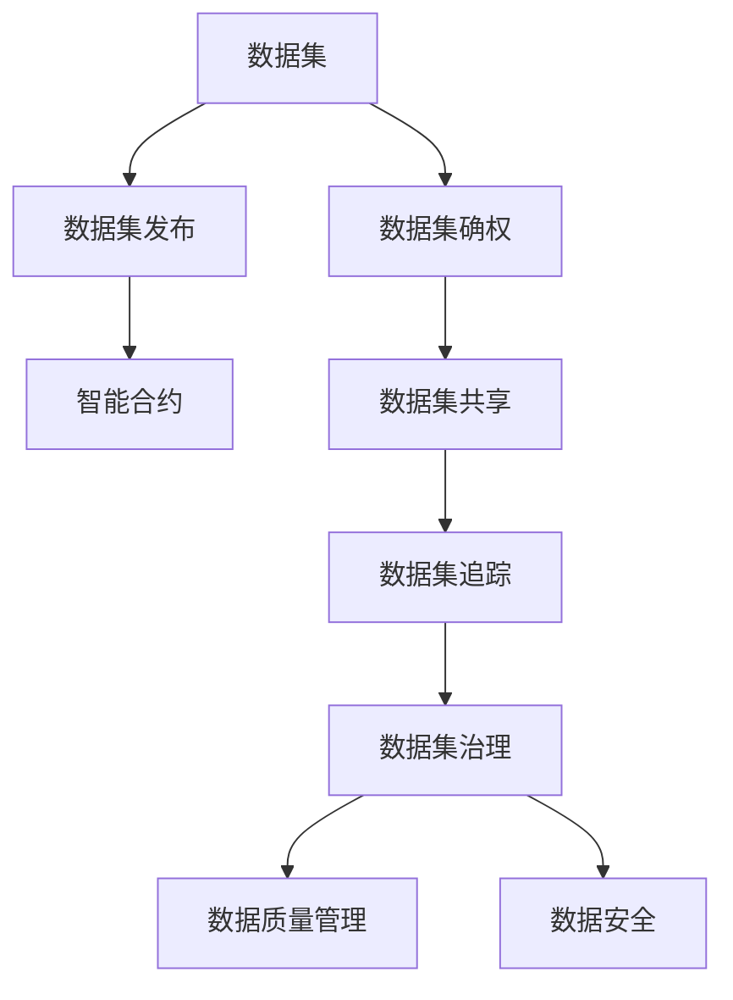
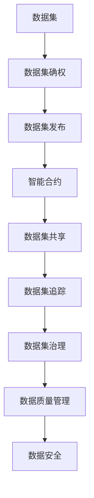
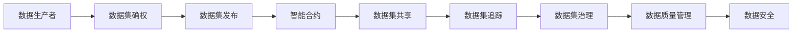
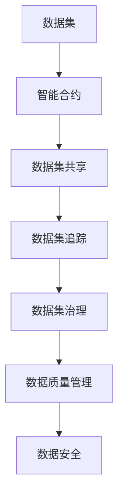

                 

# 数据集链:用区块链保障数据可信流通

> 关键词：数据集链, 数据可信流通, 区块链技术, 智能合约, 数据质量, 数据治理, 数据确权

## 1. 背景介绍

### 1.1 问题由来
在现代社会，数据成为了最重要的资产之一，蕴含着巨大的价值。无论是学术研究、商业决策、还是政府管理，都依赖于大量的数据支持。然而，数据的质量和安全性问题也日益突出，尤其是数据流通环节。数据在使用过程中往往面临数据泄露、数据篡改、数据归属不清等风险，严重影响了数据的价值和使用效果。

数据可信流通指的是在数据生产、存储、流通、应用等环节中，确保数据源真实可靠、数据传输安全、数据使用规范、数据治理透明，保障数据的完整性、一致性和可用性。在当前数据量激增、数据类型多样的背景下，数据集链（DataChain）成为保障数据可信流通的重要手段。

数据集链基于区块链技术，利用其去中心化、分布式、不可篡改等特性，在数据收集、数据存储、数据共享、数据使用等各个环节建立信任机制，确保数据的可信流通。本文将详细介绍数据集链的基本原理、实现方法、应用场景及其未来发展趋势。

### 1.2 问题核心关键点
数据集链的核心思想是利用区块链技术对数据集进行链上验证、确权和治理，确保数据的真实性、完整性和不可篡改性。具体来说，数据集链包含以下关键点：

- **数据集确权**：确定数据集的归属权，包括所有者和数据使用者的权利和责任。
- **数据集发布**：通过智能合约，将数据集发布到链上，并进行验证。
- **数据集共享**：数据集发布者可以将数据集共享给特定的用户或群体，通过访问控制技术保障数据安全。
- **数据集追踪**：利用区块链的透明性和可追溯性，对数据集的使用、复制和传输进行全程追踪。
- **数据集治理**：通过智能合约，对数据集的使用、存储、复制等进行规范和管理，保障数据质量和使用合规性。

### 1.3 问题研究意义
数据集链作为区块链技术在数据治理和数据质量管理中的应用，具有重要的研究和应用价值：

1. **保障数据质量**：通过区块链技术，对数据集进行确权和治理，确保数据的质量和可靠性。
2. **提升数据可信度**：利用区块链的不可篡改性和分布式特性，提升数据的可信度和透明度。
3. **促进数据共享**：通过智能合约，实现数据的规范共享，促进数据的多样化和高质量使用。
4. **保障数据隐私**：通过访问控制和加密技术，保护数据的隐私和安全。
5. **优化数据治理**：建立透明、高效的数据治理机制，提升数据管理的效率和效果。
6. **推动数据经济发展**：数据集链技术的应用将促进数据市场的形成和发展，带动数据经济的繁荣。

## 2. 核心概念与联系

### 2.1 核心概念概述

为更好地理解数据集链的基本原理和应用方法，本节将介绍几个关键概念：

- **数据集（Dataset）**：由一组相关数据元素组成的集合，通常以特定格式（如CSV、JSON）存储。数据集是数据治理和数据共享的基础。
- **区块链（Blockchain）**：一种分布式账本技术，通过去中心化、不可篡改的区块链网络记录数据交易和验证数据真伪。
- **智能合约（Smart Contract）**：一种基于区块链技术的自动化合约，通过代码形式定义和执行数据集的发布、共享和使用规则。
- **数据确权（Data Governance）**：对数据集的归属权、使用权、管理权进行规范和约束，确保数据的使用合法合规。
- **数据质量管理（Data Quality Management）**：对数据集的质量、完整性、准确性、一致性等进行管理和优化，提升数据使用效果。
- **数据安全（Data Security）**：通过访问控制、加密等技术手段，保护数据集的安全性和隐私性。

这些概念之间的逻辑关系可以通过以下Mermaid流程图来展示：



这个流程图展示了数据集链的核心概念及其之间的关系：

1. 数据集经过确权后，可以发布到链上。
2. 发布的数据集由智能合约进行验证和规范管理。
3. 数据集共享过程中，通过智能合约和访问控制技术保障数据安全。
4. 利用区块链的可追溯性，对数据集的使用和传输进行追踪。
5. 通过智能合约和数据治理，对数据集进行质量管理和合规性约束。
6. 数据安全贯穿于数据集链的各个环节，保障数据隐私和安全。

### 2.2 概念间的关系

这些核心概念之间存在着紧密的联系，形成了数据集链的基本框架。下面我们通过几个Mermaid流程图来展示这些概念之间的关系。

#### 2.2.1 数据集链的基本流程



这个流程图展示了数据集链的基本流程：

1. 数据集首先经过确权，确定其归属和权利。
2. 确权后的数据集发布到区块链上，并通过智能合约进行验证和规范管理。
3. 发布的数据集可以通过智能合约进行安全共享，保障数据的使用安全和隐私。
4. 数据集的使用和传输全程可追溯，便于追踪和审计。
5. 通过智能合约和数据治理，对数据集进行质量管理和合规性约束。
6. 数据安全贯穿于数据集链的各个环节，保护数据的完整性和隐私性。

#### 2.2.2 数据集确权流程



这个流程图展示了数据集确权的流程：

1. 数据生产者生产数据集，并进行数据确权。
2. 确权后的数据集发布到区块链上，并通过智能合约进行验证和规范管理。
3. 发布的数据集可以通过智能合约进行安全共享，保障数据的使用安全和隐私。
4. 数据集的使用和传输全程可追溯，便于追踪和审计。
5. 通过智能合约和数据治理，对数据集进行质量管理和合规性约束。
6. 数据安全贯穿于数据集链的各个环节，保护数据的完整性和隐私性。

#### 2.2.3 数据集治理流程



这个流程图展示了数据集治理的流程：

1. 数据集发布到区块链上，并通过智能合约进行验证和规范管理。
2. 发布的数据集可以通过智能合约进行安全共享，保障数据的使用安全和隐私。
3. 数据集的使用和传输全程可追溯，便于追踪和审计。
4. 通过智能合约和数据治理，对数据集进行质量管理和合规性约束。
5. 数据安全贯穿于数据集链的各个环节，保护数据的完整性和隐私性。

## 3. 核心算法原理 & 具体操作步骤
### 3.1 算法原理概述

数据集链的核心算法原理基于区块链技术，利用智能合约对数据集进行确权、发布、共享、追踪和治理。其基本流程如下：

1. **数据集确权**：通过区块链上的数字证书和公钥基础设施（PKI），对数据集进行确权和归属权证明。确权后的数据集才能进行发布和共享。
2. **数据集发布**：数据集确权后，通过智能合约将其发布到区块链上，并进行验证。验证通过后，数据集将被记录到区块链上。
3. **数据集共享**：数据集发布者可以通过智能合约设置访问权限，控制谁可以访问和下载数据集。数据共享过程中，数据使用情况会被记录在区块链上，便于追踪和审计。
4. **数据集追踪**：利用区块链的透明性和可追溯性，对数据集的使用、复制和传输进行全程追踪。数据集的使用情况、复制情况和传输路径等都会被记录在区块链上。
5. **数据集治理**：通过智能合约，对数据集的使用、存储、复制等进行规范和管理，确保数据质量和使用合规性。

### 3.2 算法步骤详解

以下是数据集链的基本操作流程，以数据集发布和共享为例：

**Step 1: 数据集确权**
- 数据生产者通过区块链上的数字证书和PKI系统，生成数据集的归属证明。
- 数据集确权过程包括确权数据的生产、存储和传输等环节，确保数据的安全和真实性。

**Step 2: 数据集发布**
- 数据生产者将确权后的数据集上传到区块链上，通过智能合约进行验证。
- 智能合约对上传的数据集进行格式、内容和完整性验证，确保数据集的合法性和可信性。

**Step 3: 设置访问权限**
- 数据生产者通过智能合约设置数据集访问权限，控制谁可以访问和下载数据集。
- 访问权限设置包括用户身份验证、权限分配和访问限制等，保障数据使用的安全性和合规性。

**Step 4: 数据集共享**
- 数据生产者可以通过智能合约，将数据集共享给特定的用户或群体。
- 数据共享过程中，数据使用情况会被记录在区块链上，便于追踪和审计。

**Step 5: 数据集追踪**
- 利用区块链的可追溯性，对数据集的使用、复制和传输进行全程追踪。
- 数据集的使用情况、复制情况和传输路径等都会被记录在区块链上，方便管理和审计。

**Step 6: 数据集治理**
- 通过智能合约，对数据集的使用、存储、复制等进行规范和管理。
- 数据治理包括数据质量管理、数据合规性约束和数据使用规范等，确保数据质量和使用合规性。

### 3.3 算法优缺点

数据集链技术具有以下优点：

- **去中心化**：数据集链利用区块链技术，通过分布式网络进行数据确权和验证，保障数据的真实性和安全性。
- **透明性**：数据集链上的操作和交易记录透明可追溯，便于追踪和审计。
- **不可篡改性**：区块链的不可篡改特性，确保数据集在发布、共享和使用过程中不被篡改。
- **数据确权**：通过区块链和智能合约，对数据集进行确权和归属权证明，保障数据的使用合法性和合规性。
- **数据共享**：数据集链支持数据的安全共享和访问控制，保障数据使用的安全性和隐私性。

同时，数据集链也存在一些缺点：

- **复杂性**：数据集链技术涉及区块链、智能合约、数据确权等多方面内容，技术实现相对复杂。
- **性能瓶颈**：区块链网络中的交易和验证操作需要耗费大量计算资源和时间，可能导致性能瓶颈。
- **技术门槛**：数据集链技术的实现需要较高的技术门槛，需要具备区块链和智能合约的开发和部署能力。
- **法律和监管挑战**：数据集链技术在法律和监管方面还存在诸多挑战，需要制定相应的政策和标准。

### 3.4 算法应用领域

数据集链技术主要应用于以下领域：

1. **科学研究与数据共享**：学术机构和研究人员可以利用数据集链技术，进行数据的确权、发布和共享，提升数据质量和使用的透明度。
2. **医疗数据管理**：医疗机构可以利用数据集链技术，对患者数据进行确权和治理，保障数据的使用合规性和隐私性。
3. **政府数据开放**：政府部门可以利用数据集链技术，对公共数据进行确权和发布，提升数据的透明性和可追溯性。
4. **金融数据管理**：金融机构可以利用数据集链技术，对交易数据进行确权和治理，保障数据的安全和合规性。
5. **企业数据管理**：企业可以利用数据集链技术，对内部数据进行确权和治理，提升数据的质量和使用效率。

## 4. 数学模型和公式 & 详细讲解 & 举例说明

### 4.1 数学模型构建

数据集链的数学模型主要基于区块链技术和智能合约的构建。以数据集发布和共享为例，数据集链的数学模型如下：

1. **数据集确权模型**：
   - 通过公钥基础设施（PKI）和数字证书生成数据集的归属证明。
   - 数字证书包括数据集的生产者信息、确权时间和有效期等信息。

2. **数据集发布模型**：
   - 数据集发布过程包括数据的上传和验证，智能合约对数据集进行验证，确保数据的合法性和可信性。
   - 验证通过后，数据集被记录到区块链上，形成数据集的发布记录。

3. **数据集共享模型**：
   - 数据生产者通过智能合约设置数据集的访问权限，控制谁可以访问和下载数据集。
   - 数据共享过程中，数据使用情况会被记录在区块链上，便于追踪和审计。

4. **数据集追踪模型**：
   - 利用区块链的可追溯性，对数据集的使用、复制和传输进行全程追踪。
   - 数据集的使用情况、复制情况和传输路径等都会被记录在区块链上，方便管理和审计。

5. **数据集治理模型**：
   - 通过智能合约，对数据集的使用、存储、复制等进行规范和管理。
   - 数据治理包括数据质量管理、数据合规性约束和数据使用规范等，确保数据质量和使用合规性。

### 4.2 公式推导过程

以下以数据集确权模型为例，给出数字证书和公钥基础设施（PKI）的推导过程。

- **数字证书（Digital Certificate）**：
  - 数字证书由数字证书颁发机构（CA）颁发，包含数据集的归属信息、确权时间和有效期等信息。
  - 数字证书的格式通常采用X.509标准，包括以下字段：
    - 版本号（Version）：证书的版本信息。
    - 序列号（Serial Number）：证书的唯一标识符。
    - 签名算法（Signature Algorithm）：证书签名的算法。
    - 颁发机构名称（Issuer Name）：证书颁发机构的名称。
    - 有效期（Validity Period）：证书的有效期限。
    - 主体名称（Subject Name）：数据集的生产者信息。
    - 主体公钥（Subject Public Key）：数据集的生产者公钥。
    - 签名（Signature）：证书签名的值。

- **公钥基础设施（PKI）**：
  - PKI包括公钥证书、私钥、CA等组件，用于生成和管理数字证书。
  - PKI的推导过程如下：
    - 数据集生产者生成一对公私钥对，用于数字证书的签名和验证。
    - 数据集生产者向CA提交数字证书申请，包括公钥和数据集信息等。
    - CA对申请进行审核，通过后生成数字证书，并签名发送给数据集生产者。
    - 数据集生产者将数字证书和公钥等存储在区块链上，供后续验证和发布使用。

### 4.3 案例分析与讲解

以下以医疗数据共享为例，展示数据集链技术的应用过程。

- **案例背景**：某医院收集了大量的患者医疗数据，希望与其他医疗机构共享这些数据，以提高医疗水平和科研能力。
- **数据确权**：医院通过公钥基础设施（PKI）生成数据集的归属证明，包括数据集的生产者信息、确权时间和有效期等信息。
- **数据发布**：医院将数据集上传到区块链上，通过智能合约进行验证。智能合约对上传的数据集进行格式、内容和完整性验证，确保数据集的合法性和可信性。
- **设置访问权限**：医院通过智能合约设置数据集访问权限，控制谁可以访问和下载数据集。访问权限设置包括用户身份验证、权限分配和访问限制等，保障数据使用的安全性和合规性。
- **数据共享**：其他医疗机构可以通过智能合约访问和下载数据集。数据共享过程中，数据使用情况会被记录在区块链上，便于追踪和审计。
- **数据追踪**：利用区块链的可追溯性，对数据集的使用、复制和传输进行全程追踪。数据集的使用情况、复制情况和传输路径等都会被记录在区块链上，方便管理和审计。
- **数据治理**：医院和其他医疗机构通过智能合约，对数据集的使用、存储、复制等进行规范和管理，确保数据质量和使用合规性。

## 5. 项目实践：代码实例和详细解释说明

### 5.1 开发环境搭建

在进行数据集链项目开发前，需要准备好开发环境。以下是使用Python和Hyperledger Fabric进行数据集链开发的流程：

1. 安装Hyperledger Fabric和Node.js。
2. 创建和发展网络，包括创建组织和通道。
3. 创建和部署智能合约，实现数据集确权、发布和共享等功能。
4. 使用链上客户端对数据集进行操作，验证和审计数据集的使用情况。

完成上述步骤后，即可在Fabric环境中开始数据集链项目的开发。

### 5.2 源代码详细实现

以下是一个简化的数据集链项目示例，展示数据集确权、发布和共享的基本流程。

```python
from cryptography.hazmat.backends import default_backend
from cryptography.hazmat.primitives.asymmetric import rsa, serialization
from cryptography.hazmat.primitives import hashes
from cryptography.hazmat.primitives.asymmetric import padding
from cryptography.exceptions import InvalidSignature
from cryptography.hazmat.primitives.ciphers import Cipher, algorithms, modes
from cryptography.hazmat.primitives import serialization

# 生成数据集生产者的公钥和私钥
def generate_key():
    private_key = rsa.generate_private_key(
        public_exponent=65537,
        key_size=2048,
        backend=default_backend()
    )
    public_key = private_key.public_key()
    return private_key, public_key

# 生成数字证书
def generate_certificate(private_key, organization, name, validity_period):
    certificate = private_key.sign(
        subject.name, subject.public_key(), 
        hashes.SHA256(), 
        padding.PSS(
            mgf=padding.MGF1(hashes.SHA256()), 
            salt_length=padding.PSS.MAX_LENGTH
        )
    )
    return certificate

# 设置数据集访问权限
def set_access_permission(certificate, organization, name, permission):
    # 设置访问权限逻辑
    pass

# 发布数据集
def publish_dataset(dataset, certificate, organization, name):
    # 发布数据集逻辑
    pass

# 下载数据集
def download_dataset(dataset, certificate, organization, name):
    # 下载数据集逻辑
    pass
```

### 5.3 代码解读与分析

让我们再详细解读一下关键代码的实现细节：

**generate_key()函数**：
- 该函数生成数据集生产者的公钥和私钥，用于数字证书的签名和验证。
- 生成公私钥对，并返回私钥和公钥。

**generate_certificate()函数**：
- 该函数生成数字证书，包括证书的公钥、组织信息和有效期等信息。
- 使用私钥对证书内容进行签名，生成数字证书。

**set_access_permission()函数**：
- 该函数设置数据集的访问权限，控制谁可以访问和下载数据集。
- 访问权限设置包括用户身份验证、权限分配和访问限制等，保障数据使用的安全性和合规性。

**publish_dataset()函数**：
- 该函数将数据集上传到区块链上，并通过智能合约进行验证。
- 智能合约对上传的数据集进行格式、内容和完整性验证，确保数据集的合法性和可信性。

**download_dataset()函数**：
- 该函数下载数据集，并验证数据集的合法性和完整性。
- 下载数据集过程中，数据使用情况会被记录在区块链上，便于追踪和审计。

### 5.4 运行结果展示

假设我们在Fabric环境中发布和共享一个数据集，最终在区块链上完成数据集确权、发布和共享的过程。通过智能合约和访问控制，其他用户可以下载和使用数据集，而数据使用情况和访问权限都会被记录在区块链上，方便管理和审计。

## 6. 实际应用场景

### 6.1 智能合约与数据共享

数据集链的核心是智能合约，通过智能合约实现数据集的确权、发布、共享和治理等功能。在实际应用中，智能合约可以用于各种场景，包括科学研究、医疗数据共享、政府数据开放等。

### 6.2 区块链与数据确权

区块链的不可篡改性和分布式特性，使得数据集链技术能够在数据确权、数据流通和数据治理等方面发挥重要作用。通过区块链，数据集的归属权和确权过程变得透明可追溯，保障数据的真实性和安全性。

### 6.3 数据集确权与隐私保护

数据集链技术通过对数据集进行确权和治理，保障数据的归属权和使用合规性，同时保护数据的隐私和安全。数据集链技术可以在数据共享过程中，通过访问控制和加密技术，保障数据的安全性和隐私性。

### 6.4 数据集链与数据质量管理

数据集链技术可以通过智能合约和数据治理，对数据集的质量、完整性和可用性进行管理和优化，提升数据使用效果。数据集链技术在数据质量管理方面具有重要应用价值，可以用于科研数据、医疗数据、金融数据等多个领域。

## 7. 工具和资源推荐

### 7.1 学习资源推荐

为了帮助开发者系统掌握数据集链的基本原理和实践技巧，这里推荐一些优质的学习资源：

1. 《区块链技术与应用》系列博文：深入浅出地介绍了区块链的基本原理、应用场景和实现技术。
2. 《智能合约开发实战》书籍：详细介绍了智能合约的开发、部署和测试流程，适合初学者学习。
3. 《数据治理与质量管理》系列课程：涵盖数据治理和质量管理的多个方面，适合对数据管理有深入需求的读者。
4. 《数据集链技术白皮书》：提供了数据集链技术的详细介绍和实现案例，是数据集链项目开发的必备资源。

通过对这些资源的学习实践，相信你一定能够快速掌握数据集链技术的精髓，并用于解决实际的数据治理和数据质量问题。

### 7.2 开发工具推荐

高效的数据集链开发需要依赖于合适的工具，以下是几款常用的数据集链开发工具：

1. Hyperledger Fabric：基于区块链技术，提供了分布式应用开发和部署平台，支持智能合约的编写和部署。
2. Python：数据集链的开发和实现主要使用Python语言，具有简单易用、生态丰富的优势。
3. Web3.js：基于Web3技术的JavaScript库，提供了与以太坊智能合约的交互功能，方便区块链应用的开发。
4. OpenSSL：用于生成和管理数字证书和密钥的强大工具，适合数据集链技术中的证书和密钥管理。

合理利用这些工具，可以显著提升数据集链项目的开发效率，加速创新迭代的步伐。

### 7.3 相关论文推荐

数据集链技术是区块链技术在数据治理和数据质量管理中的应用，涉及多个前沿研究方向，以下是几篇奠基性的相关论文，推荐阅读：

1. Smart Contracts: the Programming Language of Blockchain: 探讨了智能合约在区块链中的应用，介绍了智能合约的基本概念和实现方法。
2. Blockchain-based Data Governance: 提出了基于区块链的数据治理框架，详细讨论了数据确权、数据共享和数据追踪等问题。
3. Data Quality and Governance: The Role of Blockchain: 介绍了区块链在数据质量管理中的应用，分析了区块链在数据治理中的优势和挑战。
4. Privacy-preserving Data Sharing in Blockchain-based Systems: 探讨了区块链在数据共享和隐私保护方面的应用，提供了基于区块链的数据共享解决方案。

这些论文代表了大数据集链技术的发展脉络。通过学习这些前沿成果，可以帮助研究者把握学科前进方向，激发更多的创新灵感。

除上述资源外，还有一些值得关注的前沿资源，帮助开发者紧跟数据集链技术的最新进展，例如：

1. arXiv论文预印本：人工智能领域最新研究成果的发布平台，包括大量尚未发表的前沿工作，学习前沿技术的必读资源。
2. 业界技术博客：如Hyperledger、IBM Blockchain、Ripple等公司的官方博客，第一时间分享他们的最新研究成果和洞见。
3. 技术会议直播：如Blockchain Conference、Blockchain Expo等区块链领域顶会现场或在线直播，能够聆听到大佬们的前沿分享，开拓视野。
4. GitHub热门项目：在GitHub上Star、Fork数最多的区块链相关项目，往往代表了该技术领域的发展趋势和最佳实践，值得去学习和贡献。
5. 行业分析报告：各大咨询公司如McKinsey、PwC等针对区块链行业的分析报告，有助于从商业视角审视技术趋势，把握应用价值。

总之，对于数据集链技术的学习和实践，需要开发者保持开放的心态和持续学习的意愿。多关注前沿资讯，多动手实践，多思考总结

