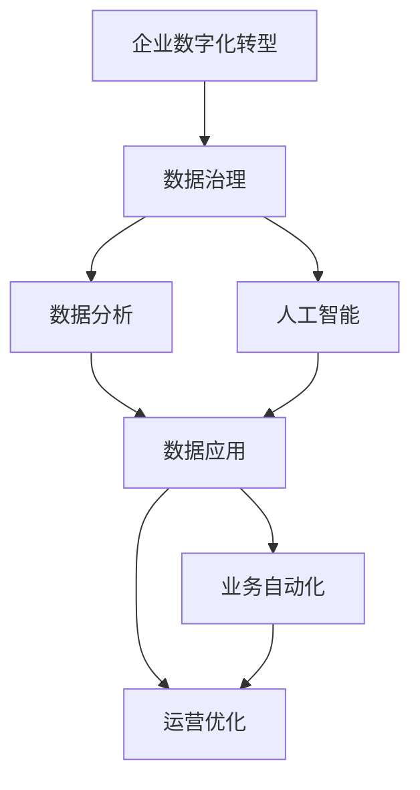

                 

# 数据驱动的企业转型：如何利用数据进行数字化转型？

> 关键词：企业数字化转型,数据驱动,数据治理,数据分析,人工智能

## 1. 背景介绍

### 1.1 问题由来
在当前数字化时代，数据已成为企业最宝贵的资产之一。如何高效利用数据，实现企业的数字化转型，是每一位企业管理者和数据科学家面临的重要问题。企业数字化转型不仅涉及技术的革新，更关乎企业运营、管理、决策等方方面面的变革。数据驱动的数字化转型，成为企业追求高质量发展、提升市场竞争力的关键路径。

### 1.2 问题核心关键点
企业数字化转型的核心在于利用数据进行全面、深度的业务分析，驱动企业从传统的以经验为主的管理模式，转变为以数据驱动的管理模式。其核心关键点包括：

- 数据治理：确保数据的完整性、准确性和可用性，建立统一的数据标准和管理流程。
- 数据分析：采用先进的数据分析技术，深入挖掘数据背后的业务洞察，支持决策。
- 人工智能：结合机器学习和深度学习算法，提升数据分析的自动化水平，实现智能决策。
- 数据应用：将分析结果转化为具体业务流程和操作，实现业务自动化和优化。

### 1.3 问题研究意义
开展数据驱动的数字化转型，对于提升企业的运营效率、降低成本、优化决策具有重要意义：

- 提升运营效率：通过数据分析优化生产流程，提高生产效率和质量。
- 降低运营成本：数据分析识别成本浪费点，优化资源配置，降低运营成本。
- 优化决策支持：数据分析支持市场趋势预测、客户行为分析、供应链优化等，提升决策准确性。
- 创造新的商业机会：数据驱动的企业能够更灵活地应对市场变化，抓住新机遇，开拓新市场。
- 增强竞争优势：数据分析和人工智能技术，使企业能够提前预判市场动态，快速响应，提升市场竞争力。

## 2. 核心概念与联系

### 2.1 核心概念概述

为更好地理解企业数字化转型的核心技术和方法，本节将介绍几个关键概念：

- **企业数字化转型**：指通过数据驱动技术的应用，对企业的运营、管理、决策等方面进行全面优化，提升企业运营效率和市场竞争力的过程。

- **数据治理**：涉及数据采集、存储、处理、分析等各个环节，确保数据的完整性、准确性、一致性和安全性，实现数据的高效管理和利用。

- **数据分析**：利用数据挖掘、统计分析、机器学习等技术手段，从大量数据中提取有价值的商业洞察，支持决策制定。

- **人工智能**：通过机器学习、深度学习等技术，使计算机系统具备人类智能，实现自动化分析、预测和决策。

- **数据应用**：将数据分析结果转化为具体业务流程和操作，实现业务自动化和优化，提升企业运营效率和市场竞争力。

- **数据驱动**：指在企业的运营、管理、决策等各个环节中，都以数据为依据，通过数据驱动的方式提升企业效率和竞争力。

这些核心概念之间存在紧密的联系，形成了企业数字化转型的完整框架。以下通过Mermaid流程图展示其关系：



通过这个流程图，我们可以清晰地理解企业数字化转型的核心流程：首先建立数据治理体系，确保数据质量；其次进行数据分析，挖掘数据价值；最后结合人工智能技术，实现数据应用，驱动业务自动化和优化。

### 2.2 概念间的关系

这些核心概念之间存在相互促进的关系：

- **数据治理与数据分析**：数据治理是数据分析的前提，提供高质量的数据是分析结果可靠性的基础。
- **数据分析与人工智能**：数据分析是人工智能的基础，提供大量有标注的数据是模型训练和优化的基础。
- **人工智能与数据应用**：人工智能技术提供更高级的分析和预测能力，驱动数据应用场景的拓展。
- **数据应用与业务自动化**：数据应用是业务自动化的具体实现，实现运营优化和流程自动化。

通过这些核心概念的有机结合，企业可以实现全面、深入的数字化转型，提升整体运营效率和市场竞争力。

## 3. 核心算法原理 & 具体操作步骤
### 3.1 算法原理概述

企业数字化转型的核心在于利用数据驱动技术的应用。以下详细介绍核心算法原理和具体操作步骤：

**数据治理**

数据治理是企业数字化转型的基础，其核心任务是确保数据的完整性、准确性和可用性，建立统一的数据标准和管理流程。数据治理主要包括数据质量管理、数据源管理、元数据管理、数据安全管理等。

**数据分析**

数据分析是企业数字化转型的关键步骤，其目的是通过数据挖掘、统计分析、机器学习等技术手段，从大量数据中提取有价值的商业洞察，支持决策制定。数据分析通常分为描述性分析、诊断性分析、预测性分析和规范性分析四个层次。

**人工智能**

人工智能是企业数字化转型的高级技术手段，通过机器学习、深度学习等技术，使计算机系统具备人类智能，实现自动化分析、预测和决策。人工智能在企业中的应用包括自然语言处理、计算机视觉、语音识别等，这些技术可以用于自动化处理大量数据，提升数据分析效率。

**数据应用**

数据应用是企业数字化转型的最终目标，即将数据分析结果转化为具体业务流程和操作，实现业务自动化和优化。数据应用主要包括数据可视化、报表生成、业务预测、自动化决策等。

### 3.2 算法步骤详解

**步骤1：数据治理**

1. **数据质量管理**：
   - 收集企业内外部数据，对数据进行清洗、去重、纠错、合并等处理。
   - 使用数据质量管理工具，如Informatica、Talend等，自动化数据清洗和转换流程。
   - 建立数据质量监控机制，定期检测数据质量，及时发现和修正问题。

2. **数据源管理**：
   - 确定企业可用的数据源，包括内部系统、外部API、第三方数据等。
   - 建立数据源注册和管理平台，统一管理和监控数据源的接入和使用。
   - 使用ETL（Extract, Transform, Load）工具，如Apache Nifi、Talend等，自动化数据抽取、转换和加载过程。

3. **元数据管理**：
   - 建立元数据仓库，收集和管理所有数据源的元数据，如数据结构、数据类型、数据关系等。
   - 使用元数据管理工具，如Collibra、Informatica等，提供数据元数据的管理和分析功能。
   - 利用数据元数据，进行数据追溯和数据关系分析，支持数据分析和数据治理。

4. **数据安全管理**：
   - 建立数据安全策略和制度，保护企业数据安全。
   - 使用数据加密、访问控制、审计等技术手段，确保数据在存储和传输过程中的安全性。
   - 定期进行安全评估和风险管理，及时发现和修复安全漏洞。

**步骤2：数据分析**

1. **描述性分析**：
   - 使用统计分析工具，如Excel、Tableau等，对数据进行基本统计和可视化展示。
   - 使用SQL查询语言，如SQL Server、MySQL等，对数据进行基本的描述性分析和报表生成。

2. **诊断性分析**：
   - 使用数据挖掘工具，如RapidMiner、Weka等，进行关联分析、聚类分析、分类分析等。
   - 使用文本分析工具，如Python NLTK、SpaCy等，进行文本挖掘和情感分析。
   - 使用时间序列分析工具，如Python Pandas、R语言等，进行时间序列预测和趋势分析。

3. **预测性分析**：
   - 使用机器学习算法，如决策树、随机森林、神经网络等，进行预测建模。
   - 使用深度学习算法，如卷积神经网络、循环神经网络等，进行更高级的预测建模。
   - 使用开源数据分析平台，如Apache Spark、Hadoop等，进行大数据分析。

4. **规范性分析**：
   - 使用优化算法，如线性规划、整数规划等，进行决策优化。
   - 使用模拟和仿真工具，如Python SymPy、MATLAB等，进行模拟和优化。
   - 使用决策支持系统，如SAS、IBM SPSS等，提供决策支持和分析功能。

**步骤3：人工智能**

1. **自然语言处理**：
   - 使用自然语言处理工具，如NLTK、SpaCy等，进行文本预处理和特征提取。
   - 使用预训练模型，如BERT、GPT等，进行文本分类、情感分析、命名实体识别等任务。
   - 使用对话系统框架，如Rasa、Dialogflow等，构建智能对话系统，实现自动化客服和智能助手。

2. **计算机视觉**：
   - 使用计算机视觉库，如OpenCV、TensorFlow等，进行图像处理和特征提取。
   - 使用预训练模型，如ResNet、YOLO等，进行目标检测、图像分类等任务。
   - 使用计算机视觉系统，如Amazon Rekognition、Google Vision等，实现智能监控和图像识别。

3. **语音识别**：
   - 使用语音识别工具，如Kaldi、DeepSpeech等，进行语音转换和特征提取。
   - 使用预训练模型，如Tacotron、WaveNet等，进行语音合成和语音识别。
   - 使用语音识别系统，如Google Assistant、Amazon Alexa等，实现智能语音助手和交互。

**步骤4：数据应用**

1. **数据可视化**：
   - 使用数据可视化工具，如Tableau、Power BI等，进行数据图表和仪表盘展示。
   - 使用Python Matplotlib、Seaborn等，进行高级数据可视化。
   - 使用地理信息系统（GIS），如ArcGIS、QGIS等，进行空间数据分析和可视化。

2. **报表生成**：
   - 使用报表生成工具，如Tableau、Power BI等，生成自动化报表。
   - 使用Python Pandas、Jupyter Notebook等，生成自定义报表。
   - 使用报表管理平台，如UiPath、Automation Anywhere等，实现自动化报表生成和分发。

3. **业务预测**：
   - 使用预测模型，如时间序列预测、回归分析等，进行业务预测。
   - 使用模拟和仿真工具，如Python SimPy、MATLAB等，进行业务模拟和优化。
   - 使用决策支持系统，如SAS、IBM SPSS等，提供决策支持和分析功能。

4. **自动化决策**：
   - 使用决策优化算法，如线性规划、整数规划等，进行决策优化。
   - 使用机器学习算法，如决策树、随机森林等，进行自动化决策。
   - 使用决策系统，如IBM Watson、Google Cloud AI等，实现自动化决策和智能推荐。

### 3.3 算法优缺点

**数据治理**

优点：
- 确保数据质量，提供高质量的数据输入。
- 统一数据标准和管理流程，提升数据治理效率。
- 保障数据安全，降低数据泄露风险。

缺点：
- 数据治理初期投入较大，需要大量人力和物力。
- 数据治理复杂，需要综合考虑多种数据源和数据类型。
- 数据治理效果依赖于工具和流程的科学性和规范性。

**数据分析**

优点：
- 深入挖掘数据背后的业务洞察，支持决策制定。
- 使用先进的数据分析技术，提高数据利用效率。
- 使用开源工具和平台，降低数据分析成本。

缺点：
- 数据分析复杂度高，需要具备专业的数据科学知识和技能。
- 数据量大时，分析效率较低，需要高性能计算资源。
- 数据分析结果依赖于数据质量和算法模型，存在误差和不确定性。

**人工智能**

优点：
- 提升数据分析自动化水平，提高分析效率。
- 使用预训练模型，提高数据分析精度和效果。
- 结合多种人工智能技术，实现复杂数据分析和决策。

缺点：
- 人工智能算法复杂度高，需要大量训练数据和计算资源。
- 模型训练和优化需要专业知识，普通员工难以掌握。
- 人工智能模型存在“过拟合”和“欠拟合”问题，需要科学调参。

**数据应用**

优点：
- 将数据分析结果转化为具体业务流程和操作，实现业务自动化和优化。
- 使用数据可视化工具，提供直观的业务洞察和决策支持。
- 使用决策支持系统，实现智能决策和优化。

缺点：
- 数据应用效果依赖于数据分析结果的准确性和可靠性。
- 数据应用场景多样，需要综合考虑多种业务需求和数据类型。
- 数据应用系统复杂度高，需要综合考虑技术和管理因素。

### 3.4 算法应用领域

基于数据驱动的企业转型方法，已经广泛应用于多个行业领域：

- **零售行业**：通过数据分析和人工智能，优化库存管理、客户分析、推荐系统等，提升零售效率和客户体验。
- **金融行业**：使用数据分析和人工智能，进行风险评估、市场预测、客户分析等，提升金融决策的准确性和效率。
- **制造行业**：使用数据分析和人工智能，优化生产流程、设备维护、质量控制等，提升制造效率和产品质量。
- **物流行业**：使用数据分析和人工智能，优化路线规划、配送计划、库存管理等，提升物流效率和成本控制。
- **医疗行业**：使用数据分析和人工智能，进行疾病预测、治疗方案优化、患者管理等，提升医疗服务质量和效率。

## 4. 数学模型和公式 & 详细讲解 & 举例说明

### 4.1 数学模型构建

在企业数字化转型过程中，数据分析和人工智能技术发挥着关键作用。以下以数据分析和人工智能为例，构建数学模型：

**数据分析**

1. **描述性分析**：
   - 统计描述性分析指标，如均值、方差、标准差等。
   - 使用统计分析工具，进行数据可视化展示。

2. **诊断性分析**：
   - 使用关联规则挖掘算法，如Apriori算法、FP-Growth算法等，发现数据之间的关联关系。
   - 使用聚类分析算法，如K-means算法、层次聚类算法等，将数据分为不同类别。
   - 使用分类分析算法，如决策树算法、随机森林算法等，进行数据分类和预测。

3. **预测性分析**：
   - 使用回归分析算法，如线性回归、多项式回归等，进行数据预测和趋势分析。
   - 使用时间序列分析算法，如ARIMA模型、LSTM模型等，进行时间序列预测和趋势分析。
   - 使用机器学习算法，如支持向量机（SVM）、集成学习算法等，进行数据分类和预测。

4. **规范性分析**：
   - 使用线性规划算法，如单纯形法、内点法等，进行线性规划和优化。
   - 使用整数规划算法，如割平面法、分支定界法等，进行整数规划和优化。
   - 使用模拟和仿真工具，进行业务模拟和优化。

**人工智能**

1. **自然语言处理**：
   - 使用预训练模型，如BERT、GPT等，进行文本分类、情感分析、命名实体识别等任务。
   - 使用语言模型，如条件随机场（CRF）、隐马尔可夫模型（HMM）等，进行文本生成和语义分析。
   - 使用对话系统框架，如Rasa、Dialogflow等，构建智能对话系统，实现自动化客服和智能助手。

2. **计算机视觉**：
   - 使用卷积神经网络（CNN）进行图像分类和目标检测。
   - 使用循环神经网络（RNN）进行视频分析和时间序列预测。
   - 使用深度学习模型，如YOLO、Mask R-CNN等，进行更高级的图像识别和处理。

3. **语音识别**：
   - 使用深度学习模型，如Tacotron、WaveNet等，进行语音合成和语音识别。
   - 使用声学模型，如隐马尔可夫模型（HMM）、深度神经网络（DNN）等，进行语音识别和转换。
   - 使用语音识别系统，如Google Assistant、Amazon Alexa等，实现智能语音助手和交互。

### 4.2 公式推导过程

以下以自然语言处理和计算机视觉为例，推导核心公式：

**自然语言处理**

1. **文本分类**

   - 使用朴素贝叶斯算法，进行文本分类：
   - 文本表示：将文本转换为向量表示，如TF-IDF、Word2Vec等。
   - 分类公式：$P(w|c) = \frac{P(w|c)P(c)}{P(c)} = P(w|c)$，其中$w$为单词，$c$为分类标签。

   - 使用支持向量机（SVM），进行文本分类：
   - 文本表示：将文本转换为向量表示，如TF-IDF、Word2Vec等。
   - 分类公式：$arg\min_{c}\sum_{i=1}^n\frac{1}{2}\Vert x_i - y_i \Vert^2$，其中$x_i$为文本特征向量，$y_i$为标签向量。

2. **情感分析**

   - 使用情感分析算法，如情感词典、情感分类器等，进行情感分析：
   - 情感词典：构建情感词典，将单词映射为情感极性。
   - 情感分类器：使用朴素贝叶斯算法、逻辑回归等分类算法，进行情感分类。

3. **命名实体识别**

   - 使用命名实体识别算法，如条件随机场（CRF）、隐马尔可夫模型（HMM）等，进行命名实体识别：
   - 命名实体表示：将命名实体转换为向量表示，如Word2Vec、BERT等。
   - 命名实体识别公式：$P(e|s) = \frac{P(e|s)P(s)}{P(s)} = P(e|s)$，其中$e$为命名实体，$s$为句子。

**计算机视觉**

1. **图像分类**

   - 使用卷积神经网络（CNN），进行图像分类：
   - 图像表示：将图像转换为向量表示，如卷积层、池化层等。
   - 分类公式：$P(y|x) = \frac{e^{W(x;\theta)}}{\sum_{y'}e^{W(x;\theta)}}$，其中$x$为图像特征向量，$y$为分类标签，$W$为权重参数。

   - 使用支持向量机（SVM），进行图像分类：
   - 图像表示：将图像转换为向量表示，如卷积层、池化层等。
   - 分类公式：$arg\min_{y}\frac{1}{2}\Vert W(x-y) \Vert^2 + C\Vert y \Vert^2$，其中$x$为图像特征向量，$y$为标签向量，$W$为权重参数。

2. **目标检测**

   - 使用目标检测算法，如YOLO、Faster R-CNN等，进行目标检测：
   - 目标表示：将目标转换为向量表示，如卷积层、池化层等。
   - 目标检测公式：$P(o|i) = \frac{P(o|i)P(i)}{P(i)} = P(o|i)$，其中$o$为目标，$i$为图像。

3. **图像生成**

   - 使用生成对抗网络（GAN），进行图像生成：
   - 图像表示：将图像转换为向量表示，如卷积层、池化层等。
   - 生成公式：$G(z) = W_1(W_2(z))$，其中$G$为生成器，$W_1$为卷积层，$W_2$为池化层，$z$为噪声向量。

### 4.3 案例分析与讲解

**零售行业**

- **问题**：零售企业需要优化库存管理，减少库存积压，提高客户满意度。
- **解决方案**：
  1. **数据分析**：使用描述性分析、预测性分析等方法，分析销售数据、库存数据、客户反馈等。
  2. **人工智能**：使用深度学习模型，如LSTM、RNN等，进行销售预测和库存优化。
  3. **数据应用**：使用智能推荐系统，如Amazon推荐算法，实现个性化推荐。
- **效果**：通过数据分析和人工智能，零售企业能够优化库存管理，减少库存积压，提高客户满意度。

**金融行业**

- **问题**：金融机构需要提升风险管理能力，降低金融风险。
- **解决方案**：
  1. **数据分析**：使用诊断性分析、预测性分析等方法，分析市场数据、客户数据、财务数据等。
  2. **人工智能**：使用机器学习模型，如决策树、随机森林等，进行信用评估、风险预测等。
  3. **数据应用**：使用智能监控系统，如Kaggle金融数据集，进行实时风险监测。
- **效果**：通过数据分析和人工智能，金融机构能够提升风险管理能力，降低金融风险。

## 5. 项目实践：代码实例和详细解释说明

### 5.1 开发环境搭建

在企业数字化转型过程中，使用Python和R语言进行数据分析和人工智能开发，需要搭建以下开发环境：

1. **Python环境**：安装Python 3.x版本，建议使用Anaconda环境。
   - 安装Python 3.x：从官网下载并安装Python。
   - 安装Anaconda：从官网下载并安装Anaconda，用于创建独立的Python环境。
   - 激活Python环境：在命令行中运行`conda activate env_name`，其中`env_name`为Python环境名称。

2. **R环境**：安装R语言 4.x版本，建议使用R Studio IDE。
   - 安装R语言：从官网下载并安装R语言。
   - 安装R Studio：从官网下载并安装R Studio IDE。
   - 激活R环境：在R Studio中选择R语言环境。

3. **数据处理工具**：安装Pandas、NumPy、Matplotlib、Tableau等数据处理和可视化工具。
   - 安装Pandas：在Python中使用`pip install pandas`命令安装。
   - 安装NumPy：在Python中使用`pip install numpy`命令安装。
   - 安装Matplotlib：在Python中使用`pip install matplotlib`命令安装。
   - 安装Tableau：从官网下载并安装Tableau软件。

4. **机器学习库**：安装Scikit-Learn、TensorFlow、Keras等机器学习库。
   - 安装Scikit-Learn：在Python中使用`pip install scikit-learn`命令安装。
   - 安装TensorFlow：在Python中使用`pip install tensorflow`命令安装。
   - 安装Keras：在Python中使用`pip install keras`命令安装。

### 5.2 源代码详细实现

以下以机器学习模型训练为例，给出Python和R语言的代码实现。

**Python代码**

```python
# 导入必要的库
import pandas as pd
import numpy as np
from sklearn.model_selection import train_test_split
from sklearn.linear_model import LogisticRegression
from sklearn.metrics import accuracy_score

# 加载数据集
data = pd.read_csv('data.csv')

# 数据预处理
X = data[['feature1', 'feature2', 'feature3']]
y = data['label']

# 数据拆分
X_train, X_test, y_train, y_test = train_test_split(X, y, test_size=0.2)

# 模型训练
model = LogisticRegression()
model.fit(X_train, y_train)

# 模型评估
y_pred = model.predict(X_test)
accuracy = accuracy_score(y_test, y_pred)
print(f'Accuracy: {accuracy:.2f}')
```

**R代码**

```R
# 导入必要的库
library(tidyverse)
library(caret)

# 加载数据集
data <- read.csv('data.csv')

# 数据预处理
X <- select(data, feature1 = feature1, feature2 = feature2, feature3 = feature3)
y <- as.factor(data$label)

# 数据拆分
set.seed(123)
trainIndex <- createDataPartition(y, p = 0.8, list = FALSE)
X_train <- X[trainIndex, ]
X_test <- X[-trainIndex, ]
y_train <- y[trainIndex]
y_test <- y[-trainIndex]

# 模型训练
model <- train(y ~ feature1 + feature2 + feature3, data = data, method = 'glm', metric = 'Accuracy')
summary(model)

# 模型评估
y_pred <- predict(model, newdata = X_test)
accuracy <- accuracy(y_test, y_pred)
print(paste('Accuracy:', accuracy, sep=''))
```

### 5.3 代码解读与分析

**Python代码解读**

- 导入必要的库，包括Pandas、Numpy、Scikit-Learn等。
- 加载数据集，将数据从CSV文件中读取到Pandas DataFrame中。
- 数据预处理，将特征列提取出来并存放在X变量中，将标签列提取出来并存放在y变量中。
- 数据拆分，将数据集拆分为训练集和测试集。
- 模型训练，使用逻辑回归模型进行训练。
- 模型评估，在测试集上评估模型性能，计算准确率。

**R代码解读**

- 导入必要的库，包括tidyverse、caret等。
- 加载数据集，将数据从CSV文件中读取到R数据框中。
- 数据预处理，将特征列和标签列提取出来并分别存放在X和y变量中。
- 数据拆分，使用caret包的createDataPartition函数进行数据拆分。

