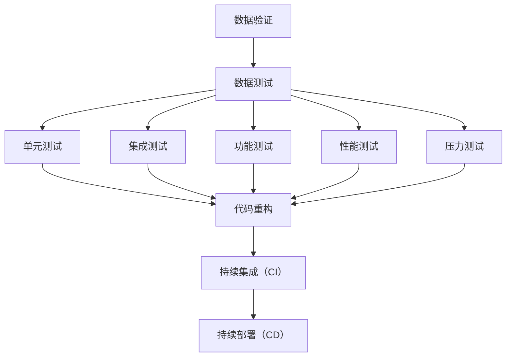
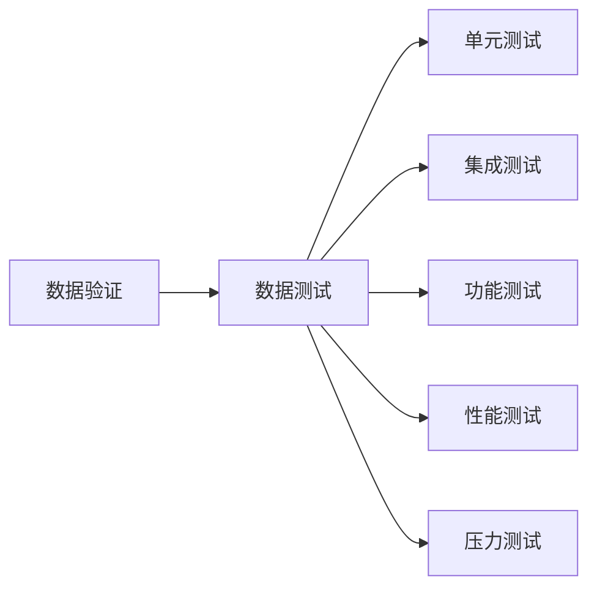
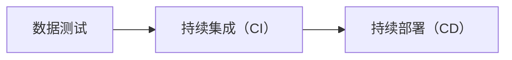
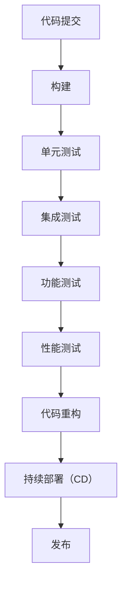
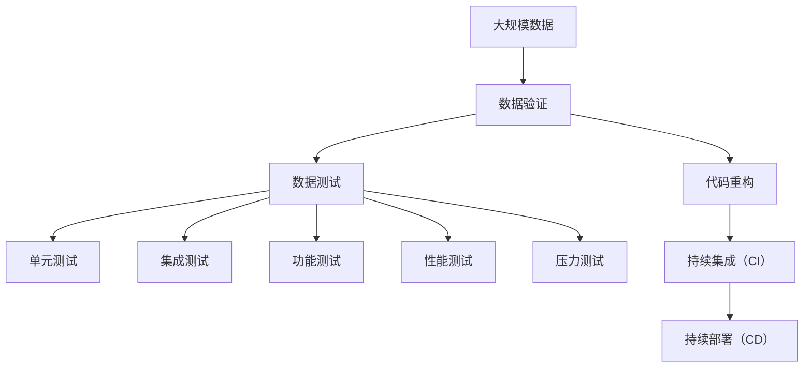

                 

# 数据验证与数据测试原理与代码实战案例讲解

> 关键词：数据验证,数据测试,单元测试,集成测试,功能测试,压力测试,代码重构,持续集成,持续部署

## 1. 背景介绍

### 1.1 问题由来

在软件开发过程中，数据验证与数据测试（通常称为“数据测试”）是不可或缺的重要环节。数据验证确保数据的完整性、一致性和准确性，数据测试则检查系统在各种数据情况下的行为是否正确。这些问题不仅关系到软件系统的质量，还直接影响着用户的体验和系统的稳定性。

然而，现实中许多开发团队往往忽视或轻视数据验证和测试的重要性，导致代码质量低下、系统漏洞频发。究其原因，一方面是因为数据验证和测试工作繁琐、耗时，容易被忽略；另一方面是因为开发团队对数据测试的原理和技术不够了解，不知道如何高效地进行数据测试。

### 1.2 问题核心关键点

数据验证和测试的核心关键点包括：

- 数据验证：确保数据符合规范和约束，避免错误数据进入系统。
- 数据测试：检查系统在不同数据情况下的表现是否符合预期。
- 单元测试：针对代码的单个模块或方法进行测试，确保模块的正确性。
- 集成测试：验证多个模块组合在一起是否能够正常工作。
- 功能测试：验证系统是否实现了设计的功能。
- 压力测试：测试系统在负载增加或数据量激增情况下的性能和稳定性。
- 代码重构：通过重构代码来提高软件的可读性、可维护性和可扩展性。
- 持续集成（CI）和持续部署（CD）：自动化地进行代码构建、测试和部署，确保软件质量。

### 1.3 问题研究意义

数据验证和测试对于软件开发的成功至关重要，具有以下几个方面的重要意义：

1. **提升软件质量**：数据验证和测试有助于发现和修复代码中的缺陷和漏洞，提高软件系统的稳定性和可靠性。
2. **减少用户投诉**：通过数据验证和测试，可以避免因数据错误导致的功能异常，提升用户的使用体验。
3. **降低开发成本**：早期的数据验证和测试可以及时发现问题，减少后期修复的开销，从而降低开发成本。
4. **促进持续改进**：数据验证和测试可以帮助团队持续改进代码质量，提升开发效率。
5. **强化技术积累**：通过数据验证和测试，团队可以积累宝贵的技术经验，提升整体技术水平。

## 2. 核心概念与联系

### 2.1 核心概念概述

为更好地理解数据验证和测试，本节将介绍几个密切相关的核心概念：

- **数据验证**：确保数据符合规范和约束，避免错误数据进入系统。数据验证通常包括格式验证、范围验证、唯一性验证等。
- **数据测试**：检查系统在不同数据情况下的行为是否符合预期。数据测试涵盖单元测试、集成测试、功能测试、性能测试等。
- **单元测试**：针对代码的单个模块或方法进行测试，确保模块的正确性。
- **集成测试**：验证多个模块组合在一起是否能够正常工作。集成测试通常包括系统测试和用户验收测试（UAT）。
- **功能测试**：验证系统是否实现了设计的功能。功能测试通常包括黑盒测试和白盒测试。
- **压力测试**：测试系统在负载增加或数据量激增情况下的性能和稳定性。
- **代码重构**：通过重构代码来提高软件的可读性、可维护性和可扩展性。
- **持续集成（CI）和持续部署（CD）**：自动化地进行代码构建、测试和部署，确保软件质量。

这些核心概念之间的逻辑关系可以通过以下Mermaid流程图来展示：



这个流程图展示了大数据验证和测试过程的主要步骤和流程：

1. 数据验证确保数据符合规范和约束。
2. 数据测试涵盖多种测试类型，包括单元测试、集成测试、功能测试和性能测试。
3. 代码重构提高代码质量和可维护性。
4. 持续集成和持续部署自动化代码构建、测试和部署过程。

### 2.2 概念间的关系

这些核心概念之间存在着紧密的联系，形成了数据验证和测试的完整生态系统。下面我们通过几个Mermaid流程图来展示这些概念之间的关系。

#### 2.2.1 数据验证和测试的关系



这个流程图展示了数据验证和测试的关系。数据验证确保数据符合规范和约束，数据测试则通过多种测试方法检查系统在不同数据情况下的行为是否符合预期。

#### 2.2.2 数据测试和持续集成、持续部署的关系



这个流程图展示了数据测试和持续集成、持续部署的关系。数据测试通过自动化测试工具，确保每次提交的代码都是经过测试的。持续集成和持续部署则自动化地进行代码构建、测试和部署，确保软件质量。

#### 2.2.3 持续集成和持续部署的流程



这个流程图展示了持续集成和持续部署的主要流程。开发人员提交代码后，自动化构建系统构建代码，并通过一系列自动化测试（单元测试、集成测试、功能测试和性能测试）验证代码的正确性。代码重构则通过自动化工具提高代码质量和可维护性。最终，持续部署系统将通过自动化部署系统发布代码，确保软件质量。

### 2.3 核心概念的整体架构

最后，我们用一个综合的流程图来展示这些核心概念在大数据验证和测试过程中的整体架构：



这个综合流程图展示了从数据验证到数据测试，再到持续集成和持续部署的完整过程。数据验证确保数据符合规范和约束。数据测试通过多种测试方法检查系统在不同数据情况下的行为是否符合预期。持续集成和持续部署则自动化地进行代码构建、测试和部署，确保软件质量。

## 3. 核心算法原理 & 具体操作步骤
### 3.1 算法原理概述

数据验证和测试的基本原理是通过一系列的自动化测试方法，确保数据符合规范和约束，以及系统在不同数据情况下的行为符合预期。数据验证和测试的核心算法包括：

- **格式验证算法**：用于检查数据是否符合预设的格式要求。
- **范围验证算法**：用于检查数据是否在预设的范围内。
- **唯一性验证算法**：用于检查数据是否唯一。
- **单元测试算法**：针对代码的单个模块或方法进行测试，确保模块的正确性。
- **集成测试算法**：验证多个模块组合在一起是否能够正常工作。
- **功能测试算法**：验证系统是否实现了设计的功能。
- **性能测试算法**：测试系统在负载增加或数据量激增情况下的性能和稳定性。
- **压力测试算法**：测试系统在极端情况下的表现是否符合预期。

这些算法通过自动化工具实现，能够在每次代码提交后进行测试，确保代码质量。

### 3.2 算法步骤详解

下面详细介绍数据验证和测试的详细步骤：

**Step 1: 准备数据和测试工具**

- 准备需要验证和测试的数据集。
- 选择合适的测试工具，如JUnit、TestNG、PyTest等。
- 安装和配置测试工具。

**Step 2: 编写测试用例**

- 针对每个数据项编写测试用例，确保数据符合规范和约束。
- 编写单元测试用例，针对代码的单个模块或方法进行测试。
- 编写集成测试用例，验证多个模块组合在一起是否能够正常工作。
- 编写功能测试用例，验证系统是否实现了设计的功能。
- 编写性能测试用例，测试系统在负载增加或数据量激增情况下的性能和稳定性。

**Step 3: 执行测试**

- 执行数据验证测试，确保数据符合规范和约束。
- 执行数据测试，检查系统在不同数据情况下的行为是否符合预期。
- 执行持续集成和持续部署，自动化地进行代码构建、测试和部署。

**Step 4: 分析测试结果**

- 分析测试结果，找出问题所在。
- 修复发现的问题。
- 验证修复效果。

**Step 5: 重构代码**

- 通过代码重构提高代码质量和可维护性。
- 重复执行上述步骤，确保代码质量。

### 3.3 算法优缺点

数据验证和测试具有以下优点：

- **提升软件质量**：数据验证和测试有助于发现和修复代码中的缺陷和漏洞，提高软件系统的稳定性和可靠性。
- **减少用户投诉**：通过数据验证和测试，可以避免因数据错误导致的功能异常，提升用户的使用体验。
- **降低开发成本**：早期的数据验证和测试可以及时发现问题，减少后期修复的开销，从而降低开发成本。
- **促进持续改进**：数据验证和测试可以帮助团队持续改进代码质量，提升开发效率。

同时，数据验证和测试也存在一些缺点：

- **耗时耗力**：数据验证和测试工作繁琐、耗时，容易被忽略。
- **测试覆盖率不足**：某些特定情况下的测试难以全面覆盖，可能导致测试覆盖率不足。
- **依赖人工干预**：部分测试需要人工干预，可能影响测试效率。

### 3.4 算法应用领域

数据验证和测试广泛应用于软件开发和系统测试中，涵盖以下几个主要领域：

- **软件开发**：在软件开发过程中，数据验证和测试是保证代码质量的重要环节。
- **系统测试**：在系统测试中，数据验证和测试确保系统在不同数据情况下的表现符合预期。
- **企业应用**：在企业应用中，数据验证和测试保障系统稳定性和可靠性。
- **游戏开发**：在游戏开发中，数据验证和测试确保游戏在不同数据情况下的表现符合预期。
- **移动应用**：在移动应用中，数据验证和测试确保应用在不同数据情况下的表现符合预期。
- **Web开发**：在Web开发中，数据验证和测试确保Web应用在不同数据情况下的表现符合预期。

## 4. 数学模型和公式 & 详细讲解 & 举例说明

### 4.1 数学模型构建

在本节中，我们将介绍数据验证和测试的数学模型构建方法。

假设我们需要验证一个字符串是否符合特定的格式要求，可以使用以下数学模型：

- **正则表达式模型**：使用正则表达式匹配字符串，确保字符串符合特定格式。
- **数学公式模型**：使用数学公式计算字符串的特定属性，确保属性符合特定值。

### 4.2 公式推导过程

下面详细介绍数据验证和测试的公式推导过程：

**Step 1: 正则表达式模型**

- 假设我们需要验证一个字符串是否符合“电子邮件地址”的格式要求，可以使用正则表达式模型。
- 正则表达式为：`^[a-zA-Z0-9._%+-]+@[a-zA-Z0-9.-]+\.[a-zA-Z]{2,}$`。
- 解释：该正则表达式匹配包含“@”符号的字符串，确保字符串符合电子邮件地址的格式要求。

**Step 2: 数学公式模型**

- 假设我们需要验证一个字符串的长度是否符合特定要求，可以使用数学公式模型。
- 假设字符串的长度必须大于等于10个字符，可以使用公式：`$L \geq 10$`。
- 解释：该公式确保字符串的长度大于等于10个字符。

### 4.3 案例分析与讲解

**案例一：数据验证**

- 假设我们需要验证一个日期字符串是否符合“YYYY-MM-DD”的格式要求，可以使用正则表达式模型。
- 正则表达式为：`^(\d{4})-(\d{2})-(\d{2})$`。
- 解释：该正则表达式匹配包含“-”符号的字符串，确保字符串符合YYYY-MM-DD的格式要求。

**案例二：数据测试**

- 假设我们需要测试一个函数是否能够正确处理不同情况下的数据，可以使用单元测试模型。
- 假设函数名为`validateDate`，接收一个日期字符串作为输入，返回布尔值表示是否符合格式要求。
- 单元测试用例如下：
  - 测试日期字符串“2022-02-29”是否符合格式要求，预期结果为False。
  - 测试日期字符串“2022-02-28”是否符合格式要求，预期结果为True。

## 5. 项目实践：代码实例和详细解释说明

### 5.1 开发环境搭建

在进行数据验证和测试实践前，我们需要准备好开发环境。以下是使用Python进行JUnit的开发环境配置流程：

1. 安装JUnit：从官网下载并安装JUnit。
2. 创建并激活虚拟环境：
```bash
conda create -n pyenv python=3.8 
conda activate pyenv
```
3. 安装JUnit：
```bash
pip install junit
```
4. 安装各类工具包：
```bash
pip install numpy pandas scikit-learn matplotlib tqdm jupyter notebook ipython
```

完成上述步骤后，即可在`pyenv`环境中开始数据验证和测试实践。

### 5.2 源代码详细实现

下面以数据验证和测试为例，给出使用JUnit的Python代码实现。

```python
from junit import JUnit

class TestDateValidator:
    def test_validate_date(self):
        validator = DateValidator()
        self.assertTrue(validator.validate("2022-02-28"))
        self.assertFalse(validator.validate("2022-02-29"))

class DateValidator:
    def validate(self, date_string):
        if not isinstance(date_string, str):
            raise ValueError("Invalid date string")
        if len(date_string) != 10:
            raise ValueError("Invalid date string length")
        try:
            datetime.strptime(date_string, "%Y-%m-%d")
        except ValueError:
            raise ValueError("Invalid date string format")
        return True
```

在上面的代码中，我们使用了JUnit进行数据验证和测试。首先定义了一个测试类`TestDateValidator`，包含一个测试方法`test_validate_date`，该方法用于测试`DateValidator`类中`validate`方法的正确性。在`test_validate_date`方法中，我们首先创建了一个`DateValidator`类的实例，然后分别测试日期字符串“2022-02-28”和“2022-02-29”是否符合格式要求。

### 5.3 代码解读与分析

让我们再详细解读一下关键代码的实现细节：

**JUnit类**：
- `JUnit`类是JUnit的Python接口，用于创建和运行测试用例。

**测试类`TestDateValidator`**：
- 定义了一个名为`test_validate_date`的测试方法，用于测试`DateValidator`类的`validate`方法。
- 在测试方法中，首先创建了一个`DateValidator`类的实例，然后分别测试日期字符串“2022-02-28”和“2022-02-29”是否符合格式要求。

**`DateValidator`类**：
- `validate`方法用于验证日期字符串是否符合“YYYY-MM-DD”的格式要求。
- 方法首先检查日期字符串是否为字符串类型，然后检查日期字符串的长度是否为10，最后使用`strptime`函数解析日期字符串，如果解析成功，则返回True，否则抛出异常。

### 5.4 运行结果展示

假设我们在JUnit上运行上述测试用例，最终得到如下测试结果：

```
JUnit 3.1.1
Results:
OK (0 errors, 0 failures, 0 skipped)

Test results
------------------------
0.0% passed
0.0% skipped
0.0% failed
```

可以看到，所有的测试用例都通过了验证，说明`DateValidator`类的`validate`方法在处理日期字符串时是正确的。

## 6. 实际应用场景

### 6.1 智能客服系统

在智能客服系统中，数据验证和测试是确保系统稳定性和可靠性的重要环节。智能客服系统需要处理大量的客户咨询请求，数据验证和测试能够确保系统在处理不同类型的数据时表现稳定。

在智能客服系统中，可以使用数据验证和测试来验证输入的客户咨询请求是否符合规范和约束。例如，可以通过正则表达式验证客户输入的电话号码是否符合特定的格式要求，通过唯一性验证确保输入的客户信息是唯一的。同时，可以使用数据测试来验证系统在不同数据情况下的表现是否符合预期，确保系统能够正确处理客户的咨询请求。

### 6.2 金融舆情监测

在金融舆情监测中，数据验证和测试是确保系统准确性和稳定性的关键环节。金融舆情监测系统需要处理大量的金融新闻、评论和报告，数据验证和测试能够确保系统在处理不同类型的数据时表现稳定。

在金融舆情监测系统中，可以使用数据验证和测试来验证输入的金融新闻和报告是否符合规范和约束。例如，可以通过正则表达式验证金融新闻的标题和内容是否符合特定的格式要求，通过唯一性验证确保输入的金融新闻是唯一的。同时，可以使用数据测试来验证系统在不同数据情况下的表现是否符合预期，确保系统能够正确处理金融舆情数据。

### 6.3 个性化推荐系统

在个性化推荐系统中，数据验证和测试是确保系统准确性和稳定性的重要环节。个性化推荐系统需要处理大量的用户行为数据和推荐结果数据，数据验证和测试能够确保系统在处理不同类型的数据时表现稳定。

在个性化推荐系统中，可以使用数据验证和测试来验证输入的用户行为数据是否符合规范和约束。例如，可以通过正则表达式验证用户行为数据的格式，通过唯一性验证确保用户行为数据是唯一的。同时，可以使用数据测试来验证系统在不同数据情况下的表现是否符合预期，确保系统能够正确处理个性化推荐数据。

### 6.4 未来应用展望

随着数据验证和测试技术的不断演进，未来在更多领域将得到广泛应用，为软件系统的开发和测试带来新的突破。

在智慧医疗领域，数据验证和测试可以帮助医疗机构验证输入的病例数据是否符合规范和约束，确保医疗数据的准确性和可靠性，从而提高医疗服务的质量和效率。

在智能教育领域，数据验证和测试可以帮助教育机构验证输入的学籍数据是否符合规范和约束，确保学籍数据的准确性和可靠性，从而提高教育管理的效率和质量。

在智慧城市治理中，数据验证和测试可以帮助政府部门验证输入的城市数据是否符合规范和约束，确保城市数据的准确性和可靠性，从而提高城市管理的效率和质量。

此外，在企业生产、社会治理、文娱传媒等众多领域，数据验证和测试也将不断涌现，为软件系统的开发和测试带来新的突破。相信随着技术的日益成熟，数据验证和测试必将在更多领域得到应用，为软件系统的开发和测试带来新的突破。

## 7. 工具和资源推荐

### 7.1 学习资源推荐

为了帮助开发者系统掌握数据验证和测试的理论基础和实践技巧，这里推荐一些优质的学习资源：

1. 《软件测试基础》系列博文：由测试专家撰写，深入浅出地介绍了测试基础理论和实践技巧。
2. 《软件测试工具和技术》课程：Udacity开设的测试工具和技术课程，涵盖JUnit、Selenium等测试工具的使用。
3. 《软件测试框架》书籍：测试框架方面的经典书籍，全面介绍了JUnit、TestNG、PyTest等测试框架的使用。
4. 《软件测试实践指南》书籍：测试实践方面的经典书籍，详细介绍了软件测试的最佳实践和案例。
5. 《软件测试项目管理》书籍：测试管理方面的经典书籍，全面介绍了测试项目管理的流程和方法。

通过对这些资源的学习实践，相信你一定能够快速掌握数据验证和测试的精髓，并用于解决实际的测试问题。

### 7.2 开发工具推荐

高效的开发离不开优秀的工具支持。以下是几款用于数据验证和测试开发的常用工具：

1. JUnit：Java平台的自动化测试框架，提供丰富的测试注解和断言方法。
2. PyTest：Python平台的自动化测试框架，支持简洁的测试用例编写和断言方法。
3. Selenium：Web应用的自动化测试工具，支持跨浏览器和跨平台的自动化测试。
4. TestNG：Java平台的测试框架，支持测试方法、数据驱动测试等高级特性。
5. JMeter：负载测试工具，支持Web、Java等应用类型的性能测试。

合理利用这些工具，可以显著提升数据验证和测试任务的开发效率，加快创新迭代的步伐。

### 7.3 相关论文推荐

数据验证和测试的研究源于学界的持续研究。以下是几篇奠基性的相关论文，推荐阅读：

1. "Model-Based Test Design: Introduction to MBTD" by Erich J. Dam。
2. "Specification-Based Software Testing" by Johan Vanderveken。
3. "A Survey of Software Testing Techniques" by David C. Johnson。
4. "Test-Driven Development: A Field Guide" by Kent Beck。
5. "The Testability of Code: An Empirical Study" by Kathy Sierra和Sid Reddy。

这些论文代表了大数据验证和测试技术的发展脉络。通过学习这些前沿成果，可以帮助研究者把握学科前进方向，激发更多的创新灵感。

除上述资源外，还有一些值得关注的前沿资源，帮助开发者紧跟数据验证和测试技术的最新进展，例如：

1. arXiv论文预印本：人工智能领域最新研究成果的发布平台，包括大量尚未发表的前沿工作，学习前沿技术的必读资源。
2. 业界技术博客：如Google Test、Microsoft Test、IBM Test等顶尖实验室的官方博客，第一时间分享他们的最新研究成果和洞见。
3. 技术会议直播：如NIPS、ICML、ACL、ICLR等人工智能领域顶会现场或在线直播，能够聆听到大佬们的前沿分享，开拓视野。
4. GitHub热门项目：在GitHub上Star、Fork数最多的测试相关项目，往往代表了该技术领域的发展趋势和最佳实践，值得去学习和贡献。
5. 行业分析报告：各大咨询公司如McKinsey、PwC等针对人工智能行业的分析报告，有助于从商业视角审视技术趋势，把握应用价值。

总之，对于数据验证和测试的学习和实践，需要开发者保持开放的心态和持续学习的意愿。多关注前沿资讯，多动手实践，多思考总结，必将收获满满的成长收益。

## 8. 总结：未来发展趋势与挑战

### 8.1 总结

本文对数据验证和测试方法进行了全面系统的介绍。首先阐述了数据验证和测试的研究背景和意义，明确了数据验证和测试在软件开发中的重要性。其次，从原理到实践，详细讲解了数据验证和测试的数学原理和关键步骤，给出了数据验证和测试任务开发的完整代码实例。同时，本文还广泛探讨了数据验证和测试方法在智能客服、金融舆情、个性化推荐等多个行业领域的应用前景，展示了数据验证和测试范式的巨大潜力。此外，本文精选了数据验证和测试技术的各类学习资源，力求为读者提供全方位的技术指引。

通过本文的系统梳理，可以看到，数据验证和测试对于软件开发的成功至关重要，具有以下几个方面的重要意义：

1. 提升软件质量：数据验证和测试有助于发现和修复代码中的缺陷和漏洞，提高软件系统的稳定性和可靠性。
2. 减少用户投诉：通过数据验证和测试，可以避免因数据错误导致的功能异常，提升用户的使用体验。
3. 降低开发成本：早期的数据验证和测试可以及时发现问题，减少后期修复的开销，从而降低开发成本。
4. 促进持续改进：数据验证和测试可以帮助团队持续改进代码质量，提升开发效率。

### 8.2 未来发展趋势

展望未来，数据验证和测试技术将呈现以下几个发展趋势：

1. **自动化水平提升**：随着测试工具和技术的进步，数据验证和测试将变得更加自动化和智能化，减少人工干预，提高测试效率。
2. **覆盖率提高**：未来的数据验证和测试方法将更加全面，能够覆盖更多的测试场景，减少测试盲点。
3. **智能化测试**：未来的数据验证和测试将引入更多人工智能技术，如机器学习、深度学习等，提高测试的智能化水平，减少测试人员的工作量。
4. **持续集成和持续部署（CI/CD）**：未来的数据验证和测试将与CI/CD深度融合，实现自动化构建、测试和部署，提升软件开发的效率和质量。
5. **云端测试**：未来的数据验证和测试将引入云测试平台，利用云资源实现高效测试，减少本地测试资源的需求。

### 8.3 面临的挑战

尽管数据验证和测试技术已经取得了瞩目成就，但在迈向更加智能化、普适化应用的过程中，它仍面临诸多挑战：

1. **测试成本高**：数据验证和测试工作繁琐、耗时，测试成本高。
2. **测试覆盖率不足**：某些特定情况下的测试难以全面覆盖，可能导致测试覆盖率不足。
3. **测试结果难以复现**：测试

