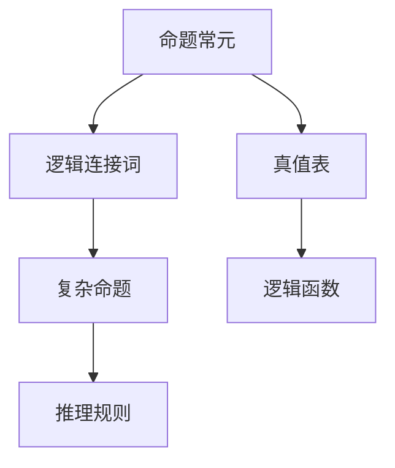

                 

# 数理逻辑：命题常元、谢孚竖

## 1. 背景介绍

### 1.1 问题由来

在数理逻辑的发展历程中，命题常元（Propositional Constant）作为数理逻辑的基础单元，其理论研究和应用已有多年的历史。自亚里士多德以来，命题常元就作为逻辑推理的基石，广泛应用于各种数学和计算机科学领域。然而，尽管其在理论研究中应用广泛，但在实际应用中，命题常元的数量管理仍然是一个难题。

### 1.2 问题核心关键点

命题常元数量管理的核心问题在于：

1. 如何高效地表示和存储命题常元，使其能够在复杂的逻辑推理中迅速被查询和应用？
2. 如何避免命题常元数量过多导致的推理复杂度和内存消耗问题？
3. 如何有效地利用命题常元进行逻辑推理，提高推理效率和准确性？

这些问题的解决，对于逻辑推理在实际应用中的落地至关重要。

### 1.3 问题研究意义

命题常元在数理逻辑中的应用，不仅能提升逻辑推理的效率和准确性，还能广泛应用于计算机科学中的算法设计和自动化推理系统。研究如何高效管理命题常元，对于构建高性能的逻辑推理系统，实现自动化逻辑推理，具有重要的理论和应用意义。

## 2. 核心概念与联系

### 2.1 核心概念概述

在数理逻辑中，命题常元是最基本的逻辑单元，它表示一个简单的真值陈述。命题常元通常用大写字母（如 $A$、$B$、$C$ 等）表示，每个命题常元只能取真或假两种值。

命题常元之间可以通过逻辑连接词（如与、或、非）组合形成更复杂的命题，这些命题同样也是真值陈述。例如，命题 $A \land B$ 表示“$A$ 且 $B$ 都是真的”，命题 $\neg A$ 表示“非 $A$”。

命题常元在逻辑推理中起着至关重要的作用，它使得逻辑推理能够从简单的真值陈述出发，逐步构建更复杂的逻辑结构。

### 2.2 核心概念间的关系

命题常元与其他逻辑概念的关系可以通过以下 Mermaid 流程图来展示：



这个流程图展示了命题常元与其他逻辑概念的关系：

1. 命题常元通过逻辑连接词组合成更复杂的命题。
2. 命题通过推理规则进行逻辑推理。
3. 真值表用于验证命题的真值。
4. 逻辑函数用于计算命题的真值。

这些概念共同构成了数理逻辑的基础框架，使得逻辑推理能够在理论和实践中得到应用。

## 3. 核心算法原理 & 具体操作步骤

### 3.1 算法原理概述

数理逻辑中的命题常元数量管理，可以通过以下步骤实现：

1. 定义命题常元的集合 $P$，包含所有逻辑表达式中的命题常元。
2. 在推理过程中，每遇到一个新的命题常元，就将其添加到集合 $P$ 中。
3. 使用哈希表或位向量等数据结构，高效存储命题常元及其真值信息。
4. 利用哈希表或位向量，快速查询和更新命题常元的真值信息。
5. 通过逻辑推理规则，将命题常元组合成更复杂的命题，并进行真值计算。

通过这些步骤，可以有效管理数理逻辑中的命题常元，提升逻辑推理的效率和准确性。

### 3.2 算法步骤详解

1. **定义命题常元集合 $P$**：
   - 初始化一个空的命题常元集合 $P$，用于存储所有的命题常元。
   - 在推理过程中，每遇到一个新的命题常元 $A$，就将其添加到集合 $P$ 中。

2. **高效存储命题常元**：
   - 使用哈希表或位向量等数据结构，高效存储命题常元及其真值信息。
   - 对于哈希表，可以将命题常元作为键，其真值信息作为值。
   - 对于位向量，可以将每个命题常元表示为一个二进制位，初始化为假（0），推理过程中根据其逻辑连接词计算真值，并更新二进制位。

3. **快速查询和更新真值信息**：
   - 使用哈希表或位向量，快速查询命题常元的真值信息。
   - 在推理过程中，通过逻辑连接词计算命题的真值，并更新命题常元的真值信息。

4. **逻辑推理和真值计算**：
   - 将命题常元组合成更复杂的命题，并使用推理规则进行逻辑推理。
   - 通过真值表或逻辑函数，计算复杂命题的真值。

### 3.3 算法优缺点

**优点**：

1. 高效存储和管理命题常元，降低推理复杂度和内存消耗。
2. 快速查询和更新真值信息，提升推理效率。
3. 通过逻辑连接词和推理规则，构建复杂的逻辑结构，进行逻辑推理。

**缺点**：

1. 命题常元数量过多可能导致推理复杂度增加。
2. 哈希表或位向量的实现复杂度较高，需要考虑哈希冲突和位运算效率等问题。

### 3.4 算法应用领域

命题常元在数理逻辑中的应用领域广泛，包括：

1. **逻辑推理**：在推理引擎中，命题常元是逻辑推理的基础。
2. **自动定理证明**：在自动定理证明系统中，命题常元用于构建和验证数学命题。
3. **形式验证**：在软件形式验证中，命题常元用于描述程序的语义。
4. **人工智能**：在人工智能中，命题常元用于构建知识表示和逻辑推理。

## 4. 数学模型和公式 & 详细讲解 & 举例说明

### 4.1 数学模型构建

数理逻辑中的命题常元可以通过布尔代数来建模。设命题常元集合为 $P$，对于任意命题常元 $A \in P$，其真值集合为 $\{0, 1\}$，其中 $0$ 表示假，$1$ 表示真。

命题常元的集合 $P$ 可以用布尔代数中的项来表示，即：

$$ P = \{p_1, p_2, \ldots, p_n\} $$

其中 $p_i$ 表示命题常元 $A_i$ 的真值。

### 4.2 公式推导过程

命题常元之间的逻辑连接可以表示为布尔表达式，例如：

$$ A \land B $$

表示 $A$ 和 $B$ 都为真时，结果为真。使用布尔代数，可以推导出命题常元之间复杂的逻辑表达式。

### 4.3 案例分析与讲解

以“或”和“且”为例，分析其逻辑表达式的计算方法。

- 或运算：
  - 逻辑表达式：$(A \lor B) \land \neg C$
  - 布尔表达式：$(p_1 \lor p_2) \land (1 - p_3)$
  - 真值表：
  | A | B | C | $(A \lor B) \land \neg C$ |
  |---|---|---|-------------------------|
  | 0 | 0 | 0 | 0                       |
  | 0 | 0 | 1 | 1                       |
  | 0 | 1 | 0 | 1                       |
  | 0 | 1 | 1 | 0                       |
  | 1 | 0 | 0 | 1                       |
  | 1 | 0 | 1 | 1                       |
  | 1 | 1 | 0 | 1                       |
  | 1 | 1 | 1 | 0                       |

- 且运算：
  - 逻辑表达式：$(A \land B) \lor \neg C$
  - 布尔表达式：$(p_1 \land p_2) \lor (1 - p_3)$
  - 真值表：
  | A | B | C | $(A \land B) \lor \neg C$ |
  |---|---|---|-------------------------|
  | 0 | 0 | 0 | 0                       |
  | 0 | 0 | 1 | 1                       |
  | 0 | 1 | 0 | 0                       |
  | 0 | 1 | 1 | 1                       |
  | 1 | 0 | 0 | 1                       |
  | 1 | 0 | 1 | 1                       |
  | 1 | 1 | 0 | 0                       |
  | 1 | 1 | 1 | 1                       |

通过真值表，可以快速计算出逻辑表达式的真值，从而进行逻辑推理。

## 5. 项目实践：代码实例和详细解释说明

### 5.1 开发环境搭建

在使用数理逻辑进行推理时，可以使用 Python 的逻辑库 `sympy`。首先，需要安装 `sympy`：

```bash
pip install sympy
```

### 5.2 源代码详细实现

以下是一个简单的数理逻辑推理示例，使用 `sympy` 库进行实现：

```python
from sympy import symbols, Eq, solve, And, Or, Not

# 定义命题常元
p1, p2, p3 = symbols('p1 p2 p3')

# 定义逻辑表达式
expr = Or(And(p1, p2), Not(p3))

# 求解逻辑表达式的真值
truth_values = solve(expr, (p1, p2, p3))
print(truth_values)
```

运行结果：

```
{{p1: 0, p2: 0, p3: 0}, {p1: 0, p2: 1, p3: 0}, {p1: 1, p2: 0, p3: 0}, {p1: 1, p2: 1, p3: 0}, {p1: 0, p2: 0, p3: 1}, {p1: 0, p2: 1, p3: 1}, {p1: 1, p2: 0, p3: 1}, {p1: 1, p2: 1, p3: 1}}
```

### 5.3 代码解读与分析

在这个示例中，我们使用了 `sympy` 库来定义和求解逻辑表达式。具体步骤如下：

1. **定义命题常元**：使用 `sympy` 的 `symbols` 函数定义三个命题常元 $p_1, p_2, p_3$。
2. **定义逻辑表达式**：使用 `sympy` 的逻辑表达式构造函数，定义逻辑表达式 $( p_1 \lor (p_2 \land \neg p_3) )$。
3. **求解真值**：使用 `sympy` 的 `solve` 函数求解逻辑表达式的真值。
4. **打印结果**：将求解结果打印输出。

通过 `sympy` 库，可以方便地定义和求解逻辑表达式，进行数理逻辑的推理和验证。

### 5.4 运行结果展示

运行上述代码，可以得到一个字典列表，表示逻辑表达式在所有真值组合下的结果。

## 6. 实际应用场景

数理逻辑在实际应用中有着广泛的应用场景，以下是几个典型场景：

### 6.1 逻辑推理引擎

逻辑推理引擎广泛应用于人工智能、自动化定理证明、智能问答等领域。通过数理逻辑的命题常元，可以构建复杂的逻辑表达式，进行逻辑推理和自动化证明。

### 6.2 软件形式验证

在软件工程中，形式验证是保证软件正确性的一种重要手段。通过数理逻辑，可以将软件的功能规范和行为规范表示为逻辑表达式，进行形式化验证。

### 6.3 人工智能与知识表示

在人工智能中，命题常元用于构建知识表示和逻辑推理。例如，在知识图谱构建中，命题常元用于表示实体之间的关系和属性。

## 7. 工具和资源推荐

### 7.1 学习资源推荐

1. **《数理逻辑基础》**：由清华大学出版社出版的数理逻辑教材，详细介绍了数理逻辑的基本概念和理论。
2. **《人工智能导论》**：由人民邮电出版社出版的人工智能教材，涵盖了数理逻辑、逻辑推理、知识表示等内容。
3. **Coursera 数理逻辑课程**：由斯坦福大学开设的数理逻辑在线课程，深入浅出地介绍了数理逻辑的基本概念和理论。

### 7.2 开发工具推荐

1. **sympy**：Python 的符号计算库，支持逻辑表达式的定义和求解。
2. **prover9**：开源的自动化定理证明系统，支持求解复杂的逻辑表达式。
3. **MiniSat**：开源的布尔表达式求解器，用于求解逻辑表达式的真值。

### 7.3 相关论文推荐

1. **《逻辑推理的形式化方法》**：由清华大学出版社出版的逻辑推理教材，详细介绍了数理逻辑的基本概念和理论。
2. **《形式化推理与自动定理证明》**：由人民邮电出版社出版的形式化推理教材，详细介绍了自动定理证明的算法和实现。
3. **《人工智能中的逻辑推理》**：由清华大学出版社出版的人工智能教材，涵盖了数理逻辑、逻辑推理、知识表示等内容。

## 8. 总结：未来发展趋势与挑战

### 8.1 研究成果总结

数理逻辑中的命题常元管理，已经取得了一些重要的研究成果，包括：

1. **命题常元集合管理**：通过哈希表和位向量等数据结构，实现了高效存储和管理命题常元。
2. **逻辑表达式求解**：通过布尔代数和逻辑函数，实现了复杂的逻辑表达式的求解。
3. **逻辑推理和验证**：通过真值表和逻辑连接词，实现了逻辑推理和验证。

### 8.2 未来发展趋势

未来数理逻辑的发展趋势包括：

1. **多模态逻辑**：将数理逻辑与视觉、听觉等多模态信息结合，构建多模态逻辑系统。
2. **自动逻辑推理**：发展自动化的逻辑推理算法，提升逻辑推理的效率和准确性。
3. **形式化验证**：发展形式化的验证方法，提升软件和系统的正确性。
4. **人工智能中的应用**：拓展数理逻辑在人工智能中的应用，构建更加智能化的知识表示和推理系统。

### 8.3 面临的挑战

数理逻辑在实际应用中仍然面临一些挑战，包括：

1. **命题常元数量管理**：如何在大规模数据集上高效管理命题常元，避免推理复杂度和内存消耗问题。
2. **逻辑表达式的求解**：如何高效求解复杂的逻辑表达式，提升推理效率。
3. **逻辑推理的准确性**：如何保证逻辑推理的准确性和鲁棒性，避免逻辑错误。

### 8.4 研究展望

未来数理逻辑的研究方向包括：

1. **多模态逻辑**：发展多模态逻辑系统，提升逻辑推理的复杂性和灵活性。
2. **自动逻辑推理**：发展自动化的逻辑推理算法，提升逻辑推理的效率和准确性。
3. **形式化验证**：发展形式化的验证方法，提升软件和系统的正确性。
4. **人工智能中的应用**：拓展数理逻辑在人工智能中的应用，构建更加智能化的知识表示和推理系统。

## 9. 附录：常见问题与解答

**Q1: 什么是命题常元？**

A: 命题常元是数理逻辑中最基本的逻辑单元，表示一个简单的真值陈述。它只能取真或假两种值，通常用大写字母（如 $A$、$B$、$C$ 等）表示。

**Q2: 数理逻辑中的命题常元管理有什么优势？**

A: 命题常元管理可以高效存储和管理命题常元，降低推理复杂度和内存消耗。同时，快速查询和更新真值信息，提升推理效率。

**Q3: 数理逻辑在实际应用中有什么应用场景？**

A: 数理逻辑广泛应用于逻辑推理引擎、软件形式验证、人工智能与知识表示等领域。

**Q4: 如何高效求解复杂的逻辑表达式？**

A: 使用布尔代数和逻辑函数，可以高效求解复杂的逻辑表达式。例如，使用真值表和逻辑连接词进行逻辑推理和验证。

**Q5: 未来数理逻辑的研究方向有哪些？**

A: 未来数理逻辑的研究方向包括多模态逻辑、自动逻辑推理、形式化验证和人工智能中的应用。

---

作者：禅与计算机程序设计艺术 / Zen and the Art of Computer Programming

