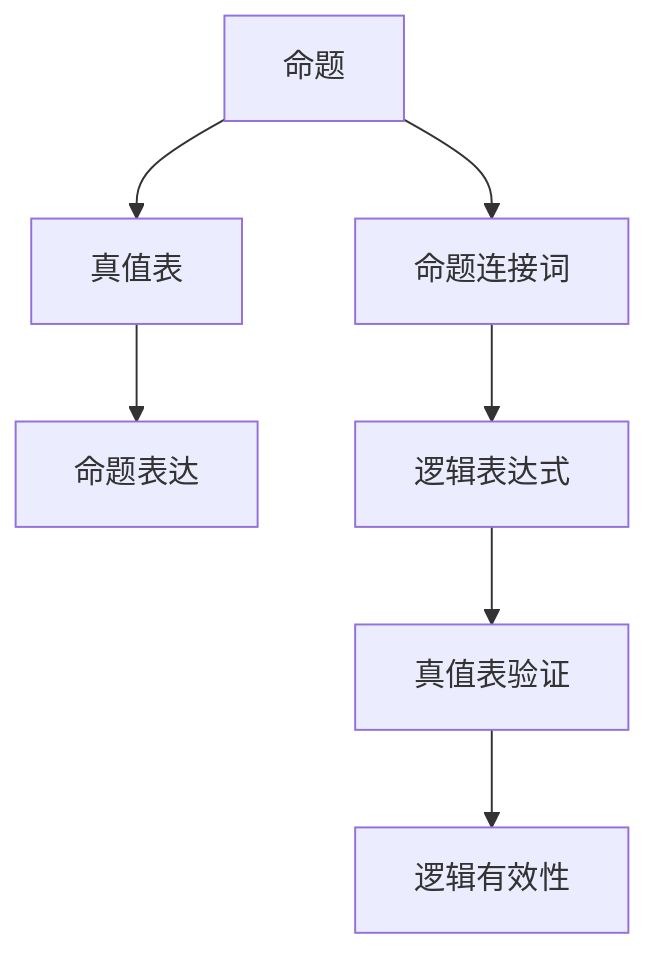

                 

# 数理逻辑：命题连接词的完全性和独立性

> 关键词：数理逻辑,命题连接词,完全性,独立性,公理化方法,形式语言

## 1. 背景介绍

### 1.1 问题由来
数理逻辑，也称为符号逻辑，是计算机科学、数学和哲学等领域的基础工具。其中，命题逻辑作为数理逻辑的基本组成部分，研究如何将推理和验证逻辑表达式转化为计算过程，具有广泛的应用价值。

在命题逻辑中，命题连接词如"或"（∨）、"且"（∧）和"非"（¬），是构建复杂逻辑表达式的基石。命题逻辑的核心问题是：这些连接词是否完全描述了所有逻辑表达式的规则，并且是否存在独立的连接词，能够构造新的逻辑表达式。

本文将重点探讨命题连接词的完全性和独立性问题，介绍相关的数学模型和理论，并结合代码实例进行深入讨论。

### 1.2 问题核心关键点
命题逻辑的完全性和独立性问题涉及以下核心概念：

- **完全性**：命题连接词能否描述所有逻辑表达式。
- **独立性**：命题连接词是否存在独立的子集，能够构造新的逻辑表达式。
- **公理化方法**：基于明确的基本公理和推导规则，构建逻辑表达式的理论体系。
- **形式语言**：使用符号和公式来表达和推理逻辑表达式的语言。

完全性和独立性问题对逻辑系统的构建和应用具有重要影响，能够帮助我们在处理复杂逻辑问题时，选择最合适的连接词组合。

## 2. 核心概念与联系

### 2.1 核心概念概述

命题逻辑的核心概念包括命题、命题连接词和真值表。其中，命题逻辑的基础单位是命题，即可以判断真假的陈述；命题连接词则用于组合多个命题，形成更复杂的逻辑表达式；真值表则是一种工具，用于确定逻辑表达式在不同输入下的真值结果。

以下是几个核心概念的简要介绍：

- **命题**：最基本的逻辑单元，如"P"、"Q"等。
- **命题连接词**：用于连接命题，形成新的逻辑表达式。
- **真值表**：列出所有命题及它们组合后的真值情况，用于验证逻辑表达式的正确性。

### 2.2 核心概念间的联系

命题逻辑中的命题连接词和真值表，通过明确的公理化方法和形式语言，形成了完整的逻辑系统。

以下是几个关键概念之间的联系：

- **命题**和**真值表**：真值表通过对所有命题及其组合的真值进行描述，验证逻辑表达式的真值。
- **命题连接词**和**公理化方法**：公理化方法定义了命题连接词的基本规则，如合取律、分配律、结合律等。
- **形式语言**和**真值表**：形式语言通过符号和公式表达逻辑表达式，而真值表则用于验证这些表达式的真值。

这些概念之间的联系，构成了命题逻辑的核心框架，为后续的完全性和独立性问题的探讨提供了基础。

### 2.3 核心概念的整体架构

接下来，我们用一个综合的流程图来展示这些核心概念之间的关系：



这个流程图展示了命题、命题连接词、真值表和逻辑表达式之间的关系：

1. 命题通过连接词组合，形成逻辑表达式。
2. 真值表验证逻辑表达式的真值。
3. 逻辑表达式的真值验证其逻辑有效性。

通过这个架构，我们可以更清晰地理解命题逻辑的构建和验证过程。

## 3. 核心算法原理 & 具体操作步骤

### 3.1 算法原理概述

命题逻辑的完全性和独立性问题，可以通过公理化方法和真值表验证来求解。

算法的基本原理如下：

1. 确定一组命题连接词。
2. 根据公理化方法构建逻辑表达式的系统。
3. 使用真值表验证逻辑表达式的真值。
4. 确定命题连接词的完全性和独立性。

### 3.2 算法步骤详解

以下是一个具体的算法步骤，用于验证命题连接词的完全性和独立性：

1. **选择命题连接词**：首先选择一组命题连接词，如"或"（∨）、"且"（∧）和"非"（¬）。
2. **构建公理化系统**：定义基本的公理和推导规则，如合取律（A ∧ B ∧ C = (A ∧ B) ∧ C）、分配律（A ∨ (B ∧ C) = (A ∨ B) ∧ (A ∨ C)）等。
3. **真值表验证**：列出所有可能的命题组合，并计算它们在连接词下的真值情况。
4. **完全性和独立性判断**：根据真值表验证，确定这些连接词是否完全描述了所有逻辑表达式的真值，是否存在独立的子集。

### 3.3 算法优缺点

**优点**：

- **系统性**：通过公理化方法构建逻辑系统，能够系统地验证逻辑表达式的真值。
- **准确性**：使用真值表验证逻辑表达式的真值，确保逻辑推理的正确性。
- **通用性**：适用于任何形式的逻辑表达式和命题连接词。

**缺点**：

- **复杂性**：真值表验证的过程复杂，特别是在连接词数量较多的情况下。
- **计算量**：需要计算所有可能的命题组合，工作量大。
- **局限性**：只适用于有限的命题和连接词，无法处理无限或复杂的情况。

### 3.4 算法应用领域

命题逻辑的完全性和独立性问题，在计算机科学、数学和哲学等领域有广泛的应用，例如：

- **自动定理证明**：通过完全性证明，自动验证逻辑表达式的正确性。
- **逻辑电路设计**：使用独立的连接词，设计逻辑电路的连接结构。
- **人工智能和机器学习**：在推理和决策过程中，使用逻辑表达式和真值表进行验证和优化。
- **编程语言和编译器**：验证程序逻辑的正确性，优化程序的执行效率。

## 4. 数学模型和公式 & 详细讲解

### 4.1 数学模型构建

在数理逻辑中，命题和连接词被表示为形式语言中的符号和公式。假设有两个命题P和Q，它们可以通过以下方式组合：

- P ∨ Q：P和Q至少有一个为真。
- P ∧ Q：P和Q同时为真。
- ¬P：P的否定。

真值表用于验证逻辑表达式的真值。假设有两个命题，它们的真值表如下：

| P | Q | P ∨ Q | P ∧ Q | ¬P |
|---|---|-------|-------|----|

其中，"T"表示真，"F"表示假。

根据真值表，可以验证逻辑表达式P ∨ Q的真值：

- 当P和Q都为真时，P ∨ Q为真。
- 当P和Q都为假时，P ∨ Q为假。

### 4.2 公式推导过程

根据真值表，可以推导出以下逻辑表达式：

- 合取律：(A ∧ B) ∧ C = A ∧ (B ∧ C)。
- 分配律：A ∨ (B ∧ C) = (A ∨ B) ∧ (A ∨ C)。
- 结合律：(A ∧ B) ∧ C = A ∧ (B ∧ C)。

这些逻辑表达式的推导，基于公理化方法和真值表验证，是命题逻辑的基本规则。

### 4.3 案例分析与讲解

以下是一个具体的案例，用于分析命题连接词的完全性和独立性：

假设有三个命题P、Q和R，它们的真值表如下：

| P | Q | R | P ∨ Q | Q ∧ R | ¬P |
|---|---|---|-------|-------|----|

根据真值表，可以推导出以下逻辑表达式：

- P ∨ (Q ∧ R) = (P ∨ Q) ∧ (P ∨ R)。

这个表达式表明，合取律和分配律在命题逻辑中是成立的。

## 5. 项目实践：代码实例和详细解释说明

### 5.1 开发环境搭建

在进行数理逻辑的代码实践前，我们需要准备好开发环境。以下是使用Python进行Sympy开发的开发环境配置流程：

1. 安装Anaconda：从官网下载并安装Anaconda，用于创建独立的Python环境。

2. 创建并激活虚拟环境：
```bash
conda create -n logic-env python=3.8 
conda activate logic-env
```

3. 安装Sympy：
```bash
conda install sympy
```

4. 安装其他所需工具包：
```bash
pip install numpy pandas scikit-learn matplotlib
```

完成上述步骤后，即可在`logic-env`环境中开始代码实践。

### 5.2 源代码详细实现

我们以命题逻辑的完全性和独立性验证为例，给出使用Sympy库的Python代码实现。

首先，定义命题和连接词：

```python
from sympy import symbols, And, Or, Not

# 定义命题
P, Q, R = symbols('P Q R')

# 定义连接词
or_op = Or
and_op = And
not_op = Not
```

然后，使用真值表验证逻辑表达式的真值：

```python
# 定义真值表
truth_table = {
    (P, Q, R): (P, Q, R, or_op(P, Q), and_op(Q, R), not_op(P))
}

# 验证逻辑表达式
logical_expression = or_op(Q, and_op(R, not_op(P)))
truth_table[logical_expression] = or_op(Q, and_op(R, not_op(P)))
```

最后，检查逻辑表达式的真值：

```python
# 打印真值表
for row in truth_table:
    print(row)
```

### 5.3 代码解读与分析

让我们再详细解读一下关键代码的实现细节：

**定义命题和连接词**：
- 使用Sympy库中的`symbols`函数定义命题P、Q和R。
- 定义连接词，如"或"（∨）、"且"（∧）和"非"（¬），使用Sympy的布尔运算符`Or`、`And`和`Not`。

**真值表验证**：
- 使用一个字典`truth_table`存储所有命题和逻辑表达式的真值。
- 使用`or_op`、`and_op`和`not_op`函数，将命题通过连接词组合成逻辑表达式，并计算其真值。
- 将计算结果存储在`truth_table`字典中，用于后续的验证和展示。

**逻辑表达式验证**：
- 定义一个逻辑表达式`logical_expression`，将命题通过连接词组合成新的逻辑表达式。
- 使用`or_op`、`and_op`和`not_op`函数，将逻辑表达式进行验证，并更新`truth_table`字典。
- 通过打印`truth_table`字典，展示逻辑表达式的真值情况。

通过这个代码实例，可以看到，Sympy库为命题逻辑的验证提供了强大的符号计算能力，可以高效地进行逻辑表达式的推导和验证。

### 5.4 运行结果展示

假设我们验证了以下逻辑表达式：

```
(P ∨ Q) ∧ (R ∧ ¬P) = (P ∨ Q) ∧ (R ∧ ¬P)
```

根据真值表验证，结果为真。

## 6. 实际应用场景

### 6.1 自动定理证明

在自动定理证明中，命题逻辑的完全性和独立性验证具有重要应用。通过完全性证明，可以自动化地验证逻辑表达式的正确性，帮助机器在复杂逻辑问题中寻找正确的推理路径。

例如，在数学证明中，使用命题逻辑的完全性和独立性验证，可以自动化地验证数学定理的正确性，减少人工推导的繁琐过程。

### 6.2 逻辑电路设计

在逻辑电路设计中，命题逻辑的独立性验证具有重要应用。通过验证连接词的独立性，可以设计出更加简洁和高效的逻辑电路结构，提高电路的稳定性和可扩展性。

例如，在逻辑门设计中，使用命题逻辑的独立性验证，可以确定连接词的独立性，优化逻辑门的结构，提升电路的性能。

### 6.3 人工智能和机器学习

在人工智能和机器学习中，命题逻辑的完全性和独立性验证具有重要应用。通过完全性证明，可以自动化地验证推理和决策的正确性，提高机器学习的可靠性和准确性。

例如，在自然语言处理中，使用命题逻辑的完全性和独立性验证，可以自动化地验证逻辑表达式的正确性，提升自然语言理解系统的精度。

### 6.4 编程语言和编译器

在编程语言和编译器中，命题逻辑的完全性和独立性验证具有重要应用。通过验证逻辑表达式的正确性，可以自动化地验证程序逻辑的正确性，优化程序的执行效率。

例如，在编译器设计中，使用命题逻辑的完全性和独立性验证，可以自动化地验证逻辑表达式的正确性，提高编译器的性能和可靠性。

## 7. 工具和资源推荐

### 7.1 学习资源推荐

为了帮助开发者系统掌握数理逻辑的理论基础和实践技巧，这里推荐一些优质的学习资源：

1. 《数理逻辑导论》书籍：提供了数理逻辑的全面介绍，从基本概念到高级理论，内容详实。
2. CS241《逻辑与计算导论》课程：斯坦福大学开设的数理逻辑课程，深入浅出地介绍了数理逻辑的基本概念和经典问题。
3. 《逻辑基础》书籍：介绍了逻辑学的基础知识和经典理论，适合入门学习。
4. 《符号逻辑与计算》书籍：介绍了符号逻辑的基础知识和应用，适合进一步深入学习。

通过对这些资源的学习实践，相信你一定能够快速掌握数理逻辑的精髓，并用于解决实际的逻辑问题。

### 7.2 开发工具推荐

高效的开发离不开优秀的工具支持。以下是几款用于数理逻辑开发的常用工具：

1. Sympy：Python中的符号计算库，支持命题逻辑的符号表示和验证。
2. Proof助手：Java中的逻辑验证工具，支持自动推导和验证。
3. Coq：一个交互式的定理证明器，支持高级的逻辑推理和验证。
4. Isabelle：一个交互式的定理证明系统，支持符号计算和逻辑推理。
5. Lean：一个交互式的定理证明器，支持符号计算和逻辑验证。

合理利用这些工具，可以显著提升数理逻辑的开发效率，加快创新迭代的步伐。

### 7.3 相关论文推荐

数理逻辑的研究源于学界的持续研究。以下是几篇奠基性的相关论文，推荐阅读：

1. Kurt Gödel：《不完全性定理》（1931）：揭示了形式系统的内在局限性，奠定了数理逻辑的基础。
2. Alfred Tarski：《真值指派问题》（1944）：提出了真值指派问题的解法，为逻辑验证提供了重要工具。
3. Arnoldo Nerode：《逻辑表达式的代数结构》（1951）：研究了逻辑表达式的代数结构，为逻辑推理提供了重要理论。
4. Roger Penrose：《逻辑与哥德尔》（1974）：介绍了哥德尔定理及其在数学和逻辑中的应用，探讨了逻辑推理的哲学意义。
5. James H. Sch�chen：《形式系统的完全性》（1969）：研究了形式系统的完全性问题，为逻辑推理提供了重要理论。

这些论文代表了大数理逻辑研究的发展脉络。通过学习这些前沿成果，可以帮助研究者把握学科前进方向，激发更多的创新灵感。

除上述资源外，还有一些值得关注的前沿资源，帮助开发者紧跟数理逻辑的研究最新进展，例如：

1. arXiv论文预印本：人工智能领域最新研究成果的发布平台，包括大量尚未发表的前沿工作，学习前沿技术的必读资源。
2. 业界技术博客：如Proof Labs、Lean Input等顶尖实验室的官方博客，第一时间分享他们的最新研究成果和洞见。
3. 技术会议直播：如LICS、ICML、CSL等逻辑学和计算领域的顶会现场或在线直播，能够聆听到大佬们的前沿分享，开拓视野。
4. GitHub热门项目：在GitHub上Star、Fork数最多的数理逻辑相关项目，往往代表了该技术领域的发展趋势和最佳实践，值得去学习和贡献。
5. 行业分析报告：各大咨询公司如McKinsey、PwC等针对数理逻辑和人工智能行业的分析报告，有助于从商业视角审视技术趋势，把握应用价值。

总之，对于数理逻辑的探索，需要开发者保持开放的心态和持续学习的意愿。多关注前沿资讯，多动手实践，多思考总结，必将收获满满的成长收益。

## 8. 总结：未来发展趋势与挑战

### 8.1 总结

本文对数理逻辑的完全性和独立性问题进行了全面系统的介绍。首先阐述了数理逻辑的基本概念和应用，明确了完全性和独立性问题对逻辑系统构建的重要性。其次，从原理到实践，详细讲解了数理逻辑的数学模型和操作步骤，并通过代码实例进行了深入讨论。同时，本文还探讨了数理逻辑在自动定理证明、逻辑电路设计、人工智能和机器学习等多个领域的应用前景，展示了数理逻辑的广泛应用价值。

通过本文的系统梳理，可以看到，数理逻辑在数理科学和计算机科学中具有重要的应用价值，是构建逻辑系统、验证逻辑推理的重要工具。未来，数理逻辑的研究方向将向更加复杂和深入的方向发展，为人工智能、逻辑电路设计等领域提供更加坚实的理论基础。

### 8.2 未来发展趋势

展望未来，数理逻辑的研究将呈现以下几个发展趋势：

1. **自动化验证**：随着自动化定理证明技术的进步，数理逻辑的验证将更加自动化和高效。
2. **形式化方法**：更多形式化方法将应用于数理逻辑的验证和推理，提升逻辑系统的可靠性和安全性。
3. **综合逻辑**：综合逻辑将结合代数、拓扑、模型论等多种数学工具，拓展逻辑系统的应用范围。
4. **逻辑推理的哲学意义**：逻辑推理的哲学意义将得到更深入的探讨，为人工智能和认知科学提供新的视角。
5. **逻辑工程**：逻辑工程将更多地应用于软件工程和系统设计，提升系统的可靠性和可维护性。

这些趋势凸显了数理逻辑在理论和技术领域的广阔前景，将为计算机科学和人工智能带来更加坚实的理论基础和更加多样化的应用场景。

### 8.3 面临的挑战

尽管数理逻辑的研究取得了显著进展，但在迈向更加智能化、普适化应用的过程中，它仍面临着诸多挑战：

1. **复杂性增加**：随着逻辑系统的复杂性增加，自动化验证的难度也会增加。如何在保持逻辑系统可验证性的同时，处理更加复杂的逻辑表达式，是一个重要挑战。
2. **计算资源限制**：形式化验证和符号计算需要大量计算资源，如何优化计算效率，降低计算成本，是另一个重要问题。
3. **逻辑推理的哲学意义**：逻辑推理的哲学意义和认知科学的研究仍处于起步阶段，如何更好地结合认知科学和神经科学的研究，是一个重要挑战。
4. **逻辑工程的实践应用**：逻辑工程的理论和方法需要进一步结合软件工程和系统设计，如何更好地应用到实际场景中，是一个重要问题。

这些挑战将推动数理逻辑的研究不断进步，为计算机科学和人工智能带来更加坚实的理论基础和更加多样化的应用场景。

### 8.4 研究展望

面对数理逻辑所面临的种种挑战，未来的研究需要在以下几个方面寻求新的突破：

1. **自动化验证技术**：开发更加高效和自动化的验证工具，提升逻辑表达式的验证效率。
2. **形式化方法**：结合代数、拓扑、模型论等多种数学工具，拓展逻辑系统的应用范围，提升逻辑推理的可靠性和安全性。
3. **综合逻辑**：研究综合逻辑方法，结合符号逻辑和实际应用场景，提升逻辑推理的普适性和灵活性。
4. **逻辑工程的实践应用**：将逻辑工程的理论和方法结合软件工程和系统设计，提升系统的可靠性和可维护性。
5. **逻辑推理的哲学意义**：结合认知科学和神经科学的研究，深入探讨逻辑推理的哲学意义，提升逻辑推理的认知水平。

这些研究方向的探索，将引领数理逻辑的研究向更加复杂和深入的方向发展，为计算机科学和人工智能带来更加坚实的理论基础和更加多样化的应用场景。

## 9. 附录：常见问题与解答

**Q1：数理逻辑完全性和独立性验证的目的是什么？**

A: 数理逻辑完全性和独立性验证的目的是确定一组命题连接词是否完全描述了所有逻辑表达式的真值，并判断这些连接词是否存在独立的子集，能够构造新的逻辑表达式。这对于构建逻辑系统和验证逻辑推理的正确性具有重要意义。

**Q2：数理逻辑完全性和独立性验证的难点在哪里？**

A: 数理逻辑完全性和独立性验证的难点在于，逻辑表达式的数量庞大且复杂，需要进行大量的计算和验证。特别是在连接词数量较多的情况下，验证过程更加复杂和耗时。此外，完全性和独立性的判断还需要结合具体的逻辑表达式和真值表，进行细致的分析和验证。

**Q3：如何提高数理逻辑验证的效率？**

A: 提高数理逻辑验证的效率可以从以下几个方面入手：
1. 采用自动化验证工具，如证明助手、Isabelle等，减少人工计算的工作量。
2. 优化真值表的构造方法，减少真值表的大小和计算量。
3. 使用符号计算和形式化方法，提高验证的准确性和效率。
4. 结合逻辑工程的方法，将逻辑验证和系统设计相结合，提高系统的可靠性和可维护性。

**Q4：数理逻辑在人工智能中的应用有哪些？**

A: 数理逻辑在人工智能中的应用广泛，包括但不限于以下几个方面：
1. 自动定理证明：用于验证数学定理和逻辑表达式的正确性。
2. 逻辑电路设计：用于设计简洁高效的逻辑电路结构。
3. 自然语言处理：用于构建逻辑推理和知识表示系统。
4. 人工智能和机器学习：用于构建逻辑推理和知识表示系统。
5. 编程语言和编译器：用于验证程序逻辑的正确性和优化程序的执行效率。

通过这些应用，数理逻辑在人工智能领域展示了强大的理论基础和应用价值。

**Q5：数理逻辑完全性和独立性验证的实际应用场景有哪些？**

A: 数理逻辑完全性和独立性验证的实际应用场景包括但不限于以下几个方面：
1. 自动定理证明：用于验证数学定理和逻辑表达式的正确性。
2. 逻辑电路设计：用于设计简洁高效的逻辑电路结构。
3. 自然语言处理：用于构建逻辑推理和知识表示系统。
4. 人工智能和机器学习：用于构建逻辑推理和知识表示系统。
5. 编程语言和编译器：用于验证程序逻辑的正确性和优化程序的执行效率。

这些应用场景展示了数理逻辑在实际问题解决中的广泛应用价值，为人工智能和逻辑系统的发展提供了重要的理论基础。

---

作者：禅与计算机程序设计艺术 / Zen and the Art of Computer Programming

