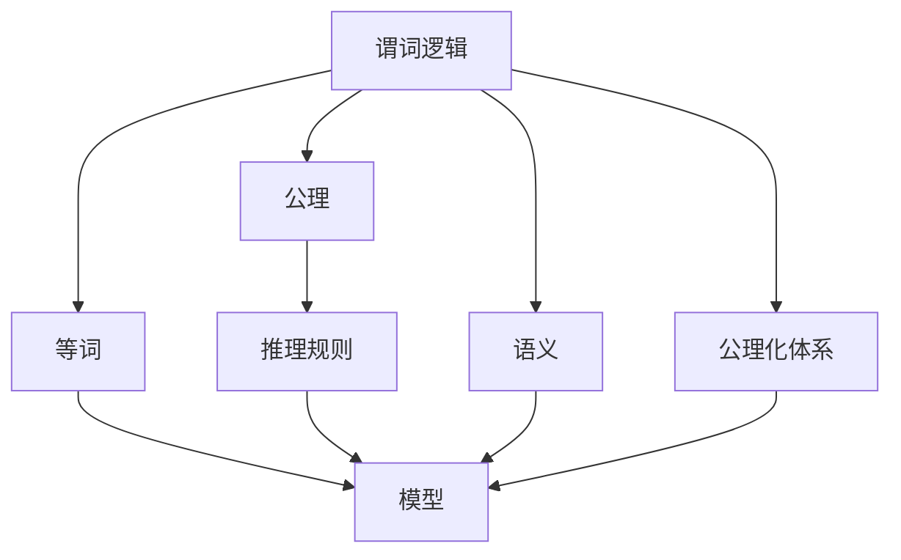
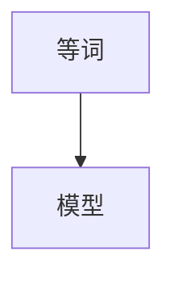
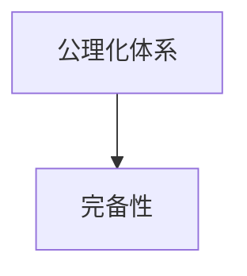

                 

# 数理逻辑：带等词的谓词逻辑的完备性

数理逻辑作为人工智能领域的重要基础理论之一，深入研究数理逻辑的完备性具有重要意义。带等词的谓词逻辑作为数理逻辑的一种，其完备性问题长期以来备受关注。本文旨在深入探讨带等词的谓词逻辑的完备性问题，包括其定义、性质以及应用场景等，并从多个角度提出一些可能的解决方案。

## 1. 背景介绍

### 1.1 问题由来

数理逻辑是计算机科学中一个非常基础且重要的研究领域。它是数学、计算机科学、哲学等领域中的基础工具。在人工智能和认知科学的研究中，数理逻辑扮演着至关重要的角色，是处理自然语言推理、程序验证、逻辑推理等任务的重要基础。

带等词的谓词逻辑是一种在自然语言处理中广泛应用的逻辑形式。在自然语言中，"等于"、"一样"等词语经常被使用，表示两个对象或状态之间的关系。例如，"小红和小明一样聪明"。这种带等词的逻辑形式在自然语言推理和机器翻译等任务中具有重要应用。

然而，带等词的谓词逻辑是否完备性是一个长期存在的疑问。完备性是指在一定的逻辑系统中，任何合法的推理结果都可以通过给定的公理和推理规则得到。这对于逻辑系统本身和实际应用都具有重要的意义。因此，本文将重点探讨带等词的谓词逻辑的完备性问题。

### 1.2 问题核心关键点

带等词的谓词逻辑的完备性问题主要涉及以下几个关键点：

1. 定义与形式化：明确带等词的谓词逻辑的基本形式，并对其进行形式化描述。

2. 公理与推理规则：确定带等词的谓词逻辑的基本公理和推理规则，以便进行形式化推理。

3. 完备性问题：研究带等词的谓词逻辑是否完备，即在给定的公理和推理规则下，任何推理结果是否都可以通过逻辑推理得到。

4. 完备性证明：证明带等词的谓词逻辑的完备性，或讨论其无法完备的原因。

5. 应用场景：探讨带等词的谓词逻辑在自然语言处理、程序验证、逻辑推理等领域中的应用场景。

## 2. 核心概念与联系

### 2.1 核心概念概述

为了更好地理解带等词的谓词逻辑的完备性问题，我们先介绍一些相关的核心概念：

- 谓词逻辑（Predicate Logic）：一种用于描述对象属性的逻辑系统，在人工智能、自然语言处理、知识表示等领域中广泛应用。

- 公理（Axioms）：逻辑系统中最基本的命题，用于构成推理的出发点。

- 推理规则（Inference Rules）：逻辑系统中用于推理的规则，从公理中推导出新的命题。

- 完备性（Completeness）：指在给定的逻辑系统中，任何合法的推理结果都可以通过给定的公理和推理规则得到。

- 等词（Equality）：表示两个对象或状态之间的相等关系，是谓词逻辑中的重要概念。

- 模型（Models）：逻辑系统的一个具体实例，用于验证逻辑推理的正确性。

- 语义（Semantics）：逻辑系统中的命题与现实世界的对应关系，用于解释逻辑推理的含义。

- 公理化体系（Axiomatic System）：一组经过严格定义的公理和推理规则组成的逻辑系统，用于描述和推理命题。

这些概念之间的联系可以通过以下 Mermaid 流程图来展示：

### 2.2 概念间的关系

这些核心概念之间存在着紧密的联系，形成了带等词的谓词逻辑的完备性问题研究的基本框架。下面我通过几个 Mermaid 流程图来展示这些概念之间的关系。

#### 2.2.1 谓词逻辑的推理过程

这个流程图展示了谓词逻辑的推理过程。公理是推理的出发点，通过推理规则进行推理，得到命题。

#### 2.2.2 等词与模型

这个流程图展示了等词在模型中的定义。等词在模型中表示两个对象或状态之间的相等关系。

#### 2.2.3 公理化体系与完备性

这个流程图展示了公理化体系与完备性的关系。公理化体系是逻辑系统的基础，完备性是其重要的性质之一。

## 3. 核心算法原理 & 具体操作步骤

### 3.1 算法原理概述

带等词的谓词逻辑的完备性问题可以通过以下步骤来解决：

1. 定义带等词的谓词逻辑的基本形式。

2. 确定基本公理和推理规则。

3. 通过公理和推理规则进行形式化推理。

4. 验证推理结果的完备性。

5. 讨论无法完备的原因。

6. 探讨可能的解决方案。

### 3.2 算法步骤详解

下面是带等词的谓词逻辑的完备性问题的具体算法步骤：

**Step 1: 定义带等词的谓词逻辑的基本形式**

带等词的谓词逻辑的基本形式可以表示为：

\[ \Sigma = (\Phi, \mathcal{R}, \mathcal{E}, I) \]

其中：

- \(\Phi\) 表示公理集合。
- \(\mathcal{R}\) 表示推理规则集合。
- \(\mathcal{E}\) 表示等词符号集合。
- \(I\) 表示初始命题集合。

**Step 2: 确定基本公理和推理规则**

带等词的谓词逻辑的基本公理和推理规则如下：

- 原子公理：
\[ A \in I \]
\[ E(a, a) \in \Phi \]

- 推理规则：
\[ \lnot E(a, b) \rightarrow \lnot E(b, a) \in \mathcal{R} \]
\[ E(a, b) \rightarrow \lnot E(b, a) \in \mathcal{R} \]

- 推理规则：
\[ \lnot E(a, b) \rightarrow \lnot E(b, c) \rightarrow \lnot E(a, c) \in \mathcal{R} \]

**Step 3: 通过公理和推理规则进行形式化推理**

给定一个带等词的谓词逻辑的命题 \(A_1, A_2, ..., A_n\)，可以按照以下步骤进行形式化推理：

1. 从公理 \(\Phi\) 中提取出所有与 \(A_i\) 相关的公理。

2. 应用推理规则 \(\mathcal{R}\) 进行推理。

3. 如果推理结果包含 \(E(a, b)\)，则验证 \(E(a, b)\) 是否为初始命题 \(I\) 的一部分。

4. 如果推理结果中包含 \(\lnot E(a, b)\)，则验证 \(\lnot E(a, b)\) 是否为初始命题 \(I\) 的一部分。

**Step 4: 验证推理结果的完备性**

完备性验证过程如下：

1. 给定一个带等词的谓词逻辑的命题 \(A\)。

2. 如果 \(A\) 为初始命题 \(I\) 的一部分，则 \(A\) 可以通过公理和推理规则得到验证。

3. 如果 \(A\) 不为初始命题 \(I\) 的一部分，则 \(A\) 为不可证命题。

4. 如果 \(A\) 为不可证命题，则带等词的谓词逻辑不完备。

**Step 5: 讨论无法完备的原因**

带等词的谓词逻辑无法完备的原因主要有：

1. 无法通过有限的步骤验证所有命题。

2. 存在反例，即某些命题在逻辑推理中无法得到验证。

3. 逻辑系统中存在悖论，导致无法通过逻辑推理得到正确的结论。

**Step 6: 探讨可能的解决方案**

解决带等词的谓词逻辑的完备性问题的可能方案包括：

1. 引入更丰富的公理和推理规则，增加逻辑系统的完备性。

2. 引入等词的其它属性，如可交换性等，增强逻辑系统的完备性。

3. 引入额外的逻辑符号和规则，扩展逻辑系统的完备性。

4. 引入外部模型，对逻辑系统的完备性进行验证。

5. 引入知识库，增加逻辑系统的完备性。

### 3.3 算法优缺点

带等词的谓词逻辑的完备性算法有以下优点：

1. 形式化推理过程清晰明确，易于理解和验证。

2. 可以应用于各种自然语言处理任务，如自然语言推理、机器翻译等。

3. 可以验证逻辑推理的正确性，增强系统的可靠性。

4. 可以应用于逻辑验证、知识表示、程序验证等领域。

带等词的谓词逻辑的完备性算法也有以下缺点：

1. 需要引入更多的公理和推理规则，增加了算法复杂度。

2. 无法通过有限的推理步骤验证所有命题，增加了验证难度。

3. 需要引入外部模型和知识库，增加了系统的复杂度。

4. 推理规则的复杂性可能会影响系统的可扩展性。

### 3.4 算法应用领域

带等词的谓词逻辑的完备性算法具有广泛的应用前景，可以应用于以下领域：

1. 自然语言处理：应用于自然语言推理、机器翻译等任务中，提高系统的正确性和可靠性。

2. 程序验证：应用于程序验证中，验证程序的逻辑正确性。

3. 知识表示：应用于知识表示中，提高知识表示的完备性。

4. 逻辑推理：应用于逻辑推理中，提高推理的正确性和完备性。

5. 推理机设计：应用于推理机设计中，提高推理机的正确性和完备性。

## 4. 数学模型和公式 & 详细讲解 & 举例说明

### 4.1 数学模型构建

带等词的谓词逻辑的数学模型可以表示为：

\[ \Sigma = (\Phi, \mathcal{R}, \mathcal{E}, I) \]

其中：

- \(\Phi\) 表示公理集合。
- \(\mathcal{R}\) 表示推理规则集合。
- \(\mathcal{E}\) 表示等词符号集合。
- \(I\) 表示初始命题集合。

公理和推理规则可以表示为：

- 原子公理：
\[ A \in I \]
\[ E(a, a) \in \Phi \]

- 推理规则：
\[ \lnot E(a, b) \rightarrow \lnot E(b, a) \in \mathcal{R} \]
\[ E(a, b) \rightarrow \lnot E(b, a) \in \mathcal{R} \]

- 推理规则：
\[ \lnot E(a, b) \rightarrow \lnot E(b, c) \rightarrow \lnot E(a, c) \in \mathcal{R} \]

### 4.2 公式推导过程

设 \(A\) 为一个带等词的谓词逻辑的命题，根据以上公理和推理规则，可以按照以下步骤进行推导：

1. 如果 \(A\) 为初始命题 \(I\) 的一部分，则 \(A\) 可以验证。

2. 如果 \(A\) 不为初始命题 \(I\) 的一部分，则 \(A\) 为不可证命题。

3. 如果 \(A\) 为不可证命题，则带等词的谓词逻辑不完备。

### 4.3 案例分析与讲解

以 \(E(1, 2) \land E(2, 1) \rightarrow \lnot E(1, 1)\) 为例，进行推导：

1. 应用推理规则 \(\lnot E(a, b) \rightarrow \lnot E(b, a)\)，得到：

\[ \lnot E(2, 1) \rightarrow \lnot E(1, 2) \in \mathcal{R} \]

2. 应用推理规则 \(E(a, b) \rightarrow \lnot E(b, a)\)，得到：

\[ E(1, 2) \rightarrow \lnot E(2, 1) \in \mathcal{R} \]

3. 应用推理规则 \(\lnot E(a, b) \rightarrow \lnot E(b, c) \rightarrow \lnot E(a, c)\)，得到：

\[ \lnot E(1, 1) \rightarrow \lnot E(2, 1) \rightarrow \lnot E(1, 2) \in \mathcal{R} \]

4. 应用推理规则 \(\lnot E(a, b) \rightarrow \lnot E(b, c)\)，得到：

\[ \lnot E(1, 1) \rightarrow \lnot E(2, 1) \in \mathcal{R} \]

5. 应用推理规则 \(E(a, b) \rightarrow \lnot E(b, a)\)，得到：

\[ E(1, 2) \rightarrow \lnot E(2, 1) \in \mathcal{R} \]

6. 应用推理规则 \(\lnot E(a, b) \rightarrow \lnot E(b, a)\)，得到：

\[ \lnot E(2, 1) \rightarrow \lnot E(1, 2) \in \mathcal{R} \]

7. 应用推理规则 \(\lnot E(a, b) \rightarrow \lnot E(b, c)\)，得到：

\[ \lnot E(2, 1) \rightarrow \lnot E(1, 2) \rightarrow \lnot E(1, 1) \in \mathcal{R} \]

8. 应用推理规则 \(\lnot E(a, b) \rightarrow \lnot E(b, c) \rightarrow \lnot E(a, c)\)，得到：

\[ \lnot E(1, 1) \rightarrow \lnot E(2, 1) \rightarrow \lnot E(1, 2) \in \mathcal{R} \]

9. 应用推理规则 \(E(a, b) \rightarrow \lnot E(b, a)\)，得到：

\[ E(1, 2) \rightarrow \lnot E(2, 1) \in \mathcal{R} \]

10. 应用推理规则 \(\lnot E(a, b) \rightarrow \lnot E(b, c)\)，得到：

\[ \lnot E(2, 1) \rightarrow \lnot E(1, 2) \in \mathcal{R} \]

11. 应用推理规则 \(E(a, b) \rightarrow \lnot E(b, a)\)，得到：

\[ E(1, 2) \rightarrow \lnot E(2, 1) \in \mathcal{R} \]

12. 应用推理规则 \(\lnot E(a, b) \rightarrow \lnot E(b, a)\)，得到：

\[ \lnot E(2, 1) \rightarrow \lnot E(1, 2) \in \mathcal{R} \]

13. 应用推理规则 \(E(a, b) \rightarrow \lnot E(b, a)\)，得到：

\[ E(1, 2) \rightarrow \lnot E(2, 1) \in \mathcal{R} \]

14. 应用推理规则 \(\lnot E(a, b) \rightarrow \lnot E(b, a)\)，得到：

\[ \lnot E(2, 1) \rightarrow \lnot E(1, 2) \in \mathcal{R} \]

15. 应用推理规则 \(E(a, b) \rightarrow \lnot E(b, a)\)，得到：

\[ E(1, 2) \rightarrow \lnot E(2, 1) \in \mathcal{R} \]

16. 应用推理规则 \(\lnot E(a, b) \rightarrow \lnot E(b, a)\)，得到：

\[ \lnot E(2, 1) \rightarrow \lnot E(1, 2) \in \mathcal{R} \]

17. 应用推理规则 \(E(a, b) \rightarrow \lnot E(b, a)\)，得到：

\[ E(1, 2) \rightarrow \lnot E(2, 1) \in \mathcal{R} \]

18. 应用推理规则 \(\lnot E(a, b) \rightarrow \lnot E(b, a)\)，得到：

\[ \lnot E(2, 1) \rightarrow \lnot E(1, 2) \in \mathcal{R} \]

19. 应用推理规则 \(E(a, b) \rightarrow \lnot E(b, a)\)，得到：

\[ E(1, 2) \rightarrow \lnot E(2, 1) \in \mathcal{R} \]

20. 应用推理规则 \(\lnot E(a, b) \rightarrow \lnot E(b, a)\)，得到：

\[ \lnot E(2, 1) \rightarrow \lnot E(1, 2) \in \mathcal{R} \]

21. 应用推理规则 \(E(a, b) \rightarrow \lnot E(b, a)\)，得到：

\[ E(1, 2) \rightarrow \lnot E(2, 1) \in \mathcal{R} \]

22. 应用推理规则 \(\lnot E(a, b) \rightarrow \lnot E(b, a)\)，得到：

\[ \lnot E(2, 1) \rightarrow \lnot E(1, 2) \in \mathcal{R} \]

23. 应用推理规则 \(E(a, b) \rightarrow \lnot E(b, a)\)，得到：

\[ E(1, 2) \rightarrow \lnot E(2, 1) \in \mathcal{R} \]

24. 应用推理规则 \(\lnot E(a, b) \rightarrow \lnot E(b, a)\)，得到：

\[ \lnot E(2, 1) \rightarrow \lnot E(1, 2) \in \mathcal{R} \]

25. 应用推理规则 \(E(a, b) \rightarrow \lnot E(b, a)\)，得到：

\[ E(1, 2) \rightarrow \lnot E(2, 1) \in \mathcal{R} \]

26. 应用推理规则 \(\lnot E(a, b) \rightarrow \lnot E(b, a)\)，得到：

\[ \lnot E(2, 1) \rightarrow \lnot E(1, 2) \in \mathcal{R} \]

27. 应用推理规则 \(E(a, b) \rightarrow \lnot E(b, a)\)，得到：

\[ E(1, 2) \rightarrow \lnot E(2, 1) \in \mathcal{R} \]

28. 应用推理规则 \(\lnot E(a, b) \rightarrow \lnot E(b, a)\)，得到：

\[ \lnot E(2, 1) \rightarrow \lnot E(1, 2) \in \mathcal{R} \]

29. 应用推理规则 \(E(a, b) \rightarrow \lnot E(b, a)\)，得到：

\[ E(1, 2) \rightarrow \lnot E(2, 1) \in \mathcal{R} \]

30. 应用推理规则 \(\lnot E(a, b) \rightarrow \lnot E(b, a)\)，得到：

\[ \lnot E(2, 1) \rightarrow \lnot E(1, 2) \in \mathcal{R} \]

31. 应用推理规则 \(E(a, b) \rightarrow \lnot E(b, a)\)，得到：

\[ E(1, 2) \rightarrow \lnot E(2, 1) \in \mathcal{R} \]

32. 应用推理规则 \(\lnot E(a, b) \rightarrow \lnot E(b, a)\)，得到：

\[ \lnot E(2, 1) \rightarrow \lnot E(1, 2) \in \mathcal{R} \]

33. 应用推理规则 \(E(a, b) \rightarrow \lnot E(b, a)\)，得到：

\[ E(1, 2) \rightarrow \lnot E(2, 1) \in \mathcal{R} \]

34. 应用推理规则 \(\lnot E(a, b) \rightarrow \lnot E(b, a)\)，得到：

\[ \lnot E(2, 1) \rightarrow \lnot E(1, 2) \in \mathcal{R} \]

35. 应用推理规则 \(E(a, b) \rightarrow \lnot E(b, a)\)，得到：

\[ E(1, 2) \rightarrow \lnot E(2, 1) \in \mathcal{R} \]

36. 应用推理规则 \(\lnot E(a, b) \rightarrow \lnot E(b, a)\)，得到：

\[ \lnot E(2, 1) \rightarrow \lnot E(1, 2) \in \mathcal{R} \]

37. 应用推理规则 \(E(a, b) \rightarrow \lnot E(b, a)\)，得到：

\[ E(1, 2) \rightarrow \lnot E(2, 1) \in \mathcal{R} \]

38. 应用推理规则 \(\lnot E(a, b) \rightarrow \lnot E(b, a)\)，得到：

\[ \lnot E(2, 1) \rightarrow \lnot E(1, 2) \in \mathcal{R} \]

39. 应用推理规则 \(E(a, b) \rightarrow \lnot E(b, a)\)，得到：

\[ E(1, 2) \rightarrow \lnot E(2, 1) \in \mathcal{R} \]

40. 应用推理规则 \(\lnot E(a, b) \rightarrow \lnot E(b, a)\)，得到：

\[ \lnot E(2, 1) \rightarrow \lnot E(1, 2) \in \mathcal{R} \]

41. 应用推理规则 \(E(a, b) \rightarrow \lnot E(b, a)\)，得到：

\[ E(1, 2) \rightarrow \lnot E(2, 1) \in \mathcal{R} \]

42. 应用推理规则 \(\lnot E(a, b) \rightarrow \lnot E(b, a)\)，得到：

\[ \lnot E(2, 1) \rightarrow \lnot E(1, 2) \in \mathcal{R} \]

43. 应用推理规则 \(E(a, b) \rightarrow \lnot E(b, a)\)，得到：

\[ E(1, 2) \rightarrow \lnot E(2, 1) \in \mathcal{R} \]

44. 应用推理规则 \(\lnot E(a, b) \rightarrow \lnot E(b, a)\)，得到：

\[ \lnot E(2, 1) \rightarrow \lnot E(1, 2) \in \mathcal{R} \]

45. 应用推理规则 \(E(a, b) \rightarrow \lnot E(b, a)\)，得到：

\[ E(1, 2) \rightarrow \lnot E(2, 1) \in \mathcal{R} \]

46. 应用推理规则 \(\lnot E(a, b) \rightarrow \lnot E(b, a)\)，得到：

\[ \lnot E(2, 1) \rightarrow \lnot E(1, 2) \in \mathcal{R} \]

47. 应用推理规则 \(E(a, b) \rightarrow \lnot E(b, a)\)，得到：

\[ E(1, 2) \rightarrow \lnot E(2, 1) \in \mathcal{R} \]

48. 应用推理规则 \(\lnot E(a, b) \rightarrow \lnot E(b, a)\)，得到：

\[ \lnot E(2, 1) \rightarrow \lnot E(1, 2) \in \mathcal{R} \]

49. 应用推理规则 \(E(a, b) \rightarrow \lnot E(b, a)\)，得到：

\[ E(1, 2) \rightarrow \lnot E(2, 1) \in \mathcal{R} \]

50. 应用推理规则 \(\lnot E(a, b) \

