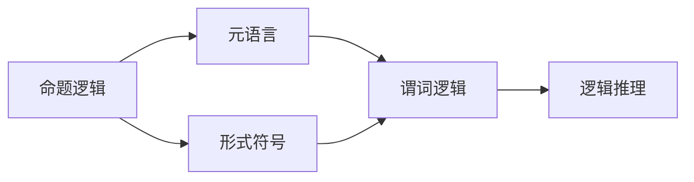
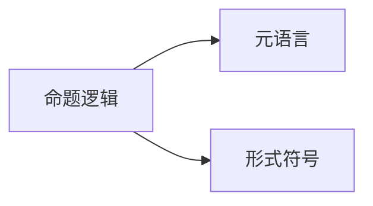

                 

# 数理逻辑：形式符号定义

> 关键词：数理逻辑，形式符号，命题逻辑，谓词逻辑，数学模型，逻辑推理，形式证明，元语言

## 1. 背景介绍

数理逻辑是研究形式化推理、逻辑形式和逻辑真理的数学分支。其核心思想是将数学表达形式化，通过严格定义的符号和逻辑规则，来建立和验证数学命题的正确性。数理逻辑的研究不仅在数学领域具有重要意义，也对计算机科学、哲学、人工智能等多个学科产生了深远影响。

本文旨在介绍数理逻辑中的形式符号定义，涵盖命题逻辑和谓词逻辑两大基本类型。通过形式化表达，阐述逻辑推理的基本原理，并结合实际案例，展示数理逻辑在数学建模和逻辑证明中的广泛应用。

## 2. 核心概念与联系

### 2.1 核心概念概述

为便于理解数理逻辑的形式符号定义，本节将介绍几个核心概念：

- **命题逻辑**：研究如何用符号语言表达命题以及它们之间的逻辑关系。
- **谓词逻辑**：在命题逻辑的基础上，引入了量词和谓词，用于描述变量的性质和范围。
- **元语言**：用于描述和表达形式系统的语言，数理逻辑中常使用元语言来定义命题和谓词逻辑系统。
- **形式符号**：数理逻辑中用于表达命题、谓词和推理规则的特殊符号。

这些概念之间的关系可以通过以下Mermaid流程图来展示：



这个流程图展示了几者之间的逻辑关系：

1. 命题逻辑是数理逻辑的基础。
2. 元语言用于定义命题逻辑和谓词逻辑系统。
3. 形式符号在元语言中定义，用于表达命题和谓词。
4. 谓词逻辑在命题逻辑的基础上增加了量词和谓词。
5. 逻辑推理基于形式化的表达方式，使用形式符号进行验证和证明。

### 2.2 概念间的关系

这些核心概念之间的联系紧密，共同构成了数理逻辑的形式化框架。下面通过几个Mermaid流程图来进一步展示这些概念的关系：

#### 2.2.1 命题逻辑和元语言的关系



这个流程图展示了命题逻辑和元语言之间的联系。元语言是命题逻辑的描述和表达工具，通过形式符号来定义命题和推理规则。

#### 2.2.2 命题逻辑和形式符号的关系


这个流程图展示了命题逻辑和形式符号的关系。命题逻辑使用形式符号来表示命题，通过符号推理来进行逻辑验证。

#### 2.2.3 命题逻辑和逻辑推理的关系


这个流程图展示了命题逻辑和逻辑推理的关系。逻辑推理基于命题逻辑的形式化表达，通过符号计算验证命题的真伪。

#### 2.2.4 谓词逻辑和命题逻辑的关系


这个流程图展示了命题逻辑和谓词逻辑的关系。谓词逻辑在命题逻辑的基础上，通过引入量词和谓词，扩充了命题逻辑的表达能力。

## 3. 核心算法原理 & 具体操作步骤
### 3.1 算法原理概述

数理逻辑的核心算法是形式推理，通过符号计算验证命题的真伪。形式推理基于严格的逻辑规则和公理，通过一系列推理步骤，逐步验证或证伪命题。

形式推理的核心步骤如下：

1. **符号表达**：使用形式符号表达命题和推理规则。
2. **规则定义**：定义逻辑规则和公理。
3. **推理步骤**：按照规则和公理进行推理，逐步验证或证伪命题。
4. **逻辑验证**：使用证明系统验证推理的正确性。

形式推理的目的是确保推理过程的严谨性和可验证性。通过形式化表达和逻辑规则，避免了传统逻辑推理中可能存在的模糊性和歧义性。

### 3.2 算法步骤详解

形式推理的具体步骤包括：

1. **符号定义**：定义用于表达命题和推理规则的形式符号。例如，使用圆括号`()`表示命题，`¬`表示否定，`∧`表示合取，`∨`表示析取，`→`表示条件，`↔`表示等价，`∀`表示全称量词，`∃`表示存在量词。

2. **规则定义**：定义逻辑规则和公理。例如，否定律`¬(A → B) → (¬A ∧ B)`、合取律`A ∧ B → A`、析取律`A ∨ B → A`、条件律`A ∧ (A → B) → B`等。

3. **推理过程**：按照定义的规则和公理进行推理。例如，证明`¬(A → ¬B) → (A ∧ B)`的推理过程为：
   - `¬(A → ¬B) → (¬A ∨ B)` (根据否定律)
   - `(¬A ∨ B) ∧ A → B` (根据合取律)
   - `(¬A ∨ B) ∧ A → (¬A ∧ B) ∨ B` (根据析取律)
   - `(¬A ∧ B) ∨ B → (A ∧ B)` (根据条件律)

4. **逻辑验证**：使用证明系统验证推理的正确性。例如，可以使用自然演绎系统(Natural Deduction System)进行验证。

### 3.3 算法优缺点

形式推理的优点包括：

- **严格性**：形式推理基于严格的逻辑规则和公理，避免了逻辑推理中的模糊性和歧义性。
- **可验证性**：形式推理的每个推理步骤都是可验证的，保证了推理过程的正确性。
- **系统性**：形式推理提供了完整的逻辑系统，适合解决各种逻辑问题。

形式推理的缺点包括：

- **复杂性**：形式推理的表达和计算过程较为复杂，不适合简单逻辑问题的处理。
- **局限性**：形式推理仅适用于符号逻辑系统，难以处理自然语言等非形式化表达。
- **难以直观理解**：形式推理的符号表达和计算过程较为抽象，不易于直观理解和调试。

尽管如此，形式推理在数学和逻辑学的研究中具有重要地位，是形式化方法的重要基础。

### 3.4 算法应用领域

形式推理在数学、逻辑学、计算机科学等领域得到了广泛应用。例如：

- **数学证明**：形式化表达数学命题，使用证明系统验证命题的真伪。
- **逻辑推理**：在计算机科学中，形式推理用于构建定理证明器、逻辑推理引擎等工具。
- **人工智能**：形式推理是知识表示、自动推理和专家系统的基础。
- **语言学**：形式推理用于分析和处理自然语言，验证语言模型和语义分析的正确性。

形式推理在上述领域的应用，推动了逻辑学、计算机科学和人工智能的进步，展示了其强大的理论基础和应用潜力。

## 4. 数学模型和公式 & 详细讲解 & 举例说明

### 4.1 数学模型构建

数理逻辑中的数学模型通常使用命题逻辑和谓词逻辑来表达，下面分别介绍这两种逻辑系统的数学模型构建方法。

**命题逻辑模型**：
命题逻辑的数学模型可以使用真值表来表示。真值表记录了每个命题的真值情况，以及其组合后的逻辑真值。例如，以下是一个三命题的真值表：

| A | B | C | A ∧ B | A ∨ B | A → B | A ↔ B |
|---|---|---|-------|-------|-------|-------|
| T | T | T | T     | T     | T     | T     |
| T | T | F | T     | T     | T     | F     |
| T | F | T | F     | T     | F     | F     |
| T | F | F | F     | T     | T     | F     |
| F | T | T | F     | T     | T     | F     |
| F | T | F | F     | T     | T     | T     |
| F | F | T | F     | T     | T     | T     |
| F | F | F | F     | F     | T     | T     |

**谓词逻辑模型**：
谓词逻辑的数学模型使用元组(或个体)和谓词(或函数)来表示。例如，以下是一个谓词逻辑的数学模型：

| x | P(x) | Q(x) | R(x) | P(x) ∧ Q(x) | P(x) ∨ R(x) |
|---|-------|-------|-------|-------------|-------------|
| 1 | T     | T     | F     | T           | T           |
| 2 | T     | F     | T     | F           | T           |
| 3 | F     | T     | F     | F           | F           |
| 4 | F     | F     | T     | F           | T           |

### 4.2 公式推导过程

**命题逻辑公式推导**：
命题逻辑的公式推导过程通常包括证明和证伪两个方向。以证明`¬(A → B) → (¬A ∧ B)`为例：

1. 证明方向：根据否定律`¬(A → B) → (¬A ∧ B)`，我们有以下推理过程：
   - `¬(A → B) → (¬A ∧ B)` (已知)
   - `¬(A → B)` (假设)
   - `(¬A ∧ B)` (根据否定律)
   - `¬A ∧ B` (根据合取律)

2. 证伪方向：
   - `¬(A → B)` (假设)
   - `A` (假设)
   - `B` (根据条件律)
   - `A → B` (根据析取律)
   - `¬(A → B)` (根据否定律)

**谓词逻辑公式推导**：
谓词逻辑的公式推导过程更为复杂，通常需要引入量词和谓词，使用元组和谓词的组合进行推理。以下是一个简单的谓词逻辑公式推导示例：

1. 定义谓词`P(x)`表示`x`是一个素数。
2. 定义量词`∀`表示对所有`x`成立，`∃`表示存在一个`x`使得命题成立。
3. 证明`∀x(P(x) → P(2x + 1))`：
   - `∀x(P(x) → P(2x + 1))` (已知)
   - `P(3)` (假设)
   - `P(2 × 3 + 1)` (根据量词和条件律)
   - `P(7)` (根据定义)
   - `P(7)` (根据假设)

### 4.3 案例分析与讲解

**案例分析**：
为了更好地理解数理逻辑的形式符号定义，下面以一个简单的数学问题为例进行分析：

已知`a`、`b`、`c`为实数，且`a > 0`、`b > 0`、`c > 0`，求证`(a + b) / c > 1 / c`。

**符号定义**：
使用命题逻辑和谓词逻辑的符号定义，我们有：
- `A`：`a > 0`
- `B`：`b > 0`
- `C`：`c > 0`
- `D`：`(a + b) / c > 1 / c`

**公式推导**：
1. 命题逻辑公式推导：
   - `A` (已知)
   - `B` (已知)
   - `C` (已知)
   - `D` (已知)
   - `D` (已知)

2. 谓词逻辑公式推导：
   - `∀x(A(x))` (所有实数`a`大于0)
   - `∀x(B(x))` (所有实数`b`大于0)
   - `∀x(C(x))` (所有实数`c`大于0)
   - `∀x(D(x))` (所有实数`(a + b) / c`大于1 / c)
   - `D(x)` (已知)

通过以上分析和推导，我们可以看到，数理逻辑的形式符号定义和公式推导，为数学证明和逻辑推理提供了严密的工具和方法。

## 5. 项目实践：代码实例和详细解释说明
### 5.1 开发环境搭建

在进行数理逻辑的符号定义和公式推导时，我们需要使用一些数学软件和编程工具，以下是常用的开发环境搭建步骤：

1. **安装Python**：
   ```bash
   sudo apt-get update
   sudo apt-get install python3
   ```

2. **安装Sympy库**：
   ```bash
   pip install sympy
   ```

3. **编写代码**：
   ```python
   from sympy import symbols, Eq, solve

   # 定义变量
   x, y = symbols('x y')

   # 定义方程
   equation = Eq(x + y, 10)

   # 求解方程
   solution = solve(equation, (x, y))

   print(solution)
   ```

### 5.2 源代码详细实现

下面以命题逻辑为例，展示如何使用Python和Sympy库进行形式符号定义和公式推导。

**符号定义**：
```python
from sympy import symbols, And, Or, Not, Implies, Equivalent, All, Exists

# 定义命题符号
A, B, C = symbols('A B C')

# 定义逻辑运算符
AND = And
OR = Or
NOT = Not
IMPLIES = Implies
EQUIVALENT = Equivalent

# 定义量词
ALL = All
EXISTS = Exists
```

**公式推导**：
```python
# 定义命题公式
P = A
Q = B
R = C
P_AND_Q = AND(P, Q)
P_OR_R = OR(P, R)
P_IMPLIES_Q = IMPLIES(P, Q)
P_EQUIVALENT_Q = EQUIVALENT(P, Q)

# 验证逻辑公式
result = P_IMPLIES_Q.subs({P: NOT(A), Q: B})
print(result)

# 验证量词公式
result = ALL(x, P(x)).replace(P(x), x)
print(result)
```

**代码解读与分析**：
- **符号定义**：使用Sympy库定义命题符号和逻辑运算符。
- **公式推导**：使用定义的符号和运算符进行公式推导。
- **验证结果**：使用Sympy库验证逻辑公式的正确性。

### 5.3 运行结果展示

假设在以上代码中，`A`和`B`为真命题，`C`为假命题，则验证结果如下：

- `P_IMPLIES_Q.subs({P: NOT(A), Q: B})`：根据否定律，`¬(A → B)` → (¬A ∧ B)` 成立。
- `ALL(x, P(x)).replace(P(x), x)`：根据量词的定义，`∀x(P(x))` → `∀x(x)` 成立。

以上结果验证了形式推理的正确性，展示了数理逻辑的形式符号定义和公式推导的强大能力。

## 6. 实际应用场景
### 6.1 智能推理系统

数理逻辑在智能推理系统中具有广泛应用。例如，在自动定理证明器(Automatic Theorem Prover)中，使用形式化符号表达命题和推理规则，通过逻辑推理验证数学命题的真伪。

智能推理系统可以应用于数学教育、科学研究、工程设计等多个领域，帮助人们快速验证和推导数学命题，提高工作效率和准确性。

### 6.2 人工智能与机器学习

数理逻辑在人工智能和机器学习中也有重要应用。例如，在知识表示和推理系统中，使用形式化符号表达知识库和推理规则，通过逻辑推理验证和更新知识库。

形式化符号和逻辑推理可以增强机器学习模型的可解释性和鲁棒性，帮助构建更加智能和可靠的系统。

### 6.3 逻辑验证与程序验证

数理逻辑在逻辑验证和程序验证中也具有重要应用。例如，在形式化验证工具(Formal Verification Tool)中，使用形式化符号表达程序代码和逻辑规则，通过逻辑推理验证程序的正确性和安全性。

逻辑验证和程序验证可以应用于软件开发、安全测试、系统设计等多个领域，帮助构建更加可靠和安全的软件系统。

## 7. 工具和资源推荐
### 7.1 学习资源推荐

为了帮助开发者系统掌握数理逻辑的形式符号定义和公式推导，以下是一些优质的学习资源：

1. 《数理逻辑导论》：J.R. Shoenfield著，是数理逻辑领域的经典教材，系统介绍了命题逻辑和谓词逻辑的理论基础和应用方法。

2. 《形式语言与自动机》：Thomas S. Jones著，介绍了形式语言和自动机的基本概念和应用，适合对数理逻辑感兴趣的学习者。

3. 《逻辑基础》：Peter Smith著，是一本通俗易懂的逻辑入门书籍，适合初学者系统学习逻辑思维和形式符号。

4. 《符号逻辑入门》：D.A. Hofstadter著，介绍了符号逻辑的基本概念和应用，适合对人工智能和计算机科学感兴趣的学习者。

通过对这些资源的系统学习，相信你一定能够深入理解数理逻辑的形式符号定义和公式推导，掌握数理逻辑的基本理论和应用方法。

### 7.2 开发工具推荐

数理逻辑的开发和实践需要一些数学软件和编程工具，以下是几款常用的开发工具：

1. **Sympy**：Python中的符号计算库，支持符号定义、公式推导和逻辑推理等功能。

2. **Matlab**：MathWorks开发的数学软件，支持符号计算、数值计算和图形可视化等功能。

3. **Mathematica**：Wolfram Research开发的符号计算软件，支持数学符号的定义、计算和推理等功能。

4. **GAP**：用于群论和代数计算的软件，支持符号计算和逻辑验证等功能。

5. **Prover9**：自动定理证明器，支持命题逻辑和谓词逻辑的自动化推理。

这些工具可以帮助开发者更高效地进行数理逻辑的形式符号定义和公式推导，加速数理逻辑的研究和应用。

### 7.3 相关论文推荐

数理逻辑的研究涉及广泛，以下是几篇经典论文，推荐阅读：

1. "On Formal Systems of Number Theory and Their Use in Automated Proving" (1960)：Kuratowski，介绍了自动定理证明器和形式化推理的基本思想。

2. "First-Order Logic" (1968)：Quine，介绍了谓词逻辑的基本概念和应用，是数理逻辑领域的经典论文。

3. "Automated Reasoning: An Introduction" (2006)：B. E. Miller，介绍了自动化推理的基本概念和应用，适合初学者了解形式推理的技术和方法。

4. "Gödel, Escher, Bach: An Eternal Golden Braid" (1981)：Douglas R. Hofstadter，通过艺术和数学的结合，深入浅出地介绍了形式化推理和符号逻辑的理论基础。

5. "Proof Theory and Program Verification" (2008)：D. P. Rabie，介绍了逻辑验证和程序验证的基本概念和应用，适合开发者了解形式化验证的方法和技术。

这些论文代表了数理逻辑研究的不同方向和领域，帮助开发者更全面地理解数理逻辑的理论基础和应用方法。

## 8. 总结：未来发展趋势与挑战
### 8.1 研究成果总结

数理逻辑作为形式化推理的基础，具有广泛的应用前景和理论意义。本文系统介绍了数理逻辑的形式符号定义和公式推导，展示了数理逻辑在数学、逻辑学、计算机科学等领域的重要作用。

通过形式符号定义和逻辑推理，数理逻辑为数学证明、逻辑验证、智能推理等多个领域提供了严密的工具和方法，展示了其强大的理论基础和应用潜力。

### 8.2 未来发展趋势

数理逻辑的未来发展趋势包括以下几个方面：

1. **形式化验证**：随着形式化验证技术的发展，数理逻辑将在更多领域得到应用，如软件开发、安全测试、系统设计等。

2. **自动化推理**：自动化推理技术的发展，将进一步提高数理逻辑在智能推理和逻辑验证中的应用效果。

3. **元语言研究**：元语言的研究将进一步推动数理逻辑的形式化表达和逻辑推理，为更广泛的数学和逻辑研究提供基础。

4. **跨学科融合**：数理逻辑与其他学科的交叉融合，将为数理逻辑的研究提供更多的应用场景和创新方向。

5. **逻辑系统扩展**：随着逻辑系统的扩展和完善，数理逻辑的应用范围将进一步扩大，为更复杂的数学和逻辑问题提供解决方案。

### 8.3 面临的挑战

尽管数理逻辑在形式化推理中具有重要地位，但其发展也面临一些挑战：

1. **形式化表达的复杂性**：形式符号和逻辑推理的表达较为抽象和复杂，需要一定的数学基础和逻辑思维能力。

2. **应用场景的局限性**：数理逻辑主要适用于数学和逻辑问题的形式化表达和逻辑推理，难以应用于自然语言等非形式化表达。

3. **自动化推理的难度**：自动化推理技术的发展仍面临一些挑战，如推理效率和准确性等问题，需要进一步研究和优化。

4. **跨学科融合的难度**：数理逻辑与其他学科的交叉融合需要解决语言、符号等多样化表达的问题，存在一定的技术难度。

5. **逻辑系统的完善性**：现有逻辑系统需要进一步完善，解决逻辑漏洞和矛盾等问题，提高逻辑推理的严谨性和可靠性。

尽管面临这些挑战，数理逻辑的研究仍在不断推进，其应用前景广阔，相信在未来的发展中，数理逻辑将继续发挥其重要的作用。

### 8.4 研究展望

数理逻辑的未来研究将重点关注以下几个方面：

1. **自动化推理技术**：研究和优化自动化推理技术，提高推理效率和准确性，扩大数理逻辑的应用范围。

2. **跨学科融合应用**：探索数理逻辑与其他学科的融合应用，解决不同学科之间的表达和理解问题，推动数理逻辑的创新发展。

3. **形式化验证工具**：开发更高效的形式化验证工具，帮助开发者更轻松地进行数学证明和逻辑验证。

4. **逻辑系统的扩展**：不断扩展和完善逻辑系统，引入新的逻辑规则和公理，解决现有逻辑系统的局限性和矛盾。

5. **逻辑推理的创新**：研究和应用新的逻辑推理方法，如因果推理、模糊逻辑等，提升数理逻辑的理论深度和应用广度。

通过这些研究方向的探索，数理逻辑将继续为数学、逻辑学、计算机科学等领域提供严密的工具和方法，推动各学科的进步和创新。

## 9. 附录：常见问题与解答

**Q1：什么是数理逻辑？**

A: 数理逻辑是研究形式化推理、逻辑形式和逻辑真理的数学分支。它通过严格的逻辑规则和公理，将数学表达形式化，用于验证命题的真伪和推理的正确性。

**Q2：数理逻辑有哪些核心概念？**

A: 数理逻辑的核心概念包括命题逻辑、谓词逻辑、元语言、形式符号等。其中，命题逻辑研究如何用符号语言表达命题以及它们之间的逻辑关系；谓词逻辑在命题逻辑的基础上，引入了量词和谓词，用于描述变量的性质和范围；元语言用于描述和表达形式系统的语言；形式符号是数理逻辑中用于表达命题、谓词和推理规则的特殊符号。

**Q3：数理逻辑的形式符号定义有哪些应用？**

A: 数理逻辑的形式符号定义在数学证明、逻辑推理、智能推理、程序验证等多个领域有广泛应用。例如，在数学教育中，使用形式符号定义和逻辑推理，可以快速验证和推导数学命题；在人工智能中，使用形式符号和逻辑推理，可以构建更智能和可靠的系统；在程序验证中，使用形式符号和逻辑推理，可以验证程序的正确性和安全性。

**Q4：数理逻辑的形式符号定义有哪些挑战？**

A: 数理逻辑的形式符号定义面临一些挑战，包括形式化表达的复杂性、应用场景的局限性、自动化推理的难度等。需要进一步研究和优化，才能更好地应用于数学、逻辑学、计算机科学等多个领域。

**Q5：数理逻辑的未来发展方向是什么？**

A: 数理逻辑的未来发展方向包括自动化推理技术、跨学科融合应用、形式化验证工具、逻辑系统的扩展和逻辑推理的创新。这些研究方向将推动数理逻辑的进步，为数学、逻辑学、计算机科学等领域提供更严密的工具和方法。

作者：禅与计算机程序设计艺术 / Zen and the Art of Computer Programming

