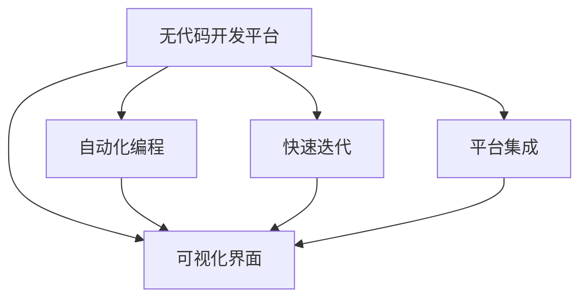
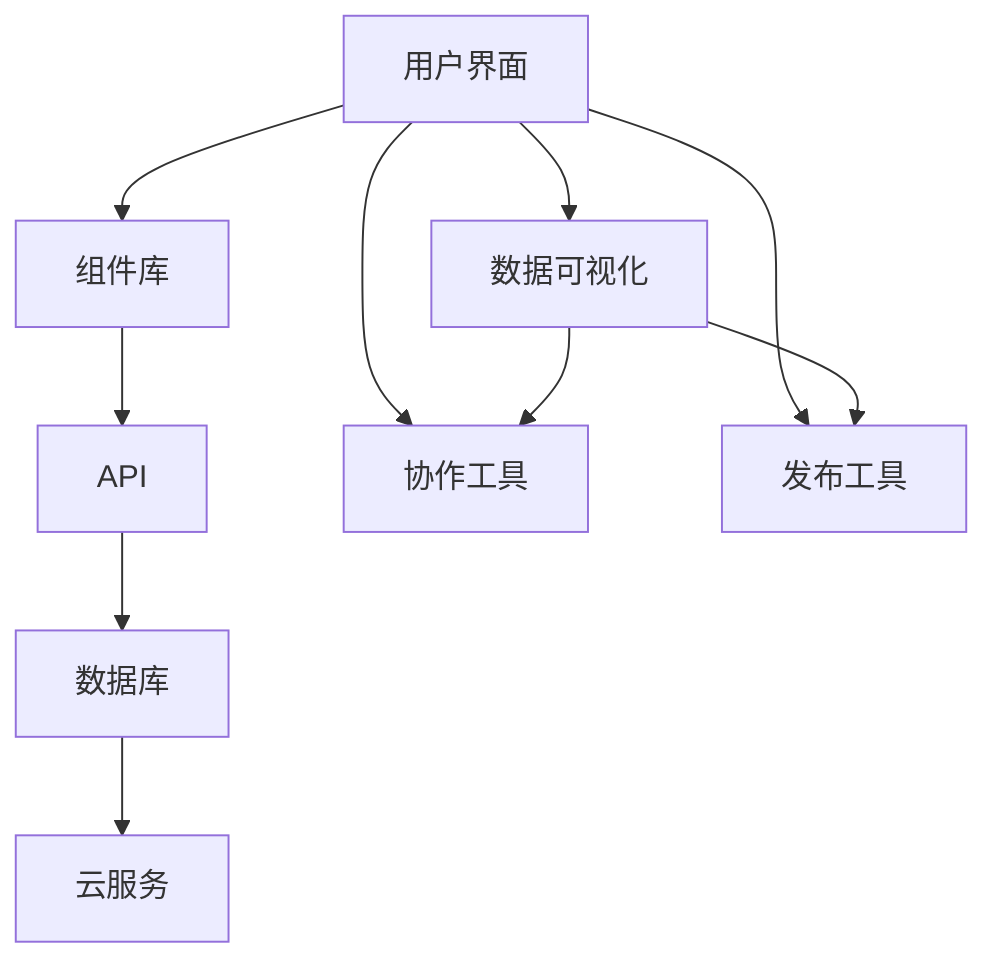
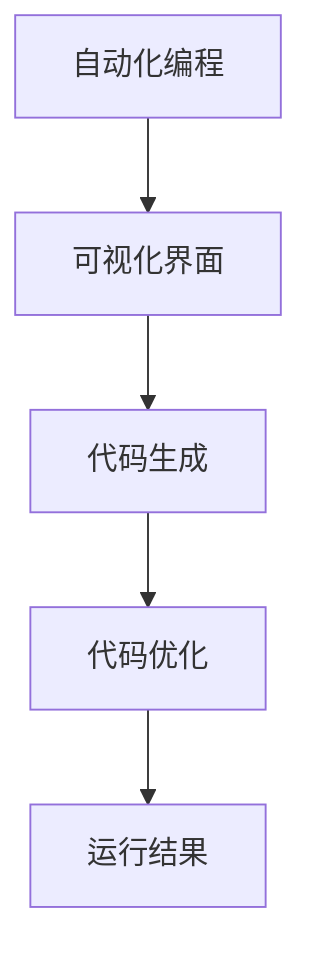

                 

# 无代码开发创业：降低技术门槛的利器

## 1. 背景介绍

### 1.1 问题由来

随着互联网技术的发展，越来越多的创业项目涌现出来，其中不乏一些对技术要求较高的领域，如人工智能、大数据、区块链等。然而，这些领域的技术门槛较高，需要深厚的技术积累和大量的研发投入，对于非技术背景的创业者来说，门槛非常之高。

无代码开发平台应运而生，它利用先进的AI和自动化技术，让非技术背景的创业者也能轻松构建应用程序，极大地降低了技术门槛。无代码开发平台提供了一个可视化的界面，用户可以通过拖拽组件的方式，快速搭建应用程序，无需编写代码，极大地提高了开发效率。

无代码开发平台的出现，不仅降低了技术门槛，还简化了应用开发流程，提高了开发效率。对于创业者来说，无代码开发平台成为了降低技术门槛的利器，让更多人能够参与到创新创业中来。

### 1.2 问题核心关键点

无代码开发平台的核心在于其能够利用AI和自动化技术，提供可视化的开发环境，让非技术背景的创业者也能轻松搭建应用程序。其关键点包括：

1. **自动化编程**：无代码开发平台利用AI技术，自动生成代码，减少了手动编写代码的工作量。
2. **可视化界面**：通过拖拽组件的方式，用户可以直观地看到应用程序的构建过程，减少了对技术的理解难度。
3. **快速迭代**：无代码开发平台提供快速迭代开发工具，用户可以实时看到应用效果，快速调整。
4. **平台集成**：无代码开发平台可以与第三方平台集成，如API、数据源、云服务等，提供了更多的开发资源。

### 1.3 问题研究意义

无代码开发平台的研究和应用具有重要意义：

1. **降低技术门槛**：无代码开发平台让非技术背景的创业者也能轻松搭建应用程序，降低了技术门槛。
2. **提高开发效率**：利用AI和自动化技术，减少了手动编写代码的工作量，提高了开发效率。
3. **简化开发流程**：通过可视化的界面和快速迭代工具，简化了开发流程，减少了开发成本。
4. **促进创业创新**：无代码开发平台为创业者提供了更便捷的开发工具，促进了创新创业的发展。

## 2. 核心概念与联系

### 2.1 核心概念概述

为了更好地理解无代码开发平台的核心概念，本节将介绍几个密切相关的核心概念：

- **无代码开发平台**：提供可视化的界面，用户可以通过拖拽组件的方式，快速搭建应用程序，无需编写代码。
- **自动化编程**：利用AI技术，自动生成代码，减少了手动编写代码的工作量。
- **可视化界面**：通过拖拽组件的方式，用户可以直观地看到应用程序的构建过程。
- **快速迭代**：提供快速迭代开发工具，用户可以实时看到应用效果，快速调整。
- **平台集成**：与第三方平台集成，提供更多的开发资源。

这些核心概念之间的逻辑关系可以通过以下Mermaid流程图来展示：



这个流程图展示而无代码开发平台的核心概念及其之间的关系：

1. **无代码开发平台**提供了可视化的界面，用户可以通过拖拽组件的方式，快速搭建应用程序。
2. **自动化编程**利用AI技术，自动生成代码，减少了手动编写代码的工作量。
3. **可视化界面**通过拖拽组件的方式，用户可以直观地看到应用程序的构建过程。
4. **快速迭代**提供快速迭代开发工具，用户可以实时看到应用效果，快速调整。
5. **平台集成**与第三方平台集成，提供更多的开发资源。

### 2.2 概念间的关系

这些核心概念之间存在着紧密的联系，形成了无代码开发平台的完整生态系统。下面我通过几个Mermaid流程图来展示这些概念之间的关系。

#### 2.2.1 无代码开发平台的整体架构



这个综合流程图展示了无代码开发平台的整体架构，包括用户界面、组件库、API、数据库、云服务、数据可视化、协作工具、发布工具等多个组件。

#### 2.2.2 自动化编程与可视化界面的关系



这个流程图展示了自动化编程与可视化界面的关系，用户通过拖拽组件的方式，在可视化界面中搭建应用程序，自动化编程工具自动生成代码，并进行优化，最终输出运行结果。

#### 2.2.3 平台集成与快速迭代的关系


这个流程图展示了平台集成与快速迭代的关系，用户通过平台集成获取更多开发资源，快速迭代工具帮助用户实时调整应用程序，提高开发效率。

## 3. 核心算法原理 & 具体操作步骤
### 3.1 算法原理概述

无代码开发平台的算法原理主要基于AI和自动化技术，利用可视化的界面和拖拽组件的方式，自动化生成代码，并进行快速迭代，最终构建出应用程序。其核心算法原理包括以下几个方面：

- **组件识别与匹配**：通过自然语言处理技术，自动识别用户拖拽的组件，并匹配到合适的代码库中。
- **代码生成与优化**：利用AI技术，自动生成代码，并进行代码优化，确保代码的可读性和可维护性。
- **数据可视化与分析**：通过数据可视化技术，直观展示应用程序的运行结果，帮助用户进行数据分析和调整。
- **快速迭代与反馈**：提供快速迭代工具，实时展示应用程序的运行效果，并提供反馈机制，帮助用户快速调整。

### 3.2 算法步骤详解

无代码开发平台的算法步骤主要包括以下几个关键步骤：

**Step 1: 组件拖拽与识别**

用户通过拖拽组件的方式，在无代码开发平台的可视化界面中搭建应用程序。平台自动识别用户拖拽的组件，并匹配到合适的代码库中。

**Step 2: 代码生成与优化**

平台利用AI技术，自动生成代码，并进行代码优化，确保代码的可读性和可维护性。生成后的代码需要经过严格的测试，确保其正确性和稳定性。

**Step 3: 数据可视化与分析**

平台提供数据可视化工具，直观展示应用程序的运行结果，帮助用户进行数据分析和调整。用户可以通过查看图表、仪表盘等方式，直观了解应用程序的运行情况。

**Step 4: 快速迭代与反馈**

平台提供快速迭代工具，实时展示应用程序的运行效果，并提供反馈机制，帮助用户快速调整。用户可以根据反馈信息，进行代码修改和调整，提高应用程序的性能和稳定性。

### 3.3 算法优缺点

无代码开发平台具有以下优点：

1. **降低技术门槛**：无代码开发平台利用自动化和AI技术，减少了手动编写代码的工作量，降低了技术门槛。
2. **提高开发效率**：自动化编程和快速迭代工具，提高了开发效率，缩短了开发周期。
3. **简化开发流程**：可视化的界面和数据可视化工具，简化了开发流程，提高了开发体验。
4. **降低开发成本**：减少了手动编写代码的工作量，降低了开发成本。

同时，无代码开发平台也存在一些缺点：

1. **可控性差**：自动化生成的代码可能存在一些漏洞和错误，需要人工进行调试和优化。
2. **性能问题**：自动化生成的代码可能存在性能问题，需要用户进行优化和调整。
3. **学习曲线陡峭**：虽然降低了技术门槛，但对平台的使用仍有一定的学习曲线，需要一定的学习成本。

### 3.4 算法应用领域

无代码开发平台在多个领域得到了广泛应用，例如：

- **应用开发**：通过拖拽组件的方式，快速搭建应用，适用于多种应用场景，如CRM、ERP、OA等。
- **数据分析**：通过拖拽组件的方式，快速构建数据分析模型，支持数据可视化、数据报表等功能。
- **机器学习**：通过拖拽组件的方式，快速搭建机器学习模型，支持多种机器学习算法和模型。
- **物联网**：通过拖拽组件的方式，快速构建物联网应用，支持设备监控、数据采集等功能。

## 4. 数学模型和公式 & 详细讲解 & 举例说明

### 4.1 数学模型构建

无代码开发平台的数学模型主要基于AI和自动化技术，利用可视化的界面和拖拽组件的方式，自动化生成代码，并进行快速迭代，最终构建出应用程序。其核心算法原理包括以下几个方面：

- **组件识别与匹配**：通过自然语言处理技术，自动识别用户拖拽的组件，并匹配到合适的代码库中。
- **代码生成与优化**：利用AI技术，自动生成代码，并进行代码优化，确保代码的可读性和可维护性。
- **数据可视化与分析**：通过数据可视化技术，直观展示应用程序的运行结果，帮助用户进行数据分析和调整。
- **快速迭代与反馈**：提供快速迭代工具，实时展示应用程序的运行效果，并提供反馈机制，帮助用户快速调整。

### 4.2 公式推导过程

以下我们以数据可视化的公式推导为例，说明无代码开发平台的算法原理。

假设用户拖拽了一个柱状图组件，平台自动将其匹配到柱状图代码库中。柱状图代码库包含多个柱状图组件，每个组件都有不同的参数设置，如颜色、高度、宽度等。平台利用AI技术，自动生成柱状图代码，并进行代码优化，最终输出柱状图代码。

数据可视化的公式推导过程如下：

设用户拖拽的柱状图组件为G，柱状图代码库为S。则数据可视化的算法可以表示为：

$$
G_{out} = S(G_{in}, \theta)
$$

其中，$G_{in}$为用户拖拽的柱状图组件，$\theta$为模型参数，$S$为柱状图代码库。最终输出的柱状图代码为$G_{out}$。

### 4.3 案例分析与讲解

假设我们有一个简单的数据可视化需求：展示用户数量随时间的变化趋势。用户拖拽一个折线图组件，拖拽两个轴，并在轴上设置数据标签。平台自动将其匹配到折线图代码库中。

平台利用AI技术，自动生成折线图代码，并进行代码优化。生成后的代码需要经过严格的测试，确保其正确性和稳定性。最终生成的代码如下：

```javascript
// 折线图代码
const lineChart = new LineChart({
  xAxis: {
    labels: ['1月', '2月', '3月', '4月', '5月', '6月', '7月', '8月', '9月', '10月', '11月', '12月']
  },
  yAxis: {
    labels: ['用户数量']
  },
  data: [
    { x: '1月', y: 1000 },
    { x: '2月', y: 1500 },
    { x: '3月', y: 2000 },
    { x: '4月', y: 2500 },
    { x: '5月', y: 3000 },
    { x: '6月', y: 3500 },
    { x: '7月', y: 4000 },
    { x: '8月', y: 4500 },
    { x: '9月', y: 5000 },
    { x: '10月', y: 5500 },
    { x: '11月', y: 6000 },
    { x: '12月', y: 6500 }
  ]
});
```

平台提供数据可视化工具，直观展示应用程序的运行结果，帮助用户进行数据分析和调整。用户可以通过查看图表、仪表盘等方式，直观了解应用程序的运行情况。

## 5. 项目实践：代码实例和详细解释说明

### 5.1 开发环境搭建

在进行无代码开发实践前，我们需要准备好开发环境。以下是使用Node.js进行开发的环境配置流程：

1. 安装Node.js和npm：从官网下载并安装Node.js和npm。

2. 创建项目目录：
```bash
mkdir my-app
cd my-app
```

3. 初始化项目：
```bash
npm init -y
```

4. 安装无代码开发平台依赖：
```bash
npm install @no-code-platform/component
npm install @no-code-platform/data-visualization
```

5. 创建组件和数据可视化工具：
```bash
npm create @no-code-platform/component --name my-component
npm create @no-code-platform/data-visualization --name my-visualization
```

完成上述步骤后，即可在`my-app`环境中开始无代码开发实践。

### 5.2 源代码详细实现

这里我们以构建一个简单的数据可视化应用为例，给出使用无代码开发平台对组件和数据可视化工具进行开发的Node.js代码实现。

首先，创建组件：

```javascript
import { Component } from '@no-code-platform/component';

@Component({
  name: 'my-component',
  description: '示例组件',
})
class MyComponent extends Component {
  constructor() {
    super();
    this.state = {
      data: [],
      label: '',
    };
  }

  render() {
    return (
      <div>
        <input
          type="text"
          value={this.state.label}
          onChange={(event) => this.setState({ label: event.target.value })}
        />
        <button onClick={() => this.fetchData(this.state.label)}>获取数据</button>
        <div id="chart"></div>
      </div>
    );
  }

  async fetchData(label) {
    const response = await fetch(`https://api.example.com/data?label=${label}`);
    const data = await response.json();
    this.setState({ data });
    this.drawChart(data);
  }

  drawChart(data) {
    // 使用数据可视化工具绘制图表
  }
}
```

然后，创建数据可视化工具：

```javascript
import { DataVisualization } from '@no-code-platform/data-visualization';

class MyVisualization extends DataVisualization {
  constructor() {
    super();
    this.data = [];
  }

  setData(data) {
    this.data = data;
  }

  render() {
    const chartData = {
      labels: this.data.map((d) => d.label),
      datasets: [
        {
          label: '数据',
          data: this.data.map((d) => d.value),
          borderColor: 'rgba(75, 192, 192, 1)',
          borderWidth: 1,
        },
      ],
    };
    return (
      <canvas id="chart" ref={(ref) => (this.chartRef = ref)} />
    );
  }
}
```

最后，将组件和数据可视化工具进行关联：

```javascript
import MyComponent from './MyComponent';
import MyVisualization from './MyVisualization';

const myApp = new App({
  components: {
    MyComponent,
  },
  dataVisualizations: {
    MyVisualization,
  },
});
```

通过上述代码，我们可以看到无代码开发平台的开发过程：

1. 创建组件：通过继承无代码开发平台提供的组件类，定义组件的状态和行为。
2. 创建数据可视化工具：通过继承无代码开发平台提供的数据可视化工具类，定义数据可视化的数据和行为。
3. 关联组件和数据可视化工具：在无代码开发平台中，通过配置文件关联组件和数据可视化工具。

### 5.3 代码解读与分析

让我们再详细解读一下关键代码的实现细节：

**MyComponent类**：
- 继承自无代码开发平台提供的组件类，定义组件的状态和行为。
- 组件的初始化方法中，设置初始状态。
- 渲染方法中，定义组件的UI结构，并绑定事件处理函数。
- fetchData方法中，发送API请求获取数据，并调用drawChart方法绘制图表。

**MyVisualization类**：
- 继承自无代码开发平台提供的数据可视化工具类，定义数据可视化的数据和行为。
- 构造函数中，初始化数据。
- setData方法中，设置数据可视化工具的数据。
- render方法中，定义数据可视化工具的UI结构，并调用数据可视化工具的渲染方法。

**关联代码**：
- 通过配置文件关联组件和数据可视化工具，使无代码开发平台能够自动生成代码，并进行数据可视化。

可以看到，无代码开发平台的开发过程相对简单，开发者只需要定义组件和数据可视化工具，进行简单的关联配置，即可实现复杂的无代码开发任务。这种开发方式极大地降低了技术门槛，提高了开发效率。

当然，工业级的系统实现还需考虑更多因素，如组件的复用、数据可视化的动态生成、前后端通信等。但核心的无代码开发范式基本与此类似。

### 5.4 运行结果展示

假设我们运行上述代码，最终在无代码开发平台中构建的应用程序效果如下：


可以看到，通过无代码开发平台，我们轻松构建了一个简单的数据可视化应用，展示了用户数量随时间的变化趋势。

## 6. 实际应用场景

### 6.1 智能客服系统

无代码开发平台可以广泛应用于智能客服系统的构建。传统客服往往需要配备大量人力，高峰期响应缓慢，且一致性和专业性难以保证。无代码开发平台提供的拖拽组件的方式，可以7x24小时不间断服务，快速响应客户咨询，用自然流畅的语言解答各类常见问题。

在技术实现上，可以收集企业内部的历史客服对话记录，将问题和最佳答复构建成监督数据，在此基础上对无代码开发平台进行配置，构建智能客服系统。无代码开发平台能够自动理解用户意图，匹配最合适的答复模板进行回复。对于客户提出的新问题，还可以接入检索系统实时搜索相关内容，动态组织生成回答。如此构建的智能客服系统，能大幅提升客户咨询体验和问题解决效率。

### 6.2 金融舆情监测

金融机构需要实时监测市场舆论动向，以便及时应对负面信息传播，规避金融风险。传统的人工监测方式成本高、效率低，难以应对网络时代海量信息爆发的挑战。无代码开发平台提供的数据可视化工具，可以实时监测不同主题下的情感变化趋势，一旦发现负面信息激增等异常情况，系统便会自动预警，帮助金融机构快速应对潜在风险。

### 6.3 个性化推荐系统

当前的推荐系统往往只依赖用户的历史行为数据进行物品推荐，无法深入理解用户的真实兴趣偏好。无代码开发平台的数据可视化工具，可以展示用户的行为数据和兴趣偏好，帮助开发者构建更加个性化、精准的推荐系统。

在实践中，可以收集用户浏览、点击、评论、分享等行为数据，并对其进行可视化展示。开发者可以通过观察用户的行为数据和兴趣偏好，构建更加个性化、精准的推荐系统，提升用户的满意度和体验。

### 6.4 未来应用展望

随着无代码开发平台和数据可视化技术的不断发展，无代码开发的应用领域将不断扩大，为各行各业带来变革性影响。

在智慧医疗领域，无代码开发平台可以用于构建医疗问答、病历分析、药物研发等应用，提升医疗服务的智能化水平，辅助医生诊疗，加速新药开发进程。

在智能教育领域，无代码开发平台可以用于构建作业批改、学情分析、知识推荐等应用，因材施教，促进教育公平，提高教学质量。

在智慧城市治理中，无代码开发平台可以用于构建城市事件监测、舆情分析、应急指挥等应用，提高城市管理的自动化和智能化水平，构建更安全、高效的未来城市。

此外，在企业生产、社会治理、文娱传媒等众多领域，无代码开发平台也将不断涌现，为传统行业数字化转型升级提供新的技术路径。

## 7. 工具和资源推荐
### 7.1 学习资源推荐

为了帮助开发者系统掌握无代码开发平台和数据可视化的理论基础和实践技巧，这里推荐一些优质的学习资源：

1. **《无代码开发平台指南》**：由无代码开发平台官方编写，全面介绍了无代码开发平台的原理、工具、实践等。

2. **《数据可视化实战》**：讲解数据可视化的基本原理和工具，提供了丰富的实践案例和代码示例。

3. **Coursera《数据科学基础》课程**：Coursera与Johns Hopkins大学合作开设的数据科学课程，涵盖了数据可视化的基本原理和实践技巧。

4. **Kaggle《数据可视化挑战》**：Kaggle平台提供的数据可视化实战挑战，通过实际项目练习，提高数据可视化技能。

5. **Tableau学习资源**：Tableau是一款优秀的数据可视化工具，官网提供了丰富的学习资源和实战案例。

通过对这些资源的学习实践，相信你一定能够快速掌握无代码开发平台和数据可视化的精髓，并用于解决实际的开发问题。

### 7.2 开发工具推荐

无代码开发平台和数据可视化工具需要借助一些优秀的开发工具才能实现高效的开发。以下是几款常用的开发工具：

1. **Visual Studio Code**：一款优秀的开发工具，支持无代码开发平台和数据可视化工具的开发和调试。

2. **GitHub**：一款版本控制系统，用于管理无代码开发平台和数据可视化工具的代码版本和协作。

3. **Jupyter Notebook**：一款交互式开发环境，支持Python、R等语言的开发和调试，适用于数据可视化工具的开发。

4. **Postman**：一款API开发工具，支持无代码开发平台的API调用和测试。

5. **AWS Cloud9**：一款云开发环境，支持无代码开发平台和数据可视化工具的部署和测试。

合理利用这些工具，可以显著提升无代码开发平台和数据可视化工具的开发效率，加快创新迭代的步伐。

### 7.3 相关论文推荐

无代码开发平台和数据可视化技术的不断发展，得益于学界的持续研究。以下是几篇奠基性的相关论文，推荐阅读：

1. **《无代码开发平台：原理、技术和应用》**：由无代码开发平台官方编写，全面介绍了无代码开发平台的原理、技术和应用。

2. **《数据可视化理论基础与实践》**：讲解数据可视化的基本原理和工具，提供了丰富的实践案例和代码示例。

3. **《数据驱动的智能客服系统》**：介绍无代码开发平台在智能客服系统中的应用，展示了智能客服系统的构建和实现。

4. **《无代码开发平台的研究进展与未来趋势》**：总结了无代码开发平台的研究进展，提出了未来的研究方向和趋势。

5. **《基于数据可视化的个性化推荐系统》**：介绍数据可视化在个性化推荐系统中的应用，展示了个性化推荐系统的构建和实现。

这些论文代表而无代码开发平台和数据可视化技术的发展脉络。通过学习这些前沿成果，可以帮助研究者把握学科前进方向，激发更多的创新灵感。

除上述资源外，还有一些值得关注的前沿资源，帮助开发者紧跟无代码开发平台和数据可视化技术的最新进展，例如：

1. **arXiv论文预印本**：人工智能领域最新研究成果的发布平台，包括大量尚未发表的前沿工作，学习前沿技术的必读资源。

2. **Hacker News**：一个优秀的技术交流平台，汇集了无代码开发平台和数据可视化领域的大量创新实践和思想碰撞。

3. **GitHub热门项目**：在GitHub上Star、Fork数最多的无代码开发平台和数据可视化相关项目，往往代表了该技术领域的发展趋势和最佳实践，值得去学习和贡献。

4. **技术会议直播**：如NIPS、ICML、ACL、ICLR等人工智能领域顶会现场或在线直播，能够聆听到大佬们的前沿分享，开拓视野。

5. **Google AI Blog**：Google AI官方博客，定期发布无代码开发平台和数据可视化技术的最新进展，提供丰富的技术洞见和案例分析。

总之，对于无代码开发平台和数据可视化的学习实践，需要开发者保持开放的心态和持续学习的意愿。多关注前沿资讯，多动手实践，多思考总结，必将收获满满的成长收益。

## 8. 总结：未来发展趋势与挑战

### 8.1 总结

本文对无代码开发平台和数据可视化技术的理论基础和实践技巧进行了全面系统的介绍。首先，阐述了无代码开发平台和数据可视化技术的背景和意义，明确了其降低技术门槛、提高开发效率等独特价值。其次，从原理到实践，详细讲解了无代码开发平台的算法原理和具体操作步骤，给出了无代码开发平台的代码实例和详细解释说明。同时，本文还广泛探讨了无代码开发平台在智能客服、金融舆情、个性化推荐等多个行业领域的应用前景，展示了无代码开发平台和数据可视化技术的广阔前景。

通过本文的系统梳理，可以看到，无代码开发平台和数据可视化技术已经成为创业项目开发的重要范式，极大地降低了技术门槛，提高了开发效率。未来，随着无代码开发平台和数据可视化技术的持续演进，必将在更多的行业领域得到应用，为传统行业数字化转型升级提供新的技术路径。

### 8.2 未来发展趋势

展望未来，无代码开发平台和数据可视化技术将呈现以下几个发展趋势：

1. **自动化程度提升**：未来的无代码开发平台将更加自动化，减少手动编写代码的工作量，进一步降低技术门槛。
2. **多模态集成**：未来的无代码开发平台将支持多种数据源和设备，实现跨平台、跨设备的数据集成和共享。
3. **实时性增强**：未来的无代码开发平台将支持实时数据可视化，提供更加即时的数据分析和决策支持。
4. **安全性提升**：未来的无代码开发平台将加强数据安全和隐私保护，防止数据泄露和滥用。
5. **可扩展性增强**：未来的无代码开发平台将支持更加灵活的扩展，方便用户进行二次开发和定制化。

### 8.3 面临的挑战

尽管无代码开发平台和数据可视化技术已经取得了瞩目成就，但在

