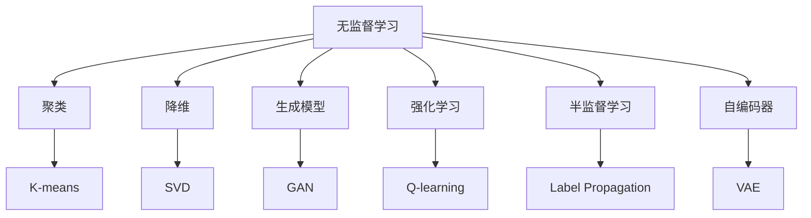
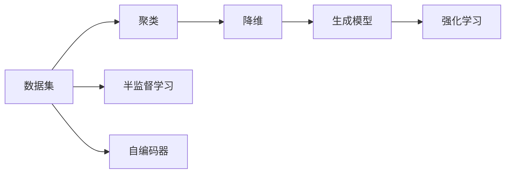
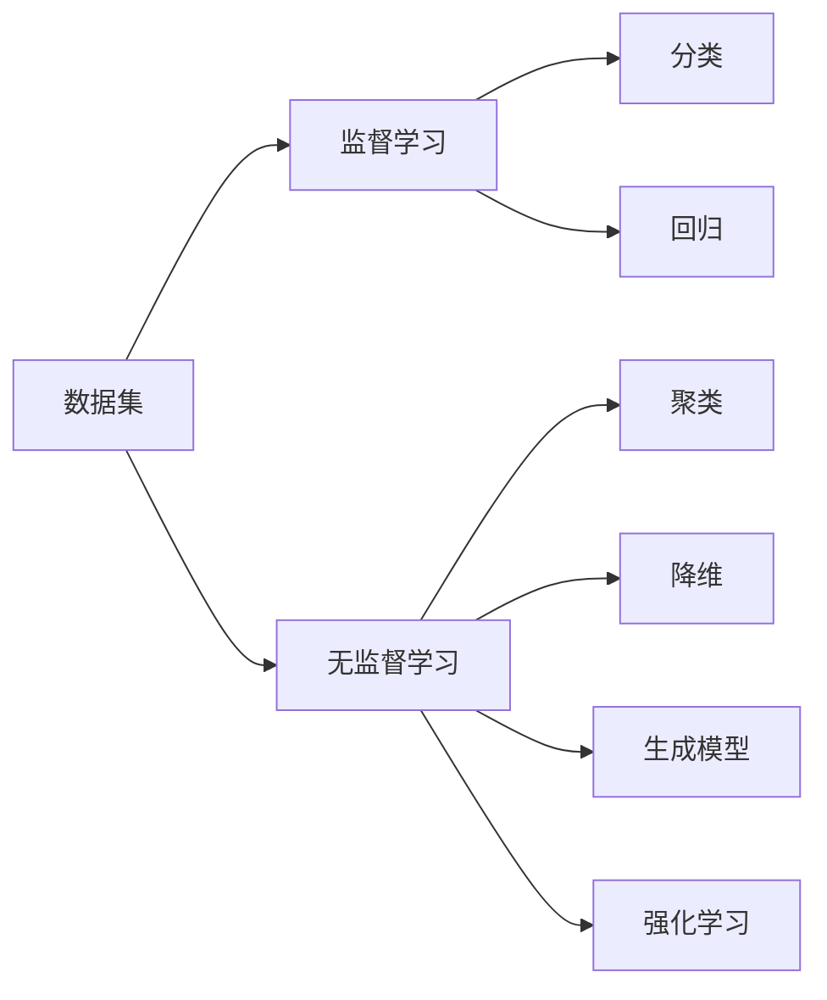
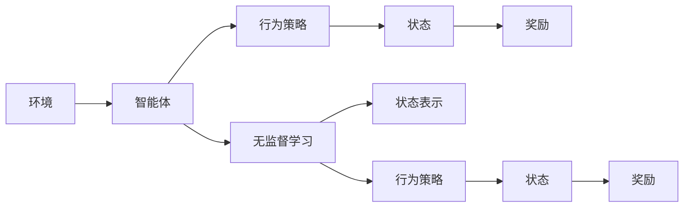
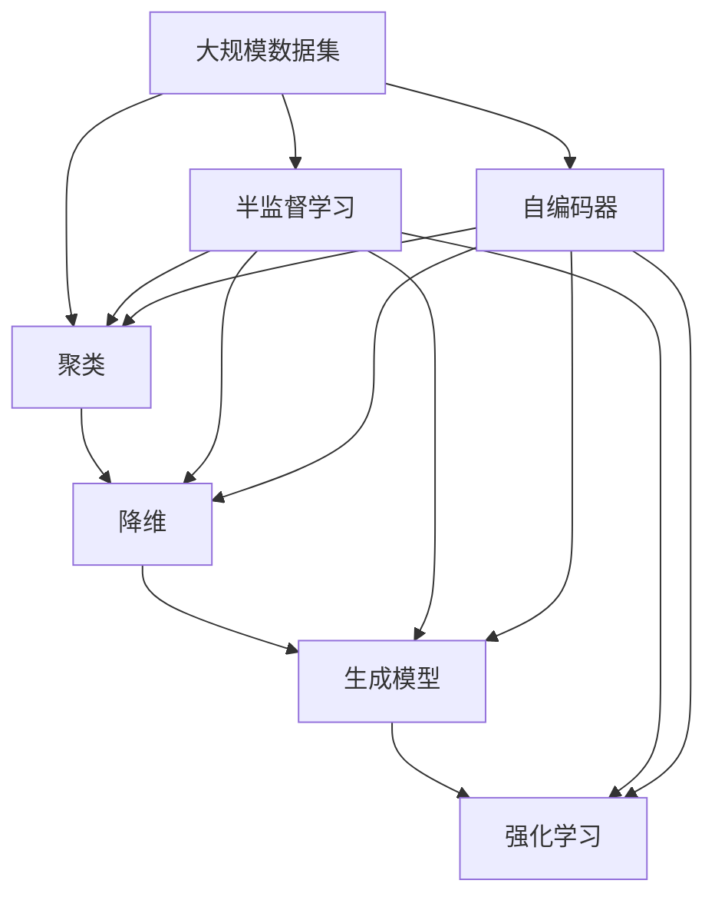

                 

# 无监督学习 (Unsupervised Learning)

> 关键词：无监督学习,无标签数据,聚类,降维,生成模型,强化学习,半监督学习,自编码器

## 1. 背景介绍

### 1.1 问题由来
在机器学习领域，无监督学习(Unsupervised Learning)是一种重要的学习方法，与监督学习(Supervised Learning)和强化学习(Reinforcement Learning)并称为机器学习的三大分支。相较于监督学习，无监督学习的关键在于数据本身没有显式的标签信息，模型需要从数据本身的特征中自主学习规律，寻找数据的内在结构和模式。

无监督学习的主要应用包括聚类(Clustering)、降维(Dimensionality Reduction)、生成模型(Generative Model)和强化学习(Reinforcement Learning)等领域。这些应用广泛涵盖了数据挖掘、模式识别、自然语言处理、图像处理等众多领域。

### 1.2 问题核心关键点
无监督学习的主要目标是从数据中挖掘潜在的模式和结构，使其能够适应各种不同的应用场景。核心关键点包括：
1. 数据集的特征学习。从数据集中学习到内在特征和模式，以便于后续的分类、聚类和预测等任务。
2. 相似性度量。如何度量数据样本之间的相似性和距离，是无监督学习的核心问题之一。
3. 模型泛化能力。如何设计合适的模型，使得其能够对未知数据具有较好的泛化能力，而不只是记忆已有数据的特征。
4. 数据可视化。无监督学习生成的模型能够提供直观的数据可视化，帮助我们理解数据的内在结构和模式。
5. 数据降维。通过降维算法，将高维数据转换为低维表示，使得数据更易于处理和可视化。

这些关键点构成了无监督学习的研究基础和应用范式，使得无监督学习能够广泛应用到各种数据挖掘和数据分析任务中。

### 1.3 问题研究意义
无监督学习在数据挖掘和数据分析中具有重要意义，具体体现在以下几个方面：
1. 数据无标签：无监督学习适用于大量无标签数据的处理，避免了对大量人工标注的依赖。
2. 数据探索：无监督学习能够帮助人们从数据中探索未知的结构和模式，发现数据的内在关联性。
3. 数据降维：无监督学习可以通过降维算法，简化数据表示，提高计算效率。
4. 数据可视化：无监督学习能够生成直观的数据可视化，使得数据更易于理解和分析。
5. 数据预处理：无监督学习可以作为其他学习任务的前处理步骤，提高后续任务的性能。

无监督学习的这些特性，使其在数据科学和机器学习领域具有广泛的应用前景。随着数据规模的不断扩大和数据类型的不断多样化，无监督学习将会成为数据挖掘和数据分析的重要手段。

## 2. 核心概念与联系

### 2.1 核心概念概述

为更好地理解无监督学习，本节将介绍几个密切相关的核心概念：

- 聚类(Clustering)：将数据集中的样本划分成不同的类别，使得同一类别内的样本相似度最高。
- 降维(Dimensionality Reduction)：将高维数据转换为低维表示，保留数据的主要特征，减少计算量和存储空间。
- 生成模型(Generative Model)：从数据中学习到数据的生成分布，通过生成新的数据样本，预测新数据。
- 强化学习(Reinforcement Learning)：通过智能体与环境的交互，学习到最优的行为策略，使智能体能够最大化其累积奖励。
- 半监督学习(Semi-Supervised Learning)：结合有标签数据和无标签数据进行学习，充分利用数据的丰富信息。
- 自编码器(Autoencoder)：通过编码器将高维数据转换为低维表示，通过解码器将低维表示重构为高维数据，保留数据的主要特征。

这些核心概念之间的逻辑关系可以通过以下Mermaid流程图来展示：



这个流程图展示无监督学习的各个核心概念及其之间的关系：

1. 无监督学习通过聚类、降维、生成模型等方法，从数据中学习到内在结构和模式。
2. 强化学习通过智能体与环境的交互，学习到最优的行为策略。
3. 半监督学习结合有标签数据和无标签数据进行学习，充分利用数据的丰富信息。
4. 自编码器作为降维和重构的一种方法，能够保留数据的主要特征，适用于多种无监督学习任务。

### 2.2 概念间的关系

这些核心概念之间存在着紧密的联系，形成了无监督学习的完整生态系统。下面我们通过几个Mermaid流程图来展示这些概念之间的关系。

#### 2.2.1 无监督学习的基本架构



这个流程图展示了无监督学习的基本架构，即数据集经过聚类、降维、生成模型等方法处理后，可以用于强化学习和半监督学习。自编码器作为降维的一种方法，也可以用于生成新的数据样本。

#### 2.2.2 无监督学习与监督学习的区别



这个流程图展示了无监督学习与监督学习的区别。无监督学习不需要显式的标签信息，可以通过数据本身的特征学习到内在结构和模式，适用于各种不同的应用场景。而监督学习需要显式的标签信息，通过有标签数据进行训练，适用于预测和分类等任务。

#### 2.2.3 强化学习与无监督学习的联系



这个流程图展示了强化学习与无监督学习的联系。无监督学习可以帮助智能体学习到状态表示和行为策略，从而更好地在环境中进行探索和学习。智能体在环境中通过无监督学习获取的知识，可以帮助其更好地完成任务。

### 2.3 核心概念的整体架构

最后，我们用一个综合的流程图来展示这些核心概念在大规模数据集上的整体架构：



这个综合流程图展示了从大规模数据集经过聚类、降维、生成模型等方法处理后，可以用于强化学习和半监督学习。自编码器作为降维的一种方法，也可以用于生成新的数据样本。同时，强化学习通过智能体与环境的交互，学习到最优的行为策略，也可以应用于无监督学习中。

## 3. 核心算法原理 & 具体操作步骤
### 3.1 算法原理概述

无监督学习算法通常分为三类：生成模型、聚类和降维。其中，生成模型通过学习数据的生成分布，生成新的数据样本，用于预测和生成等任务。聚类将数据集划分成不同的类别，使得同一类别内的样本相似度最高。降维将高维数据转换为低维表示，保留数据的主要特征，减少计算量和存储空间。

以聚类算法为例，常见的无监督学习算法包括K-means、层次聚类、DBSCAN等。其中，K-means算法通过迭代更新聚类中心和样本标签，将数据集划分为K个不同的类别。层次聚类则通过构建聚类树，逐步合并类别，形成层次化的聚类结果。DBSCAN算法则通过密度来判断样本是否属于某个类别。

生成模型主要包括隐马尔可夫模型(Hidden Markov Model, HMM)、马尔可夫随机场(Markov Random Field, MRF)、条件随机场(Conditional Random Field, CRF)等。其中，HMM用于时间序列数据的生成，MRF和CRF用于概率图模型中。

降维算法主要包括主成分分析(Principal Component Analysis, PCA)、线性判别分析(Linear Discriminant Analysis, LDA)、奇异值分解(Singular Value Decomposition, SVD)等。其中，PCA通过线性变换将数据转换为低维表示，保留数据的主要特征。LDA则通过线性变换，使得数据在类别间具有最大的可分性。SVD通过奇异值分解，将数据转换为矩阵分解形式，保留主要的信息。

### 3.2 算法步骤详解

#### 3.2.1 聚类算法

以K-means算法为例，聚类算法的主要步骤如下：

1. 初始化K个聚类中心，通常随机选择。
2. 将每个样本分配到最近的聚类中心。
3. 重新计算每个聚类的中心。
4. 重复步骤2和3，直到聚类中心不再变化。

具体代码实现：

```python
from sklearn.cluster import KMeans
from sklearn.datasets import make_blobs
import matplotlib.pyplot as plt

# 生成数据集
X, y = make_blobs(n_samples=1000, centers=3, random_state=42)

# 聚类算法
kmeans = KMeans(n_clusters=3)
kmeans.fit(X)
y_pred = kmeans.predict(X)

# 绘制结果
plt.scatter(X[:,0], X[:,1], c=y_pred, cmap='viridis')
plt.show()
```

#### 3.2.2 生成模型

以HMM为例，生成模型的主要步骤如下：

1. 初始化状态数目和转移概率矩阵。
2. 通过前向算法计算每个时间步的状态概率。
3. 通过后向算法计算每个时间步的条件概率。
4. 通过前向和后向算法计算最大似然概率。
5. 通过EM算法更新参数。

具体代码实现：

```python
import numpy as np
from scipy.optimize import linprog

# 初始化状态数目和转移概率矩阵
n = 3
A = np.array([[0.8, 0.1, 0.1],
              [0.5, 0.5, 0],
              [0, 0.5, 0.5]])

# 生成样本数据
X = np.random.rand(100, n)

# 初始化状态概率
pi = np.random.rand(n)
pi /= np.sum(pi)

# 初始化观测概率
beta = np.random.rand(n)
beta /= np.sum(beta)

# 前向算法
alpha = np.zeros((n, 100))
alpha[:, 0] = pi * beta

for t in range(1, 100):
    alpha[:, t] = np.dot(A, alpha[:, t-1])

# 后向算法
gamma = np.zeros((n, 100))
gamma[:, 99] = 1
for t in range(99, -1, -1):
    gamma[:, t] = np.dot(A.T, gamma[:, t+1]) * beta

# 计算最大似然概率
Q = np.zeros((n, n))
for i in range(n):
    for j in range(n):
        for t in range(n):
            Q[i, j] += alpha[i, t] * A[j, t] * gamma[j, t]

# EM算法
for it in range(100):
    for i in range(n):
        for j in range(n):
            Q[i, j] /= np.sum(alpha[:, j] * A[j, t] * gamma[j, t])
    for j in range(n):
        for t in range(n):
            Q[j, t] /= np.sum(alpha[:, t] * A[j, t] * gamma[j, t])

# 求解最优解
c = np.ones(n)
A_eq = np.zeros((n, n))
b_eq = np.ones(n)
res = linprog(c, A_eq=A_eq, b_eq=b_eq, bounds=[(0, np.inf) for _ in range(n)], constraints={'type': 'eq'}, options={'disp': False})
pi = res.x

# 绘制结果
plt.plot(X[:, 0], X[:, 1], 'bo', markersize=10)
plt.scatter(X[:, 0], X[:, 1], c=y_pred, cmap='viridis')
plt.show()
```

#### 3.2.3 降维算法

以PCA为例，降维算法的主要步骤如下：

1. 计算协方差矩阵。
2. 计算协方差矩阵的特征值和特征向量。
3. 选择最大的K个特征向量。
4. 将原始数据映射到低维空间。

具体代码实现：

```python
from sklearn.decomposition import PCA
import matplotlib.pyplot as plt

# 生成数据集
X, y = make_blobs(n_samples=1000, centers=3, random_state=42)

# 降维算法
pca = PCA(n_components=2)
X_reduced = pca.fit_transform(X)

# 绘制结果
plt.scatter(X_reduced[:,0], X_reduced[:,1], c=y_pred, cmap='viridis')
plt.show()
```

### 3.3 算法优缺点

无监督学习的优点包括：

1. 不需要显式的标签信息，适用于大量无标签数据的处理。
2. 能够发现数据的内在结构和模式，适用于数据探索和预处理。
3. 算法简单高效，易于实现和部署。

无监督学习的缺点包括：

1. 难以评估模型的性能，缺少直接的评价指标。
2. 对数据的先验知识要求较高，难以处理复杂和多样化的数据集。
3. 难以解释模型的内部工作机制，缺乏可解释性。

尽管存在这些局限性，无监督学习仍在大数据时代发挥着重要作用。未来需要进一步研究如何设计更加鲁棒的算法，提升模型的泛化能力和解释性。

### 3.4 算法应用领域

无监督学习在数据挖掘和数据分析中具有广泛的应用，覆盖了几乎所有常见的领域：

1. 数据探索与预处理：无监督学习可用于数据降维、特征选择、数据可视化等预处理任务，帮助分析师理解数据的内在结构和模式。
2. 图像处理与计算机视觉：无监督学习可用于图像去噪、图像分割、目标识别等任务，提升计算机视觉系统的准确性和鲁棒性。
3. 自然语言处理：无监督学习可用于文本聚类、主题建模、情感分析等任务，提升自然语言处理系统的智能化水平。
4. 生物信息学：无监督学习可用于基因组数据聚类、蛋白质结构预测等任务，揭示生物数据的内在关联性。
5. 金融分析：无监督学习可用于股票价格预测、信用风险评估等任务，提升金融分析的准确性和效率。
6. 推荐系统：无监督学习可用于协同过滤、内容推荐等任务，提升推荐系统的个性化和准确性。

以上领域只是无监督学习应用的冰山一角，随着数据规模的不断扩大和数据类型的不断多样化，无监督学习将会成为数据挖掘和数据分析的重要手段。

## 4. 数学模型和公式 & 详细讲解 & 举例说明

### 4.1 数学模型构建

无监督学习模型主要分为聚类模型、生成模型和降维模型三种类型。以下是各模型的数学模型构建：

#### 4.1.1 聚类模型

以K-means算法为例，其数学模型构建如下：

设数据集为 $\mathcal{D}=\{x_1,x_2,\ldots,x_n\}$，其中每个样本 $x_i \in \mathbb{R}^d$。聚类算法需要找到K个聚类中心 $c_1,c_2,\ldots,c_K \in \mathbb{R}^d$，使得数据集 $\mathcal{D}$ 中的每个样本 $x_i$ 都能够被划分到最近的聚类中心 $c_j$ 中。

K-means算法的目标函数为：

$$
\mathcal{L}=\frac{1}{2} \sum_{i=1}^n \min_{j=1,\ldots,K} ||x_i - c_j||^2
$$

其中 $||\cdot||$ 表示欧几里得距离。

K-means算法的目标是最小化目标函数 $\mathcal{L}$，找到最优的聚类中心 $c_1,c_2,\ldots,c_K$。

#### 4.1.2 生成模型

以HMM为例，其数学模型构建如下：

设数据集为 $\mathcal{D}=\{x_1,x_2,\ldots,x_n\}$，其中每个样本 $x_i \in \mathbb{R}^d$。假设数据集是由隐含状态序列 $s_1,s_2,\ldots,s_n$ 生成的，每个状态 $s_i$ 对应一个观测值 $x_i$。

HMM的目标函数为：

$$
\mathcal{L}=\prod_{i=1}^n p(x_i|s_i) p(s_i)
$$

其中 $p(x_i|s_i)$ 表示在状态 $s_i$ 下生成观测值 $x_i$ 的概率，$p(s_i)$ 表示在状态 $s_i$ 下持续的概率。

HMM的目标是最小化目标函数 $\mathcal{L}$，找到最优的转移概率矩阵 $A$ 和观测概率矩阵 $B$。

#### 4.1.3 降维模型

以PCA为例，其数学模型构建如下：

设数据集为 $\mathcal{D}=\{x_1,x_2,\ldots,x_n\}$，其中每个样本 $x_i \in \mathbb{R}^d$。假设数据集由 $k$ 个主成分组成，每个主成分对应一个特征向量 $z_j \in \mathbb{R}^d$。

PCA的目标函数为：

$$
\mathcal{L}=\sum_{i=1}^n ||x_i - \sum_{j=1}^k z_j y_j||^2
$$

其中 $y_j$ 表示在主成分 $z_j$ 上的投影系数，目标是最小化目标函数 $\mathcal{L}$，找到最优的主成分 $z_1,z_2,\ldots,z_k$。

### 4.2 公式推导过程

#### 4.2.1 聚类算法

以K-means算法为例，其目标函数 $\mathcal{L}$ 的推导如下：

假设数据集 $\mathcal{D}=\{x_1,x_2,\ldots,x_n\}$，其中每个样本 $x_i \in \mathbb{R}^d$，K个聚类中心 $c_1,c_2,\ldots,c_K \in \mathbb{R}^d$，每个样本 $x_i$ 被划分到最近的聚类中心 $c_j$ 中。

设 $k_i$ 表示样本 $x_i$ 被划分到聚类中心 $c_j$ 的标记，即 $k_i = j$。则目标函数 $\mathcal{L}$ 可以表示为：

$$
\mathcal{L}=\frac{1}{2} \sum_{i=1}^n ||x_i - c_{k_i}||^2
$$

其中 $||\cdot||$ 表示欧几里得距离。

为了最小化目标函数 $\mathcal{L}$，可以采用梯度下降算法，更新聚类中心 $c_j$：

$$
c_j \leftarrow c_j - \eta \sum_{i=1}^n (x_i - c_{k_i}) (x_i - c_j)
$$

其中 $\eta$ 为学习率。

#### 4.2.2 生成模型

以HMM为例，其目标函数 $\mathcal{L}$ 的推导如下：

设数据集 $\mathcal{D}=\{x_1,x_2,\ldots,x_n\}$，其中每个样本 $x_i \in \mathbb{R}^d$。假设数据集是由隐含状态序列 $s_1,s_2,\ldots,s_n$ 生成的，每个状态 $s_i$ 对应一个观测值 $x_i$。

HMM的目标函数为：

$$
\mathcal{L}=\prod_{i=1}^n p(x_i|s_i) p(s_i)
$$

其中 $p(x_i|s_i)$ 表示在状态 $s_i$ 下生成观测值 $x_i$ 的概率，$p(s_i)$ 表示在状态 $s_i$ 下持续的概率。

为了最大化目标函数 $\mathcal{L}$，可以采用前向算法和后向算法，计算状态概率：

$$
\alpha_i(j)=p(x_1,x_2,\ldots,x_i|s_j)
$$

$$
\gamma_i(j)=p(x_{i+1},x_{i+2},\ldots,x_n|s_j)
$$

其中 $\alpha_i(j)$ 表示在状态 $s_j$ 下生成前 $i$ 个观测值的概率，$\gamma_i(j)$ 表示在状态 $s_j$ 下生成后 $n-i$ 个观测值的概率。

然后，通过EM算法更新转移概率矩阵 $A$ 和观测概率矩阵 $B$：

$$
\theta^*=\mathop{\arg\min}_{\theta} \mathcal{L}(\theta)
$$

其中 $\theta$ 表示转移概率矩阵 $A$ 和观测概率矩阵 $B$。

#### 4.2.3 降维模型

以PCA为例，其目标函数 $\mathcal{L}$ 的推导如下：

设数据集 $\mathcal{D}=\{x_1,x_2,\ldots,x_n\}$，其中每个样本 $x_i \in \mathbb{R}^d$。假设数据集由 $k$ 个主成分组成，每个主成分对应一个特征向量 $z_j \in \mathbb{R}^d$。

PCA的目标函数为：

$$
\mathcal{L}=\sum_{i=1}^n ||x_i - \sum_{j=1}^k z_j y_j||^2
$$

其中 $y_j$ 表示在主成分 $z_j$ 上的投影系数。

为了最小化目标函数 $\mathcal{L}$，可以采用梯度下降算法，更新投影系数 $y_j$：

$$
y_j \leftarrow y_j - \eta \sum_{i=1}^n (x_i - \sum_{l=1}^k z_l y_l) z_j
$$

其中 $\eta$ 为学习率。

### 4.3 案例分析与讲解

#### 4.3.1 聚类算法的案例分析

以K-means算法为例，以下是一个聚类算法的Python代码实现：

```python
from sklearn.cluster import KMeans
from sklearn.datasets import make_blobs
import matplotlib.pyplot as plt

# 生成数据集
X, y = make_blobs(n_samples=1000, centers=3, random_state=42)

# 聚类算法
kmeans = KMeans(n_clusters=3)
kmeans.fit(X)
y_pred = kmeans.predict(X)

# 绘制结果
plt.scatter(X[:,0], X[:,1], c=y_pred, cmap='viridis')
plt.show()
```

在这个例子中，我们生成了一个包含3个类别的数据集，每个类别包含约500个样本。通过K-means算法，我们将数据集聚成3个类别，并将每个样本分配到最近的聚类中心。最终，我们使用Matplotlib库绘制了聚类结果。

#### 4.3.2 生成模型的案例分析

以HMM为例，以下是一个生成模型的Python代码实现：

```python
import numpy as np
from scipy.optimize import linprog

# 初始化状态数目和转移概率矩阵
n = 3
A = np.array([[0.8, 0.1, 0.1],
              [0.5, 0.5, 0],
              [0, 0.5, 0.5]])

# 生成样本数据
X = np.random.rand(100, n)

# 初始化状态概率
pi = np.random.rand(n)
pi /= np.sum(pi)

# 初始化观测概率
beta = np.random.rand(n)
beta /= np.sum(beta)

# 前向算法
alpha = np.zeros((n, 100))
alpha[:, 0] = pi * beta

for t in range(1, 100):
    alpha[:, t] = np.dot(A, alpha[:, t-1])

# 后向算法
gamma = np.zeros((n, 100))
gamma[:, 99] = 1
for t in range(99, -1, -1):
    gamma[:, t] = np.dot(A.T, gamma[:, t+1]) * beta

# 计算最大似然概率
Q = np.zeros((n, n))
for i in range(n):
    for j in range(n):
        for t in range(n):
            Q[i, j

