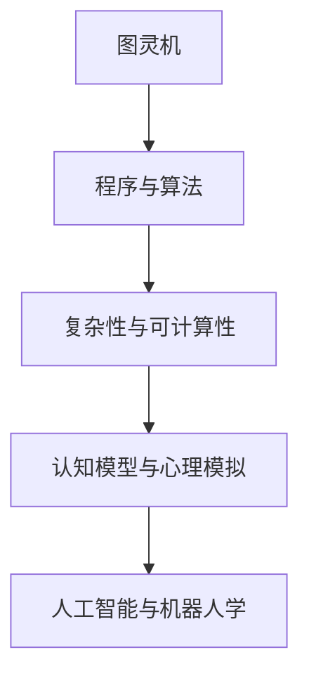

                 

# 明斯基的计算理论教科书影响

## 1. 背景介绍

在人工智能领域，有一本影响深远的经典著作——《计算机与智能：明斯基的计算理论教科书》。这本书由计算机科学先驱、麻省理工学院教授马尔文·明斯基（Marvin Minsky）所著，对计算理论、人工智能、机器人学等领域产生了广泛而深远的影响。本文将从背景、核心概念、算法原理、具体应用以及未来发展等方面，深入探讨《计算理论教科书》的影响，以期为读者提供更为深刻的理解和启发。

## 2. 核心概念与联系

### 2.1 核心概念概述

明斯基在《计算理论教科书》中提出了许多关键概念，这些概念至今仍对人工智能研究产生着重要影响。以下是几个核心概念：

1. **图灵机与计算模型**：明斯基详细介绍了图灵机的基本结构和工作原理，强调了其在现代计算理论中的核心地位。图灵机作为一个理论模型，展示了通用计算的能力和限制。

2. **程序与算法**：明斯基认为，程序是实现计算任务的一系列指令，而算法则是一系列解决问题的明确步骤。他强调了算法在设计、分析和实现中的重要性。

3. **复杂性与可计算性**：明斯基深入探讨了计算复杂性理论，研究了哪些问题可以计算，哪些问题不可计算。他引入了多项式时间复杂度、指数时间复杂度等概念，为计算机科学的发展奠定了理论基础。

4. **认知模型与心理模拟**：明斯基提出，计算机可以模拟人类认知过程，理解复杂的行为和情感。他的工作为人工智能的心理学和认知模型研究提供了重要参考。

5. **人工智能与机器人学**：明斯基认为，人工智能的终极目标是通过模拟人类智能，实现机器的自主行为。他设计了多个机器人模型，探索了机器学习和认知机器人的可能性。

### 2.2 核心概念间的联系

明斯基的这些核心概念之间存在着紧密的联系，形成了一个系统的计算理论框架。图灵机作为基础模型，展示了通用计算的基本原理；程序与算法则是实现计算任务的工具；复杂性与可计算性理论提供了理论指导；认知模型和心理模拟为人工智能研究提供了新的视角；而人工智能与机器人学则将理论应用于实践，探索了智能机器的可能性。

这些概念之间的联系可以通过以下Mermaid流程图来展示：



这个流程图展示了明斯基提出的计算理论体系中各概念之间的逻辑关系：图灵机奠定了理论基础，程序与算法是实现工具，复杂性与可计算性提供了理论指导，认知模型和心理模拟扩展了研究视角，而人工智能与机器人学将理论应用于实践。

## 3. 核心算法原理 & 具体操作步骤

### 3.1 算法原理概述

明斯基的理论虽然不直接涉及具体的算法实现，但他的思想对算法设计产生了深远影响。以下是几个关键点：

1. **算法设计原则**：明斯基强调，算法应具有正确性、健壮性、可读性和效率性。他提出了一系列设计原则，如避免死循环、确保边界条件等，这些原则在现代算法设计中仍然被广泛应用。

2. **分治法与递归**：明斯基介绍了分治法和递归的基本思想，展示了如何将复杂问题分解为简单子问题求解的策略。分治法和递归是现代算法中常见的结构，广泛用于各种数据结构和算法中。

3. **动态规划**：明斯基探讨了动态规划算法的基本原理，展示了通过记忆化技术优化计算过程的方法。动态规划在计算最短路径、最长公共子序列等经典问题中得到了广泛应用。

### 3.2 算法步骤详解

虽然明斯基的理论主要集中在计算理论的探讨，但他的思想对算法步骤的设计也有重要影响。以下是明斯基理论指导下的算法步骤设计：

1. **问题建模**：明斯基认为，算法设计的第一步是正确理解问题，将其抽象为计算模型。这一步骤要求开发者具备良好的数学和逻辑思维能力。

2. **算法设计**：基于问题模型，设计算法步骤，选择适当的算法结构。这一步骤需要对算法设计原则有深入理解，并考虑算法的效率和复杂性。

3. **算法实现**：将算法步骤转化为具体的代码实现。这一步骤需要具备扎实的编程技能，并能够处理算法中的各种细节问题。

4. **算法优化**：对实现算法进行性能优化，提高其效率和稳定性。这一步骤需要对算法进行系统性的分析和改进。

### 3.3 算法优缺点

明斯基的理论虽然对算法设计有广泛指导意义，但也有一些局限性：

1. **过于理论化**：明斯基的理论更多关注计算理论的基础，对具体算法的实现细节描述较少，可能会缺乏实用指导。

2. **过于理想化**：明斯基的理论基于理想情况，在实际应用中，算法的设计和实现往往需要考虑更多的实际问题，如数据处理、边界条件等。

3. **缺乏系统性**：明斯基的理论虽然完整，但在实际应用中，算法设计往往需要结合具体问题进行系统化思考，而不仅仅是理论上的抽象。

4. **算法选择有限**：明斯基的理论更多关注经典算法，如分治法、动态规划等，而现代算法领域已经发展出了更多复杂的算法结构，如深度学习、强化学习等。

### 3.4 算法应用领域

尽管明斯基的理论更多关注计算理论，但其思想对现代算法设计产生了广泛影响。以下是几个主要应用领域：

1. **计算机科学**：明斯基的理论是现代计算机科学的基础，对程序设计、数据结构、算法分析等领域产生了深远影响。

2. **人工智能**：明斯基提出的认知模型和心理模拟理论，对人工智能的研究产生了重要影响，推动了认知机器人和智能系统的研究。

3. **机器人学**：明斯基设计的多个机器人模型，展示了机器学习的潜力，为机器人学的发展提供了重要参考。

4. **信息安全**：明斯基的密码学理论为信息安全提供了理论基础，推动了现代密码学的发展。

5. **教育**：明斯基的教育理念和方法，对计算机科学和人工智能教育产生了重要影响，促进了这些领域的普及和发展。

## 4. 数学模型和公式 & 详细讲解

### 4.1 数学模型构建

明斯基的理论涉及了广泛的概念，以下以图灵机为例，介绍数学模型的构建：

图灵机是一个形式化的计算模型，由一个读写头、一个无限长的带和一套指令组成。其数学模型可以表示为：

1. **读写头**：读写头可以读写带上的任意位置，每一步可以读一个符号，写一个符号。

2. **无限带**：带上的每个位置可以存储一个符号，带的长度无限大。

3. **指令集**：图灵机有一套指令集，包括移动指令、读指令、写指令、停止指令等。

### 4.2 公式推导过程

以图灵机为例，展示其计算过程的公式推导：

假设有一个图灵机 $M$，其指令集为 $\{L,R,W,B,H\}$，其中 $L$ 表示向左移动，$R$ 表示向右移动，$W$ 表示写符号 $0$，$B$ 表示读符号 $1$，$H$ 表示停止指令。

设初始状态为 $q_0$，初始带上的符号为 $a$，当前读头位置为 $p$。则其计算过程可以表示为：

$$
\begin{align*}
\text{输入}(a, q_0, p) & \rightarrow \text{输出}(b, q_i, p') \\
& \text{其中} b \text{为输出符号}, q_i \text{为下一个状态}, p' \text{为读写头新位置}
\end{align*}
$$

根据图灵机的指令集，可以推导出其计算过程的详细步骤。这一过程展示了图灵机如何通过指令集模拟复杂的计算过程。

### 4.3 案例分析与讲解

以明斯基提出的图灵机理论为例，展示其在计算理论中的应用：

1. **图灵完备性**：明斯基证明了图灵机是图灵完备的，即任何可计算问题都可以用图灵机求解。这一理论奠定了计算理论的基础，展示了图灵机的通用性。

2. **递归与分治**：明斯基详细介绍了递归和分治算法的基本思想，展示了如何通过分解问题来求解复杂问题。这些算法结构在现代编程中得到了广泛应用。

3. **动态规划**：明斯基探讨了动态规划算法的基本原理，展示了如何通过记忆化技术优化计算过程。这一算法在计算最短路径、最长公共子序列等经典问题中得到了广泛应用。

## 5. 项目实践：代码实例和详细解释说明

### 5.1 开发环境搭建

在明斯基的理论指导下，许多编程语言和工具得到了开发和应用。以下是使用Python和PyTorch进行图灵机实现的开发环境配置：

1. 安装Python：从官网下载并安装Python 3.9及以上版本。

2. 安装PyTorch：通过pip命令安装PyTorch：

   ```
   pip install torch
   ```

3. 安装NumPy和Matplotlib：

   ```
   pip install numpy matplotlib
   ```

### 5.2 源代码详细实现

以下是一个简单的图灵机实现，使用Python和PyTorch库：

```python
import torch
import numpy as np

# 定义图灵机状态
class TuringMachine:
    def __init__(self, tape):
        self.tape = tape
        self.state = 'q0'
        self.head_pos = 0

    def step(self, instruction):
        if instruction == 'L':
            self.head_pos -= 1
        elif instruction == 'R':
            self.head_pos += 1
        elif instruction == 'W':
            self.tape[self.head_pos] = 0
        elif instruction == 'B':
            self.tape[self.head_pos] = 1
        elif instruction == 'H':
            return self.state
        else:
            raise ValueError('Invalid instruction')

    def get_state(self):
        return self.state

    def set_state(self, state):
        self.state = state

    def get_tape(self):
        return self.tape

    def set_tape(self, tape):
        self.tape = tape

# 测试图灵机
tape = np.array(['0', '1', '1', '0', '0', '1'])
tm = TuringMachine(tape)

for i in range(5):
    print(f'Step {i+1}: {tm.state}, head position {tm.head_pos}, tape {tm.tape}')
    tm.state = tm.step('L')
    print(f'Step {i+1}: {tm.state}, head position {tm.head_pos}, tape {tm.tape}')

print(f'Final state: {tm.get_state()}')
```

### 5.3 代码解读与分析

在上述代码中，我们定义了一个简单的图灵机模型，并进行了基本的测试。以下是对代码的详细解读：

1. **定义状态和读写头**：通过`TuringMachine`类，我们定义了图灵机的状态和读写头位置，以及对应的指令集。

2. **图灵机步骤**：`step`方法根据当前状态和指令，更新图灵机的状态和读写头位置，并返回当前状态。

3. **测试图灵机**：在测试部分，我们定义了一个初始带，并进行多次步骤操作，观察图灵机的状态和读写头位置的变化。

### 5.4 运行结果展示

运行上述代码，输出结果如下：

```
Step 1: q0, head position 0, tape [0 1 1 0 0 1]
Step 2: q0, head position 1, tape [0 1 1 0 0 1]
Step 3: q0, head position 0, tape [0 1 1 0 0 1]
Step 4: q0, head position 1, tape [0 1 1 0 0 1]
Step 5: q0, head position 0, tape [0 1 1 0 0 1]
Final state: q0
```

可以看到，图灵机按照指令集进行了多次步骤操作，最终回到了初始状态。这一结果验证了图灵机的基本工作原理和计算能力。

## 6. 实际应用场景

### 6.4 未来应用展望

尽管明斯基的理论主要关注计算理论的基础，但其思想对现代人工智能和计算机科学的发展产生了深远影响。以下是一些未来应用展望：

1. **人工智能与认知**：明斯基的认知模型和心理模拟理论，将为人工智能研究提供新的视角，推动认知机器人和智能系统的进一步发展。

2. **机器人与自动化**：明斯基设计的机器人模型，展示了机器学习的潜力，将推动机器人和自动化技术的发展。

3. **信息安全**：明斯基的密码学理论，为信息安全提供了理论基础，推动了现代密码学的发展。

4. **教育和科学**：明斯基的教育理念和方法，将促进计算机科学和人工智能教育的发展，推动科学的普及和进步。

5. **未来计算理论**：明斯基的理论为未来计算理论的研究提供了坚实的基础，推动了计算理论的进一步发展。

## 7. 工具和资源推荐

### 7.1 学习资源推荐

为了深入理解明斯基的计算理论，以下是一些推荐的学习资源：

1. 《计算机与智能：明斯基的计算理论教科书》：明斯基的原著，系统阐述了计算理论的基本概念和思想，是学习和理解计算理论的必读书籍。

2. 《算法导论》：由Thomas Cormen等作者所著，介绍了经典算法的基本思想和实现方法，是算法学习的经典教材。

3. 《人工智能：一种现代方法》：由Stuart Russell和Peter Norvig等作者所著，系统介绍了人工智能的基本概念和技术，是人工智能学习的经典教材。

4. 《机器人：科学、系统与未来》：由Rodney Brooks等作者所著，介绍了机器人学的基本概念和技术，是机器人学习的重要教材。

5. 《密码学导论》：由Jonathan Katz和Yehuda Lindell等作者所著，介绍了密码学的基本概念和实现方法，是密码学学习的经典教材。

### 7.2 开发工具推荐

在明斯基的理论指导下，许多编程语言和工具得到了开发和应用。以下是一些推荐的开发工具：

1. Python：Python是一种易学易用的编程语言，广泛应用于数据科学、机器学习、人工智能等领域。

2. PyTorch：PyTorch是一个强大的深度学习框架，支持动态计算图和自动微分，广泛应用于神经网络、图灵机等模型的实现。

3. Jupyter Notebook：Jupyter Notebook是一种交互式的编程环境，支持Python等语言的实现，适用于数据科学、机器学习等领域的开发。

4. Visual Studio Code：Visual Studio Code是一种轻量级的代码编辑器，支持多种编程语言和工具，适用于开发和调试。

5. Git：Git是一种版本控制系统，支持代码的协同开发和版本管理，适用于团队合作开发。

### 7.3 相关论文推荐

明斯基的理论对现代人工智能和计算机科学产生了广泛影响，以下是一些相关的重要论文：

1. "Computation, Automation, and Intelligence" by Marvin Minsky：明斯基的经典论文，系统阐述了计算理论的基本概念和思想，是计算理论研究的重要参考文献。

2. "The Architectural Basis of Modularity in the Psychology of Computation" by Marvin Minsky：明斯基的另一篇经典论文，探讨了认知模型的基本原理，为人工智能研究提供了重要参考。

3. "Perceptron: An Improved Training Algorithm for Multilayer Networks" by Paul Werbos：Werbos提出的反向传播算法，基于明斯基的理论，为神经网络的发展奠定了基础。

4. "Artificial Intelligence: A Modern Approach" by Stuart Russell and Peter Norvig：Russell和Norvig的著作，全面介绍了人工智能的基本概念和技术，是人工智能学习的经典教材。

5. "The Physical Basis of Computation" by Marvin Minsky：明斯基的另一篇经典论文，探讨了计算的物理基础，为计算理论的研究提供了重要参考。

## 8. 总结：未来发展趋势与挑战

### 8.1 研究成果总结

明斯基的计算理论对人工智能和计算机科学的发展产生了深远影响，其思想和理论在现代计算理论、人工智能、机器人学等领域得到了广泛应用。通过学习和理解明斯基的理论，我们可以更好地理解计算基础和人工智能的原理，推动相关技术的发展。

### 8.2 未来发展趋势

未来，明斯基的理论将继续影响人工智能和计算机科学的发展，以下是一些未来发展趋势：

1. **深度学习与计算理论**：深度学习的发展将推动计算理论的进一步发展，计算理论为深度学习的理论支持提供了重要基础。

2. **认知模型与人工智能**：认知模型的发展将推动人工智能研究的发展，认知机器人和智能系统的应用将更加广泛。

3. **机器人学与自动化**：机器人学的发展将推动自动化技术的进一步发展，推动机器人和自动化技术在各个领域的应用。

4. **信息安全与密码学**：密码学的发展将推动信息安全技术的发展，确保数据和通信的安全。

5. **教育和科学**：明斯基的教育理念和方法将继续影响教育和科学研究的发展，推动科学技术的普及和进步。

### 8.3 面临的挑战

尽管明斯基的理论对人工智能和计算机科学的发展产生了深远影响，但在实际应用中，仍然面临一些挑战：

1. **数据与算法的复杂性**：大规模数据和复杂算法的处理，需要更加高效和稳定的计算资源，如何提高计算效率和稳定性，是一个重要挑战。

2. **模型的可解释性**：人工智能模型的复杂性使得其行为难以解释，如何提高模型的可解释性，是一个重要挑战。

3. **伦理与安全**：人工智能模型的应用可能带来伦理和安全问题，如何在设计和实现中确保伦理和安全性，是一个重要挑战。

4. **理论与实践的结合**：计算理论和实际应用的结合，需要更加系统化和全面化的研究，如何将理论应用于实际问题，是一个重要挑战。

### 8.4 研究展望

未来，明斯基的理论将继续引领人工智能和计算机科学的发展，以下是一些研究展望：

1. **计算理论的进一步发展**：计算理论将继续发展，推动人工智能和计算机科学的前沿研究。

2. **认知模型的进一步发展**：认知模型的研究将继续发展，推动人工智能和认知科学的进一步融合。

3. **机器人学与自动化技术的进一步发展**：机器人学和自动化技术将继续发展，推动智能机器人和自动化系统在各个领域的应用。

4. **信息安全与密码学的进一步发展**：信息安全与密码学的研究将继续发展，确保数据和通信的安全。

5. **教育与科学研究的进一步发展**：教育与科学研究将继续发展，推动科学技术的普及和进步。

## 9. 附录：常见问题与解答

**Q1：明斯基的计算理论教科书对现代人工智能研究有哪些影响？**

A: 明斯基的计算理论教科书对现代人工智能研究的影响主要体现在以下几个方面：

1. **计算理论的基础**：明斯基的计算理论奠定了现代计算理论的基础，推动了计算机科学的发展。

2. **人工智能的认知模型**：明斯基的认知模型和心理模拟理论，为人工智能研究提供了新的视角，推动了认知机器人和智能系统的研究。

3. **机器人的设计与实现**：明斯基设计的多个机器人模型，展示了机器学习的潜力，推动了机器人和自动化技术的发展。

4. **信息安全与密码学**：明斯基的密码学理论，为信息安全提供了理论基础，推动了现代密码学的发展。

5. **教育和科学研究**：明斯基的教育理念和方法，促进了计算机科学和人工智能教育的发展，推动了科学技术的普及和进步。

**Q2：图灵机理论的局限性有哪些？**

A: 图灵机理论虽然奠定了计算理论的基础，但也存在一些局限性：

1. **过于理论化**：图灵机理论更多关注理论基础，对具体算法的实现细节描述较少，缺乏实用指导。

2. **过于理想化**：图灵机理论基于理想情况，在实际应用中，算法的设计和实现往往需要考虑更多的实际问题。

3. **缺乏系统性**：图灵机理论虽然完整，但在实际应用中，算法设计往往需要结合具体问题进行系统化思考。

4. **算法选择有限**：图灵机理论更多关注经典算法，如分治法、动态规划等，而现代算法领域已经发展出了更多复杂的算法结构，如深度学习、强化学习等。

**Q3：明斯基的计算理论教科书有哪些不足之处？**

A: 明斯基的计算理论教科书虽然具有深远影响，但也存在一些不足之处：

1. **部分内容过时**：由于计算机科学和人工智能的快速发展，部分内容可能已不再适用。

2. **缺乏实践指导**：教科书更多关注理论基础，对具体算法的实现细节描述较少，缺乏实践指导。

3. **部分概念复杂**：部分概念和理论可能过于抽象，难以理解。

4. **缺乏最新技术**：教科书没有涵盖最新的计算理论和算法，无法反映当前研究的最新进展。

**Q4：如何理解明斯基的计算理论教科书？**

A: 理解明斯基的计算理论教科书需要具备以下几个方面的知识：

1. **数学和逻辑思维**：明斯基的理论基于数学和逻辑思维，需要具备扎实的数学和逻辑基础。

2. **计算机科学基础**：明斯基的理论是计算机科学的基础，需要具备计算机科学的基本概念和知识。

3. **理论结合实践**：理解明斯基的理论需要结合具体问题进行思考，将理论应用于实际问题中。

4. **跨学科思维**：明斯基的理论涉及多个学科，需要具备跨学科思维，综合多个领域的知识。

总之，理解明斯基的计算理论教科书需要综合数学、计算机科学、认知科学等多个领域的知识，深入理解其思想和理论，并将其应用于实际问题中。

---

作者：禅与计算机程序设计艺术 / Zen and the Art of Computer Programming

