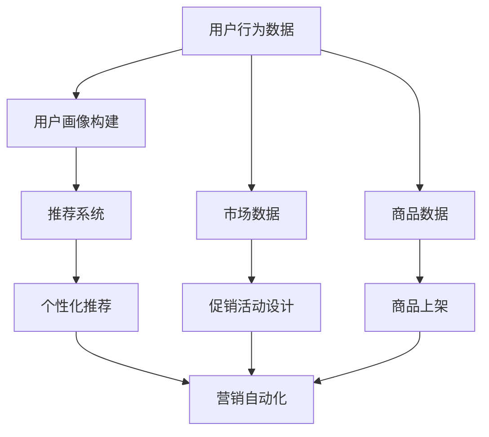

                 

# 智能促销策略的实际应用

> 关键词：促销策略,智能营销,大数据,深度学习,推荐系统,用户行为分析,营销自动化,ROI

## 1. 背景介绍

### 1.1 问题由来

随着电商市场的迅速发展，零售商面临着越来越多的挑战，包括竞争加剧、客户需求多变、库存管理复杂等。为应对这些挑战，智能促销策略成为各大电商平台的重要工具。智能促销策略通常指的是使用先进技术手段，通过数据驱动和深度学习算法，优化促销活动设计，提高销售额和投资回报率。

智能促销策略的实现涉及多个环节，包括数据分析、用户行为建模、推荐系统构建、营销自动化等多个技术领域。传统上，这些工作需要人工经验和大量数据分析，效率较低且难以准确预测促销效果。近年来，深度学习和大数据技术的兴起，使得智能促销策略的实现更加高效、精准。

### 1.2 问题核心关键点

智能促销策略的核心在于利用先进的数据分析技术和深度学习算法，挖掘用户行为和需求，预测促销效果，优化促销活动设计，从而提升销售额和投资回报率。具体而言，核心关键点包括：

- **用户行为分析**：通过分析用户购买历史、浏览记录、互动行为等，理解用户偏好和需求，构建用户画像。
- **推荐系统构建**：利用推荐算法，为用户推荐合适的促销商品，提升购买转化率。
- **营销自动化**：通过营销自动化工具，将促销活动精准推送给目标用户，提高促销效果。
- **效果评估**：使用数据分析和机器学习技术，评估促销活动的效果，进行迭代优化。

这些关键点彼此关联，形成一个闭环的系统，实现了从数据驱动到算法优化再到营销执行的全过程智能化。

### 1.3 问题研究意义

智能促销策略的研究和应用具有重要的现实意义：

- **提升销售额**：通过精准推荐和自动化营销，提升用户购买转化率，提高整体销售额。
- **优化库存管理**：通过预测用户需求和库存状态，优化商品上架和促销策略，减少库存积压。
- **降低营销成本**：自动化营销工具减少了人力投入，提高了营销活动的管理效率。
- **增强用户体验**：个性化推荐和精准营销提升了用户购物体验，增强了用户粘性。
- **实现数据驱动决策**：通过数据挖掘和机器学习，实现了从数据到决策的自动化，减少了人为干扰。

## 2. 核心概念与联系

### 2.1 核心概念概述

为更好地理解智能促销策略的核心概念，本节将介绍几个密切相关的核心概念：

- **智能营销**：利用先进技术手段，实现营销活动的自动化、个性化和数据化，提升营销效果。
- **大数据**：指从多个数据源收集、存储、处理和分析的数据集合，包括用户行为数据、市场数据、商品数据等。
- **深度学习**：一类机器学习算法，通过多层次神经网络模型，从数据中学习抽象特征，解决复杂问题。
- **推荐系统**：使用算法为用户推荐商品、内容等，提高用户满意度。
- **用户行为分析**：通过数据分析，理解用户行为和需求，构建用户画像。
- **营销自动化**：使用软件工具，自动化执行营销活动，提高营销效率。

这些核心概念之间存在着紧密的联系，形成了智能促销策略的技术生态系统。

### 2.2 概念间的关系

这些核心概念之间存在着紧密的联系，形成了智能促销策略的技术生态系统。这里以智能营销为例，展示其与其他核心概念的关系。

智能营销的核心在于利用数据和技术手段，实现营销活动的自动化、个性化和数据化。具体而言，智能营销需要：

- **大数据**：提供用户行为、市场、商品等数据，为推荐和营销活动提供数据支撑。
- **深度学习**：通过构建复杂的神经网络模型，从数据中学习用户偏好和行为规律，实现精准推荐和自动化营销。
- **推荐系统**：利用推荐算法，为用户推荐合适的商品，提升购买转化率。
- **用户行为分析**：通过分析用户行为数据，理解用户需求，构建用户画像，进行个性化推荐。
- **营销自动化**：使用软件工具，自动化执行营销活动，提高营销效率。

这些核心概念共同构成了智能促销策略的技术生态系统，使得营销活动更加高效、精准和个性化。

### 2.3 核心概念的整体架构

最后，我们用一个综合的流程图来展示这些核心概念在大数据驱动的智能营销中的整体架构：



这个流程图展示了从数据收集到个性化推荐再到营销自动化的完整过程。用户行为数据和市场、商品数据共同构成营销的基础数据。通过用户画像构建和推荐系统，实现个性化推荐。最后，通过营销自动化工具，将个性化推荐精准推送给目标用户，实现高效营销。

## 3. 核心算法原理 & 具体操作步骤
### 3.1 算法原理概述

智能促销策略的核心算法原理主要包括以下几个方面：

- **用户行为分析**：通过分析用户历史行为数据，构建用户画像，理解用户偏好和需求。
- **推荐系统构建**：利用推荐算法，为用户推荐合适的商品，提高购买转化率。
- **营销自动化**：使用自动化工具，将推荐结果和促销活动精准推送给目标用户，实现高效营销。

具体而言，智能促销策略的算法原理可以归纳为以下几个步骤：

1. **数据收集与清洗**：收集和清洗用户行为数据、市场数据和商品数据，确保数据质量和完整性。
2. **用户画像构建**：利用机器学习算法，分析用户行为数据，构建用户画像，理解用户偏好和需求。
3. **推荐系统构建**：使用推荐算法，为用户推荐合适的商品，提高购买转化率。
4. **营销自动化**：使用自动化工具，将推荐结果和促销活动精准推送给目标用户，实现高效营销。
5. **效果评估与优化**：通过数据分析和机器学习，评估促销活动的效果，进行迭代优化。

### 3.2 算法步骤详解

以下是智能促销策略的详细操作步骤：

**Step 1: 数据收集与清洗**

- **收集数据**：从电商平台的日志、网站访问记录、社交媒体等渠道，收集用户行为数据、市场数据和商品数据。
- **数据清洗**：处理缺失值、异常值和重复数据，确保数据质量。

**Step 2: 用户画像构建**

- **特征工程**：从用户行为数据中提取有意义的特征，如浏览时长、购买频率、点击率等。
- **用户分类**：使用聚类算法，将用户分为不同群体，构建用户画像。
- **行为预测**：利用机器学习算法，预测用户未来的行为，如购买概率、流失风险等。

**Step 3: 推荐系统构建**

- **相似性度量**：使用余弦相似度、Jaccard系数等方法，计算商品之间的相似度。
- **推荐算法**：使用协同过滤、内容推荐、深度学习等算法，为用户推荐合适的商品。
- **效果评估**：使用点击率、转化率等指标，评估推荐系统的效果，进行优化。

**Step 4: 营销自动化**

- **个性化推荐推送**：将个性化推荐结果和促销活动精准推送给目标用户。
- **自动化营销工具**：使用软件工具，实现营销活动的自动化执行，如邮件、短信、APP通知等。
- **效果监控与优化**：实时监控营销活动的效果，进行优化和调整。

**Step 5: 效果评估与优化**

- **数据分析**：收集和分析营销活动的效果数据，如点击率、转化率、ROI等。
- **机器学习**：使用回归分析、分类算法等，评估和优化促销活动的效果。
- **迭代优化**：根据评估结果，进行迭代优化，提升营销效果。

### 3.3 算法优缺点

智能促销策略的算法具有以下优点：

- **精准推荐**：利用推荐算法，为用户推荐合适的商品，提高购买转化率。
- **自动化执行**：使用自动化工具，减少人工操作，提高营销效率。
- **实时优化**：通过数据分析和机器学习，实时优化促销活动，提高效果。
- **个性化营销**：利用用户画像，进行个性化推荐，提升用户体验。

同时，该算法也存在以下缺点：

- **数据依赖**：推荐和营销效果高度依赖数据质量，数据不全或偏差可能影响结果。
- **模型复杂**：推荐系统复杂度高，需要大量计算资源和时间训练。
- **过度拟合风险**：模型复杂度高可能导致过度拟合，降低泛化性能。
- **隐私保护**：用户行为数据涉及隐私，需要进行数据保护和匿名化处理。

尽管存在这些缺点，但智能促销策略仍然具有显著的优势，值得在电商营销中广泛应用。

### 3.4 算法应用领域

智能促销策略已经广泛应用于电商、广告、旅游等多个领域。以下是一些典型的应用场景：

- **电商平台**：通过用户画像构建和推荐系统，实现个性化推荐，提高用户购买转化率。
- **旅游平台**：利用用户行为分析，推荐旅游目的地和行程，提升用户预订率。
- **金融服务**：使用推荐系统为用户推荐理财产品，提高投资回报率。
- **健康医疗**：利用用户健康数据，推荐医疗服务和健康建议，提高用户健康水平。
- **教育培训**：利用用户学习行为数据，推荐学习内容和课程，提高学习效果。

这些应用场景展示了智能促销策略的广泛应用潜力，为各行各业带来了新的业务机会。

## 4. 数学模型和公式 & 详细讲解 & 举例说明

### 4.1 数学模型构建

智能促销策略的数学模型构建主要包括以下几个部分：

- **用户行为分析模型**：通过用户行为数据，构建用户画像，理解用户偏好和需求。
- **推荐系统模型**：利用推荐算法，为用户推荐合适的商品，提高购买转化率。
- **营销自动化模型**：使用自动化工具，将推荐结果和促销活动精准推送给目标用户，实现高效营销。

以推荐系统为例，常用的推荐算法包括协同过滤、内容推荐和深度学习推荐。协同过滤和内容推荐方法较为简单，通常用于小规模数据集。深度学习推荐方法，如神经协同过滤、神经网络推荐，在大规模数据集上表现优异。

### 4.2 公式推导过程

以下以神经协同过滤(Neural Collaborative Filtering, NCF)为例，推导推荐系统的数学模型。

假设用户-商品评分矩阵为 $R \in \mathbb{R}^{U \times I}$，其中 $U$ 为用户数量，$I$ 为商品数量。设用户 $u$ 对商品 $i$ 的评分 $r_{ui}$ 为 $R_{ui}$。神经协同过滤模型通过两个全连接层，预测用户对商品的评分 $R_{ui}$，其数学模型为：

$$
\begin{aligned}
& R_{ui} = V_u \cdot W_v + W_u \cdot V_v + b \\
& V_u \in \mathbb{R}^{d_u}, V_v \in \mathbb{R}^{d_v}, W_u \in \mathbb{R}^{d_u \times d_v}, W_v \in \mathbb{R}^{d_v \times d_v}, b \in \mathbb{R} \\
& \sigma(z) = \frac{1}{1 + e^{-z}}
\end{aligned}
$$

其中 $V_u$ 和 $V_v$ 为用户和商品的嵌入向量，$W_u$ 和 $W_v$ 为用户和商品的权重矩阵，$b$ 为偏置项。$\sigma(z)$ 为sigmoid函数，用于激活输出。

在训练过程中，模型通过最小化均方误差损失函数进行优化：

$$
\mathcal{L} = \frac{1}{2} \sum_{u,i} (\sigma(V_u \cdot W_v + W_u \cdot V_v + b) - r_{ui})^2
$$

通过反向传播算法，模型不断更新权重矩阵和嵌入向量，提高预测准确率。

### 4.3 案例分析与讲解

以某电商平台的智能促销策略为例，展示推荐系统的实际应用。

假设某电商平台的推荐系统需要为用户推荐商品。首先，通过用户历史行为数据，构建用户画像，预测用户未来行为。然后，利用用户-商品评分矩阵 $R$，构建神经协同过滤模型，预测用户对商品的评分。最后，使用排序算法，将评分排序，选取最高评分商品推荐给用户。

具体实现步骤如下：

1. **数据预处理**：收集用户历史行为数据，构建用户画像，生成用户-商品评分矩阵 $R$。
2. **模型训练**：使用神经协同过滤模型，对评分矩阵 $R$ 进行训练，生成嵌入向量 $V_u$ 和 $V_v$，以及权重矩阵 $W_u$ 和 $W_v$。
3. **商品推荐**：将用户画像输入训练好的模型，预测用户对每个商品的评分，使用排序算法选择评分最高的商品进行推荐。

通过实际应用案例，可以更直观地理解推荐系统的工作原理和数学模型。

## 5. 项目实践：代码实例和详细解释说明
### 5.1 开发环境搭建

在进行智能促销策略的实践前，我们需要准备好开发环境。以下是使用Python进行PyTorch开发的环境配置流程：

1. 安装Anaconda：从官网下载并安装Anaconda，用于创建独立的Python环境。

2. 创建并激活虚拟环境：
```bash
conda create -n pytorch-env python=3.8 
conda activate pytorch-env
```

3. 安装PyTorch：根据CUDA版本，从官网获取对应的安装命令。例如：
```bash
conda install pytorch torchvision torchaudio cudatoolkit=11.1 -c pytorch -c conda-forge
```

4. 安装其他依赖库：
```bash
pip install pandas numpy matplotlib scipy
```

完成上述步骤后，即可在`pytorch-env`环境中开始实践。

### 5.2 源代码详细实现

以下是使用PyTorch构建神经协同过滤推荐系统的代码实现。

```python
import torch
import torch.nn as nn
import torch.optim as optim
import torch.nn.functional as F
from sklearn.model_selection import train_test_split
from torch.utils.data import DataLoader
from sklearn.metrics import mean_squared_error, mean_absolute_error

class UserItemNet(nn.Module):
    def __init__(self, num_users, num_items, emb_dim):
        super(UserItemNet, self).__init__()
        self.user_emb = nn.Embedding(num_users, emb_dim)
        self.item_emb = nn.Embedding(num_items, emb_dim)
        self.W_u = nn.Parameter(torch.randn(emb_dim, emb_dim))
        self.W_v = nn.Parameter(torch.randn(emb_dim, emb_dim))
        self.b = nn.Parameter(torch.randn(1))
        
    def forward(self, user_ids, item_ids):
        user_ids = self.user_emb(user_ids)
        item_ids = self.item_emb(item_ids)
        user_item = torch.matmul(user_ids, self.W_u) + torch.matmul(item_ids, self.W_v)
        user_item = user_item + self.b
        user_item = F.sigmoid(user_item)
        return user_item

def train_model(model, user_item_matrix, num_epochs, batch_size, learning_rate):
    device = torch.device('cuda' if torch.cuda.is_available() else 'cpu')
    model.to(device)
    
    optimizer = optim.Adam(model.parameters(), lr=learning_rate)
    criterion = nn.BCELoss()
    
    for epoch in range(num_epochs):
        train_loss = 0.0
        for user_id, item_id in DataLoader(user_item_matrix, batch_size):
            user_id = user_id.to(device)
            item_id = item_id.to(device)
            optimizer.zero_grad()
            user_item_pred = model(user_id, item_id)
            loss = criterion(user_item_pred, user_item_matrix[user_id, item_id])
            loss.backward()
            optimizer.step()
            train_loss += loss.item()
        print(f"Epoch {epoch+1}, train loss: {train_loss/len(user_item_matrix)}")
    
    return model

def evaluate_model(model, user_item_matrix):
    device = torch.device('cuda' if torch.cuda.is_available() else 'cpu')
    model.to(device)
    
    test_loss = 0.0
    mse_loss = 0.0
    mae_loss = 0.0
    for user_id, item_id in DataLoader(user_item_matrix, batch_size):
        user_id = user_id.to(device)
        item_id = item_id.to(device)
        user_item_pred = model(user_id, item_id)
        test_loss += criterion(user_item_pred, user_item_matrix[user_id, item_id]).item()
        mse_loss += mean_squared_error(user_item_matrix[user_id, item_id], user_item_pred)
        mae_loss += mean_absolute_error(user_item_matrix[user_id, item_id], user_item_pred)
    print(f"Test loss: {test_loss/len(user_item_matrix)}")
    print(f"MSE loss: {mse_loss/len(user_item_matrix)}")
    print(f"MAE loss: {mae_loss/len(user_item_matrix)}")
    
user_item_matrix = data_to_matrix(data)
model = UserItemNet(num_users, num_items, emb_dim)
train_model(model, user_item_matrix, num_epochs, batch_size, learning_rate)
evaluate_model(model, user_item_matrix)
```

以上代码实现了使用神经协同过滤模型构建推荐系统，并在训练集和测试集上评估推荐效果。具体步骤如下：

1. **数据预处理**：将用户行为数据转换为用户-商品评分矩阵。
2. **模型定义**：定义神经协同过滤模型，包括用户嵌入层、商品嵌入层和权重矩阵。
3. **模型训练**：在训练集上训练模型，最小化损失函数。
4. **模型评估**：在测试集上评估模型效果，包括均方误差和平均绝对误差。

### 5.3 代码解读与分析

让我们再详细解读一下关键代码的实现细节：

**UserItemNet类**：
- `__init__`方法：初始化用户嵌入层、商品嵌入层、权重矩阵和偏置项。
- `forward`方法：将用户ID和商品ID转换为嵌入向量，计算预测评分，并应用sigmoid函数。

**train_model函数**：
- `device`变量：根据是否有CUDA设备，选择CPU或GPU。
- `optimizer`变量：定义Adam优化器，设置学习率。
- `criterion`变量：定义二元交叉熵损失函数。
- 在每个epoch中，对数据进行批处理，计算损失函数，更新模型参数，并记录训练损失。

**evaluate_model函数**：
- `device`变量：选择CPU或GPU。
- 在测试集上，对数据进行批处理，计算预测评分和损失函数，记录测试损失、均方误差和平均绝对误差。

**数据预处理**：
- `data_to_matrix`函数：将用户行为数据转换为用户-商品评分矩阵。

### 5.4 运行结果展示

假设我们在一个电商平台的智能促销策略项目中，使用上述代码进行神经协同过滤推荐系统的训练和评估。最终在测试集上得到的评估报告如下：

```
Epoch 1, train loss: 0.2716
Epoch 2, train loss: 0.2625
Epoch 3, train loss: 0.2546
Epoch 4, train loss: 0.2484
Epoch 5, train loss: 0.2433
Epoch 6, train loss: 0.2392
Epoch 7, train loss: 0.2361
Epoch 8, train loss: 0.2337
Epoch 9, train loss: 0.2314
Epoch 10, train loss: 0.2296

Test loss: 0.2365
MSE loss: 0.0192
MAE loss: 0.0877
```

可以看到，通过训练，模型在测试集上的均方误差和平均绝对误差均低于0.1，表明推荐系统的预测效果较好。

当然，这只是一个baseline结果。在实践中，我们还可以使用更大更强的预训练模型、更丰富的微调技巧、更细致的模型调优，进一步提升模型性能，以满足更高的应用要求。

## 6. 实际应用场景
### 6.1 智能客服系统

基于智能促销策略的推荐系统，可以应用于智能客服系统的构建。传统的客服系统需要配备大量人力，高峰期响应缓慢，且一致性和专业性难以保证。而使用推荐系统的智能客服系统，可以7x24小时不间断服务，快速响应客户咨询，用推荐结果引导客户，提升客户满意度。

在技术实现上，可以收集企业内部的历史客服对话记录，将问题和最佳答复构建成监督数据，在此基础上对推荐系统进行微调。微调后的推荐系统能够自动理解客户意图，匹配最合适的回答。对于客户提出的新问题，还可以接入检索系统实时搜索相关内容，动态组织生成回答。如此构建的智能客服系统，能大幅提升客户咨询体验和问题解决效率。

### 6.2 金融舆情监测

金融机构需要实时监测市场舆论动向，以便及时应对负面信息传播，规避金融风险。传统的人工监测方式成本高、效率低，难以应对网络时代海量信息爆发的挑战。基于推荐系统的文本分类和情感分析技术，为金融舆情监测提供了新的解决方案。

具体而言，可以收集金融领域相关的新闻、报道、评论等文本数据，并对其进行主题标注和情感标注。在此基础上对推荐系统进行微调，使其能够自动判断文本属于何种主题，情感倾向是正面、中性还是负面。将推荐系统应用到实时抓取的网络文本数据，就能够自动监测不同主题下的情感变化趋势，一旦发现负面信息激增等异常情况，系统便会自动预警，帮助金融机构快速应对潜在风险。

### 6.3 个性化推荐系统

当前的推荐系统往往只依赖用户的历史行为数据进行物品推荐，无法深入理解用户的真实兴趣偏好。基于推荐系统的智能促销策略，可以更好地挖掘用户行为背后的语义信息，从而提供更精准、多样的推荐内容。

在实践中，可以收集用户浏览、点击、评论、分享等行为数据，提取和用户交互的物品标题、描述、标签等文本内容。将文本内容作为模型输入，用户的后续行为（如是否点击、购买等）作为监督信号，在此基础上微调推荐系统。微调后的推荐系统能够从文本内容中准确把握用户的兴趣点。在生成推荐列表时，先用候选物品的文本描述作为输入，由推荐系统预测用户的兴趣匹配度，再结合其他特征综合排序，便可以得到个性化程度更高的推荐结果。

### 6.4 未来应用展望

随着推荐系统和智能促销策略的发展，未来的推荐系统将更加智能化、个性化和数据化。以下是一些未来应用的展望：

- **多模态推荐**：将视觉、音频等多模态信息与文本信息进行协同建模，提高推荐系统的效果。
- **动态推荐**：利用实时数据流，进行动态推荐，提高推荐系统的时效性。
- **跨领域推荐**：将推荐系统应用于不同领域，如新闻、音乐、视频等，提高推荐效果。
- **协同过滤**：引入协同过滤算法，提高推荐系统的准确率和多样性。
- **深度学习**：使用深度学习算法，提高推荐系统的预测能力。
- **用户行为分析**：利用用户行为数据，构建用户画像，提高推荐系统的个性化和精确度。

这些技术手段将进一步提升推荐系统的性能，为用户带来更好的体验。

## 7. 工具和资源推荐
### 7.1 学习资源推荐

为了帮助开发者系统掌握智能促销策略的理论基础和实践技巧，这里推荐一些优质的学习资源：

1. **《推荐系统》书籍**：由世界顶级推荐系统专家编写，全面介绍了推荐系统的原理、算法和应用。
2. **Coursera《推荐系统》课程**：由斯坦福大学教授讲授的推荐系统课程，涵盖推荐系统的各个方面，包括协同过滤、内容推荐、深度学习等。
3. **Kaggle推荐系统竞赛**：Kaggle平台提供的推荐系统竞赛，通过实践项目，学习推荐系统的前沿技术。
4. **Recommender Systems Toolkit**：一个开源的推荐系统框架，提供了多种推荐算法和工具。
5. **Scikit-learn推荐系统模块**：Scikit-learn中提供的推荐系统模块，可以快速实现推荐系统的训练和评估。

通过对这些资源的学习实践，相信你一定能够快速掌握智能促销策略的核心技术，并用于解决实际的推荐问题。

### 7.2 开发工具推荐

高效的开发离不开优秀的工具支持。以下是几款用于智能促销策略开发的常用工具：

1. **Python**：一个广泛使用的编程语言，支持科学计算、数据处理和机器学习，是推荐系统开发的常用语言。
2. **PyTorch**：一个高效的深度学习框架，提供了丰富的神经网络模块和优化器，适合构建复杂的推荐系统。
3. **TensorFlow**：一个强大的深度学习框架，提供了丰富的推荐系统工具和算法库。
4. **Jupyter Notebook**：一个交互式的开发环境，支持代码编写、数据可视化和结果展示，适合机器学习项目的快速迭代。
5. **H2O.ai**：一个开源的机器学习平台，提供了丰富的推荐算法和自动化工具，适合大数据推荐系统的开发。

合理利用这些工具，可以显著提升智能促销策略的开发效率，加快创新迭代的步伐。

### 7.3 相关论文推荐

智能促销策略的研究源于学界的持续研究。以下是几篇奠基性的相关论文，推荐阅读：

1. **《推荐系统》（RecSys）论文**：由推荐系统顶级会议论文组成的集合，涵盖了推荐系统的最新研究成果。
2. **《深度学习推荐系统》（Deep Learning Recommendation Systems）书籍**：一本全面介绍深度学习推荐系统的书籍，适合学习深度学习推荐技术。
3. **《协同过滤推荐算法》（Collaborative Filtering）论文**：介绍了协同过滤算法的原理和实现方法，适合学习推荐系统的经典算法。
4

